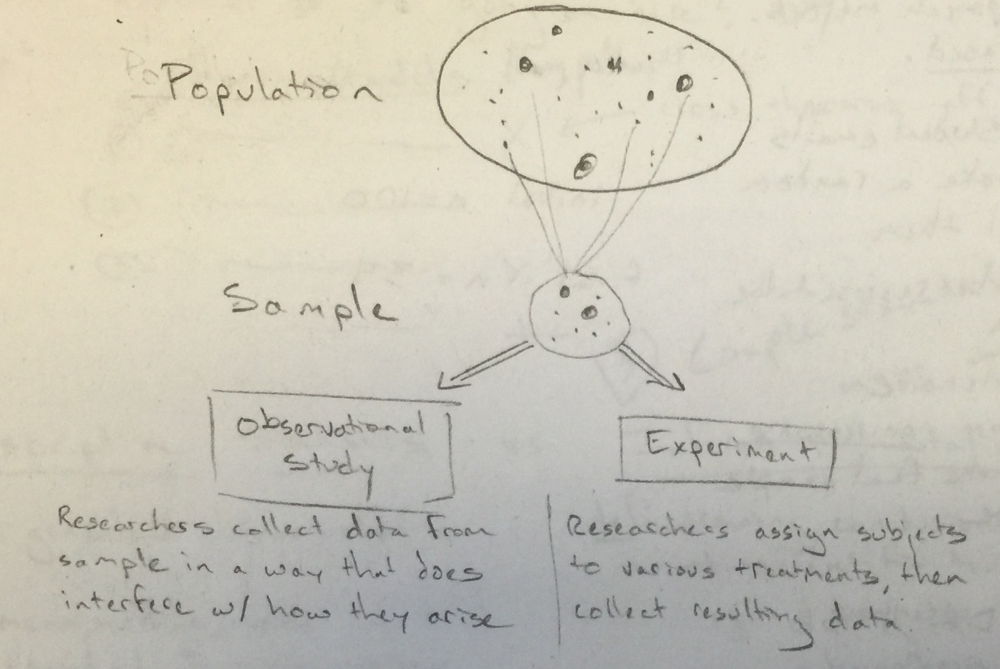

***

0. Pass out plicker cards (Show class roster on Plickers.com)

  - Evening help sessions (L318 on Sunday and Thursdays from 7-9 PM)

0. Ask how lab-1 went

  - Knit solutions

1. Recap from last time

  - **Write on board** - The power of statistics is in what you can learn about large populations from potentially <s>small samples</s> small WELL-CHOSEN samples.
  
  - Draw Population - Sample diagram to Observation Study and Experiment

  
  
2. Go over difference between SRS and Stratified in slides

  - In what situations does Stratification provide a more representative sample?
  - Stratified sampling is especially useful when the cases in each stratum are very similar
with respect to the outcome of interest.
  - Allows for minority groups to have a say in the process where they may be missed by SRS

3.  Andrew Bray believes that students who buy the textbook get better grades, on average

  - He conducts a study as follows.
  - Draw table with `book`, `grade` and ask if anything is missing
  - Many other factors here but what happens if we add mindset (fixed / growth)
  - Is this an observational study? Yes
  - Write OBS above table

4. Extend diagram to include Observational Study + description

  - Researchers collect data from sample in a way that allows confounding variables to have an influence
  
5. How could we change this to be an experiment?

  - Redraw table (book - Y, Y, Y, N, N; mindset: Y, N, N, Y, N
  - Randomly assign whether someone receives the textbook or not
  - Then examine average grade for the two groups
  - How is this different?
  - Random assignment removes 
  
6. Extend diagram to include Experiment  + description

  - Researchers assign subjects to various treatments, then collect resulting data
  
7. We can use observational studies to look at associations between variables.  But can we extend that idea?

  - Click through Spurious Correlations
  - Ask why this comic is funny
  
8. Plicker time!

9. Give handout.

  - Have them work on handout for 10-15 minutes
  - Reconvene and discuss some problems
  - Go over remaining slides