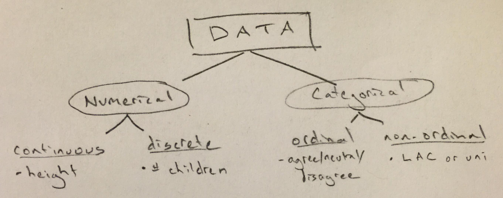

***

1. Load initial course slide

2. Hand out notecards in colors
  - 6 reds, 6 yellow, 6 blue, red, yellow, blue, etc.
  - Don't write anything on the cards yet
  - Meet with two other people with cards in different colors than you
  - Two of you will be interviewing the third person who will be introducing themselves to you and then rotating
  - You will use both the front and the back of the cards to include information about the two other people in your group
  
3. Who travelled the furthest from Reed over winter break?
  - Who has the most interesting fact?
  
3. Have them go around the room and introduce themselves and their own interesting fact (I'll try to know everyone's name by Wednesday)

4. Go over questions myself
  - Go to next slide with notebook photo
  - Talk about my background
  - Talk about living in Forest Grove and my position
  
5. Give them chance to ask me three more questions about me

5. What have we just done?  We've collected lots of different types of data.

  - Draw DATA diagram on chalkboard

6. Identify what type each of the variables on your notecards is

7. Why is this classification useful?
  - The type of data will help us steer visualizations and modeling
  - Certain types of analysis only work when comparing continuous data grouped by a categorical variable, for example
  
8. Load up my website <http://ismayc.github.io>
  - Direct to Teaching, this course link

9. Go briefly over syllabus
    - Urge you to come to my office hours or schedule an appointment with me
    - I check my email frequently and will respond back to you as soon as I can
    - **In person conversations are the best way for us to discuss material**
    - If my hours don't work for you, Andrew would be happy to help you as well, but try to reach me first if possible
    - The textbook is available for free online but I suggest you buy (or print out) a physical copy
    - The brain is much better at making connections with topics if written down instead of typed
    - Encourage you to work with others on completing homework assignments and discussing course content
    - Tutors are also available on Sunday, Wednesday, and Thursday evenings
    - Problem Set 1 is available and will be due next Monday at the beginning of class

10. Talk about labs
  - Is everyone registered for a Tuesday lab?
  - In the labs we will be using R to work with data and go over the content from these lecture sessions
  - Labs will be due at 11:59 PM on Thursdays

11. Go back to the main page
  - A breakdown of what we cover each class period will be available here
  - Andrew and I hope that our two sections are in parallel as much as possible
  - Please watch the two videos linked here before lab tomorrow
      - It will make lab **A LOT** less frustrating if you watch these first!
  - Read the first 12 pages of the textbook for Wednesday

12. Click to first map
    - What do you think the original data would look like as a spreadsheet?
        - Original data contains discrete `kidney_cancer_deaths` and discrete `county_population` for each county
        - It contains another column: `death_rate` = `kidney_cancer_deaths`/`county_population`
            - What type of data is `death_rate`?
    - How was this map created?
        1. Identify $n$ counties with largest death rate
        2. Shade that county black
    - Is there a pattern?
        - What scientific inferences can be made based on the map? (Agrochemicals?)

13. Click to second map
    - So highest and lowest rates occur in rural counties.  Why?
    - Small populations are bound to have extreme rates.
    
14. Brief introduction into what we will be doing this semester

