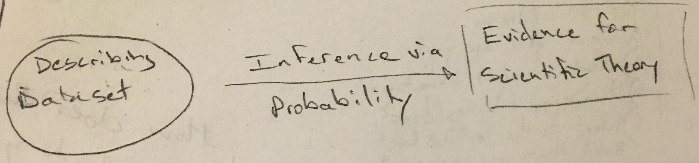

***

0. Pass out plicker cards

1. Recap from last time

2. Topic for today:  How can we use data collection for inference?
  - In other words, how can we use data to make models to understand how the world is working?

3. Click to first slide
  - What appears to be going on here?  Explain to me what's happening
  - Put Theories/Model/Hypotheses on the board
    - Record what they think is going on
  - Many different theories could explain what's going on in this photo  

4.  A couple seconds later, this photo was taken (second slide)
  - Now what do you think is happening?
    - Is this still possible?  X out ones that aren't

5. Go to last shoebill slide
  - What theories/hypotheses are still consistent?
  - This series of photos was taken at the San Diego Animal Park by a physician from Stanford who is also a photographer
  - The shoebill (an African bird) is walking down a path in the grass and comes across a little duck in its way.  So it picks it up, moves it, and drops it out of its way
  
6. How does this apply to this course?
  - This is exactly what we deal with when we discuss inference
  - What do I mean by that?
    - We have models for what we think is happening
    - We can collect data to give us a better sense of what is happening
    - We continuously assess whether our data is consistent with what we initially hypothesized (what we assumed to be true)
    - Does this sound familiar to some of you?  This is very similar to what we will say when we conduct hypothesis tests.
    
7. Write Descriptive Statistics vs Inferential Statistics on the board
  - How would you define these terms?
  - **Descriptive** - numerical and graphical summaries of a data set (usually a sample)
  - **Inferential** - drawing conclusions about populations or scientific truths from data
  - What are some examples of descriptive and inferential statistics?
    - Remind them that inferences are HIGHLY dependent on the source of the data / quality of data collection methods
    
8. Go to <www.plickers.com>
  - Talk about peer instruction and active learning
  - Testing it out now but will try to create some harder problems in the future
  - Open Plickers app on iPhone
  - Go over two MC questions
  
9. Discuss terminology slide

10. Cooking as sampling (PUT ON BOARD)
  - How does sampling relate to cooking/eating soup?
  - To evaluate if the soup is good, you taste a spoonful/sample.
  - If you find that spoonful to be too bland, you've done **descriptive statistics**.
  - If you conclude the whole soup needs salt, you've made an **inference**.
  - For the inference to be valid, the spoonful/sample needs to be **representative** of the pot/population.

11. Go to Sampling considerations slide
  - What's $N$?
  - **A**:  Easy, + potentially large sample, - sample may contain more seniors/psych majors (biased)
  - **B**:  Difficult, + sample should be representative (unbiased), - may suffer from non-response which might make final sample not representative
  - Alternative strategies?
  
12. Go to Landon/FDR slide
  - In 1936, Alf Landon was the Republican candidate against the Democratic candidate Franklin Delano Roosevelt

13. Next slide
  - In one of the largest (and probably most expensive) polls in American history, _Literary Digest_ (a famous respected magazine at the time) polled 10 million Americans
  - What do you think went wrong?
  
14. They had an extremely biased sample

15. **Write on board** - The power of statistics is in what you can learn about large populations from potentially ~small samples~ small WELL-CHOSEN samples.