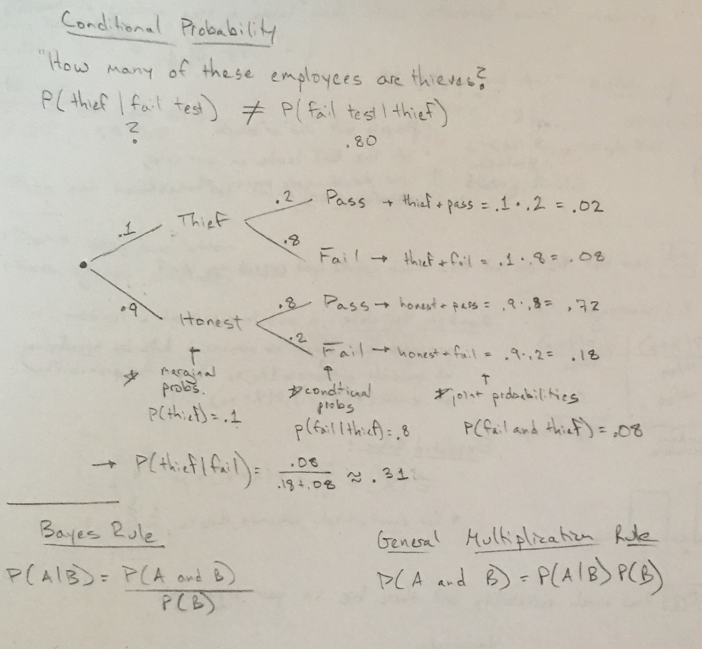
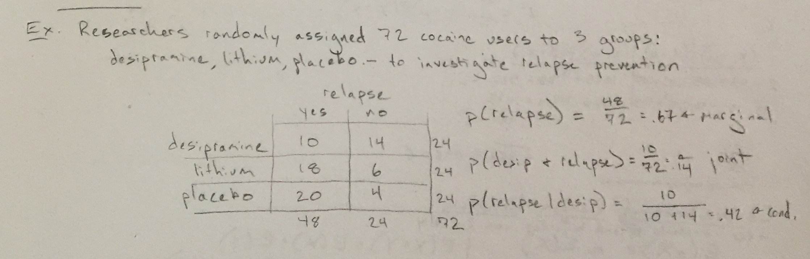

***

```{r setup, include=FALSE}
# List of useful packages
pkg <- c("dplyr", "ggplot2", "knitr")

# Check if packages are not installed and assign the
# names of the uninstalled packages to the variable new.pkg
new.pkg <- pkg[!(pkg %in% installed.packages())]

# If there are any packages in the list that aren't installed,
# install them
if (length(new.pkg)) {
  install.packages(new.pkg, repos = "http://cran.rstudio.com")
}

# Load the packages into the current environment
library(knitr)
library(dplyr)
library(ggplot2)

# Set number of digits to display
options(digits = 3)
```

1. Remind them I will be gone next Monday and Wednesday
  - Meeting in Physics 123
  - Likely quiz over Probability NEXT Friday

2. Recap of last time
  - Probability/Law of Large Numbers
  - General Addition/Disjoint

3. Honest Liar slides

4. Go over Prob Tree:



2. Plicker Q1

3. Back to slides

4. Go over extra example if time

