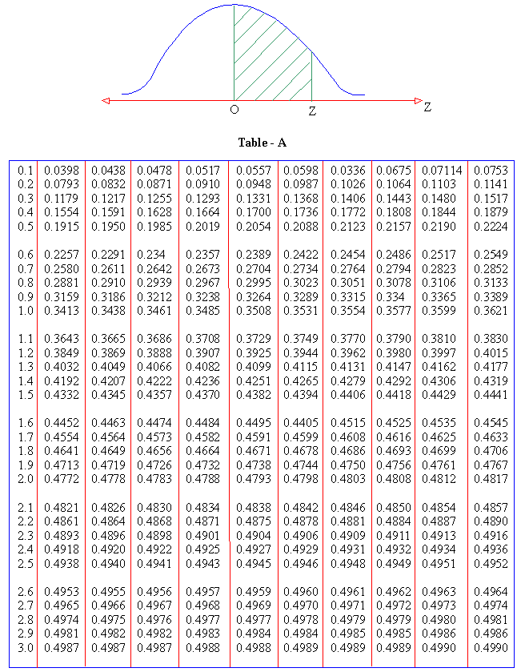

## My story teaching Intro Stats

### Grad school

```{r setup, include=FALSE}
# devtools::install_github("yihui/xaringan")
library(tidyverse)
library(knitr)
library(magick)
library(magrittr)
library(okcupiddata)
data(profiles)
options(htmltools.dir.version = FALSE)
knitr::opts_chunk$set(echo = FALSE)
```

  |   
:-------------------------:|:-------------------------:

---

## My story teaching Intro Stats

### Grad school

  |   
:-------------------------:|:-------------------------:

---

## My story teaching Intro Stats

### Tenure-track stats prof

```{r}

```

---

## My story teaching Intro Stats

### Tenure-track stats prof

```{r fig.align="center"}
knitr::include_graphics("images/statkey.png", dpi = 180)
```

---

class: center, middle

# But something was missing...

---

class: center, middle

```{r}

```

---

class: center, middle

```{r}
reed <- image_read("images/reed2.png")
r_logo <- image_read("images/Rlogo.png")
r_logo_tiny <- image_rotate(image_scale(image_background(r_logo, "none"), "x80"), 280)
r_in_reed <- image_composite(image_scale(reed, "x400"), r_logo_tiny, offset = "+26+135")
image_write(r_in_reed, "images/magick/r_in_reed.png", format = "png")
include_graphics("images/magick/r_in_reed.png", dpi = 50)
```

---

class: center, middle

# My story teaching Intro Stats

  |   
:-------------------------:|:-------------------------:

---

class: center, middle

# ModernDive

## An Introduction to Statistical and Data Sciences via R

***

## [ModernDive.com](http://moderndive.com)

OR

## [ModernDive.org]((http://moderndive.com)

---

class: center, middle

# Why is this needed?

---

## Guiding Principles of ModernDive

## 1. Blur the lines between lecture and lab

```{r out.width="75%"}
knitr::include_graphics("images/giphy1.gif")
```


---

## 2. Focus on the data/science research pipeline

```{r out.width="100%"}
knitr::include_graphics("images/hadley.png")
```

---

## 3. It's all about the data

### - Use the `tidyverse` with rich, interesting, open data sets

```{r out.width="100%", fig.align='center'}
gg <- image_read("images/ggplot2.png") %>% 
  image_background("none")
dpl <- image_read("images/dplyr.png") %>% 
  image_background("none")
br <- image_read("images/broom.png") %>% 
  image_background("none")
rmd <- image_read("images/rmarkdown.png") %>% 
  image_background("none")
rs <- image_read("images/rstudio.png") %>% 
  image_background("none")
hex <- c(gg, dpl, br, rmd, rs)
hex_side <- image_append(hex)
image_write(hex_side, "images/magick/hex_side.png", format = "png")
knitr::include_graphics("images/magick/hex_side.png", dpi = 50)
```

```{r eval=FALSE, echo=TRUE}
library(nycflights13)
library(ggplot2movies)
library(okcupiddata)
library(gapminder)
library(babynames)
```


---

## 4. Use simulation/resampling not probability/large sample approximation

### - Reinforce concepts, not equations, formulas, and probability tables

### - Have data visualization be the driver

```{r, fig.align="center"}
knitr::include_graphics("images/ht.png", dpi = 180)
```

---

## 5. Don’t fence off students from the computation pool, throw them in!

### - Scaffold & support as a good foreign language professor would

```{r out.width="80%", fig.align='center'}

```

---

## 6. Complete reproducibility with `bookdown`

### - Put it all out there

### - Ultimately the best textbook is one you’ve written yourself

```{r out.width="80%", fig.align='center'}

```

---

class: center, middle

# Teaching the `tidyverse`

---

## Introducing students to <small>`ggplot2`</small>

```{r}
simple_ex <- data_frame(
    A = c(1, 2, 3, 4),
    B = c(1, 2, 3, 4),
    C = c(3, 2, 1, 2),
    D = c("a", "a", "b", "b")
  )
```

```{r echo=TRUE, eval=FALSE}
ggplot(data = simple_ex, mapping = aes(x = A, y = B)) + 
  geom_point()
```

---

## Introducing students to <small>`ggplot2`</small>

```{r}
simple_ex <- data_frame(
    A = c(1, 2, 3, 4),
    B = c(1, 2, 3, 4),
    C = c(3, 2, 1, 2),
    D = c("a", "a", "b", "b")
  )
```

```{r echo=TRUE, eval=FALSE}
ggplot(data = simple_ex, mapping = aes(x = A, y = B)) + 
  geom_point()
```

Image here with data set

---

## Teaching the Grammar of Graphics via chalk talk

```{r, eval=FALSE, echo=TRUE}
ggplot(data = simple_ex, mapping = aes(x = A, y = B, color = D)) + 
  geom_point()
```

---

## Teaching the Grammar of Graphics via chalk talk

```{r, eval=FALSE, echo=TRUE}
ggplot(data = simple_ex, mapping = aes(x = A, y = B, color = D)) + 
  geom_point()
```


Image here with data set

---

## Reverse engineering

- What `dplyr` and `ggplot2` code is needed to produce this plot using the `profiles` data frame in `okcupiddata`?

```{r fig.width = 9, fig.height = 5.5}
profiles %>% 
  filter(between(age, 20, 50)) %>% 
  ggplot(mapping = aes(x = status, y = age)) +
  geom_boxplot() +
  facet_wrap(~sex) +
  coord_flip() +
  labs(y = "20 < age < 50", x = "status\n") +
  theme(text = element_text(size = 25))
```

<!--
- What effective data stories can you tell with this data based on the distributions above for males and females?
-->

---

## Why use `bookdown` 

### - Rapid iteration and easily-updateable
###  - Exports book to multiple formats
###  - Slick cross-references
###  - Textbook has versions not editions
###  - Wikipedia model for intro stats/data science

---

class: center, middle

# Finding great, interesting, accessible data sets is hard

```{r, out.width="60%"}
include_graphics("images/saul.gif")
```


---

# Debuting <small>`fivethirtyeight`</small> 

```{r, out.width="100%"}

```

---

## Features of <small>`fivethirtyeight`</small>  

***

### Data sets that balance being

### - **rich enough** to answer meaningful questions with, 
### - **real enough** to ensure that there is context, and 
### - **realistic enough** to convey to students that data as it exists <br> "in the wild" often needs processing.

---

## What's to come

### Add more interactive shiny apps into the book

### Create more Review Questions at chapter ends using <small>`fivethirtyeight`</small> and other open data sources

### Design and share instructor resources

### Create DataCamp course to supplement and assist with more immediate feedback

<!--
pseudocode, sketch out the drawings, 

Distinguish the how from the what
What is the focus


Story of teaching intro stats
Making stats not math anymore
  - Make it computation	

Why we did this

And this is how we teach dplyr and ggplot2
  - The verb is the command
  - Put tickmarks throughout the book to differentiate the language
  - The slow patient approach on the blackboard
  - what (no R code) from the how (or any other implementation of the graphics - plotly, tableau)
  - forward engineering and reverse engineer

Why Bookdown 
  - rapid iteration
  - Exports to multiple formats
  - Cross-references
  - Easily-updateable
  - Versions not editions (continual improvement)
  - Software engineering principles bringing it to books in subjects that lend well
      - Maybe not theory-stats
  - Following Hadley's paradigm of wikipedia for intro stats/data science

fivethirtyeight
  - Released to CRAN on ...
  - finding relevant, interesting data sets
  - tidy data principle manifesto for intro stats
  - R packages are excellent for distributing data
  - Example problem

Contribute
Remember back to when you were first learning R
  - What do you wish you knew then that you know now
  - What should we tell our students?
  - Fix our stuff!
    - No graduate students and no grants

What’s wrong with the textbook industry?  Maybe this is a solution

-->

---

# Thanks!

- Slides created via the R package [**xaringan**](https://github.com/yihui/xaringan) by Yihui Xie.

- [ModernDive.com](http://www.moderndive.com)

- Fork our GitHub repository at <br> <https://github.com/ismayc/moderndiver-book>

    - Please feel free to modify the book as you wish for your own needs! All we ask is that you
list the authors as "Chester Ismay, Albert Y. Kim, and **YOU**!"

- Fill out our Google Form to receive updates at <br> <http://bit.ly/moderndive-users>

- Email us at <chester@moderndive.com> or <albert@moderndive.com>

- Getting Used to R, RStudio, and R Markdown book at <https://ismayc.github.io/rbasics-book/>
