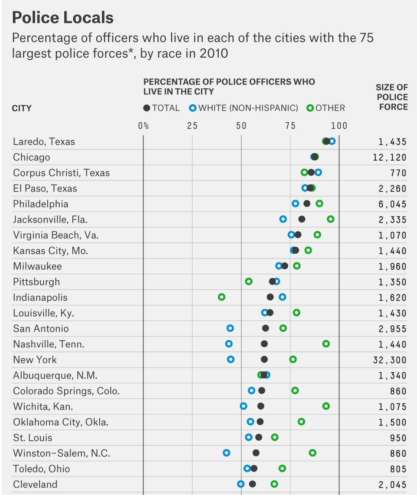

## My story teaching Intro Stats

### Grad school

```{r setup, include=FALSE}
# devtools::install_github("yihui/xaringan")
library(tidyverse)
library(knitr)
library(magick)
library(magrittr)
library(okcupiddata)
data(profiles)
options(htmltools.dir.version = FALSE)
knitr::opts_chunk$set(echo = FALSE)
```

  |   
:-------------------------:|:-------------------------:

---

## My story teaching Intro Stats

### Grad school

  |   
:-------------------------:|:-------------------------:

---

## My story teaching Intro Stats

### Tenure-track stats prof

```{r}

```

---

## My story teaching Intro Stats

### Tenure-track stats prof

```{r fig.align="center"}
knitr::include_graphics("images/statkey.png", dpi = 180)
```

---

class: center, middle

# But something was missing...

---

class: center, middle

```{r}

```

---

class: center, middle

```{r}
reed <- image_read("images/reed2.png")
r_logo <- image_read("images/Rlogo.png")
r_logo_tiny <- image_rotate(image_scale(image_background(r_logo, "none"), "x80"), 280)
r_in_reed <- image_composite(image_scale(reed, "x400"), r_logo_tiny, offset = "+26+135")
image_write(r_in_reed, "images/magick/r_in_reed.png", format = "png")
include_graphics("images/magick/r_in_reed.png", dpi = 50)
```

---

class: center, middle

# My story teaching Intro Stats

  |   
:-------------------------:|:-------------------------:

---

class: center, middle

# ModernDive

## An Introduction to Statistical and Data Sciences via R

***

## [ModernDive.com](http://moderndive.com)

OR

## [ModernDive.org]((http://moderndive.com)

---

class: center, middle

# Why is this needed?

---

## Guiding Principles of ModernDive

## 1. Blur the lines between lecture and lab

```{r out.width="75%"}

```


---

## 2. Focus on the data/science research pipeline

```{r out.width="100%"}
knitr::include_graphics("images/hadley.png")
```

---

## 3. It's all about the data

### - Use the `tidyverse` with rich, interesting, open data sets

```{r out.width="100%", fig.align='center'}
gg <- image_read("images/ggplot2.png") %>% 
  image_background("none")
dpl <- image_read("images/dplyr.png") %>% 
  image_background("none")
br <- image_read("images/broom.png") %>% 
  image_background("none")
rmd <- image_read("images/rmarkdown.png") %>% 
  image_background("none")
rs <- image_read("images/rstudio.png") %>% 
  image_background("none")
hex <- c(gg, dpl, br, rmd, rs)
hex_side <- image_append(hex)
image_write(hex_side, "images/magick/hex_side.png", format = "png")
knitr::include_graphics("images/magick/hex_side.png", dpi = 50)
```

```{r eval=FALSE, echo=TRUE}
library(nycflights13)
library(ggplot2movies)
library(okcupiddata)
library(gapminder)
library(babynames)
```


---

## 4. Use simulation/resampling not probability/large sample approximation

### - Reinforce concepts, not equations, formulas, and probability tables

<!--
### - Have data visualization be the driver
-->

```{r, fig.align="center"}
knitr::include_graphics("images/tdist.png", dpi = 180)
```

---
## 4. Use simulation/resampling not probability/large sample approximation

### - Reinforce concepts, not equations, formulas, and probability tables

### - Have data visualization be the driver

```{r, fig.align="center"}
knitr::include_graphics("images/ht.png", dpi = 180)
```

---


## 5. Don’t fence off students from the computation pool, throw them in!

### - Scaffold & support as a good foreign language professor would

```{r out.width="80%", fig.align='center'}
knitr::include_graphics("images/giphy2.gif")
```

---

## 6. Complete reproducibility with `bookdown`

### - Put it all out there

### - Ultimately the best textbook is one you’ve written yourself

```{r out.width="80%", fig.align='center'}
knitr::include_graphics("images/precious.gif")
```

---

class: center, middle

# Teaching the `tidyverse`

---

## Introducing students to <small>`ggplot2`</small>

```{r}
simple_ex <- data_frame(
    A = c(1, 2, 3, 4),
    B = c(1, 2, 3, 4),
    C = c(3, 2, 1, 2),
    D = c("a", "a", "b", "b")
  )
```

```{r echo=TRUE, eval=FALSE}
ggplot(data = simple_ex, mapping = aes(x = A, y = B)) + 
  geom_point()
```

---

## Introducing students to <small>`ggplot2`</small>

```{r}
simple_ex <- data_frame(
    A = c(1, 2, 3, 4),
    B = c(1, 2, 3, 4),
    C = c(3, 2, 1, 2),
    D = c("a", "a", "b", "b")
  )
```

```{r echo=TRUE, eval=FALSE}
ggplot(data = simple_ex, mapping = aes(x = A, y = B)) + 
  geom_point()
```

```{r out.width="85%", fig.align="center"}
include_graphics("images/basic1.tiff")
```


---

## Teaching the Grammar of Graphics via "chalk talk"

```{r, eval=FALSE, echo=TRUE}
ggplot(data = simple_ex, mapping = aes(x = A, y = B, color = D)) + 
  geom_point()
```

```{r out.width="85%", fig.align="center"}
include_graphics("images/basic1.tiff")
```


---

## Teaching the Grammar of Graphics via chalk talk

```{r, eval=FALSE, echo=TRUE}
ggplot(data = simple_ex, mapping = aes(x = A, y = B, color = D)) + 
  geom_point()
```


```{r out.width="60%", fig.align="center"}
include_graphics("images/color.tiff")
```


---

## `dplyr` diagrams

```{r out.width="95%", fig.align="center"}
include_graphics("images/dplyrchalk.tiff")
```


---

## Reverse engineering

- What `dplyr` and `ggplot2` code is needed to produce this plot using the `profiles` data frame in `okcupiddata`?

```{r fig.width = 9, fig.height = 5.5}
profiles %>% 
  filter(between(age, 20, 50)) %>% 
  ggplot(mapping = aes(x = status, y = age)) +
  geom_boxplot() +
  facet_wrap(~sex) +
  coord_flip() +
  labs(y = "20 < age < 50", x = "status\n") +
  theme(text = element_text(size = 25))
```

<!--
- What effective data stories can you tell with this data based on the distributions above for males and females?
-->

---

## Why use `bookdown` 

### - Rapid iteration and easily-updateable
###  - Exports book to multiple formats
###  - Slick cross-references
###  - Textbook has versions not editions
###  - Wikipedia model for intro stats/data science

---

class: center, middle

# Finding great, interesting, accessible data sets is hard

```{r, out.width="60%"}

```


---

# Debuting <small>`fivethirtyeight`</small> 

```{r, out.width="100%"}
include_graphics("images/fallon.gif")
```

---

## Features of <small>`fivethirtyeight`</small>  

### Data sets that balance being

### - **rich enough** to answer meaningful questions with, 
### - **real enough** to ensure that there is context, and 
### - **realistic enough** to convey to students that data as it exists <br> "in the wild" often needs processing.

---

## Features of <small>`fivethirtyeight`</small>  

<small><https://fivethirtyeight.com/datalab/most-police-dont-live-in-the-cities-they-serve/></small>

```{r eval=FALSE, echo=TRUE}
library(fivethirtyeight)
data(police_locals)
```


```{r out.width="90%"}

```


---

## What's to come

### Add more interactive shiny apps into the book

### Create more Review Questions at chapter ends using <small>`fivethirtyeight`</small> and other open data sources

### Design and share instructor resources

### Create DataCamp course to supplement and assist with more immediate feedback

---

# [ModernDive.com](http://www.moderndive.com)

- Slides created via the R package [**xaringan**](https://github.com/yihui/xaringan) by Yihui Xie.

- Fork our GitHub repository at <br> <https://github.com/ismayc/moderndiver-book>

    - Please feel free to modify the book as you wish for your own needs! (CC0 1.0 Universal License) All we ask is that you
list the authors as "Chester Ismay, Albert Y. Kim, and **YOU**!"

- Fill out Google Form to receive updates at <http://bit.ly/moderndive-users>

- Email us at <chester@moderndive.com> or <albert@moderndive.com>

- Getting Used to R, RStudio, and R Markdown book <br> <https://ismayc.github.io/rbasics-book/>

***

These slides available at <http://bit.ly/rstudioconf17>

Slides source code available at <https://github.com/ismayc/rstudioconf>
