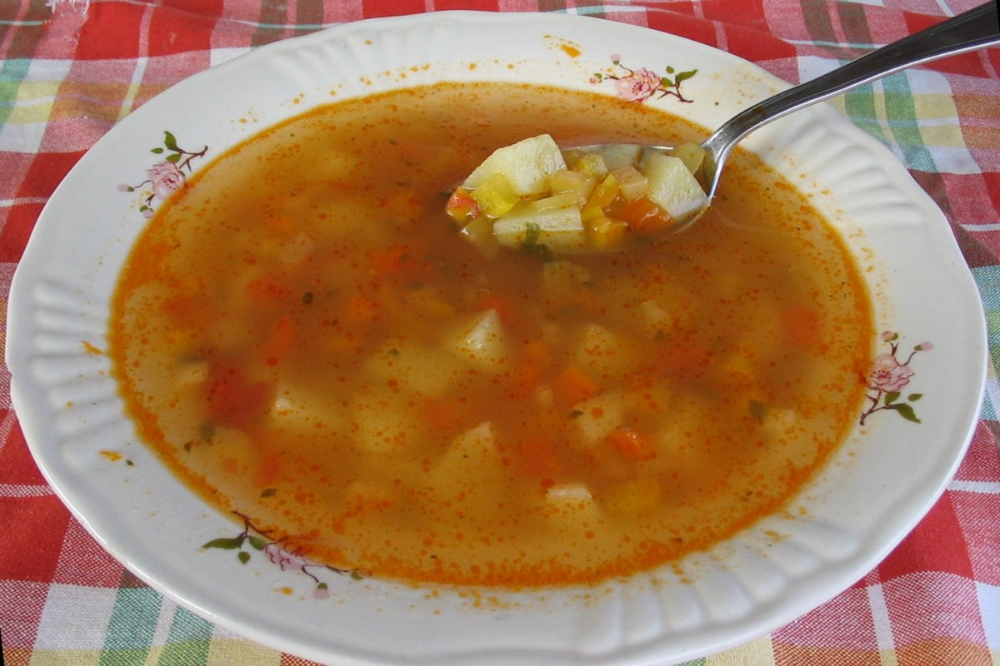
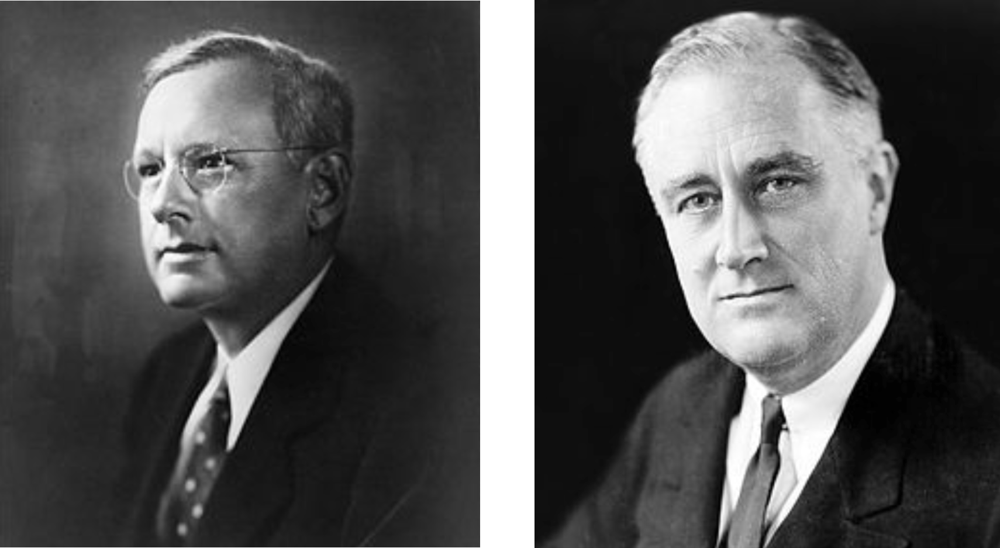

# MATH 141
Chester Ismay  

## {.flexbox .vcenter}

## {.flexbox .vcenter}

## {.flexbox .vcenter}

# Plicker time!

## Principles of Data Collection for Inference {.build}

**case/observational unit** - the individual unit on which you make observations (a row in a data frame) [In `arbuthnot` data set, case is `year`]

**population** - the target group of observational units about which you'd like to make inferences [size of the population: $N$]
  
**sample** - a subset of the population on which you have data [size of the sample: $n$]
  
**anecdote** - very small sample of data collected haphazardly [usually $n = 1$]
  
**census** - sample = population [complex, expensive, and sometimes impossible to achieve]

## Cooking as Sampling {.flexbox .vcenter}

## Sampling considerations

You're a senior Psychology major conducting a study that examines procrastination among Reed students.  How should you select a sample?

<ol type="A">
  <li>Post a link to your survey on your Facebook page 
    
- $n \approx 400$</li>
    
  <li>Get a list of Reed student emails from the Registrar, take a simple random sample (SRS), and email that sample
    
- Initial $n = 100$, Final $n = 34$
    
  </li>
</ol>

## {.flexbox .vcenter}

## Landon v. FDR, 1936

_Literary Digest_ polled 10 million Americans, 2.4 million responded.

$N = 128$ million, $n = 2.4$ million

**Prediction**: 43% for FDR

**Result**: 62% for FDR

## What went wrong? {.build}

_Literary Digest_ surveyed

- magazine subscribers
- registered car owners
- registered telephone owners

These groups have a much higher income on average than the typical
american. In 1936 the Great Depression is still in full swing, so the 
typical (poorer) american was more supportive of FDR.

Their sampling method was **biased** (not representative).

## Lesson

Getting a representative sample is much more important than a large sample.

