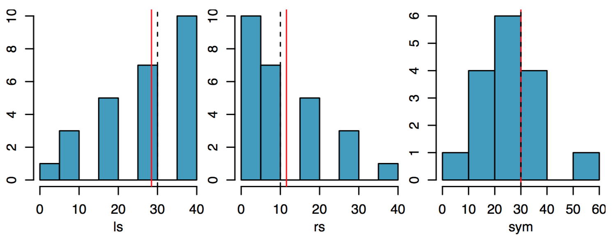

# Plicker time!

<!--
## Spread Q

Which measure(s) of spread would be LEAST sensitive to the presence of outliers?

2. standard deviation
3. IQR
4. Range
5. Depends on the data set
-->

## Spread Q {.build}

```{r create-y, echo=FALSE}
y <- x
y[2] <- 37
```


```{r compare_x&y}
x
y
var(x)
var(y)
```


## Spread Q {.build}

```{r distxy}
IQR(x)
IQR(y)
diff(range(x))
diff(range(y))
```


## Spread Q

Which measure(s) of spread would be LEAST sensitive to the presence of outliers?

<ol type="A">
  <li> Standard deviation </li>
  <li> IQR </li>
  <li> Range </li>
  <li> Depends on the data set </li>
</ol>

## Spread Q

Which measure(s) of spread would be LEAST sensitive to the presence of outliers?

<ol type="A">
  <li> Standard deviation </li>
  <li> <font color="green">**IQR** </font></li>
  <li> Range </li>
  <li> Depends on the data set </li>
</ol>


## Mean vs median {.build}



The mean (red line) is sensitive to extreme values, so it gets pulled towards 
the tail. The median (dashed line) is less sensitive.

For symmetric distributions, use *mean* and *sd*.

For skewed distributions, use *median* and *IQR*.
