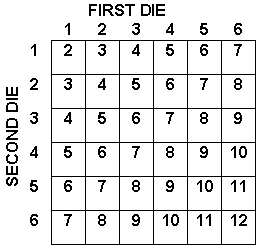
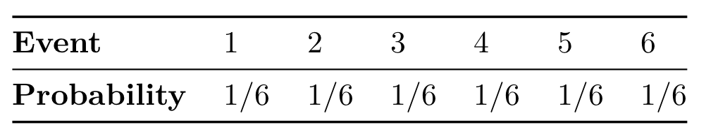

```{r setup, include=FALSE}
# List of useful packages
pkg <- c("dplyr", "ggplot2", "knitr")

# Check if packages are not installed and assign the
# names of the uninstalled packages to the variable new.pkg
new.pkg <- pkg[!(pkg %in% installed.packages())]

# If there are any packages in the list that aren't installed,
# install them
if (length(new.pkg)) {
  install.packages(new.pkg, repos = "http://cran.rstudio.com")
}

# Load the packages into the current environment
library(knitr)
library(dplyr)
library(ggplot2)

# Set number of digits to display
options(digits = 2)
```

## What proportion of the Earth's surface is covered with water?

- Our only resource is this inflatable globe and 5 minutes of time.
- How could we develop a guess for this proportion based on this **random process**?


## Probability

- the proportion of times an outcome would occur if the **random process** was observed an infinite number of times

- Probabilities are between 0 and 1

## How does probability relate to the "Inflatable Globe" problem?

- *Law of large numbers* - As more observations are collected, the sample proportion $\hat{p}$ converges to the probability $p$.

- For the "Inflatable Globe" problem,

    - $p = \mathbb{P}(water) = 0.71$
    - $1 - p = \mathbb{P}(land) = 0.29$
    - $\hat{p}$ is our observed proportion of "Water!" out of our $n$ observations of the random process

## {.flexbox .vcenter}

> - Recall Plicker question 1 about tossing two dice



## Sum of two dice

- Define givens
- Solve the problem
- **General Addition Rule** - Let $A$ and $B$ be events.
    $$\mathbb{P} (A \text{ or } B) = \mathbb{P}(A) + \mathbb{P}(B) - \mathbb{P} (A \text{ and } B)$$
    
# Addition Rule for <br> Disjoint Outcomes

## Disjoint events

- *Event* - a set of outcomes
- *Disjoint events* - events that have no outcomes in common
    - no common elements in their sets

## One dice toss

- Let **random variable** $D$ correspond to the number of pips on one roll of a die
- Let $W = \{1\}$ and $Z = \{2, 4\}$
- Are $W$ and $Z$ disjoint events?
    - Yes, they have no outcomes in common / no overlap
- Let $E = \{1, 3\}$ and $F = \{\text{even result}\}$. What's $\mathbb{P}(E \text{ or } F)$?
    - $2/6 + 3/6 = 5/6$
    
- **Addition Rule for Disjoint Outcomes** - Let $A_1$ and $A_2$ be disjoint events.
    $$\mathbb{P} (A_1 \text{ or } A_2) = \mathbb{P}(A_1) + \mathbb{P}(A_2)$$

- Special case of **General Addition Rule** where $\mathbb{P} (A_1 \text{ and } A_2) = 0$

# Plicker time!

## Answer to Plicker 2

  - Let $C$ = the event that a randomly chosen student got an A in calculus
  - Let $P$ = the event that a randomly chosen student got an A in physics
  - So $C \text{ and } P$ - the event that a randomly chosen student got an A in both
  - $\mathbb{P}(C) = 82/500$, $\mathbb{P}(P) = 73/500$, $\mathbb{P}(C \text{ and } P) = 42/500$
      - A. $\mathbb{P}(C \text{ or } P) = (82 + 73 - 42)/500 = 113/500$
      - B. $\mathbb{P}(C \text{ and } P) = 42/500$
      - C. $\mathbb{P}(C) - \mathbb{P}(C \text{ and } P) = (82 - 42)/500 = 40/500$
      - D. $\mathbb{P}(P) - \mathbb{P}(C \text{ and } P) = (73 - 42)/500 = 31/500$
  

## Probability Distribution

- A table of all disjoint events in a sample space along with their probabilities

- **Inflatable Globe**

    
    
- **Roll of a Die**

    

