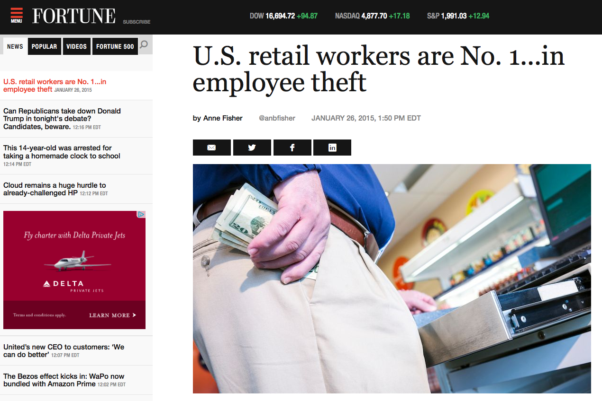

```{r setup, include=FALSE}
# List of useful packages
pkg <- c("dplyr", "ggplot2", "knitr")

# Check if packages are not installed and assign the
# names of the uninstalled packages to the variable new.pkg
new.pkg <- pkg[!(pkg %in% installed.packages())]

# If there are any packages in the list that aren't installed,
# install them
if (length(new.pkg)) {
  install.packages(new.pkg, repos = "http://cran.rstudio.com")
}

# Load the packages into the current environment
library(knitr)
library(dplyr)
library(ggplot2)

# Set number of digits to display
options(digits = 2)
set.seed(2016)
```


# Honest Liars | An introduction to Conditional Probability

## The context



## Problem Set-up

- Through accounting procedures, it is known that 10% of the employees of a store are stealing.

- This classroom will act as employees and two managers.

## The managers

- First, we need two managers.

    ```{r managers, tidy=TRUE}
    students <- c("Josephine", "Ella", "Josh", "Isabelle", "Jesse", "Toria", "Miriam", "Camille", "Mauricio", "Ryan Kitts", "Margalit", "Kathleen", "Katie", "Louise", "Jeannette", "Kiara", "Emily",
  "Kassidy",
  "Jhanvi",
  "Moira",
  "Mia",
  "Guanani",
  "Julia",
  "Nat",
  "Hwan",
  "Anadi",
  "Ryan Kwok",
  "Jenny",
  "Garrett",
  "Shannon",
  "Eli",
  "Shauna",
  "Carter",
  "Aaron",
  "Alicia",
  "Avery",
  "Hunter")
    ```

-
    ```{r}
    sample(students, size = 2)
    ```

- The rest of you are the employees.

## The employees

You will need two random digits.

>- Digit 1: Last digit of your Reed ID #
>- Digit 2: 5th digit of your phone num (excluding area code)

Please write [these](last_digit.html) on a sheet of paper.

## Honest or thief?

To simulate 10% of retail employees being thieves, we will use your first random digit:

- If your digit = 0, write "thief" above your first number.
- Otherwise, write "honest" above your first number.


## Pass or fail? {.build}

Your manager now administers a lie detector test that is 80% accurate;
there is an 80% chance that thieves will fail the test and an 80% chance that 
honest folk will pass the test. 

Using your second random digit,

- Thieves
    - If your digit = 0 or 1, write "pass" above that digit.
    - Otherwise, write "fail" above that digit.
- Honest folk
    - If your digit = 0 or 1, write "fail" above that digit.
    - Otherwise, write "pass" above that digit.
    
    
## Moment of truth

- Who wrote "fail" on their piece of paper?  Raise your hands.

- Managers:  What percentage of these employees do you think are thieves?

- Those that raised their hands/failed the test, state whether you are honest or a thief.

- What happened here?
    - The well-known fallacy of reversing the conditional probability!

# Plicker time!
    
## Considering Multiple Random Processes

- $\mathbb{P}(\text{Left}) = 0.09$, $\mathbb{P}(\text{Right}) = 0.91$
- $\mathbb{P}(\text{Blue}) = 0.15$
- These processes are
    - **independent**: knowing information about one of the variables doesn't give you
    any information about the other
- $\mathbb{P}(\text{Right and Blue}) = 0.91 \times 0.15 = 0.1365$
- **Multiplication Rule for Independent Processes** - Let $A$ and $B$ represent events from two independent processes.
$$\mathbb{P}(A \text{ and } B) = \mathbb{P}(A) \cdot \mathbb{P}(B)$$