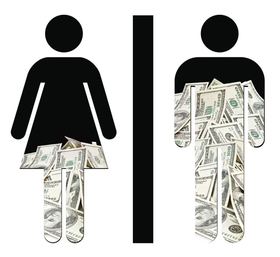
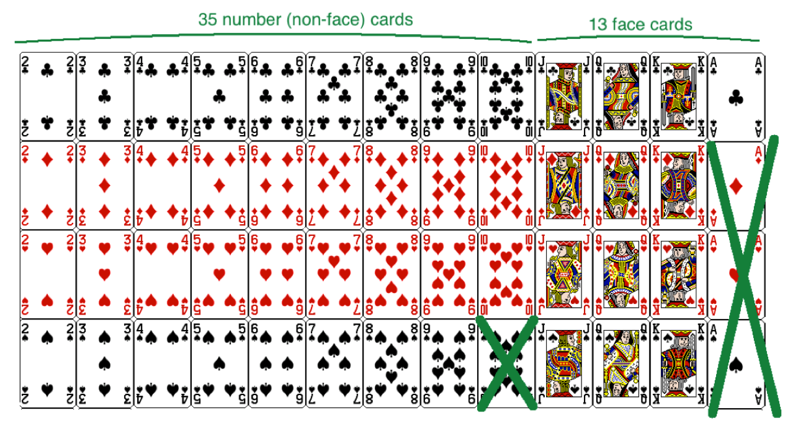
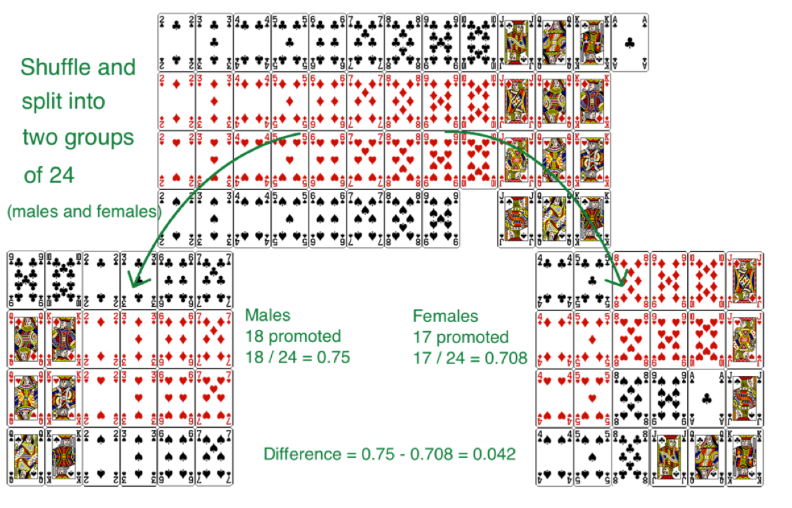

```{r setup, include=FALSE}
library(knitr)
#options(digits=2)
knitr::opts_chunk$set(echo = TRUE)
library(dplyr)
library(ggplot2)
library(mosaic)
```

# Another Poisson example

## Accident occurrence

Suppose that accidents occurring on a highway each day can be assumed to be weakly
dependent (essentially independent) and that the probability of an accident occurring is small. Assume that the random variable $X$ corresponding to the number of accidents occurring today has an expected value of three.  What is the probability that exactly 2 accidents occur, given that it is known at least one accident occurs today?

## {.build}

$X \sim Pois(\lambda = 3) \Rightarrow \mathbb{P}(X = x) = e^{-\lambda} \left(\dfrac{\lambda^x}{x!}\right) = e^{-3} \left(\dfrac{3^x}{x!}\right)$

- Want to find $\mathbb{P}[ (X = 2) \,|\, (X \ge 1)]$

- Using the definition of conditional probability, 

$$\mathbb{P}[ (X = 2) \,|\, (X \ge 1)] = \dfrac{\mathbb{P} [ (X = 2) \text{ AND } (X \ge 1) ]}{\mathbb{P}(X \ge 1)} = \dfrac{\mathbb{P}(X = 2)}{\mathbb{P}(X \ge 1)}$$

\pause

&emsp; &emsp; &emsp; &emsp; &emsp; $= \dfrac{\mathbb{P}(X = 2)}{1 - \mathbb{P}(X = 0)} = \dfrac{e^{-3}\left( \dfrac{3^2}{2!}\right)}{1 - \left[e^{-3}\left( \dfrac{3^0}{0!}\right)\right]} \approx \dfrac{0.224}{0.950} = 0.236$

# Case study


## Gender Discrimination {.build}

<div class="columns-2">
  
  
  - 48 male supervisors given the same personnel file.
  - Asked: promote or not.
  - Files were identical except gender.
  - Files were randomly assigned to the supervisors.

</div>

__Question of interest__: are females unfairly discriminated against in terms of promotions given by male supervisors?


## Data {.build}

Gender | promote | nopromote 
-------|---------|-----------
Male   |    21   |    3      
Female |    14   |    10    

\[
\mathbb{P}(\text{promote}\,|\,M) = 21/24 = 0.875 \\
\mathbb{P}(\text{promote}\,|\,F) = 14/24 = 0.583
\]

At a first glance, does there appear to be a relationship between promotion and 
gender?

## Question

We saw a difference of almost 30% (29.2% to be exact) between the proportion of male and female files that are promoted. Based on this information, which of the below is true?

<ol type="A">
  <li>If we were to repeat the experiment we will definitely see that more female files get promoted. This was a fluke.</li>
  <li>Promotion is dependent on gender, males are more likely to be promoted, and hence there is gender discrimination against women in promotion decisions.</li>
  <li>The difference in the proportions of promoted male and female files is due to chance, this is not evidence of gender discrimination against women in promotion decisions.</li>
  <li>Women are less qualified than men, and this is why fewer females get promoted.</li>
</ol>


## Two competing claims {.build}

**$H_0$, Null Hypothesis**: "There is nothing going on."

- Promotion and gender are independent.
- No gender discrimination.
- Observed difference in proportions is simply due to chance.

**$H_a$, Alternative Hypothesis**: There is something going on.”

- Promotion and gender are dependent.
- There is gender discrimination.
- Observed difference in proportions is not due to chance.
- $\mathbb{P}(promote\,|\,M) > \mathbb{P}(promote\,|\,F)$


## Trial as a Hypothesis test {.build}

<div class="centered">

</div>
  
**$H_0$**  : Defendant is not guilty  vs.  **$H_a$**  : Defendant is guilty

- Assume that the defendant is not guilty.
- Present evidence / collect data.
- Judge the evidence - “Could these data plausibly have happened by chance if the null hypothesis were true?"
- If they were very unlikely to have occurred by chance, then the evidence raises more than a reasonable doubt in our minds about the null hypothesis.


## If the evidence is weak {.build}

- If the evidence is not strong enough to reject the assumption of innocence, the jury returns with a verdict of *not guilty*.
    - The jury does not say that the defendant is innocent, just that there is not enough evidence to convict.
    
- Said statistically: *we fail to reject the null hypothesis*, or *the data is consistent with our model*.
    - We never *accept the null hypothesis*.
    

## {.flexbox .vcenter}

<div class="centered">

</div>


## Why don't we accept $H_0$? {.build}

The hypothesis test gives us:

$$ \mathbb{P}(\textrm{data} \,|\, H_0) $$

It doesn't give us:

$$ \mathbb{P}(H_0 \,|\, \textrm{data}) $$

- It's also impossible to prove a negative.  
- It's the same reason we shouldn't say "The defendant is innocent."  
- We should say "There is not enough evidence to convict the defendant."

## Recap: Hypothesis Testing

- Start with a null hypothesis ($H_0$) that represents the status quo (what we assume to be true).
- We also have an alternative hypothesis ($H_a$) that represents our research question, i.e., what we're testing for.
- We conduct a hypothesis test under the assumption that $H_0$ is true, either via simulation (this week) or theoretical methods (later in the course).
- If the test results suggest that the data is consistent with $H_0$, we stick with $H_0$. If they are inconsistent, then we reject $H_0$ in favor of $H_a$.


## Gender discrimination: the hypotheses {.build}

What is the *null hypothesis*?

- $H_0$: There is no gender discrimination (Gender and promotion are independent)
- $H_0: \mathbb{P}(promote\,|\,M) = \mathbb{P}(promote\,|\,F)$

What is the *alternative hypothesis*?

- $H_a$: There is gender discrimination (Gender and promotion are not independent)
- $H_a: \mathbb{P}(promote\,|\,M) > \mathbb{P}(promote\,|\,F)$

What is our *test statistic*? (Note that this is a random variable!)

- $D = \mathbb{P}(promote\,|\,M) - \mathbb{P}(promote\,|\,F)$


## Recall: the data {.build}

Gender | promote | nopromote 
-------|---------|-----------
Male   |    21   |    3      
Female |    14   |    10    


We can compute our **observed** test statistic:

\[
d_{obs} = \hat{p}_{M} - \hat{p}_{F} \\
d_{obs} = 21/24 - 14/24 \approx .29
\]


# Simulating the random process

##

<div class="centered">

</div>

**Face cards**: promoted  
**Number cards**: not promoted


## Simulating the Null Distribution {.build}

1. Shuffle the deck and deal into two piles of twenty four.
2. This mimics the process of each supervision being randomly assigned a male or female file.
3. Compute the proportion that is promoted in each:

\[ d = \hat{p}_{M} - \hat{p}_{F} \]

Repeat steps 1-3 and store each one.


##

<div class="centered">

</div>


## Simulation using R {.flexbox .vcenter}

```{r simgender, echo = FALSE, cache=TRUE, fig.height=4, fig.width=9}
gender <- rep(c("M", "F"), each = 24)
promote <- rep(c("Yes", "No"), c(35, 13))
D <- rep(NA, 10000)
d_obs <- 21/24 - 14/24
for(i in 1:10000) {
  newgen <- sample(gender)
  tab <- table(newgen, promote)
  D[i] <- diff(tab[, 2]/24)
}
#hist(d, col = "steelblue", main = "Null Distribution")
#abline(v = .29, col = "goldenrod", lwd = 2)
qplot(x = D, fill = I("steelblue"), colour = I("black"), 
  main = "Null Distribution", bins = 12) +
  geom_vline(xintercept = d_obs, colour = "goldenrod")
```

# Plicker time


## $p$-value {.build}

- The proportion of simulated statistics that fell at or above what we observed

- Out of the 10,000 simulations, `r pval <- prop(~D >= d_obs); pval * 10000` were greater than `r d_obs`.

- Therefore, $p$-value = `r pval`.  Since this is smaller than $\alpha = 0.05$, we reject $H_0$ and based on this data, we have evidence that females are unfairly discriminated against in terms of promotions.
