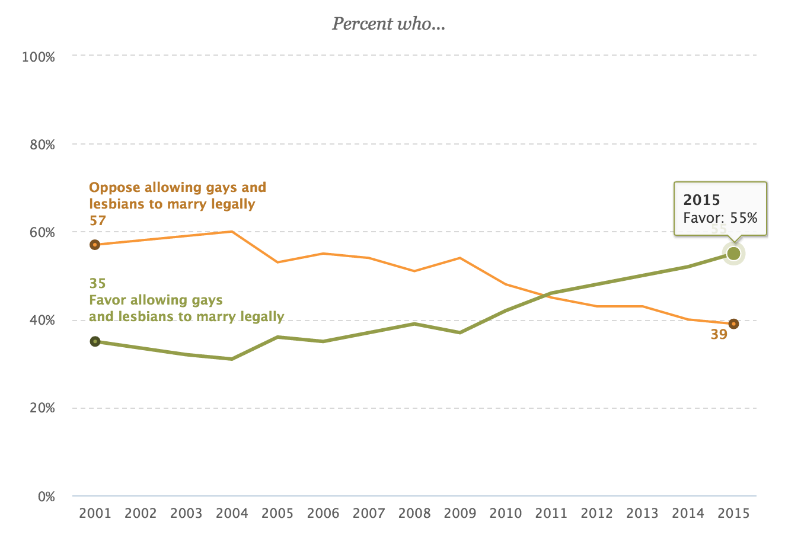
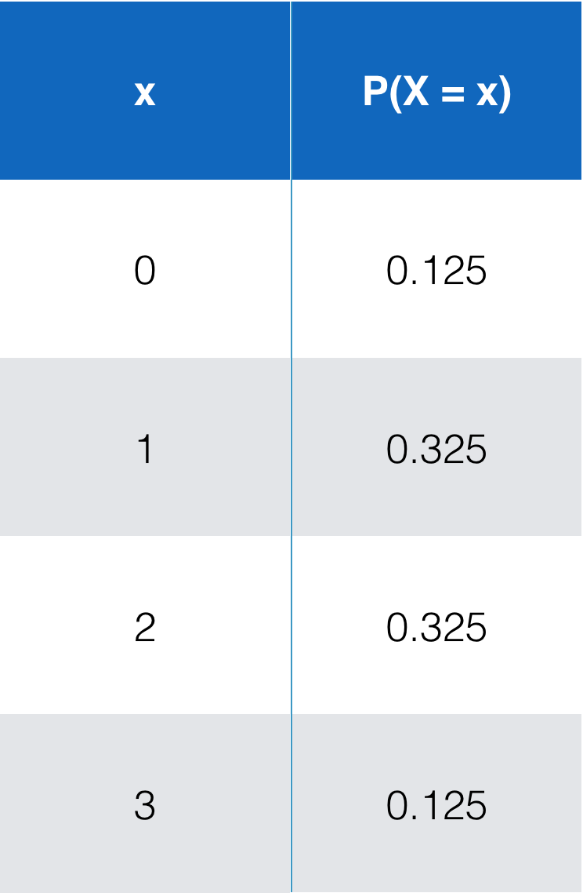

```{r setup, include=FALSE}
library(knitr)
#options(digits=2)
knitr::opts_chunk$set(echo = TRUE)
library(dplyr)
library(ggplot2)
```


## Example

Do a majority of American adults support gay marriage?  

<center>

</center>

## Sampling

Suppose you are able to conduct a survey on 75 randomly selected adult Americans.  It is found that 50 of the 75 (\approx 67%) sampled do support gay marriage.

# Plicker time!

## The Hypotheses {.build}

Let $p$ be the true proportion of Americans who favor same-sex marriage.

$$H_0: p = 0.5$$

$$H_a: p > 0.5$$

## The Data

The *observed test statistic* was

$$\hat{p} = p_{obs} \approx 0.67$$


## Test of significance {.build}

How can we determine whether 0.67 was produced by chance (failing to reject $H_0$) **or** whether $\hat{p} = 0.67$ is statistically greater than $p_0 = 0.5$ (rejecting $H_0$)?

- We could take a different sample of 75 adult Americans and compare 0.67 to the result obtained there.

- But we could do better than that.  How?

## Simulation | The procedure for building the null distribution {.build}

```{r prelim, echo=FALSE, message=FALSE}
library(ggplot2)
set.seed(53)
```

1. Let a coin flip represent selecting a random American. Heads = in favor. 
2. Flip a coin 75 times and compute the proportion of heads.
3. Repeat step 2 many many times, logging the sample proportion each time.

```{r sim, message=FALSE, warning=FALSE, cache=TRUE}
library(mosaic)
p_hats <- do(10000) * rflip(n = 75)
head(p_hats)
```

## The Null Distribution

```{r dist, warning=FALSE}
qplot(x = prop, data = p_hats, geom = "histogram", 
      binwidth = .0135, fill = I("white"), col = I("darkgreen"))
```


## Determining significance {.build}

```{r dist2, echo = FALSE, message=FALSE}
library(dplyr)
p_hats <- p_hats %>%
  mutate(in_tail = ifelse(prop >= 2/3, TRUE, FALSE))
qplot(x = prop, data = p_hats, geom = "histogram", fill = in_tail, 
      binwidth = .0135, fill = I("white"), col = I("darkgreen")) +
  theme(legend.position = "none") +
  scale_fill_manual(values = c("white", "darkgreen")) +
  geom_vline(xintercept = 2/3, col = "deepskyblue")
ggsave("../figs/gay_mar_sim.png")
```

# Plicker time!

## The decision {.build}

$$ \alpha = .05; \quad p.val \approx `r mean(p_hats$in_tail)` $$

Since

$$ p.val < \alpha$$

we find the data is inconsistent with our model, aka, we reject the null hypothesis.

Based on our random sample of 75 American adults, we have support for the claim that a majority of Americans favor gay marriage.

## {.flexbox .vcenter}

Randomization

vs. 

Simulation


## Ways to find a Null Distribution {.flexbox .vcenter .build}

1. Randomization
2. Simulation
3. Probability Theory


## Probability Theory {.build}

Let $X$ be the total number of people in a sample of size 75 that favor same-sex
marriage if the true population proportion that favor is 0.5.

$x_{obs} = 50$

What is $\mathbb{P}(X \ge x_{obs})$?


## Let's simplify {.build}

Let $X$ be the total number of people in a sample of size 3 that favor same-sex
marriage if the true population proportion that favor is 0.5.

<center>

</center>


## Let's simplify

Let $X$ be the total number of people in a sample of size 3 that favor same-sex
marriage if the true population proportion that favor is 0.5.

<center>

</center>

## Let's simplify

Let $X$ be the total number of people in a sample of size 3 that favor same-sex
marriage if the true population proportion that favor is 0.5.

<div class="columns-2">
<center>

</center>

```{r, echo=FALSE, fig.height=4, fig.width=4}
x1  <- 0:3
df <- data.frame(x = x1, y = dbinom(x1, 3, 0.5))
ggplot(aes(x, y), data = df) + 
  geom_bar(stat = "identity", col = "darkgreen", fill = "white") +
  ylab("P(X = x)")
```
</div>


## Binomial distribution {.build}

The sum of independent trials that succeed with probability $p$ will be 
distributed as a binomial random variable, $X$;

$$ X \sim Bin(n, p) $$

$$ \mathbb{P}(X = x) = \binom{n}{x}p^x(1-p)^{n-x} $$


## Binomial Distribution {.build}

Let $X$ be the total number of people in a sample of size 75 that favor same-sex
marriage if the true population proportion that favor is 0.5.

$x_{obs} = 50$

What is $\mathbb{P}(X \ge x_{obs})$?

$$ X \sim Binom(n = 75, p = .5) $$


## The Null Distribution

```{r, echo=FALSE, eval=TRUE}
x1  <- 0:75
df <- data.frame(x = x1, y = dbinom(x1, 75, 0.5))
ggplot(aes(x, y), data = df) + 
  geom_bar(stat = "identity", col = "darkgreen", fill = "white") +
  ylab("P(X = x)") +
  geom_vline(xintercept = 50, col = "deepskyblue")
```

$$p.val \approx `r (1 - pbinom(50, 75, .5))`$$

# The normal approximation

## Small $n$ {.build}

Let $X$ be the total number of people in a sample of size 3 that favor same-sex
marriage if the true population proportion that favor is 0.5.

$$ X \sim Bin(n = 3, p = .5) \, \textrm{vs} \, X \sim N\left(\mu = np, \sigma = \sqrt{np(1 - p)}\right)$$

```{r, echo=FALSE, eval=TRUE, fig.height=3.7}
x1  <- 0:3
df <- data.frame(x = x1, y = dbinom(x1, 3, 0.5))
ggplot(aes(x, y), data = df, ylim = c(0, .6), xlim = c(-1, 4)) + 
  geom_bar(stat = "identity", col = "darkgreen", fill = "white") +
  stat_function(fun = dnorm, args = list(mean = 1.5, sd = sqrt(3/4)), 
                col = "firebrick", lwd = 1.2)
```

## Large $n$ {.build}

Let $X$ be the total number of people in a sample of size 75 that favor same-sex
marriage if the true population proportion that favor is 0.5.

$$X \sim Binom(n = 75, p = .5) \, \textrm{vs} \, X \sim N\left(\mu = np, \sigma = \sqrt{np(1 - p)}\right)$$

```{r, echo=FALSE, eval=TRUE, fig.height=2.5, fig.align='center'}
x1  <- 0:75
df <- data.frame(x = x1, y = dbinom(x1, 75, 0.5))
ggplot(aes(x, y), data = df) + 
  geom_bar(stat = "identity", col = "darkgreen", fill = "white") +
  stat_function(fun = dnorm, args = list(mean = 75/2, sd = sqrt(74/4)), 
                col = "firebrick", lwd = 1.2) +
  geom_vline(xintercept = 50, col = "deepskyblue")
```

The binomial model $p$-value was `r (1 - pbinom(50, 75, .5))`. <br>
The normal model $p$-value was `r (1 - pnorm(50, 75 * 0.5, sqrt(75*0.5*0.5)))`. <br>
The simulation approximation of the $p$-value was `r mean(p_hats$in_tail)`.

## How large is "large enough"? {.build}

Rule of thumb:

<center>
The number of expected successes and failures are **each** <br> greater than or equal to 10.
</center>

$$ np \ge 10 \\
\textrm{and} \\
n(1 − p) \ge 10 $$


## Why use the Normal at all? {.build}

- Simulation and exact Binomial can be computationally expensive.
    - Due to computers not being able to do these calculations quickly (until recently), the normal
    distribution has traditionally been used instead.
- Normal is sometimes more generally applicable.
- Normal is fast.


