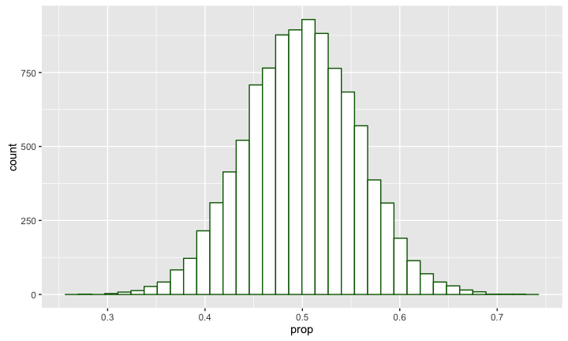
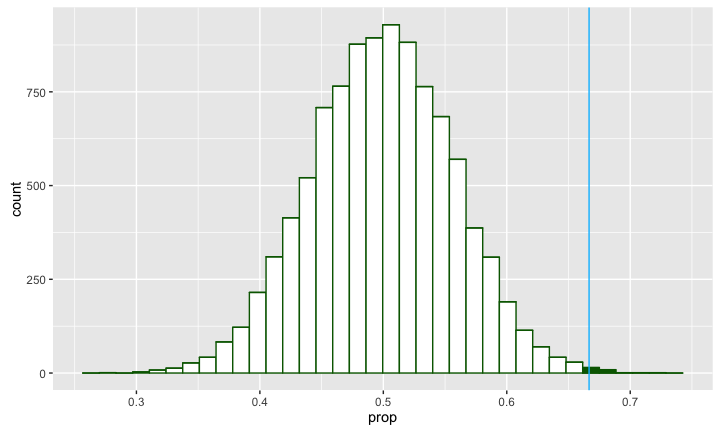
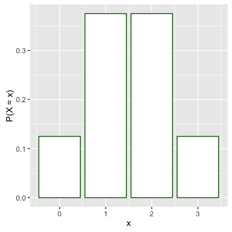
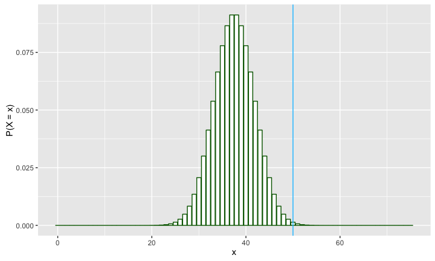
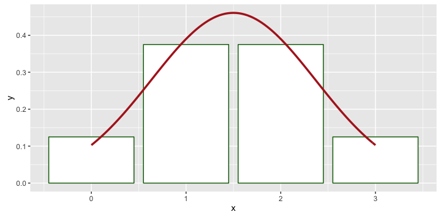
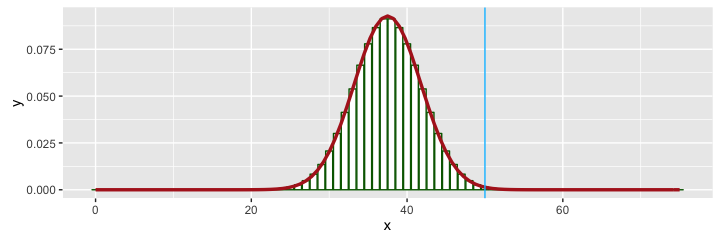

# MATH 141
Chester Ismay  


## Example

Do a majority of American adults support gay marriage?  

<center>

</center>

## Sampling

Suppose you are able to conduct a survey on 75 randomly selected adult Americans.  It is found that 50 of the 75 (\approx 67%) sampled due support gay marriage.

# Plicker time!

## The Hypotheses {.build}

Let $p$ be the true proportion of Americans who favor same-sex marriage.

$$H_0: p = 0.5$$

$$H_a: p > 0.5$$

## The Data

The *observed test statistic* was

$$\hat{p} = p_{obs} \approx 0.67$$


## Test of significance {.build}

How can we determine whether 0.67 was produced by chance (failing to reject $H_0$) **or** whether $\hat{p} = 0.67$ is statistically greater than $p_0 = 0.5$ (rejecting $H_0$)?

- We could take a different sample of 75 adult Americans and compare 0.67 to the result obtained there.

- But we could do better than that.  How?

## Simulation | The procedure for building the null distribution {.build}


1. Let a coin flip represent selecting a random American. Heads = in favor. 
2. Flip a coin 75 times and compute the proportion of heads.
3. Repeat step 2 many many times, logging the sample proportion each time


```r
library(mosaic)
p_hats <- do(10000) * rflip(n = 75)
head(p_hats)
```

```
##    n heads tails      prop
## 1 75    35    40 0.4666667
## 2 75    42    33 0.5600000
## 3 75    42    33 0.5600000
## 4 75    41    34 0.5466667
## 5 75    43    32 0.5733333
## 6 75    36    39 0.4800000
```

## The Null Distribution


```r
qplot(x = prop, data = p_hats, geom = "histogram", 
      binwidth = .0135, fill = I("white"), col = I("darkgreen"))
```




## Determining significance {.build}



# Plicker time!

## The decision {.build}

$$ \alpha = .05; \quad p.val \approx 0.0027 $$

Since

$$ p.val < \alpha$$

we find the data is inconsistent with our model, aka, we reject the null hypothesis.

Based on our random sample of 75 American adults, we have support for the claim that a majority of Americans favor gay marriage.

## {.flexbox .vcenter}

Randomization

vs. 

Simulation


## Ways to find a Null Distribution {.flexbox .vcenter .build}

1. Randomization
2. Simulation
3. Probability Theory


## Probability Theory {.build}

Let $X$ be the total number of people in a sample of size 75 that favor same-sex
marriage if the true population proportion that favor is 0.5.

$x_{obs} = 50$

What is $\mathbb{P}(X \ge x_{obs})$?


## Let's simplify {.build}

Let $X$ be the total number of people in a sample of size 3 that favor same-sex
marriage if the true population proportion that favor is 0.5.

<center>

</center>


## Let's simplify

Let $X$ be the total number of people in a sample of size 3 that favor same-sex
marriage if the true population proportion that favor is 0.5.

<center>

</center>

## Let's simplify

Let $X$ be the total number of people in a sample of size 3 that favor same-sex
marriage if the true population proportion that favor is 0.5.

<div class="columns-2">
<center>

</center>


</div>


## Binomial distribution {.build}

The sum of independent trials that succeed with probability $p$ will be 
distributed as a binomial random variable, $X$;

$$ X \sim Bin(n, p) $$

$$ \mathbb{P}(X = x) = \binom{n}{x}p^x(1-p)^{n-x} $$


## Binomial Distribution {.build}

Let $X$ be the total number of people in a sample of size 75 that favor same-sex
marriage if the true population proportion that favor is 0.5.

$x_{obs} = 50$

What is $\mathbb{P}(X \ge x_{obs})$?

$$ X \sim Binom(n = 75, p = .5) $$


## The Null Distribution



$$p.val \approx 0.0012221$$

# The normal approximation

## Small $n$ {.build}

Let $X$ be the total number of people in a sample of size 3 that favor same-sex
marriage if the true population proportion that favor is 0.5.

$$ X \sim Bin(n = 3, p = .5) \, \textrm{vs} \, X \sim N\left(\mu = np, \sigma = \sqrt{np(1 - p)}\right)$$



## Large $n$ {.build}

Let $X$ be the total number of people in a sample of size 75 that favor same-sex
marriage if the true population proportion that favor is 0.5.

$$X \sim Binom(n = 75, p = .5) \, \textrm{vs} \, X \sim N\left(\mu = np, \sigma = \sqrt{np(1 - p)}\right)$$



The binomial model $p$-value was 0.0012221. <br>
The normal model $p$-value was 0.0019462. <br>
The simulation approximation of the $p$-value was 0.0027.

## How large is "large enough"? {.build}

Rule of thumb:

<center>
The number of expected successes and failures are **each** <br> greater than or equal to 10.
</center>

$$ np \ge 10 \\
\textrm{and} \\
n(1 − p) \ge 10 $$


## Why use the Normal at all? {.build}

- Simulation and exact Binomial can be computationally expensive.
    - Due to computers not being able to do these calculations quickly (until recently), the normal
    distribution has traditionally been used instead.
- Normal is sometimes more generally applicable.
- Normal is fast.


