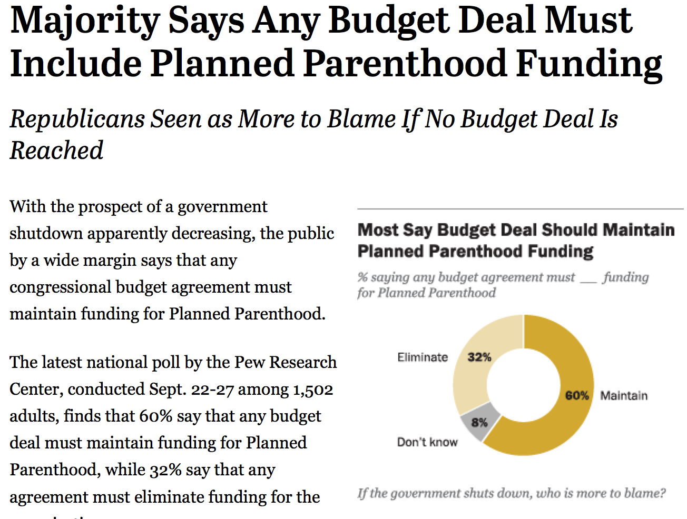
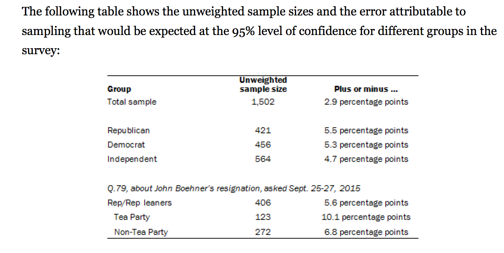
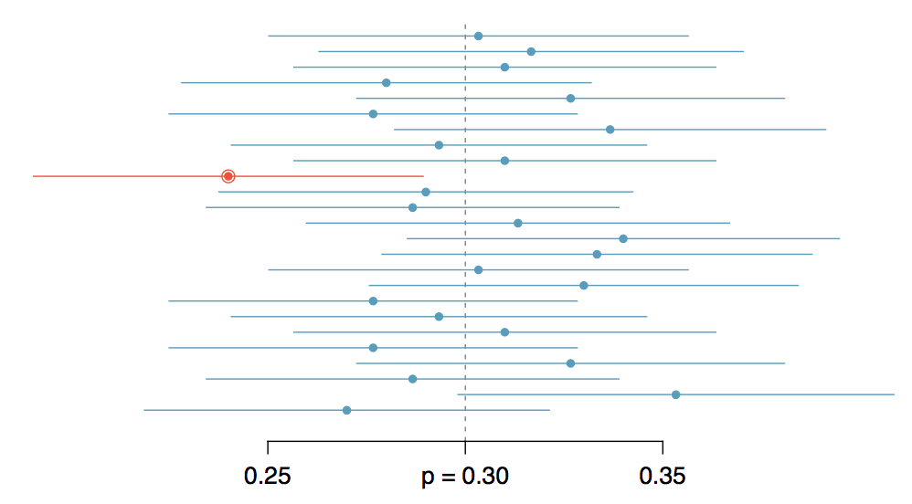

<style type="text/css">
    ol { list-style-type: upper-alpha; }
</style>

```{r setup, include=FALSE}
library(knitr)
options(digits=2)
knitr::opts_chunk$set(echo = TRUE)
library(dplyr)
library(ggplot2)
```


## What is Hypothesis Testing good for? {.build}

- Hypothesis tests have been shown to be valuable contributors to science <br> ($p < 0.05$)
but... are sometimes abused ($p < 0.05$).

- They are used to assess the degree to which data is consistent with a particular model.
    - They are a way to test whether an observed value is statistically significant (>, <, $\ne$ a hypothesized value)

- The most widely used tool in statistical inference.


## Step 1 {.build}

Lay out your model(s).

**$H_0$**: null model, business as usual  
**$H_A$**: alternative model, business not as usual

- Hypotheses are statements about the TRUE STATE of the world and should involve
*parameters*, not *statistics*.
- Hypotheses should suggest a *test statistic* that has some bearing on the claim.
- By default, use two-tailed tests.  The wording of the problem (research hypothesis) determines the sign of the alternative hypothesis.


## Step 2 {.build}

Contruct the appropriate null distribution.

```{r, echo=FALSE, eval=TRUE, fig.height=2.5, fig.align='center'}
x1  <- 0:75
df <- data.frame(x = x1, y = dbinom(x1, 75, 0.5))
qplot(x, y, data = df) + 
  geom_bar(stat = "identity", col = "darkgreen", fill = "white") +
  stat_function(fun = dnorm, args = list(mean = 75/2, sd = sqrt(74/4)), 
                col = "goldenrod", lwd = 1.2)
```

1. Randomization
2. Simulation
3. Exact Probability Theory
4. Normal Approximation


## Step 3 {.build}

Calculate a measure of consistency between the observed test statistic (the data)
and the null distribution (i.e., a $p$-value).

- If your observed test stat is in the tail (corresponding to $H_A$) <br> $\rightarrow$ low $p$-value <br> $\rightarrow$ data is inconsistent
with null hypothesis <br> $\rightarrow$ "reject null hypothesis".
- If your observed test stat is in the body/not in the appropriate tail <br> $\rightarrow$ high $p$-value <br> $\rightarrow$ data is consistent with
the null hypothesis <br> $\rightarrow$ "fail to reject the null hypothesis."

What can go wrong?

## Statistical errors {.flexbox .vcenter}


## Jury trial analogy {.flexbox .vcenter}


# Confidence Intervals


##

**Confidence Interval**: a plausible range of values for a population parameter.


##
<center>

</center>


##
<center>

</center>


## Construction of a CI {.build}

If the distribution of the point estimate can be well-approximated by the Normal Distribution:

$$ \textrm{point estimate} \pm \textrm{margin of error} $$
$$ \textrm{point estimate} \pm 1.96 \times SE $$

- *point estimate*: $\hat{p}$, $\bar{x}$, $\hat{p}_1 - \hat{p}_2$
- *standard error (SE)*: standard deviation of the sampling distribution of the point estimate.


## Question

"The proportion of Americans who want to support funding for Planned Parenthood is estimated
to be between 57.1% and 62.9% with 95% confidence." Which of the following interpretations
are reasonable?

1. The interval [.571, .629] provides a plausible range for $\hat{p}$
2. We are certain that the population proportion lies within this interval.
3. If we took many more samples of the same size and computed many $\hat{p}$'s <br> and
many CIs, around 95% of those CIs would contain the population <br> proportion $p$.
4. 95% of all surveys conducted with differing sample sizes will have between 57.1% and 62.9% in support of funding Planned Parenthood.

## {.flexbox .vcenter}

<center>

</center>