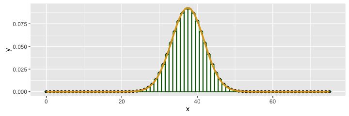

# MATH 141
Chester Ismay  

## What is Hypothesis Testing good for? {.build}

- Hypothesis tests have been shown to be valuable contributors to science   ($p < 0.05$)
but... are sometimes abused ($p < 0.05$).

- They are used to assess the degree to which data is consistent with a particular model.
    - They are a way to test whether an observed value is statistically significant (>, <, $\ne$ a hypothesized value)

- The most widely used tool in statistical inference.

## Step 1 {.build}

Lay out your model(s).

**$H_0$**: null model, business as usual  
**$H_A$**: alternative model, business not as usual

- Hypotheses are statements about the TRUE STATE of the world and should involve
*parameters*, not *statistics*.
- Hypotheses should suggest a *test statistic* that has some bearing on the claim.
- By default, use two-tailed tests.  The wording of the problem (research hypothesis) determines the sign of the alternative hypothesis.

## Step 2 {.build}

Construct the appropriate null distribution.

1. Randomization
2. Simulation
3. Exact Probability Theory
4. Normal Approximation

## Step 3 {.build}

Calculate a measure of consistency between the observed test statistic (the data)
and the null distribution (i.e., a $p$-value).

- If your observed test stat is in the tail (corresponding to $H_A$)   $\rightarrow$ low $p$-value   $\rightarrow$ data is inconsistent
with null hypothesis   $\rightarrow$ "reject null hypothesis".
- If your observed test stat is in the body/not in the appropriate tail   $\rightarrow$ high $p$-value   $\rightarrow$ data is consistent with
the null hypothesis   $\rightarrow$ "fail to reject the null hypothesis."

What can go wrong?
