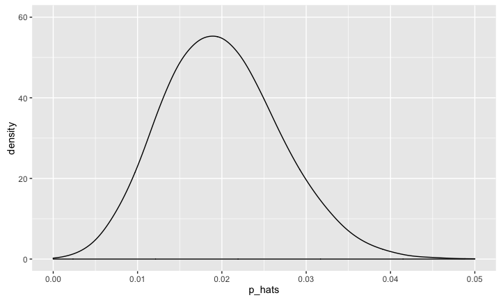
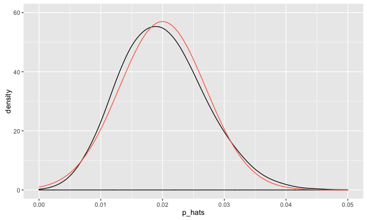
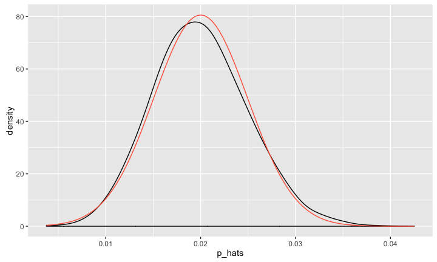
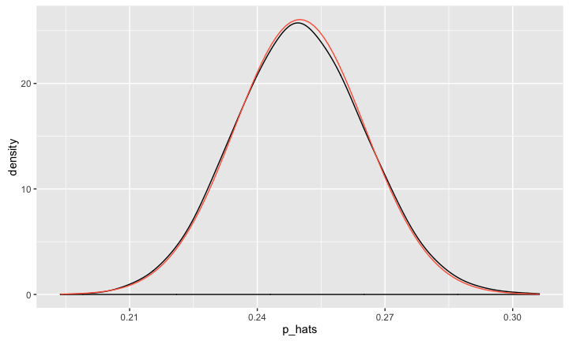

# MATH 141
Chester Ismay  

<style type="text/css">
    ol { list-style-type: upper-alpha; }
</style>


## Checking Conditions{.build}
<center>

</center>

<br />  
  
$\hat{p} \sim N\left(\mu = p, \sigma = \sqrt{\frac{p(1-p)}{n}}\right)$ if

1. Observations are independent
2. The number of **observed** successes and failures is at least 10.

For Confidence Intervals, we estimate $p$ by using $\hat{p}$

$$
n\hat{p} \ge 10 \\
n(1 - \hat{p}) \ge 10
$$

# Plicker time!

## Question

We are given that $n = 1002, \hat{p} = 0.05$. Which of the
below is the correct calculation of the 95% confidence interval?

2. $0.05 \pm 1.65 \sqrt{\dfrac{0.05 \times 0.95}{1002}}$
3. $0.05 \pm 1.96 \left(\dfrac{0.05 \times 0.95}{\sqrt{1002}}\right)$
4. $0.50 \pm 2.58 \sqrt{\dfrac{50 \times 952}{1002}}$
1. $0.05 \pm 1.96 \sqrt{\dfrac{0.05 \times 0.95}{1002}}$

## Constructing a CI {.build}


```r
n <- length(us12$response); p_hat <- 50/1002
n * p_hat
```

```
## [1] 50
```

```r
SE <- sqrt((p_hat * (1 - p_hat)) / n)
z_star <- qnorm(.975) # for a 95% CI
z_star
```

```
## [1] 1.96
```

```r
MoE <- z_star * SE
c(p_hat - MoE, p_hat + MoE)
```

```
## [1] 0.0364 0.0634
```


## {.build}


```r
inference(y = us12$response, est = "proportion", type = "ci", 
          method = "theoretical", success = "atheist")
```

```
## Single proportion -- success: atheist 
## Summary statistics:
```


```
## p_hat = 0.0499 ;  n = 1002 
## Check conditions: number of successes = 50 ; number of failures = 952 
## Standard error = 0.0069 
## 95 % Confidence interval = ( 0.0364 , 0.0634 )
```


## `inference()` function {.build}

<center>

</center>

<br/>

Your great responsibility:

1. Understand what's going on inside the black box.
2. Ensure the conditions for inference are reasonable.


## When conditions *aren't* reasonable {.build}

<center>

</center>

$$
n = 400 \\
\hat{p} = 0.02 \\
n \hat{p} = 8 < 10
$$

Are they doing inference?

Yes! "In general, the ..."

<center>

</center>


## Simulate the sampling dist.


```r
p <- 0.02
n <- 400
p_hats <- rep(0, 10000)

for (i in 1:10000) {
  samp <- sample(c("atheist", "non_atheist"), size = n,
                 replace = TRUE, prob = c(p, 1 - p))
  p_hats[i] <- sum(samp == "atheist") / n
}
```


## Simulate the sampling dist.




## A poor approximation




## Double the sample size...


```r
p <- 0.02
n <- 800
p_hats <- rep(0, 10000)

for (i in 1:10000) {
  samp <- sample(c("atheist", "non_atheist"), size = n,
                 replace = TRUE, prob = c(p, 1 - p))
  p_hats[i] <- sum(samp == "atheist") / n
}
```


## A better approximation




## Increase $p$...


```r
p <- 0.25
n <- 800
p_hats <- rep(0, 10000)

for (i in 1:10000) {
  samp <- sample(c("atheist", "non_atheist"), size = n,
                 replace = TRUE, prob = c(p, 1 - p))
  p_hats[i] <- sum(samp == "atheist") / n
}
```


## An even better approximation




# Making decisions with confidence intervals


## A reasonable claim? {.build}

*A full 10% of Americans are atheists.*

### Claim
$p = 0.10$

### 95% CI
$(0.0364 , 0.0634)$

The claim is *inconsistent* with our range of estimates of $p$, based on the variability of $\hat{p}$.
