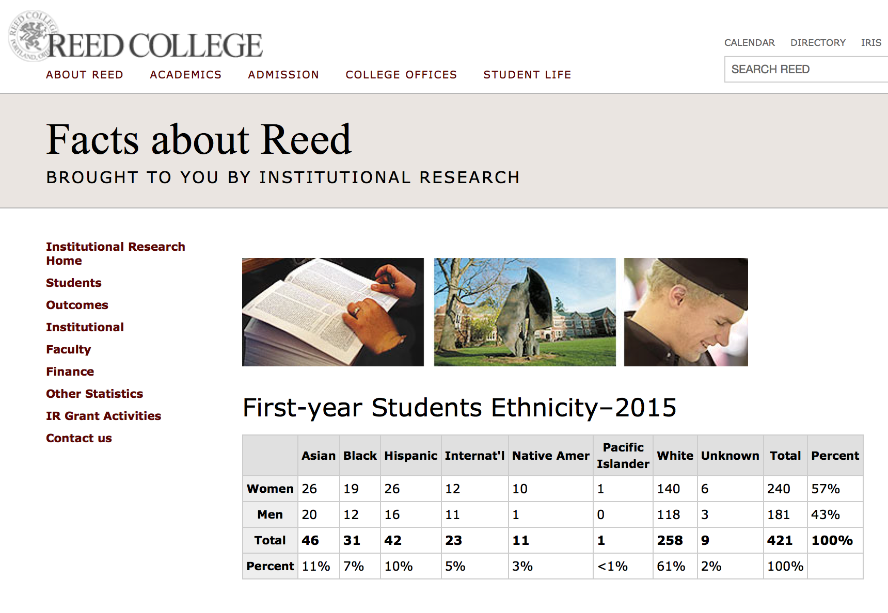
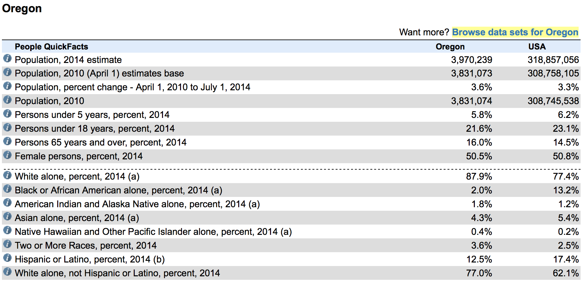
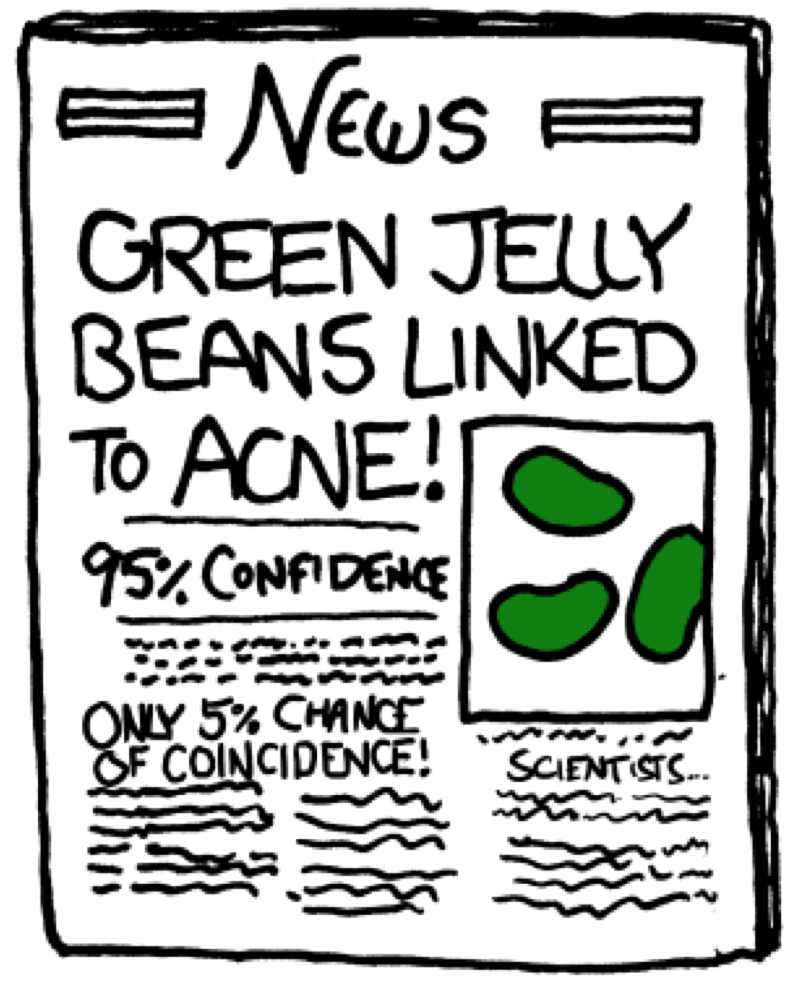
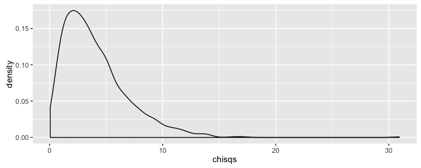
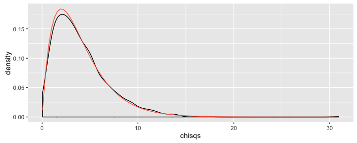

# MATH 141
Chester Ismay  


# Introducing $\chi^2$

## Ex: Diversity at Reed {.build}

<center>

</center>

- In terms of ethnic diversity, does the first year student body differ from 
the general population of Oregon?

## 
<center>

</center>


##
<center>

</center>


## The Data {.build}

Ethnicity | Asian | Black | Hispanic | White | Other | Total
----------|-------|-------|----------|-------|-------|-------
Reed count|  46   |   31  |   42     |  258  |  35   |  412
Oregon proportion  |  .043 |  .02  |   .125   |  .77  | .042  |   1

<br/>

If the students at Reed were drawn from a population with these proportions,
how many *counts* would we expect in each group?

$$\textrm{exp. count} = n \times p_i$$


## The Data {.build}

Ethnicity   | Asian | Black | Hispanic | White | Other | Total
------------|-------|-------|----------|-------|-------|-------
Obs. data   |  46   |   31  |   42     |  258  |  35   |  412
Exp. counts |  17.716 |  8.24 |   51.5   |  317.24  | 17.304  |   412

<br/>

- Some sampling variability is expected, but how far from expected is too far?


## Simulating Oregonian Reedies {.build}


```r
n <- 412
p <- c(.043, .02, .125, .77, .042)
samp <- sample(c("asian", "black", "hispanic", "white", "other"), 
       size = n, replace = TRUE, prob = p)
table(samp)
```

```
## samp
##    asian    black hispanic    other    white 
##       15        9       52       16      320
```

```r
obs <- c(46, 31, 42, 258, 35)
```


## Simulating Oregonian Reedies...AGAIN {.build}


```r
obs <- c(46, 31, 42, 258, 35)
samp <- sample(c("asian", "black", "hispanic", "white", "other"), 
       size = n, replace = TRUE, prob = p)
table(samp)
```

```
## samp
##    asian    black hispanic    other    white 
##       26        6       53       11      316
```

```r
samp <- sample(c("asian", "black", "hispanic", "white", "other"), 
       size = n, replace = TRUE, prob = p)
table(samp)
```

```
## samp
##    asian    black hispanic    other    white 
##       18        8       53       20      313
```


## Inference on many $p$'s {.build}

We *could* do a tests/CIs on $p_{reed} - p_{oregon}$ for each group, however:

- A better (more powerful) test is one that tests for a difference in the two distributions --- not just pairwise comparisons.
- Beware of multiple comparisons!

[xkcd link](https://xkcd.com/882/)

<center>

</center>


## Creating a statistic {.build}

For each of $k$ categories:

1. Calculate the difference between observed and expected counts.
2. Scale each difference by an estimate of the SE ($\sqrt{exp}$).
3. Square the scaled difference to get rid of negatives.


Then add them all up.

$$\chi^2 = \sum_{i = 1}^k \frac{(obs - exp)^2}{exp}$$


##
Ethnicity   | Asian | Black | Hispanic | White | Other | Total
------------|-------|-------|----------|-------|-------|-------
Obs. data   |  46   |   31  |   42     |  258  |  35   |  412
Exp. counts |  17.716 |  8.24 |   51.5   |  317.24  | 17.304  |   412

$$
Z_{asian}^2 = (46 - 17.7)^2/17.7 = 45.16 \\
Z_{black}^2 = (31 - 8.24)^2/8.24 = 62.8 \\
Z_{hispanic}^2 = (42 - 51.5)^2/51.5 = 1.75 \\
Z_{white}^2 = (258 - 317.24)^2/317.24 = 11.82 \\
Z_{other}^2 = (35 - 17.3)^2/17.3 = 18.11
$$

$$
Z_{asian}^2 + Z_{black}^2 + Z_{hispanic}^2 + Z_{white}^2 + Z_{other}^2 = 139.64 = \chi^2_{obs}
$$


## Simulating $\chi^2$ under $H_0$


```r
n <- 412
p <- c(.043, .02, .125, .042, .77)
chisqs <- rep(0, 1000)
set.seed(405)

for(i in 1:1000) {
  samp <- sample(c("asian", "black", "hispanic", "other", "white"), 
       size = n, replace = TRUE, prob = p)
  obs <- c(table(samp))
  chisqs[i] <- chisq.test(obs, correct = FALSE, p = p)$statistic
}
```


## The null distribution {.build}



What is the probability of observing our data or more extreme ($\chi^2 = 139.64$) under
the null hypothesis that Reedies share the same ethnicity proportions as Oregon?

About zero.


## An alternate path to the null {.build}

If...

1. Indepedent observations
2. Each cell count has a count $\ge$ 5
3. $k \ge 3$

then our statistic can be well-approximated by the $\chi^2$ distribution with 
$k - 1$ degrees of freedom.


## The null distribution {.build}




```r
1 - pchisq(139.64, df = 4)
```

```
## [1] 0
```

