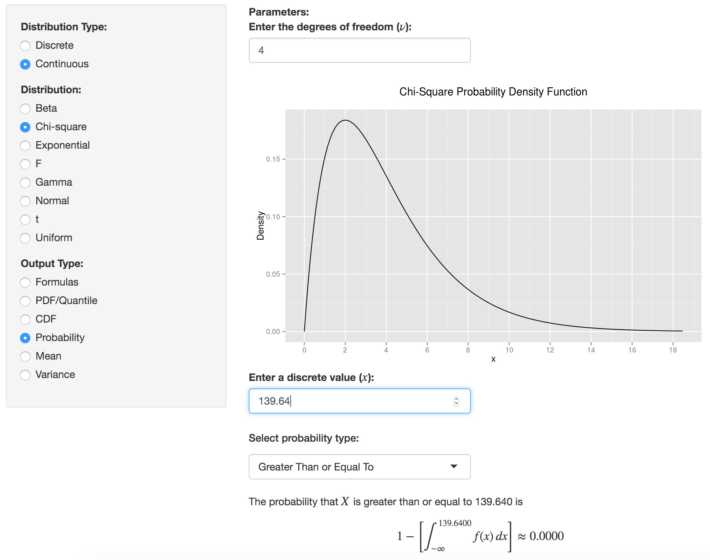

<style type="text/css">
    ol { list-style-type: upper-alpha; }
</style>

```{r setup, include=FALSE}
library(knitr)
options(digits=3)
knitr::opts_chunk$set(echo = TRUE, message = FALSE, warning = FALSE, fig.pos = 'center')
library(dplyr)
library(ggplot2)
library(ggmap)
```

## {.flexbox .vcenter}

```{r read_map, echo = FALSE, cache=TRUE}
d <- read.csv("roadless-data.csv", header = TRUE)
m <- get_map(location = c(-125, 25, -65, 50), source="stamen", maptype = "terrain-background")

# sample locations
ggmap(m) + 
  geom_point(data = d, aes(x = longitude, y = latitude), alpha = .6)
```

## {.flexbox .vcenter}

```{r withinUS, echo = FALSE}
# within continental US
ggmap(m) + 
  geom_point(data = d, aes(x = longitude, y = latitude, color = factor(withinContinent)), alpha = .6) +
  scale_colour_manual(values=c("red", "blue"), guide = FALSE)
```


## {.flexbox .vcenter}

```{r withinUS2, echo = FALSE}
# within continental US
d2 <- filter(d, withinContinent == 1)
ggmap(m) + 
  geom_point(data = d2, aes(x = longitude, y = latitude, color = factor(withinContinent)), alpha = .6) +
  scale_colour_manual(values=c("blue"), guide = FALSE)
```

## {.flexbox .vcenter}

```{r map3, echo = FALSE}
ggmap(m) + 
  geom_point(data = d2, aes(x = longitude, y = latitude, color = factor(within1mile)), alpha = .8) +
  scale_colour_manual(values=c("green", "blue"), guide = FALSE)
```


# $\chi^2$ Goodness of Fit


##

Ethnicity   | Asian | Black | Hispanic | White | Other | Total
------------|-------|-------|----------|-------|-------|-------
Obs. data   |  46   |   31  |   42     |  258  |  35   |  412
Exp. counts |  17.716 |  8.24 |   51.5   |  317.24  | 17.304  |   412

$$
Z_{asian}^2 = (46 - 17.7)^2/17.7 = 45.16 \\
Z_{black}^2 = (31 - 8.24)^2/8.24 = 62.8 \\
Z_{hispanic}^2 = (42 - 51.5)^2/51.5 = 1.75 \\
Z_{white}^2 = (258 - 317.24)^2/317.24 = 11.82 \\
Z_{other}^2 = (35 - 17.3)^2/17.3 = 18.11
$$

$$
Z_{asian}^2 + Z_{black}^2 + Z_{hispanic}^2 + Z_{white}^2 + Z_{other}^2 = 139.64 = \chi^2_{obs}
$$


## Question

Which of the following is an appropriate null hypothesis?

1. Ethnic diversity and choice of college are independent of one another.
2. Ethnic diversity and home-state are independent of one another.
3. $p_{asian} = p_{black} = p_{hispanic} = p_{white} = p_{other}$.
4. The first-year class at Reed is sampled from a population that shares
the same ethnic distribution as Oregon.


## Goodness of Fit Test {.build}

**$H_0$**: The first-year class at Reed is sampled from a population that shares
*the same* ethnic distribution as Oregon.

**$H_A$**: The first-year class at Reed is sampled from a population that has a 
*different* ethnic distribution than Oregon.


## Constructing the Null Distribution {.build}

1. **Simulation**: simulate many first-year Oregonian Reedie classes and 
calculate the $\chi^2$ for each.
2. **Probability Theory**: multinomial distribution. $X \sim \textrm{Multinom}(n, p_1, p_2, p_3, p_4, p_5)$.
3. **Chi-Squared Approximation**: if conditions are reasonable, the test statistic will
follow a known distribution under the null hypothesis.

```{r sim3, echo = FALSE, fig.align="center"}
n <- 412
p <- c(.043, .02, .125, .042, .77)
chisqs <- rep(0, 1000)
set.seed(405)

for(i in 1:1000) {
  samp <- sample(c("asian", "black", "hispanic", "other", "white"), 
       size = n, replace = TRUE, prob = p)
  obs <- c(table(samp))
  chisqs[i] <- chisq.test(obs, correct = FALSE, p = p)$statistic
}
```

```{r, echo=FALSE, fig.height=2.5}
library(ggplot2)
qplot(chisqs, geom = "density") +
  stat_function(fun = dchisq, args = c(df = 4), col = "tomato")
```


## Conditions for the $\chi^2$ approximation {.build}

1. Independent observations
2. Each cell count has a count $\ge$ 5
3. $k \ge 3$

then our statistic can be well-approximated by the $\chi^2$ distribution with 
$k - 1$ degrees of freedom.


## Finding a $p$-value {.flexbox .vcenter .centered}



## Finding a $p$-value {.build}

### R

```{r}
1 - pchisq(139.64, df = 4)
```

We reject the hypothesis that the Reed first-year class represents a random sample
from Oregon w.r.t ethnicity.


## Degrees of Freedom

*The number of independent ways by which a dynamic system can move, without violating any constraint imposed on it.* (Wikipedia)

<center>

</center>


## Degrees of Freedom {.build}
*The number of parameters that are free to vary, without violating any constraint imposed on it*.

### Parameters
$$ p_{asian}, p_{black}, p_{hispanic}, p_{white}, p_{other} $$

Since $\sum_{i = 1}^k p_i = 1$, one of our parameters is constrained, leaving $k-1$ 
that are free to vary.


## Shape of the $\chi^2$

<br/>

<center>

</center>

<br/>


## Confidence Intervals for $\chi^2$ {.build}

These make no sense. Why not?

- We don't really care what the *true* $\chi^2$ parameter value is.
- A two-sided interval wouldn't make sense
    - Distribution is bounded on the left by zero
    - Only "extreme" values are in the right tail


# $\chi^2$ Independence


## Example: Acupuncture {.build}

Haake et al. (2007) did a randomized controlled experiment to evaluate the effect of treatment on back pain reduction.

Three treatments: Chinese acupuncture, [Sham acupuncture](http://www.healthcentre.org.uk/acupuncture/sham-acupuncture.html), Drugs

What is the response variable?

- Pain measure

What is the explanatory variable?

- Treatment type

Is causation a possible conclusion?

- Yes, the treatment type is randomized to the study subjects

## Example: Acupuncture {.build}

$H_0$: pain reduction is independent of treatment

$H_A$: pain reduction is **dependent** on treatment

```{r}
treatment <- rep(c("acu", "sham", "trad"), c(387, 387, 388))
pain <- c(rep(c("reduc", "noreduc"), c(184, 203)),
          rep(c("reduc", "noreduc"), c(171, 216)),
          rep(c("reduc", "noreduc"), c(106, 282)))
table(pain, treatment)
```


##

```{r}
library(ggplot2)
qplot(x = treatment, fill = pain, geom = "bar")
```


## Constructing the Null Distribution {.build}

$H_0$ implies that the associations between these two vectors are
just due to chance, so we mirror that by randomizing the vectors to get another
possible data set under the $H_0$.

### Randomization method

```{r}
chisqs <- rep(0, 1000)
set.seed(405)
for(i in 1:1000) {
  shuffled_pain <- sample(pain)
  new_tab <- table(shuffled_pain, treatment)
  chisqs[i] <- chisq.test(new_tab)$statistic
}
```


## Randomized Null Distribution

```{r, echo = FALSE, fig.height = 3.7}
qplot(chisqs, geom = "density", xlim = c(0, 40))
```


## Randomized Null Distribution {.build}

```{r, echo = FALSE, fig.height = 3.7}
tab <- table(pain, treatment)
chi_obs <- chisq.test(tab)$statistic
qplot(chisqs, geom = "density", xlim = c(0, 40)) +
  geom_vline(xintercept = chi_obs, col = "goldenrod")
```

The proportion of simulated $\chi^2$ statistics under $H_0$ that are greater than
$\chi^2_{obs}$ is `r round(mean(chisqs > chi_obs), 4)` $\rightarrow$ we reject
the idea that pain is independent of treatment mode.


## Using the $\chi^2$ approximation {.build}

The mathematical approximation is good enough when

1. Independent observations
2. At least 5 expected counts in each cell
3. Degrees of freedom $\ge 2$

$$ df = (R - 1) \times (C - 1) $$

- $R$: number of rows in table
- $C$: number of columns in table


## $\chi^2$ approximation

```{r, echo = FALSE, fig.height = 3.7}
qplot(chisqs, geom = "density", xlim = c(0, 40)) +
  geom_vline(xintercept = chi_obs, col = "goldenrod") +
  stat_function(fun = dchisq, args = c(df = 2), col = "tomato")
library(oilabs)
```

```{r}
1 - pchisq(38.05, df = 2)
```


## inference function

```{r, fig.height = 3, warning=FALSE, eval=FALSE}
inference(x = treatment, y = pain, est = "proportion", type = "ht", 
          method = "theoretical")
```

```
H_0: Response and explanatory variable are independent.
H_A: Response and explanatory variable are dependent.
Check conditions: expected counts
         x
y         acu sham trad
  noreduc 233  233  234
  reduc   154  154  154

	Pearson's Chi-squared test

data:  y_table
X-squared = 40, df = 2, p-value = 5e-09
```

## What have we learned about pain reduction? {.build}

- Pain reduction *does* appear to be affected by the treatment method.
- We don't yet know which pairwise comparisons are significant $\rightarrow$ need
to follow up with CIs on the differences in proportions.