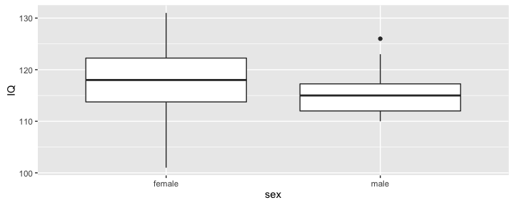
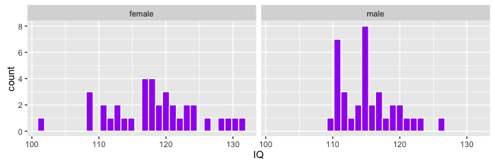
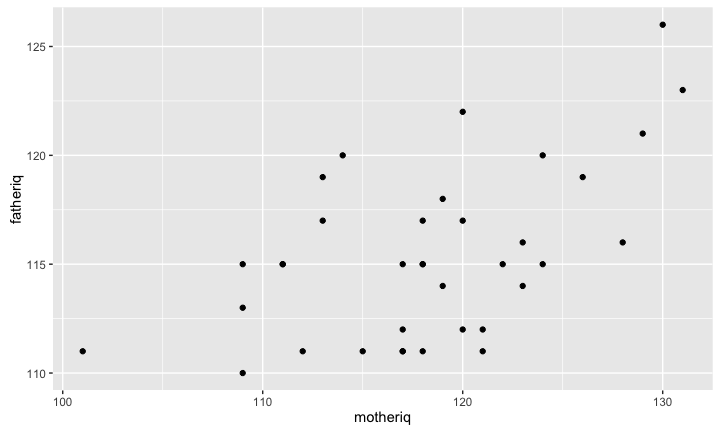
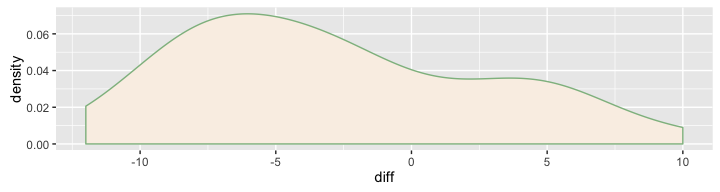

# MATH 141
Chester Ismay  


## Recap:  Hypothesis testing for a single mean

1. State hypotheses: e.g. $H_0: \mu = \mu_0$ versus $H_A: \mu \ne \mu_0$
2. Check conditions <br>
    - Independent observations  
    - Small sample size ($n < 30$) and nearly normal population
    OR <br>
    Large sample size ($n \ge 30$)
3. Compute observed $t$-statistic: $t_{obs} = \dfrac{\bar{x} - \mu_0}{s/\sqrt{n}}$
4. Draw picture to assess where $t_{obs}$ falls on $t_{df = n - 1}$
5. Compute a (two-tailed) $p$-value
6. State conclusion in terms of the alternative hypothesis


## Confidence interval for $\mu$ {.build}

point estimate $\pm$ margin of error

$$ \bar{x}_{obs} \pm (t^*_{df} \times SE) $$

- $\bar{x}$: point estimate of $\mu$.
- $t^*_{df}$: critical value that leaves $\alpha$ in the tails of a $t$ with 
$df = n - 1$.
- $SE$ (standard error of $\bar{x}$): $s_{obs}/\sqrt{n}$.


## Finding $p$-values and $t^*_{df}$ {.build}

<!--
<center>

</center>
-->


```r
pt(-2.1, df = 18)
```

```
## [1] 0.025
```

```r
qt(.975, df = 18)
```

```
## [1] 2.1
```

- Use the [applet](http://ismay.shinyapps.io/ProbApp)

# Shifting to two means

## IQ and Sex {.build}


Consider a data set containing the IQs of 36 people who identify as male and 36 people who identify as female. Researchers use this data to test the following hypotheses with $\alpha = 0.05$.

$$
H_0: \mu_{M} - \mu_{F} = 0 \\
H_A: \mu_{M} - \mu_{F} \ne 0
$$


## {.smaller}


```r
(ds <- d %>% group_by(sex) %>%
  summarize(mean = mean(IQ),
            s = sd(IQ),
            n = n()) )
```

```
## Source: local data frame [2 x 4]
## 
##      sex  mean     s     n
##   <fctr> <dbl> <dbl> <int>
## 1 female   118  6.57    36
## 2   male   115  3.92    36
```





## Two sample t-test {.build}

- We have a point estimate: $\bar{x}_{M, obs} - \bar{x}_{F, obs}$


```r
diff(ds$mean)
```

```
## [1] -2.83
```

- We can calculate a standard error: $\sqrt{\dfrac{s_{M, obs}^2}{n_{M}} + \dfrac{s_{F, obs}^2}{n_{F}}}$


```r
sqrt(ds$s[1]^2 / ds$n[1] + ds$s[2]^2 / ds$n[2])
```

```
## [1] 1.28
```


## Two sample t-test (cont.) {.build}

- We can calculate the df of the $t$ distribution


```r
min(ds$n[1] - 1, ds$n[2] - 1)
```

```
## [1] 35
```


- Our test statistic:

$$ t_{obs} = \frac{\textrm{point est.} - \textrm{null value}}{SE} = \frac{-2.83 - 0}{1.28} = -2.21 $$

## A $p$-value


```r
pt(-2.21, df = 35) * 2
```

```
## [1] 0.0337
```

- Does this support the hypothesis that mean IQs tend to be different between men and women?

    - Yes, since 0.034 < 0.05.


## But we need to check conditions {.build}

- Independent observations?
- Nearly normal populations?

- Large enough sample sizes?
    - $n_{M, obs} = n_{F, obs} = 36 > 30$

- We can be relatively confident the $t$ distribution applies here.  
    - Could also check via randomization.  How?

## Original Data

Data were collected from schools in a large city on a set of thirty-six randomly selected children
who were identified as gifted children soon after they reached the age of four. 


```r
head(gifted, 3)
```

```
##   score fatheriq motheriq speak count read edutv cartoons
## 1   159      115      117    18    26  1.9  3.00     2.00
## 2   164      117      113    20    37  2.5  1.75     3.25
## 3   154      115      118    20    32  2.2  2.75     2.50
```

- The actual IQs reported were the father's IQ and mother's IQ for each child since researchers were interested in understanding the relationship, if any, between the analytical skills of young gifted children and their father's and mother's IQ (among other things).

## Dependence between samples




## Paired data {.build}

If there is a natural pairing between observations in two groups of size $n$, it 
can make more sense to analyze them as a single sample of $n$ differences.


```r
gifted %>%
  mutate(diff = fatheriq - motheriq) %>%
  select(fatheriq, motheriq, diff)
```

```
##    fatheriq motheriq diff
## 1       115      117   -2
## 2       117      113    4
## 3       115      118   -3
## 4       123      131   -8
## 5       110      109    1
## 6       113      109    4
## 7       118      119   -1
## 8       117      120   -3
## 9       111      112   -1
## 10      122      120    2
## 11      111      117   -6
## 12      112      120   -8
## 13      119      126   -7
## 14      120      114    6
## 15      121      129   -8
## 16      111      118   -7
## 17      111      115   -4
## 18      115      111    4
## 19      126      130   -4
## 20      115      109    6
## 21      120      124   -4
## 22      115      122   -7
## 23      115      118   -3
## 24      112      121   -9
## 25      115      124   -9
## 26      117      118   -1
## 27      116      128  -12
## 28      114      119   -5
## 29      116      123   -7
## 30      111      117   -6
## 31      112      117   -5
## 32      115      111    4
## 33      111      101   10
## 34      119      113    6
## 35      111      121  -10
## 36      114      123   -9
```


## Paired t-test {.build}

$H_0: \mu_{diff} = 0$ versus $H_A: \mu_{diff} \ne 0$

### Check conditions
1. Independent pairs?

2a. Nearly normal population of differences?



2b. Large enough number of pairs? <br>
    - Yes, 36 > 30
    
## Paired t-test (cont.) {.build}

- Compute a test statistic: $\bar{x}_{d, obs}$


```r
(gs <- gifted %>%
  mutate(diff = fatheriq - motheriq) %>%
  summarize(mean = mean(diff), s = sd(diff), n = n()))
```

```
##    mean    s  n
## 1 -2.83 5.52 36
```

```r
(t_obs <- (gs$mean - 0)/(gs$s/sqrt(gs$n)))
```

```
## [1] -3.08
```

```r
pt(t_obs, df = 35) * 2
```

```
## [1] 0.00402
```


## Paired compared {.build}


```r
gs$s / sqrt(gs$n)
```

```
## [1] 0.92
```

```r
sqrt(ds$s[1]^2 / ds$n[1] + ds$s[2]^2 / ds$n[2])
```

```
## [1] 1.28
```

While the point estimate is the same in the paired and independent tests $$\bar{x}_{M} - \bar{x}_F = \bar{x}_d,$$ if
the data is paired, the dependency leads to a smaller SE.

This principle is widely used in experiment design, e.g. pre- and post-test.


## The takeaway {.build}

If you are comparing means between two groups and the data has a natural pairing,
analyze the data as **one sample** of differences.

<!--
Think of it as an analysis of $W$, not $W \sim X$.
-->


## Extra problem

<center>

</center>

