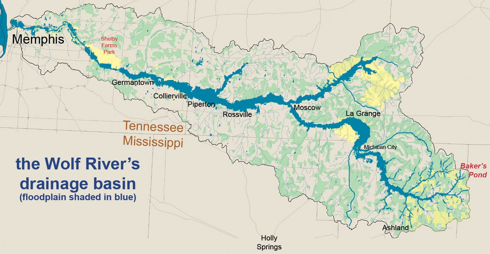
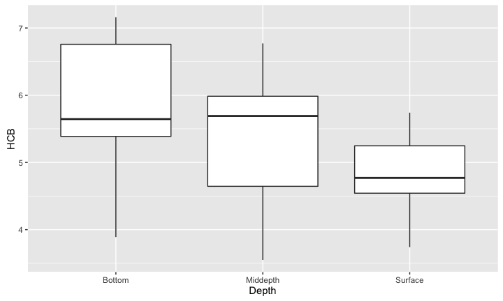
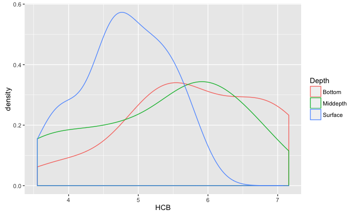
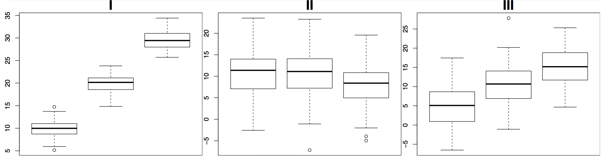
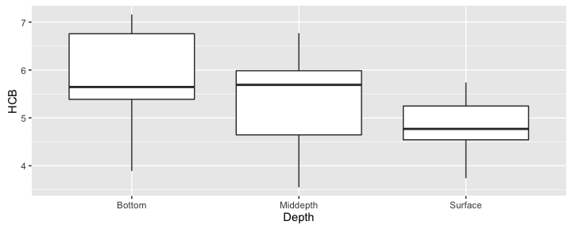
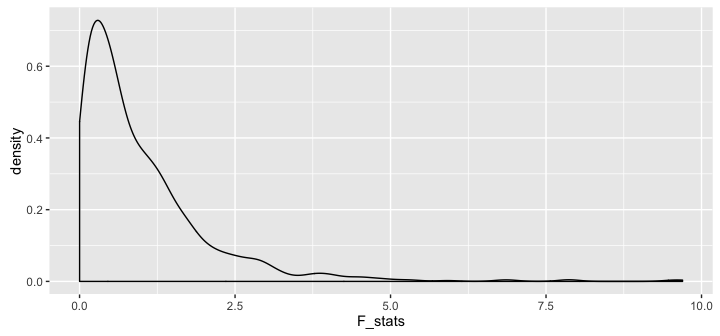
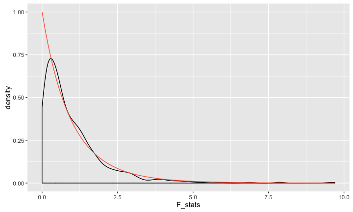

# MATH 141
Chester Ismay  

<style type="text/css">
    ol { list-style-type: upper-alpha; }
</style>


## Wolf River {.build}

<center>

</center>

- The Wolf River in Tennessee flows past an abandoned site once used by the 
pesticide industry for dumping wastes, including hexachlorobenzene (HCB).
- HCB known to cause various cancers and birth defects.


## Wolf River study {.build}

- Standard method to test whether HCB is present in a river is to take samples
at mid-depth. 
- HCB is denser than water, so is it found at different concentrations at 
different depths?


```r
str(wolf)
```

```
## 'data.frame':	30 obs. of  3 variables:
##  $ Depth : Factor w/ 3 levels "Bottom","Middepth",..: 3 3 3 3 3 3 3 3 3 3 ...
##  $ Aldrin: num  3.08 3.58 3.81 4.31 4.35 4.4 3.67 5.17 5.17 4.35 ...
##  $ HCB   : num  3.74 4.61 4 4.67 4.87 5.12 4.52 5.29 5.74 5.48 ...
```


## Wolf River data



<!--
## Wolf River data


-->

# Plicker time!

##

Which of the following plots shows groups with means that are *most* and *least*
likely to be significantly different from each other?

<center>

</center>
</br>

1. most: I, least: II 
2. most: II, least: III
3. most: I, least: III
4. most: III, least: II
<!--5. most: II, least: I-->


##
Which of the following plots shows groups with means that are *most* and *least*
likely to be significantly different from each other?

<center>

</center>
</br>

1. **most: I, least: II**
2. most: II, least: III
3. most: I, least: III
4. most: III, least: II
<!--5. most: II, least: I-->


##
<center>

</center>
</br>

- I has a high observed $F$ statistic.
- II has a low observed $F$ statistic.
- III has a middling observed $F$ statistic.


## Wolf River data {.build}



```
##           Df Sum Sq Mean Sq F value
## Depth      2   5.36   2.678    3.03
## Residuals 27  23.85   0.883
```

How big is 3.03?


## ANOVA F-test {.build}

$$ H_0: \mu_1 = \mu_2 = \ldots = \mu_k $$
$$ H_A: \textrm{At least one } \mu_j \textrm{ is different} $$

</br>

We can find the distribution of the $F$-statistic under the null hypothesis by

- Randomization
- Distributional approximation


## Sampling dist for $F$ statistic via Randomization


```r
F_stats <- rep(0, 10000)
wolf2 <- wolf

for (i in 1:10000) {
  wolf2$Depth <- sample(wolf2$Depth)
  F_stats[i] <- anova(aov(HCB ~ Depth, data = wolf2))$F[1]
}

qplot(x = F_stats, geom = "density")
```


## Sampling dist for $F$ statistic via Randomization




```r
mean(F_stats > 3.032)
```

```
## [1] 0.044
```


## Sampling dist for $F$ via Approximation {.build}

If

- independent observations,
- nearly normal distributions for each group, and
- constant variance between groups.

Then the sampling distribution for the $F$ statistic under the $H_0$ is well-approximated by a Fisher's $F$ distribution with $df_1 = k - 1$ and $df_2 = n_{total} - k$. The 
$p$-value is represented by the upper tail. 

- $n_{total}$ is the overall sample size and $k$ is the number of groups of the explanatory variable.


## Sampling dist for $F$ via Approximation




## Wolf River Conclusions {.build}


- With a $p$-value of $\approx 0.07$, it is questionable whether HCB concentration
functions the same at all three depths, based on these observed sample means.
- *Replicating the study* could add some certainty.
- In a subsequent study, we may wish to only test mid-depth versus bottom.


