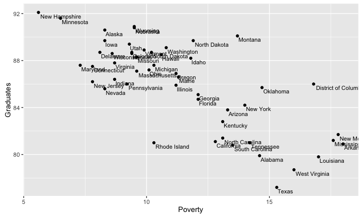
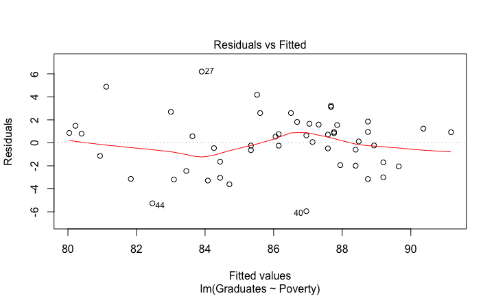
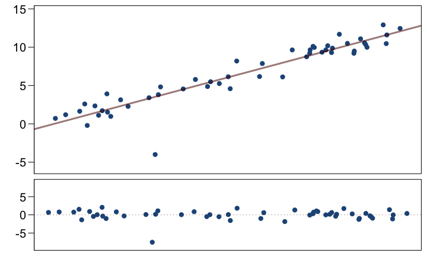
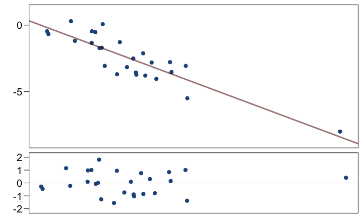
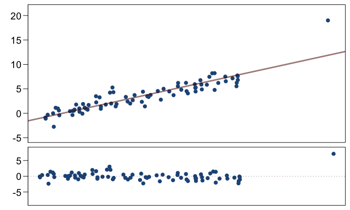

# MATH 141
Chester Ismay  


## Poverty and Graduation

<!--

-->

<!--html_preserve--><div id="htmlwidget-4942" style="width:100%;height:auto;" class="datatables html-widget"></div>
<script type="application/json" data-for="htmlwidget-4942">{"x":{"data":[["Alabama","Alaska","Arizona","Arkansas","California","Colorado","Connecticut","Delaware","District of Columbia","Florida","Georgia","Hawaii","Idaho","Illinois","Indiana","Iowa","Kansas","Kentucky","Louisiana","Maine","Maryland","Massachusetts","Michigan","Minnesota","Mississippi","Missouri","Montana","Nebraska","Nevada","New Hampshire","New Jersey","New Mexico","New York","North Carolina","North Dakota","Ohio","Oklahoma","Oregon","Pennsylvania","Rhode Island","South Carolina","South Dakota","Tennessee","Texas","Utah","Vermont","Virginia","Washington","West Virginia","Wisconsin","Wyoming"],[55.4,65.6,88.2,52.5,94.4,84.5,87.7,80.1,100,89.3,71.6,91.5,66.4,87.8,70.8,61.1,71.4,55.8,72.6,40.2,86.1,91.4,74.7,70.9,48.8,69.4,54.1,69.8,91.5,59.3,94.4,75,87.5,60.2,55.9,77.4,65.3,78.7,77.1,90.9,60.5,51.9,63.6,82.5,88.2,38.2,73,82,46.1,68.3,65.1],[71.3,70.8,87.7,81,77.5,90.2,85.4,76.3,36.2,80.6,67.5,25.9,95.5,79.5,88.9,94.9,89.3,90.3,64.2,97.1,65.6,87.2,81.5,90.2,61.2,85.3,90.9,92.1,84.1,96.3,77.3,84.9,73.6,74.1,92.5,85.4,78.4,90.8,86.4,89.2,67.7,88.8,80.8,83.6,93.6,96.9,73.9,85.5,95,90.1,94.7],[79.9,90.6,83.8,80.9,81.1,88.7,87.5,88.7,86,84.7,85.1,88.5,88.2,85.9,86.4,89.7,88.6,82.8,79.8,86.6,87.6,87.1,87.6,91.6,81.2,88.3,90.1,90.8,85.6,92.1,86.2,81.7,84.2,81.4,89.7,87.2,85.7,86.9,86,81,80.8,88.7,81,77.2,89.4,88.9,87.8,89.1,78.7,88.6,90.9],[14.6,8.3,13.3,18,12.8,9.4,7.8,8.1,16.8,12.1,12.1,10.6,11.8,11.2,8.7,8.3,9.4,13.1,17,11.3,7.3,9.6,10.3,6.5,17.6,9.6,13.7,9.5,8.3,5.6,7.8,17.8,14,13.1,11.9,10.1,14.7,11.2,9.2,10.3,13.5,10.2,14.2,15.3,9.3,9.9,8.7,10.8,16,8.6,9.5],[14.2,10.8,11.1,12.1,12.6,9.6,12.1,13.1,18.9,12,14.5,12.4,8.7,12.3,11.1,8.6,9.3,11.8,16.6,9.5,14.1,11.9,12.5,8.9,17.3,11.6,8.9,9.1,11.1,9.1,12.6,13.2,14.7,12.5,7.8,12.1,11.4,9.8,11.6,12.9,14.8,9,12.9,12.7,9.4,9.3,11.9,9.9,10.7,9.6,8.7]],"container":"<table class=\"display\">\n  <thead>\n    <tr>\n      <th>State\u003c/th>\n      <th>Metropolitan.Residence\u003c/th>\n      <th>White\u003c/th>\n      <th>Graduates\u003c/th>\n      <th>Poverty\u003c/th>\n      <th>Percent\u003c/th>\n    \u003c/tr>\n  \u003c/thead>\n\u003c/table>","options":{"pageLength":7,"autoWidth":true,"columnDefs":[{"className":"dt-right","targets":[1,2,3,4,5]}],"order":[],"orderClasses":false,"lengthMenu":[7,10,25,50,100]},"callback":null,"filter":"none"},"evals":[],"jsHooks":[]}</script><!--/html_preserve-->


## Poverty and Graduation


## Poverty and Graduation




## Poverty and Graduation


## The linear model {.build}


```r
cor(poverty$Graduates, poverty$Poverty)
```


```r
poverty %>% summarize(cor(Graduates, Poverty))
```

```
##   cor(Graduates, Poverty)
## 1                  -0.747
```

```r
lm(Graduates ~ Poverty, data = poverty)
```

```
## 
## Call:
## lm(formula = Graduates ~ Poverty, data = poverty)
## 
## Coefficients:
## (Intercept)      Poverty  
##      96.202       -0.898
```


## Residual Plot (Base R) {.build}



## Residual Plot (ggplot2) 


```r
qplot(x = .fitted, y = .stdresid, data = m1) + 
  geom_abline(intercept = 0, slope = 0, col = "blue")
```


<!--
## 
<center>

</center>


## 
<center>

</center>
-->

## Estimating $\beta_1$ {.build}


## Estimating $\beta_1$ {.build}


We use $s_x, s_y, \textrm{ and } R$ to calculate $b_1$.


## Estimating $\beta_0$ {.build}


If the line of best fit *must* pass through $(\bar{x}, \bar{y})$, what is $b_0$?


## Estimating $\beta_0$ {.build}

Recall that $\hat{y} = b_0 + b_1 x$. Since $(11.349, 86.012)$ is on the line, the following relationship holds.

$$ 86.012 = b_0 + (-0.898) (11.349) $$

Then just solve for $b_0$.

$$ b_0 = 86.012 + (0.898) (11.349) = 96.202$$

More generally:

$$ b_0 = \bar{y} - b_1 \bar{x} $$


## Estimation in R {.smaller .build}


```r
m1 <- lm(Graduates ~ Poverty, data = poverty)
summary(m1)
```

```
## 
## Call:
## lm(formula = Graduates ~ Poverty, data = poverty)
## 
## Residuals:
##    Min     1Q Median     3Q    Max 
## -5.954 -1.820  0.544  1.515  6.199 
## 
## Coefficients:
##             Estimate Std. Error t value Pr(>|t|)    
## (Intercept)   96.202      1.343   71.65  < 2e-16 ***
## Poverty       -0.898      0.114   -7.86  3.1e-10 ***
## ---
## Signif. codes:  0 '***' 0.001 '**' 0.01 '*' 0.05 '.' 0.1 ' ' 1
## 
## Residual standard error: 2.5 on 49 degrees of freedom
## Multiple R-squared:  0.558,	Adjusted R-squared:  0.549 
## F-statistic: 61.8 on 1 and 49 DF,  p-value: 3.11e-10
```


## The `lm` object {.build .smaller}


```r
attributes(m1)
```

```
## $names
##  [1] "coefficients"  "residuals"     "effects"       "rank"          "fitted.values" "assign"       
##  [7] "qr"            "df.residual"   "xlevels"       "call"          "terms"         "model"        
## 
## $class
## [1] "lm"
```

```r
m1$coef
```

```
## (Intercept)     Poverty 
##      96.202      -0.898
```

```r
m1$fit
```

```
##    1    2    3    4    5    6    7    8    9   10   11   12   13   14   15   16   17   18   19   20 
## 83.1 88.7 84.3 80.0 84.7 87.8 89.2 88.9 81.1 85.3 85.3 86.7 85.6 86.1 88.4 88.7 87.8 84.4 80.9 86.1 
##   21   22   23   24   25   26   27   28   29   30   31   32   33   34   35   36   37   38   39   40 
## 89.6 87.6 87.0 90.4 80.4 87.6 83.9 87.7 88.7 91.2 89.2 80.2 83.6 84.4 85.5 87.1 83.0 86.1 87.9 87.0 
##   41   42   43   44   45   46   47   48   49   50   51 
## 84.1 87.0 83.5 82.5 87.9 87.3 88.4 86.5 81.8 88.5 87.7
```


## Interpretation of $b_1$ {.build}

The **slope** describes the estimated difference in the $y$ variable if the explanatory
variable $x$ for a case happened to be one unit larger.


```r
m1$coef[2]
```

```
## Poverty 
##  -0.898
```

*For each additional percentage point of people living below the poverty level,
we expect a state to have a proportion of high school graduates that is 0.898
lower*.

**Be Cautious**: if it is observational data, you do not have evidence of a 
*causal link*, but of an association, which still can be used for prediction.


## Interpretation of $b_0$ {.build}

The **intercept** is the estimated $y$ value that will be taken by a case with 
an $x$ value of zero.


```r
m1$coef[1]
```

```
## (Intercept) 
##        96.2
```

While necessary for prediction, the intercept often has no meaningful interpretation.


# Outliers

## What is an outlier? {.build}

<div class="columns-2">


**Outlier** is a general term to describe a data point that doesn't follow the
pattern set by the bulk of the data, when one takes into account the model.
</div>


## Outlier Example One





## Outlier Example Two


## Outlier Example Three




## Outlier Example Four




## Outlier Example Four (modified)


