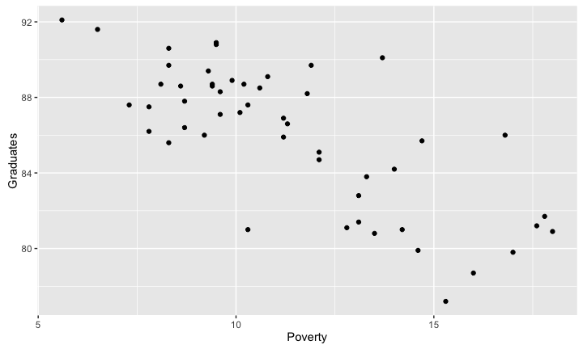
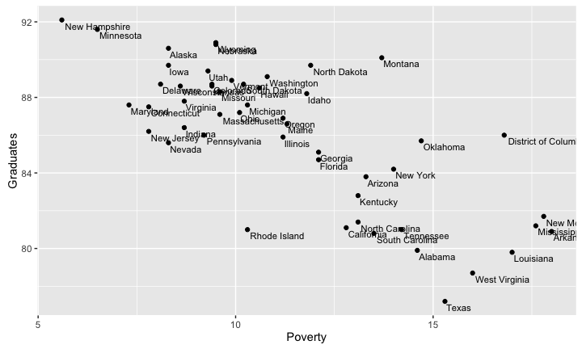
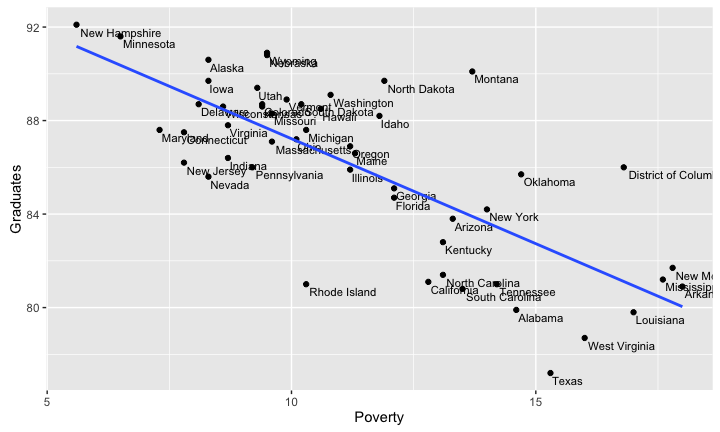
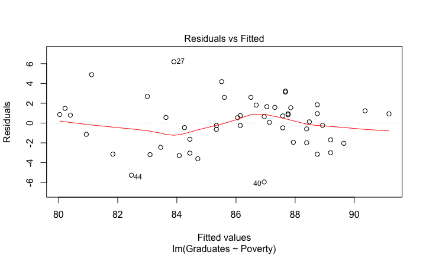
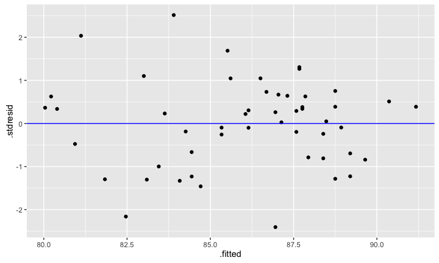
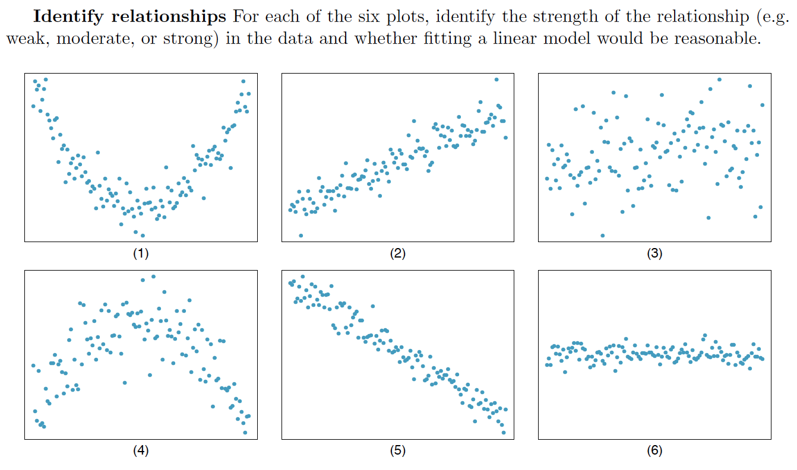
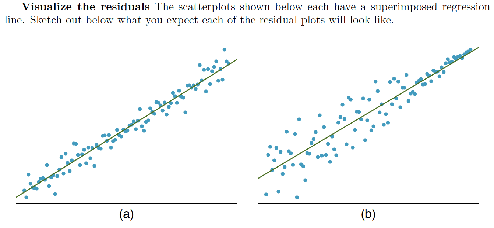
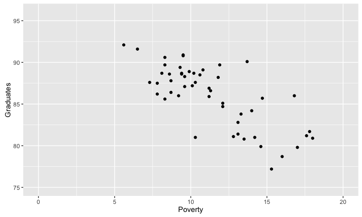
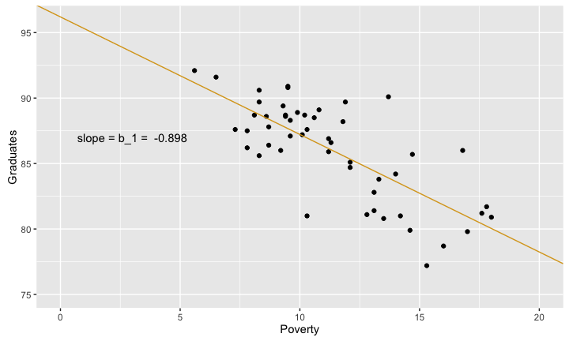
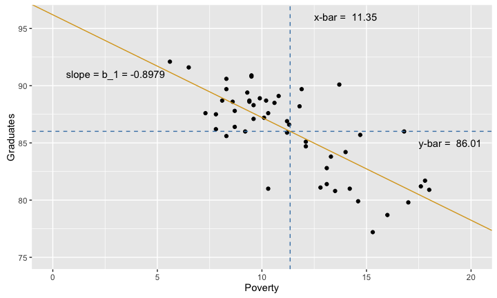

# MATH 141
Chester Ismay  


## Poverty and Graduation

<!--

-->


```
##                   State Metropolitan.Residence White Graduates Poverty
## 1               Alabama                   55.4  71.3      79.9    14.6
## 2                Alaska                   65.6  70.8      90.6     8.3
## 3               Arizona                   88.2  87.7      83.8    13.3
## 4              Arkansas                   52.5  81.0      80.9    18.0
## 5            California                   94.4  77.5      81.1    12.8
## 6              Colorado                   84.5  90.2      88.7     9.4
## 7           Connecticut                   87.7  85.4      87.5     7.8
## 8              Delaware                   80.1  76.3      88.7     8.1
## 9  District of Columbia                  100.0  36.2      86.0    16.8
## 10              Florida                   89.3  80.6      84.7    12.1
## 11              Georgia                   71.6  67.5      85.1    12.1
## 12               Hawaii                   91.5  25.9      88.5    10.6
## 13                Idaho                   66.4  95.5      88.2    11.8
## 14             Illinois                   87.8  79.5      85.9    11.2
## 15              Indiana                   70.8  88.9      86.4     8.7
```


## Poverty and Graduation



## Interactive table


```r
datatable(poverty, rownames = FALSE, options = list(pageLength = 6))
```

<!--html_preserve--><div id="htmlwidget-3328" style="width:100%;height:auto;" class="datatables html-widget"></div>
<script type="application/json" data-for="htmlwidget-3328">{"x":{"data":[["Alabama","Alaska","Arizona","Arkansas","California","Colorado","Connecticut","Delaware","District of Columbia","Florida","Georgia","Hawaii","Idaho","Illinois","Indiana","Iowa","Kansas","Kentucky","Louisiana","Maine","Maryland","Massachusetts","Michigan","Minnesota","Mississippi","Missouri","Montana","Nebraska","Nevada","New Hampshire","New Jersey","New Mexico","New York","North Carolina","North Dakota","Ohio","Oklahoma","Oregon","Pennsylvania","Rhode Island","South Carolina","South Dakota","Tennessee","Texas","Utah","Vermont","Virginia","Washington","West Virginia","Wisconsin","Wyoming"],[55.4,65.6,88.2,52.5,94.4,84.5,87.7,80.1,100,89.3,71.6,91.5,66.4,87.8,70.8,61.1,71.4,55.8,72.6,40.2,86.1,91.4,74.7,70.9,48.8,69.4,54.1,69.8,91.5,59.3,94.4,75,87.5,60.2,55.9,77.4,65.3,78.7,77.1,90.9,60.5,51.9,63.6,82.5,88.2,38.2,73,82,46.1,68.3,65.1],[71.3,70.8,87.7,81,77.5,90.2,85.4,76.3,36.2,80.6,67.5,25.9,95.5,79.5,88.9,94.9,89.3,90.3,64.2,97.1,65.6,87.2,81.5,90.2,61.2,85.3,90.9,92.1,84.1,96.3,77.3,84.9,73.6,74.1,92.5,85.4,78.4,90.8,86.4,89.2,67.7,88.8,80.8,83.6,93.6,96.9,73.9,85.5,95,90.1,94.7],[79.9,90.6,83.8,80.9,81.1,88.7,87.5,88.7,86,84.7,85.1,88.5,88.2,85.9,86.4,89.7,88.6,82.8,79.8,86.6,87.6,87.1,87.6,91.6,81.2,88.3,90.1,90.8,85.6,92.1,86.2,81.7,84.2,81.4,89.7,87.2,85.7,86.9,86,81,80.8,88.7,81,77.2,89.4,88.9,87.8,89.1,78.7,88.6,90.9],[14.6,8.3,13.3,18,12.8,9.4,7.8,8.1,16.8,12.1,12.1,10.6,11.8,11.2,8.7,8.3,9.4,13.1,17,11.3,7.3,9.6,10.3,6.5,17.6,9.6,13.7,9.5,8.3,5.6,7.8,17.8,14,13.1,11.9,10.1,14.7,11.2,9.2,10.3,13.5,10.2,14.2,15.3,9.3,9.9,8.7,10.8,16,8.6,9.5]],"container":"<table class=\"display\">\n  <thead>\n    <tr>\n      <th>State\u003c/th>\n      <th>Metropolitan.Residence\u003c/th>\n      <th>White\u003c/th>\n      <th>Graduates\u003c/th>\n      <th>Poverty\u003c/th>\n    \u003c/tr>\n  \u003c/thead>\n\u003c/table>","options":{"pageLength":6,"columnDefs":[{"className":"dt-right","targets":[1,2,3,4]}],"order":[],"autoWidth":false,"orderClasses":false,"lengthMenu":[6,10,25,50,100]},"callback":null,"filter":"none"},"evals":[],"jsHooks":[]}</script><!--/html_preserve-->


## Poverty and Graduation




## Poverty and Graduation




## The linear model {.build}


```r
cor(poverty$Graduates, poverty$Poverty)
```


```r
poverty %>% summarize(cor(Graduates, Poverty))
```

```
##   cor(Graduates, Poverty)
## 1                  -0.747
```

```r
lm(Graduates ~ Poverty, data = poverty)
```

```
## 
## Call:
## lm(formula = Graduates ~ Poverty, data = poverty)
## 
## Coefficients:
## (Intercept)      Poverty  
##      96.202       -0.898
```


## Residual Plot (Base R) {.build}



## Residual Plot (ggplot2) 


```r
qplot(x = .fitted, y = .stdresid, data = m1) + 
  geom_abline(intercept = 0, slope = 0, col = "blue")
```



<!--
## 
<center>

</center>


## 
<center>

</center>
-->

## Estimating $\beta_1$



## Estimating $\beta_1$

We use $s_x, s_y, \textrm{ and } R$ to calculate $b_1$.




## Estimating $\beta_0$ {.build}

If the line of best fit *must* pass through $(\bar{x}, \bar{y})$, what is $b_0$?




## Estimating $\beta_0$ {.build}

Recall that $\hat{y} = b_0 + b_1 x$. Since $(11.349, 86.012)$ is on the line, the following relationship holds.

$$ 86.012 = b_0 + (-0.898) (11.349) $$

Then just solve for $b_0$.

$$ b_0 = 86.012 + (0.898) (11.349) = 96.202$$

More generally:

$$ b_0 = \bar{y} - b_1 \bar{x} $$

