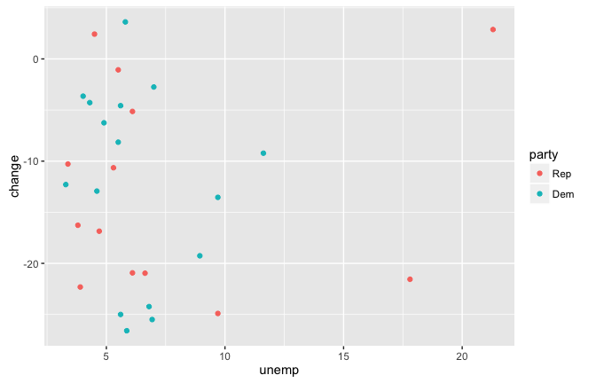
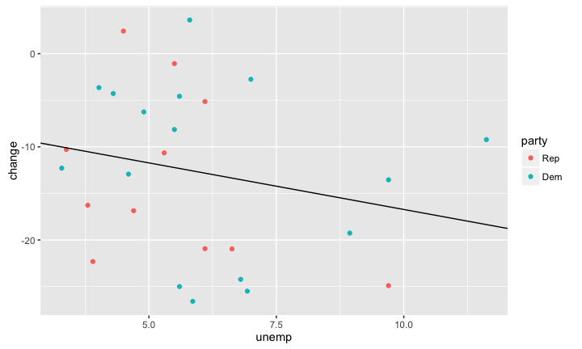
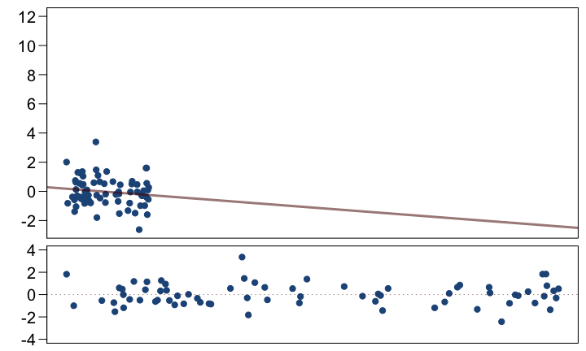
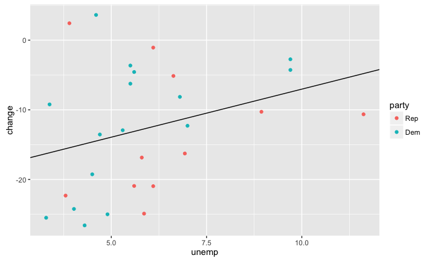
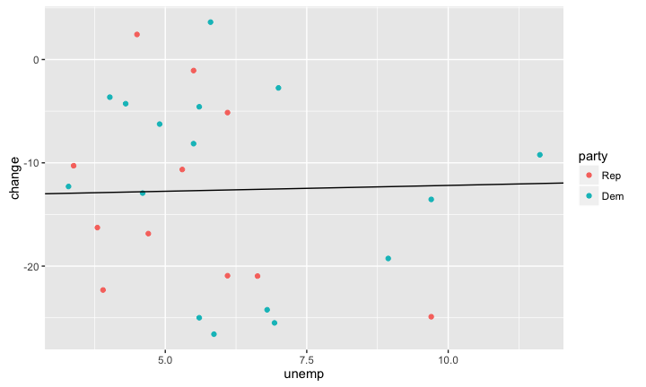
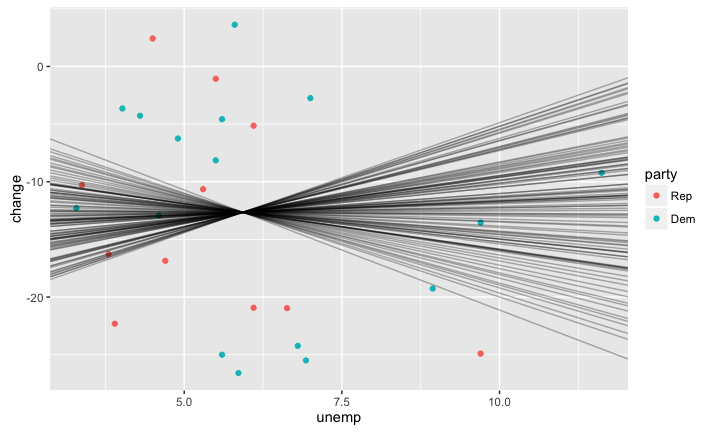
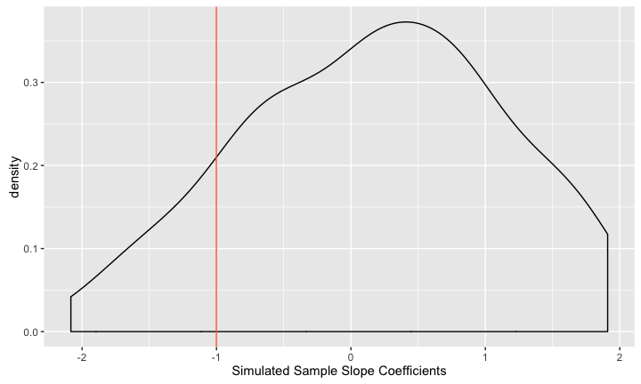

# MATH 141
Chester Ismay  


## Estimation in R {.smaller .build}


```r
m1 <- lm(Graduates ~ Poverty, data = poverty)
summary(m1)
```

```
## 
## Call:
## lm(formula = Graduates ~ Poverty, data = poverty)
## 
## Residuals:
##    Min     1Q Median     3Q    Max 
## -5.954 -1.820  0.544  1.515  6.199 
## 
## Coefficients:
##             Estimate Std. Error t value Pr(>|t|)    
## (Intercept)   96.202      1.343   71.65  < 2e-16 ***
## Poverty       -0.898      0.114   -7.86  3.1e-10 ***
## ---
## Signif. codes:  0 '***' 0.001 '**' 0.01 '*' 0.05 '.' 0.1 ' ' 1
## 
## Residual standard error: 2.5 on 49 degrees of freedom
## Multiple R-squared:  0.558,	Adjusted R-squared:  0.549 
## F-statistic: 61.8 on 1 and 49 DF,  p-value: 3.11e-10
```


## The `lm` object {.build .smaller}


```r
attributes(m1)
```

```
## $names
##  [1] "coefficients"  "residuals"     "effects"       "rank"          "fitted.values" "assign"       
##  [7] "qr"            "df.residual"   "xlevels"       "call"          "terms"         "model"        
## 
## $class
## [1] "lm"
```

```r
m1$fit
```

```
##    1    2    3    4    5    6    7    8    9   10   11   12   13   14   15   16   17   18   19   20 
## 83.1 88.7 84.3 80.0 84.7 87.8 89.2 88.9 81.1 85.3 85.3 86.7 85.6 86.1 88.4 88.7 87.8 84.4 80.9 86.1 
##   21   22   23   24   25   26   27   28   29   30   31   32   33   34   35   36   37   38   39   40 
## 89.6 87.6 87.0 90.4 80.4 87.6 83.9 87.7 88.7 91.2 89.2 80.2 83.6 84.4 85.5 87.1 83.0 86.1 87.9 87.0 
##   41   42   43   44   45   46   47   48   49   50   51 
## 84.1 87.0 83.5 82.5 87.9 87.3 88.4 86.5 81.8 88.5 87.7
```

## The `lm` object {.build .smaller}


```r
m1$coef
```

```
## (Intercept)     Poverty 
##      96.202      -0.898
```

```r
m1$residuals
```

```
##       1       2       3       4       5       6       7       8       9      10      11      12 
## -3.1927  1.8505 -0.4600  0.8602 -3.6089  0.9382 -1.6985 -0.2291  4.8827 -0.6375 -0.2375  1.8157 
##      13      14      15      16      17      18      19      20      21      22      23      24 
##  2.5932 -0.2456 -1.9903  0.9505  0.8382 -1.6395 -1.1377  0.5442 -2.0474 -0.4822  0.6463  1.2342 
##      25      26      27      28      29      30      31      32      33      34      35      36 
##  0.8011  0.7178  6.1992  3.1280 -3.1495  0.9261 -2.9985  1.4806  0.5686 -3.0395  4.1830  0.0667 
##      37      38      39      40      41      42      43      44      45      46      47      48 
##  2.6971  0.7544 -1.9414 -5.9537 -3.2804  1.6565 -2.4518 -5.2641  1.5484  1.5871 -0.5903  2.5953 
##      49      50      51 
## -3.1356  0.1199  3.2280
```


## Interpretation of $b_1$ {.build}

The **slope** describes the estimated difference in the $y$ variable if the explanatory
variable $x$ for a case happened to be one unit larger.


```r
m1$coef[2]
```

```
## Poverty 
##  -0.898
```

*For each additional percentage point of people living below the poverty level,
we expect a state to have a proportion of high school graduates that is 0.898
lower*.

**Be Cautious**: if it is observational data, you do not have evidence of a 
*causal link*, but of an association, which still can be used for prediction.


## Interpretation of $b_0$ {.build}

The **intercept** is the estimated $y$ value that will be taken by a case with 
an $x$ value of zero.


```r
m1$coef[1]
```

```
## (Intercept) 
##        96.2
```

While necessary for prediction, the intercept often has no meaningful interpretation.

## Inference for Regression {.build}
We can fit a line through any cloud of points that we please, but if we
just have a *sample* of data, any trend we detect doesn't necessarily 
demonstrate that the trend exists in the *population* at large.

<!--
## Plato's Allegory of the Cave

<div class="centered">

</div>
-->

## Statistical Inference {.build}

**Goal**: use *statistics* calculated from data to makes inferences about the 
nature of *parameters*.

In regression,

- parameters: $\beta_0$, $\beta_1$
- statistics: $b_0$, $b_1$

Classical tools of inference:

- Confidence Intervals
- Hypothesis Tests


## Unemployment and elections {.build}




<center>
**Reigning theory**: voters will punish candidates from the President's party
at the ballot box when unemployment is high.
</center>

## Unemployment and elections

<!--html_preserve--><div id="htmlwidget-2030" style="width:672px;height:432px;" class="plotly html-widget"></div>
<script type="application/json" data-for="htmlwidget-2030">{"x":{"data":[{"x":[6.63,3.38,21.3,17.8,4.7,3.9,5.3,5.5,3.8,6.1,6.1,4.5,9.7],"y":[-20.9621993127148,-10.2803738317757,2.87539936102235,-21.5568862275449,-16.8539325842697,-22.3140495867769,-10.6463878326996,-1.06813513395393,-16.271186440678,-5.13698630136987,-20.9302325581395,2.42718446601941,-24.9027237354086],"text":["party: Rep<br>unemp: 6.63<br>change: -20.96","party: Rep<br>unemp: 3.38<br>change: -10.28","party: Rep<br>unemp: 21.3<br>change: 2.88","party: Rep<br>unemp: 17.8<br>change: -21.56","party: Rep<br>unemp: 4.7<br>change: -16.85","party: Rep<br>unemp: 3.9<br>change: -22.31","party: Rep<br>unemp: 5.3<br>change: -10.65","party: Rep<br>unemp: 5.5<br>change: -1.07","party: Rep<br>unemp: 3.8<br>change: -16.27","party: Rep<br>unemp: 6.1<br>change: -5.14","party: Rep<br>unemp: 6.1<br>change: -20.93","party: Rep<br>unemp: 4.5<br>change: 2.43","party: Rep<br>unemp: 9.7<br>change: -24.9"],"key":null,"type":"scatter","mode":"markers","marker":{"autocolorscale":false,"color":"rgb(248,118,109)","opacity":1,"size":5.66929133858268,"symbol":"circle","line":{"width":1.88976377952756,"color":"rgb(248,118,109)"}},"name":"Rep","legendgroup":"Rep","showlegend":true,"xaxis":"x","yaxis":"y","hoverinfo":"text"},{"x":[11.62,4.3,3.29,5.86,6.93,4.02,8.94,5.5,6.8,4.9,5.6,9.7,7,5.6,5.8,4.6],"y":[-9.22330097087377,-4.27590673575129,-12.2914989657737,-26.5906404283429,-25.4966887417219,-3.64372469635626,-19.2592592592593,-8.14479638009049,-24.2289695686328,-6.25,-25,-13.5416666666667,-2.74725274725276,-4.57142857142857,3.61990950226244,-12.9310344827586],"text":["party: Dem<br>unemp: 11.62<br>change: -9.22","party: Dem<br>unemp: 4.3<br>change: -4.28","party: Dem<br>unemp: 3.29<br>change: -12.29","party: Dem<br>unemp: 5.86<br>change: -26.59","party: Dem<br>unemp: 6.93<br>change: -25.5","party: Dem<br>unemp: 4.02<br>change: -3.64","party: Dem<br>unemp: 8.94<br>change: -19.26","party: Dem<br>unemp: 5.5<br>change: -8.14","party: Dem<br>unemp: 6.8<br>change: -24.23","party: Dem<br>unemp: 4.9<br>change: -6.25","party: Dem<br>unemp: 5.6<br>change: -25","party: Dem<br>unemp: 9.7<br>change: -13.54","party: Dem<br>unemp: 7<br>change: -2.75","party: Dem<br>unemp: 5.6<br>change: -4.57","party: Dem<br>unemp: 5.8<br>change: 3.62","party: Dem<br>unemp: 4.6<br>change: -12.93"],"key":null,"type":"scatter","mode":"markers","marker":{"autocolorscale":false,"color":"rgb(0,191,196)","opacity":1,"size":5.66929133858268,"symbol":"circle","line":{"width":1.88976377952756,"color":"rgb(0,191,196)"}},"name":"Dem","legendgroup":"Dem","showlegend":true,"xaxis":"x","yaxis":"y","hoverinfo":"text"},{"x":[2.3895,22.2005],"y":[-12.5897956852359,-11.84123728539],"text":["party: black<br>unemp: <br>change: <br>intercept: -12.68<br>slope: 0.04","party: black<br>unemp: <br>change: <br>intercept: -12.68<br>slope: 0.04"],"type":"scatter","mode":"lines","name":"","line":{"width":1.88976377952756,"color":"rgb(0,0,0)","dash":"solid"},"showlegend":false,"xaxis":"x","yaxis":"y","hoverinfo":"text"}],"layout":{"margin":{"b":41.3191273465246,"l":43.1050228310502,"t":27.3647894469812,"r":7.30593607305936},"plot_bgcolor":"rgb(235,235,235)","paper_bgcolor":"rgb(255,255,255)","font":{"color":"rgb(0,0,0)","family":"","size":14.6118721461187},"xaxis":{"type":"linear","autorange":false,"tickmode":"array","range":[2.3895,22.2005],"ticktext":["5","10","15","20"],"tickvals":[5,10,15,20],"ticks":"outside","tickcolor":"rgb(51,51,51)","ticklen":3.65296803652968,"tickwidth":0.66417600664176,"showticklabels":true,"tickfont":{"color":"rgb(77,77,77)","family":"","size":11.689497716895},"tickangle":-0,"showline":false,"linecolor":null,"linewidth":0,"showgrid":true,"domain":[0,1],"gridcolor":"rgb(255,255,255)","gridwidth":0.66417600664176,"zeroline":false,"anchor":"y","hoverformat":".2f"},"annotations":[{"text":"unemp","x":0.5,"y":-0.0917469981396922,"showarrow":false,"ax":0,"ay":0,"font":{"color":"rgb(0,0,0)","family":"","size":14.6118721461187},"xref":"paper","yref":"paper","textangle":-0,"xanchor":"center","yanchor":"middle"},{"text":"change","x":-0.0742009132420091,"y":0.5,"showarrow":false,"ax":0,"ay":0,"font":{"color":"rgb(0,0,0)","family":"","size":14.6118721461187},"xref":"paper","yref":"paper","textangle":-90,"xanchor":"center","yanchor":"middle"},{"text":"party","x":1.02,"y":1,"showarrow":false,"ax":0,"ay":0,"font":{"color":"rgb(0,0,0)","family":"","size":14.6118721461187},"xref":"paper","yref":"paper","textangle":-0,"xanchor":"left","yanchor":"top"}],"yaxis":{"type":"linear","autorange":false,"tickmode":"array","range":[-28.1011679248732,5.13043699879271],"ticktext":["-20","-10","0"],"tickvals":[-20,-10,0],"ticks":"outside","tickcolor":"rgb(51,51,51)","ticklen":3.65296803652968,"tickwidth":0.66417600664176,"showticklabels":true,"tickfont":{"color":"rgb(77,77,77)","family":"","size":11.689497716895},"tickangle":-0,"showline":false,"linecolor":null,"linewidth":0,"showgrid":true,"domain":[0,1],"gridcolor":"rgb(255,255,255)","gridwidth":0.66417600664176,"zeroline":false,"anchor":"x","hoverformat":".2f"},"shapes":[{"type":"rect","fillcolor":null,"line":{"color":null,"width":0,"linetype":[]},"yref":"paper","xref":"paper","x0":0,"x1":1,"y0":0,"y1":1}],"showlegend":true,"legend":{"bgcolor":"rgb(255,255,255)","bordercolor":"transparent","borderwidth":1.88976377952756,"font":{"color":"rgb(0,0,0)","family":"","size":11.689497716895},"y":0.903762029746282},"hovermode":"closest"},"source":"A","config":{"modeBarButtonsToRemove":["sendDataToCloud"]},"base_url":"https://plot.ly"},"evals":[],"jsHooks":[]}</script><!--/html_preserve-->

<center>
**Reigning theory**: voters will punish candidates from the President's party
at the ballot box when unemployment is high.
</center>

## Unemployment and elections {.build}



<center>
Some evidence of a negative linear relationship between unemployment level
and change in party support - or is there?
</center>

## Hypothesis Test for Regression Slope {.build}

$H_0:$ There is no relationship between unemployment level and change in 
party support.

$H_O: \beta_1 = 0$

### Method
If there is no relationship, the pairing between $X$ and $Y$ is
artificial and we can randomize:

1. Create synthetic data sets under $H_0$ by shuffling $X$.
2. Compute a new regression line for each data set and store each $b_1$.
3. See where your observed $b_1$ falls in the distribution of $b_1$'s under $H_0$.


##


```r
ump_shuffled$unemp <- sample(ump_shuffled$unemp)
qplot(x = unemp, y = change, col = party, data = ump_shuffled)
```



## First $b_1$




## Second $b_1$




## 100 $b_1$'s




## Sampling dist. of $b_1$




## Hypothesis Test for Regression Slope {.smaller}


```r
m0 <- lm(change ~ unemp, data = ump)
summary(m0)
```

```
## 
## Call:
## lm(formula = change ~ unemp, data = ump)
## 
## Residuals:
##     Min      1Q  Median      3Q     Max 
## -14.011  -7.861  -0.183   7.389  16.140 
## 
## Coefficients:
##             Estimate Std. Error t value Pr(>|t|)
## (Intercept)   -6.714      5.457   -1.23     0.23
## unemp         -1.001      0.872   -1.15     0.26
## 
## Residual standard error: 9.11 on 25 degrees of freedom
## Multiple R-squared:  0.0501,	Adjusted R-squared:  0.0121 
## F-statistic: 1.32 on 1 and 25 DF,  p-value: 0.262
```


## Hypothesis Test for Regression Slope {.smaller .build}

- Each line in the summary table is a hypothesis test that the parameter is zero.
- Under certain conditions, the test statistic associated with $b$'s is distributed 
like $t$ random variables with $n - p$ degrees of freedom.

$$ \frac{b - \beta}{SE} \sim t_{df = n - p}$$


```r
t_stat <- (-1.0010 - 0)/0.8717
pt(t_stat, df = 27 - 2) * 2
```

```
## [1] 0.262
```


## Conditions for inference

1. **Linearity**: linear trend between $X$ and $Y$, check with residual plot.
2. **Independent errors**: check with residual plot for serial correlation.
3. **Normally distributed errors**: check for linearity in qq-plot.
4. **Constant variance**: look for constant spread in residual plot.


##

<center>

</center>

