# MATH 141
Chester Ismay  

# Plicker time!

##

In a study of legibility and visibility of highway signs, a Pennsylvania research firm determined the maximum distance (in feet) at which each of 15 drivers could read a newly designed highway sign. The firm also recorded the age (in years) of each of the drivers. The 15 drivers in the study ranged from 18 to 82 years old. The firm wanted to investigate if there was an association between a driver's age and the maximum distance from which they could read the new style of sign. They believed that younger drivers could read the sign from a farther distance than older drivers.

##

<!--
-->
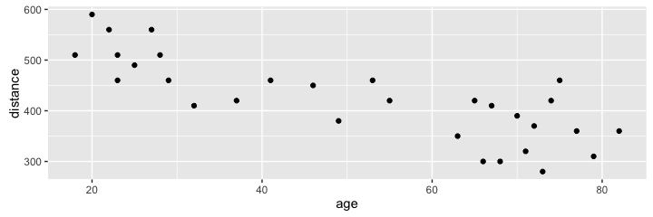

<!--

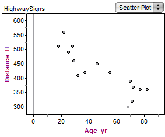

-->

A scatterplot of the data is shown. Which of the following could be the value of the correlation coefficient for this study?
<!--
-->

- $R = 0.7$
- $R = 0$
- $R = -0.3$
- $R = -0.9$

## 

Assuming conditions are met, the least squares regression equation for predicting reading distance (in feet) from age (in years) is $\widehat{distance} = 561.40 - 2.86\,age$. Which is the best (most complete) interpretation of the slope of this line?

- A newborn could read the sign from about 561 feet away.
- For each additional year in age, the predicted maximal reading distance decreases by 2.86 feet on average.
- As the age of drivers increases from 18 to 82 years old, the reading distance drops by 286%.
-  Each increase of one year in age is associated with an average predicted decrease in reading distance of 2.86%.

## Type of Problem

Researchers Oken et al. conducted a study where 135 generally
healthy men and women aged 65-85 years were randomly assigned to either 6 months of Hatha yoga class (44 people), walking exercise (47 people), or wait-list control (44 people). One of the outcomes of interest was change in "chair sit and reach” - a measure of how far the subject can reach out while sitting on a
chair, without losing balance.  Does an association exist between the reach measurement and the exercise assignment?

- Multiple means
- Multiple proportions
- Correlation/regression
- None of the above

## Type of Problem

In an article published in the Lancet (2001), researchers shared their findings from a study where they followed 6272 Swedish men for 30 years to see whether there was an association between the amount of fish in the diet and likelihood of prostate cancer.  The amount of fish was grouped into categories of large, moderate, small, and none.  It was noted whether the men obtained prostate cancer or not.

- Multiple means
- Multiple proportions
- Correlation/regression
- None of the above

## Type of Problem

Is hand span a good predictor of how much candy you can grab? Using 45 college students as subjects, researchers set out to explore whether a positive association exists between hand span (cm) and the number of tootsie rolls each subject could grab.

- Multiple means
- Multiple proportions
- Correlation/regression
- None of the above

## Conditions for inference with simple linear regression

1. **Linearity**: linear trend between $X$ and $Y$, check with residual plot.
2. **Independent errors**: check with residual plot for serial correlation.
3. **Normally distributed errors**: check for linearity in qq-plot.
4. **Constant variance**: look for constant spread in residual plot.

##

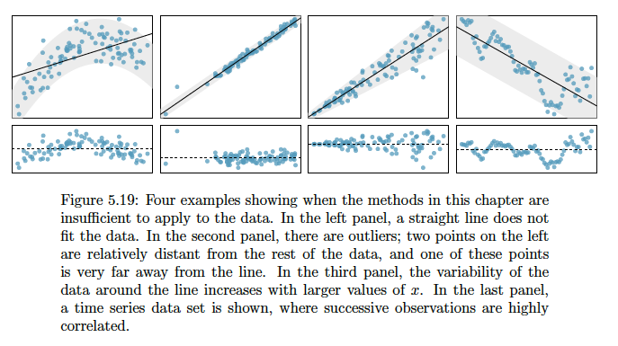

# Outliers

## What is an outlier? {.build}

**Outlier** is a general term to describe a data point that doesn't follow the
pattern set by the bulk of the data, when one takes into account the model.

## Outlier Example One

## Outlier Example Two

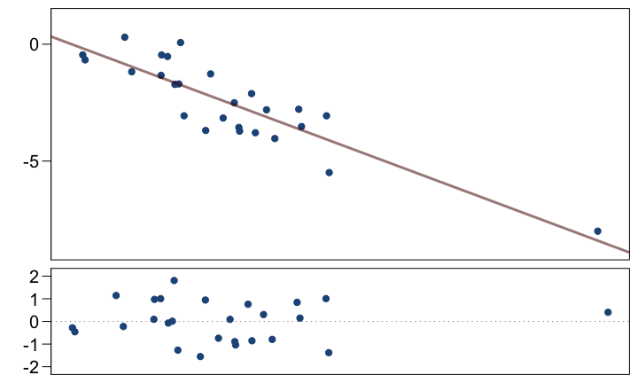

## Outlier Example Three

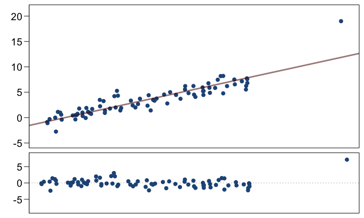

## Outlier Example Four

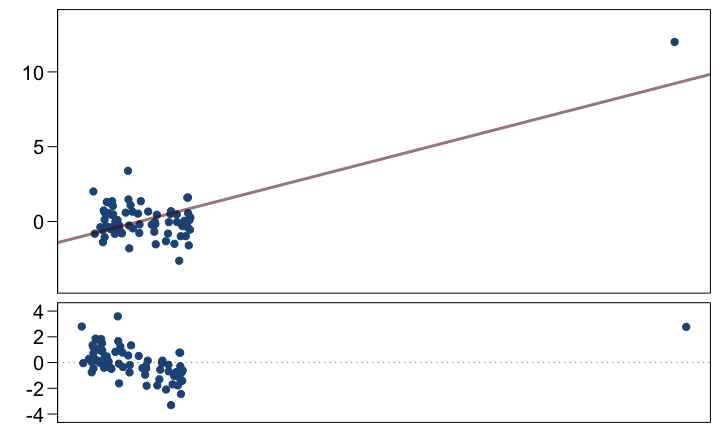

## Outlier Example Four (modified)

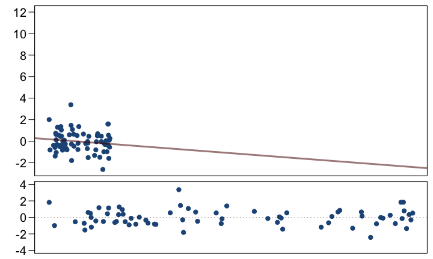

## Outliers, leverage, influence {.build}

**Outliers** are points that don't fit the trend in the rest of the data.

**High leverage points** have the potential to have an unusually large influence 
on the fitted model.

**Influential points** are high leverage points that cause a very different
line to be fit than would be with that point removed.

## Example of high leverage, high influence

We have data on the surface temperature and light intensity of 47 stars in the
star cluster CYG OB1, near Cygnus.

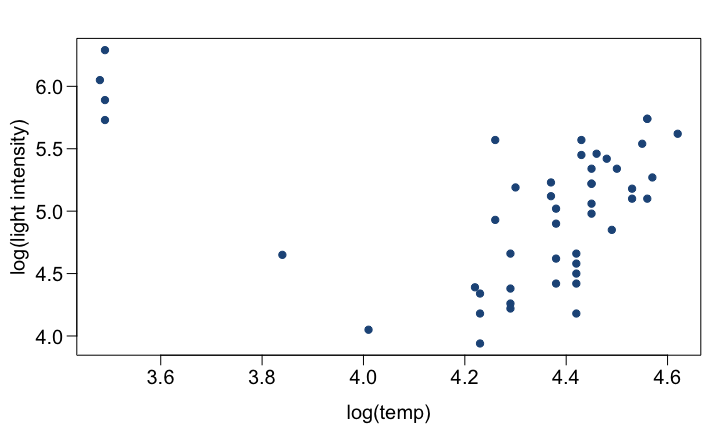

## Example of high leverage, high influence

We have data on the surface temperature and light intensity of 47 stars in the
star cluster CYG OB1, near Cygnus.

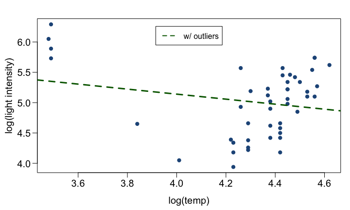

## Example of high leverage, high influence

We have data on the surface temperature and light intensity of 47 stars in the
star cluster CYG OB1, near Cygnus.

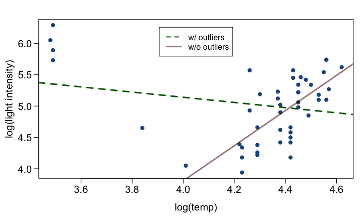

## Example of high leverage, low influence

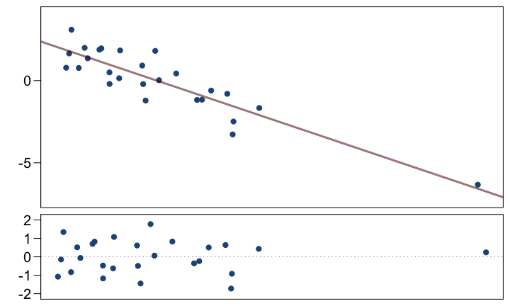

<!--
## From leverage to influence

**Leverage** measures the weight given to each point in determining the regression
line.

**Influence** measures how different the regression line would be without a given
point. Often measured with *Cook's Distance*.

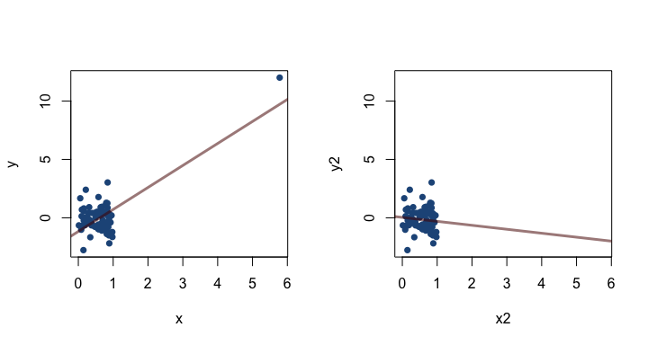

## {.smaller}

In the following plots are there outliers, leverage pts, or influential pts?

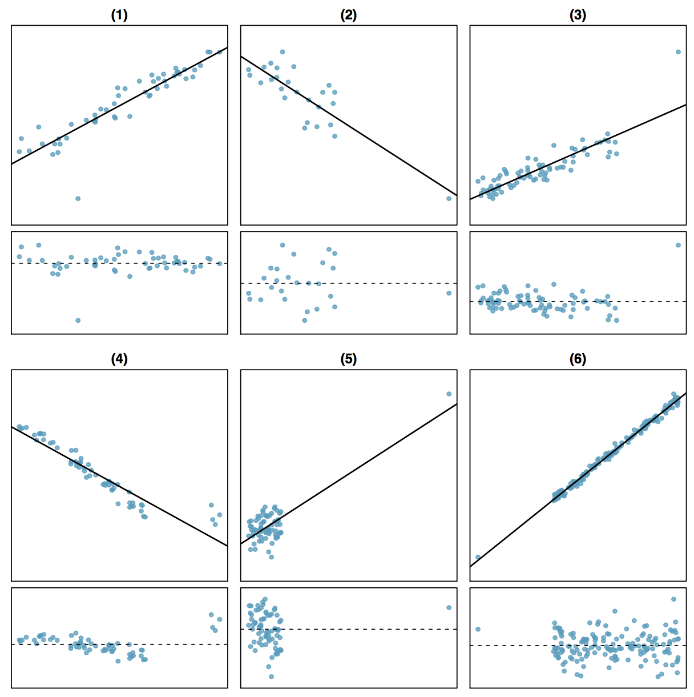

# Some chatter from the internets

## 2016 Election {.build}

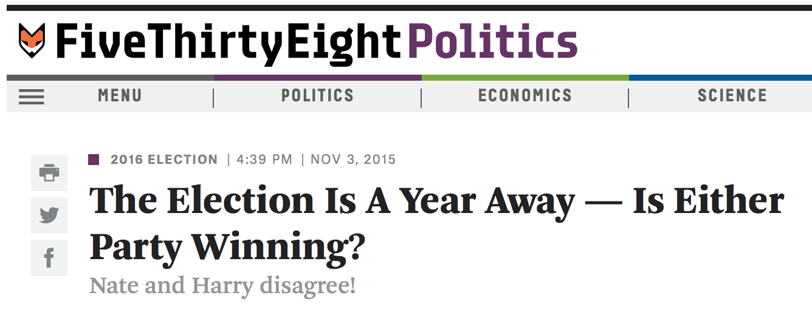

**Question at hand**: How will Obama's 46% approval rating effect his
party's candidate for the 2016 presidential election?

## 

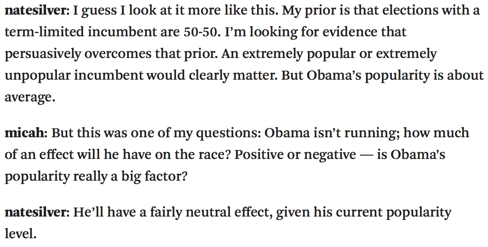

##  {.build}

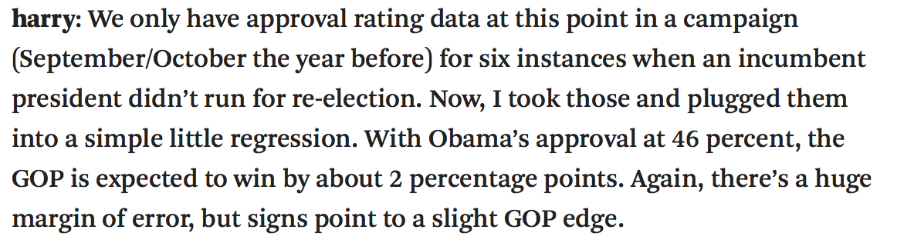

 
 

### How would you visualize this data?

##  {.build}

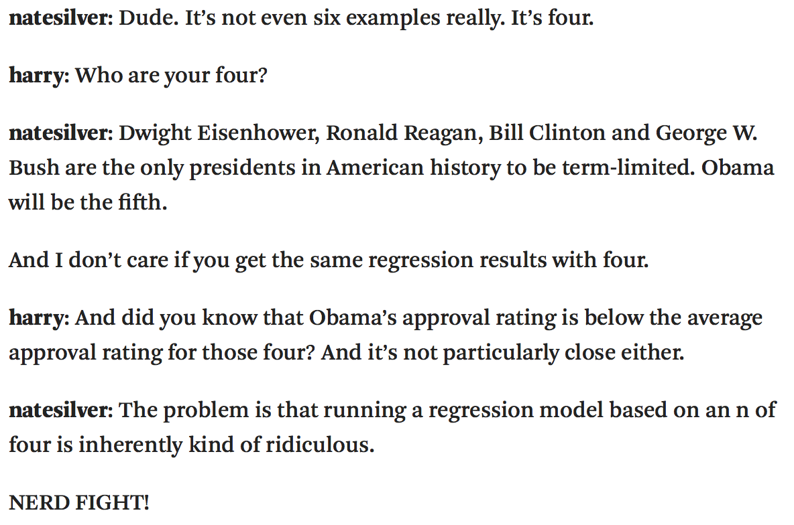

 

### Why is it ridiculous?

-->
