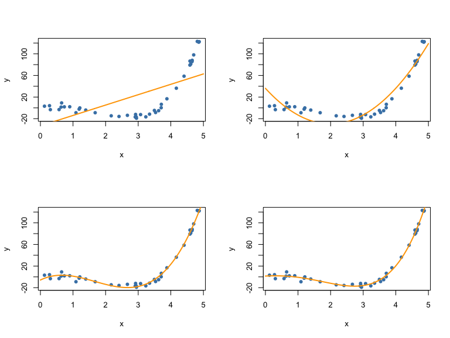
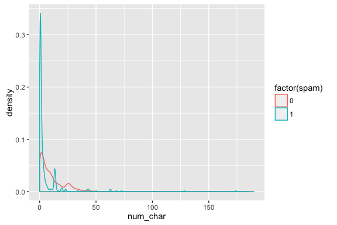
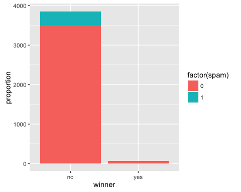

# MATH 141
Chester Ismay  


## Example: shipping books {.build}

<center>

</center>

When you buy a book from Amazon, you get a quote for how much it
costs to ship. This is largely based on the weight of the book. If you
didn't know the weight of a book, what other characteristics of it
could you measure to help predict weight?


## Example: shipping books


```r
qplot(x = volume, y = weight, data = books)
```


## Example: shipping books {.smaller}


```r
qplot(x = volume, y = weight, data = books) + 
  geom_abline(intercept = m1$coef[1], slope = m1$coef[2], col = "orchid")
```


## {.build .smaller} 


```r
m1 <- lm(weight ~ volume, data = books)
summary(m1)
```

```
## 
## Call:
## lm(formula = weight ~ volume, data = books)
## 
## Residuals:
##    Min     1Q Median     3Q    Max 
## -190.0 -109.9   38.1  109.7  145.6 
## 
## Coefficients:
##             Estimate Std. Error t value Pr(>|t|)    
## (Intercept) 107.6793    88.3776    1.22     0.24    
## volume        0.7086     0.0975    7.27  6.3e-06 ***
## ---
## Signif. codes:  0 '***' 0.001 '**' 0.01 '*' 0.05 '.' 0.1 ' ' 1
## 
## Residual standard error: 124 on 13 degrees of freedom
## Multiple R-squared:  0.803,	Adjusted R-squared:  0.787 
## F-statistic: 52.9 on 1 and 13 DF,  p-value: 6.26e-06
```

Q1: What is the equation for the line?

$$ \hat{y} = 107.7 + 0.708 x $$
$$ \widehat{weight} = 107.7 + 0.708 volume $$


## {.build .smaller}

Q2: Is volume a significant predictor?


```r
summary(m1)
```

```
## 
## Call:
## lm(formula = weight ~ volume, data = books)
## 
## Residuals:
##    Min     1Q Median     3Q    Max 
## -190.0 -109.9   38.1  109.7  145.6 
## 
## Coefficients:
##             Estimate Std. Error t value Pr(>|t|)    
## (Intercept) 107.6793    88.3776    1.22     0.24    
## volume        0.7086     0.0975    7.27  6.3e-06 ***
## ---
## Signif. codes:  0 '***' 0.001 '**' 0.01 '*' 0.05 '.' 0.1 ' ' 1
## 
## Residual standard error: 124 on 13 degrees of freedom
## Multiple R-squared:  0.803,	Adjusted R-squared:  0.787 
## F-statistic: 52.9 on 1 and 13 DF,  p-value: 6.26e-06
```

Q3: How much of the variation in weight is explained by the model containing volume?


## {.build}

Q4: Does this appear to be a reasonable setting to apply linear regression?

We need to check:

1. **L** inear trend
2. **I** ndependent observations/errors
3. **N** ormal residuals
4. **E** qual variance


## Residual Plot


```r
qplot(x = .fitted, y = .stdresid, data = m1)
```


## QQ plot


```r
qplot(sample = .stdresid, data = m1) + geom_abline(col = "purple")
```


# Multiple Regression

## Multiple Regression {.build}

Allows us to create a model to explain one $numerical$ variable, the response, as a linear function of many explanatory variables that can be both $numerical$ and
$categorical$.

We posit the true model:

$$ Y = \beta_0 + \beta_1 X_1 + \beta_2 X_2 + \ldots + \beta_p X_p + \epsilon; \quad \epsilon \sim N(0, \sigma^2) $$

We use the data to estimate our fitted model:

$$ \hat{y} = b_0 + b_1 x_1 + b_2 x_2 + \ldots + b_p x_p $$


## Estimating $\beta_0, \beta_1$, etc. {.build}

In least-squares regression, we're still finding the estimates that minimize
the sum of squared residuals.

$$ \sum_{i = 1}^n {e_i}^2 = \sum_{i = 1}^n \left(y_i - \hat{y}_i\right)^2$$

<!--
**Mathy note:** They have a closed-form solution.

$$ \mathbf{b} = (\mathbf{X}^T\mathbf{X})^{-1}\mathbf{X}^T\mathbf{y} $$ where $\mathbf{b} = (b_0, b_1, \ldots, b_p)$, $\mathbf{b} = (b_0, b_1, \ldots, b_p)$, \mathbf{X} = ()

-->

In R:


```r
lm(y ~ x1 + x2 + ... + xp, data = mydata)
```


## Example: shipping books {.build}


```r
qplot(x = volume, y = weight, color = cover, data = books)
```


## {.build .smaller}


```r
m2 <- lm(weight ~ volume + cover, data = books)
summary(m2)
```

```
## 
## Call:
## lm(formula = weight ~ volume + cover, data = books)
## 
## Residuals:
##    Min     1Q Median     3Q    Max 
## -110.1  -32.3  -16.1   28.9  210.9 
## 
## Coefficients:
##              Estimate Std. Error t value Pr(>|t|)    
## (Intercept)  197.9628    59.1927    3.34  0.00584 ** 
## volume         0.7180     0.0615   11.67  6.6e-08 ***
## coverpb     -184.0473    40.4942   -4.55  0.00067 ***
## ---
## Signif. codes:  0 '***' 0.001 '**' 0.01 '*' 0.05 '.' 0.1 ' ' 1
## 
## Residual standard error: 78.2 on 12 degrees of freedom
## Multiple R-squared:  0.927,	Adjusted R-squared:  0.915 
## F-statistic: 76.7 on 2 and 12 DF,  p-value: 1.45e-07
```

<center>
### How do we interpret these estimates?
</center>

#


## Example: shipping books {.build .smaller}


## MLR slope interpretation {.build}

The slope corresponding to the dummy variable tell us:

- How much vertical separation there is between our lines
- How much `weight` is expected to increase if `cover` goes
from 0 to 1 and `volume` is left unchanged.

Each $b_i$ tells you how much you expect the $y$ to change when you change the
$x_i$ **by one unit**, while **holding all other variables constant**.


## {.smaller .build}


```r
summary(m2)
```

```
## 
## Call:
## lm(formula = weight ~ volume + cover, data = books)
## 
## Residuals:
##    Min     1Q Median     3Q    Max 
## -110.1  -32.3  -16.1   28.9  210.9 
## 
## Coefficients:
##              Estimate Std. Error t value Pr(>|t|)    
## (Intercept)  197.9628    59.1927    3.34  0.00584 ** 
## volume         0.7180     0.0615   11.67  6.6e-08 ***
## coverpb     -184.0473    40.4942   -4.55  0.00067 ***
## ---
## Signif. codes:  0 '***' 0.001 '**' 0.01 '*' 0.05 '.' 0.1 ' ' 1
## 
## Residual standard error: 78.2 on 12 degrees of freedom
## Multiple R-squared:  0.927,	Adjusted R-squared:  0.915 
## F-statistic: 76.7 on 2 and 12 DF,  p-value: 1.45e-07
```

- Is the difference between cover types significant?
- How much of the variation in weight is explained by a model containing both
volume and cover?


##


```r
summary(m2)$coef
```

```
##             Estimate Std. Error t value Pr(>|t|)
## (Intercept)  197.963    59.1927    3.34 5.84e-03
## volume         0.718     0.0615   11.67 6.60e-08
## coverpb     -184.047    40.4942   -4.55 6.72e-04
```

```r
qt(.025, df = nrow(books) - 3)
```

```
## [1] -2.18
```

Which of the following represents the appropriate 95% CI for `coverpb`?

- A. $197 \pm 1.96 \times 59.19$
- B. $-184 \pm 2.18 \times 40.5$
- C. $-184 \pm -4.55 \times 40.5$


## Extending the model


The two cover types have different intercepts. Do they share the same slope?


#


## Extending the model


## {.smaller .build}


```r
m3 <- lm(weight ~ volume + cover + volume:cover, data = books)
summary(m3)
```

```
## 
## Call:
## lm(formula = weight ~ volume + cover + volume:cover, data = books)
## 
## Residuals:
##    Min     1Q Median     3Q    Max 
##  -89.7  -32.1  -21.8   17.9  215.9 
## 
## Coefficients:
##                 Estimate Std. Error t value Pr(>|t|)    
## (Intercept)     161.5865    86.5192    1.87    0.089 .  
## volume            0.7616     0.0972    7.84  7.9e-06 ***
## coverpb        -120.2141   115.6590   -1.04    0.321    
## volume:coverpb   -0.0757     0.1280   -0.59    0.566    
## ---
## Signif. codes:  0 '***' 0.001 '**' 0.01 '*' 0.05 '.' 0.1 ' ' 1
## 
## Residual standard error: 80.4 on 11 degrees of freedom
## Multiple R-squared:  0.93,	Adjusted R-squared:  0.911 
## F-statistic: 48.5 on 3 and 11 DF,  p-value: 1.24e-06
```

Do we have evidence that two types of books have different relationships
between volume and weight?


## Take home messages {.build}

- There is a statistically significant relationship between volume and weight.
- There is a statistically significant difference in weight between paperback
and hardcover books, when controlling for volume.
- There is not strong evidence that the relationship between volume and weight
differs between paperbacks and hardbacks.

This is **inference**, which required **valid models**. We'll check diagnostics 
next time.

#

## {.smaller}


```r
qnorm(.025)
```

```
## [1] -1.96
```

```r
qt(.025, df = 13)
```

```
## [1] -2.16
```

```r
qt(.025, df = 14)
```

```
## [1] -2.14
```

```r
qt(.05, df = 13)
```

```
## [1] -1.77
```

```r
qt(.05, df = 14)
```

```
## [1] -1.76
```

# Geometry of MLR


## Ex: Restaurants in NYC


## Ex: Restaurants in NYC {.build}


```r
head(nyc, 3)
```

```
##   Case          Restaurant Price Food Decor Service East
## 1    1 Daniella Ristorante    43   22    18      20    0
## 2    2  Tello's Ristorante    32   20    19      19    0
## 3    3          Biricchino    34   21    13      18    0
```

```r
dim(nyc)
```

```
## [1] 168   7
```

What is the unit of observation?

*A restaurant*


## What determines the price of a meal?

Let's look at the relationship between price, food rating, and decor rating.

<script>CanvasMatrix4=function(m){if(typeof m=='object'){if("length"in m&&m.length>=16){this.load(m[0],m[1],m[2],m[3],m[4],m[5],m[6],m[7],m[8],m[9],m[10],m[11],m[12],m[13],m[14],m[15]);return}else if(m instanceof CanvasMatrix4){this.load(m);return}}this.makeIdentity()};CanvasMatrix4.prototype.load=function(){if(arguments.length==1&&typeof arguments[0]=='object'){var matrix=arguments[0];if("length"in matrix&&matrix.length==16){this.m11=matrix[0];this.m12=matrix[1];this.m13=matrix[2];this.m14=matrix[3];this.m21=matrix[4];this.m22=matrix[5];this.m23=matrix[6];this.m24=matrix[7];this.m31=matrix[8];this.m32=matrix[9];this.m33=matrix[10];this.m34=matrix[11];this.m41=matrix[12];this.m42=matrix[13];this.m43=matrix[14];this.m44=matrix[15];return}if(arguments[0]instanceof CanvasMatrix4){this.m11=matrix.m11;this.m12=matrix.m12;this.m13=matrix.m13;this.m14=matrix.m14;this.m21=matrix.m21;this.m22=matrix.m22;this.m23=matrix.m23;this.m24=matrix.m24;this.m31=matrix.m31;this.m32=matrix.m32;this.m33=matrix.m33;this.m34=matrix.m34;this.m41=matrix.m41;this.m42=matrix.m42;this.m43=matrix.m43;this.m44=matrix.m44;return}}this.makeIdentity()};CanvasMatrix4.prototype.getAsArray=function(){return[this.m11,this.m12,this.m13,this.m14,this.m21,this.m22,this.m23,this.m24,this.m31,this.m32,this.m33,this.m34,this.m41,this.m42,this.m43,this.m44]};CanvasMatrix4.prototype.getAsWebGLFloatArray=function(){return new WebGLFloatArray(this.getAsArray())};CanvasMatrix4.prototype.makeIdentity=function(){this.m11=1;this.m12=0;this.m13=0;this.m14=0;this.m21=0;this.m22=1;this.m23=0;this.m24=0;this.m31=0;this.m32=0;this.m33=1;this.m34=0;this.m41=0;this.m42=0;this.m43=0;this.m44=1};CanvasMatrix4.prototype.transpose=function(){var tmp=this.m12;this.m12=this.m21;this.m21=tmp;tmp=this.m13;this.m13=this.m31;this.m31=tmp;tmp=this.m14;this.m14=this.m41;this.m41=tmp;tmp=this.m23;this.m23=this.m32;this.m32=tmp;tmp=this.m24;this.m24=this.m42;this.m42=tmp;tmp=this.m34;this.m34=this.m43;this.m43=tmp};CanvasMatrix4.prototype.invert=function(){var det=this._determinant4x4();if(Math.abs(det)<1e-8)return null;this._makeAdjoint();this.m11/=det;this.m12/=det;this.m13/=det;this.m14/=det;this.m21/=det;this.m22/=det;this.m23/=det;this.m24/=det;this.m31/=det;this.m32/=det;this.m33/=det;this.m34/=det;this.m41/=det;this.m42/=det;this.m43/=det;this.m44/=det};CanvasMatrix4.prototype.translate=function(x,y,z){if(x==undefined)x=0;if(y==undefined)y=0;if(z==undefined)z=0;var matrix=new CanvasMatrix4();matrix.m41=x;matrix.m42=y;matrix.m43=z;this.multRight(matrix)};CanvasMatrix4.prototype.scale=function(x,y,z){if(x==undefined)x=1;if(z==undefined){if(y==undefined){y=x;z=x}else z=1}else if(y==undefined)y=x;var matrix=new CanvasMatrix4();matrix.m11=x;matrix.m22=y;matrix.m33=z;this.multRight(matrix)};CanvasMatrix4.prototype.rotate=function(angle,x,y,z){angle=angle/180*Math.PI;angle/=2;var sinA=Math.sin(angle);var cosA=Math.cos(angle);var sinA2=sinA*sinA;var length=Math.sqrt(x*x+y*y+z*z);if(length==0){x=0;y=0;z=1}else if(length!=1){x/=length;y/=length;z/=length}var mat=new CanvasMatrix4();if(x==1&&y==0&&z==0){mat.m11=1;mat.m12=0;mat.m13=0;mat.m21=0;mat.m22=1-2*sinA2;mat.m23=2*sinA*cosA;mat.m31=0;mat.m32=-2*sinA*cosA;mat.m33=1-2*sinA2;mat.m14=mat.m24=mat.m34=0;mat.m41=mat.m42=mat.m43=0;mat.m44=1}else if(x==0&&y==1&&z==0){mat.m11=1-2*sinA2;mat.m12=0;mat.m13=-2*sinA*cosA;mat.m21=0;mat.m22=1;mat.m23=0;mat.m31=2*sinA*cosA;mat.m32=0;mat.m33=1-2*sinA2;mat.m14=mat.m24=mat.m34=0;mat.m41=mat.m42=mat.m43=0;mat.m44=1}else if(x==0&&y==0&&z==1){mat.m11=1-2*sinA2;mat.m12=2*sinA*cosA;mat.m13=0;mat.m21=-2*sinA*cosA;mat.m22=1-2*sinA2;mat.m23=0;mat.m31=0;mat.m32=0;mat.m33=1;mat.m14=mat.m24=mat.m34=0;mat.m41=mat.m42=mat.m43=0;mat.m44=1}else{var x2=x*x;var y2=y*y;var z2=z*z;mat.m11=1-2*(y2+z2)*sinA2;mat.m12=2*(x*y*sinA2+z*sinA*cosA);mat.m13=2*(x*z*sinA2-y*sinA*cosA);mat.m21=2*(y*x*sinA2-z*sinA*cosA);mat.m22=1-2*(z2+x2)*sinA2;mat.m23=2*(y*z*sinA2+x*sinA*cosA);mat.m31=2*(z*x*sinA2+y*sinA*cosA);mat.m32=2*(z*y*sinA2-x*sinA*cosA);mat.m33=1-2*(x2+y2)*sinA2;mat.m14=mat.m24=mat.m34=0;mat.m41=mat.m42=mat.m43=0;mat.m44=1}this.multRight(mat)};CanvasMatrix4.prototype.multRight=function(mat){var m11=(this.m11*mat.m11+this.m12*mat.m21+this.m13*mat.m31+this.m14*mat.m41);var m12=(this.m11*mat.m12+this.m12*mat.m22+this.m13*mat.m32+this.m14*mat.m42);var m13=(this.m11*mat.m13+this.m12*mat.m23+this.m13*mat.m33+this.m14*mat.m43);var m14=(this.m11*mat.m14+this.m12*mat.m24+this.m13*mat.m34+this.m14*mat.m44);var m21=(this.m21*mat.m11+this.m22*mat.m21+this.m23*mat.m31+this.m24*mat.m41);var m22=(this.m21*mat.m12+this.m22*mat.m22+this.m23*mat.m32+this.m24*mat.m42);var m23=(this.m21*mat.m13+this.m22*mat.m23+this.m23*mat.m33+this.m24*mat.m43);var m24=(this.m21*mat.m14+this.m22*mat.m24+this.m23*mat.m34+this.m24*mat.m44);var m31=(this.m31*mat.m11+this.m32*mat.m21+this.m33*mat.m31+this.m34*mat.m41);var m32=(this.m31*mat.m12+this.m32*mat.m22+this.m33*mat.m32+this.m34*mat.m42);var m33=(this.m31*mat.m13+this.m32*mat.m23+this.m33*mat.m33+this.m34*mat.m43);var m34=(this.m31*mat.m14+this.m32*mat.m24+this.m33*mat.m34+this.m34*mat.m44);var m41=(this.m41*mat.m11+this.m42*mat.m21+this.m43*mat.m31+this.m44*mat.m41);var m42=(this.m41*mat.m12+this.m42*mat.m22+this.m43*mat.m32+this.m44*mat.m42);var m43=(this.m41*mat.m13+this.m42*mat.m23+this.m43*mat.m33+this.m44*mat.m43);var m44=(this.m41*mat.m14+this.m42*mat.m24+this.m43*mat.m34+this.m44*mat.m44);this.m11=m11;this.m12=m12;this.m13=m13;this.m14=m14;this.m21=m21;this.m22=m22;this.m23=m23;this.m24=m24;this.m31=m31;this.m32=m32;this.m33=m33;this.m34=m34;this.m41=m41;this.m42=m42;this.m43=m43;this.m44=m44};CanvasMatrix4.prototype.multLeft=function(mat){var m11=(mat.m11*this.m11+mat.m12*this.m21+mat.m13*this.m31+mat.m14*this.m41);var m12=(mat.m11*this.m12+mat.m12*this.m22+mat.m13*this.m32+mat.m14*this.m42);var m13=(mat.m11*this.m13+mat.m12*this.m23+mat.m13*this.m33+mat.m14*this.m43);var m14=(mat.m11*this.m14+mat.m12*this.m24+mat.m13*this.m34+mat.m14*this.m44);var m21=(mat.m21*this.m11+mat.m22*this.m21+mat.m23*this.m31+mat.m24*this.m41);var m22=(mat.m21*this.m12+mat.m22*this.m22+mat.m23*this.m32+mat.m24*this.m42);var m23=(mat.m21*this.m13+mat.m22*this.m23+mat.m23*this.m33+mat.m24*this.m43);var m24=(mat.m21*this.m14+mat.m22*this.m24+mat.m23*this.m34+mat.m24*this.m44);var m31=(mat.m31*this.m11+mat.m32*this.m21+mat.m33*this.m31+mat.m34*this.m41);var m32=(mat.m31*this.m12+mat.m32*this.m22+mat.m33*this.m32+mat.m34*this.m42);var m33=(mat.m31*this.m13+mat.m32*this.m23+mat.m33*this.m33+mat.m34*this.m43);var m34=(mat.m31*this.m14+mat.m32*this.m24+mat.m33*this.m34+mat.m34*this.m44);var m41=(mat.m41*this.m11+mat.m42*this.m21+mat.m43*this.m31+mat.m44*this.m41);var m42=(mat.m41*this.m12+mat.m42*this.m22+mat.m43*this.m32+mat.m44*this.m42);var m43=(mat.m41*this.m13+mat.m42*this.m23+mat.m43*this.m33+mat.m44*this.m43);var m44=(mat.m41*this.m14+mat.m42*this.m24+mat.m43*this.m34+mat.m44*this.m44);this.m11=m11;this.m12=m12;this.m13=m13;this.m14=m14;this.m21=m21;this.m22=m22;this.m23=m23;this.m24=m24;this.m31=m31;this.m32=m32;this.m33=m33;this.m34=m34;this.m41=m41;this.m42=m42;this.m43=m43;this.m44=m44};CanvasMatrix4.prototype.ortho=function(left,right,bottom,top,near,far){var tx=(left+right)/(left-right);var ty=(top+bottom)/(top-bottom);var tz=(far+near)/(far-near);var matrix=new CanvasMatrix4();matrix.m11=2/(left-right);matrix.m12=0;matrix.m13=0;matrix.m14=0;matrix.m21=0;matrix.m22=2/(top-bottom);matrix.m23=0;matrix.m24=0;matrix.m31=0;matrix.m32=0;matrix.m33=-2/(far-near);matrix.m34=0;matrix.m41=tx;matrix.m42=ty;matrix.m43=tz;matrix.m44=1;this.multRight(matrix)};CanvasMatrix4.prototype.frustum=function(left,right,bottom,top,near,far){var matrix=new CanvasMatrix4();var A=(right+left)/(right-left);var B=(top+bottom)/(top-bottom);var C=-(far+near)/(far-near);var D=-(2*far*near)/(far-near);matrix.m11=(2*near)/(right-left);matrix.m12=0;matrix.m13=0;matrix.m14=0;matrix.m21=0;matrix.m22=2*near/(top-bottom);matrix.m23=0;matrix.m24=0;matrix.m31=A;matrix.m32=B;matrix.m33=C;matrix.m34=-1;matrix.m41=0;matrix.m42=0;matrix.m43=D;matrix.m44=0;this.multRight(matrix)};CanvasMatrix4.prototype.perspective=function(fovy,aspect,zNear,zFar){var top=Math.tan(fovy*Math.PI/360)*zNear;var bottom=-top;var left=aspect*bottom;var right=aspect*top;this.frustum(left,right,bottom,top,zNear,zFar)};CanvasMatrix4.prototype.lookat=function(eyex,eyey,eyez,centerx,centery,centerz,upx,upy,upz){var matrix=new CanvasMatrix4();var zx=eyex-centerx;var zy=eyey-centery;var zz=eyez-centerz;var mag=Math.sqrt(zx*zx+zy*zy+zz*zz);if(mag){zx/=mag;zy/=mag;zz/=mag}var yx=upx;var yy=upy;var yz=upz;xx=yy*zz-yz*zy;xy=-yx*zz+yz*zx;xz=yx*zy-yy*zx;yx=zy*xz-zz*xy;yy=-zx*xz+zz*xx;yx=zx*xy-zy*xx;mag=Math.sqrt(xx*xx+xy*xy+xz*xz);if(mag){xx/=mag;xy/=mag;xz/=mag}mag=Math.sqrt(yx*yx+yy*yy+yz*yz);if(mag){yx/=mag;yy/=mag;yz/=mag}matrix.m11=xx;matrix.m12=xy;matrix.m13=xz;matrix.m14=0;matrix.m21=yx;matrix.m22=yy;matrix.m23=yz;matrix.m24=0;matrix.m31=zx;matrix.m32=zy;matrix.m33=zz;matrix.m34=0;matrix.m41=0;matrix.m42=0;matrix.m43=0;matrix.m44=1;matrix.translate(-eyex,-eyey,-eyez);this.multRight(matrix)};CanvasMatrix4.prototype._determinant2x2=function(a,b,c,d){return a*d-b*c};CanvasMatrix4.prototype._determinant3x3=function(a1,a2,a3,b1,b2,b3,c1,c2,c3){return a1*this._determinant2x2(b2,b3,c2,c3)-b1*this._determinant2x2(a2,a3,c2,c3)+c1*this._determinant2x2(a2,a3,b2,b3)};CanvasMatrix4.prototype._determinant4x4=function(){var a1=this.m11;var b1=this.m12;var c1=this.m13;var d1=this.m14;var a2=this.m21;var b2=this.m22;var c2=this.m23;var d2=this.m24;var a3=this.m31;var b3=this.m32;var c3=this.m33;var d3=this.m34;var a4=this.m41;var b4=this.m42;var c4=this.m43;var d4=this.m44;return a1*this._determinant3x3(b2,b3,b4,c2,c3,c4,d2,d3,d4)-b1*this._determinant3x3(a2,a3,a4,c2,c3,c4,d2,d3,d4)+c1*this._determinant3x3(a2,a3,a4,b2,b3,b4,d2,d3,d4)-d1*this._determinant3x3(a2,a3,a4,b2,b3,b4,c2,c3,c4)};CanvasMatrix4.prototype._makeAdjoint=function(){var a1=this.m11;var b1=this.m12;var c1=this.m13;var d1=this.m14;var a2=this.m21;var b2=this.m22;var c2=this.m23;var d2=this.m24;var a3=this.m31;var b3=this.m32;var c3=this.m33;var d3=this.m34;var a4=this.m41;var b4=this.m42;var c4=this.m43;var d4=this.m44;this.m11=this._determinant3x3(b2,b3,b4,c2,c3,c4,d2,d3,d4);this.m21=-this._determinant3x3(a2,a3,a4,c2,c3,c4,d2,d3,d4);this.m31=this._determinant3x3(a2,a3,a4,b2,b3,b4,d2,d3,d4);this.m41=-this._determinant3x3(a2,a3,a4,b2,b3,b4,c2,c3,c4);this.m12=-this._determinant3x3(b1,b3,b4,c1,c3,c4,d1,d3,d4);this.m22=this._determinant3x3(a1,a3,a4,c1,c3,c4,d1,d3,d4);this.m32=-this._determinant3x3(a1,a3,a4,b1,b3,b4,d1,d3,d4);this.m42=this._determinant3x3(a1,a3,a4,b1,b3,b4,c1,c3,c4);this.m13=this._determinant3x3(b1,b2,b4,c1,c2,c4,d1,d2,d4);this.m23=-this._determinant3x3(a1,a2,a4,c1,c2,c4,d1,d2,d4);this.m33=this._determinant3x3(a1,a2,a4,b1,b2,b4,d1,d2,d4);this.m43=-this._determinant3x3(a1,a2,a4,b1,b2,b4,c1,c2,c4);this.m14=-this._determinant3x3(b1,b2,b3,c1,c2,c3,d1,d2,d3);this.m24=this._determinant3x3(a1,a2,a3,c1,c2,c3,d1,d2,d3);this.m34=-this._determinant3x3(a1,a2,a3,b1,b2,b3,d1,d2,d3);this.m44=this._determinant3x3(a1,a2,a3,b1,b2,b3,c1,c2,c3)}</script>
<script>
rglwidgetClass = function() {
this.canvas = null;
this.userMatrix = new CanvasMatrix4();
this.types = [];
this.prMatrix = new CanvasMatrix4();
this.mvMatrix = new CanvasMatrix4();
this.vp = null;
this.prmvMatrix = null;
this.origs = null;
this.gl = null;
this.scene = null;
};
(function() {
this.multMV = function(M, v) {
return [ M.m11 * v[0] + M.m12 * v[1] + M.m13 * v[2] + M.m14 * v[3],
M.m21 * v[0] + M.m22 * v[1] + M.m23 * v[2] + M.m24 * v[3],
M.m31 * v[0] + M.m32 * v[1] + M.m33 * v[2] + M.m34 * v[3],
M.m41 * v[0] + M.m42 * v[1] + M.m43 * v[2] + M.m44 * v[3]
];
};
this.vlen = function(v) {
return Math.sqrt(this.dotprod(v, v));
};
this.dotprod = function(a, b) {
return a[0]*b[0] + a[1]*b[1] + a[2]*b[2];
}
this.xprod = function(a, b) {
return [a[1]*b[2] - a[2]*b[1],
a[2]*b[0] - a[0]*b[2],
a[0]*b[1] - a[1]*b[0]];
};
this.cbind = function(a, b) {
return a.map(function(currentValue, index, array) {
return currentValue.concat(b[index]);
});
};
this.swap = function(a, i, j) {
var temp = a[i];
a[i] = a[j];
a[j] = temp;
};
this.flatten = function(a) {
return [].concat.apply([], a);
};
/* set element of 1d or 2d array as if it was flattened.  Column major, zero based! */
this.setElement = function(a, i, value) {
if (Array.isArray(a[0])) {
var dim = a.length,
col = Math.floor(i/dim),
row = i % dim;
a[row][col] = value;
} else {
a[i] = value;
}
};
this.transpose = function(a) {
var newArray = [],
n = a.length,
m = a[0].length,
i;
for(i = 0; i < m; i++){
newArray.push([]);
}
for(i = 0; i < n; i++){
for(var j = 0; j < m; j++){
newArray[j].push(a[i][j]);
}
}
return newArray;
};
this.sumsq = function(x) {
var result = 0, i;
for (i=0; i < x.length; i++)
result += x[i]*x[i];
return result;
};
this.toCanvasMatrix4 = function(mat) {
if (mat instanceof CanvasMatrix4)
return mat;
var result = new CanvasMatrix4();
mat = this.flatten(this.transpose(mat));
result.load(mat);
return result;
};
this.stringToRgb = function(s) {
s = s.replace("#", "");
var bigint = parseInt(s, 16);
return [((bigint >> 16) & 255)/255,
((bigint >> 8) & 255)/255,
(bigint & 255)/255];
};
this.componentProduct = function(x, y) {
if (typeof y === "undefined") {
this.alertOnce("Bad arg to componentProduct");
}
var result = new Float32Array(3), i;
for (i = 0; i<3; i++)
result[i] = x[i]*y[i];
return result;
};
this.getPowerOfTwo = function(value) {
var pow = 1;
while(pow<value) {
pow *= 2;
}
return pow;
};
this.unique = function(arr) {
arr = [].concat(arr);
return arr.filter(function(value, index, self) {
return self.indexOf(value) === index;
});
};
this.repeatToLen = function(arr, len) {
arr = [].concat(arr);
while (arr.length < len/2)
arr = arr.concat(arr);
return arr.concat(arr.slice(0, len - arr.length));
};
this.alertOnce = function(msg) {
if (typeof this.alerted !== "undefined")
return;
this.alerted = true;
alert(msg);
};
this.f_is_lit = 1;
this.f_is_smooth = 2;
this.f_has_texture = 4;
this.f_is_indexed = 8;
this.f_depth_sort = 16;
this.f_fixed_quads = 32;
this.f_is_transparent = 64;
this.f_is_lines = 128;
this.f_sprites_3d = 256;
this.f_sprite_3d = 512;
this.f_is_subscene = 1024;
this.f_is_clipplanes = 2048;
this.whichList = function(id) {
var obj = this.getObj(id),
flags = obj.flags;
if (obj.type === "light")
return "lights";
if (flags & this.f_is_subscene)
return "subscenes";
if (flags & this.f_is_clipplanes)
return "clipplanes";
if (flags & this.f_is_transparent)
return "transparent";
return "opaque";
};
this.getObj = function(id) {
if (typeof id !== "number") {
this.alertOnce("getObj id is "+typeof id);
}
return this.scene.objects[id];
};
this.getIdsByType = function(type, subscene) {
var
result = [], i, self = this;
if (typeof subscene === "undefined") {
Object.keys(this.scene.objects).forEach(
function(key) {
key = parseInt(key, 10);
if (self.getObj(key).type === type)
result.push(key);
});
} else {
ids = this.getObj(subscene).objects;
for (i=0; i < ids.length; i++) {
if (this.getObj(ids[i]).type === type) {
result.push(ids[i]);
}
}
}
return result;
};
this.getMaterial = function(id, property) {
var obj = this.getObj(id),
mat = obj.material[property];
if (typeof mat === "undefined")
mat = this.scene.material[property];
return mat;
};
this.inSubscene = function(id, subscene) {
return this.getObj(subscene).objects.indexOf(id) > -1;
};
this.addToSubscene = function(id, subscene) {
var thelist,
thesub = this.getObj(subscene),
ids = [id],
obj = this.getObj(id), i;
if (typeof obj.newIds !== "undefined") {
ids = ids.concat(obj.newIds);
}
for (i = 0; i < ids.length; i++) {
id = ids[i];
if (thesub.objects.indexOf(id) == -1) {
thelist = this.whichList(id);
thesub.objects.push(id);
thesub[thelist].push(id);
}
}
};
this.delFromSubscene = function(id, subscene) {
var thelist,
thesub = this.getObj(subscene),
obj = this.getObj(id),
ids = [id], i, newIds;
if (typeof obj.newIds !== "undefined")
ids = ids.concat(obj.newIds);
for (j=0; j<ids.length;j++) {
id = ids[j];
i = thesub.objects.indexOf(id);
if (i > -1) {
thesub.objects.splice(i, 1);
thelist = this.whichList(id);
i = thesub[thelist].indexOf(id);
thesub[thelist].splice(i, 1);
}
}
};
this.setSubsceneEntries = function(ids, subsceneid) {
var sub = this.getObj(subsceneid);
sub.objects = ids;
this.initSubscene(subsceneid);
};
this.getSubsceneEntries = function(subscene) {
return this.getObj(subscene).objects;
};
this.getChildSubscenes = function(subscene) {
return this.getObj(subscene).subscenes;
};
this.getVertexShader = function(id) {
var obj = this.getObj(id),
flags = obj.flags,
type = obj.type,
is_lit = flags & this.f_is_lit,
has_texture = flags & this.f_has_texture,
fixed_quads = flags & this.f_fixed_quads,
sprites_3d = flags & this.f_sprites_3d,
sprite_3d = flags & this.f_sprite_3d,
nclipplanes = this.countClipplanes(),
result;
if (type === "clipplanes" || sprites_3d) return;
result = "	/* ****** "+type+" object "+id+" vertex shader ****** */\n"+
"	attribute vec3 aPos;\n"+
"	attribute vec4 aCol;\n"+
" uniform mat4 mvMatrix;\n"+
" uniform mat4 prMatrix;\n"+
" varying vec4 vCol;\n"+
" varying vec4 vPosition;\n";
if (is_lit && !fixed_quads)
result = result + "	attribute vec3 aNorm;\n"+
" uniform mat4 normMatrix;\n"+
" varying vec3 vNormal;\n";
if (has_texture || type === "text")
result = result + " attribute vec2 aTexcoord;\n"+
" varying vec2 vTexcoord;\n";
if (type === "text")
result = result + "	uniform vec2 textScale;\n";
if (fixed_quads)
result = result + "	attribute vec2 aOfs;\n";
else if (sprite_3d)
result = result + "	uniform vec3 uOrig;\n"+
" uniform float uSize;\n"+
" uniform mat4 usermat;\n";
result = result + "	void main(void) {\n";
if (nclipplanes || (!fixed_quads && !sprite_3d))
result = result + "	  vPosition = mvMatrix * vec4(aPos, 1.);\n";
if (!fixed_quads && !sprite_3d)
result = result + "	  gl_Position = prMatrix * vPosition;\n";
if (type == "points") {
var size = this.getMaterial(id, "size");
result = result + "	  gl_PointSize = "+size.toFixed(1)+";\n";
}
result = result + "	  vCol = aCol;\n";
if (is_lit && !fixed_quads && !sprite_3d)
result = result + "	  vNormal = normalize((normMatrix * vec4(aNorm, 1.)).xyz);\n";
if (has_texture || type === "text")
result = result + "	  vTexcoord = aTexcoord;\n";
if (type == "text")
result = result + "	  vec4 pos = prMatrix * mvMatrix * vec4(aPos, 1.);\n"+
"   pos = pos/pos.w;\n"+
"   gl_Position = pos + vec4(aOfs*textScale, 0.,0.);\n";
if (type == "sprites")
result = result + "	  vec4 pos = mvMatrix * vec4(aPos, 1.);\n"+
"   pos = pos/pos.w + vec4(aOfs, 0., 0.);\n"+
"   gl_Position = prMatrix*pos;\n";
if (sprite_3d)
result = result + "	  vNormal = normalize((normMatrix * vec4(aNorm, 1.)).xyz);\n"+
"   vec4 pos = mvMatrix * vec4(uOrig, 1.);\n"+
"   vPosition = pos/pos.w + vec4(uSize*(vec4(aPos, 1.)*usermat).xyz,0.);\n"+
"   gl_Position = prMatrix * vPosition;\n";
result = result + "	}\n";
return result;
};
this.getFragmentShader = function(id) {
var obj = this.getObj(id),
flags = obj.flags,
type = obj.type,
is_lit = flags & this.f_is_lit,
has_texture = flags & this.f_has_texture,
fixed_quads = flags & this.f_fixed_quads,
sprites_3d = flags & this.f_sprites_3d,
nclipplanes = this.countClipplanes(), i,
texture_format, nlights,
result;
if (type === "clipplanes" || sprites_3d) return;
if (has_texture)
texture_format = this.getMaterial(id, "textype");
result = "/* ****** "+type+" object "+id+" fragment shader ****** */\n"+
"#ifdef GL_ES\n"+
"  precision highp float;\n"+
"#endif\n"+
"  varying vec4 vCol; // carries alpha\n"+
"  varying vec4 vPosition;\n";
if (has_texture || type === "text")
result = result + "	varying vec2 vTexcoord;\n"+
" uniform sampler2D uSampler;\n";
if (is_lit && !fixed_quads)
result = result + "	varying vec3 vNormal;\n";
for (i = 0; i < nclipplanes; i++)
result = result + "	uniform vec4 vClipplane"+i+";\n";
if (is_lit) {
nlights = this.countLights();
if (nlights)
result = result + "	uniform mat4 mvMatrix;\n";
else
is_lit = false;
}
if (is_lit) {
result = result + "	  uniform vec3 emission;\n"+
"   uniform float shininess;\n";
for (i=0; i < nlights; i++) {
result = result + "	  uniform vec3 ambient" + i + ";\n"+
"   uniform vec3 specular" + i +"; // light*material\n"+
"   uniform vec3 diffuse" + i + ";\n"+
"   uniform vec3 lightDir" + i + ";\n"+
"   uniform bool viewpoint" + i + ";\n"+
"   uniform bool finite" + i + ";\n";
}
}
result = result + "	void main(void) {\n";
for (i=0; i < nclipplanes;i++)
result = result + "	  if (dot(vPosition, vClipplane"+i+") < 0.0) discard;\n";
if (is_lit) {
result = result + "	  vec3 eye = normalize(-vPosition.xyz);\n"+
"   vec3 lightdir;\n"+
"   vec4 colDiff;\n"+
"   vec3 halfVec;\n"+
"   vec4 lighteffect = vec4(emission, 0.);\n"+
"   vec3 col;\n"+
"   float nDotL;\n";
if (fixed_quads) {
result = result +   "	  vec3 n = vec3(0., 0., 1.);\n";
}
else {
result = result +   "	  vec3 n = normalize(vNormal);\n"+
"   n = -faceforward(n, n, eye);\n";
}
for (i=0; i < nlights; i++) {
result = result + "   colDiff = vec4(vCol.rgb * diffuse" + i + ", vCol.a);\n"+
"   lightdir = lightDir" + i + ";\n"+
"   if (!viewpoint" + i +")\n"+
"     lightdir = (mvMatrix * vec4(lightdir, 1.)).xyz;\n"+
"   if (!finite" + i + ") {\n"+
"     halfVec = normalize(lightdir + eye);\n"+
"   } else {\n"+
"     lightdir = normalize(lightdir - vPosition.xyz);\n"+
"     halfVec = normalize(lightdir + eye);\n"+
"   }\n"+
"	  col = ambient" + i + ";\n"+
"   nDotL = dot(n, lightdir);\n"+
"   col = col + max(nDotL, 0.) * colDiff.rgb;\n"+
"   col = col + pow(max(dot(halfVec, n), 0.), shininess) * specular" + i + ";\n"+
"   lighteffect = lighteffect + vec4(col, colDiff.a);\n";
}
} else {
result = result +   "   vec4 colDiff = vCol;\n"+
"	  vec4 lighteffect = colDiff;\n";
}
if ((has_texture && texture_format === "rgba") || type === "text")
result = result +   "	  vec4 textureColor = lighteffect*texture2D(uSampler, vTexcoord);\n";
if (has_texture) {
result = result + {
rgb:            "   vec4 textureColor = lighteffect*vec4(texture2D(uSampler, vTexcoord).rgb, 1.);\n",
alpha:          "   vec4 textureColor = texture2D(uSampler, vTexcoord);\n"+
"   float luminance = dot(vec3(1.,1.,1.), textureColor.rgb)/3.;\n"+
"   textureColor =  vec4(lighteffect.rgb, lighteffect.a*luminance);\n",
luminance:      "   vec4 textureColor = vec4(lighteffect.rgb*dot(texture2D(uSampler, vTexcoord).rgb, vec3(1.,1.,1.))/3., lighteffect.a);\n",
"luminance.alpha":"	  vec4 textureColor = texture2D(uSampler, vTexcoord);\n"+
"   float luminance = dot(vec3(1.,1.,1.),textureColor.rgb)/3.;\n"+
"   textureColor = vec4(lighteffect.rgb*luminance, lighteffect.a*textureColor.a);\n"
}[texture_format]+
"   gl_FragColor = textureColor;\n";
} else if (type === "text") {
result = result +   "	  if (textureColor.a < 0.1)\n"+
"     discard;\n"+
"   else\n"+
"     gl_FragColor = textureColor;\n";
} else
result = result +   "   gl_FragColor = lighteffect;\n";
result = result + "	}\n";
return result;
};
this.getShader = function(shaderType, code) {
var gl = this.gl, shader;
shader = gl.createShader(shaderType);
gl.shaderSource(shader, code);
gl.compileShader(shader);
if (gl.getShaderParameter(shader, gl.COMPILE_STATUS) === 0)
alert(gl.getShaderInfoLog(shader));
return shader;
};
this.handleLoadedTexture = function(texture, textureCanvas) {
var gl = this.gl;
gl.pixelStorei(gl.UNPACK_FLIP_Y_WEBGL, true);
gl.bindTexture(gl.TEXTURE_2D, texture);
gl.texImage2D(gl.TEXTURE_2D, 0, gl.RGBA, gl.RGBA, gl.UNSIGNED_BYTE, textureCanvas);
gl.texParameteri(gl.TEXTURE_2D, gl.TEXTURE_MAG_FILTER, gl.LINEAR);
gl.texParameteri(gl.TEXTURE_2D, gl.TEXTURE_MIN_FILTER, gl.LINEAR_MIPMAP_NEAREST);
gl.generateMipmap(gl.TEXTURE_2D);
gl.bindTexture(gl.TEXTURE_2D, null);
};
this.loadImageToTexture = function(uri, texture) {
var canvas = this.textureCanvas,
ctx = canvas.getContext("2d"),
image = new Image(),
self = this;
image.onload = function() {
var w = image.width,
h = image.height,
canvasX = self.getPowerOfTwo(w),
canvasY = self.getPowerOfTwo(h),
gl = self.gl,
maxTexSize = gl.getParameter(gl.MAX_TEXTURE_SIZE);
if (maxTexSize > 4096) maxTexSize = 4096;
while (canvasX > 1 && canvasY > 1 && (canvasX > maxTexSize || canvasY > maxTexSize)) {
canvasX /= 2;
canvasY /= 2;
}
canvas.width = canvasX;
canvas.height = canvasY;
ctx.imageSmoothingEnabled = true;
ctx.drawImage(image, 0, 0, canvasX, canvasY);
self.handleLoadedTexture(texture, canvas);
self.drawScene();
};
image.src = uri;
};
this.drawTextToCanvas = function(text, cex, family, font) {
var canvasX, canvasY,
textY,
scaling = 20,
textColour = "white",
backgroundColour = "rgba(0,0,0,0)",
canvas = this.textureCanvas,
ctx = canvas.getContext("2d"),
i, textHeights = [], widths = [], offset = 0, offsets = [],
fontStrings = [],
getFontString = function(i) {
textHeights[i] = scaling*cex[i];
var fontString = textHeights[i] + "px",
family0 = family[i],
font0 = font[i];
if (family0 === "sans")
family0 = "sans-serif";
else if (family0 === "mono")
family0 = "monospace";
fontString = fontString + " " + family0;
if (font0 === 2 || font0 === 4)
fontString = "bold " + fontString;
if (font0 === 3 || font0 === 4)
fontString = "italic " + fontString;
return fontString;
};
cex = this.repeatToLen(cex, text.length);
family = this.repeatToLen(family, text.length);
font = this.repeatToLen(font, text.length);
canvasX = 1;
for (i = 0; i < text.length; i++)  {
ctx.font = fontStrings[i] = getFontString(i);
widths[i] = ctx.measureText(text[i]).width;
offset = offsets[i] = offset + 2*textHeights[i];
canvasX = (widths[i] > canvasX) ? widths[i] : canvasX;
}
canvasX = this.getPowerOfTwo(canvasX);
canvasY = this.getPowerOfTwo(offset);
canvas.width = canvasX;
canvas.height = canvasY;
ctx.fillStyle = backgroundColour;
ctx.fillRect(0, 0, ctx.canvas.width, ctx.canvas.height);
ctx.textBaseline = "alphabetic";
for(i = 0; i < text.length; i++) {
textY = offsets[i];
ctx.font = fontStrings[i];
ctx.fillStyle = textColour;
ctx.textAlign = "left";
ctx.fillText(text[i], 0,  textY);
}
return {canvasX:canvasX, canvasY:canvasY,
widths:widths, textHeights:textHeights,
offsets:offsets};
};
this.setViewport = function(id) {
var gl = this.gl,
vp = this.getObj(id).par3d.viewport,
x = vp.x*this.canvas.width,
y = vp.y*this.canvas.height,
width = vp.width*this.canvas.width,
height = vp.height*this.canvas.height;
this.vp = {x:x, y:y, width:width, height:height};
gl.viewport(x, y, width, height);
gl.scissor(x, y, width, height);
};
this.setprMatrix = function(id) {
var subscene = this.getObj(id),
embedding = subscene.embeddings.projection;
if (embedding === "replace")
this.prMatrix.makeIdentity();
else
this.setprMatrix(subscene.parent);
if (embedding === "inherit")
return;
// This is based on the Frustum::enclose code from geom.cpp
var bbox = subscene.par3d.bbox,
scale = subscene.par3d.scale,
ranges = [(bbox[1]-bbox[0])*scale[0]/2,
(bbox[3]-bbox[2])*scale[1]/2,
(bbox[5]-bbox[4])*scale[2]/2],
radius = Math.sqrt(this.sumsq(ranges))*1.1; // A bit bigger to handle labels
if (radius <= 0) radius = 1;
var observer = subscene.par3d.observer,
distance = observer[2],
t = Math.tan(subscene.par3d.FOV*Math.PI/360),
near = distance - radius,
far = distance + radius,
hlen = t*near,
aspect = this.vp.width/this.vp.height,
z = subscene.par3d.zoom;
if (aspect > 1)
this.prMatrix.frustum(-hlen*aspect*z, hlen*aspect*z,
-hlen*z, hlen*z, near, far);
else
this.prMatrix.frustum(-hlen*z, hlen*z,
-hlen*z/aspect, hlen*z/aspect,
near, far);
};
this.setmvMatrix = function(id) {
var observer = this.getObj(id).par3d.observer;
this.mvMatrix.makeIdentity();
this.setmodelMatrix(id);
this.mvMatrix.translate(-observer[0], -observer[1], -observer[2]);
};
this.setmodelMatrix = function(id) {
var subscene = this.getObj(id),
embedding = subscene.embeddings.model;
if (embedding !== "inherit") {
var scale = subscene.par3d.scale,
bbox = subscene.par3d.bbox,
center = [(bbox[0]+bbox[1])/2,
(bbox[2]+bbox[3])/2,
(bbox[4]+bbox[5])/2];
this.mvMatrix.translate(-center[0], -center[1], -center[2]);
this.mvMatrix.scale(scale[0], scale[1], scale[2]);
this.mvMatrix.multRight( subscene.par3d.userMatrix );
}
if (embedding !== "replace")
this.setmodelMatrix(subscene.parent);
};
this.setnormMatrix = function(subsceneid) {
var self = this,
recurse = function(id) {
var sub = self.getObj(id),
embedding = sub.embeddings.model;
if (embedding !== "inherit") {
var scale = sub.par3d.scale;
self.normMatrix.scale(1/scale[0], 1/scale[1], 1/scale[2]);
self.normMatrix.multRight(sub.par3d.userMatrix);
}
if (embedding !== "replace")
recurse(sub.parent);
};
self.normMatrix.makeIdentity();
recurse(subsceneid);
};
this.setprmvMatrix = function() {
this.prmvMatrix = new CanvasMatrix4( this.mvMatrix );
this.prmvMatrix.multRight( this.prMatrix );
};
this.countClipplanes = function() {
return this.countObjs("clipplanes");
};
this.countLights = function() {
return this.countObjs("light");
};
this.countObjs = function(type) {
var self = this,
bound = 0;
Object.keys(this.scene.objects).forEach(
function(key) {
if (self.getObj(parseInt(key, 10)).type === type)
bound = bound + 1;
});
return bound;
};
this.initSubscene = function(id) {
var sub = this.getObj(id),
i, obj;
if (sub.type !== "subscene")
return;
sub.par3d.userMatrix = this.toCanvasMatrix4(sub.par3d.userMatrix);
sub.par3d.listeners = [].concat(sub.par3d.listeners);
sub.backgroundId = undefined;
sub.subscenes = [];
sub.clipplanes = [];
sub.transparent = [];
sub.opaque = [];
sub.lights = [];
for (i=0; i < sub.objects.length; i++) {
obj = this.getObj(sub.objects[i]);
if (typeof obj === "undefined") {
sub.objects.splice(i, 1);
i--;
} else if (obj.type === "background")
sub.backgroundId = obj.id;
else
sub[this.whichList(obj.id)].push(obj.id);
}
};
this.copyObj = function(id, reuse) {
var obj = this.getObj(id),
prev = document.getElementById(reuse).rglinstance,
prevobj = prev.getObj(id),
fields = ["flags", "type",
"colors", "vertices", "centers",
"normals", "offsets",
"texts", "cex", "family", "font", "adj",
"material",
"radii",
"texcoords",
"userMatrix", "ids",
"dim",
"par3d", "userMatrix",
"viewpoint", "finite"],
i;
for (i = 0; i < fields.length; i++) {
if (typeof prevobj[fields[i]] !== "undefined")
obj[fields[i]] = prevobj[fields[i]];
}
};
this.planeUpdateTriangles = function(id, bbox) {
var perms = [[0,0,1], [1,2,2], [2,1,0]],
x, xrow, elem, A, d, nhits, i, j, k, u, v, w, intersect, which, v0, v2, vx, reverse,
face1 = [], face2 = [], normals = [],
obj = this.getObj(id),
nPlanes = obj.normals.length;
obj.bbox = bbox;
obj.vertices = [];
obj.initialized = false;
for (elem = 0; elem < nPlanes; elem++) {
//    Vertex Av = normal.getRecycled(elem);
x = [];
A = obj.normals[elem];
d = obj.offsets[elem][0];
nhits = 0;
for (i=0; i<3; i++)
for (j=0; j<2; j++)
for (k=0; k<2; k++) {
u = perms[0][i];
v = perms[1][i];
w = perms[2][i];
if (A[w] != 0.0) {
intersect = -(d + A[u]*bbox[j+2*u] + A[v]*bbox[k+2*v])/A[w];
if (bbox[2*w] < intersect && intersect < bbox[1+2*w]) {
xrow = [];
xrow[u] = bbox[j+2*u];
xrow[v] = bbox[k+2*v];
xrow[w] = intersect;
x.push(xrow);
face1[nhits] = j + 2*u;
face2[nhits] = k + 2*v;
nhits++;
}
}
}
if (nhits > 3) {
/* Re-order the intersections so the triangles work */
for (i=0; i<nhits-2; i++) {
which = 0; /* initialize to suppress warning */
for (j=i+1; j<nhits; j++) {
if (face1[i] == face1[j] || face1[i] == face2[j]
|| face2[i] == face1[j] || face2[i] == face2[j] ) {
which = j;
break;
}
}
if (which > i+1) {
this.swap(x, i+1, which);
this.swap(face1, i+1, which);
this.swap(face2, i+1, which);
}
}
}
if (nhits >= 3) {
/* Put in order so that the normal points out the FRONT of the faces */
v0 = [x[0][0] - x[1][0] , x[0][1] - x[1][1], x[0][2] - x[1][2]];
v2 = [x[2][0] - x[1][0] , x[2][1] - x[1][1], x[2][2] - x[1][2]];
/* cross-product */
vx = this.xprod(v0, v2);
reverse = this.dotprod(vx, A) > 0;
for (i=0; i<nhits-2; i++) {
obj.vertices.push(x[0]);
normals.push(A);
for (j=1; j<3; j++) {
obj.vertices.push(x[i + (reverse ? 3-j : j)]);
normals.push(A);
}
}
}
}
obj.pnormals = normals;
};
this.initObj = function(id) {
var obj = this.getObj(id),
flags = obj.flags,
type = obj.type,
is_indexed = flags & this.f_is_indexed,
is_lit = flags & this.f_is_lit,
has_texture = flags & this.f_has_texture,
fixed_quads = flags & this.f_fixed_quads,
depth_sort = flags & this.f_depth_sort,
sprites_3d = flags & this.f_sprites_3d,
sprite_3d = flags & this.f_sprite_3d,
gl = this.gl,
texinfo, drawtype, nclipplanes, f, frowsize, nrows,
i,j,v, mat, uri, matobj;
if (typeof id !== "number") {
this.alertOnce("initObj id is "+typeof id);
}
obj.initialized = true;
if (type === "background" || type === "bboxdeco" || type === "subscene")
return;
if (type === "light") {
obj.ambient = new Float32Array(obj.colors[0].slice(0,3));
obj.diffuse = new Float32Array(obj.colors[1].slice(0,3));
obj.specular = new Float32Array(obj.colors[2].slice(0,3));
obj.lightDir = new Float32Array(obj.vertices[0]);
return;
}
if (type === "clipplanes") {
obj.vClipplane = this.flatten(this.cbind(obj.normals, obj.offsets));
return;
}
if (!sprites_3d) {
obj.prog = gl.createProgram();
gl.attachShader(obj.prog, this.getShader( gl.VERTEX_SHADER,
this.getVertexShader(id) ));
gl.attachShader(obj.prog, this.getShader( gl.FRAGMENT_SHADER,
this.getFragmentShader(id) ));
//  Force aPos to location 0, aCol to location 1
gl.bindAttribLocation(obj.prog, 0, "aPos");
gl.bindAttribLocation(obj.prog, 1, "aCol");
gl.linkProgram(obj.prog);
var linked = gl.getProgramParameter(obj.prog, gl.LINK_STATUS);
if (!linked) {
// An error occurred while linking
var lastError = gl.getProgramInfoLog(program);
console.warn("Error in program linking:" + lastError);
gl.deleteProgram(program);
}
}
if (type === "text") {
texinfo = this.drawTextToCanvas(obj.texts,
this.flatten(obj.cex),
this.flatten(obj.family),
this.flatten(obj.family));
}
if (fixed_quads && !sprites_3d) {
obj.ofsLoc = gl.getAttribLocation(obj.prog, "aOfs");
}
if (sprite_3d) {
obj.origLoc = gl.getUniformLocation(obj.prog, "uOrig");
obj.sizeLoc = gl.getUniformLocation(obj.prog, "uSize");
obj.usermatLoc = gl.getUniformLocation(obj.prog, "usermat");
}
if (has_texture || type == "text") {
obj.texture = gl.createTexture();
obj.texLoc = gl.getAttribLocation(obj.prog, "aTexcoord");
obj.sampler = gl.getUniformLocation(obj.prog, "uSampler");
}
if (has_texture) {
mat = obj.material;
if (typeof mat.uri !== "undefined")
uri = mat.uri;
else if (typeof mat.uriElementId === "undefined") {
matobj = this.getObj(mat.uriId);
if (typeof matobj !== "undefined") {
uri = matobj.material.uri;
} else {
uri = "";
}
} else
uri = document.getElementById(mat.uriElementId).rglinstance.getObj(mat.uriId).material.uri;
this.loadImageToTexture(uri, obj.texture);
}
if (type === "text") {
this.handleLoadedTexture(obj.texture, this.textureCanvas);
}
v = obj.vertices;
obj.vertexCount = v.length;
if (!obj.vertexCount) return;
var stride = 3, nc, cofs, nofs, radofs, oofs, tofs, vnew, v1;
nc = obj.colorCount = obj.colors.length;
if (nc > 1) {
cofs = stride;
stride = stride + 4;
v = this.cbind(v, obj.colors);
} else {
cofs = -1;
obj.onecolor = this.flatten(obj.colors);
}
if (typeof obj.normals !== "undefined") {
nofs = stride;
stride = stride + 3;
v = this.cbind(v, typeof obj.pnormals !== "undefined" ? obj.pnormals : obj.normals);
} else
nofs = -1;
if (typeof obj.radii !== "undefined") {
radofs = stride;
stride = stride + 1;
if (obj.radii.length === v.length) {
v = this.cbind(v, obj.radii);
} else if (obj.radii.length === 1) {
v = v.map(function(row, i, arr) { return row.concat(obj.radii[0]);});
}
} else
radofs = -1;
if (type == "sprites" && !sprites_3d) {
tofs = stride;
stride += 2;
oofs = stride;
stride += 2;
vnew = new Array(4*v.length);
var size = obj.radii, s = size[0]/2;
for (i=0; i < v.length; i++) {
if (size.length > 1)
s = size[i]/2;
vnew[4*i]  = v[i].concat([0,0,-s,-s]);
vnew[4*i+1]= v[i].concat([1,0, s,-s]);
vnew[4*i+2]= v[i].concat([1,1, s, s]);
vnew[4*i+3]= v[i].concat([0,1,-s, s]);
}
v = vnew;
obj.vertexCount = v.length;
} else if (type === "text") {
tofs = stride;
stride += 2;
oofs = stride;
stride += 2;
vnew = new Array(4*v.length);
for (i=0; i < v.length; i++) {
vnew[4*i]  = v[i].concat([0,-0.5]).concat(obj.adj[0]);
vnew[4*i+1]= v[i].concat([1,-0.5]).concat(obj.adj[0]);
vnew[4*i+2]= v[i].concat([1, 1.5]).concat(obj.adj[0]);
vnew[4*i+3]= v[i].concat([0, 1.5]).concat(obj.adj[0]);
for (j=0; j < 4; j++) {
v1 = vnew[4*i+j];
v1[tofs+2] = 2*(v1[tofs]-v1[tofs+2])*texinfo.widths[i];
v1[tofs+3] = 2*(v1[tofs+1]-v1[tofs+3])*texinfo.textHeights[i];
v1[tofs] *= texinfo.widths[i]/texinfo.canvasX;
v1[tofs+1] = 1.0-(texinfo.offsets[i] -
v1[tofs+1]*texinfo.textHeights[i])/texinfo.canvasY;
vnew[4*i+j] = v1;
}
}
v = vnew;
obj.vertexCount = v.length;
} else if (typeof obj.texcoords !== "undefined") {
tofs = stride;
stride += 2;
oofs = -1;
v = this.cbind(v, obj.texcoords);
} else {
tofs = -1;
oofs = -1;
}
if (stride !== v[0].length) {
this.alertOnce("problem in stride calculation");
}
obj.vOffsets = {vofs:0, cofs:cofs, nofs:nofs, radofs:radofs, oofs:oofs, tofs:tofs, stride:stride};
obj.values = new Float32Array(this.flatten(v));
if (sprites_3d) {
obj.userMatrix = new CanvasMatrix4(obj.userMatrix);
obj.objects = this.flatten([].concat(obj.ids));
is_lit = false;
}
if (is_lit && !fixed_quads) {
obj.normLoc = gl.getAttribLocation(obj.prog, "aNorm");
}
nclipplanes = this.countClipplanes();
if (nclipplanes && !sprites_3d) {
obj.clipLoc = [];
for (i=0; i < nclipplanes; i++)
obj.clipLoc[i] = gl.getUniformLocation(obj.prog,"vClipplane" + i);
}
if (is_lit) {
obj.emissionLoc = gl.getUniformLocation(obj.prog, "emission");
obj.emission = new Float32Array(this.stringToRgb(this.getMaterial(id, "emission")));
obj.shininessLoc = gl.getUniformLocation(obj.prog, "shininess");
obj.shininess = this.getMaterial(id, "shininess");
obj.nlights = this.countLights();
obj.ambientLoc = [];
obj.ambient = new Float32Array(this.stringToRgb(this.getMaterial(id, "ambient")));
obj.specularLoc = [];
obj.specular = new Float32Array(this.stringToRgb(this.getMaterial(id, "specular")));
obj.diffuseLoc = [];
obj.lightDirLoc = [];
obj.viewpointLoc = [];
obj.finiteLoc = [];
for (i=0; i < obj.nlights; i++) {
obj.ambientLoc[i] = gl.getUniformLocation(obj.prog, "ambient" + i);
obj.specularLoc[i] = gl.getUniformLocation(obj.prog, "specular" + i);
obj.diffuseLoc[i] = gl.getUniformLocation(obj.prog, "diffuse" + i);
obj.lightDirLoc[i] = gl.getUniformLocation(obj.prog, "lightDir" + i);
obj.viewpointLoc[i] = gl.getUniformLocation(obj.prog, "viewpoint" + i);
obj.finiteLoc[i] = gl.getUniformLocation(obj.prog, "finite" + i);
}
}
if (is_indexed) {
if ((type === "quads" || type === "text" ||
type === "sprites") && !sprites_3d) {
nrows = Math.floor(obj.vertexCount/4);
f = Array(6*nrows);
for (i=0; i < nrows; i++) {
f[6*i] = 4*i;
f[6*i+1] = 4*i + 1;
f[6*i+2] = 4*i + 2;
f[6*i+3] = 4*i;
f[6*i+4] = 4*i + 2;
f[6*i+5] = 4*i + 3;
}
frowsize = 6;
} else if (type === "triangles") {
nrows = Math.floor(obj.vertexCount/3);
f = Array(3*nrows);
for (i=0; i < f.length; i++) {
f[i] = i;
}
frowsize = 3;
} else if (type === "spheres") {
nrows = obj.vertexCount;
f = Array(nrows);
for (i=0; i < f.length; i++) {
f[i] = i;
}
frowsize = 1;
} else if (type === "surface") {
var dim = obj.dim[0],
nx = dim[0],
nz = dim[1];
f = [];
for (j=0; j<nx-1; j++) {
for (i=0; i<nz-1; i++) {
f.push(j + nx*i,
j + nx*(i+1),
j + 1 + nx*(i+1),
j + nx*i,
j + 1 + nx*(i+1),
j + 1 + nx*i);
}
}
frowsize = 6;
}
obj.f = new Uint16Array(f);
if (depth_sort) {
drawtype = "DYNAMIC_DRAW";
} else {
drawtype = "STATIC_DRAW";
}
}
if (type !== "spheres" && !sprites_3d) {
obj.buf = gl.createBuffer();
gl.bindBuffer(gl.ARRAY_BUFFER, obj.buf);
gl.bufferData(gl.ARRAY_BUFFER, obj.values, gl.STATIC_DRAW); //
}
if (is_indexed && type !== "spheres" && !sprites_3d) {
obj.ibuf = gl.createBuffer();
gl.bindBuffer(gl.ELEMENT_ARRAY_BUFFER, obj.ibuf);
gl.bufferData(gl.ELEMENT_ARRAY_BUFFER, obj.f, gl[drawtype]);
}
if (!sprites_3d) {
obj.mvMatLoc = gl.getUniformLocation(obj.prog, "mvMatrix");
obj.prMatLoc = gl.getUniformLocation(obj.prog, "prMatrix");
}
if (type === "text") {
obj.textScaleLoc = gl.getUniformLocation(obj.prog, "textScale");
}
if (is_lit && !sprites_3d) {
obj.normMatLoc = gl.getUniformLocation(obj.prog, "normMatrix");
}
};
this.setDepthTest = function(id) {
var gl = this.gl,
tests = {never: gl.NEVER,
less:  gl.LESS,
equal: gl.EQUAL,
lequal:gl.LEQUAL,
greater: gl.GREATER,
notequal: gl.NOTEQUAL,
gequal: gl.GEQUAL,
always: gl.ALWAYS},
test = tests[this.getMaterial(id, "depth_test")];
gl.depthFunc(test);
};
this.mode4type = {points : "POINTS",
linestrip : "LINE_STRIP",
abclines : "LINES",
lines : "LINES",
sprites : "TRIANGLES",
planes : "TRIANGLES",
text : "TRIANGLES",
quads : "TRIANGLES",
surface : "TRIANGLES",
triangles : "TRIANGLES"};
this.drawObj = function(id, subsceneid) {
var obj = this.getObj(id),
subscene = this.getObj(subsceneid),
flags = obj.flags,
type = obj.type,
is_indexed = flags & this.f_is_indexed,
is_lit = flags & this.f_is_lit,
has_texture = flags & this.f_has_texture,
fixed_quads = flags & this.f_fixed_quads,
depth_sort = flags & this.f_depth_sort,
sprites_3d = flags & this.f_sprites_3d,
sprite_3d = flags & this.f_sprite_3d,
is_lines = flags & this.f_is_lines,
gl = this.gl,
sphereMV, baseofs, ofs, sscale, i, count, light,
faces;
if (typeof id !== "number") {
this.alertOnce("drawObj id is "+typeof id);
}
if (type === "planes") {
if (obj.bbox !== subscene.par3d.bbox || !obj.initialized) {
this.planeUpdateTriangles(id, subscene.par3d.bbox);
}
}
if (!obj.initialized)
this.initObj(id);
if (type === "light" || type === "bboxdeco")
return;
if (type === "clipplanes") {
count = obj.offsets.length;
var IMVClip = [];
for (i=0; i < count; i++) {
IMVClip[i] = this.multMV(this.invMatrix, obj.vClipplane.slice(4*i, 4*(i+1)));
}
obj.IMVClip = IMVClip;
return;
}
this.setDepthTest(id);
if (sprites_3d) {
var norigs = obj.vertices.length,
savenorm = new CanvasMatrix4(this.normMatrix);
this.origs = obj.vertices;
this.usermat = new Float32Array(obj.userMatrix.getAsArray());
this.radii = obj.radii;
this.normMatrix = subscene.spriteNormmat;
for (this.iOrig=0; this.iOrig < norigs; this.iOrig++) {
for (i=0; i < obj.objects.length; i++) {
this.drawObj(obj.objects[i], subsceneid);
}
}
this.normMatrix = savenorm;
return;
} else {
gl.useProgram(obj.prog);
}
if (sprite_3d) {
gl.uniform3fv(obj.origLoc, new Float32Array(this.origs[this.iOrig]));
if (this.radii.length > 1) {
gl.uniform1f(obj.sizeLoc, this.radii[this.iOrig][0]);
} else {
gl.uniform1f(obj.sizeLoc, this.radii[0][0]);
}
gl.uniformMatrix4fv(obj.usermatLoc, false, this.usermat);
}
if (type === "spheres") {
gl.bindBuffer(gl.ARRAY_BUFFER, this.sphere.buf);
} else {
gl.bindBuffer(gl.ARRAY_BUFFER, obj.buf);
}
if (is_indexed && type !== "spheres") {
gl.bindBuffer(gl.ELEMENT_ARRAY_BUFFER, obj.ibuf);
} else if (type === "spheres") {
gl.bindBuffer(gl.ELEMENT_ARRAY_BUFFER, this.sphere.ibuf);
}
gl.uniformMatrix4fv( obj.prMatLoc, false, new Float32Array(this.prMatrix.getAsArray()) );
gl.uniformMatrix4fv( obj.mvMatLoc, false, new Float32Array(this.mvMatrix.getAsArray()) );
var clipcheck = 0,
clipplaneids = subscene.clipplanes,
clip, j;
for (i=0; i < clipplaneids.length; i++) {
clip = this.getObj(clipplaneids[i]);
for (j=0; j < clip.offsets.length; j++) {
gl.uniform4fv(obj.clipLoc[clipcheck + j], clip.IMVClip[j]);
}
clipcheck += clip.offsets.length;
}
if (typeof obj.clipLoc !== "undefined")
for (i=clipcheck; i < obj.clipLoc.length; i++)
gl.uniform4f(obj.clipLoc[i], 0,0,0,0);
if (is_lit) {
gl.uniformMatrix4fv( obj.normMatLoc, false, new Float32Array(this.normMatrix.getAsArray()) );
gl.uniform3fv( obj.emissionLoc, obj.emission);
gl.uniform1f( obj.shininessLoc, obj.shininess);
for (i=0; i < subscene.lights.length; i++) {
light = this.getObj(subscene.lights[i]);
gl.uniform3fv( obj.ambientLoc[i], this.componentProduct(light.ambient, obj.ambient));
gl.uniform3fv( obj.specularLoc[i], this.componentProduct(light.specular, obj.specular));
gl.uniform3fv( obj.diffuseLoc[i], light.diffuse);
gl.uniform3fv( obj.lightDirLoc[i], light.lightDir);
gl.uniform1i( obj.viewpointLoc[i], light.viewpoint);
gl.uniform1i( obj.finiteLoc[i], light.finite);
}
for (i=subscene.lights.length; i < obj.nlights; i++) {
gl.uniform3f( obj.ambientLoc[i], 0,0,0);
gl.uniform3f( obj.specularLoc[i], 0,0,0);
gl.uniform3f( obj.diffuseLoc[i], 0,0,0);
}
}
if (type === "text") {
gl.uniform2f( obj.textScaleLoc, 0.75/this.vp.width, 0.75/this.vp.height);
}
gl.enableVertexAttribArray( this.posLoc );
var nc = obj.colorCount;
count = obj.vertexCount;
if (depth_sort) {
var nfaces = obj.centers.length,
frowsize, z, w;
if (sprites_3d) frowsize = 1;
else if (type === "triangles") frowsize = 3;
else frowsize = 6;
var depths = new Float32Array(nfaces);
faces = new Array(nfaces);
for(i=0; i<nfaces; i++) {
z = this.prmvMatrix.m13*obj.centers[3*i] +
this.prmvMatrix.m23*obj.centers[3*i+1] +
this.prmvMatrix.m33*obj.centers[3*i+2] +
this.prmvMatrix.m43;
w = this.prmvMatrix.m14*obj.centers[3*i] +
this.prmvMatrix.m24*obj.centers[3*i+1] +
this.prmvMatrix.m34*obj.centers[3*i+2] +
this.prmvMatrix.m44;
depths[i] = z/w;
faces[i] = i;
}
var depthsort = function(i,j) { return depths[j] - depths[i]; };
faces.sort(depthsort);
if (type !== "spheres") {
var f = new Uint16Array(obj.f.length);
for (i=0; i<nfaces; i++) {
for (j=0; j<frowsize; j++) {
f[frowsize*i + j] = obj.f[frowsize*faces[i] + j];
}
}
gl.bufferData(gl.ELEMENT_ARRAY_BUFFER, f, gl.DYNAMIC_DRAW);
}
}
if (type === "spheres") {
subscene = this.getObj(subsceneid);
var scale = subscene.par3d.scale,
scount = count;
gl.vertexAttribPointer(this.posLoc,  3, gl.FLOAT, false, this.sphere.sphereStride,  0);
gl.enableVertexAttribArray(obj.normLoc );
gl.vertexAttribPointer(obj.normLoc,  3, gl.FLOAT, false, this.sphere.sphereStride,  0);
gl.disableVertexAttribArray( this.colLoc );
var sphereNorm = new CanvasMatrix4();
sphereNorm.scale(scale[0], scale[1], scale[2]);
sphereNorm.multRight(this.normMatrix);
gl.uniformMatrix4fv( obj.normMatLoc, false, new Float32Array(sphereNorm.getAsArray()) );
if (nc == 1) {
gl.vertexAttrib4fv( this.colLoc, new Float32Array(obj.onecolor));
}
for (i = 0; i < scount; i++) {
sphereMV = new CanvasMatrix4();
if (depth_sort) {
baseofs = faces[i]*obj.vOffsets.stride;
} else {
baseofs = i*obj.vOffsets.stride;
}
ofs = baseofs + obj.vOffsets.radofs;
sscale = obj.values[ofs];
sphereMV.scale(sscale/scale[0], sscale/scale[1], sscale/scale[2]);
sphereMV.translate(obj.values[baseofs],
obj.values[baseofs+1],
obj.values[baseofs+2]);
sphereMV.multRight(this.mvMatrix);
gl.uniformMatrix4fv( obj.mvMatLoc, false, new Float32Array(sphereMV.getAsArray()) );
if (nc > 1) {
ofs = baseofs + obj.vOffsets.cofs;
gl.vertexAttrib4f( this.colLoc, obj.values[ofs],
obj.values[ofs+1],
obj.values[ofs+2],
obj.values[ofs+3] );
}
gl.drawElements(gl.TRIANGLES, this.sphere.sphereCount, gl.UNSIGNED_SHORT, 0);
}
return;
} else {
if (obj.colorCount === 1) {
gl.disableVertexAttribArray( this.colLoc );
gl.vertexAttrib4fv( this.colLoc, new Float32Array(obj.onecolor));
} else {
gl.enableVertexAttribArray( this.colLoc );
gl.vertexAttribPointer(this.colLoc, 4, gl.FLOAT, false, 4*obj.vOffsets.stride, 4*obj.vOffsets.cofs);
}
}
if (is_lit && obj.vOffsets.nofs > 0) {
gl.enableVertexAttribArray( obj.normLoc );
gl.vertexAttribPointer(obj.normLoc, 3, gl.FLOAT, false, 4*obj.vOffsets.stride, 4*obj.vOffsets.nofs);
}
if (has_texture || type === "text") {
gl.enableVertexAttribArray( obj.texLoc );
gl.vertexAttribPointer(obj.texLoc, 2, gl.FLOAT, false, 4*obj.vOffsets.stride, 4*obj.vOffsets.tofs);
gl.activeTexture(gl.TEXTURE0);
gl.bindTexture(gl.TEXTURE_2D, obj.texture);
gl.uniform1i( obj.sampler, 0);
}
if (fixed_quads) {
gl.enableVertexAttribArray( obj.ofsLoc );
gl.vertexAttribPointer(obj.ofsLoc, 2, gl.FLOAT, false, 4*obj.vOffsets.stride, 4*obj.vOffsets.oofs);
}
var mode = this.mode4type[type];
if (type === "sprites" || type === "text" || type === "quads") {
count = count * 6/4;
} else if (type === "surface") {
count = obj.f.length;
}
if (is_lines) {
gl.lineWidth( this.getMaterial(id, "lwd") );
}
gl.vertexAttribPointer(this.posLoc,  3, gl.FLOAT, false, 4*obj.vOffsets.stride,  4*obj.vOffsets.vofs);
if (is_indexed) {
gl.drawElements(gl[mode], count, gl.UNSIGNED_SHORT, 0);
} else {
gl.drawArrays(gl[mode], 0, count);
}
};
this.drawSubscene = function(subsceneid) {
var gl = this.gl,
obj = this.getObj(subsceneid),
objects = this.scene.objects,
subids = obj.objects,
subscene_has_faces = false,
subscene_needs_sorting = false,
flags, i;
if (obj.par3d.skipRedraw)
return;
for (i=0; i < subids.length; i++) {
flags = objects[subids[i]].flags;
if (typeof flags !== "undefined") {
subscene_has_faces |= (flags & this.f_is_lit)
& !(flags & this.f_fixed_quads);
subscene_needs_sorting |= (flags & this.f_depth_sort);
}
}
var bgid = obj.backgroundId,
bg;
this.setViewport(subsceneid);
if (typeof bgid !== "undefined" && objects[bgid].colors.length) {
bg = objects[bgid].colors[0];
gl.clearColor(bg[0], bg[1], bg[2], bg[3]);
gl.clear(gl.COLOR_BUFFER_BIT | gl.DEPTH_BUFFER_BIT);
}
if (subids.length) {
this.setprMatrix(subsceneid);
this.setmvMatrix(subsceneid);
if (subscene_has_faces) {
this.setnormMatrix(subsceneid);
if ((obj.flags & this.f_sprites_3d) &&
typeof obj.spriteNormmat === "undefined") {
obj.spriteNormmat = new CanvasMatrix4(this.normMatrix);
}
}
if (subscene_needs_sorting)
this.setprmvMatrix();
var clipids = obj.clipplanes;
if (clipids.length > 0) {
this.invMatrix = new CanvasMatrix4(this.mvMatrix);
this.invMatrix.invert();
for (i = 0; i < clipids.length; i++)
this.drawObj(clipids[i], subsceneid);
}
subids = obj.opaque;
if (subids.length > 0) {
gl.depthMask(true);
gl.disable(gl.BLEND);
for (i = 0; subids && i < subids.length; i++) {
this.drawObj(subids[i], subsceneid);
}
}
subids = obj.transparent;
if (subids.length > 0) {
gl.depthMask(false);
gl.blendFuncSeparate(gl.SRC_ALPHA, gl.ONE_MINUS_SRC_ALPHA,
gl.ONE, gl.ONE);
gl.enable(gl.BLEND);
for (i = 0; i < subids.length; i++) {
this.drawObj(subids[i], subsceneid);
}
}
subids = obj.subscenes;
for (i = 0; i < subids.length; i++) {
this.drawSubscene(subids[i]);
}
}
};
this.relMouseCoords = function(event) {
var totalOffsetX = 0,
totalOffsetY = 0,
currentElement = this.canvas;
do {
totalOffsetX += currentElement.offsetLeft;
totalOffsetY += currentElement.offsetTop;
currentElement = currentElement.offsetParent;
}
while(currentElement);
var canvasX = event.pageX - totalOffsetX,
canvasY = event.pageY - totalOffsetY;
return {x:canvasX, y:canvasY};
};
this.setMouseHandlers = function() {
var self = this, activeSubscene, handler,
handlers = {}, drag = 0;
handlers.rotBase = 0;
this.screenToVector = function(x, y) {
var viewport = this.getObj(activeSubscene).par3d.viewport,
width = viewport.width*this.canvas.width,
height = viewport.height*this.canvas.height,
radius = Math.max(width, height)/2.0,
cx = width/2.0,
cy = height/2.0,
px = (x-cx)/radius,
py = (y-cy)/radius,
plen = Math.sqrt(px*px+py*py);
if (plen > 1.e-6) {
px = px/plen;
py = py/plen;
}
var angle = (Math.SQRT2 - plen)/Math.SQRT2*Math.PI/2,
z = Math.sin(angle),
zlen = Math.sqrt(1.0 - z*z);
px = px * zlen;
py = py * zlen;
return [px, py, z];
};
handlers.trackballdown = function(x,y) {
var activeSub = this.getObj(activeSubscene),
activeModel = this.getObj(this.useid(activeSub.id, "model")),
i, l = activeModel.par3d.listeners;
handlers.rotBase = this.screenToVector(x, y);
this.saveMat = [];
for (i = 0; i < l.length; i++) {
activeSub = this.getObj(l[i]);
activeSub.saveMat = new CanvasMatrix4(activeSub.par3d.userMatrix);
}
};
handlers.trackballmove = function(x,y) {
var rotCurrent = this.screenToVector(x,y),
rotBase = handlers.rotBase,
dot = rotBase[0]*rotCurrent[0] +
rotBase[1]*rotCurrent[1] +
rotBase[2]*rotCurrent[2],
angle = Math.acos( dot/this.vlen(rotBase)/this.vlen(rotCurrent) )*180.0/Math.PI,
axis = this.xprod(rotBase, rotCurrent),
objects = this.scene.objects,
activeSub = this.getObj(activeSubscene),
activeModel = this.getObj(this.useid(activeSub.id, "model")),
l = activeModel.par3d.listeners,
i;
for (i = 0; i < l.length; i++) {
activeSub = this.getObj(l[i]);
activeSub.par3d.userMatrix.load(objects[l[i]].saveMat);
activeSub.par3d.userMatrix.rotate(angle, axis[0], axis[1], axis[2]);
}
this.drawScene();
};
handlers.trackballend = 0;
handlers.axisdown = function(x,y) {
handlers.rotBase = this.screenToVector(x, this.canvas.height/2);
var activeSub = this.getObj(activeSubscene),
activeModel = this.getObj(this.useid(activeSub.id, "model")),
i, l = activeModel.par3d.listeners;
for (i = 0; i < l.length; i++) {
activeSub = this.getObj(l[i]);
activeSub.saveMat = new CanvasMatrix4(activeSub.par3d.userMatrix);
}
};
handlers.axismove = function(x,y) {
var rotCurrent = this.screenToVector(x, this.canvas.height/2),
rotBase = handlers.rotBase,
angle = (rotCurrent[0] - rotBase[0])*180/Math.PI,
rotMat = new CanvasMatrix4();
rotMat.rotate(angle, handlers.axis[0], handlers.axis[1], handlers.axis[2]);
var activeSub = this.getObj(activeSubscene),
activeModel = this.getObj(this.useid(activeSub.id, "model")),
i, l = activeModel.par3d.listeners;
for (i = 0; i < l.length; i++) {
activeSub = this.getObj(l[i]);
activeSub.par3d.userMatrix.load(activeSub.saveMat);
activeSub.par3d.userMatrix.multLeft(rotMat);
}
this.drawScene();
};
handlers.axisend = 0;
handlers.y0zoom = 0;
handlers.zoom0 = 0;
handlers.zoomdown = function(x, y) {
var activeSub = this.getObj(activeSubscene),
activeProjection = this.getObj(this.useid(activeSub.id, "projection")),
i, l = activeProjection.par3d.listeners;
handlers.y0zoom = y;
for (i = 0; i < l.length; i++) {
activeSub = this.getObj(l[i]);
activeSub.zoom0 = Math.log(activeSub.par3d.zoom);
}
};
handlers.zoommove = function(x, y) {
var activeSub = this.getObj(activeSubscene),
activeProjection = this.getObj(this.useid(activeSub.id, "projection")),
i, l = activeProjection.par3d.listeners;
for (i = 0; i < l.length; i++) {
activeSub = this.getObj(l[i]);
activeSub.par3d.zoom = Math.exp(activeSub.zoom0 + (y-handlers.y0zoom)/this.canvas.height);
}
this.drawScene();
};
handlers.zoomend = 0;
handlers.y0fov = 0;
handlers.fovdown = function(x, y) {
handlers.y0fov = y;
var activeSub = this.getObj(activeSubscene),
activeProjection = this.getObj(this.useid(activeSub.id, "projection")),
i, l = activeProjection.par3d.listeners;
for (i = 0; i < l.length; i++) {
activeSub = this.getObj(l[i]);
activeSub.fov0 = activeSub.par3d.FOV;
}
};
handlers.fovmove = function(x, y) {
var activeSub = this.getObj(activeSubscene),
activeProjection = this.getObj(this.useid(activeSub.id, "projection")),
i, l = activeProjection.par3d.listeners;
for (i = 0; i < l.length; i++) {
activeSub = this.getObj(l[i]);
activeSub.par3d.FOV = Math.max(1, Math.min(179, activeSub.fov0 +
180*(y-handlers.y0fov)/this.canvas.height));
}
this.drawScene();
};
handlers.fovend = 0;
this.canvas.onmousedown = function ( ev ){
if (!ev.which) // Use w3c defns in preference to MS
switch (ev.button) {
case 0: ev.which = 1; break;
case 1:
case 4: ev.which = 2; break;
case 2: ev.which = 3;
}
drag = ["left", "middle", "right"][ev.which-1];
var coords = self.relMouseCoords(ev);
coords.y = self.canvas.height-coords.y;
activeSubscene = self.whichSubscene(coords);
var sub = self.getObj(activeSubscene), f;
handler = sub.par3d.mouseMode[drag];
switch (handler) {
case "xAxis":
handler = "axis";
handlers.axis = [1.0, 0.0, 0.0];
break;
case "yAxis":
handler = "axis";
handlers.axis = [0.0, 1.0, 0.0];
break;
case "zAxis":
handler = "axis";
handlers.axis = [0.0, 0.0, 1.0];
break;
}
f = handlers[handler + "down"];
if (f) {
coords = self.translateCoords(activeSubscene, coords);
f.call(self, coords.x, coords.y);
ev.preventDefault();
}
};
this.canvas.onmouseup = function ( ev ){
if ( drag === 0 ) return;
var f = handlers[handler + "up"];
if (f)
f();
drag = 0;
};
this.canvas.onmouseout = this.canvas.onmouseup;
this.canvas.onmousemove = function ( ev ) {
if ( drag === 0 ) return;
var f = handlers[handler + "move"];
if (f) {
var coords = self.relMouseCoords(ev);
coords.y = self.canvas.height - coords.y;
coords = self.translateCoords(activeSubscene, coords);
f.call(self, coords.x, coords.y);
}
};
handlers.wheelHandler = function(ev) {
var del = 1.02, i;
if (ev.shiftKey) del = 1.002;
var ds = ((ev.detail || ev.wheelDelta) > 0) ? del : (1 / del);
if (typeof activeSubscene === "undefined")
activeSubscene = self.scene.rootSubscene;
var activeSub = self.getObj(activeSubscene),
activeProjection = self.getObj(self.useid(activeSub.id, "projection")),
l = activeProjection.par3d.listeners;
for (i = 0; i < l.length; i++) {
activeSub = self.getObj(l[i]);
activeSub.par3d.zoom *= ds;
}
self.drawScene();
ev.preventDefault();
};
this.canvas.addEventListener("DOMMouseScroll", handlers.wheelHandler, false);
this.canvas.addEventListener("mousewheel", handlers.wheelHandler, false);
};
this.useid = function(subsceneid, type) {
var sub = this.getObj(subsceneid);
if (sub.embeddings[type] === "inherit")
return(this.useid(sub.parent, type));
else
return subsceneid;
};
this.inViewport = function(coords, subsceneid) {
var viewport = this.getObj(subsceneid).par3d.viewport,
x0 = coords.x - viewport.x*this.canvas.width,
y0 = coords.y - viewport.y*this.canvas.height;
return 0 <= x0 && x0 <= viewport.width*this.canvas.width &&
0 <= y0 && y0 <= viewport.height*this.canvas.height;
};
this.whichSubscene = function(coords) {
var self = this,
recurse = function(subsceneid) {
var subscenes = self.getChildSubscenes(subsceneid), i, id;
for (i=0; i < subscenes.length; i++) {
id = recurse(subscenes[i]);
if (typeof(id) !== "undefined")
return(id);
}
if (self.inViewport(coords, subsceneid))
return(subsceneid);
else
return undefined;
},
rootid = this.scene.rootSubscene,
result = recurse(rootid);
if (typeof(result) === "undefined")
result = rootid;
return result;
};
this.translateCoords = function(subsceneid, coords) {
var viewport = this.getObj(subsceneid).par3d.viewport;
return {x: coords.x - viewport.x*this.canvas.width,
y: coords.y - viewport.y*this.canvas.height};
};
this.initSphere = function(verts) {
var gl = this.gl, reuse = verts.reuse, result;
if (typeof reuse !== "undefined") {
var prev = document.getElementById(reuse).rglinstance.sphere;
result = {vb: prev.vb, it: prev.it};
} else {
result = {vb: new Float32Array(this.flatten(this.transpose(verts.vb))),
it: new Uint16Array(this.flatten(this.transpose(verts.it)))};
}
result.sphereStride = 12;
result.sphereCount = result.it.length;
result.buf = gl.createBuffer();
gl.bindBuffer(gl.ARRAY_BUFFER, result.buf);
gl.bufferData(gl.ARRAY_BUFFER, result.vb, gl.STATIC_DRAW);
result.ibuf = gl.createBuffer();
gl.bindBuffer(gl.ELEMENT_ARRAY_BUFFER, result.ibuf);
gl.bufferData(gl.ELEMENT_ARRAY_BUFFER, result.it, gl.STATIC_DRAW);
return result;
};
this.initialize = function(el, x) {
this.textureCanvas = document.createElement("canvas");
this.textureCanvas.style.display = "block";
this.scene = x;
this.normMatrix = new CanvasMatrix4();
this.saveMat = {};
this.distance = null;
this.posLoc = 0;
this.colLoc = 1;
if (el) {
el.rglinstance = this;
this.initCanvas(el);
}
};
this.initCanvas = function(el) {
this.canvas = document.createElement("canvas");
this.resize(el);
while (el.firstChild) {
el.removeChild(el.firstChild);
}
el.appendChild(this.canvas);
this.initGL0();
if (!this.gl)
return;
var objs = this.scene.objects,
self = this;
this.sphere = this.initSphere(this.scene.sphereVerts);
Object.keys(objs).forEach(function(key){
var id = parseInt(key, 10),
obj = self.getObj(id);
if (typeof obj.reuse !== "undefined")
self.copyObj(id, obj.reuse);
});
Object.keys(objs).forEach(function(key){
self.initSubscene(parseInt(key, 10));
});
Object.keys(objs).forEach(function(key){
self.initObj(parseInt(key, 10));
});
this.setMouseHandlers();
};
/* this is only used by .writeWebGL; rglwidget has
no debug element and does the drawing in rglwidget.js */
this.start = function() {
if (typeof this.prefix !== "undefined") {
this.debugelement = document.getElementById(this.prefix + "debug");
this.debug("");
}
this.drag = 0;
this.drawScene();
};
this.debug = function(msg, img) {
if (typeof this.debugelement !== "undefined") {
this.debugelement.innerHTML = msg;
if (typeof img !== "undefined") {
this.debugelement.insertBefore(img, this.debugelement.firstChild);
}
} else
alert(msg);
};
this.getSnapshot = function() {
var img;
if (typeof this.scene.snapshot !== "undefined") {
img = document.createElement("img");
img.src = this.scene.snapshot;
img.alt = "Snapshot";
}
return img;
};
this.initGL0 = function() {
if (!window.WebGLRenderingContext){
this.debug("Your browser does not support WebGL. See <a href=\"http://get.webgl.org\">http://get.webgl.org</a>", this.getSnapshot());
return;
}
try {
this.initGL();
}
catch(e) {}
if ( !this.gl ) {
this.debug("Your browser appears to support WebGL, but did not create a WebGL context.  See <a href=\"http://get.webgl.org\">http://get.webgl.org</a>",
this.getSnapshot());
return;
}
};
this.initGL = function() {
this.gl = this.canvas.getContext("webgl") ||
this.canvas.getContext("experimental-webgl");
};
this.resize = function(el) {
this.canvas.width = el.width;
this.canvas.height = el.height;
};
this.drawScene = function() {
var gl = this.gl;
if (!gl)
this.alertOnce("No WebGL context.");
gl.enable(gl.DEPTH_TEST);
gl.depthFunc(gl.LEQUAL);
gl.clearDepth(1.0);
gl.clearColor(1,1,1,1);
gl.clear(gl.COLOR_BUFFER_BIT | gl.DEPTH_BUFFER_BIT);
this.drawSubscene(this.scene.rootSubscene);
this.drawing = false;
};
this.subsetSetter = function(el, control) {
if (typeof control.subscenes === "undefined" ||
control.subscenes === null)
control.subscenes = this.scene.rootSubscene;
var value = Math.round(control.value),
subscenes = [].concat(control.subscenes),
i, j, entries, subsceneid,
ismissing = function(x) {
return control.fullset.indexOf(x) < 0;
},
tointeger = function(x) {
return parseInt(x, 10);
};
for (i=0; i < subscenes.length; i++) {
subsceneid = subscenes[i];
if (typeof this.getObj(subsceneid) === "undefined")
this.alertOnce("typeof object is undefined");
entries = this.getObj(subsceneid).objects;
entries = entries.filter(ismissing);
if (control.accumulate) {
for (j=0; j<=value; j++)
entries = entries.concat(control.subsets[j]);
} else {
entries = entries.concat(control.subsets[value]);
}
entries = entries.map(tointeger);
this.setSubsceneEntries(this.unique(entries), subsceneid);
}
};
this.propertySetter = function(el, control)  {
var value = control.value,
values = [].concat(control.values),
svals = [].concat(control.param),
direct = values[0] === null,
entries = [].concat(control.entries),
ncol = entries.length,
nrow = values.length/ncol,
properties = this.repeatToLen(control.properties, ncol),
objids = this.repeatToLen(control.objids, ncol),
property = properties[0], objid = objids[0],
obj = this.getObj(objid),
propvals, i, v1, v2, p, entry, gl, needsBinding,
newprop, newid,
getPropvals = function() {
if (property === "userMatrix")
return obj.userMatrix.getAsArray();
else
return obj[property];
};
if (direct && typeof value === "undefined")
return;
if (control.interp) {
values = values.slice(0, ncol).concat(values).
concat(values.slice(ncol*(nrow-1), ncol*nrow));
svals = [-Infinity].concat(svals).concat(Infinity);
for (i = 1; i < svals.length; i++) {
if (value <= svals[i]) {
if (svals[i] === Infinity)
p = 1;
else
p = (svals[i] - value)/(svals[i] - svals[i-1]);
break;
}
}
} else if (!direct) {
value = Math.round(value);
}
propvals = getPropvals();
for (j=0; j<entries.length; j++) {
entry = entries[j];
newprop = properties[j];
newid = objids[j];
if (newprop != property || newid != objid) {
property = newprop;
objid = newid;
obj = this.getObj(objid);
propvals = getPropvals();
}
if (control.interp) {
v1 = values[ncol*(i-1) + j];
v2 = values[ncol*i + j];
this.setElement(propvals, entry, p*v1 + (1-p)*v2);
} else if (!direct) {
this.setElement(propvals, entry, values[ncol*value + j]);
} else {
this.setElement(propvals, entry, value[j]);
}
}
needsBinding = [];
for (j=0; j < entries.length; j++) {
if (properties[j] === "values" &&
needsBinding.indexOf(objids[j]) === -1) {
needsBinding.push(objids[j]);
}
}
for (j=0; j < needsBinding.length; j++) {
gl = this.gl;
obj = this.getObj(needsBinding[j]);
gl.bindBuffer(gl.ARRAY_BUFFER, obj.buf);
gl.bufferData(gl.ARRAY_BUFFER, obj.values, gl.STATIC_DRAW);
}
};
this.vertexSetter = function(el, control)  {
var svals = [].concat(control.param),
j, k, p, propvals, stride, ofs, obj,
attrib,
ofss    = {x:"vofs", y:"vofs", z:"vofs",
red:"cofs", green:"cofs", blue:"cofs",
alpha:"cofs", radii:"radofs",
nx:"nofs", ny:"nofs", nz:"nofs",
ox:"oofs", oy:"oofs", oz:"oofs",
ts:"tofs", tt:"tofs"},
pos     = {x:0, y:1, z:2,
red:0, green:1, blue:2,
alpha:3,radii:0,
nx:0, ny:1, nz:2,
ox:0, oy:1, oz:2,
ts:0, tt:1},
values = control.values,
direct = values === null,
ncol,
interp = control.interp,
vertices = [].concat(control.vertices),
attributes = [].concat(control.attributes),
value = control.value;
ncol = Math.max(vertices.length, attributes.length);
if (!ncol)
return;
vertices = this.repeatToLen(vertices, ncol);
attributes = this.repeatToLen(attributes, ncol);
if (direct)
interp = false;
/* JSON doesn't pass Infinity */
svals[0] = -Infinity;
svals[svals.length - 1] = Infinity;
for (j = 1; j < svals.length; j++) {
if (value <= svals[j]) {
if (interp) {
if (svals[j] === Infinity)
p = 1;
else
p = (svals[j] - value)/(svals[j] - svals[j-1]);
} else {
if (svals[j] - value > value - svals[j-1])
j = j - 1;
}
break;
}
}
obj = this.getObj(control.objid);
propvals = obj.values;
for (k=0; k<ncol; k++) {
attrib = attributes[k];
vertex = vertices[k];
ofs = obj.vOffsets[ofss[attrib]];
if (ofs < 0)
this.alertOnce("Attribute '"+attrib+"' not found in object "+control.objid);
else {
stride = obj.vOffsets.stride;
ofs = vertex*stride + ofs + pos[attrib];
if (direct) {
propvals[ofs] = value;
} else if (interp) {
propvals[ofs] = p*values[j-1][k] + (1-p)*values[j][k];
} else {
propvals[ofs] = values[j][k];
}
}
}
if (typeof obj.buf !== "undefined") {
var gl = this.gl;
gl.bindBuffer(gl.ARRAY_BUFFER, obj.buf);
gl.bufferData(gl.ARRAY_BUFFER, propvals, gl.STATIC_DRAW);
}
};
this.ageSetter = function(el, control) {
var objids = [].concat(control.objids),
nobjs = objids.length,
time = control.value,
births = [].concat(control.births),
ages = [].concat(control.ages),
steps = births.length,
j = Array(steps),
p = Array(steps),
i, k, age, j0, propvals, stride, ofs, objid, obj,
attrib, dim,
attribs = ["colors", "alpha", "radii", "vertices",
"normals", "origins", "texcoords",
"x", "y", "z",
"red", "green", "blue"],
ofss    = ["cofs", "cofs", "radofs", "vofs",
"nofs", "oofs", "tofs",
"vofs", "vofs", "vofs",
"cofs", "cofs", "cofs"],
dims    = [3,1,1,3,
3,2,2,
1,1,1,
1,1,1],
pos     = [0,3,0,0,
0,0,0,
0,1,2,
0,1,2];
/* Infinity doesn't make it through JSON */
ages[0] = -Infinity;
ages[ages.length-1] = Infinity;
for (i = 0; i < steps; i++) {
if (births[i] !== null) {  // NA in R becomes null
age = time - births[i];
for (j0 = 1; age > ages[j0]; j0++);
if (ages[j0] == Infinity)
p[i] = 1;
else if (ages[j0] > ages[j0-1])
p[i] = (ages[j0] - age)/(ages[j0] - ages[j0-1]);
else
p[i] = 0;
j[i] = j0;
}
}
for (l = 0; l < nobjs; l++) {
objid = objids[l];
obj = this.getObj(objid);
propvals = obj.values;
stride = obj.vOffsets.stride;
for (k = 0; k < attribs.length; k++) {
attrib = control[attribs[k]];
if (typeof attrib !== "undefined") {
ofs = obj.vOffsets[ofss[k]];
if (ofs >= 0) {
dim = dims[k];
ofs = ofs + pos[k];
for (i = 0; i < steps; i++) {
if (births[i] !== null) {
for (d=0; d < dim; d++) {
propvals[i*stride + ofs + d] = p[i]*attrib[dim*(j[i]-1) + d] + (1-p[i])*attrib[dim*j[i] + d];
}
}
}
} else
this.alertOnce("\'"+attribs[k]+"\' property not found in object "+objid);
}
}
obj.values = propvals;
if (typeof obj.buf !== "undefined") {
gl = this.gl;
gl.bindBuffer(gl.ARRAY_BUFFER, obj.buf);
gl.bufferData(gl.ARRAY_BUFFER, obj.values, gl.STATIC_DRAW);
}
}
};
this.oldBridge = function(el, control) {
var attrname, global = window[control.prefix + "rgl"];
if (typeof global !== "undefined")
for (attrname in global)
this[attrname] = global[attrname];
window[control.prefix + "rgl"] = this;
};
this.Player = function(el, control) {
var
self = this,
components = [].concat(control.components),
Tick = function() { /* "this" will be a timer */
var i,
nominal = this.value,
slider = this.Slider,
labels = this.outputLabels,
output = this.Output,
step;
if (typeof slider !== "undefined" && nominal != slider.value)
slider.value = nominal;
if (typeof output !== "undefined") {
step = Math.round((nominal - output.sliderMin)/output.sliderStep);
if (labels !== null) {
output.innerHTML = labels[step];
} else {
step = step*output.sliderStep + output.sliderMin;
output.innerHTML = step.toPrecision(output.outputPrecision);
}
}
for (i=0; i < this.actions.length; i++) {
this.actions[i].value = nominal;
}
self.applyControls(el, this.actions, false);
self.drawScene();
},
OnSliderInput = function() { /* "this" will be the slider */
this.rgltimer.value = Number(this.value);
this.rgltimer.Tick();
},
addSlider = function(min, max, step, value) {
var slider = document.createElement("input");
slider.type = "range";
slider.min = min;
slider.max = max;
slider.step = step;
slider.value = value;
slider.oninput = OnSliderInput;
slider.sliderActions = control.actions;
slider.sliderScene = this;
slider.className = "rgl-slider";
slider.id = el.id + "-slider";
el.rgltimer.Slider = slider;
slider.rgltimer = el.rgltimer;
el.appendChild(slider);
},
addLabel = function(labels, min, step, precision) {
var output = document.createElement("output");
output.sliderMin = min;
output.sliderStep = step;
output.outputPrecision = precision;
output.className = "rgl-label";
output.id = el.id + "-label";
el.rgltimer.Output = output;
el.rgltimer.outputLabels = labels;
el.appendChild(output);
},
addButton = function(label) {
var button = document.createElement("input"),
onclicks = {Reverse: function() { this.rgltimer.reverse();},
Play: function() { this.rgltimer.play();
this.value = this.rgltimer.enabled ? "Pause" : "Play"; },
Slower: function() { this.rgltimer.slower(); },
Faster: function() { this.rgltimer.faster(); },
Reset: function() { this.rgltimer.reset(); }};
button.rgltimer = el.rgltimer;
button.type = "button";
button.value = label;
if (label === "Play")
button.rgltimer.PlayButton = button;
button.onclick = onclicks[label];
button.className = "rgl-button";
button.id = el.id + "-" + label;
el.appendChild(button);
};
if (typeof control.reinit !== "null") {
control.actions.reinit = control.reinit;
}
el.rgltimer = new rgltimerClass(Tick, control.start, control.interval, control.stop, control.value, control.rate, control.loop, control.actions);
for (var i=0; i < components.length; i++) {
switch(components[i]) {
case "Slider": addSlider(control.start, control.stop,
control.step, control.value);
break;
case "Label": addLabel(control.labels, control.start,
control.step, control.precision);
break;
default:
addButton(components[i]);
}
}
el.rgltimer.Tick();
};
this.applyControls = function(el, x, draw) {
var self = this, reinit = x.reinit, i, obj, control, type;
for (i = 0; i < x.length; i++) {
control = x[i];
type = control.type;
self[type](el, control);
};
if (typeof reinit !== "undefined" && reinit !== null) {
reinit = [].concat(reinit);
for (i = 0; i < reinit.length; i++)
self.getObj(reinit[i]).initialized = false;
}
if (typeof draw === "undefined" || draw)
self.drawScene();
};
this.sceneChangeHandler = function(message) {
var self = document.getElementById(message.elementId).rglinstance,
objs = message.objects, mat = message.material,
root = message.rootSubscene,
initSubs = message.initSubscenes,
redraw = message.redrawScene,
skipRedraw = message.skipRedraw,
deletes, subs, allsubs = [], obj, i,j;
if (typeof message.delete !== "undefined") {
deletes = [].concat(message.delete);
if (typeof message.delfromSubscenes !== "undefined")
subs = [].concat(message.delfromSubscenes);
else
subs = [];
for (i = 0; i < deletes.length; i++) {
for (j = 0; j < subs.length; j++) {
self.delFromSubscene(deletes[i], subs[j]);
}
delete self.scene.objects[deletes[i]];
}
}
if (typeof objs !== "undefined") {
Object.keys(objs).forEach(function(key){
key = parseInt(key, 10);
self.scene.objects[key] = objs[key];
self.initObj(key);
var obj = self.getObj(key),
subs = [].concat(obj.inSubscenes), k;
allsubs = allsubs.concat(subs);
for (k = 0; k < subs.length; k++)
self.addToSubscene(key, subs[k]);
});
}
if (typeof mat !== "undefined") {
self.scene.material = mat;
}
if (typeof root !== "undefined") {
self.scene.rootSubscene = root;
}
if (typeof initSubs !== "undefined")
allsubs = allsubs.concat(initSubs);
allsubs = self.unique(allsubs);
for (i = 0; i < allsubs.length; i++) {
self.initSubscene(allsubs[i]);
}
if (typeof skipRedraw !== "undefined") {
root = self.getObj(self.scene.rootSubscene);
root.par3d.skipRedraw = skipRedraw;
}
if (redraw)
self.drawScene();
};
}).call(rglwidgetClass.prototype);
rgltimerClass = function(Tick, startTime, interval, stopTime, value, rate, loop, actions) {
this.enabled = false;
this.timerId = 0;
this.startTime = startTime;         /* nominal start time in seconds */
this.value = value;                 /* current nominal time */
this.interval = interval;           /* seconds between updates */
this.stopTime = stopTime;           /* nominal stop time */
this.rate = rate;                   /* nominal units per second */
this.loop = loop;                   /* "none", "cycle", or "oscillate" */
this.realStart = undefined;         /* real world start time */
this.multiplier = 1;                /* multiplier for fast-forward
or reverse */
this.actions = actions;
this.Tick = Tick;
};
(function() {
this.play = function() {
if (this.enabled) {
this.enabled = false;
window.clearInterval(this.timerId);
this.timerId = 0;
return;
}
var tick = function(self) {
var now = new Date();
self.value = self.multiplier*self.rate*(now - self.realStart)/1000 + self.startTime;
if (self.value > self.stopTime || self.value < self.startTime) {
if (!self.loop) {
self.reset();
} else {
var cycle = self.stopTime - self.startTime,
newval = (self.value - self.startTime) % cycle + self.startTime;
if (newval < self.startTime) {
newval += cycle;
}
self.realStart += (self.value - newval)*1000/self.multiplier/self.rate;
self.value = newval;
}
}
if (typeof self.Tick !== "undefined") {
self.Tick(self.value);
}
};
this.realStart = new Date() - 1000*(this.value - this.startTime)/this.rate/this.multiplier;
this.timerId = window.setInterval(tick, 1000*this.interval, this);
this.enabled = true;
};
this.reset = function() {
this.value = this.startTime;
this.newmultiplier(1);
if (typeof this.Tick !== "undefined") {
this.Tick(this.value);
}
if (this.enabled)
this.play();  /* really pause... */
if (typeof this.PlayButton !== "undefined")
this.PlayButton.value = "Play";
};
this.faster = function() {
this.newmultiplier(Math.SQRT2*this.multiplier);
};
this.slower = function() {
this.newmultiplier(this.multiplier/Math.SQRT2);
};
this.reverse = function() {
this.newmultiplier(-this.multiplier);
};
this.newmultiplier = function(newmult) {
if (newmult != this.multiplier) {
this.realStart += 1000*(this.value - this.startTime)/this.rate*(1/this.multiplier - 1/newmult);
this.multiplier = newmult;
}
};
}).call(rgltimerClass.prototype);</script>
<div id="unnamed_chunk_13div" class="rglWebGL"></div>
<script type="text/javascript">
var unnamed_chunk_13div = document.getElementById("unnamed_chunk_13div"),
unnamed_chunk_13rgl = new rglwidgetClass();
unnamed_chunk_13div.width = 721;
unnamed_chunk_13div.height = 433;
unnamed_chunk_13rgl.initialize(unnamed_chunk_13div,
{"material":{"color":"#000000","alpha":1,"lit":true,"ambient":"#000000","specular":"#FFFFFF","emission":"#000000","shininess":50,"smooth":true,"front":"filled","back":"filled","size":3,"lwd":1,"fog":false,"point_antialias":false,"line_antialias":false,"texture":null,"textype":"rgb","texmipmap":false,"texminfilter":"linear","texmagfilter":"linear","texenvmap":false,"depth_mask":true,"depth_test":"less"},"rootSubscene":1,"objects":{"9":{"id":9,"type":"points","material":{"lit":false},"vertices":[[22,18,43],[20,19,32],[21,13,34],[20,20,41],[24,19,54],[22,22,52],[22,16,34],[20,18,34],[22,19,39],[21,17,44],[19,17,45],[21,19,47],[21,19,52],[19,17,35],[20,18,47],[21,19,37],[22,18,45],[24,21,57],[19,17,38],[22,20,51],[23,20,54],[23,17,51],[20,18,38],[22,21,49],[22,20,45],[19,17,37],[22,19,50],[20,16,43],[22,19,49],[21,20,65],[20,16,34],[21,20,51],[20,19,49],[23,22,51],[25,22,62],[23,21,50],[21,18,51],[22,19,52],[24,20,57],[21,20,49],[19,17,33],[19,17,43],[21,17,41],[24,21,58],[22,17,56],[22,17,44],[20,15,37],[21,17,56],[24,18,58],[16,16,44],[20,18,46],[20,20,40],[19,18,39],[17,14,36],[18,15,34],[18,16,54],[23,17,51],[20,14,41],[22,17,40],[18,13,24],[24,20,53],[19,16,31],[18,16,35],[20,19,49],[19,15,38],[21,16,48],[20,19,43],[17,14,29],[17,18,37],[22,21,55],[22,18,37],[23,20,55],[24,20,49],[19,14,33],[23,20,52],[22,16,47],[21,16,43],[18,17,33],[18,16,38],[21,18,48],[21,18,50],[23,19,46],[23,19,38],[20,16,33],[23,19,46],[19,15,37],[23,18,50],[25,24,54],[21,19,41],[21,15,37],[22,18,50],[24,22,60],[23,16,36],[23,19,54],[19,18,39],[20,16,35],[19,13,30],[19,17,41],[19,14,30],[18,15,25],[19,18,43],[20,15,45],[23,16,57],[18,15,32],[24,21,51],[23,20,48],[18,16,36],[20,17,37],[20,19,31],[23,19,47],[19,16,40],[18,16,37],[23,20,43],[23,22,51],[18,9,19],[17,14,28],[21,6,22],[19,17,41],[19,15,33],[19,15,29],[19,17,33],[19,16,45],[17,16,38],[20,23,52],[20,17,38],[18,18,47],[22,18,46],[20,17,40],[20,15,32],[19,23,65],[19,21,47],[23,22,65],[20,17,45],[22,22,46],[20,19,44],[19,19,40],[19,18,46],[19,15,32],[20,14,23],[18,21,42],[21,18,29],[21,18,49],[22,24,53],[22,19,45],[22,25,63],[23,23,52],[19,20,40],[22,21,45],[21,17,38],[18,17,38],[21,16,42],[23,19,57],[21,19,39],[20,18,43],[17,14,29],[20,16,42],[22,19,50],[18,16,34],[16,15,31],[20,17,31],[21,19,46],[21,15,42],[19,16,31],[17,15,31],[20,16,26],[18,16,31],[22,17,38],[24,10,34]],"colors":[[0.2745098,0.509804,0.7058824,1]],"centers":[[22,18,43],[20,19,32],[21,13,34],[20,20,41],[24,19,54],[22,22,52],[22,16,34],[20,18,34],[22,19,39],[21,17,44],[19,17,45],[21,19,47],[21,19,52],[19,17,35],[20,18,47],[21,19,37],[22,18,45],[24,21,57],[19,17,38],[22,20,51],[23,20,54],[23,17,51],[20,18,38],[22,21,49],[22,20,45],[19,17,37],[22,19,50],[20,16,43],[22,19,49],[21,20,65],[20,16,34],[21,20,51],[20,19,49],[23,22,51],[25,22,62],[23,21,50],[21,18,51],[22,19,52],[24,20,57],[21,20,49],[19,17,33],[19,17,43],[21,17,41],[24,21,58],[22,17,56],[22,17,44],[20,15,37],[21,17,56],[24,18,58],[16,16,44],[20,18,46],[20,20,40],[19,18,39],[17,14,36],[18,15,34],[18,16,54],[23,17,51],[20,14,41],[22,17,40],[18,13,24],[24,20,53],[19,16,31],[18,16,35],[20,19,49],[19,15,38],[21,16,48],[20,19,43],[17,14,29],[17,18,37],[22,21,55],[22,18,37],[23,20,55],[24,20,49],[19,14,33],[23,20,52],[22,16,47],[21,16,43],[18,17,33],[18,16,38],[21,18,48],[21,18,50],[23,19,46],[23,19,38],[20,16,33],[23,19,46],[19,15,37],[23,18,50],[25,24,54],[21,19,41],[21,15,37],[22,18,50],[24,22,60],[23,16,36],[23,19,54],[19,18,39],[20,16,35],[19,13,30],[19,17,41],[19,14,30],[18,15,25],[19,18,43],[20,15,45],[23,16,57],[18,15,32],[24,21,51],[23,20,48],[18,16,36],[20,17,37],[20,19,31],[23,19,47],[19,16,40],[18,16,37],[23,20,43],[23,22,51],[18,9,19],[17,14,28],[21,6,22],[19,17,41],[19,15,33],[19,15,29],[19,17,33],[19,16,45],[17,16,38],[20,23,52],[20,17,38],[18,18,47],[22,18,46],[20,17,40],[20,15,32],[19,23,65],[19,21,47],[23,22,65],[20,17,45],[22,22,46],[20,19,44],[19,19,40],[19,18,46],[19,15,32],[20,14,23],[18,21,42],[21,18,29],[21,18,49],[22,24,53],[22,19,45],[22,25,63],[23,23,52],[19,20,40],[22,21,45],[21,17,38],[18,17,38],[21,16,42],[23,19,57],[21,19,39],[20,18,43],[17,14,29],[20,16,42],[22,19,50],[18,16,34],[16,15,31],[20,17,31],[21,19,46],[21,15,42],[19,16,31],[17,15,31],[20,16,26],[18,16,31],[22,17,38],[24,10,34]],"ignoreExtent":false,"flags":0},"11":{"id":11,"type":"text","material":{"lit":false},"vertices":[[20.5,2.7795,11.203]],"colors":[[0,0,0,1]],"texts":[["Food rating"]],"cex":[[1]],"adj":[[0.5,0.5]],"centers":[[20.5,2.7795,11.203]],"family":[["sans"]],"font":[[1]],"ignoreExtent":true,"flags":40},"12":{"id":12,"type":"text","material":{"lit":false},"vertices":[[14.4745,15.5,11.203]],"colors":[[0,0,0,1]],"texts":[["Decor Rating"]],"cex":[[1]],"adj":[[0.5,0.5]],"centers":[[14.4745,15.5,11.203]],"family":[["sans"]],"font":[[1]],"ignoreExtent":true,"flags":40},"13":{"id":13,"type":"text","material":{"lit":false},"vertices":[[14.4745,2.7795,42]],"colors":[[0,0,0,1]],"texts":[["Price"]],"cex":[[1]],"adj":[[0.5,0.5]],"centers":[[14.4745,2.7795,42]],"family":[["sans"]],"font":[[1]],"ignoreExtent":true,"flags":40},"5":{"id":5,"type":"light","vertices":[[0,0,1]],"colors":[[1,1,1,1],[1,1,1,1],[1,1,1,1]],"viewpoint":true,"finite":false},"4":{"id":4,"type":"background","colors":[[0.2980392,0.2980392,0.2980392,1]],"centers":[[0,0,0]],"sphere":false,"fogtype":"none"},"6":{"id":6,"type":"background","colors":[[1,1,1,1]],"centers":[[0,0,0]],"sphere":false,"fogtype":"none"},"10":{"id":10,"type":"bboxdeco","material":{"front":"lines","back":"lines"},"vertices":[[16,null,null],[18,null,null],[20,null,null],[22,null,null],[24,null,null],[null,10,null],[null,15,null],[null,20,null],[null,25,null],[null,null,20],[null,null,30],[null,null,40],[null,null,50],[null,null,60]],"colors":[[0,0,0,1]],"draw_front":true,"newIds":[21,22,23,24,25,26,27]},"1":{"id":1,"type":"subscene","par3d":{"antialias":8,"FOV":60,"ignoreExtent":false,"listeners":1,"mouseMode":{"left":"trackball","right":"zoom","middle":"fov","wheel":"pull"},"observer":[0,0,64.06379],"modelMatrix":[[3.244495,0,0,-66.51215],[0,1.484499,-0.1642964,-16.10928],[0,0.3977702,0.6131625,-95.98206],[0,0,0,1]],"projMatrix":[[1.484615,0,0,0],[0,2.474359,0,0],[0,0,-2,-96.09567],[0,0,-1,0]],"skipRedraw":false,"userMatrix":[[1,0,0,0],[0,0.9659258,-0.258819,0],[0,0.258819,0.9659258,0],[0,0,0,1]],"scale":[3.244495,1.536866,0.6347925],"viewport":{"x":0,"y":0,"width":1,"height":1},"zoom":0.7,"bbox":[16,25,6,25,19,65],"windowRect":[1200,45,1920,477],"family":"sans","font":1,"cex":1,"useFreeType":true,"fontname":"/Library/Frameworks/R.framework/Versions/3.2/Resources/library/rgl/fonts/FreeSans.ttf","maxClipPlanes":6},"embeddings":{"viewport":"replace","projection":"replace","model":"replace"},"objects":[6,10,9,11,12,13,5,21,22,23,24,25,26,27],"subscenes":[],"flags":1192},"21":{"id":21,"type":"lines","material":{"lit":false,"front":"lines","back":"lines"},"vertices":[[16,5.715,18.31],[24,5.715,18.31],[16,5.715,18.31],[16,5.22575,17.1255],[18,5.715,18.31],[18,5.22575,17.1255],[20,5.715,18.31],[20,5.22575,17.1255],[22,5.715,18.31],[22,5.22575,17.1255],[24,5.715,18.31],[24,5.22575,17.1255]],"colors":[[0,0,0,1]],"centers":[[20,5.715,18.31],[16,5.470375,17.71775],[18,5.470375,17.71775],[20,5.470375,17.71775],[22,5.470375,17.71775],[24,5.470375,17.71775]],"ignoreExtent":true,"origId":10,"flags":128},"22":{"id":22,"type":"text","material":{"lit":false,"front":"lines","back":"lines"},"vertices":[[16,4.24725,14.7565],[18,4.24725,14.7565],[20,4.24725,14.7565],[22,4.24725,14.7565],[24,4.24725,14.7565]],"colors":[[0,0,0,1]],"texts":[["16"],["18"],["20"],["22"],["24"]],"cex":[[1]],"adj":[[0.5,0.5]],"centers":[[16,4.24725,14.7565],[18,4.24725,14.7565],[20,4.24725,14.7565],[22,4.24725,14.7565],[24,4.24725,14.7565]],"family":[["sans"]],"font":[[1]],"ignoreExtent":true,"origId":10,"flags":40},"23":{"id":23,"type":"lines","material":{"lit":false,"front":"lines","back":"lines"},"vertices":[[15.865,10,18.31],[15.865,25,18.31],[15.865,10,18.31],[15.63325,10,17.1255],[15.865,15,18.31],[15.63325,15,17.1255],[15.865,20,18.31],[15.63325,20,17.1255],[15.865,25,18.31],[15.63325,25,17.1255]],"colors":[[0,0,0,1]],"centers":[[15.865,17.5,18.31],[15.74912,10,17.71775],[15.74912,15,17.71775],[15.74912,20,17.71775],[15.74912,25,17.71775]],"ignoreExtent":true,"origId":10,"flags":128},"24":{"id":24,"type":"text","material":{"lit":false,"front":"lines","back":"lines"},"vertices":[[15.16975,10,14.7565],[15.16975,15,14.7565],[15.16975,20,14.7565],[15.16975,25,14.7565]],"colors":[[0,0,0,1]],"texts":[["10"],["15"],["20"],["25"]],"cex":[[1]],"adj":[[0.5,0.5]],"centers":[[15.16975,10,14.7565],[15.16975,15,14.7565],[15.16975,20,14.7565],[15.16975,25,14.7565]],"family":[["sans"]],"font":[[1]],"ignoreExtent":true,"origId":10,"flags":40},"25":{"id":25,"type":"lines","material":{"lit":false,"front":"lines","back":"lines"},"vertices":[[15.865,5.715,20],[15.865,5.715,60],[15.865,5.715,20],[15.63325,5.22575,20],[15.865,5.715,30],[15.63325,5.22575,30],[15.865,5.715,40],[15.63325,5.22575,40],[15.865,5.715,50],[15.63325,5.22575,50],[15.865,5.715,60],[15.63325,5.22575,60]],"colors":[[0,0,0,1]],"centers":[[15.865,5.715,40],[15.74912,5.470375,20],[15.74912,5.470375,30],[15.74912,5.470375,40],[15.74912,5.470375,50],[15.74912,5.470375,60]],"ignoreExtent":true,"origId":10,"flags":128},"26":{"id":26,"type":"text","material":{"lit":false,"front":"lines","back":"lines"},"vertices":[[15.16975,4.24725,20],[15.16975,4.24725,30],[15.16975,4.24725,40],[15.16975,4.24725,50],[15.16975,4.24725,60]],"colors":[[0,0,0,1]],"texts":[["20"],["30"],["40"],["50"],["60"]],"cex":[[1]],"adj":[[0.5,0.5]],"centers":[[15.16975,4.24725,20],[15.16975,4.24725,30],[15.16975,4.24725,40],[15.16975,4.24725,50],[15.16975,4.24725,60]],"family":[["sans"]],"font":[[1]],"ignoreExtent":true,"origId":10,"flags":40},"27":{"id":27,"type":"lines","material":{"lit":false,"front":"lines","back":"lines"},"vertices":[[15.865,5.715,18.31],[15.865,25.285,18.31],[15.865,5.715,65.69],[15.865,25.285,65.69],[15.865,5.715,18.31],[15.865,5.715,65.69],[15.865,25.285,18.31],[15.865,25.285,65.69],[15.865,5.715,18.31],[25.135,5.715,18.31],[15.865,5.715,65.69],[25.135,5.715,65.69],[15.865,25.285,18.31],[25.135,25.285,18.31],[15.865,25.285,65.69],[25.135,25.285,65.69],[25.135,5.715,18.31],[25.135,25.285,18.31],[25.135,5.715,65.69],[25.135,25.285,65.69],[25.135,5.715,18.31],[25.135,5.715,65.69],[25.135,25.285,18.31],[25.135,25.285,65.69]],"colors":[[0,0,0,1]],"centers":[[15.865,15.5,18.31],[15.865,15.5,65.69],[15.865,5.715,42],[15.865,25.285,42],[20.5,5.715,18.31],[20.5,5.715,65.69],[20.5,25.285,18.31],[20.5,25.285,65.69],[25.135,15.5,18.31],[25.135,15.5,65.69],[25.135,5.715,42],[25.135,25.285,42]],"ignoreExtent":true,"origId":10,"flags":128}},"snapshot":"data:image/png;base64,iVBORw0KGgoAAAANSUhEUgAAAtAAAAGwCAIAAAAPKcUMAAAAHXRFWHRTb2Z0d2FyZQBSL1JHTCBwYWNrYWdlL2xpYnBuZ7GveO8AACAASURBVHic7d0JeBRVujfwdCAgiYQwEEDBDZwIiOACwgVHIlvYF5crgiyCYBQBIRiWGQlhE8QrjJ+OXmECgiQhAsqmrBpBCQRZIiBg2GFCUAMDBFCB9PfePte6ZSfpdFedU6fq9P/3+Ph0qpOqN+FU1b9PVZ0T4gYAAAAQLER2AQAAAKA+BA4AAAAQDoEDAAAAhEPgAAAAAOEQOAAAAEA4BA4AAAAQDoEDAAAAhEPgAAAAAOEQOAAAAEA4BA4AAAAQDoEDAAAAhEPgAAAAAOEQOAAAAEA4BA4AAAAQDoEDAAAAhEPgAAAAAOEQOAAAAEA4BA4AAAAQDoEDAAAAhEPgAAAAAOEQOAAAAEA4BA4AAAAQDoEDAAAAhEPgAAAAAOEQOAAAAEA4BA4AAAAQDoEDAAAAhEPgAAAAAOEQOAAAAEA4BA4AAAAQDoEDAAAAhEPgAAAAAOEQOAAAAEA4BA4AAAAQDoEDAAAAhEPgAAAAAOEQOAAAAEA4BA4AAAAQDoEDAAAAhEPgAAAAAOEQOAAAAEA4BA4AAAAQDoEDAAAAhEPgAAAAAOEQOAAAAEA4BA4AAAAQDoEDAAAAhEPgAAAAAOEQOAAAAEA4BA4AAAAQDoEDAAAAhEPgAAAAAOEQOAAAAEA4BA4AAAAQDoEDAAAAhEPgAAAAAOEQOAAAAEA4BA4AAAAQDoEDAAAAhEPgAAAAAOEQOAAAAEA4BA4AAAAQDoEDAAAAhEPgAAAAAOEQOAAAAEA4BA4AAAAQDoEDAAAAhEPgAAAAAOEQOAAAAEA4BA4AAAAQDoEDAAAAhEPgAAAAAOEQOAAAAEA4BA4AAAAQDoEDAAAAhEPgAAAAAOEQOAAAAEA4BA4AAAAQDoEDAAAAhEPgAAAAAOEQOAAAAEA4BA6w1I0bN7Zv3758+fKtW7deu3aNLTx79mzaH2VnZ8utEwAA+ELgAOscOXKkYcOGISEhUVFRLpcrJibm4MGDtHzx4sUhfzR48GARBRzz2LVr1xEAqagRfvnllyIaOYBtIXCAdWJjY+vWrbt//356nZubS6+bNGlCr5OTkymIXNL55ZdfDG+FIgUdyufPn5/kMXDgQNrunXfeSTnmTo+uXbt+ACBV3759qVlqbZJeD/SY70ENmJoxr/0OwCYQOMAi586do8NrSkqKtmTevHm05OTJk/369evRo4f/q2IdFfpUEevBeke0wzd7q/jhe/z48Rx/LwADtEaob8yExQ6viKy1Z9aY0TUCDoXAARbJy8t74YUXcnNztSUfffQRHVLz8/Nbtmw5atSoDRs2zJkzZ8mSJZcuXXL/fiD20VGhTxUBHYXHjRsn4hcE8J+fjdArW7O9AF0j4FAIHCBHQUFBTExM06ZN6RAZGRkZFhZWqVKliIgIl8uldVSw42lpHRVetB6OMnXp0uXcuXMW/q4A3syn3jK7RrQs4s/uA2ABBA4QSzss6jsqoqOj2bm/Tp069GVUVFSrVq1ee+01Oiymp6ffcccdLVu2FFfSjBkzEDhAImp+1AiFbsLAZRrEERANgQM4KPM+Te3oNnPmzPvvvz8sLGz06NHs0klx7N6O/Px8QdUicIBcFgQOH0q7TFO8awSXaYAvBA7wi8n7NJlt27ZVqVKlU6dOx48f97GtTZs20Tr37t0r6Hd5//33jxw5ImjlAGWi5keNUHYVJcAdrCAUAgeULTU1tTsAQCnoQ4LsoxQ4AAIHlC3Vw+RKtm3bRh+Sxo8fP/ePrly5Urly5V69el28eJG+bd++fbfffvuzzz7Lo/CSvffee4cPHxa3fgDfduzYsWTJEtlVcMPl+ADBAIEDykYfX+bMmWNyJfPnzy/xmZEzZ86sXLkyKiqqQoUKNWvWdLlcPXv2LO32Di7oWE9HfHHrB/BNscBBBwf0cIA/EDigbHv37p0wYYLQTVy8eHHNmjUZGRn79u0TuiGSnp6OwKG2nOM/z1qxh/7LP39Fdi0loOZHjVB2FdwgcICfEDigbBYEDiut85BdBQhEUaPD5NX038LMQ7JrKYFiLZAODuJu8QaVIHBA2c6ePStoNjUpFDvcQ3EscPR7exMChwXo4ECHCNlVgAMgcEDZFAsc2dnZaWlpsqsAgfLPX6GoYc+0Qaj5USOUXQU3CBzgJwQO8Eu3bt1kl8ANAgfIpVjgUOngAEIhcIBfVPoQc/jw4XfffVd2FRC8EDggOCFwgF/Gjx//3Xffya6Cj9zc3HfeeUd2FRC8qPnpp012NMWut4JQCBzgFwQOAF5UChx0WKCDg+wqwBkQOMAvKgWOgoKCyZMny64Cghc1P2qEsqvgY+PGjbNnz5ZdBTgDAgf4hY4pdGSRXQUfCBwgFwIHBCcEDvDLYg/ZVfBBx/rk5GTZVUDwouanTOBQ6cgAoiFwgF82bNjw1ltvya6Cm5EjR8ouAYKXSs2PDgvK9H2CaAgc4Jfvvvtu3LhxsqvgZsSIEbJLgOClUvOjwEGfRmRXAc6AwAF+USxwTJo0SZk+7SCXf/4Km6dt/Z5Tsmvxl5TAkXP8Z/oTcZ/Njg4LytxODqIhcIBf8vPzn3vuOdlVcIPAoYyFmYf6vb2pw+TVYz7Mkl2LX6jhUfOzeKOUNujvQ38oSmZ810yHBTo48F0nqAqBA/yiWOD4+9///sMPP8iuAjigT+0scHA/lQpCgSMpKcnijWp/JYodfDs5EDjAfwgc4K/OnTvLLoEbBA6V0Nl0YeYh7hcLBKGGR83P4o2yC0+UNrhPaKfSYQFEQ+AAf6n0UQaBA2SREjjEQeAA/yFwgL/Gjh2rzN1hixYt2rZtm+wqIBhlZWVR85NdBR+KXWkF0RA4wF8qBY6FCxfScV92FRCMqOFR85NdBR90QKDDguwqwDEQOMBfdGTJycmRXQUfa9asWb16tewqIBipFDgUGw8QREPgAH/913/9lzIj/Kz2kF0FBCOV2h4dEOiwILsKcAwEDvDXRx6yq+BDpYM+OItKbU+lYwJYAIED/EVHFmU+zWRlZX344Yeyq4BgRA1PmfuHVOr1BAsgcIC/cnJyEhMTZVfBx9atWxE4QAoEDghaCBzgL5UCx6FDh3CzG0hBgYPyruwq+KADgjI3koMFEDjAX/n5+QMGDJBdBR8IHCALNTxqfrKr4IMOCMoMBggWQOAAfykWOJS5HwWchRoeAgcEJwQOCEDHjh1ll8DHzz//PH78eNlV2IK4WTYUsH7PKfrL0H85x3/mtc4JEyZQ8+O1NrmUOSCANRA4IADKfKBB4NBQzugwebWDpne3EkUx9sfhmMao4SFwQHBC4IAA9O/fX417xOiIP27cONlV2AKbuJz+c8r07lainMH+OPRX4rXOIUOGqBE46LMHHRBkVwFOgsABAXj11VfVCBxuz3Ffdgl2kXP8Z44nVMXQX4bvH0eZhkeHAjogyK4CnASBAwKgUuB4/vnnZZcAwUiZhrd+/fo333xTdhXgJAgcEAA6vtBRRnYVfIwdO1aNnm1wEGpyykyvisABgULggAAs9JBdBR+JiYk//fST7CoguFDgUGb0PJWOBmANBA4IAB1fZs2aJbsKPt54442DBw/KrgKCCzU5aniyq+CDDgXK9HeCNRA4IAA5OTljxoyRXQUfM2fOtFvgyD9/Zf2eUxyHfAC7oSZHDU92FXwgcECgEDggAAgcQs1asaff25v4DjMFtvL111//85//lF0FH3QoUOYWcrAGAgcEID8/v1+/frKr4GPevHl09Jddxf/JP3+FokaHyav5jvqgKvpz0X+yqwgYNTlqeLKr4IMOBWoMAwiWQeCAANDx5dlnn5VdBR92CxxuzzBTlDkwAFeZtBHHHZfMVAocdChA4ICAIHBAYNq3by+7BD4+8ZBdhTcnfmq3njbiuOPC2ZYtW5QJHMocCsAyCBwQGGU+1tgzcIA/tOHYHTfhnEqtDoEDAoXAAYFB4AA7yDn+s+hbaynNzFqxh+9VG2VanUpXV8EyCBwQmISEhD17+PRj37hxY/v27cuXL9+6deu1a9f0b2VnZy9btuzAgQNcNlSiLVu2zJ07V9z6wQIipo9naIX93t7EJtHleJ2Lmhw1PF5rk4gOAnQokF0FOAwCBwSGV+A4cuRIw4YNQ0JCoqKiXC5XTEwMe0i1sLCwbdu2tCQyMpLejY+PLyoqMr+54ui4/8EHH4hYM1hG3M0cggIHNTk1Ase6deuUGcEMLIPAAYGhowwda8yvJzY2tm7duvv376fXubm59LpJkyZuz4jjFDV27txJr9PS0ihzpKammt9ccQcOHJg+fbqINYNltOnjRdzMsX7PKe6XVBA4IJghcEBgPvQwuZJz585RkkhJSdGWzJs3j5acPHmyevXq+tmt2nmY3FyJvv/++2nTpolYM1iJ+/TxQlGTo4YnuwoOuBwHINggcEBguBxo8vLyXnjhhdzcXG3JRx99RIEjPz+f/r927Vpt+ZQpUyIjIwNa+TH/fP755wgcYLFRo0apMWUgr55OCCoIHBCYPXv2jB49mu86CwoKGjVq1KpVK3pNgYNdZ2EWLFhASy5cuOD/2pKSku70w7333jtkyBC+vwiAb6+88ooagWPmzJn6DwYA/kDggMBwDxxpaWm1a9euW7fu8ePH3Z7AcfToUe3d9PR0WpKXl8dxiwwd9+noz321xeUc/xnDeQETUOBYv+fUwsxD9pxYhw4CvJ5Wg+CBwAGBOXPmTJ8+fbis6vDhw7GxsRUrVqSD16VLl9hCihf6p2FTUlJoSWFhIZct6lkTONhdjU4chBtE6Nu3r5/fyQY3Y4/JCC3JGDoI0KFAdhXgMAgcEBhegWPbtm1VqlTp1KkT69jQULzYuHGj9uXUqVMjIiLMb65E/h/9DdOe23TcmJg259BOI5sHDjbWmT9tFYEDDEDggIC1adPG5BqKiooaNGhAB9/iY2xER0cnJydrX8bFxXXo0MHk5krDq6vGBzYfG3o4OKKoQSdF+pM6McMF1OREDHXqA/1hWcSh/5d5Hcf8QQCCEAIHBMz8h5tt27aFhISMHz9+7h9duXIlISGhZs2ap079z0F23bp1LpcrIyODU+HeRo4c+eOPPwpauYbjROq0Hmc9BSqC/qO/s/o5qLFRk5NdRanoj0l/Uj//sAgcYAACBwTMfOCYP39+SElotZcvX46NjQ0PD4+JiQkNDR0+fDivsosbMWKEBYGDI/q8y8a5CubMQR++6YxIfwT7TBXL+rHK7HGhxkZNzpqSjGG3qZbZujjeyAVBBYEDAjZq1CihN6gXFRVlZWWlpaXl5OSI2wqZPHmy/hFc+2MfQIM8cLg9mYPNomLlFQcfxfh5JYIaGzU5ywoTh3Z/OgjIrgKcB4EDAkbHmt27d8uuggPHBQ7tLOusSwki0AdxQbOouH/vRPHzzhv/r0ToA4ej/wXXrl07c+ZM2VWA8yBwQMBmzJihxpg/jgscoNHu5BAROAJNMxRQ/BkwIzMz87333nP/fgnGucGRdn86CMiuApwHgQMCtsBDdhUc/OMf/6BzgOwqwCA6bdN/Is7ZguaEo8ZGTU7rEXHupTFljgBgMQQOCJgyhxsEDiiNiKeBWOBw/37zL8UOe44iWiZl+jjBYggcELDdu3dbMyi4aBkesqsAs9izFfa/PKFvb1Sz/QsuDQIHGIPAAQFD4JCOzlXcLyhYPMwUL0Jv5uDLue3NC+3+atw2DhZD4ICAnTlzpnfv3rKr4MC5JwDuz2jQaZut0J4zd/hg8zlH9N59990vv/zSxzc4pauGdn+Maw4GIHBAwJQJHHT0p3OA7CqM4B44tBXa/7TtRRvp3EzfDK3EgtspfAcOLTnZ/2ZSBA4wBoEDjIiNjZVdAgd09H/nnXdkV2EE90sqDuon4E4bulT05CzU2HwEDi3zsX8FO99PqsbuD9ZD4AAj6IijwEecffv2JSUlya7CLpzSn+/m/QiJZWGLGhs1udLeZV01/k+fJhECBxiDwAFGPP3002oEjokTJ8quwkbo1Gv/+0a5D5JhWQ8HNTYfgYPxc1oWiWjHp91fdhXgSAgcYMTIkSMVuE397Nmz8fHxsquwC212cpvPwkqRiPug5tbcw0GNjZqc6K2IRju+nee8BTtD4AAjEDjUo79p0c79+QFNdBIoEc8ba9QIHJ9//vnrr78uuwpwJAQOMIKOOHTckV2FWXT0f+GFF2RXYRd0Imc9BxQ4eK2T3ZfglFtD3LruExEXNQZPeJP9Nbiv2UoIHGAYAgcYkeIhuwoOevXqJbsEG2H3jXLs3hB6/hZBaMGdEuc64qlX35TZ98F6CBxghDIHnZ49e8ouQVns/kehk8hz7zBgXTKC5nHt+KoKgWP69OkK9G6CFAgcYAQdcUaMGCG7Cg4QOARhz5LoB5bgvgnWG2H4/M0eyfGRV9hY7xz7e7oOflWBSyoIHGAYAgcYsXv3bjUCx5AhQxS4j8+GRAQOrxFFzQQO/RzxJUYK7lO0UDOjxua1Cb4XsKxBO74CN4yDFAgcYMSZM2eeeuop2VVw4NDAwWU8b6H0t6By6ScoPjyXmUsqZQYOLTDxGp/DK3A4d2hX2vEVGIMHpEDgACOUCRwTJkzYu3ev7CoCZv/TFZ3FtRM2l/shuP/KZY5ypt2DwjKTyc1RM6PGpt+6zf8FS4PAAYYhcIBBf/nLX2SXwIHTA4dt52TXHveg/3h1w1h/DUL7Lczf6ekVONy/3yNi2z6q0qix44MUCBxgEB13FPigM378+O+++052FUbwnfqE1sZxNC39GGI2n4fMN62fxvyDshs3bpwzZ46Pb7BmtFPzEDjAMAQOMEiNnlU6B9CZQHYV8vEdL1x/vUDESdTKYcRYFDP/oKzvwMHuKeFy7UYoZa6lghQIHGDQ8OHDd+3aJbsKs2bPno3A4RYw4BX3Z0r1a+aSACxGzYwaW2nv6iOanX8v2uVpx5ddBTgVAgcYpEbgWOwhuwr5tIcy+I4SwR6l4btObTAxvqvVLioJuq7hu6U5pYfjs88+mzZtmuwqwKkQOMAgOu7Q0Ud2FWYhcGjo/M3xKVD3H+/k4PipnU7JIm4N0d8fKqKPocyW5oh7OBA4wAwEDjDonx6yqzALgUPDAgfHBzX1T8byPZVSlOF+btZ+fUFDj7/11lsbNmzgvlqLqbHXgywIHGCQGoceOgfQmcDHN9CJzXEPLgZKG0aMbw+HfnAt830G7B9CW0+ZA5MbwC5qcI9HjBqBY+rUqWvWrJFdBTgVAgcELCUl5emnn+7atWv79u179+4dHx9PyaOwsFBKMUuWLHlah9VDFf7yyy/+/Ph33303duxY9nrQoEFepwR2UcD+V9ZN0n+453sKpzM3l5EzaA36Wxz0UYZjHKTV0toE5UsEDgAEDgjYsGHDbrrppieeeKJt27Z9+vRp2bKly+WKiYk5fvy49cX89a9/DQ0N7fu7Z555pkWLFiEhIY8++uiNGzd8/+zs2bMpbSQmJrIvq1Sp8t577+m/gftVBr54XVnQD+Ntz2EzvB7i0AKHgya+p2aWk5MjuwqzXn75ZQVuFQdZEDggYBQ4atasmZeXR5mDLdm3b1+tWrUefvjhoqIii4uhwFGxYkWvhVOmTKHMsWnTJt8/SwGlW7duWuC4fv26V/3sxMb9OQsuWErg9RFfP9ca9wnfzVeoXfTRatMChz2zYHFqBA7a5WnHl10FOBUCBwSseOAgGRkZdI7fvHkz+/Ls2bMzZ86Mj4+fNm3a6dOn9T/+/fffv/baa/TW+++/f/XqVW35oUOHkpKSaPmbb775448/astTU1OPHDmSlZVFb+mXMyUGDjqyUzHz5s1jX2ZmZtLhfujQobR+ykZs4YoVK1q0aPHQQw89/vjjv/76Ky1ZtGjRgQMH6EV6evrhw4dpJWPGjHnxxRdTUpfqV/7tt9+OGzfulVde2bFjB33/smXLAv4L8iBi5Azu41t4XQoxSV+Y/qqKDeNgcQMGDMjPz5ddhVkIHGAGAgcEjAUOetGyZUttIZ2z6cQ/ceJEek3hIDIy8t577+3Tp8+dd95Jr+nczL6N0kP58uUfeeSR3r17V6lSpVmzZr/99hstp9N2WFjYgw8+2Ldv3zp16tSqVeuHH35gP1K7du2RI0fedNNNMTExp055f1YuMXB8+umnFDi2bNlCr99++212hYWO+FQSfTMlBlqekJBAa77ttts6duzIbkCpVq0au6Ryxx13DB48uF69epQ26Afpx7UxIinElCtXrnXr1j169IiKiqKfpXXy/fP6ScS4EdwfB9UuhbAxTPkOBcZ3dFTR1Agc+l0eIFAIHBCwEgMHuf322wcNGlRUVETJgM7H169fp4VXr15t3rx506ZN6fX58+cpfGiXMPbv3x8aGpqRkXHlyhU62ffv358tv3DhQv369WkN7EuKBfRTO3fuLLEYChyUVNJ+t3jx4mnTpkVHR2tTgd99991Dhw5lr6kkCkDaHFoUbrp3765tVx84aA1ab0qbNm1atWpFL3766afw8PC//e1vbPmePXsqVKggK3CwWxm4r5PvE6f65194hQP9gyoc538pEev14bJ+amZegUMbNN38yi2DwAFmIHBAwLTA4dW/es8999ApfNeuXSEhIVqXhttzhYKWFBQULFmyxOVy0WlbeyslJWX79u3r1q2jbzh48KC2/J133qlYsSK70kGBQ0sPxVHgoJ+tqENf3nrrrZQG2DecPXuWAg17fe7cOQoTCQkJ7EuqlmJNhw4d2Jf6wPHSSy9pm6CE9NBDD9GLDz/8sFy5cv/+97+1tzp37mx94Ch+Q4N52rUPEfeNUsHaHScma/a67iMidWn4DjeuNTONiAdthPK6igoQKAQOCJgWOOiFvuOhatWqr7zyytKlS+mUX79+/Xt/d9ddd9GS77//fsaMGdWrVy++wrlz54aGhuofKtmwYQP9yIkTJ9yewEE/WFoxxS+pnDlz5pFHHqlTpw67A5RCxqxZs5588snGjRtXqFAhLCzMn8Axffp0bYVjx45lgWPSpEm0Wv22Ro4caSxwmHn80utE6DVAhTHa8zjiToHmnzgV9DRsabSBy7jcl1o8cLBLQg4KHLSz0y4vuwpwMAQOCJgWOF566SUtcNALigipqamrVq2iFytWrPjyjy5duvTWW29RKCm+woULF9KPsJs5mM8//5yWsLtNKXBQYiitmBLv4ViyZAn9+L/+9a8rV67U83jzzTczMzMLCgqaN2/uFTieffZZ1tetDxyvv/66tjZ94GC/uP5PYSBwmBzeQ38nJjspmr8rUyvJ5oOOWHzfBv1ZuIwjQtq3b++1hA1S4pS0QdasWTNlyhTZVYCDIXBAwLTAQUcfNgrQjRs36ANcdHT0xYsXc3NzvR5J3bx5M8UCt2ciBnrryJEj2ltt2rSZNm1adna2do8nM3HixCpVqly7ds1tKHCsX7+eVrh///7iF2soHxgOHCzHsH4XhpYbCBwmh/dglxXo/+yWCy6fwlmIsf8jpvrh0i2bVVX74xgOB9TAqJnxrcp6CBxgEgIHBIwCR1RU1CeffDJmzBg6ef/9739/4IEHypUr9+mnn7JviI2NbdKkCeufOHbsWL169Z566il6TQHitttui4uLu3Dhgvv3jo21a9e6PTmgadOm7MT/7bff0vq1zlsDgSMzM5PW/MUXX1CI0TZBqYjWQ1++/PLL7NsocHTs2JF+BXbDR5mBo7CwsEaNGp07d7506ZL79ytBjRo1KrEwH8NW0gmM3YRh4ASmDZjBPuLzejhWO4vb/AO3lKdhtYBouFuFGjY1Nr5VWW+eh+wqwMEQOCBgFAVCPOp4sHNwdna29g0UMho0aFC+fHl6l4LIww8/rN2fn5WVFR0dXalSpZo1a7pcLq2zwe0Zh2P37t0UL2i523OzZ9of6TehKTFw0OZoJU888cT169fbt29PsaBhw4ZVq1bt3r17jx49aOvsMdfx48fTW48++ujWrVvdfgQO8uWXX9J6wsPD6bd+8MEHBwwY0KxZsxL/SmxSU+4Tc+hPfnT25RIUvM7ifAumtfHtirB+jFHtepPhLVKi1Td1h9J6NAGMQeAA41avXl1aFyud6TMzMxcvXkzncq/hOy9fvkyHrfT09NzcXP3yLl260EGZllPscHvmcQ35o8GDBxso8saNG1RJamrq3r176cuLFy8uWbKEwo3bM3bIihUr+vfvX9ozt8V/qUuXLhUUFCxdupR+hWvXrvXu3btnz54lfnNptzeaPPuyR1TY3Ru8Rl7XrlOwVfHqPGClssdeuGQOthLWP8R3gLIymbzjlQLH6NGjOdYjBe3stMvLrgIcDIEDjKPztP7xUWMKCwu3bNkycuRIihT6T4HJyckNGza8pOPnfGyBmjlzJrvmUqbTp0+7XK6PP/6YfXnixInIyEhtTDAvxQfu1G4F4PXRnONg5Pqhzbk8l6EPMVyu1LDsYucbWn2gBkbNTHYVZulvEgcwAIEDjMvLy+vVq5fJlaSlpVXzCA0N1QeOfv36aWN/CeV/4CCjRo0qV65cXFxc9+7do6Ki2rVrd/nyZT9/lu9UcPozOpcbL7RLFVx6OPTP2ZqvsPi9oiKmp2fYmvney6JG4KCdHeOagxkIHGAcl8ChqVevnj5wtGzZks7uGzZsmDNnzpIlS9h9miIs8PD/+7dv304lzZ49OzMzs8wJafX4Tizi1t0mwuXiAt97I/SDmptfZ/EROAQNyKFtiNdlIAaBA8CNwAEmNW/enNeqvAJHjRo1wsPD//SnPzVu3DgsLKx27dr79+8PaIVJSUl3+qFWrVoBBQ4z2CBd2pdmTmnawN68bo/QAgevm0a1J2j4XvRhcc1ZgSPQUGtPHHd2CE4IHGCKoMBx9erVRo0aJSYmstHAjh8/Tu8GOo/DMf+8//778+fP5/Vb+E+7ycPAz+oHweQypYi+C4FL4NAnGC7jdGldJmxV7NZRp1xSobQhpY3xhcABJiFwgCk990JeiAAAIABJREFUe/bk1cvq1cPhZd68eSEhISLm2/z88899DJ0uiMlRuvWBQ+tIMP+sCseBL/WBg9f8Z2zcTysfTuGFGhg1M9lVmEK7eWkPZAH4CYEDTHnxxRd53bjuO3Bs2rSJAgd7tJUvOhPoR92wjJlHRvXjfZkcKF2P1sax20BEV4FDKRA4aDennV12FeBsCBxgSnx8vIjAQfGiRYsWZ86c0d794IMPypcvz4Yo5Wv37t0jR47kvloftLE0jI2yVXy8L/Pzorn/+CQIl6sq2rUek2vTXz0p/rCxI1CidXrgWL16dXJysuwqwNkQOMAUOgbxGgtIHzgKCgoqV67cq1evixcv0pf79u27/fbbBc1GQYFjxIgRItZcmuLPgwSUGPR3M/A677InaLQrIFxWy2vYdf2sqtYPM8oFNTA2nJ1zIXCAeQgcYMoHHlxW5XVJZeXKlVFRURUqVGCDoPfs2VPQk7EWBw79+Bnap3Z2TcTPzKGddDlerdA/UcLrOdtAfy/ftbH1aE8Cm1knlw6hgCgQODju6RC0EDjAFKGHoYsXL65ZsyYjI2Pfvn2CNkHOnDnD5pazhnZq187rgfYE6E/A3Ktia+a1Wl7XevR3ltAKzVyj4XjLi/+ogemvDzoRx75MCFoIHGDKqlWrnN7RamXgoDNl8eHDA73XgT1OwveaAkUfdseo8rd58h3v1U8IHABuBA4w6dtvv33hhRdkV2EKnQmefPLJ0t5l88jzOrvrh6Zw1m2PytBmtLEyV1ED8x04WOCz840ptJvTzi67CnA2BA4whY5B3bt3l12FWY888kiJy/k+uKEfmoLvqYXX8yAgSGkNTKNdJrNt5qDdHOOag0kIHGAKHYMUCBytWrUqcTmLCBwnWNfueeT13Ck7P2l3YDh0MlXlldbANLye6BEHgQPMQ+AAU+gY1KxZM9lVlE27R6HEM/0TTzxR2sGUzX6iTxtmxrOi9Zi851GjPQPCuuK11+bXDHxR06IG5vt72I2xdh5fxBG7OdgcAgeY1bRpU9kllE27VbDEPgAfgcMLx8m9WP+E4fCh79VggYPL8yAcRzd3KO735PoTOOzPEbs52BwCB5jVrVs3+/e1es016mXYsGF+jpfKK3BoA20ZXo/2mZhd9DHfvaF/XpfLpRk2KqjjOl24P3VMTYsaGJdVyUI7OO3msqsAx0PgALOccvs6+9ha4tn9pZde8n+Adi5ThOhnXzPZU8LlBg5t9FItc5j8BfXjrzvrVlbuE99T06IGxmVVsijwMBrYAQIHmCUxcNBZjcvJLKDAYZ5+qljzHQBcBh7VBw52k6zJP6zJ6XAlYoGSY8fM6tWrnR44Vq1aNWnSJNlVgOMhcIBZSUlJK1eutH672iMk5vv/p0yZYuWgRtrZncvDL1zmM9NKYvmAS4wTMQS7E1HTogYmuwpTaAen3Vx2FeB4CBxg1n97WL9d/TnS5Gl78uTJVgYOdgOH4aik3b2hxQJeU5/wHWaUe1eBQ1HTogYmuwpTZO3joBgEDjBL1sGITfLOpYdjrkegP0Xne8M9AWYuBulv2ij+1K4ZbG1cVuU2PemJMhQIHLJ6MUExCBxgltzuVi6nNANT0LHBPaUMfaGNusFGF+X1UIk2qxmX34jXVLH+sO3YFYwC86wicAAXCBxg1rfffjtkyBDZVZhi4JSg3WIpZXBP9sQNncu1eci43AvC8TfSTz9r/hYTPa97VvhOdiOCAoGDdnBHPIkGNofAAWbRkahr166yqzAl0Dlv9c90SDzVeY2cYfKkzndWM9YDpGUOjn8o/cMvfG+/FYSaFjUw2VWYQjv4v/71L9lVgOMhcIBZdCQKtsChn2NFXFVl0i5bcDypczxta2ON8H04lt24wx7cNXn7rTUQOAAYBA4wi45EDz74oOwqTDEwrhHfuzUNY5/y7TnXqNejtnzXrN27Y5N/CB8mTZrk9MDh9B0cbAKBAzh44IEHZJdgCgWOoUOHyq2BRQdjP8umprNV2mAcOro5X9S0nH4DhNN3cLAJBA7goEuXLo7ucZUeOMxM98ruljA/Nih3JmenU0bXrl0dHTho16YdXHYVoAIEDuDg+eef37Fjh+wqjJN+G4qZ+VC0n7VVRwLHaXWdzuk3QNCuTTu47CpABQgcwAECh0naEyIG+gOsHPHCf9odo+bHgXU6pweOlStXTpw4UXYVoAIEDuCAjkeOHhfI6Z3GZu7/EAc3cDBOvwFixYoVCBzABQIHcPCeh+wqTPF9VmDDqPMao8Ke6HcM8q4IQZweOBTYu8EmEDiAAwUOSffff7+Pd7VROMsceMOh52ztzlOFE5UsvpuW/U2cOHHFihWyqwAVIHAABwp0unbu3NnHhXZtnhEfN3Wy2yQdehGB77jmoKFGRU1LdhWmIHAALwgcwIEC97F36tTJ9519Zc6k6n8vCHfFJ6wPlMS56NRGjYqaluwqTHH6LeFgHwgcwAEdjwYPHiy7ClOofpNHVYnDbHPpn2AjhXOsCtxK7BplZnEAPyFwAAcKfIwbNGiQ+Y9xZfaCCGJm3DAQihoVNS3ZVZiCwAG8IHAABwoEjueeey47O1t2FcaxYT1lVwHePv3007/97W+yqzClSZMmsksARSBwAB9OPyrRWYHODbKrkIlNAofU4sXk49AIHAAaBA7go2PHjo7ud/3rX/8a5IGDjUTOa8RS+0/i6g9twlvDNwJTo6KmxbcqK9FOTbu27CpAEQgcwAeXeyAketdDdhUycQwcEu+f5UsLHIZ/Eae3KwXuQQH7QOAAPhA4nI5SwsLMQ1y6N/QdAwp0ctCfxfBv4fR2tWLFCqdfEgL7QOAAPuio5OjRgeis8M4778iuQh3s1gfcETJhwoRPPvlEdhXGIXAARwgcwMc/PGRXYRydFejcILsKUI3TA4fT92uwFQQO4MPpByY6K4wfP152FaAaalSODhx4egs4QuAAPpz++N/27dv79+8vuwpQDTUqalqyqzAOgQM4QuAAPrKzs5977jkuqzp06NDu3buLr3/ZsmUHDhzgsoniEDhABKcHDqcPiAe2gsABfHAMHF26dElISNC+LCwsbNu2rcvlioyMDAkJiY+PLyoq4rIhPQQOEIGa7unTp2VXYVyHDh0cPb4O2AoCB/BBRyU6NplZAwWLLVu2jBw5klKFPnAkJiZS1Ni5cye9TktLo3dTU1PNllsMnRXatGnDfbUQ5KhRIXAAMAgcwIf5wEFhoppHaGioFjiuX79evXr1sWPHat/WzsNUrSVB4AARnB44GjVqJLsEUAcCB3DD69hUr149LXAcPHgwJCRk7dq12rtTpkyJjIwMaIXHjh37siwfffRRTEwMl/oBNE5vVAgcwBECB3DTvn17Lh/m9IFjw4YNFDj279+vvbtgwQJacuHCBf9XOHDgwFg/1KlTx3zxAHp//vOfZZdgHO3OtFPLrgLUgcAB3NB5ncsN7frAsXLlSooXR48e1d5NT0+nJXl5eeY35MXR5wawJ0c3KtqdaaeWXQWoA4EDuBERONavX0/xQv80bEpKCi0pLCw0vyEvrVu3dvTldrAbak7UqGRXYRyG3wW+EDiAG16jOOsDx/79+ylebNy4UXt36tSpERER5rdSHAIH8IXAAaCHwAHcvONhfj36wHHjxo3o6Ojk5GTt3bi4OJOPw5SmT58+27ZtE7FmCE7UnKhRya7COF57NACDwAHciAgchF7XrFnz1Kn/mTZ93bp1LpcrIyPD/FaKQ+AAvpweOCZMmIDAARwhcAA3vDpgvQLH5cuXY2Njw8PDY2JiQkNDhw8fbn4TJXrmmWcQOICjpUuXvvrqq7KrMM7pU92C3SBwADfZ2dkDBgwQseaioqKsrKy0tLScnBwR62fo3EBnCHHrh2Dj9MBBuzMCB3CEwAHcOH06kjFjxiBwAEfUnKhRya7CuHbt2uE2auAIgQO4oWOTiEHHLTPbQ3YV7lkr9oz5MGv9nlOyCwGzbNKiDEPgAL4QOIAbBA7zKGf0e3tTh8mrKXPIrQTMs0OLMqNBgwaySwClIHAAT44+Qtnh9IDAoZKEhISPP/5YdhXGOXp3BhtC4ACe2rZt69w+WDo36J+OkYUyx8LMQznHf5ZdCJjl6MBBOzLtzrKrAKUgcABP/fv33759u+wqDMrKyvrP//xP2VWAOkaPHu3cwOH0e8DBhhA4gCdHB46tW7cicABH1JyoUcmuwqDly5ePHz9edhWgFAQO4ImOUHSckl2FQXRueOqpp2RXAeqg5oTAAaBB4ACe/p+H7CoMOnXqVIsWLWRXAeqg5sSG5HciR+/LYE8IHMCTow9SCBzAl6MDx7hx45y7L4M9IXAAT8uXL6fjlOwqDDp58mTz5s1lVwHqoOZEjUp2FQbRjuzcy6NgTwgcwNP27dv79esnuwrjateuLbsEUIejmxMCB3CHwAE8UeB49tlnZVdh3K233iq7BFCHo5vTY4895twxdcCeEDiAJzpC0XFKdhXGOboPHKyRf/6Kn8Oy3XLLLaKLEQeBA7hD4ACenB44Hn74YQQO8IGixpgPs/q9vWnWij2+v5MaEjUna6oSISYmRnYJoBoEDuDM0cepxx9//JtvvpFdBdiX/5PdUOBo1qyZNVWJ4OgdGewJgQM4i42NdW5PLAIH+JZ//grr4ViYecj3d1JDouZkTVXc0S5MO7LsKkA1CBzAWd++fbdt2ya7CoN69eqFwAFlothR5vdQQ6LmZEExItAuTDuy7CpANQgcwBkCBwBJT08fMWKE7CoMWrZs2dixY2VXAapB4ADO6DhFRyvZVRg0fPhwOk/IrgJUQA2JmpPsKgxC4AAREDiAs797yK7CIDpDpKWlya4CVEANybmBw9F7MdgWAgdw5uhD1RsesqsAFTi6LTl6LwbbQuAAzpYtW5aYmCi7CoNmesiuAlTg6LZEu7BzL4yCbSFwAGeOvr89LS3t5Zdfll0FqIAaknMvzyFwgAgIHMAZBY4+ffrIrsKg1NTUYcOGya4CVEANiZqT7CoMevTRR0+dOiW7ClANAgdwRscpOlrJrsKgr7/+ulu3brKrABUgcAB4QeAAzhA4AAg1JGpOsqswqF69erJLAAUhcAB/zj1abdmypWvXrrKrABVQQ6LmJLsKg5y7C4OdIXAAf87tjz1x4kSTJk1kVwEqoIZEzUl2FUY4upMS7AyBA/h75plnHDq6OZ0hGjduLLsKUAE1JIcGDtp5aReWXQUoCIED+EPgABAXOG7cuLF9+/bly5dv3br12rVr+reys7OXLVt24MABM+tfunTpq6++aq5GgBIgcAB/dLSiY5bsKgyqUqWK7BJABYIa0pEjRxo2bBgSEhIVFeVyuWJiYg4ePEjLCwsL27ZtS0siIyPp3fj4+KKiImObQOAAQRA4gL85HrKrMOjmm2+OBzCNGpKI9hkbG1u3bt39+/fT69zcXHrN7jpKTEykqLFz5063Z/w6yhyGH8p19P4LdobAAfw594A1f/78xx57bDGAaZQMvvzyS77t89y5c5QkUlJStCXz5s2jJSdPnqxevbp+ftd2Hsa24tz9F2wOgQP4W7p06ZgxY2RXYQSdJChzyK7C2fLPX1mYeWj9Hkc+psQRNSRqTnzXmZeX98ILL+Tm5mpLPvroIwoc+fn59P+1a9dqy6dMmRIZGWlsK7TzOveSKNgZAgfwl5WV1bt3b9lVBIw+j9JRW3YVjjdrxZ4Ok1f3e3tTkGeOY8eO3ek3Y5soKCho1KhRq1at6DU1XXadhVmwYAEtuXDhgoHVInCAIDi8An8ODRwDBw5E94Z5Yz7MosBB/y3MPCS7FslYJ8exshhbeVpaWu3atevWrXv8+HG3J3AcPXpUezc9PZ2W5OXlGVjzI4884tBxdMDmEDiAPzpa0TFLdhUBQ/cGF+v3nJq1Yg/9l3/+iuxaJGOdHNzv5Dh8+DDlmIoVK44ePfrSpUtsIbVe/dOwKSkptKSwsNDA+hE4QBAcYYE/JwaOgR6yqwDVJCUl8W1X27Ztq1KlSqdOnVjHhobixcaNG7Uvp06dGhERYWwThi/xAPiGwAFC3HHHHbJLCAwdrw13bgOUhnVy8FpbUVFRgwYN+vbtW3yMjejo6OTkZO3LuLi4Dh06GNuK43ZecAoEDhCiVatWDuqV5f4xFEBDTYsaGJdVbdu2jZLx+PHj5/7RlStXEhISatasyXa6devWuVyujIwMA5ugNbC7UAG4Q+AAIZ5++umsrCzZVfiLPoOiewME4djJMX/+/JCSnDlz5vLly7GxseHh4TExMaGhocOHDze2CdptaeflUi2AFwQOEMJBgYMO4o7u3vjwww+fLsnevXu5rH/Dhg1Dhgzhsipm0KBBtE6OK7Q/a8Z3KSoqop0uLS0tJyfH8Eo+/vjjhIQEjlUBaBA4QIjRo0fTkUt2FX4R8RyBlUaOHFmxYsW+xezbt4/L+t97771q1aqZXMns2bOnT5/OXlepUoXWabouJ6EG5pQ7MWm3pZ1XdhWgJgQOEOItD9lVlE3EcJAWo8BhPhD4wCVwUADq0aMHe339+nXD84o5l4iRzkWg3RaBAwRB4AAhnBI4nHIa8MF34Dh06FBSUlJ8fPybb775448/+vnW5s2bX3311eHDh69fv760wJGamnrkyJGsrCxag/bjmZmZiYmJQ4cOpTVrXSwrVqxo0aLF/fffP3fu3F9//XXRokXaiBHp6emHDx/OyckZM2bMiy++6NUr9u23344bN+6VV17ZsWMH/ciyZcsC//PYBTUzR0Rbp+y54EQIHCCEIzpmHdTR7YOPwEFn6LCwsAcffLBv37516tSpVavWDz/8UOZbU6ZMCQkJoYjwxBNPVK5c+YEHHihx/bVr16ZN33TTTTExMezhiLfffpt+8NFHHx0wYMC9995bsWJFSgy0PCEhgb65Zs2aXbp0KSwspLVpl1TuuOOOwYMH16tXj9IG/SD9uDZt2Lx588qVK9e6desePXpERUV17NiR1sn1L2c1R6RbB10MBcdB4AAhtm7d+tRTT8muogxqTNXG7uEY8EeffPIJvUWn9v79+7Nvu3DhQv369dl1jStXrpT2Vm5uLp3mtXlHDx06dPPNN5cWOLT50Jm777576NCh7PX169cpzE2YMIF9qb+k4hU4oqOjtQ6SNm3asGcyf/rpp/Dw8L/97W9s+Z49eypUqOD0wOGI63cUOIw9TwtQJgQOEML+gUOZqdoocNDJuMcfpaWluT2jmR08eFD7znfeeYeiya+//rpu3brS3nrrrbdCQ0MLCgq0tyhDlBY4vJ5eOXv2LEUZ9vrcuXMUJrTnHXwEjpdeeklbQ2Ji4kMPPeT2PHpDueff//639lbnzp2dHjgEjXTu5Zdffvnqq6+WL19e/FmV7OzsZcuW6UdAL+4//uM/aOcVWSAELxUOuGBDp06doiOX7Cp84Tgck1w+LqlQdLhx44b25YYNGyhnnDhxYu7cuaW9RR9w69evr1/J7NmzSwscM2bM0C+hkDFr1qwnn3yycePGlIHCwsL8CRza0ytk7NixLHBMmjSpTp06Xr+m0wOHW/wz2JQVatWq5XK5qlSpQv+gjz322OXLl2l5YWFh27ZtaXlkZCQtj4+PL+2+XdptHTRkHzgLAgcIYf/AoUb3httn4KDf8bffftO+/Pzzz2nJ6dOnFy5cWNpbr732Wr169fQrmTlzZmmBg+KF9uWVK1fqebz55puZmZkFBQXNmzf3J3C8/vrr2kr0gaNmzZr6zQ0bNkyBwME6OQSNMkcJMiYmpnXr1j///DN9uWXLlooVK7JUnZiYqF3/SktLo3/r1NTUEldy2223iagNwI3AAeJ4fUK1FZWmavMdOOiso305ceJE+uB77dq17Ozs0t6isxF9Dqbkob3VrVs3fwJH8cs0lA8MB44lS5awHhftLVquQOBwi2x7hw8fpj/aF198oS1p27Zt+/bt6UX16tW1+3JIO48SV2Ln3RacDoEDRGnRooVt+2ZVmqrNR+CgM3TTpk3z8/PdnkdMo6Kihg0b5vst9hRJXFzcuXPn3J7HVkNDQ/0JHBRf6K+6du1at+ejNr1FX7788svsXQocHTt2ZK/9CRxURo0aNTp37symX2fXgBo1amT8z2QbrJNjvt/8X3NBQcEnn3xy8eJFbQn9xegv7/Y0ePZPw0yZMiUyMrL4GmiHpd3W+O8G4BMCB4jy1FNP2fPuM6ePZe7FR+D47rvvbr/99rCwMAoHLperU6dO7Pzt+61169bR2ahChQr0sZiCSFJSkj+B4/r16/RhmmJBw4YNq1at2r179x49elSqVIk95jp+/HiWGOh06E/gcHvu6qX1hIeHU/J48MEHBwwY0KxZM7N/LHug5keZY6B/DKx/586d06dPb9eu3a233rp//363J3CwF8yCBQtoyYULF7x+0P73eoOjIXCAKLYNHE4fyzwgv/7664YNG9LT03fv3u3/W+fPn//0008//vhj1s/hpxs3bmRmZqamprJpXChbLFmy5NChQ2xbK1asWL58+bVr1/xZFcUXCkD0kX3p0qVr1qyhn+rdu3fPnj39L8bO+M5ZXxzliSZNmkRERLRu3fro0aNuT+BgLxj6R6cleXl5Xj+YkZExatQocYVBkEPgAFFeeeUVOt/IrsKbYt0bqjp9+rTL5dJGoDpx4kRkZKQ2JpgCLBgDhsJi8+bNKXm4PYFD/zRsSkoKLSksLPT6EdphabcVWhUEMwQOEOW/PGRX4S2oujccjT5qlytXLi4urnv37lFRUe3atWNPeKpBxCi3hw8f1t+oQd5//30KFhcvXqT/b9y4UVs+derUiIiI4mtA4AChEDhAFBsGDkcM9Qia7du3z5kzZ/bs2ZmZmfpRQ9TAfaTzRYsWUbD46aeftCVvvPFGaGjoL7/8Eh0dnZycrC2nGNehQ4fia7DhPgsqQeAAUWz4aUmNscxBDdyncysoKKhUqVL//v1ZV9ChQ4fuuOOOrl27uj3T2dSsWZM9NbZu3TqXy1Xi+OX2vAwKykDgAFG2bt36xBNPyK7i/6gxVRso49ixY9w7OT7++OPIyMibbrqJjTfasmVLdmcoRRDaVnh4eExMTGho6PDhw0v8cQQOEAqBA0SxW+BA9wbYjYhrfOfOnVu7di3lhl27dumXFxUVZWVlpaWlFZ9jRUM7rD2fLAM1IHCAKCdPnmzevLnsKv4XfZpUZixzUIY107n5j3ZY2m1lVwHKwiEYRKEj18MPPyy7iv+lzFRtoBhbPad9yy23yC4BVIbAAQLZ5/il0ljmoBKh07kFyj47LCgJgQMEevjhh+3QQ5uUlGSfD5EAXmwylaCtuiRBSQgcINDjjz/+zTffyK4C3Rtga6JHOvcT7aq0w8quAlSGwAEC2SFw2OoaOUCJ7PAIVXp6+siRI+XWAGpD4ACB6PhFRzG5NdjqKQCAEtmhkwOBA0RD4ACBZnlILABjmYNTcB8EzB85OTlZWVnsNQsc2dnZy5Yt08/0BsALAgcIJD1wSDmIAxhg/Ui4Z86ciY6O7tu3L/ty+vTp9913n8vlioyMDAkJiY+PLyoqsrIeUB4CBwhEn5lGjBgha+vo3gBnsTIfU5ho3749BQstcLRq1apq1ao7d+6k12lpafRWamqqNcVAkEDgAIG++eabXr16ydq6HW7EA/CflRF51qxZdevWbdy4sRY4atSooZ+LoJ2HNcVAkEDgAIEkBg76pIixzMFZLBvpfOfOneHh4VlZWa1atdICR9WqVefMmaN9z5QpUyIjI0VXAkEFR2QQ6OTJkw899JCUTQ8cOBDdG+A41GjvDISBR74LCwtjYmIoT7g9l1G0wFGtWrVNmzZp37ZgwQKK7BcuXOD1qwEgcIBAEgMHujfAidgsgxQ7jvnHwCYGDRr0l7/85fr16+4/Bo4aNWocPXpU+7b09HSqhM1uD8AFDsogFh3FrN+oTcaKBjBA6Ej8y5cvj4qKOnHiBPvSK3Don4ZNSUmhwFFYWCioEghCCBwg1kMPPWT9dCoYyxycS+ggYAkJCS6Xq9zvaE9hX1K8qFat2saNG7XvnDp1akREhKAyIDghcIBYPXv2/Prrr63cIqZqA6ejBkzNWMSaDx48+LnOvffe26ZNG3qxevXq6Ojo5ORk7Tvj4uI6dOggogYIWggcIJb1gcM+k30DGGPZSOfaJZW0tLQWLVrUrFnz1KlT9OW6detcLldGRoYFNUDwQOAAsYYPH07HMss2h6naQA3WjCKjDxwvvvgibTQ8PDwmJiY0NJT2XNFbh2CDwAFivfHGGzNnzrRsc5iqDdRg8UjnFDgoYRQVFWVlZdHrnJwcyzYNwQOBA8Sa6WHNtjCWOajEypHOrdxPIWghcIBY9Gnp5ZdftmZbmKoNVEKN2bIATTuplZc+ITghcIBYX3/9dY8ePSzYkPWTbQIIdezYMcsyNAIHWACBA8SyLHBgqjZQj2VXCWkntfhpMghCCBwg1okTJ+6//37RW2EDQoveCoDFLJvOjXZSbfhRAEFwjAaxrAkc4gZKApDLmie9q1WrhsABoiFwgHB0LBO9CXRvgKpYJ4fosews2EkBcJgG4UT31mKqNlCb6BZuTTckAAIHCNetWzeh96NhqjZQm+iRzmn3pJ1U3PoBGAQOEE5o4MBY5hAMqJGLewgrNTUVgQMsgMABwg0bNoyOaIJWjrHMIRgI7eSg3ZN2UkErB9AgcIBwMzxErBndGxA8xI00Q4HjpZdeErFmAD0EDhBOXOBA9wYED3Fj6Za2h549ezbtj7Kzs7V36fWyZcsOHDggoiRQEgIHCCfo8xOmaoNgI2ikc9o9S7zouXjx4pA/Gjx4MC0vLCxs27aty+WKjIykhfHx8UVFRdyrAvUgcIBwW7Zs6dq1K/fVYixzCDaCpnMrLXAkJyc3bNjwks4vv/xCyxMTEylq7Ny50+2ZnZEyh7ibtEAlCBwgnIjAQUdeDPYFwUaXk9DRAAAMnUlEQVTQdG60e9JOWnx5v379SpwIqXr16mPHjtW+bOfBtyRQEg7ZINyJEycaN27Md53o3oDgxK4kfhkg3wPV0O5Z4tB8LVu2HDVq1IYNG+bMmbNkyZJLly6x5ZT1165dq33blClTIiMjuf6WoCYEDhCOe+DAVG0QtFjjv/POO2MD4TudR0VFlRg4atSoER4e/qc//Yn237CwsNq1a+/fv9/tCRzsBbNgwQJacuHCBd6/K6gGR22wQpUqVTiuDVO1QTDj/jR4ibvn1atXGzVqlJiY+Ntvv9GXx48fr1evXsuWLd2ewHH06FHtO9PT02lJXl4ex5JASQgcYIX77ruP43QqGMscghnf6dxox6Td05/vnDdvHu16+fn59H/907ApKSm0pLCwkEs9oDAEDrBCly5dSrwrzYCkpCQM9gVBjuN0brRj0u7pz3du2rSJgsXevXvp/xs3btSWT506NSIigksxoDYEDrACx8CB7g0AjiOdlxY4KF60aNHizJkz2pIPPvigfPnyFy5ciI6OTk5O1pbHxcV16NCBSzGgNgQOsEJ8fPzixYvNrwdjmQMwvB7Uoh2Tds/iywsKCipXrtyrV6+LFy/Sl/v27bv99tufffZZep2QkFCzZs1Tp07R63Xr1rlcroyMDPOVgPIQOMAK0z3MrwdjmQMwvDo5SgscZOXKlVFRURUqVKB4QamiZ8+e7MnYy5cvU9wJDw+PiYkJDQ0dPny4+TIgGCBwgCkfffTR0zr9+/efPHly8ftDtcAxaNCgDRs2GNsWxjIH0OMyCJjvDwMXL15cs2ZNRkbGvn379MuLioqysrLS0tJycnJMFgDBA4EDTElISAgLC+v7u65du0ZERFSpUmXv3r36b6Ncwj5F0VvvvfeesW0JmkgCwKG4TOfG63InQJkQOMAUChxeD/EfO3ascuXKTz75pH7h5s2bO3XqRC+uX79ubJ4ndG8AFGc+hVPgoM8DnMoB8AWBA0wpHjhIhw4d7rnnHrdnntgjR45kZWX16tWLzbawaNEi7Qn+77///rXXXqPj3fvvv3/16lXtx8+ePTtz5kxaPm3atNOnT7OFGMscoDjzQZw+CdDnAV71APiAwAGmFA8cN27cqFevXvPmzel17dq1R44cedNNN9GS+vXr05Jq1aqxSyqURcqXL//II4/07t2b1tCsWTM2oCGlk8jIyHvvvbdPnz533nknvd6xYwemagMoEbt11EwnB+1rHAflA/ABB3EwhQJHRESENkfUqlWrnnzySQoH//jHP9yewMGmsaYjWsOGDd2/B47z58/T8sTERLaS/fv3h4aGZmRkFBUVxcTE9OjR4/r1627P4MoUXJo2bTpw4EB0bwCUyOSz4rRjInCANRA4wBQKHCF/VKtWrdmzZ7N3KXAMGTKEvb755pvdvweOJUuWuFyun376SVtPSkrK9u3bd+3aRWvYsWOHtpxN04DuDYDSmOzkYDsmgAVwHAdTKHBERkae/502gTVDgWPGjBnsNfsgxQIHLaxevXrxtS1dupSyRf369e/93V133UVLevbsacUvA+BMhsf717oeASyAwAGmlHjTqIYCx6xZs9hrdm8aCxxvvfVW1apVi3//qlWrKF6sWLHiSx2vubABwIvhQcC0x8cALIDAAab4Hzg6duyoBY7PPvuMYsSRI0e072zTps20adNyc3Np+aZNm7Tlzz33XOPGjcXVD6CGgQMHJiUlBfpTtEvSjimgHIASIHCAKf4HjqFDhy5atIgFjmvXrt12221xcXEXLlygtxYuXEg5Y+3atW7P469NmjRhT8PS57by5ct37tzZkl8FwMGMdXLQLkk7poh6AIpD4ABT/A8c0zy0x2KzsrKio6MrVarEpmmg9bBvo+NmgwYNKGfUqVMnNDS0evXq+fn5FvwiAE5nYKwaBA6wEgIHWGSqh37J5cuX16xZk56enpubq19+/fr1zMzMxYsX33LLLV988YW1ZQI4lYGRzovvlQDiIHCARQL9LIWxzAECFehI5+xCp7ByAP4AgQMssnnz5ri4OP+/H1O1AQSKdpmAYjoCB1gJgQMs8tVXX/kfOLhMgwkQbI4dOxZQUqddknZMkRUB/B8EDrDI8ePH2XQq/sBUbQDGBHQtknZJ2jGF1gOgQeAAi/gfOOhTGsYyBzAmoJHOETjASjisg3UqVarkz7cZG8IIABj/p3Pzc5c0gHLM8uXLN2/ezCZi1GRnZy9btuzAgQOCtgt2hsAB1rnnnnv8+TiF7g0AM1gnB/3f97fRzki7pIgCRo8eHRoaevPNN9P/77vvvh9//JEWFhYWtm3b1uVyRUZG0j4eHx9fVFQkYutgWziyg3U6dOhQ5h1qAz2sqQdAVf7sR7Qz0i7JfdPz5s0LCwtbvXo1vc7Nza1du/aAAQPodWJiIkWNnTt30uu0tDTKHKmpqdy3DnaGwAHW8Sdw0GGozE9mAOCbPyOdCwocDRo0iI+P175cunTpmDFj6EX16tXHjh2rLW/nwX3rYGcIHGCdIUOGLFy40Mc3+H/tGQB8i42NTUpKml+6QYMGtW/fvsS3DG80Ly+PPjOw7o2rV6/qL5po8yUxU6ZMiYyMNPH7gfMgcIB1pnj4+Ab/764HAN/Y014DS9emTZu77767xLcMb/Srr76ijf7zn/+877776EVERER8fDwlD7cncOzfv1/7zgULFtASNn0jBAkEDrCO78CB7g0AvnyPZ1PmBwADVq1aRTGicuXKs2fP3rZt27vvvkuZY8iQIW5P4Dh69Kj2nenp6bQkLy+PbwFgZwgcYJ2FCxc+//zzpb2LscwB+PI9Yi/tjL4vcRrw2WefUYyYMWOGtoRely9f/uLFi7Rc/zRsSkoKLSksLORbANgZAgdY56uvvirtNjFM1QYggo8cP3jwYO6BY9euXRQjNm/erC3ZuHEjLdm7dy/9n15ry6dOnRoREcF362BzCBxgHR+BA2OZA4jgI8rTzsh9IpWrV69WqlTpv//7v7Ulc+fOdblcZ8+ejY6OTk5O1pbHxcWJeEYG7AyBA6xz/PjxP//5z8WX0ycwDPYFIIKP6dxoZxQxrvmgQYNq1Kixb98+en348OG77rqrY8eO9DohIaFmzZqnTp2i1+vWraMUkpGRwX3rYGc4yoN1SgscAwcORPcGgCCldXIIChznzp1r1qwZ5QmKF6Ghoa1bt2YjjV6+fJnKCA8Pj4mJoeXDhw/nvmmwOQQOsFRYWJjXEkzVBiBUadO5Fd8Zeblx48aWLVvS0tJ27NihX15UVJSVlUXLc3JyBG0a7AwHerDU3Xff7fWhClO1AYhGu5jXM+e0G4oLHAAlQuAAS7Vt2zYzM1O/BGOZA4hWfDo32g0p/curCIIRAgdYyitwFP/gBQAieA0hSrsh7YwS64EghMABlho0aNCHH36ofenPJNoAYJ7XdG60G9LOKLEeCEIIHGCpZA/2GmOZA1hJP9oNAgdYD4EDLKUPHJiqDcBK+pHO9XsigDUQOMBSCxYseO6559wYyxxABm0QMNoNaWeUXQ4EFwQOsFRmZmabNm3cmKoNQAatkwOBA6yHwAGWYoGDjnro3gCQgmV92g29HlAHEA2BAyx17NixunXrYqo2AFnY1UzaDfGAGFgMgQMsxQIHxjIHkIU9HxsaGorAARbDcR+sRke6SZMmZQKAJAMHDqTdUPaRAIIOAgdYbcGCBY/9zuVy3XXXXY852V0esqswBb+CHVj8K+COUbAeAgdIo8Y8sQrMBaPAE0P0kd3pdwVhmH9QnuMP9+BcCswTq8ZoIgoMMJ/kIbsKU7yGHgdQDwIHSKNA34Aao7MrEDjUeNBaga4mAB8QOEAONTqQFejJdysRONToHlAjvwKUBoED5FDgJOdWopPG7fktZJdglhqBQ43fAqA0jj/QgBOp8UlOjW58txKBw61KhMVVFVCYCgcacBw15olVIzYp86lajVO1GrchA5QIgQOspswhVY0bOJQJHAo89ORW6J8DoDgEDrCaMhOpqNGHr00f6nQKPBnLqNFVA1AcAgdYio6katwxoNIvokaHkzK/iDJdgABeVDhigoOocRnCrcoNHG6FztPKXIxQ5hcB8ILAAZZSo9Pb7TlPq9HvTac3NSIg/SLKtC7KsgpcrQPwgsABAAAAwiFwAAAAgHAIHAAAACAcAgcAAAAIh8ABAAAAwiFwAAAAgHAIHAAAACAcAgcAAAAIh8ABAAAAwiFwAAAAgHAIHAAAACAcAgcAAAAIh8ABAAAAwiFwAAAAgHAIHAAAACAcAgcAAAAIh8ABAAAAwiFwAAAAgHAIHAAAACDc/wcPVl2W6/U2pAAAAABJRU5ErkJggg==","width":721,"height":433,"sphereVerts":{"material":[],"it":[[0,6,7,19,4,8,6,22,2,7,8,25,7,6,8,26,0,7,9,27,2,10,7,24,5,9,10,32,9,7,10,33,0,11,6,18,3,12,11,37,4,6,12,39,6,11,12,40,0,9,11,34,5,13,9,31,3,11,13,44,11,9,13,45,1,14,15,47,2,8,14,49,4,15,8,21,15,14,8,52,1,16,14,46,5,10,16,55,2,14,10,29,14,16,10,57,1,15,17,58,4,12,15,51,3,17,12,36,17,15,12,62,1,17,16,53,3,13,17,61,5,16,13,42,16,17,13,65],[18,20,19,18,21,23,22,21,24,26,25,24,20,23,26,20,19,28,27,19,29,30,24,29,31,33,32,31,28,30,33,28,34,35,18,34,36,38,37,36,22,40,39,22,35,38,40,35,27,41,34,27,42,43,31,42,37,45,44,37,41,43,45,41,46,48,47,46,25,50,49,25,51,52,21,51,48,50,52,48,53,54,46,53,32,56,55,32,49,57,29,49,54,56,57,54,47,59,58,47,39,60,51,39,61,62,36,61,59,60,62,59,58,63,53,58,44,64,61,44,55,65,42,55,63,64,65,63],[19,18,20,20,22,21,23,23,25,24,26,26,26,20,23,23,27,19,28,28,24,29,30,30,32,31,33,33,33,28,30,30,18,34,35,35,37,36,38,38,39,22,40,40,40,35,38,38,34,27,41,41,31,42,43,43,44,37,45,45,45,41,43,43,47,46,48,48,49,25,50,50,21,51,52,52,52,48,50,50,46,53,54,54,55,32,56,56,29,49,57,57,57,54,56,56,58,47,59,59,51,39,60,60,36,61,62,62,62,59,60,60,53,58,63,63,61,44,64,64,42,55,65,65,65,63,64,64]],"vb":[[-1,1,0,0,0,0,-0.7071068,-0.7071068,0,-0.7071068,0,-0.7071068,0,0,0.7071068,0.7071068,0.7071068,0.7071068,-0.9349975,-0.9349975,-0.77044,0,-0.3546542,-0.4507894,-0.3546542,0,-0.4507894,-0.9349975,-0.77044,0,-0.4507894,-0.3546542,0,-0.4507894,-0.9349975,-0.77044,0,-0.3546542,-0.4507894,0,-0.4507894,-0.77044,0,-0.4507894,0,-0.4507894,0.9349975,0.9349975,0.77044,0.3546542,0.4507894,0.3546542,0.4507894,0.9349975,0.77044,0.3546542,0.4507894,0.4507894,0.9349975,0.77044,0.4507894,0.3546542,0.4507894,0.77044,0.4507894,0.4507894],[0,0,-1,1,0,0,0,-0.7071068,-0.7071068,0,-0.7071068,0.7071068,0.7071068,0.7071068,-0.7071068,0,0,0.7071068,0,-0.3546542,-0.4507894,-0.3546542,0,-0.4507894,-0.9349975,-0.9349975,-0.77044,0,-0.4507894,-0.9349975,-0.77044,0,-0.3546542,-0.4507894,0.3546542,0.4507894,0.9349975,0.9349975,0.77044,0.3546542,0.4507894,0.4507894,0.3546542,0.4507894,0.9349975,0.77044,-0.3546542,0,-0.4507894,-0.9349975,-0.77044,0,-0.4507894,0,-0.4507894,0,-0.4507894,-0.77044,0.3546542,0.4507894,0.4507894,0.9349975,0.77044,0.4507894,0.77044,0.4507894],[0,0,0,0,-1,1,-0.7071068,0,-0.7071068,0.7071068,0.7071068,0,-0.7071068,0.7071068,0,-0.7071068,0.7071068,0,-0.3546542,0,-0.4507894,-0.9349975,-0.9349975,-0.77044,0,-0.3546542,-0.4507894,0.3546542,0.4507894,0.3546542,0.4507894,0.9349975,0.9349975,0.77044,0,-0.4507894,-0.3546542,0,-0.4507894,-0.9349975,-0.77044,0.4507894,0.9349975,0.77044,0.3546542,0.4507894,0,-0.3546542,-0.4507894,0,-0.4507894,-0.9349975,-0.77044,0.3546542,0.4507894,0.9349975,0.77044,0.4507894,0,-0.4507894,-0.77044,0,-0.4507894,0.4507894,0.4507894,0.77044]],"primitivetype":"triangle"}});
unnamed_chunk_13rgl.prefix = "unnamed_chunk_13";
</script>
<p id="unnamed_chunk_13debug">
You must enable Javascript to view this page properly.</p>
<script>unnamed_chunk_13rgl.start();</script>

## With fitted plane

<div id="unnamed_chunk_14div" class="rglWebGL"></div>
<script type="text/javascript">
var unnamed_chunk_14div = document.getElementById("unnamed_chunk_14div"),
unnamed_chunk_14rgl = new rglwidgetClass();
unnamed_chunk_14div.width = 721;
unnamed_chunk_14div.height = 433;
unnamed_chunk_14rgl.initialize(unnamed_chunk_14div,
{"material":{"color":"#000000","alpha":1,"lit":true,"ambient":"#000000","specular":"#FFFFFF","emission":"#000000","shininess":50,"smooth":true,"front":"filled","back":"filled","size":3,"lwd":1,"fog":false,"point_antialias":false,"line_antialias":false,"texture":null,"textype":"rgb","texmipmap":false,"texminfilter":"linear","texmagfilter":"linear","texenvmap":false,"depth_mask":true,"depth_test":"less"},"rootSubscene":1,"objects":{"9":{"id":9,"reuse":"unnamed_chunk_13div"},"11":{"id":11,"reuse":"unnamed_chunk_13div"},"12":{"id":12,"reuse":"unnamed_chunk_13div"},"13":{"id":13,"reuse":"unnamed_chunk_13div"},"30":{"id":30,"type":"planes","material":{"alpha":0.4},"vertices":[[16,25,48.88861],[25,25,63.70396],[25,6,27.94567],[16,25,48.88861],[25,6,27.94567],[19.5657,6,19],[16,25,48.88861],[19.5657,6,19],[16,9.118824,19],[null,null,null],[null,null,null],[null,null,null]],"normals":[[1.646149,1.882015,-1]],"colors":[[0.827451,0.827451,0.827451,0.4]],"offsets":[[-24.50016]],"centers":[[22,18.66667,46.84608],[20.18857,12.33333,31.94476],[17.18857,13.37294,28.96287],[null,null,null]],"ignoreExtent":true,"flags":67},"5":{"id":5,"reuse":"unnamed_chunk_13div"},"4":{"id":4,"reuse":"unnamed_chunk_13div"},"6":{"id":6,"reuse":"unnamed_chunk_13div"},"10":{"id":10,"type":"bboxdeco","material":{"front":"lines","back":"lines"},"vertices":[[16,null,null],[18,null,null],[20,null,null],[22,null,null],[24,null,null],[null,10,null],[null,15,null],[null,20,null],[null,25,null],[null,null,20],[null,null,30],[null,null,40],[null,null,50],[null,null,60]],"colors":[[0,0,0,1]],"draw_front":true,"newIds":[38,39,40,41,42,43,44]},"1":{"id":1,"type":"subscene","par3d":{"antialias":8,"FOV":60,"ignoreExtent":false,"listeners":1,"mouseMode":{"left":"trackball","right":"zoom","middle":"fov","wheel":"pull"},"observer":[0,0,64.06379],"modelMatrix":[[3.244495,0,0,-66.51215],[0,1.484499,-0.1642964,-16.10928],[0,0.3977702,0.6131625,-95.98206],[0,0,0,1]],"projMatrix":[[1.484615,0,0,0],[0,2.474359,0,0],[0,0,-2,-96.09567],[0,0,-1,0]],"skipRedraw":false,"userMatrix":[[1,0,0,0],[0,0.9659258,-0.258819,0],[0,0.258819,0.9659258,0],[0,0,0,1]],"scale":[3.244495,1.536866,0.6347925],"viewport":{"x":0,"y":0,"width":1,"height":1},"zoom":0.7,"bbox":[16,25,6,25,19,65],"windowRect":[1200,45,1920,477],"family":"sans","font":1,"cex":1,"useFreeType":true,"fontname":"/Library/Frameworks/R.framework/Versions/3.2/Resources/library/rgl/fonts/FreeSans.ttf","maxClipPlanes":6},"embeddings":{"viewport":"replace","projection":"replace","model":"replace"},"objects":[6,10,9,11,12,13,30,5,38,39,40,41,42,43,44],"subscenes":[],"flags":1259},"38":{"id":38,"type":"lines","material":{"lit":false,"front":"lines","back":"lines"},"vertices":[[16,5.715,18.31],[24,5.715,18.31],[16,5.715,18.31],[16,5.22575,17.1255],[18,5.715,18.31],[18,5.22575,17.1255],[20,5.715,18.31],[20,5.22575,17.1255],[22,5.715,18.31],[22,5.22575,17.1255],[24,5.715,18.31],[24,5.22575,17.1255]],"colors":[[0,0,0,1]],"centers":[[20,5.715,18.31],[16,5.470375,17.71775],[18,5.470375,17.71775],[20,5.470375,17.71775],[22,5.470375,17.71775],[24,5.470375,17.71775]],"ignoreExtent":true,"origId":10,"flags":128},"39":{"id":39,"type":"text","material":{"lit":false,"front":"lines","back":"lines"},"vertices":[[16,4.24725,14.7565],[18,4.24725,14.7565],[20,4.24725,14.7565],[22,4.24725,14.7565],[24,4.24725,14.7565]],"colors":[[0,0,0,1]],"texts":[["16"],["18"],["20"],["22"],["24"]],"cex":[[1]],"adj":[[0.5,0.5]],"centers":[[16,4.24725,14.7565],[18,4.24725,14.7565],[20,4.24725,14.7565],[22,4.24725,14.7565],[24,4.24725,14.7565]],"family":[["sans"]],"font":[[1]],"ignoreExtent":true,"origId":10,"flags":40},"40":{"id":40,"type":"lines","material":{"lit":false,"front":"lines","back":"lines"},"vertices":[[15.865,10,18.31],[15.865,25,18.31],[15.865,10,18.31],[15.63325,10,17.1255],[15.865,15,18.31],[15.63325,15,17.1255],[15.865,20,18.31],[15.63325,20,17.1255],[15.865,25,18.31],[15.63325,25,17.1255]],"colors":[[0,0,0,1]],"centers":[[15.865,17.5,18.31],[15.74912,10,17.71775],[15.74912,15,17.71775],[15.74912,20,17.71775],[15.74912,25,17.71775]],"ignoreExtent":true,"origId":10,"flags":128},"41":{"id":41,"type":"text","material":{"lit":false,"front":"lines","back":"lines"},"vertices":[[15.16975,10,14.7565],[15.16975,15,14.7565],[15.16975,20,14.7565],[15.16975,25,14.7565]],"colors":[[0,0,0,1]],"texts":[["10"],["15"],["20"],["25"]],"cex":[[1]],"adj":[[0.5,0.5]],"centers":[[15.16975,10,14.7565],[15.16975,15,14.7565],[15.16975,20,14.7565],[15.16975,25,14.7565]],"family":[["sans"]],"font":[[1]],"ignoreExtent":true,"origId":10,"flags":40},"42":{"id":42,"type":"lines","material":{"lit":false,"front":"lines","back":"lines"},"vertices":[[15.865,5.715,20],[15.865,5.715,60],[15.865,5.715,20],[15.63325,5.22575,20],[15.865,5.715,30],[15.63325,5.22575,30],[15.865,5.715,40],[15.63325,5.22575,40],[15.865,5.715,50],[15.63325,5.22575,50],[15.865,5.715,60],[15.63325,5.22575,60]],"colors":[[0,0,0,1]],"centers":[[15.865,5.715,40],[15.74912,5.470375,20],[15.74912,5.470375,30],[15.74912,5.470375,40],[15.74912,5.470375,50],[15.74912,5.470375,60]],"ignoreExtent":true,"origId":10,"flags":128},"43":{"id":43,"type":"text","material":{"lit":false,"front":"lines","back":"lines"},"vertices":[[15.16975,4.24725,20],[15.16975,4.24725,30],[15.16975,4.24725,40],[15.16975,4.24725,50],[15.16975,4.24725,60]],"colors":[[0,0,0,1]],"texts":[["20"],["30"],["40"],["50"],["60"]],"cex":[[1]],"adj":[[0.5,0.5]],"centers":[[15.16975,4.24725,20],[15.16975,4.24725,30],[15.16975,4.24725,40],[15.16975,4.24725,50],[15.16975,4.24725,60]],"family":[["sans"]],"font":[[1]],"ignoreExtent":true,"origId":10,"flags":40},"44":{"id":44,"type":"lines","material":{"lit":false,"front":"lines","back":"lines"},"vertices":[[15.865,5.715,18.31],[15.865,25.285,18.31],[15.865,5.715,65.69],[15.865,25.285,65.69],[15.865,5.715,18.31],[15.865,5.715,65.69],[15.865,25.285,18.31],[15.865,25.285,65.69],[15.865,5.715,18.31],[25.135,5.715,18.31],[15.865,5.715,65.69],[25.135,5.715,65.69],[15.865,25.285,18.31],[25.135,25.285,18.31],[15.865,25.285,65.69],[25.135,25.285,65.69],[25.135,5.715,18.31],[25.135,25.285,18.31],[25.135,5.715,65.69],[25.135,25.285,65.69],[25.135,5.715,18.31],[25.135,5.715,65.69],[25.135,25.285,18.31],[25.135,25.285,65.69]],"colors":[[0,0,0,1]],"centers":[[15.865,15.5,18.31],[15.865,15.5,65.69],[15.865,5.715,42],[15.865,25.285,42],[20.5,5.715,18.31],[20.5,5.715,65.69],[20.5,25.285,18.31],[20.5,25.285,65.69],[25.135,15.5,18.31],[25.135,15.5,65.69],[25.135,5.715,42],[25.135,25.285,42]],"ignoreExtent":true,"origId":10,"flags":128}},"snapshot":"data:image/png;base64,iVBORw0KGgoAAAANSUhEUgAAAtAAAAGwCAIAAAAPKcUMAAAAHXRFWHRTb2Z0d2FyZQBSL1JHTCBwYWNrYWdlL2xpYnBuZ7GveO8AACAASURBVHic7d0JWFZV/gdwIM3UQhpFm9Ep0xmmrHQqS0ebIjc0NbVy31Az0SIXDNQZQ9xCadQcKycUyYVNwXAZQDHXRDFTRi0dM9dRHEcbEZdG5f3/5j3j/b++vLzc5Zy7vd/Pw+PzcoF7D3jPud/3nnPP8XMAAAAACOZndAEAAADA/hA4AAAAQDgEDgAAABAOgQMAAACEQ+AAAAAA4RA4AAAAQDgEDgAAABAOgQMAAACEQ+AAAAAA4RA4AAAAQDgEDgAAABAOgQMAAACEQ+AAAAAA4RA4AAAAQDgEDgAAABAOgQMAAACEQ+AAAAAA4RA4AAAAQDgEDgAAABAOgQMAAACEQ+AAAAAA4RA4AAAAQDgEDgAAABAOgQMAAACEQ+AAAAAA4RA4AAAAQDgEDgAAABAOgQMAAACEQ+AAAAAA4RA4AAAAQDgEDgAAABAOgQMAAACEQ+AAAAAA4RA4AAAAQDgEDgAAABAOgQMAAACEQ+AAAAAA4RA4AAAAQDgEDgAAABAOgQMAAACEQ+AAAAAA4RA4AAAAQDgEDgAAABAOgQMAAACEQ+AAAAAA4RA4AAAAQDgEDgAAABAOgQMAAACEQ+AAAAAA4RA4AAAAQDgEDgAAABAOgQMAAACEQ+AAAAAA4RA4AAAAQDgEDgAAABAOgQMAAACEQ+AAAAAA4RA4AAAAQDgEDgAAABAOgQMAAACEQ+AAAAAA4RA4AAAAQDgEDgAAABAOgQMAAACEQ+AAAAAA4RA4AAAAQDgEDgAAABAOgQMAAACEQ+AAAAAA4RA4AAAAQDgEDgAAABAOgQMAAACEQ+AAAAAA4RA4AAAAQDgEDgAAABAOgQMAAACEQ+AAAAAA4RA4AAAAQDgEDgAAABAOgQMAAACEQ+AAAAAA4RA4QFe3b9/evXt3VlbWzp07b968yTaeP38+9W6FhYXGlhMAAPhC4AD9HDt2rEmTJn5+fkFBQf7+/iEhIYcPH6btK1as8LvbsGHDRBTguNM333xzDMBQdBJu3rxZxEkOYFoIHKCf0NDQRo0aHTp0iF4fPXqUXjdr1oxex8XFURC54uLGjRuqj0KRgpryJUuWxDqFh4fTcRs2bEg5pqFTly5dPgMwVP/+/em0lM5Jeh3utMSJTmA6jXnVOwCTQOAAnVy6dIma16SkJGnLokWLaMupU6cGDhzYrVs3+btiNypcU0WoE7s7IjXf7Evlm++JEydy/L0AVJBOQteTmbDY4RaRpfOZncy4NQIWhcABOjl79uyIESOOHj0qbVm+fDk1qcXFxa1atRo7duzGjRvnzZuXnp5+5coVx52G2MuNCtdUoagVnjBhgohfEEA+mSehW7ZmtQC3RsCiEDjAGBcvXgwJCWnevDk1kYGBgVWrVq1evXrNmjX9/f2lGxWsPa3oRoUb6Q5HpTp37nzp0iUdf1cAd9pTb6W3RqQsIqf6AOgAgQPEkppF1xsVwcHB7NrfoEED+jQoKKh169aTJ0+mZjEtLe2RRx5p1aqVuCLFx8cjcICB6PSjk1DoIVR00yCOgGgIHMBBpeM0pdZt1qxZv/3tb6tWrTpu3DjWdVIeG9tRXFwsqLQIHGAsHQKHFxV105S/NYJuGuALgQNk0ThOk9m1a1etWrU6dep04sQJL8fatGkT7fPAgQOCfpeFCxceO3ZM0M4BKkWnH52ERpfCA4xgBaEQOKByKSkprwIAVIDeJBjdSoEFIHBA5VKcNO5k165d9CZp4sSJiXe7du3aAw880KNHj5KSEvq2gwcPPvzww8OGDfvBkzMVu1CZkjs++uijb7/9tuRuN7zi8VcE+J89e/akp6cbXQpuuLQP4AsQOKBy9PZl3rx5GneyZMkSj8+MnDt3bs2aNUFBQffee2+9evX8/f27d+++b9++QmE++eSTlStXctxhkVffeeUxV3HPWB4hYxnFZoGDGgfc4QA5EDigcgcOHJg0aZLQQ9D1b/369RkZGQcPHqRP6UrMMRC44R44fI33gGVgxpKyVNGJfyVk76ePo6eKZWYsoae3GwocaWlpeh5RKAQOkAmBAyqnQ+BwQ9cGcdfLZCdx+wfDxSzO7zB1HX3Ep2zmskO+GSslJSUzM1NOwJKfsVTcx+JVW6lxEDfEG+wEgQMqd/78eUGrqVWEWkMu1wmPEDhsjwWOXgk5vAIHX5Y4A90SlZfaSo0DNRG6NQ5gXQgcUDn9A4dDZK9KRkbGxx9/LGjnYAZ5WwsoapgzbRA6/egkNLoUCvzwww9eqioCB8iEwAGydO3aVecjnjlzRlDricABxrJc4Lhw4YKXqqp/4wAWhcABsuj/JkbcMI7169cnJCQI2jlApSwXOLxXVQQOkAmBA2SZOHHi3/72Nz2PKG4YBwWO2bNnC9o5QKXo9KOT0OhSyOW9P8WQ/lawKAQOkEX/wOEQNowDgQOMZa3A4b0/hZoFahx0axPA0hA4QBZDAoegYRxs6VoRewaQg04/OgmNLoVc3h+gzc/Pnzt3rm5tAlgaAgfIQm0KtSw6H1TQMA4EDjCWhQKH9/4UBwIHKIHAAbKscNL5oIKGcSBwgLEsFDi896c4DGoZwKIQOECWjRs3zpkzR//jChrGMX78eBG7BZDDQqdfpROSUrOg/71PsCgEDpDlb3/724QJE/Q/rqBhHFFRUSJ2CyCHVU4/ivuV1lAKHPRuRIemAGwAgQNkMSpwCOpVef/9961yTxu8y9+6Y0ZiFn0kZ+UZXRa5DAkcWTmb6U9Efy75P1LpAA5CzYL+w8nBohA4QJbi4uIhQ4YYcmgRjS8Ch23MX752ZPyy/rGLY+anGV0WWejEo9NP54NS2qC/D/2hKJnJ/yk5C7xRs0CNgw7tANgAAgfIYmDgEDGMY9asWevWreO+W9AfvWtngUPRpdRAhgQO6a9EsUP+TQ451ROBA+RD4AC5XnnlFUOOe+HCBe7tLwKHndDVdP7ytYo6CwxEJx6dfjoflHU8UdqgP5TMH5HTn+IwrlkAK0LgALmMeisjYhhHfHw8AgcYgk48Ov2MLkXlSkpK5FRPBA6QD4ED5IqJiTFqdBj3XpU///nP6enpfPcJIAedeHT6GV2KysmpmAb2tIIVIXCAXHYKHPPnz0fgAEPQiUenn9GlqITM/hRqEKhZEF39wTYQOEAualmKiooMOTT3Oc4XO/HdJ4AclggclU4wyhg1HyBYFAIHyPWnP/3JqBl+uA/jQOAAo1ji3JNZMalBoGZBaN0HO0HgALmWOxl1dL69KpZo9MGWzH/uyexPcRjdJoDlIHCAXNSyGPhuhu8c52lpaea/rQ22RCcenX5Gl8Ibmf0pDkPveoIVIXCAXEVFRdHR0UYdne8wDgQOMIr5A4f8WonAAYogcIBcxgYOvsM41q5dO3PmTI47BJDJ5IFDfn8KoQbBqIHkYEUIHCBXcXHx4MGDDSwAx2EcCBxgFDrx6PQzuhQVkt+fQqhBwLzmIB8CB8hleODgOIwDgQOMYvLAIWfBNgkCByiCwAEKdOzY0cCjcxzGsXnz5okTJ/Lam6XlbS2IWZw/YkFeQkq+0WUxneSsvJj5afSRlcNtbeFJkyZ9+eWXvPbGl6L+FIfRDQJYDgIHKGDsGxqOwzioxUfgYOJTNneYuo4+KHMYXRbTmZGY1T92MX3IX/OsUnTimTZwKOpPcSBwgEIIHKDAoEGDjB0jxmsYBwKHZOHqbb0ScugjZjHucLijnDEyfhl9JGdxS2PvvvuuaQOHov4Ueu9BDYK4yg72g8ABCrz33nvGBg6Owzio3ee1K6tLz91BscPoUpgURQ2OaaPQxCcepXlFlZGaAmoQBNV0sCUEDlDA8MDBsVclMjKS164A5DPtiae0P2XDhg0ffvihoJoOtoTAAQpQ+0KtjLFl4NW8mrkrHezKzH15ivpTHAgcoBwCByiw1MnYMvAaxoHAAfozc+BQWhPN0BqAtSBwgALUviQkJBhbhgsXLnBpXqdPn27m6RDAluiUoxPP6FJ4oPSBWEJNgeH3O8FaEDhAgaKiovHjxxtbBl7DOKZNm7ZmzRouu+Ilb2vBwtXb0nN3GF0QEIVOOTrxjC6FByUlJUprIgIHKIXAAQqYIXA4OPWqmDBwxCzO75WQM2JBHjKHXaWmps6dO9foUnigohpSU4CFVEARBA5QoLi4eODAgUaXgk/goHY/JSVF+354ydtaQFGjw9R1lDnwkGql8rfuoA+jS6EYnXImDBwq+lMINQWY1xwUQeAABah9GTBggNGl4DPHudkCR6Fz0k/KHJiAq1LSjON8Z8jQgTkDh4r+FEJNAQIHKILAAcq0b9/e6CLwGcbxmZP2/fCVt7XA6CJYgDTjOL0wuizKmDNwqKuGZmgKwFoQOEAZk7yt0d6rYs7AAXIkZ+WxGcc5LnGiDxOeder6UxwIHKAcAgcoY5LAoX2OcxM2/SBfVs5mjiu4ekRpZkZiFt9eGxOedUonGGVM0rsK1oLAAcpERUXt37+fy65u3769e/furKysnTt33rx50/VL1A5mZmZ6WdxB+zCOlJSUOXPm8GixwTAilo9naIcj45f1j11MO+c4OpVOObONHFJXeakRoKZA3c+Cz0LgAGV4BY5jx441adLEz88vKCjI398/JCTk8OHDtL20tLRt27a0JTAwkL4aERFRVlZW/se1D+NA4LABcYM5fCRwqO5PycvLmz17tqYmAHwPAgcoQ60MtTXa9xMaGtqoUaNDhw7R66NHj9LrZs2a0evo6GiKGnv37qXXqamplDmogfa4B43DONasWTN16lReDTcYQlo+XsRgjuSsPO5dKmYLHOr6UxwIHKAKAgco87mTxp1cunSJkkRSUpK0ZdGiRbTl1KlTderUiYmJkba3c/K4E43DOChwxMXF8Wq4wSjcl48Xik45U003p3TBNgmXdgB8DQIHKMOloTl79uyIESOOHj0qbVm+fDkFjuLiYvo3NzdX2j5t2rTAwECPO6loGEeOPEuWLEHgAJ2999575lkyUHV/ioPfnU7wKQgcoMz+/fvHjRvHd58XL1588sknW7duTa8pcLB+FiY5OZm2XL58ufxPVTSMY/Lkye1k6Ny5c2RkpM5NPPi48ePHmydwqO5PIbNmzXJ9YwAgBwIHKMM9cKSmptavX79Ro0YnTpxwOAOH6xuvtLQ02nL27FmPP6tlGAe1+9T6c2y+K5KVs9mKk3CDCIoCx8LV2+JTNotbWEd1fwqhRoDX02rgOxA4QJlz587169ePy66+//770NDQatWqUeN15coVtpHihevTsElJSbSltLTU4x60DOPQJ3CwUY1WnIQbRIiIiJD5nZQ2eiXkdJi6bsQCIWeOlv4UQo0ANQVa9gA+CIEDlOEVOHbt2lWrVq1OnTqxGxsSihf5+fnSp9OnT69Zs2ZFO9H4cKz81l816blNy82JaXIWvWlknsDhsT9l6ZYjCdn76d9K6y8CB6iAwAGKtWnTRuMeysrKHn/88f79+5efYyM4ODguLk76NCwsrEOHDl52paXNHTFiBK/muyKUMyy6zJhpUdSgGEd/UitmOEWnXHzK5pjF+YKWDi7fn1L847WB8zdRxKF/i078y3sV1t4IgA9C4ADFtL+52bVrl5+f38SJExPvdu3ataioqHr16p0+fdrhfNbf398/IyPDy660DOOgY+kwgo/jQup5Wwvo8uPji9ezhVS4T8mlAzrZ6JQzuhT/U74qUeAY/3kBBQ76l157r8IIHKACAgcopj1wLFmyxM8T2u3Vq1dDQ0Nr1KgREhISEBAQGRnpfVcXLlxQ3ebqEzg4ove7vRJy6MOXM0dWzmaKGpQ5zLNUbHzK5hEL8uhf799mnsBR0QCODftPL91yhP71Xuk4DuQCn4LAAYqNHTtW6AD1srKygoKC1NTUoqKiSr9ZyzCOKVOmZGdnc2zHRaOrGr0B9fHAUejMHGwVFe4zgaqQnruDDbagf70/UUInG51yuhXMCy3Ppzicj6pRI6BlD+CbEDhAMWpr9u3bZ3Qp/p/qXpXY2FhrBQ7KGZQ5Yhbn520tMLosBpu/fK2gVVQK79xEkTnyhv4vWBCkf73/v9DJRqcce21sZ5DGGpebmztr1iwulRd8CgIHKBYfH2+qOX9++OEHdc2u5QIHSKSRHCICh9I0k567Q86EGcuXL09ISCi8M5SYdm5I7ND4QKzDGTioEeBSecGnIHCAYslORpfi/6leqp5af7oG8G3NQTd02aYPEddsQWvCscBBBaa0QWmG9m9IfxDVF401zmwtAFgFAgcoZrbmRvUwDgQOqIiINeGkOxwzErPYdHBZOZWMMxVBe40z2z1OsAoEDlBs3759Y8aMMboUd1E3jONTJ+4NOuiMTQFu/nEtrucbpRmL9qc4EDhALQQOUMyEgUPdHOfWDRx0reLeoUB7M8NDH0pJM3LGLM43uiyVMMP5pmXBNglVf1MNGwerQOAAxc6dO9enTx+jS3EXdcM4zHABUIf7MxqUM9gOY+ancdmhbkRPAc7R7NmzvXfh6XCrhkt1o+qPec1BBQQOUMyEgUPdMA5q/ekawLtJ1wP3wCHt0HKBgy7PMYvzKW1omZskf+sOHYZTeA8cUnISN88Kl/4UBwIHqIXAAWqEhoYaXQR3KoZxWDdwcO9ScZ0vnMsOLUSaulT04izeA0d8ymZKG+yD8pOIVem59Kc4TFn9wRIQOEANanHM9hZHxTCOL774YvLkydybdYuizCHoKVPu+D5ColvYopONTrmKvspu1cictFQdjROMShA4QB0EDlCjd+/eZgscKoZxIHC4oUuv+ceNcp8kQ7c7HN4DByNzWRYVePWnUMWn6s9lV+BrEDhAjdGjR5ttmLqKYRybNm0aM2YM95bdovK37rDEKqwUibhPaq7PGA462eiUE32UivDqT6GKT9Wfy67A1yBwgBomDBwO5cM4qPWnX0RQ+245Us8C/WvIhFQyKVroRCkRzxtL6GQzMHDw6k/Jycn54IMPuOwKfA0CB6hBLQ61O0aXwp3SYRwIHK7oQs7uHFDg4LVPNi7BErNyMdLtExHdK+9MmkH7F91x4xGv/hQHAgdogMABaiQ5GV0Kdyp6VYYOHSqifbcoNm6U4+0NShvssQsRgxJEEBo4Bk6YY9QSKrz6UxxmrftgCQgcoIZpGx2lDfGQIUNEtO9Q6BzdOWpBDgscIqYBTc/dwW6fcNxn/tYdlDkEreM6IMawwMGrP4XMnDnThHc3wRIQOEANanHeffddo0vhgdJhHAgcgrBnSV6fkiJNLMH9EOz2ieppstgjOV7uZFCUoUNwfDx18DsxhnSpFBUVcaxiCBygGgIHqLFv3z5zBo4LFy4oaovptzBwHJ+NSYGj09RsXoGDrtauY0W1BA7XNeI9diFxX6KFTjM62dwOQZlGxHwbbjgO4CD0W5hwwDhYAgIHqHHu3LmePXsaXQoPlA7jsGjgYHf+BT2pwYU0BHXQ7Cwu9wnKT8+lpUul0sBBu5Xm4OLSa+MWOPRcAoZjfwqhim+2OXjAKhA4QA3TBg6Hwl6VSZMmrV69WlxbL4j5ZyKnq7j0kC2X8RDcf+VKZzljc3CxzKH9PgedZnSySZ/qGTj41i8EDlANgQNU+v3vf290ETxT9HCs1QMHx8mv+JIe96APXrdhuD9EUynpKRvtC6q5BY7CO2NEBK3TJuHbn+IwccUH80PgAJWo3THnGx1Fc5xbNHAU8l76hPbGcTYt1znEaJ9mnkbMu/TcHew+hPYne5cuXfrBBx94+Ya8rQUixnNQdeBbvxA4QDUEDlDJtHdWFQ3joGsAXQm4t/KWw3e+cNfuDxFpQ8+Z1xeu3jZiQV7M4nyNc5d5Dxy0czoKl74bN3wrl5n7UsH8EDhApcjIyG+++cboUngmfxgHAgfDfcIr2g/tU0TaoD1TjhE0VYY43gOH65AOjrOycu9PoSpPFZ/vPsF3IHCASmYOHPKHcSxw4tW+W1dCSv6QWSv7xCbznSVi0uK8sfM5zzzBni7hPhmo1KkkqAPI+5km6A4HxwlGmb/+9a8zZszgu0/wHQgcoBK1O9T6GF0Kz+QP40DgkFDm6DWF57Lv0rt2+pfju/YZiVkihoZI93h4PVbjptIzTcQYDu41C4EDtEDgAJUWOxldCs/kD+NA4JBQzmBXXF7PnUojLulfvpfS5Kw87vchpF9f0NTjM2fO/Pzzz7nv1gvu/SkOc9d6MD8EDlDJ5E2PzGEcdA2gK4GXb6ALm2kn1+KFrek6akEO3zscrJuA1x0O9h8h3XtYuHob94VUKGnRr1/RVGAa6R84uPenkOnTp69fv577bsFHIHCAYklJSb179+7SpUv79u379OkTERFByaO0tNSQwqSnp/d2wcpDJTx+/LicRnn16tUTJ05kr9955x23SwJ72oI+TDvdBRd02WZPfg6Ync13YER67g4us3dTAmBpgP1HuEYZjvNYUJqh/3FB+VL/wCGiuiFwgBYIHKDY22+/fd99973++utt27bt169fq1at/P39Q0JCTpw4oX9h/vCHPwQEBPS/o2/fvi1btvTz82vXrt3u3bu9t8gffPABpY0JEyawT+kX+fDDD12/gXsvA1+8ehakabwpcJhz2gzX52wpFkiBw0IL39NppueMLyL6UwiFctMOFQfzQ+AAxShw1KtX7+zZs5Q52JaDBw8+9NBDzz//fFlZmc6FocBRrVo1t43Tpk279957ly1b5r1RjoiICA8PlwLHrl273L6BrbhBH/qv8FkptjoarwEHdNkeNDurT2wy96c/KBxovwkhrR0jlU0KHDpMDc4FnWZZWfrdJxPRn0KoylPFF7Fn8AUIHKBY+cBBMjIy/Pz8tm3bxj49f/78rFmz6Io+Y8aMM2fOuP74t99+O3nyZPrSwoULr1+/Lm0/cuRIbGwsbf/www//+c9/SttTUlKOHTtWUFBAX3LdzngMHEVFRVSY+fPns8Z3+fLl1Ny/++67dNwvvviCbUxMTKTyd+/efejQobRz2vLnP/95zZo19OKTTz5Zv349vR+NiYkZM2bMvI//4tqUr1q1auLEiePHj1+5ciV9/1/+8pdCI4iYOYP7/BbpuTs4Pu3pWjDXXhVL3OQYNWpUfj7nSb284LtgmwSBA7RA4ADFWOCgF61atZI2/vTTT3Thf//99+k1Xb8DAwOfeOKJfv36NWzYkF7v2bOHfRulhypVqrzwwgt9+vSpVavWc88995///Ie2Z2ZmVq1a9Zlnnunfv3+DBg0eeuihv//97+xH6tevP3r06Pvuuy8kJOT06dNuhfEYOChVUOBYt24dtbyUe55++ulevXpRi9+5c2c6IiUG2h4dHf3yyy+3bdt2wIABO3b890r2+9//nnWptGvXLjIyskOHDpQ26Afpx+Pj41k7Pnfu3GeffbZ3795Dhgxp3bo1/SztU7eriCsR80ZwfxxUejKWrfPOZdlYibTQCffZOUXQM3AI6k9xq/IASiFwgGIeAwd5+OGHhw4dWlZWRsmgW7dut27doo3Xr19v0aJF8+bN6fWPP/5I4YOu9Oz7Dx06FBAQkJGRce3atdq1aw8aNIhtv3z58mOPPUZ7YJ9S4KCf2rt3r8fCUOCgpJJ6x4oVK2bMmBEcHDx8+HD2cGxYWJi0LPiuXbsoTEhraLEuFboSsE9dA8eLL7745Zdfsu19+/bt2bMnvaAt9Lv88Y9/ZNuzsrIovhgVOOgtPvd8QPvk+8Qpe/5F6v7gEg5cH1ShPdOHuPXP2IKxXPZfPnBIk6Zr37kbQf0p5as8gCIIHKCYFDjc7q/+5je/6d+//zfffOPn5yfd0iBpaWm05eLFi+np6f7+/q6tYVJS0u7du/Py8ugbDh8+LG1fsGBBtWrVfvrpJ4czcFB6qKgwFDjoZ6u5oE9/8Ytf7N+/3+HsW9m0adNXX33FGuItW7ZQmKDEwz6lwDFkyBAqM/vUNXCMHTtWar4nTJjQvXt3ejF//vxnn31269at0pcoJOkfOKSrOMeuBNb30Tdh3ZBZK7mPG6UCs3Gp2rs/3Pp9aM8cpxRzw3e6cek0k4h40IYR1J/i1osKoBQCBygmBQ564Xrj4cEHHxwzZsyqVavokv/YY489ccejjz5KW7799tv4+Pg6deqU32FiYmJAQMDt27elLRs3bqQfOXnypMMZOOgHKypM+S6Vc+fOvfDCCw0aNCgrK/vuu+8oZMyYMePNN9/s2rXrc88917x5czmBY+rUqVLzPXHiRBY43n///TZt2ri27OPHj1cXOLQ8ful2IXSboEId6cnYV+NWCpr5ioqt8crKxvCKm5vLjTRxGZdxqeUDB+sS4h446JzXXsc9ospOVV7QzsEXIHCAYlLgGDVqlBQ46AVFhJSUlLVr19KL7OzszXe7cuXKnDlzKJSU3+HSpUvpR9hgDiYnJ4e2sNGmFDgSEhIqKozHMRzp6en04//4xz9oDx2cKHMsX76civHaa6+5BY6RI0eye91yAsdLL73k2riPHTtWReDQOL2H60hMShtcZgphIYY+Bs3OMvOkI3xXta0U/Vm4zCNS6ClwsElKuN/eENefsn79+mnTpgnaOfgCBA5QTAoc1PqwWYBu375NF/Xg4OCSkpKjR4/SxX7Tpk3S92/bto1igcO5EAN96dixY9KX2rRpQ1GAWknavn37dmk7Xdpr1ap18+ZNh6rAsWHDBtrhoUOH6IhPP/00ZSCpOaZ8oDpwfPrpp7S33Nxc6Uu0XUXg0Di9BxtYQP+yIRfSBBUqdiVhIcb8j5hSwHpr1oruU9IoGOm2Wqz0x1EdDugEo9OMb6kqIqg/xYHAAZohcIBiFDiCgoJWr149fvz4qKiojz76iC7D99xzzxdffMG+ITQ0tFmzZuz+xPHjxxs3btyzZ096TQHil7/8ZVhY2OXLlx13bmzQ9ZteP/HEE82bNy8uLqbXX3/9Ne1funmrInBs2bKF9vzll19SiPn1r3+dN8JOLwAAIABJREFUnJxMDfHu3bsp3FBRx40bx5pmChwDBgyg/MEmSKg0cOzYsePFF18cNGgQ7ZY+nTNnzjPPPNOlSxeP7T6bf8LjJYqummxWCRX9AtIkXWywIa+HY6VFT8QNwOSCQsaoBTk6Pw0r9TepHuBJgYNONr6lqgj/Cn/HIidx+wfbQ+AAxSgK+Dk1cKpbt+4rr7zi2tJRyHj88cerVKlCX6Ug8vzzz7Mk4XA+MRscHFy9evV69er5+/tTXpF+6siRI/v27aN4Qdsdzpk8Uu/msTH1GDjocLST119//datW5QVKBZQCVu3bh0eHj5kyJAWLVqwx1wnTZpEX+rVq1da2n9vD1QaOAqdU3rQfmgPlDy6des2atSoHj16eGz36eLEOin4rlvmevGjqy+7vaFxTIPrnBYJKfl8R4zSr893XCcLHHrOMSr1N6k+IiVa6b6aUOIeiHW43NEEUAeBA9Rbt25dRbdY6Uq/ZcuWFStW7Ny502360atXr1KzRdf4o0ePum7v3Lkz5Q/aTrGDPqWf9bvbsGHDVBTy3//+N6WEjz/+mE35tW3btk8//ZR1slD6SUxMHDlyJJuZo1K7du3avn375s2bFy5cmJSURJ++9dZblGA8fnNFzyBovPqyR1TYhBa8Zl6XRkfSx9j5WbzWb/vvGE9n6uLylEfhnQdiqbTsLyDu+ZTyNI54pcDx3nvvcSxPRUpKSlTUEZmoslOVF7d/sD0EDlBv79699BZf405KS0vpKj569GiKFK43POLi4po0aXLFhbrO6UqXqqdmlPW5VGrDhg3PPPMMpQ32aW5ubqtWraQ5wdywkRau10VpKACvt+bs9gaXyUapSH0T1nWfksZr7Rg22KLT1GxePTUzErOsu4oenWB0mulwII2V0TvXQeIAKiBwgHpnz57t0aOHxp2kpqbWdgoICHANHAMHDpTm/tLI+1L18gMHofepzz777IABA8LDw1u3bt2vXz82S6kcUm8Il7GZ7PkUlg+4PCPKnjhlHTTaEwy7+8ICB31oDBzSL0v/svscIpanZ9ie+Y5l0SdwCO1PIVTZMa85aIHAAepxCRySxo0buwaOVq1ajR07duPGjfPmzUtPT79y5YrqPZ85c8ZLM/2Rk/xmPSMjIz4+/oMPPli+fHmlC9K64ruwSOGdN/3SNVgjKXBw6U9hj8+8GreSy3iL8jNwCJo1SxrOwqsbiFmyZIkOgUNof4oDgQM0Q+AATVq0aMFrV26Bo27dujVq1PjZz37WtGnTqlWr1q9f/9ChQ4p2GBsb29DpkUceaVex0NBQRYFDC8ocrhdILUGB9jNqQc7oP2dzSRvSFZ0+eA0apTzEK3AU3lkdV5qBw1qBQ2moVYdXTawIx8oOvgmBAzQRFDiuX7/+5JNPRkdHs9nATpw4QV9Vuo7D8Tv+8Y9/5FTsww8/1C1wuJJm6Vbxs66TYCZl5bNV3LR0rLjeQuASONgOu09J47WEijTjCPuLsaGjVulS0SFwiO5PcSBwgGYIHKBJ9+7ded1ldbvD4WbRokV+fn7S47VKeRnGoc/tbjcaZ+l2DRxTE7O5jPSknEEZiNeU4ewX7DXlv70qvNY/o7JRCXWb74sjOsHoNBN6CHETjDJUzamyCz0E2B4CB2gycuRIXgPXvQeOTZs2UeA4cOCAup17GcZBVwLXWTd0w0Zg0FVZxRVUWpmd3uJrnCjdFV3OaSdcxnAUOvMB7U2HRU/MT4fAobbayUXVnCq76KOAvSFwgCYREREiAgfFi5YtW547d0766meffValShU2RakKJSUlFbXUmZmZ48ePF3oxcEMJg67E7NKuov8ib2uB28SgWpaCk7g+CcKlV0VaPl7j1GdsYlYWg6SHja11n4MSrdDAoUN/yrp16+Li4kQfBewNgQM0oTaI11xAroHj4sWLDzzwQI8ePdjA+4MHDz788MMDBgxQvXMvs3FQ4KDjirsYlFf+eRBFiUFaLZbj5FeUCUYtyHk1bmWf2GR1N13Kc70No2U/bPp21vfERnTqOc0oF3SC0Wkmbv+i+1McCBzAAwIHaPKZE5dduXWprFmzJigo6N5772WToHfv3l3Lk7GOiodx6Bw46P36kFkre01ZJgUO9vyF/MEc0kWX48BGKRx0n5LG6zlbtuyL9gdJXAOHNGG8ln1yuSGkiOjAIW7BNgnHmg4+C4EDNBHaDJWUlKxfvz4jI+PgwYPa91bRMI6NGze++eab4i4GbuiS2WlqNn1Q7GDXdaULsLFwwPeJULZPKhULHLx2q3FGcMa1S4XtU0sfDcchL/LRCUanmaCd69Cf4uB6LxN8FgIHaLJ27Vqr3GitqFdFz8BBV0p2I4E+3vnzOrbxv2/cnc+1yhw5QTuJT9nMt08hb2sB7XDSYvsP8+S1AI0iQgOHDv0pDgQO4AGBAzT5+uuvR4wYYXQp5CoqKirfXnsPHPTWn+PqJ1JvCH3oufYYSCjVaZ+2RKlKAwcLfOpOMx36UwhVc6rsOhwIbAyBAzShNujVV181uhRyVTSMo2fPnh63S9NdcFllXprFkvuYR6X3SEBnFZ1gEqmbTOmJoU9/CqFqjnnNQSMEDtCE2iALBY6KHo6t6HrAIgLHBdalMY/a40uhczQDuz5Jo0Asupiq7ckMHCqSqD79KQ4EDuABgQM0oTboueeeM7oUlSv+8drSLUdmZOz2eKX3csebrX7imja0zGdF+9E45lEiPQNCL6TnXHjN2QUcyRkkxGZqV/Gcsz79KcQS1RxMDoEDtGrevLnRRagcpQ0vi3oMGzZM5pg+aUpy7ZNVsIm6VXeCSO+J6QULHFzm/uI4u7lFcR+TS6cWnWC89uZGtxpkiWoOJofAAVp17drV/PdaKXAMnL+posAxduzYVatWyWnfeQUONnRRy36k98Rj52dxub1Bu+ocl8Uei+XSNcNmBbXWDF2FAp46plOLTjAuu3Kj2wAOquBUzfU5FtgYAgdoZZXh65Q56OPk+R/LN9zyA0chpyVCKHC8NWsFlzslXAZwSLOXUuboE5us/X6J6/zrXLqQdMN94XtxgUO3/hRrPYwGpoXAAVoZGDiKf7xWdOJfin7E42wcigKHdmwsaqep2YNmc1gpTZooXUtEcA0cbEk5jQ+8SI/k8J2gTAdseXqON2YWL14sKHAIqlblrV27dsqUKbodDuwKgQO0io2NXbNmjf7HpbQx/vOCgfM3JWTvV/SD5R+OpcaUrgoiLgkeSVd3Lg+/UGShfDAjMUvLnRKpSPQvBRcuj9eKmILdiujUohOM+251609xONcZoGqu2+HArhA4QKu/OOl/3A37T7NhGfQvhQ/5P1h+jnNqTPUMHOm5O9jTth4HlMj5cTZ6Q+qq4LX0Ce2TYzjgfqvAoujUohOM+27Zuob6MKqOg80gcIBWRjVGFDISsveruMNRfjaOOU5KW/ysnM2q7wTkbS1QPbLB9fmU8k/takF7S1zNLR/wulNidYICh6Bq5ZFRdzHBZhA4QCtjb7cqHcPh8DSMQ0XgYJN7GjL1hTQDx4gFeVrulLhhvSoqJrv0SOkSuFqYfJJ4dXHWOz37UxwIHMAJAgdo9fXXXw8fPtzoUijjNoyDrgd/+tOfFLX4dCk1cHJPNlEERQR2q4PLWBDaoZepSpSSnp3pPiWNiqdiSquKsKdtpR3yXexGBBVnV6V0m2CUoQpuiSfRwOQQOEAraom6dOlidCmUcRvGsXjx4vfff19+c8+WOFe0prwIUt9K34R1dIHXOG6UjSyhDy7DONgdoNenpHSams13+RjXh1/4Dr8VhE4t7iOEdK4vVMH/8Y9/6HxQsB8EDtCKWiLLBQ63YRyLFi1SFDjY9F/s8VG+FxJFpL6V7lPSeKUfjpdtaek7vg/HsvVoKGHQ/jUOv9UH98Chc3+KA4EDOEHgAK2oJXrmmWeMLoUybsM4Vq5c+e677ypq9LNyNtObeC6Ph2jB3uWz/guzraXi+qgt3ydjXdej4TtsVgQKHJRoOe5Q5/4UYrkKDuaEwAEcPP3000YXQTHXYRwqAgd3FF9Uj6+k3ENRw1Rpg7Ho7OZ80alFJxjHHeo2wajEihUcTAiBAzjo3Lmz5e64ug7jMDxwaFnulY2W0D43KHcLV2+jqGGtec1FGDx4MMfAoX9/ClVtquA6HxRsCYEDOHjzzTf37NljdCmUce1V2bhx46BBg3hdElTQsh7K1MRsw4evlidNbW7m4Zz6oFNL5lrEcujfn0JVmyq4zgcFW0LgAA6sGDhIUVERa8QNDxxs8Vh1dyniUzb3TVg3ZNbKpCwTDZyURozSvwgcHAOH/v0pa9asef/993U+KNgSAgdwQO2RFecFkoZxGB44NGJDR40uhTsM4GC6devGa1f696eQ7OxsBA7gAoEDOPjUyehSKOb6cKz3qwK9R2cTTJnwus4L/Y4+fitCEI6BQ//+FIdlazeYEAIHcGDRJsl1GMerr77qpaGXZuGkzOH9kmDRazYFKY6zfoEr76eWIvr3pzic9y+zs7P1Py7YDwIHcGDdm65Sr8rAgQM3bNhQUUMvrTPiZYIpNkzSop0IfOc1BwmdVHRqcdlVUVGRIXUEgQN4QeAADqw7jl16ONZ74Ci8M8GUl2+QfxeEu6yczWxqc9VPxrI7HLxWbgMJx8BhyAAOh2WHhIMJIXAAB9QeDRs2zOhSqCEN43jnnXc0TpZg4DTb85ev1b6SHJspnGOpoNA5xQudWlx2ZUh/CunUqZPlZtkBc0LgAA6oPaJWyehSqCEN49AeOApl3AURRMu8YSAUx8BhVB1B4ABeEDiAA+sGDsedYRxvv/12RkYGlwuDIZKz8pA2TCgxMfEPf/iD9v0Y1Z9CmjVrZtShwWYQOIAP67ZKbBgHXRXo2qD9wmBdC1dvi1mcjzEcbjQ+Ds0rcJSUlBhVQaxbtcFsEDiAj44dO1r0visbxoHAwWYi57Wyq0lW09VIWvBW9UBgXoHDqNpBlZqqtlFHB5tB4AA+hg4datGh7GwYR0JCwuzZs7VfGKyLY+BgM7WPjF+mZRCrGUiBQ/VA4AQnjcUwsD+FKjVVbaOODjaDwAF8WDdwOJzDOGY7abwwWFp67o74lM1cbm8kZ+VR2ugfu5hihw1uctCfRfV8blzOK0MmGGWys7P/+Mc/GnV0sBkEDuCDWiXrzg505swZBA6+ZiRmUdrAONY//OEPn332mcadGFg1EDiAIwQO4OMTJ6NLoVJJSQldFSZNmsTlGgMgoZNKY+AwsD/FYfF6DWaDwAF8WLphunHjBgIHiKA9cBjYn+Jw3rn84osvDCwA2AkCB/BBrZKlb73m5OSMGjWK01UG4H/opNI4v4ux9QKBAzhC4AA+qGUcMmQIl10dOXJk37595fefmZn53XffcTlEeTt27Bg5ciSXawyAhE4qLYHD2P4UQpW60OjQA7aBwAF8FPILHJ07d46KipI+LS0tbdu2rb+/f2BgoJ+fX0RERFlZGZcDudq7dy8CB3DXt29f74sCemdsfwrp0KGDRefXARNC4AA+qFWitknLHihYbN++ffTo0ZQqXANHdHQ0RQ0KBPQ6NTWVvpqSkqK1uOWcOXOmZ8+eHK80AIWaA4dRC7ZJEDiAIwQO4EN74KAwUdspICBAChy3bt2qU6dOTEyM9G3tnDSV1RMKHD169OB4pQEo1BY4DO9PIU8++aTRRQD7QOAAbni1TY0bN5YCx+HDh/38/HJzc6WvTps2LTAwUNEOjx8/vrkyy5cvb9q0Kd+LDUDHjh1V/6zh/SkOBA7gCoEDuGnfvv2ZM2e078c1cGzcuJECx6FDh6SvJicn05bLly/L32F4eHioDA0bNuR4pQEgYWFhqn/W8P4Uqs5UqY0tA9gJAgdwQ9f1Qh4D2l0Dx5o1ayheuN5bTktLoy1nz57VfiA3v/71r9lS9QC8qA4c4h7Iko+KQZXa6FKAfSBwADciAseGDRsoXrg2vklJSbSltLRU+4HcvPTSS7t37+Z5tQHfRmdv79691f0sl5uFGq1evXrSpElGlwLsA4EDuKG2iVoo7ftxDRyHDh2ieJGfny99dfr06TVr1tR+lPIocHz77bd8Lzngy7QEDsP7UxwIHMAbAgdws8BJ+35cA8ft27eDg4Pj4uKkr4aFhWl8HKYi/fr127p1K99LDviy9PT0ESNGqPtZEWe4UrxqNACDwAHciAgchF7Xq1fv9OnT9DovL8/f3z8jI0P7UcqjwLFr1y4M4wBeVAcOMzwQ63Des0TgAI4QOIAbXjdg3QLH1atXQ0NDa9SoERISEhAQEBkZqf0QHvXt25cCx5kzZ7hfeMA3LVy4MCYmRsUPlpSUCDrJFeHVSQrAIHAAN9RQDh48WMSey8rKCgoKUlNTi4qKROyfee+991atWkVtPe/rDvgo1YFD3EmuCFVnBA7gCIEDuNm9e/egQYOMLoV648ePp8Bx48YN7hce8E3qAodJ+lMczll9zfCwDNgGAgdwQ22TiEnHdTPXiV5Qiy/i8iPTjMSsmPlpyVl5BpYBuPjASelPmaQ/xYHAAbwhcAA3tgkc5MaNG4YM5qCcMTJ+Wf/YxZQ59D868KUucBhbC1w9/vjjRhcBbAWBA3iydAvlGjgYih0XLlzQ84YHAoedREdHL1y4UNGPmKc/xWHx6gwmhMABPLVt29a692BXrlzp+nSMK3bDQ58nZilzzF++Nitnsw7HAqFUBA4zLNjG0AlP1dnoUoCtIHAAT4MGDdq9e7fRpVCpoKCgV69e3r+HkoexIzzAQihwfPrpp4p+RJ9TXQ6rjwEHE0LgAJ4sHTh27txZaeBgWFcLpggD74YPH56WpqBrzFT9KVlZWRMnTjS6FGArCBzAE7VQ1E4ZXQqVKHD07NlT0Y8YNbYULEFp4DBPf4oDgQMEQOAAnv7sZHQpVDp9+nTLli1V/CBueIBHr7/+el6egsebzbBgm8TSdRnMCYEDeLJ0I6U6cEjYDY+ioiJx1zCwEEWBw1T9KWTChAnWrctgTggcwFNWVha1U0aXQqVTp061aNGCy64wthTIa6+9Jj9wmKo/xeEMHNbtHgVzQuAAnnbv3j1w4ECjS6Fe/fr1Oe4NXS0+7uWXX5b/zabqT3EgcIAACBzAEwWOAQMGGF0K9X7xi1+I2C3Glvom+YGDUqmIE08LKrx159QBc0LgAJ6ohaJ2yuhSqNeiRYtTp04J2jlueNhD/tYdMqdlCw0NlblPs/WnOBA4QAAEDuDJ6oHj+eefFxc4JBhbal2rcreNWpAzZNbKGYlZ3r8zLy+vR48eMndrtv4UEhISYnQRwG4QOIAzS7dTr7322ldffaXb4UpKSjC21FoWrt7WKyGnw9R1IxZUMhpUUeDQ7ZSTz9IVGcwJgQM4Cw0Nte6dWJ0DB4OuFgvJ21pAUYMyR3xKJb0qqampQ4cOlbNPsz0Q63DeqqSKbHQpwG4QOICz/v3779q1y+hSqERvSfUPHBKMLbUKih2Vfo/8wFFSUmLUKVcRqsJUkY0uBdgNAgdwhsChEW542MPHH38cFRUl5zuNPd88yszMjImJMboUYDcIHMAZtVPUWhldCpUiIyPT0tKMLsX/YGyppVHgGDduXKXfZsL+FAcCB4iBwAGcfeRkdClUosCRmppqdCncYWypFckMHCbsT3FYvBaDaSFwAGeWbqpmOxldCs/Q1WIt050q/TajTyvPLF2LwbQQOICzzMzM6Ohoo0uh0iwno0tRCYwttYRpTt6/x5z9KYSqsHU7RsG0EDiAM0uPb09NTX3nnXeMLoUsuOFhcuPGjfv444+9f48JJxhlEDhABAQO4IwCR79+/YwuhUopKSlvv/220aVQBmNLzUlO4DD63KnQiy++ePr0aaNLAXaDwAGcUTtFrZXRpVBpx44dXbt2NboUKmFsqamMHTvWe+AwbX+KA4EDxEDgAM4QOIyFrhaTCA8PT0lJ8fINpu1PIY0bNza6CGBDCBzAn3Vbq+3bt3fp0sXoUvCBsaXGGjx4sPfAYcIF2yTWrcJgZggcwJ9178eePHmyWbNmRpeCJ9zwMErXrl1zc3Mr+qqZ+1MsfZMSzAyBA/jr27evRWc3p8DRtGlTo0shBMaW6sx74DBzfwpVXqrCRpcCbAiBA/hD4DAtih0YW6oP74FDS3/K7du3d+/enZWVtXPnzps3b7p+ifacmZn53XffaTlJVq1a9d5772nZA4BHCBzAH7VW1GYZXQqVatWqZXQR9MC6Ws6cOUPhg65PuPPBXatWrSr6kpb+lGPHjjVp0sTPzy8oKMjf3z8kJOTw4cO0vbS0tG3btrQlMDCQvhoREVFWVqbuEAgcIAgCB/A3z8noUqh0//33R/iqoUOH9u/f/w2n8PDw4cOHjxo1agyo8rvf/a6iwKGlPyU0NLRRo0aHDh2i10ePHqXXbNRRdHQ0RY29e/c6nPPXUeZISUlRdwhL118wMwQO4M+6DdaSJUtefvnlFXC3jIyML774Yr1TWlra504LwKvevXsvX77cY+BQ3Z9y6dIlShJJSUnSlkWLFtGWU6dO1alTx3V913ZO6o5i3foLJofAAfytWrVq/PjxRpdCDXr7SJnD6FJYBhsRcsGJdc2QvK0F8SmbF67exqFbwso++ugjyhwev6T6D3727NkRI0YcPXpU2kKZhgJHcXEx/ZubmyttnzZtWmBgoLqjUOW1bpcomBkCB/BXUFDQp08fo0uh2ObNm6nVNroUlpeQvb/D1HW9EnJWbf/WNYjofL03XE5OTjtPXnzxxYblqPtTX7x48cknn2zdujW9plOX9bMwycnJtOXy5csqdovAAYKgeQX+LBo4wsPDcXtDu/GfF1DgoI+lW464femGk9sdEaODgUDsJkfO3Q4fPnz8bur+zqmpqfXr12/UqNGJEycczsDhOhY1LS2Ntpw9e1bFnl944QWLzqMDJofAAfxRa0VtltGlUAy3N7jYsP90QvZ++ij+8ZrMH3ELIiyLGJ0WOGA3OdxGcmj/C3///fehoaHVqlUbN27clStX2EY6e12fhk1KSqItpaWlKvaPwAGCoIUF/qwYOMKdjC4F3MUGQWTy5MmjRo2SPtU+weiuXbtq1arVqVMndmNDQvEiPz9f+nT69Ok1a9ZUdwjVXTwA3iFwgBCPPPKI0UVQhtpr1Te3QWcsiLDxqiYPIuwmh/QplVnLL15WVvb444/379+//BwbwcHBcXFx0qdhYWEdOnRQdxTLVV6wCgQOEKJ169YWuisbGxuL2xs2YM4gMmrUqMmTJ7PXGn/BXbt2UTKeOHFi4t2uXbsWFRVVr149Vuny8vL8/f0zMjJUHIL2wEahAnCHwAFC9O7du6CgwOhSyNWwYUPc3rAxj0FEt8lVpZsc2vtTlixZ4ufJuXPnrl69GhoaWqNGjZCQkICAgMjISHWHoGpLlVdjOQE8QuAAISwUOKgRt/Ttjc8//7y3JwcOHOCy/40bNw4fPpzLrpihQ4fSPjnuUDXdggj9d3z00UeiF2wrKyujSpeamkq/guqdrFy5MioqimOpACQIHCDEuHHjqOUyuhSyNGzYcPPmzUaXQr3Ro0dXq1atfzkHDx7ksv9PP/20du3aGncyd+7cmTNnste1atWifWoul0CuQYTLcjPLly9XPe+nzqjaUuU1uhRgTwgcIMQcJ6NLUbklS5aEhoYaXQpNKHBoDwRecAkcFIC6devGXt+6dUv1umLG0hJE2rdvb4lcS9UWgQMEQeAAIawSOChtWOIy4IX3wHHkyJHY2NiIiIgPP/zwn//8p8wvbdu27b333ouMjNywYUNFgSMlJeXYsWMFBQW0B+nHt2zZEh0d/dZbb9GepVss2dnZLVu2/O1vf5uYmPjTTz8tW7ZMmjEiLS3t+++/p2v2+PHjR44c6XZX7Ouvv54wYcKYMWP27NlDP5KZman8z6OTSoMI/WqWiLZWqblgRQgcIIQlbsxS1LDBlANeAgddoatWrfrMM8/079+/QYMGDz300N///vdKvzRt2jQ/Pz+KCK+//voDDzzw9NNPe9x//fr16dD33XdfSEgIezhi/vz59IMvvvji4MGDn3jiiWrVqlFioO1RUVH0zfXq1evcuXNpaSntTepSeeSRR4YNG9a4cWNKG/SD9OPSsmGLFi265557XnrppW7dugUFBXXs2JH2yfUvpwcpiDgskm4t1BkKloPAAULs3LmzZ8+eRpeiEvZYqo2N4Rh8t9WrV9OX6NI+aNAg9m2XL19+7LHHWL/GtWvXKvrS0aNH6TIvrTt65MiR+++/v6LAIa2HzvzqV79666232Otbt25RmJs0aRL71LVLxS1wBAcHSzdI2rRpw57JpCt0jRo1/vjHP7Lt+/fvv/fee60YOFxZov+OAoe652kBKoXAAUKYP3DYZqk2Chx0Me52t9TUVIdzNrPDhw9L37lgwQKKJj/99FNeXl5FX5ozZ05AQMDFixelL1GGqChwuD29cv78eYoy7PWlS5coTEjPO3gJHKNGjZL2EB0d/eyzzzqcj95Q7vn3v/8tfemVV16xeuA4fvy4DiOUb9y4sXXr1qysrPLPqhQWFmZmZrrOgF7e7373O6q8IgsIvssODS6Y0OnTp6nlMroU3oSHh8fGxhpdCg68dKlQdLh9+7b06caNGylnnDx5MjExsaIv0Rvcxx57zHUnc+fOrShwxMfHu26hkJGQkPDGG280bdqUMlDVqlXlBA7p6RUSExPDAseUKVMaNGjg9mtaPXA4xD+DTVnhoYce8vf3r1WrFv2Hvvzyy1evXqXtpaWlbdu2pe2BgYG0PSIioqJxu1RtLTRlH1gLAgcIYf7AYY/bGw6vgYN+x//85z/Spzk5ObTlzJkzS5curehLkydPbty4setOZs2aVVHgoHghfXrt2rXGTh9++OGWLVsuXrzYokULOYHjgw8+kHbiGjjq1avneri3337bBoGD3eQQNMscJciQkJAcgDiKAAAV/UlEQVSXXnrpX//6F326ffv2atWqsVQdHR0t9X+lpqbS/3VKSorHnfzyl78UUTYABwIHiOP2DtVU7LRUm/fAQVcd6dP333+f3vjevHmzsLCwoi/R1YjeB1PykL7UtWtXOYGjfDcN5QPVgSM9PZ3dcZG+RNttEDgcIs+977//nv5oX375pbSlbdu27du3pxd16tSRxuWQdk4ed2LmagtWh8ABorRs2dK092bttFSbl8BBV+jmzZsXFxc7nI+YBgUFvf32296/xJ4iCQsLu3TpksP52GpAQICcwEHxhf6qubm5DudbbfoSffrOO++wr1Lg6NixI3stJ3BQMerWrfvKK6+w5ddZH9CTTz6p/s9kGuwmxxLZ5O/54sWLq1evdl0fjv5i9Jd3OE949l/DTJs2LTAwsPweqMJStVX/uwF4hcABovTs2dOco8+sPpe5Gy+B429/+9vDDz9ctWpVCgf+/v6dOnVi12/vX8rLy6Or0b333ktviymIxMbGygkct27dojfTFAuaNGny4IMPvvrqq926datevTp7zHXixIksMdDlUE7gcDhH9dJ+atSoQcnjmWeeGTx48HPPPaf1j2UOdPpR5giXR8X+9+7dO3PmzHbt2v3iF784dOiQwxk42AsmOTmZtly+fNntB80/1hssDYEDRDFt4LD6XOaK/PTTTxs3bkxLS9u3b5/8L/34449ffPHFypUr2X0OmW7fvr1ly5aUlBS2jAtli/T09CNHjrBjZWdnZ2Vl3bx5U86uKL5QAKK37KtWrVq/fj39VJ8+fbp37y6/MGbGbnKI2z/liWbNmtWsWfOll15iK8ZRvHBdOo7+02nL2bNn3X4wIyNj7Nix4goGPg6BA0QZM2YMXW+MLoU7m93esKszZ874+/tLM1CdPHkyMDBQmhPMBnSYA4bCYosWLSh5OJyBw/Vp2KSkJNpSWlrq9iNUYanaCi0V+DIEDhDlT05Gl8KdT93esDR6q33PPfeEhYW9+uqrQUFB7dq1Y0942oOIWW6///5714EaZOHChRQsSkpK6N/8/Hxp+/Tp02vWrFl+DwgcIBQCB4hiwsBhiakeQbJ79+558+bNnTt3y5YtrrOG2AP3mc6XLVtGwYJNo87Mnj07ICDgxo0bwcHBcXFx0naKcR06dCi/BxPWWbATBA4QxYTvluwxlznYA6UNvvH34sWL1atXHzRoELsVdOTIkUceeaRLly4O53I29erVY0+N5eXl+fv7e5y/3JzdoGAbCBwgys6dO19//XWjS/H/7LFUG9jG8ePHud/kWLlyZWBg4H333cfmG23VqhUbGUoRhI5Vo0aNkJCQgICAyMhIjz+OwAFCIXCAKGYLHLi9AWYjoo/v0qVLubm5lBu++eYb1+1lZWUFBQWpqanl11iRUIU155NlYA8IHCDKqVOnWrRoYXQp/ofeTdpmLnOwDX2Wc5OPKixVW6NLAbaFJhhEoZbr+eefN7oU/2ObpdrAZkz1nPbPf/5zo4sAdobAAQKZp/2y01zmYCdCl3NTyjwVFmwJgQMEev75581whzY2NtY8byIB3JhkKUFT3ZIEW0LgAIFee+21r776yuhS4PYGmJromc5loqpKFdboUoCdIXCAQGYIHKbqIwfwyAyPUKWlpY0ePdrYMoC9IXCAQNR+UStmbBlM9RQAgEdmuMmBwAGiIXCAQAlOBhYAc5mDVXCfBEyOoqKigoIC9poFjsLCwszMTNeV3gB4QeAAgQwPHIY04gAq6D8T7rlz54KDg/v3788+nTlz5lNPPeXv7x8YGOjn5xcREVFWVqZnecD2EDhAIHrP9O677xp1dNzeAGvRMx9TmGjfvj0FCylwtG7d+sEHH9y7dy+9Tk1NpS+lpKToUxjwEQgcINBXX33Vo0cPo45uhoF4APLpGZETEhIaNWrUtGlTKXDUrVvXdS2Cdk76FAZ8BAIHCGRg4KB3ipjLHKxFt5nO9+7dW6NGjYKCgtatW0uB48EHH5w3b570PdOmTQsMDBRdEvApaJFBoFOnTj377LOGHDo8PBy3N8By6KRtqISKR75LS0tDQkIoTzic3ShS4Khdu/amTZukb0tOTqbIfvnyZV6/GgACBwhkYODA7Q2wIrbKIMWO4/KoOMTQoUN///vf37p1y3F34Khbt+4PP/wgfVtaWhqVhK1uD8AFGmUQi1ox/Q9qkrmiAVQQOhN/VlZWUFDQyZMn2adugcP1adikpCQKHKWlpYJKAj4IgQPEevbZZ/VfTgVzmYN1CZ0ELCoqyt/f/547qKawTyle1K5dOz8/X/rO6dOn16xZU1AxwDchcIBY3bt337Fjh55HxFJtYHV0AtNpLGLPhw8fznHxxBNPtGnThl6sW7cuODg4Li5O+s6wsLAOHTqIKAP4LAQOEEv/wGGexb4B1NFtpnOpSyU1NbVly5b16tU7ffo0fZqXl+fv75+RkaFDGcB3IHCAWJGRkdSW6XY4LNUG9qDPLDKugWPkyJF00Bo1aoSEhAQEBFDNFX108DUIHCDW7NmzZ82apdvhsFQb2IPOM51T4KCEUVZWVlBQQK+Liop0OzT4DgQOEGuWkz7HwlzmYCd6znSuZz0Fn4XAAWLRu6V33nlHn2NhqTawEzqZdQvQVEn17PoE34TAAWLt2LGjW7duOhxI/8U2AYQ6fvy4bhkagQN0gMABYukWOLBUG9iPbr2EVEl1fpoMfBACB4h18uTJ3/72t6KPwiaEFn0UAJ3ptpwbVVJp+lEAQdBGg1j6BA5xEyUBGEufJ71r166NwAGiIXCAcNSWiT4Ebm+AXbGbHKLnstOhkgKgmQbhRN+txVJtYG+iz3B9bkMCIHCAcF27dhU6Hg1LtYG9iZ7pnKonVVJx+wdgEDhAOKGBA3OZgy+gk1zcQ1gpKSkIHKADBA4Q7u2336YWTdDOMZc5+AKhNzmoelIlFbRzAAkCBwgX7yRiz7i9Ab5D3EwzFDhGjRolYs8ArhA4QDhxgQO3N8B3iJtLt6Iaev78+dS7FRYWSl+l15mZmd99952IIoEtIXCAcILeP2GpNvA1gmY6p+rpsdNzxYoVfncbNmwYbS8tLW3btq2/v39gYCBtjIiIKCsr414qsB8EDhBu+/btXbp04b5bzGUOvkbQcm4VBY64uLgmTZpccXHjxg3aHh0dTVFj7969DufqjJQ5xA3SAjtB4ADhRAQOankx2Rf4GkHLuVH1pEpafvvAgQM9LoRUp06dmJgY6dN2TnyLBLaEJhuEO3nyZNOmTfnuE7c3wDexnsTNCnmfqIaqp8ep+Vq1ajV27NiNGzfOmzcvPT39ypUrbDtl/dzcXOnbpk2bFhgYyPW3BHtC4ADhuAcOLNUGPoud/A0bNgxVwns6DwoK8hg46tatW6NGjZ/97GdUf6tWrVq/fv1Dhw45nIGDvWCSk5Npy+XLl3n/rmA3aLVBD7Vq1eK4NyzVBr6M+9PgHqvn9evXn3zyyejo6P/85z/06YkTJxo3btyqVSuHM3D88MMP0nempaXRlrNnz3IsEtgSAgfo4amnnuK4nArmMgdfxnc5N6qYVD3lfOeiRYuo6hUXF9O/rk/DJiUl0ZbS0lIu5QEbQ+AAPXTu3NnjqDQVYmNjMdkX+DiOy7lRxaTqKec7N23aRMHiwIED9G9+fr60ffr06TVr1uRSGLA3BA7QA8fAgdsbABxnOq8ocFC8aNmy5blz56Qtn332WZUqVS5fvhwcHBwXFydtDwsL69ChA5fCgL0hcIAeIiIiVqxYoX0/mMscgOH1oBZVTKqe5bdfvHjxgQce6NGjR0lJCX168ODBhx9+eMCAAfQ6KiqqXr16p0+fptd5eXn+/v4ZGRnaSwK2h8ABepjppH0/mMscgOF1k6OiwEHWrFkTFBR07733UrygVNG9e3f2ZOzVq1cp7tSoUSMkJCQgICAyMlJ7McAXIHCAJsuXL+/tYtCgQVOnTi0/PlQKHEOHDt24caO6Y2EucwBXXCYB8/5moKSkZP369RkZGQcPHnTdXlZWVlBQkJqaWlRUpLEA4DsQOECTqKioqlWr9r+jS5cuNWvWrFWr1oEDB1y/jXIJexdFX/r000/VHUvQQhIAFsVlOTde3Z0AlULgAE0ocLg9xH/8+PEHHnjgjTfecN24bdu2Tp060Ytbt26pW+cJtzcAytOewilw0PsBTsUB8AaBAzQpHzhIhw4dfvOb3zic68QeO3asoKCgR48ebLWFZcuWSU/wf/vtt5MnT6b2buHChdevX5d+/Pz587NmzaLtM2bMOHPmDNuIucwBytMexOmdAL0f4FUeAC8QOECT8oHj9u3bjRs3btGiBb2uX7/+6NGj77vvPtry2GOP0ZbatWuzLhXKIlWqVHnhhRf69OlDe3juuefYhIaUTgIDA5944ol+/fo1bNiQXu/ZswdLtQF4xIaOarnJQXWN46R8AF6gEQdNKHDUrFlTWiNq7dq1b7zxBoWDTz75xOEMHGwZa2rRmjRp4rgTOH788UfaHh0dzXZy6NChgICAjIyMsrKykJCQbt263bp1y+GcXJmCS/PmzcPDw3F7A8Ajjc+KU8VE4AB9IHCAJhQ4/O720EMPzZ07l32VAsfw4cPZ6/vvv99xJ3Ckp6f7+/tfuHBB2k9SUtLu3bu/+eYb2sOePXuk7WyZBtzeAKiIxpscrGIC6ADtOGhCgSMwMPDHO6QFrBkKHPHx8ew1eyPFAgdtrFOnTvm9rVq1irLFY4899sQdjz76KG3p3r27Hr8MgDWpnu9fuvUIoAMEDtDE46BRCQWOhIQE9pqNTWOBY86cOQ8++GD571+7di3Fi+zs7M0u3NbCBgA3qicBkx4fA9ABAgdoIj9wdOzYUQocf/3rXylGHDt2TPrONm3azJgx4+jRo7R906ZN0vYhQ4Y0bdpUXPkB7CE8PDw2NlbpT1GVpIopoDgAHiBwgCbyA8dbb721bNkyFjhu3rz5y1/+Miws7PLly/SlpUuXUs7Izc11OB9/bdasGXsalt63ValS5ZVXXtHlVwGwMHU3OahKUsUUUR6A8hA4QBP5gWOGk/RYbEFBQXBwcPXq1dkyDbQf9m3Ubj7++OOUMxo0aBAQEFCnTp3i4mIdfhEAq1MxVw0CB+gJgQN0Mt3JdcvVq1fXr1+flpZ29OhR1+23bt3asmXLihUrfv7zn3/55Zf6FhPAqlTMdF6+VgKIg8ABOlH6XgpzmQMopXSmc9bRKaw4AHdB4ACdbNu2LSwsTP73Y6k2AKWoyiiK6QgcoCcEDtDJ1q1b5QcOLstgAvia48ePK0rqVCWpYoosEcD/Q+AAnZw4cYItpyIHlmoDUEdRXyRVSaqYQssDIEHgAJ3IDxz0Lg1zmQOoo2imcwQO0BOaddBP9erV5XybuimMAICRv5ybzCqpAuWYrKysbdu2sYUYJYWFhZmZmd99952g44KZIXCAfn7zm9/IeTuF2xsAWrCbHPSv92+jykhVUkQBxo0bFxAQcP/999O/Tz311D//+U/aWFpa2rZtW39//8DAQKrjERERZWVlIo4OpoWWHfTToUOHSkeohTvpUx4Au5JTj6gyUpXkfuhFixZVrVp13bp19Pro0aP169cfPHgwvY6OjqaosXfvXnqdmppKmSMlJYX70cHMEDhAP3ICBzVDlb4zAwDv5Mx0LihwPP744xEREdKnq1atGj9+PL2oU6dOTEyMtL2dE/ejg5khcIB+hg8fvnTpUi/fIL/vGQC8Cw0NjY2NXVKxoUOHtm/f3uOXVB/07Nmz9J6B3d64fv26a6eJtF4SM23atMDAQA2/H1gPAgfoZ5qTl2+QP7oeALxjT3uFV6xNmza/+tWvPH5J9UG3bt1KB128ePFTTz1FL2rWrBkREUHJw+EMHIcOHZK+Mzk5mbaw5RvBRyBwgH68Bw7c3gDgy/t8NpW+AVBh7dq1FCMeeOCBuXPn7tq16+OPP6bMMXz4cIczcPzwww/Sd6alpdGWs2fP8i0AmBkCB+hn6dKlb775ZkVfxVzmAHx5n7GXKqP3Lk4V/vrXv1KMiI+Pl7bQ6ypVqpSUlNB216dhk5KSaEtpaSnfAoCZIXCAfrZu3VrRMDEs1QYggpccP2zYMO6B45tvvqEYsW3bNmlLfn4+bTlw4AD9S6+l7dOnT69Zsybfo4PJIXCAfrwEDsxlDiCClyhPlZH7QirXr1+vXr36X/7yF2lLYmKiv7//+fPng4OD4+LipO1hYWEinpEBM0PgAP2cOHHi17/+dfnt9A4Mk30BiOBlOTeqjCLmNR86dGjdunUPHjxIr7///vtHH320Y8eO9DoqKqpevXqnT5+m13l5eZRCMjIyuB8dzAytPOinosARHh6O2xsAglR0k0NQ4Lh06dJzzz1HeYLiRUBAwEsvvcRmGr169SoVo0aNGiEhIbQ9MjKS+6HB5BA4QFdVq1Z124Kl2gCEqmg5t/KVkZfbt29v3749NTV1z549rtvLysoKCgpoe1FRkaBDg5mhoQdd/epXv3J7U4Wl2gBEoyrm9sw5VUNxgQPAIwQO0FXbtm23bNniugVzmQOIVn45N6qGlP6NKxH4IgQO0JVb4Cj/xgsARHCbQpSqIVVGA8sDPgiBA3Q1dOjQzz//XPpUziLaAKCd23JuVA2pMhpYHvBBCBygqzgn9hpzmQPoyXW2GwQO0B8CB+jKNXBgqTYAPbnOdO5aEwH0gcABukpOTh4yZIgDc5kDGEGaBIyqIVVGo4sDvgWBA3S1ZcuWNm3aOLBUG4ARpJscCBygPwQO0BULHNTq4fYGgCFY1qdq6PaAOoBoCBygq+PHjzdq1AhLtQEYhfVmUjXEA2KgMwQO0BULHJjLHMAo7PnYgIAABA7QGdp90Bu1dFOmTNkCAAYJDw+namh0SwA+B4ED9JacnPzyHf7+/o8++ujLVvaok9Gl0AS/ghno/CtgxCjoD4EDDGOPdWJtsBaMDZ4YorfsVh8VhGn+wfYs39yDddlgnVh7zCZigwnmY52MLoUmblOPA9gPAgcYxgb3BuwxO7sNAoc9HrS2wa0mAC8QOMAY9riBbIM7+Q5bBA573B6wR34FqAgCBxjDBhc5hy1u0jicv4XRRdDKHoHDHr8FQEUs39CAFdnjnZw9buM7bBE4HHaJsOhVARuzQ0MDlmOPdWLtEZts867aHpdqewxDBvAIgQP0Zpsm1R4DOGwTOGzw0JPDRv8dAOUhcIDebLOQij3u4UvLh1qdDZ6MZexxqwagPAQO0BW1pPYYMWCnX8QeN5xs84vY5hYggBs7tJhgIfbohnDYZQCHw0bXadt0RtjmFwFwg8ABurLHTW+H8zptj/vedHmzRwSkX8Q2ZxdlWRv01gG4QeAAAAAA4RA4AAAAQDgEDgAAABAOgQMAAACEQ+AAAAAA4RA4AAAAQDgEDgAAABAOgQMAAACEQ+AAAAAA4RA4AAAAQDgEDgAAABAOgQMAAACEQ+AAAAAA4RA4AAAAQDgEDgAAABAOgQMAAACEQ+AAAAAA4RA4AAAAQDgEDgAAABDu/wCv6bY4CK+kOwAAAABJRU5ErkJggg==","width":721,"height":433,"sphereVerts":{"reuse":"unnamed_chunk_13div"}});
unnamed_chunk_14rgl.prefix = "unnamed_chunk_14";
</script>
<p id="unnamed_chunk_14debug">
You must enable Javascript to view this page properly.</p>
<script>unnamed_chunk_14rgl.start();</script>


## What determines the price of a meal?

\[ Price \sim Food + Decor \]


```r
head(nyc, 3)
```

```
##   Case          Restaurant Price Food Decor Service East
## 1    1 Daniella Ristorante    43   22    18      20    0
## 2    2  Tello's Ristorante    32   20    19      19    0
## 3    3          Biricchino    34   21    13      18    0
```

```r
m1 <- lm(Price ~ Food + Decor, data = nyc)
```

## Model 1: Food + Decor {.smaller}


```r
summary(m1)
```

```
## 
## Call:
## lm(formula = Price ~ Food + Decor, data = nyc)
## 
## Residuals:
##     Min      1Q  Median      3Q     Max 
## -14.945  -3.766  -0.153   3.701  18.757 
## 
## Coefficients:
##             Estimate Std. Error t value Pr(>|t|)    
## (Intercept)  -24.500      4.723   -5.19  6.2e-07 ***
## Food           1.646      0.262    6.29  2.7e-09 ***
## Decor          1.882      0.192    9.81  < 2e-16 ***
## ---
## Signif. codes:  0 '***' 0.001 '**' 0.01 '*' 0.05 '.' 0.1 ' ' 1
## 
## Residual standard error: 5.79 on 165 degrees of freedom
## Multiple R-squared:  0.617,	Adjusted R-squared:  0.612 
## F-statistic:  133 on 2 and 165 DF,  p-value: <2e-16
```


## The geometry of regression models {.build}

The function for $\hat{y}$ is . . .

- A *line* when you have one continuous $x$.
- *Parallel lines* when you have one continuous $x_1$ and one categorical $x_2$.
- *Unrelated lines* when you have one continuous $x_1$, one categorical $x_2$, 
and an interaction term $x_1 : x_2$.

When you have two continuous predictors $x_1$, $x_2$, then your mean function
is . . .

*a plane*


## 3D plot

<div id="unnamed_chunk_17div" class="rglWebGL"></div>
<script type="text/javascript">
var unnamed_chunk_17div = document.getElementById("unnamed_chunk_17div"),
unnamed_chunk_17rgl = new rglwidgetClass();
unnamed_chunk_17div.width = 721;
unnamed_chunk_17div.height = 433;
unnamed_chunk_17rgl.initialize(unnamed_chunk_17div,
{"material":{"color":"#000000","alpha":1,"lit":true,"ambient":"#000000","specular":"#FFFFFF","emission":"#000000","shininess":50,"smooth":true,"front":"filled","back":"filled","size":3,"lwd":1,"fog":false,"point_antialias":false,"line_antialias":false,"texture":null,"textype":"rgb","texmipmap":false,"texminfilter":"linear","texmagfilter":"linear","texenvmap":false,"depth_mask":true,"depth_test":"less"},"rootSubscene":1,"objects":{"9":{"id":9,"reuse":"unnamed_chunk_13div"},"11":{"id":11,"reuse":"unnamed_chunk_13div"},"12":{"id":12,"reuse":"unnamed_chunk_13div"},"13":{"id":13,"reuse":"unnamed_chunk_13div"},"30":{"id":30,"reuse":"unnamed_chunk_14div"},"47":{"id":47,"type":"planes","material":{"alpha":0.4},"vertices":[[16,25,48.88861],[25,25,63.70396],[25,6,27.94567],[16,25,48.88861],[25,6,27.94567],[19.5657,6,19],[16,25,48.88861],[19.5657,6,19],[16,9.118824,19],[null,null,null],[null,null,null],[null,null,null]],"normals":[[1.646149,1.882015,-1]],"colors":[[0.827451,0.827451,0.827451,0.4]],"offsets":[[-24.50016]],"centers":[[22,18.66667,46.84608],[20.18857,12.33333,31.94476],[17.18857,13.37294,28.96287],[null,null,null]],"ignoreExtent":true,"flags":67},"5":{"id":5,"reuse":"unnamed_chunk_13div"},"4":{"id":4,"reuse":"unnamed_chunk_13div"},"6":{"id":6,"reuse":"unnamed_chunk_13div"},"10":{"id":10,"type":"bboxdeco","material":{"front":"lines","back":"lines"},"vertices":[[16,null,null],[18,null,null],[20,null,null],[22,null,null],[24,null,null],[null,10,null],[null,15,null],[null,20,null],[null,25,null],[null,null,20],[null,null,30],[null,null,40],[null,null,50],[null,null,60]],"colors":[[0,0,0,1]],"draw_front":true,"newIds":[55,56,57,58,59,60,61]},"1":{"id":1,"type":"subscene","par3d":{"antialias":8,"FOV":60,"ignoreExtent":false,"listeners":1,"mouseMode":{"left":"trackball","right":"zoom","middle":"fov","wheel":"pull"},"observer":[0,0,64.06379],"modelMatrix":[[3.244495,0,0,-66.51215],[0,1.484499,-0.1642964,-16.10928],[0,0.3977702,0.6131625,-95.98206],[0,0,0,1]],"projMatrix":[[1.484615,0,0,0],[0,2.474359,0,0],[0,0,-2,-96.09567],[0,0,-1,0]],"skipRedraw":false,"userMatrix":[[1,0,0,0],[0,0.9659258,-0.258819,0],[0,0.258819,0.9659258,0],[0,0,0,1]],"scale":[3.244495,1.536866,0.6347925],"viewport":{"x":0,"y":0,"width":1,"height":1},"zoom":0.7,"bbox":[16,25,6,25,19,65],"windowRect":[1200,45,1920,477],"family":"sans","font":1,"cex":1,"useFreeType":true,"fontname":"/Library/Frameworks/R.framework/Versions/3.2/Resources/library/rgl/fonts/FreeSans.ttf","maxClipPlanes":6},"embeddings":{"viewport":"replace","projection":"replace","model":"replace"},"objects":[6,10,9,11,12,13,30,47,5,55,56,57,58,59,60,61],"subscenes":[],"flags":1259},"55":{"id":55,"type":"lines","material":{"lit":false,"front":"lines","back":"lines"},"vertices":[[16,5.715,18.31],[24,5.715,18.31],[16,5.715,18.31],[16,5.22575,17.1255],[18,5.715,18.31],[18,5.22575,17.1255],[20,5.715,18.31],[20,5.22575,17.1255],[22,5.715,18.31],[22,5.22575,17.1255],[24,5.715,18.31],[24,5.22575,17.1255]],"colors":[[0,0,0,1]],"centers":[[20,5.715,18.31],[16,5.470375,17.71775],[18,5.470375,17.71775],[20,5.470375,17.71775],[22,5.470375,17.71775],[24,5.470375,17.71775]],"ignoreExtent":true,"origId":10,"flags":128},"56":{"id":56,"type":"text","material":{"lit":false,"front":"lines","back":"lines"},"vertices":[[16,4.24725,14.7565],[18,4.24725,14.7565],[20,4.24725,14.7565],[22,4.24725,14.7565],[24,4.24725,14.7565]],"colors":[[0,0,0,1]],"texts":[["16"],["18"],["20"],["22"],["24"]],"cex":[[1]],"adj":[[0.5,0.5]],"centers":[[16,4.24725,14.7565],[18,4.24725,14.7565],[20,4.24725,14.7565],[22,4.24725,14.7565],[24,4.24725,14.7565]],"family":[["sans"]],"font":[[1]],"ignoreExtent":true,"origId":10,"flags":40},"57":{"id":57,"type":"lines","material":{"lit":false,"front":"lines","back":"lines"},"vertices":[[15.865,10,18.31],[15.865,25,18.31],[15.865,10,18.31],[15.63325,10,17.1255],[15.865,15,18.31],[15.63325,15,17.1255],[15.865,20,18.31],[15.63325,20,17.1255],[15.865,25,18.31],[15.63325,25,17.1255]],"colors":[[0,0,0,1]],"centers":[[15.865,17.5,18.31],[15.74912,10,17.71775],[15.74912,15,17.71775],[15.74912,20,17.71775],[15.74912,25,17.71775]],"ignoreExtent":true,"origId":10,"flags":128},"58":{"id":58,"type":"text","material":{"lit":false,"front":"lines","back":"lines"},"vertices":[[15.16975,10,14.7565],[15.16975,15,14.7565],[15.16975,20,14.7565],[15.16975,25,14.7565]],"colors":[[0,0,0,1]],"texts":[["10"],["15"],["20"],["25"]],"cex":[[1]],"adj":[[0.5,0.5]],"centers":[[15.16975,10,14.7565],[15.16975,15,14.7565],[15.16975,20,14.7565],[15.16975,25,14.7565]],"family":[["sans"]],"font":[[1]],"ignoreExtent":true,"origId":10,"flags":40},"59":{"id":59,"type":"lines","material":{"lit":false,"front":"lines","back":"lines"},"vertices":[[15.865,5.715,20],[15.865,5.715,60],[15.865,5.715,20],[15.63325,5.22575,20],[15.865,5.715,30],[15.63325,5.22575,30],[15.865,5.715,40],[15.63325,5.22575,40],[15.865,5.715,50],[15.63325,5.22575,50],[15.865,5.715,60],[15.63325,5.22575,60]],"colors":[[0,0,0,1]],"centers":[[15.865,5.715,40],[15.74912,5.470375,20],[15.74912,5.470375,30],[15.74912,5.470375,40],[15.74912,5.470375,50],[15.74912,5.470375,60]],"ignoreExtent":true,"origId":10,"flags":128},"60":{"id":60,"type":"text","material":{"lit":false,"front":"lines","back":"lines"},"vertices":[[15.16975,4.24725,20],[15.16975,4.24725,30],[15.16975,4.24725,40],[15.16975,4.24725,50],[15.16975,4.24725,60]],"colors":[[0,0,0,1]],"texts":[["20"],["30"],["40"],["50"],["60"]],"cex":[[1]],"adj":[[0.5,0.5]],"centers":[[15.16975,4.24725,20],[15.16975,4.24725,30],[15.16975,4.24725,40],[15.16975,4.24725,50],[15.16975,4.24725,60]],"family":[["sans"]],"font":[[1]],"ignoreExtent":true,"origId":10,"flags":40},"61":{"id":61,"type":"lines","material":{"lit":false,"front":"lines","back":"lines"},"vertices":[[15.865,5.715,18.31],[15.865,25.285,18.31],[15.865,5.715,65.69],[15.865,25.285,65.69],[15.865,5.715,18.31],[15.865,5.715,65.69],[15.865,25.285,18.31],[15.865,25.285,65.69],[15.865,5.715,18.31],[25.135,5.715,18.31],[15.865,5.715,65.69],[25.135,5.715,65.69],[15.865,25.285,18.31],[25.135,25.285,18.31],[15.865,25.285,65.69],[25.135,25.285,65.69],[25.135,5.715,18.31],[25.135,25.285,18.31],[25.135,5.715,65.69],[25.135,25.285,65.69],[25.135,5.715,18.31],[25.135,5.715,65.69],[25.135,25.285,18.31],[25.135,25.285,65.69]],"colors":[[0,0,0,1]],"centers":[[15.865,15.5,18.31],[15.865,15.5,65.69],[15.865,5.715,42],[15.865,25.285,42],[20.5,5.715,18.31],[20.5,5.715,65.69],[20.5,25.285,18.31],[20.5,25.285,65.69],[25.135,15.5,18.31],[25.135,15.5,65.69],[25.135,5.715,42],[25.135,25.285,42]],"ignoreExtent":true,"origId":10,"flags":128}},"snapshot":"data:image/png;base64,iVBORw0KGgoAAAANSUhEUgAAAtAAAAGwCAIAAAAPKcUMAAAAHXRFWHRTb2Z0d2FyZQBSL1JHTCBwYWNrYWdlL2xpYnBuZ7GveO8AACAASURBVHic7d0JWFZV/gdwIM3UQhpFm9Ep0xmmrHQqS0ebIjc0NbVy31Az0SIXDNQZQ9xCadQcKycUyYVNwXAZQDHXRDFTRi0dM9dRHEcbEZdG5f3/5j3j/b++vLzc5Zy7vd/Pw+PzcoF7D3jPud/3nnPP8XMAAAAACOZndAEAAADA/hA4AAAAQDgEDgAAABAOgQMAAACEQ+AAAAAA4RA4AAAAQDgEDgAAABAOgQMAAACEQ+AAAAAA4RA4AAAAQDgEDgAAABAOgQMAAACEQ+AAAAAA4RA4AAAAQDgEDgAAABAOgQMAAACEQ+AAAAAA4RA4AAAAQDgEDgAAABAOgQMAAACEQ+AAAAAA4RA4AAAAQDgEDgAAABAOgQMAAACEQ+AAAAAA4RA4AAAAQDgEDgAAABAOgQMAAACEQ+AAAAAA4RA4AAAAQDgEDgAAABAOgQMAAACEQ+AAAAAA4RA4AAAAQDgEDgAAABAOgQMAAACEQ+AAAAAA4RA4AAAAQDgEDgAAABAOgQMAAACEQ+AAAAAA4RA4AAAAQDgEDgAAABAOgQMAAACEQ+AAAAAA4RA4AAAAQDgEDgAAABAOgQMAAACEQ+AAAAAA4RA4AAAAQDgEDgAAABAOgQMAAACEQ+AAAAAA4RA4AAAAQDgEDgAAABAOgQMAAACEQ+AAAAAA4RA4AAAAQDgEDgAAABAOgQMAAACEQ+AAAAAA4RA4AAAAQDgEDgAAABAOgQMAAACEQ+AAAAAA4RA4AAAAQDgEDgAAABAOgQMAAACEQ+AAAAAA4RA4AAAAQDgEDgAAABAOgQMAAACEQ+AAAAAA4RA4AAAAQDgEDgAAABAOgQMAAACEQ+AAAAAA4RA4AAAAQDgEDgAAABAOgQMAAACEQ+AAAAAA4RA4QFe3b9/evXt3VlbWzp07b968yTaeP38+9W6FhYXGlhMAAPhC4AD9HDt2rEmTJn5+fkFBQf7+/iEhIYcPH6btK1as8LvbsGHDRBTguNM333xzDMBQdBJu3rxZxEkOYFoIHKCf0NDQRo0aHTp0iF4fPXqUXjdr1oxex8XFURC54uLGjRuqj0KRgpryJUuWxDqFh4fTcRs2bEg5pqFTly5dPgMwVP/+/em0lM5Jeh3utMSJTmA6jXnVOwCTQOAAnVy6dIma16SkJGnLokWLaMupU6cGDhzYrVs3+btiNypcU0WoE7s7IjXf7Evlm++JEydy/L0AVJBOQteTmbDY4RaRpfOZncy4NQIWhcABOjl79uyIESOOHj0qbVm+fDk1qcXFxa1atRo7duzGjRvnzZuXnp5+5coVx52G2MuNCtdUoagVnjBhgohfEEA+mSehW7ZmtQC3RsCiEDjAGBcvXgwJCWnevDk1kYGBgVWrVq1evXrNmjX9/f2lGxWsPa3oRoUb6Q5HpTp37nzp0iUdf1cAd9pTb6W3RqQsIqf6AOgAgQPEkppF1xsVwcHB7NrfoEED+jQoKKh169aTJ0+mZjEtLe2RRx5p1aqVuCLFx8cjcICB6PSjk1DoIVR00yCOgGgIHMBBpeM0pdZt1qxZv/3tb6tWrTpu3DjWdVIeG9tRXFwsqLQIHGAsHQKHFxV105S/NYJuGuALgQNk0ThOk9m1a1etWrU6dep04sQJL8fatGkT7fPAgQOCfpeFCxceO3ZM0M4BKkWnH52ERpfCA4xgBaEQOKByKSkprwIAVIDeJBjdSoEFIHBA5VKcNO5k165d9CZp4sSJiXe7du3aAw880KNHj5KSEvq2gwcPPvzww8OGDfvBkzMVu1CZkjs++uijb7/9tuRuN7zi8VcE+J89e/akp6cbXQpuuLQP4AsQOKBy9PZl3rx5GneyZMkSj8+MnDt3bs2aNUFBQffee2+9evX8/f27d+++b9++QmE++eSTlStXctxhkVffeeUxV3HPWB4hYxnFZoGDGgfc4QA5EDigcgcOHJg0aZLQQ9D1b/369RkZGQcPHqRP6UrMMRC44R44fI33gGVgxpKyVNGJfyVk76ePo6eKZWYsoae3GwocaWlpeh5RKAQOkAmBAyqnQ+BwQ9cGcdfLZCdx+wfDxSzO7zB1HX3Ep2zmskO+GSslJSUzM1NOwJKfsVTcx+JVW6lxEDfEG+wEgQMqd/78eUGrqVWEWkMu1wmPEDhsjwWOXgk5vAIHX5Y4A90SlZfaSo0DNRG6NQ5gXQgcUDn9A4dDZK9KRkbGxx9/LGjnYAZ5WwsoapgzbRA6/egkNLoUCvzwww9eqioCB8iEwAGydO3aVecjnjlzRlDricABxrJc4Lhw4YKXqqp/4wAWhcABsuj/JkbcMI7169cnJCQI2jlApSwXOLxXVQQOkAmBA2SZOHHi3/72Nz2PKG4YBwWO2bNnC9o5QKXo9KOT0OhSyOW9P8WQ/lawKAQOkEX/wOEQNowDgQOMZa3A4b0/hZoFahx0axPA0hA4QBZDAoegYRxs6VoRewaQg04/OgmNLoVc3h+gzc/Pnzt3rm5tAlgaAgfIQm0KtSw6H1TQMA4EDjCWhQKH9/4UBwIHKIHAAbKscNL5oIKGcSBwgLEsFDi896c4DGoZwKIQOECWjRs3zpkzR//jChrGMX78eBG7BZDDQqdfpROSUrOg/71PsCgEDpDlb3/724QJE/Q/rqBhHFFRUSJ2CyCHVU4/ivuV1lAKHPRuRIemAGwAgQNkMSpwCOpVef/9961yTxu8y9+6Y0ZiFn0kZ+UZXRa5DAkcWTmb6U9Efy75P1LpAA5CzYL+w8nBohA4QJbi4uIhQ4YYcmgRjS8Ch23MX752ZPyy/rGLY+anGV0WWejEo9NP54NS2qC/D/2hKJnJ/yk5C7xRs0CNgw7tANgAAgfIYmDgEDGMY9asWevWreO+W9AfvWtngUPRpdRAhgQO6a9EsUP+TQ451ROBA+RD4AC5XnnlFUOOe+HCBe7tLwKHndDVdP7ytYo6CwxEJx6dfjoflHU8UdqgP5TMH5HTn+IwrlkAK0LgALmMeisjYhhHfHw8AgcYgk48Ov2MLkXlSkpK5FRPBA6QD4ED5IqJiTFqdBj3XpU///nP6enpfPcJIAedeHT6GV2KysmpmAb2tIIVIXCAXHYKHPPnz0fgAEPQiUenn9GlqITM/hRqEKhZEF39wTYQOEAualmKiooMOTT3Oc4XO/HdJ4AclggclU4wyhg1HyBYFAIHyPWnP/3JqBl+uA/jQOAAo1ji3JNZMalBoGZBaN0HO0HgALmWOxl1dL69KpZo9MGWzH/uyexPcRjdJoDlIHCAXNSyGPhuhu8c52lpaea/rQ22RCcenX5Gl8Ibmf0pDkPveoIVIXCAXEVFRdHR0UYdne8wDgQOMIr5A4f8WonAAYogcIBcxgYOvsM41q5dO3PmTI47BJDJ5IFDfn8KoQbBqIHkYEUIHCBXcXHx4MGDDSwAx2EcCBxgFDrx6PQzuhQVkt+fQqhBwLzmIB8CB8hleODgOIwDgQOMYvLAIWfBNgkCByiCwAEKdOzY0cCjcxzGsXnz5okTJ/Lam6XlbS2IWZw/YkFeQkq+0WUxneSsvJj5afSRlcNtbeFJkyZ9+eWXvPbGl6L+FIfRDQJYDgIHKGDsGxqOwzioxUfgYOJTNneYuo4+KHMYXRbTmZGY1T92MX3IX/OsUnTimTZwKOpPcSBwgEIIHKDAoEGDjB0jxmsYBwKHZOHqbb0ScugjZjHucLijnDEyfhl9JGdxS2PvvvuuaQOHov4Ueu9BDYK4yg72g8ABCrz33nvGBg6Owzio3ee1K6tLz91BscPoUpgURQ2OaaPQxCcepXlFlZGaAmoQBNV0sCUEDlDA8MDBsVclMjKS164A5DPtiae0P2XDhg0ffvihoJoOtoTAAQpQ+0KtjLFl4NW8mrkrHezKzH15ivpTHAgcoBwCByiw1MnYMvAaxoHAAfozc+BQWhPN0BqAtSBwgALUviQkJBhbhgsXLnBpXqdPn27m6RDAluiUoxPP6FJ4oPSBWEJNgeH3O8FaEDhAgaKiovHjxxtbBl7DOKZNm7ZmzRouu+Ilb2vBwtXb0nN3GF0QEIVOOTrxjC6FByUlJUprIgIHKIXAAQqYIXA4OPWqmDBwxCzO75WQM2JBHjKHXaWmps6dO9foUnigohpSU4CFVEARBA5QoLi4eODAgUaXgk/goHY/JSVF+354ydtaQFGjw9R1lDnwkGql8rfuoA+jS6EYnXImDBwq+lMINQWY1xwUQeAABah9GTBggNGl4DPHudkCR6Fz0k/KHJiAq1LSjON8Z8jQgTkDh4r+FEJNAQIHKILAAcq0b9/e6CLwGcbxmZP2/fCVt7XA6CJYgDTjOL0wuizKmDNwqKuGZmgKwFoQOEAZk7yt0d6rYs7AAXIkZ+WxGcc5LnGiDxOeder6UxwIHKAcAgcoY5LAoX2OcxM2/SBfVs5mjiu4ekRpZkZiFt9eGxOedUonGGVM0rsK1oLAAcpERUXt37+fy65u3769e/furKysnTt33rx50/VL1A5mZmZ6WdxB+zCOlJSUOXPm8GixwTAilo9naIcj45f1j11MO+c4OpVOObONHFJXeakRoKZA3c+Cz0LgAGV4BY5jx441adLEz88vKCjI398/JCTk8OHDtL20tLRt27a0JTAwkL4aERFRVlZW/se1D+NA4LABcYM5fCRwqO5PycvLmz17tqYmAHwPAgcoQ60MtTXa9xMaGtqoUaNDhw7R66NHj9LrZs2a0evo6GiKGnv37qXXqamplDmogfa4B43DONasWTN16lReDTcYQlo+XsRgjuSsPO5dKmYLHOr6UxwIHKAKAgco87mTxp1cunSJkkRSUpK0ZdGiRbTl1KlTderUiYmJkba3c/K4E43DOChwxMXF8Wq4wSjcl48Xik45U003p3TBNgmXdgB8DQIHKMOloTl79uyIESOOHj0qbVm+fDkFjuLiYvo3NzdX2j5t2rTAwECPO6loGEeOPEuWLEHgAJ2999575lkyUHV/ioPfnU7wKQgcoMz+/fvHjRvHd58XL1588sknW7duTa8pcLB+FiY5OZm2XL58ufxPVTSMY/Lkye1k6Ny5c2RkpM5NPPi48ePHmydwqO5PIbNmzXJ9YwAgBwIHKMM9cKSmptavX79Ro0YnTpxwOAOH6xuvtLQ02nL27FmPP6tlGAe1+9T6c2y+K5KVs9mKk3CDCIoCx8LV2+JTNotbWEd1fwqhRoDX02rgOxA4QJlz587169ePy66+//770NDQatWqUeN15coVtpHihevTsElJSbSltLTU4x60DOPQJ3CwUY1WnIQbRIiIiJD5nZQ2eiXkdJi6bsQCIWeOlv4UQo0ANQVa9gA+CIEDlOEVOHbt2lWrVq1OnTqxGxsSihf5+fnSp9OnT69Zs2ZFO9H4cKz81l816blNy82JaXIWvWlknsDhsT9l6ZYjCdn76d9K6y8CB6iAwAGKtWnTRuMeysrKHn/88f79+5efYyM4ODguLk76NCwsrEOHDl52paXNHTFiBK/muyKUMyy6zJhpUdSgGEd/UitmOEWnXHzK5pjF+YKWDi7fn1L847WB8zdRxKF/i078y3sV1t4IgA9C4ADFtL+52bVrl5+f38SJExPvdu3ataioqHr16p0+fdrhfNbf398/IyPDy660DOOgY+kwgo/jQup5Wwvo8uPji9ezhVS4T8mlAzrZ6JQzuhT/U74qUeAY/3kBBQ76l157r8IIHKACAgcopj1wLFmyxM8T2u3Vq1dDQ0Nr1KgREhISEBAQGRnpfVcXLlxQ3ebqEzg4ove7vRJy6MOXM0dWzmaKGpQ5zLNUbHzK5hEL8uhf799mnsBR0QCODftPL91yhP71Xuk4DuQCn4LAAYqNHTtW6AD1srKygoKC1NTUoqKiSr9ZyzCOKVOmZGdnc2zHRaOrGr0B9fHAUejMHGwVFe4zgaqQnruDDbagf70/UUInG51yuhXMCy3Ppzicj6pRI6BlD+CbEDhAMWpr9u3bZ3Qp/p/qXpXY2FhrBQ7KGZQ5Yhbn520tMLosBpu/fK2gVVQK79xEkTnyhv4vWBCkf73/v9DJRqcce21sZ5DGGpebmztr1iwulRd8CgIHKBYfH2+qOX9++OEHdc2u5QIHSKSRHCICh9I0k567Q86EGcuXL09ISCi8M5SYdm5I7ND4QKzDGTioEeBSecGnIHCAYslORpfi/6leqp5af7oG8G3NQTd02aYPEddsQWvCscBBBaa0QWmG9m9IfxDVF401zmwtAFgFAgcoZrbmRvUwDgQOqIiINeGkOxwzErPYdHBZOZWMMxVBe40z2z1OsAoEDlBs3759Y8aMMboUd1E3jONTJ+4NOuiMTQFu/nEtrucbpRmL9qc4EDhALQQOUMyEgUPdHOfWDRx0reLeoUB7M8NDH0pJM3LGLM43uiyVMMP5pmXBNglVf1MNGwerQOAAxc6dO9enTx+jS3EXdcM4zHABUIf7MxqUM9gOY+ancdmhbkRPAc7R7NmzvXfh6XCrhkt1o+qPec1BBQQOUMyEgUPdMA5q/ekawLtJ1wP3wCHt0HKBgy7PMYvzKW1omZskf+sOHYZTeA8cUnISN88Kl/4UBwIHqIXAAWqEhoYaXQR3KoZxWDdwcO9ScZ0vnMsOLUSaulT04izeA0d8ymZKG+yD8pOIVem59Kc4TFn9wRIQOEANanHM9hZHxTCOL774YvLkydybdYuizCHoKVPu+D5ColvYopONTrmKvspu1cictFQdjROMShA4QB0EDlCjd+/eZgscKoZxIHC4oUuv+ceNcp8kQ7c7HN4DByNzWRYVePWnUMWn6s9lV+BrEDhAjdGjR5ttmLqKYRybNm0aM2YM95bdovK37rDEKqwUibhPaq7PGA462eiUE32UivDqT6GKT9Wfy67A1yBwgBomDBwO5cM4qPWnX0RQ+245Us8C/WvIhFQyKVroRCkRzxtL6GQzMHDw6k/Jycn54IMPuOwKfA0CB6hBLQ61O0aXwp3SYRwIHK7oQs7uHFDg4LVPNi7BErNyMdLtExHdK+9MmkH7F91x4xGv/hQHAgdogMABaiQ5GV0Kdyp6VYYOHSqifbcoNm6U4+0NShvssQsRgxJEEBo4Bk6YY9QSKrz6UxxmrftgCQgcoIZpGx2lDfGQIUNEtO9Q6BzdOWpBDgscIqYBTc/dwW6fcNxn/tYdlDkEreM6IMawwMGrP4XMnDnThHc3wRIQOEANanHeffddo0vhgdJhHAgcgrBnSV6fkiJNLMH9EOz2ieppstgjOV7uZFCUoUNwfDx18DsxhnSpFBUVcaxiCBygGgIHqLFv3z5zBo4LFy4oaovptzBwHJ+NSYGj09RsXoGDrtauY0W1BA7XNeI9diFxX6KFTjM62dwOQZlGxHwbbjgO4CD0W5hwwDhYAgIHqHHu3LmePXsaXQoPlA7jsGjgYHf+BT2pwYU0BHXQ7Cwu9wnKT8+lpUul0sBBu5Xm4OLSa+MWOPRcAoZjfwqhim+2OXjAKhA4QA3TBg6Hwl6VSZMmrV69WlxbL4j5ZyKnq7j0kC2X8RDcf+VKZzljc3CxzKH9PgedZnSySZ/qGTj41i8EDlANgQNU+v3vf290ETxT9HCs1QMHx8mv+JIe96APXrdhuD9EUynpKRvtC6q5BY7CO2NEBK3TJuHbn+IwccUH80PgAJWo3THnGx1Fc5xbNHAU8l76hPbGcTYt1znEaJ9mnkbMu/TcHew+hPYne5cuXfrBBx94+Ya8rQUixnNQdeBbvxA4QDUEDlDJtHdWFQ3joGsAXQm4t/KWw3e+cNfuDxFpQ8+Z1xeu3jZiQV7M4nyNc5d5Dxy0czoKl74bN3wrl5n7UsH8EDhApcjIyG+++cboUngmfxgHAgfDfcIr2g/tU0TaoD1TjhE0VYY43gOH65AOjrOycu9PoSpPFZ/vPsF3IHCASmYOHPKHcSxw4tW+W1dCSv6QWSv7xCbznSVi0uK8sfM5zzzBni7hPhmo1KkkqAPI+5km6A4HxwlGmb/+9a8zZszgu0/wHQgcoBK1O9T6GF0Kz+QP40DgkFDm6DWF57Lv0rt2+pfju/YZiVkihoZI93h4PVbjptIzTcQYDu41C4EDtEDgAJUWOxldCs/kD+NA4JBQzmBXXF7PnUojLulfvpfS5Kw87vchpF9f0NTjM2fO/Pzzz7nv1gvu/SkOc9d6MD8EDlDJ5E2PzGEcdA2gK4GXb6ALm2kn1+KFrek6akEO3zscrJuA1x0O9h8h3XtYuHob94VUKGnRr1/RVGAa6R84uPenkOnTp69fv577bsFHIHCAYklJSb179+7SpUv79u379OkTERFByaO0tNSQwqSnp/d2wcpDJTx+/LicRnn16tUTJ05kr9955x23SwJ72oI+TDvdBRd02WZPfg6Ync13YER67g4us3dTAmBpgP1HuEYZjvNYUJqh/3FB+VL/wCGiuiFwgBYIHKDY22+/fd99973++utt27bt169fq1at/P39Q0JCTpw4oX9h/vCHPwQEBPS/o2/fvi1btvTz82vXrt3u3bu9t8gffPABpY0JEyawT+kX+fDDD12/gXsvA1+8ehakabwpcJhz2gzX52wpFkiBw0IL39NppueMLyL6UwiFctMOFQfzQ+AAxShw1KtX7+zZs5Q52JaDBw8+9NBDzz//fFlZmc6FocBRrVo1t43Tpk279957ly1b5r1RjoiICA8PlwLHrl273L6BrbhBH/qv8FkptjoarwEHdNkeNDurT2wy96c/KBxovwkhrR0jlU0KHDpMDc4FnWZZWfrdJxPRn0KoylPFF7Fn8AUIHKBY+cBBMjIy/Pz8tm3bxj49f/78rFmz6Io+Y8aMM2fOuP74t99+O3nyZPrSwoULr1+/Lm0/cuRIbGwsbf/www//+c9/SttTUlKOHTtWUFBAX3LdzngMHEVFRVSY+fPns8Z3+fLl1Ny/++67dNwvvviCbUxMTKTyd+/efejQobRz2vLnP/95zZo19OKTTz5Zv349vR+NiYkZM2bMvI//4tqUr1q1auLEiePHj1+5ciV9/1/+8pdCI4iYOYP7/BbpuTs4Pu3pWjDXXhVL3OQYNWpUfj7nSb284LtgmwSBA7RA4ADFWOCgF61atZI2/vTTT3Thf//99+k1Xb8DAwOfeOKJfv36NWzYkF7v2bOHfRulhypVqrzwwgt9+vSpVavWc88995///Ie2Z2ZmVq1a9Zlnnunfv3+DBg0eeuihv//97+xH6tevP3r06Pvuuy8kJOT06dNuhfEYOChVUOBYt24dtbyUe55++ulevXpRi9+5c2c6IiUG2h4dHf3yyy+3bdt2wIABO3b890r2+9//nnWptGvXLjIyskOHDpQ26Afpx+Pj41k7Pnfu3GeffbZ3795Dhgxp3bo1/SztU7eriCsR80ZwfxxUejKWrfPOZdlYibTQCffZOUXQM3AI6k9xq/IASiFwgGIeAwd5+OGHhw4dWlZWRsmgW7dut27doo3Xr19v0aJF8+bN6fWPP/5I4YOu9Oz7Dx06FBAQkJGRce3atdq1aw8aNIhtv3z58mOPPUZ7YJ9S4KCf2rt3r8fCUOCgpJJ6x4oVK2bMmBEcHDx8+HD2cGxYWJi0LPiuXbsoTEhraLEuFboSsE9dA8eLL7745Zdfsu19+/bt2bMnvaAt9Lv88Y9/ZNuzsrIovhgVOOgtPvd8QPvk+8Qpe/5F6v7gEg5cH1ShPdOHuPXP2IKxXPZfPnBIk6Zr37kbQf0p5as8gCIIHKCYFDjc7q/+5je/6d+//zfffOPn5yfd0iBpaWm05eLFi+np6f7+/q6tYVJS0u7du/Py8ugbDh8+LG1fsGBBtWrVfvrpJ4czcFB6qKgwFDjoZ6u5oE9/8Ytf7N+/3+HsW9m0adNXX33FGuItW7ZQmKDEwz6lwDFkyBAqM/vUNXCMHTtWar4nTJjQvXt3ejF//vxnn31269at0pcoJOkfOKSrOMeuBNb30Tdh3ZBZK7mPG6UCs3Gp2rs/3Pp9aM8cpxRzw3e6cek0k4h40IYR1J/i1osKoBQCBygmBQ564Xrj4cEHHxwzZsyqVavokv/YY489ccejjz5KW7799tv4+Pg6deqU32FiYmJAQMDt27elLRs3bqQfOXnypMMZOOgHKypM+S6Vc+fOvfDCCw0aNCgrK/vuu+8oZMyYMePNN9/s2rXrc88917x5czmBY+rUqVLzPXHiRBY43n///TZt2ri27OPHj1cXOLQ8ful2IXSboEId6cnYV+NWCpr5ioqt8crKxvCKm5vLjTRxGZdxqeUDB+sS4h446JzXXsc9ospOVV7QzsEXIHCAYlLgGDVqlBQ46AVFhJSUlLVr19KL7OzszXe7cuXKnDlzKJSU3+HSpUvpR9hgDiYnJ4e2sNGmFDgSEhIqKozHMRzp6en04//4xz9oDx2cKHMsX76civHaa6+5BY6RI0eye91yAsdLL73k2riPHTtWReDQOL2H60hMShtcZgphIYY+Bs3OMvOkI3xXta0U/Vm4zCNS6ClwsElKuN/eENefsn79+mnTpgnaOfgCBA5QTAoc1PqwWYBu375NF/Xg4OCSkpKjR4/SxX7Tpk3S92/bto1igcO5EAN96dixY9KX2rRpQ1GAWknavn37dmk7Xdpr1ap18+ZNh6rAsWHDBtrhoUOH6IhPP/00ZSCpOaZ8oDpwfPrpp7S33Nxc6Uu0XUXg0Di9BxtYQP+yIRfSBBUqdiVhIcb8j5hSwHpr1oruU9IoGOm2Wqz0x1EdDugEo9OMb6kqIqg/xYHAAZohcIBiFDiCgoJWr149fvz4qKiojz76iC7D99xzzxdffMG+ITQ0tFmzZuz+xPHjxxs3btyzZ096TQHil7/8ZVhY2OXLlx13bmzQ9ZteP/HEE82bNy8uLqbXX3/9Ne1funmrInBs2bKF9vzll19SiPn1r3+dN8JOLwAAIABJREFUnJxMDfHu3bsp3FBRx40bx5pmChwDBgyg/MEmSKg0cOzYsePFF18cNGgQ7ZY+nTNnzjPPPNOlSxeP7T6bf8LjJYqummxWCRX9AtIkXWywIa+HY6VFT8QNwOSCQsaoBTk6Pw0r9TepHuBJgYNONr6lqgj/Cn/HIidx+wfbQ+AAxSgK+Dk1cKpbt+4rr7zi2tJRyHj88cerVKlCX6Ug8vzzz7Mk4XA+MRscHFy9evV69er5+/tTXpF+6siRI/v27aN4Qdsdzpk8Uu/msTH1GDjocLST119//datW5QVKBZQCVu3bh0eHj5kyJAWLVqwx1wnTZpEX+rVq1da2n9vD1QaOAqdU3rQfmgPlDy6des2atSoHj16eGz36eLEOin4rlvmevGjqy+7vaFxTIPrnBYJKfl8R4zSr893XCcLHHrOMSr1N6k+IiVa6b6aUOIeiHW43NEEUAeBA9Rbt25dRbdY6Uq/ZcuWFStW7Ny502360atXr1KzRdf4o0ePum7v3Lkz5Q/aTrGDPqWf9bvbsGHDVBTy3//+N6WEjz/+mE35tW3btk8//ZR1slD6SUxMHDlyJJuZo1K7du3avn375s2bFy5cmJSURJ++9dZblGA8fnNFzyBovPqyR1TYhBa8Zl6XRkfSx9j5WbzWb/vvGE9n6uLylEfhnQdiqbTsLyDu+ZTyNI54pcDx3nvvcSxPRUpKSlTUEZmoslOVF7d/sD0EDlBv79699BZf405KS0vpKj569GiKFK43POLi4po0aXLFhbrO6UqXqqdmlPW5VGrDhg3PPPMMpQ32aW5ubqtWraQ5wdywkRau10VpKACvt+bs9gaXyUapSH0T1nWfksZr7Rg22KLT1GxePTUzErOsu4oenWB0mulwII2V0TvXQeIAKiBwgHpnz57t0aOHxp2kpqbWdgoICHANHAMHDpTm/tLI+1L18gMHofepzz777IABA8LDw1u3bt2vXz82S6kcUm8Il7GZ7PkUlg+4PCPKnjhlHTTaEwy7+8ICB31oDBzSL0v/svscIpanZ9ie+Y5l0SdwCO1PIVTZMa85aIHAAepxCRySxo0buwaOVq1ajR07duPGjfPmzUtPT79y5YrqPZ85c8ZLM/2Rk/xmPSMjIz4+/oMPPli+fHmlC9K64ruwSOGdN/3SNVgjKXBw6U9hj8+8GreSy3iL8jNwCJo1SxrOwqsbiFmyZIkOgUNof4oDgQM0Q+AATVq0aMFrV26Bo27dujVq1PjZz37WtGnTqlWr1q9f/9ChQ4p2GBsb29DpkUceaVex0NBQRYFDC8ocrhdILUGB9jNqQc7oP2dzSRvSFZ0+eA0apTzEK3AU3lkdV5qBw1qBQ2moVYdXTawIx8oOvgmBAzQRFDiuX7/+5JNPRkdHs9nATpw4QV9Vuo7D8Tv+8Y9/5FTsww8/1C1wuJJm6Vbxs66TYCZl5bNV3LR0rLjeQuASONgOu09J47WEijTjCPuLsaGjVulS0SFwiO5PcSBwgGYIHKBJ9+7ded1ldbvD4WbRokV+fn7S47VKeRnGoc/tbjcaZ+l2DRxTE7O5jPSknEEZiNeU4ewX7DXlv70qvNY/o7JRCXWb74sjOsHoNBN6CHETjDJUzamyCz0E2B4CB2gycuRIXgPXvQeOTZs2UeA4cOCAup17GcZBVwLXWTd0w0Zg0FVZxRVUWpmd3uJrnCjdFV3OaSdcxnAUOvMB7U2HRU/MT4fAobbayUXVnCq76KOAvSFwgCYREREiAgfFi5YtW547d0766meffValShU2RakKJSUlFbXUmZmZ48ePF3oxcEMJg67E7NKuov8ib2uB28SgWpaCk7g+CcKlV0VaPl7j1GdsYlYWg6SHja11n4MSrdDAoUN/yrp16+Li4kQfBewNgQM0oTaI11xAroHj4sWLDzzwQI8ePdjA+4MHDz788MMDBgxQvXMvs3FQ4KDjirsYlFf+eRBFiUFaLZbj5FeUCUYtyHk1bmWf2GR1N13Kc70No2U/bPp21vfERnTqOc0oF3SC0Wkmbv+i+1McCBzAAwIHaPKZE5dduXWprFmzJigo6N5772WToHfv3l3Lk7GOiodx6Bw46P36kFkre01ZJgUO9vyF/MEc0kWX48BGKRx0n5LG6zlbtuyL9gdJXAOHNGG8ln1yuSGkiOjAIW7BNgnHmg4+C4EDNBHaDJWUlKxfvz4jI+PgwYPa91bRMI6NGze++eab4i4GbuiS2WlqNn1Q7GDXdaULsLFwwPeJULZPKhULHLx2q3FGcMa1S4XtU0sfDcchL/LRCUanmaCd69Cf4uB6LxN8FgIHaLJ27Vqr3GitqFdFz8BBV0p2I4E+3vnzOrbxv2/cnc+1yhw5QTuJT9nMt08hb2sB7XDSYvsP8+S1AI0iQgOHDv0pDgQO4AGBAzT5+uuvR4wYYXQp5CoqKirfXnsPHPTWn+PqJ1JvCH3oufYYSCjVaZ+2RKlKAwcLfOpOMx36UwhVc6rsOhwIbAyBAzShNujVV181uhRyVTSMo2fPnh63S9NdcFllXprFkvuYR6X3SEBnFZ1gEqmbTOmJoU9/CqFqjnnNQSMEDtCE2iALBY6KHo6t6HrAIgLHBdalMY/a40uhczQDuz5Jo0Asupiq7ckMHCqSqD79KQ4EDuABgQM0oTboueeeM7oUlSv+8drSLUdmZOz2eKX3csebrX7imja0zGdF+9E45lEiPQNCL6TnXHjN2QUcyRkkxGZqV/Gcsz79KcQS1RxMDoEDtGrevLnRRagcpQ0vi3oMGzZM5pg+aUpy7ZNVsIm6VXeCSO+J6QULHFzm/uI4u7lFcR+TS6cWnWC89uZGtxpkiWoOJofAAVp17drV/PdaKXAMnL+posAxduzYVatWyWnfeQUONnRRy36k98Rj52dxub1Bu+ocl8Uei+XSNcNmBbXWDF2FAp46plOLTjAuu3Kj2wAOquBUzfU5FtgYAgdoZZXh65Q56OPk+R/LN9zyA0chpyVCKHC8NWsFlzslXAZwSLOXUuboE5us/X6J6/zrXLqQdMN94XtxgUO3/hRrPYwGpoXAAVoZGDiKf7xWdOJfin7E42wcigKHdmwsaqep2YNmc1gpTZooXUtEcA0cbEk5jQ+8SI/k8J2gTAdseXqON2YWL14sKHAIqlblrV27dsqUKbodDuwKgQO0io2NXbNmjf7HpbQx/vOCgfM3JWTvV/SD5R+OpcaUrgoiLgkeSVd3Lg+/UGShfDAjMUvLnRKpSPQvBRcuj9eKmILdiujUohOM+251609xONcZoGqu2+HArhA4QKu/OOl/3A37T7NhGfQvhQ/5P1h+jnNqTPUMHOm5O9jTth4HlMj5cTZ6Q+qq4LX0Ce2TYzjgfqvAoujUohOM+27Zuob6MKqOg80gcIBWRjVGFDISsveruMNRfjaOOU5KW/ysnM2q7wTkbS1QPbLB9fmU8k/takF7S1zNLR/wulNidYICh6Bq5ZFRdzHBZhA4QCtjb7cqHcPh8DSMQ0XgYJN7GjL1hTQDx4gFeVrulLhhvSoqJrv0SOkSuFqYfJJ4dXHWOz37UxwIHMAJAgdo9fXXXw8fPtzoUijjNoyDrgd/+tOfFLX4dCk1cHJPNlEERQR2q4PLWBDaoZepSpSSnp3pPiWNiqdiSquKsKdtpR3yXexGBBVnV6V0m2CUoQpuiSfRwOQQOEAraom6dOlidCmUcRvGsXjx4vfff19+c8+WOFe0prwIUt9K34R1dIHXOG6UjSyhDy7DONgdoNenpHSams13+RjXh1/4Dr8VhE4t7iOEdK4vVMH/8Y9/6HxQsB8EDtCKWiLLBQ63YRyLFi1SFDjY9F/s8VG+FxJFpL6V7lPSeKUfjpdtaek7vg/HsvVoKGHQ/jUOv9UH98Chc3+KA4EDOEHgAK2oJXrmmWeMLoUybsM4Vq5c+e677ypq9LNyNtObeC6Ph2jB3uWz/guzraXi+qgt3ydjXdej4TtsVgQKHJRoOe5Q5/4UYrkKDuaEwAEcPP3000YXQTHXYRwqAgd3FF9Uj6+k3ENRw1Rpg7Ho7OZ80alFJxjHHeo2wajEihUcTAiBAzjo3Lmz5e64ug7jMDxwaFnulY2W0D43KHcLV2+jqGGtec1FGDx4MMfAoX9/ClVtquA6HxRsCYEDOHjzzTf37NljdCmUce1V2bhx46BBg3hdElTQsh7K1MRsw4evlidNbW7m4Zz6oFNL5lrEcujfn0JVmyq4zgcFW0LgAA6sGDhIUVERa8QNDxxs8Vh1dyniUzb3TVg3ZNbKpCwTDZyURozSvwgcHAOH/v0pa9asef/993U+KNgSAgdwQO2RFecFkoZxGB44NGJDR40uhTsM4GC6devGa1f696eQ7OxsBA7gAoEDOPjUyehSKOb6cKz3qwK9R2cTTJnwus4L/Y4+fitCEI6BQ//+FIdlazeYEAIHcGDRJsl1GMerr77qpaGXZuGkzOH9kmDRazYFKY6zfoEr76eWIvr3pzic9y+zs7P1Py7YDwIHcGDdm65Sr8rAgQM3bNhQUUMvrTPiZYIpNkzSop0IfOc1BwmdVHRqcdlVUVGRIXUEgQN4QeAADqw7jl16ONZ74Ci8M8GUl2+QfxeEu6yczWxqc9VPxrI7HLxWbgMJx8BhyAAOh2WHhIMJIXAAB9QeDRs2zOhSqCEN43jnnXc0TpZg4DTb85ev1b6SHJspnGOpoNA5xQudWlx2ZUh/CunUqZPlZtkBc0LgAA6oPaJWyehSqCEN49AeOApl3AURRMu8YSAUx8BhVB1B4ABeEDiAA+sGDsedYRxvv/12RkYGlwuDIZKz8pA2TCgxMfEPf/iD9v0Y1Z9CmjVrZtShwWYQOIAP67ZKbBgHXRXo2qD9wmBdC1dvi1mcjzEcbjQ+Ds0rcJSUlBhVQaxbtcFsEDiAj44dO1r0visbxoHAwWYi57Wyq0lW09VIWvBW9UBgXoHDqNpBlZqqtlFHB5tB4AA+hg4datGh7GwYR0JCwuzZs7VfGKyLY+BgM7WPjF+mZRCrGUiBQ/VA4AQnjcUwsD+FKjVVbaOODjaDwAF8WDdwOJzDOGY7abwwWFp67o74lM1cbm8kZ+VR2ugfu5hihw1uctCfRfV8blzOK0MmGGWys7P/+Mc/GnV0sBkEDuCDWiXrzg505swZBA6+ZiRmUdrAONY//OEPn332mcadGFg1EDiAIwQO4OMTJ6NLoVJJSQldFSZNmsTlGgMgoZNKY+AwsD/FYfF6DWaDwAF8WLphunHjBgIHiKA9cBjYn+Jw3rn84osvDCwA2AkCB/BBrZKlb73m5OSMGjWK01UG4H/opNI4v4ux9QKBAzhC4AA+qGUcMmQIl10dOXJk37595fefmZn53XffcTlEeTt27Bg5ciSXawyAhE4qLYHD2P4UQpW60OjQA7aBwAF8FPILHJ07d46KipI+LS0tbdu2rb+/f2BgoJ+fX0RERFlZGZcDudq7dy8CB3DXt29f74sCemdsfwrp0KGDRefXARNC4AA+qFWitknLHihYbN++ffTo0ZQqXANHdHQ0RQ0KBPQ6NTWVvpqSkqK1uOWcOXOmZ8+eHK80AIWaA4dRC7ZJEDiAIwQO4EN74KAwUdspICBAChy3bt2qU6dOTEyM9G3tnDSV1RMKHD169OB4pQEo1BY4DO9PIU8++aTRRQD7QOAAbni1TY0bN5YCx+HDh/38/HJzc6WvTps2LTAwUNEOjx8/vrkyy5cvb9q0Kd+LDUDHjh1V/6zh/SkOBA7gCoEDuGnfvv2ZM2e078c1cGzcuJECx6FDh6SvJicn05bLly/L32F4eHioDA0bNuR4pQEgYWFhqn/W8P4Uqs5UqY0tA9gJAgdwQ9f1Qh4D2l0Dx5o1ayheuN5bTktLoy1nz57VfiA3v/71r9lS9QC8qA4c4h7Iko+KQZXa6FKAfSBwADciAseGDRsoXrg2vklJSbSltLRU+4HcvPTSS7t37+Z5tQHfRmdv79691f0sl5uFGq1evXrSpElGlwLsA4EDuKG2iVoo7ftxDRyHDh2ieJGfny99dfr06TVr1tR+lPIocHz77bd8Lzngy7QEDsP7UxwIHMAbAgdws8BJ+35cA8ft27eDg4Pj4uKkr4aFhWl8HKYi/fr127p1K99LDviy9PT0ESNGqPtZEWe4UrxqNACDwAHciAgchF7Xq1fv9OnT9DovL8/f3z8jI0P7UcqjwLFr1y4M4wBeVAcOMzwQ63Des0TgAI4QOIAbXjdg3QLH1atXQ0NDa9SoERISEhAQEBkZqf0QHvXt25cCx5kzZ7hfeMA3LVy4MCYmRsUPlpSUCDrJFeHVSQrAIHAAN9RQDh48WMSey8rKCgoKUlNTi4qKROyfee+991atWkVtPe/rDvgo1YFD3EmuCFVnBA7gCIEDuNm9e/egQYOMLoV648ePp8Bx48YN7hce8E3qAodJ+lMczll9zfCwDNgGAgdwQ22TiEnHdTPXiV5Qiy/i8iPTjMSsmPlpyVl5BpYBuPjASelPmaQ/xYHAAbwhcAA3tgkc5MaNG4YM5qCcMTJ+Wf/YxZQ59D868KUucBhbC1w9/vjjRhcBbAWBA3iydAvlGjgYih0XLlzQ84YHAoedREdHL1y4UNGPmKc/xWHx6gwmhMABPLVt29a692BXrlzp+nSMK3bDQ58nZilzzF++Nitnsw7HAqFUBA4zLNjG0AlP1dnoUoCtIHAAT4MGDdq9e7fRpVCpoKCgV69e3r+HkoexIzzAQihwfPrpp4p+RJ9TXQ6rjwEHE0LgAJ4sHTh27txZaeBgWFcLpggD74YPH56WpqBrzFT9KVlZWRMnTjS6FGArCBzAE7VQ1E4ZXQqVKHD07NlT0Y8YNbYULEFp4DBPf4oDgQMEQOAAnv7sZHQpVDp9+nTLli1V/CBueIBHr7/+el6egsebzbBgm8TSdRnMCYEDeLJ0I6U6cEjYDY+ioiJx1zCwEEWBw1T9KWTChAnWrctgTggcwFNWVha1U0aXQqVTp061aNGCy64wthTIa6+9Jj9wmKo/xeEMHNbtHgVzQuAAnnbv3j1w4ECjS6Fe/fr1Oe4NXS0+7uWXX5b/zabqT3EgcIAACBzAEwWOAQMGGF0K9X7xi1+I2C3Glvom+YGDUqmIE08LKrx159QBc0LgAJ6ohaJ2yuhSqNeiRYtTp04J2jlueNhD/tYdMqdlCw0NlblPs/WnOBA4QAAEDuDJ6oHj+eefFxc4JBhbal2rcreNWpAzZNbKGYlZ3r8zLy+vR48eMndrtv4UEhISYnQRwG4QOIAzS7dTr7322ldffaXb4UpKSjC21FoWrt7WKyGnw9R1IxZUMhpUUeDQ7ZSTz9IVGcwJgQM4Cw0Nte6dWJ0DB4OuFgvJ21pAUYMyR3xKJb0qqampQ4cOlbNPsz0Q63DeqqSKbHQpwG4QOICz/v3779q1y+hSqERvSfUPHBKMLbUKih2Vfo/8wFFSUmLUKVcRqsJUkY0uBdgNAgdwhsChEW542MPHH38cFRUl5zuNPd88yszMjImJMboUYDcIHMAZtVPUWhldCpUiIyPT0tKMLsX/YGyppVHgGDduXKXfZsL+FAcCB4iBwAGcfeRkdClUosCRmppqdCncYWypFckMHCbsT3FYvBaDaSFwAGeWbqpmOxldCs/Q1WIt050q/TajTyvPLF2LwbQQOICzzMzM6Ohoo0uh0iwno0tRCYwttYRpTt6/x5z9KYSqsHU7RsG0EDiAM0uPb09NTX3nnXeMLoUsuOFhcuPGjfv444+9f48JJxhlEDhABAQO4IwCR79+/YwuhUopKSlvv/220aVQBmNLzUlO4DD63KnQiy++ePr0aaNLAXaDwAGcUTtFrZXRpVBpx44dXbt2NboUKmFsqamMHTvWe+AwbX+KA4EDxEDgAM4QOIyFrhaTCA8PT0lJ8fINpu1PIY0bNza6CGBDCBzAn3Vbq+3bt3fp0sXoUvCBsaXGGjx4sPfAYcIF2yTWrcJgZggcwJ9178eePHmyWbNmRpeCJ9zwMErXrl1zc3Mr+qqZ+1MsfZMSzAyBA/jr27evRWc3p8DRtGlTo0shBMaW6sx74DBzfwpVXqrCRpcCbAiBA/hD4DAtih0YW6oP74FDS3/K7du3d+/enZWVtXPnzps3b7p+ifacmZn53XffaTlJVq1a9d5772nZA4BHCBzAH7VW1GYZXQqVatWqZXQR9MC6Ws6cOUPhg65PuPPBXatWrSr6kpb+lGPHjjVp0sTPzy8oKMjf3z8kJOTw4cO0vbS0tG3btrQlMDCQvhoREVFWVqbuEAgcIAgCB/A3z8noUqh0//33R/iqoUOH9u/f/w2n8PDw4cOHjxo1agyo8rvf/a6iwKGlPyU0NLRRo0aHDh2i10ePHqXXbNRRdHQ0RY29e/c6nPPXUeZISUlRdwhL118wMwQO4M+6DdaSJUtefvnlFXC3jIyML774Yr1TWlra504LwKvevXsvX77cY+BQ3Z9y6dIlShJJSUnSlkWLFtGWU6dO1alTx3V913ZO6o5i3foLJofAAfytWrVq/PjxRpdCDXr7SJnD6FJYBhsRcsGJdc2QvK0F8SmbF67exqFbwso++ugjyhwev6T6D3727NkRI0YcPXpU2kKZhgJHcXEx/ZubmyttnzZtWmBgoLqjUOW1bpcomBkCB/BXUFDQp08fo0uh2ObNm6nVNroUlpeQvb/D1HW9EnJWbf/WNYjofL03XE5OTjtPXnzxxYblqPtTX7x48cknn2zdujW9plOX9bMwycnJtOXy5csqdovAAYKgeQX+LBo4wsPDcXtDu/GfF1DgoI+lW464femGk9sdEaODgUDsJkfO3Q4fPnz8bur+zqmpqfXr12/UqNGJEycczsDhOhY1LS2Ntpw9e1bFnl944QWLzqMDJofAAfxRa0VtltGlUAy3N7jYsP90QvZ++ij+8ZrMH3ELIiyLGJ0WOGA3OdxGcmj/C3///fehoaHVqlUbN27clStX2EY6e12fhk1KSqItpaWlKvaPwAGCoIUF/qwYOMKdjC4F3MUGQWTy5MmjRo2SPtU+weiuXbtq1arVqVMndmNDQvEiPz9f+nT69Ok1a9ZUdwjVXTwA3iFwgBCPPPKI0UVQhtpr1Te3QWcsiLDxqiYPIuwmh/QplVnLL15WVvb444/379+//BwbwcHBcXFx0qdhYWEdOnRQdxTLVV6wCgQOEKJ169YWuisbGxuL2xs2YM4gMmrUqMmTJ7PXGn/BXbt2UTKeOHFi4t2uXbsWFRVVr149Vuny8vL8/f0zMjJUHIL2wEahAnCHwAFC9O7du6CgwOhSyNWwYUPc3rAxj0FEt8lVpZsc2vtTlixZ4ufJuXPnrl69GhoaWqNGjZCQkICAgMjISHWHoGpLlVdjOQE8QuAAISwUOKgRt/Ttjc8//7y3JwcOHOCy/40bNw4fPpzLrpihQ4fSPjnuUDXdggj9d3z00UeiF2wrKyujSpeamkq/guqdrFy5MioqimOpACQIHCDEuHHjqOUyuhSyNGzYcPPmzUaXQr3Ro0dXq1atfzkHDx7ksv9PP/20du3aGncyd+7cmTNnste1atWifWoul0CuQYTLcjPLly9XPe+nzqjaUuU1uhRgTwgcIMQcJ6NLUbklS5aEhoYaXQpNKHBoDwRecAkcFIC6devGXt+6dUv1umLG0hJE2rdvb4lcS9UWgQMEQeAAIawSOChtWOIy4IX3wHHkyJHY2NiIiIgPP/zwn//8p8wvbdu27b333ouMjNywYUNFgSMlJeXYsWMFBQW0B+nHt2zZEh0d/dZbb9GepVss2dnZLVu2/O1vf5uYmPjTTz8tW7ZMmjEiLS3t+++/p2v2+PHjR44c6XZX7Ouvv54wYcKYMWP27NlDP5KZman8z6OTSoMI/WqWiLZWqblgRQgcIIQlbsxS1LDBlANeAgddoatWrfrMM8/079+/QYMGDz300N///vdKvzRt2jQ/Pz+KCK+//voDDzzw9NNPe9x//fr16dD33XdfSEgIezhi/vz59IMvvvji4MGDn3jiiWrVqlFioO1RUVH0zfXq1evcuXNpaSntTepSeeSRR4YNG9a4cWNKG/SD9OPSsmGLFi265557XnrppW7dugUFBXXs2JH2yfUvpwcpiDgskm4t1BkKloPAAULs3LmzZ8+eRpeiEvZYqo2N4Rh8t9WrV9OX6NI+aNAg9m2XL19+7LHHWL/GtWvXKvrS0aNH6TIvrTt65MiR+++/v6LAIa2HzvzqV79666232Otbt25RmJs0aRL71LVLxS1wBAcHSzdI2rRpw57JpCt0jRo1/vjHP7Lt+/fvv/fee60YOFxZov+OAoe652kBKoXAAUKYP3DYZqk2Chx0Me52t9TUVIdzNrPDhw9L37lgwQKKJj/99FNeXl5FX5ozZ05AQMDFixelL1GGqChwuD29cv78eYoy7PWlS5coTEjPO3gJHKNGjZL2EB0d/eyzzzqcj95Q7vn3v/8tfemVV16xeuA4fvy4DiOUb9y4sXXr1qysrPLPqhQWFmZmZrrOgF7e7373O6q8IgsIvssODS6Y0OnTp6nlMroU3oSHh8fGxhpdCg68dKlQdLh9+7b06caNGylnnDx5MjExsaIv0Rvcxx57zHUnc+fOrShwxMfHu26hkJGQkPDGG280bdqUMlDVqlXlBA7p6RUSExPDAseUKVMaNGjg9mtaPXA4xD+DTVnhoYce8vf3r1WrFv2Hvvzyy1evXqXtpaWlbdu2pe2BgYG0PSIioqJxu1RtLTRlH1gLAgcIYf7AYY/bGw6vgYN+x//85z/Spzk5ObTlzJkzS5curehLkydPbty4setOZs2aVVHgoHghfXrt2rXGTh9++OGWLVsuXrzYokULOYHjgw8+kHbiGjjq1avneri3337bBoGD3eQQNMscJciQkJAcgDiKAAAV/UlEQVSXXnrpX//6F326ffv2atWqsVQdHR0t9X+lpqbS/3VKSorHnfzyl78UUTYABwIHiOP2DtVU7LRUm/fAQVcd6dP333+f3vjevHmzsLCwoi/R1YjeB1PykL7UtWtXOYGjfDcN5QPVgSM9PZ3dcZG+RNttEDgcIs+977//nv5oX375pbSlbdu27du3pxd16tSRxuWQdk4ed2LmagtWh8ABorRs2dK092bttFSbl8BBV+jmzZsXFxc7nI+YBgUFvf32296/xJ4iCQsLu3TpksP52GpAQICcwEHxhf6qubm5DudbbfoSffrOO++wr1Lg6NixI3stJ3BQMerWrfvKK6+w5ddZH9CTTz6p/s9kGuwmxxLZ5O/54sWLq1evdl0fjv5i9Jd3OE949l/DTJs2LTAwsPweqMJStVX/uwF4hcABovTs2dOco8+sPpe5Gy+B429/+9vDDz9ctWpVCgf+/v6dOnVi12/vX8rLy6Or0b333ktviymIxMbGygkct27dojfTFAuaNGny4IMPvvrqq926datevTp7zHXixIksMdDlUE7gcDhH9dJ+atSoQcnjmWeeGTx48HPPPaf1j2UOdPpR5giXR8X+9+7dO3PmzHbt2v3iF784dOiQwxk42AsmOTmZtly+fNntB80/1hssDYEDRDFt4LD6XOaK/PTTTxs3bkxLS9u3b5/8L/34449ffPHFypUr2X0OmW7fvr1ly5aUlBS2jAtli/T09CNHjrBjZWdnZ2Vl3bx5U86uKL5QAKK37KtWrVq/fj39VJ8+fbp37y6/MGbGbnKI2z/liWbNmtWsWfOll15iK8ZRvHBdOo7+02nL2bNn3X4wIyNj7Nix4goGPg6BA0QZM2YMXW+MLoU7m93esKszZ874+/tLM1CdPHkyMDBQmhPMBnSYA4bCYosWLSh5OJyBw/Vp2KSkJNpSWlrq9iNUYanaCi0V+DIEDhDlT05Gl8KdT93esDR6q33PPfeEhYW9+uqrQUFB7dq1Y0942oOIWW6///5714EaZOHChRQsSkpK6N/8/Hxp+/Tp02vWrFl+DwgcIBQCB4hiwsBhiakeQbJ79+558+bNnTt3y5YtrrOG2AP3mc6XLVtGwYJNo87Mnj07ICDgxo0bwcHBcXFx0naKcR06dCi/BxPWWbATBA4QxYTvluwxlznYA6UNvvH34sWL1atXHzRoELsVdOTIkUceeaRLly4O53I29erVY0+N5eXl+fv7e5y/3JzdoGAbCBwgys6dO19//XWjS/H/7LFUG9jG8ePHud/kWLlyZWBg4H333cfmG23VqhUbGUoRhI5Vo0aNkJCQgICAyMhIjz+OwAFCIXCAKGYLHLi9AWYjoo/v0qVLubm5lBu++eYb1+1lZWUFBQWpqanl11iRUIU155NlYA8IHCDKqVOnWrRoYXQp/ofeTdpmLnOwDX2Wc5OPKixVW6NLAbaFJhhEoZbr+eefN7oU/2ObpdrAZkz1nPbPf/5zo4sAdobAAQKZp/2y01zmYCdCl3NTyjwVFmwJgQMEev75581whzY2NtY8byIB3JhkKUFT3ZIEW0LgAIFee+21r776yuhS4PYGmJromc5loqpKFdboUoCdIXCAQGYIHKbqIwfwyAyPUKWlpY0ePdrYMoC9IXCAQNR+UStmbBlM9RQAgEdmuMmBwAGiIXCAQAlOBhYAc5mDVXCfBEyOoqKigoIC9poFjsLCwszMTNeV3gB4QeAAgQwPHIY04gAq6D8T7rlz54KDg/v3788+nTlz5lNPPeXv7x8YGOjn5xcREVFWVqZnecD2EDhAIHrP9O677xp1dNzeAGvRMx9TmGjfvj0FCylwtG7d+sEHH9y7dy+9Tk1NpS+lpKToUxjwEQgcINBXX33Vo0cPo45uhoF4APLpGZETEhIaNWrUtGlTKXDUrVvXdS2Cdk76FAZ8BAIHCGRg4KB3ipjLHKxFt5nO9+7dW6NGjYKCgtatW0uB48EHH5w3b570PdOmTQsMDBRdEvApaJFBoFOnTj377LOGHDo8PBy3N8By6KRtqISKR75LS0tDQkIoTzic3ShS4Khdu/amTZukb0tOTqbIfvnyZV6/GgACBwhkYODA7Q2wIrbKIMWO4/KoOMTQoUN///vf37p1y3F34Khbt+4PP/wgfVtaWhqVhK1uD8AFGmUQi1ox/Q9qkrmiAVQQOhN/VlZWUFDQyZMn2adugcP1adikpCQKHKWlpYJKAj4IgQPEevbZZ/VfTgVzmYN1CZ0ELCoqyt/f/547qKawTyle1K5dOz8/X/rO6dOn16xZU1AxwDchcIBY3bt337Fjh55HxFJtYHV0AtNpLGLPhw8fznHxxBNPtGnThl6sW7cuODg4Li5O+s6wsLAOHTqIKAP4LAQOEEv/wGGexb4B1NFtpnOpSyU1NbVly5b16tU7ffo0fZqXl+fv75+RkaFDGcB3IHCAWJGRkdSW6XY4LNUG9qDPLDKugWPkyJF00Bo1aoSEhAQEBFDNFX108DUIHCDW7NmzZ82apdvhsFQb2IPOM51T4KCEUVZWVlBQQK+Liop0OzT4DgQOEGuWkz7HwlzmYCd6znSuZz0Fn4XAAWLRu6V33nlHn2NhqTawEzqZdQvQVEn17PoE34TAAWLt2LGjW7duOhxI/8U2AYQ6fvy4bhkagQN0gMABYukWOLBUG9iPbr2EVEl1fpoMfBACB4h18uTJ3/72t6KPwiaEFn0UAJ3ptpwbVVJp+lEAQdBGg1j6BA5xEyUBGEufJ71r166NwAGiIXCAcNSWiT4Ebm+AXbGbHKLnstOhkgKgmQbhRN+txVJtYG+iz3B9bkMCIHCAcF27dhU6Hg1LtYG9iZ7pnKonVVJx+wdgEDhAOKGBA3OZgy+gk1zcQ1gpKSkIHKADBA4Q7u2336YWTdDOMZc5+AKhNzmoelIlFbRzAAkCBwgX7yRiz7i9Ab5D3EwzFDhGjRolYs8ArhA4QDhxgQO3N8B3iJtLt6Iaev78+dS7FRYWSl+l15mZmd99952IIoEtIXCAcILeP2GpNvA1gmY6p+rpsdNzxYoVfncbNmwYbS8tLW3btq2/v39gYCBtjIiIKCsr414qsB8EDhBu+/btXbp04b5bzGUOvkbQcm4VBY64uLgmTZpccXHjxg3aHh0dTVFj7969DufqjJQ5xA3SAjtB4ADhRAQOankx2Rf4GkHLuVH1pEpafvvAgQM9LoRUp06dmJgY6dN2TnyLBLaEJhuEO3nyZNOmTfnuE7c3wDexnsTNCnmfqIaqp8ep+Vq1ajV27NiNGzfOmzcvPT39ypUrbDtl/dzcXOnbpk2bFhgYyPW3BHtC4ADhuAcOLNUGPoud/A0bNgxVwns6DwoK8hg46tatW6NGjZ/97GdUf6tWrVq/fv1Dhw45nIGDvWCSk5Npy+XLl3n/rmA3aLVBD7Vq1eK4NyzVBr6M+9PgHqvn9evXn3zyyejo6P/85z/06YkTJxo3btyqVSuHM3D88MMP0nempaXRlrNnz3IsEtgSAgfo4amnnuK4nArmMgdfxnc5N6qYVD3lfOeiRYuo6hUXF9O/rk/DJiUl0ZbS0lIu5QEbQ+AAPXTu3NnjqDQVYmNjMdkX+DiOy7lRxaTqKec7N23aRMHiwIED9G9+fr60ffr06TVr1uRSGLA3BA7QA8fAgdsbABxnOq8ocFC8aNmy5blz56Qtn332WZUqVS5fvhwcHBwXFydtDwsL69ChA5fCgL0hcIAeIiIiVqxYoX0/mMscgOH1oBZVTKqe5bdfvHjxgQce6NGjR0lJCX168ODBhx9+eMCAAfQ6KiqqXr16p0+fptd5eXn+/v4ZGRnaSwK2h8ABepjppH0/mMscgOF1k6OiwEHWrFkTFBR07733UrygVNG9e3f2ZOzVq1cp7tSoUSMkJCQgICAyMlJ7McAXIHCAJsuXL+/tYtCgQVOnTi0/PlQKHEOHDt24caO6Y2EucwBXXCYB8/5moKSkZP369RkZGQcPHnTdXlZWVlBQkJqaWlRUpLEA4DsQOECTqKioqlWr9r+jS5cuNWvWrFWr1oEDB1y/jXIJexdFX/r000/VHUvQQhIAFsVlOTde3Z0AlULgAE0ocLg9xH/8+PEHHnjgjTfecN24bdu2Tp060Ytbt26pW+cJtzcAytOewilw0PsBTsUB8AaBAzQpHzhIhw4dfvOb3zic68QeO3asoKCgR48ebLWFZcuWSU/wf/vtt5MnT6b2buHChdevX5d+/Pz587NmzaLtM2bMOHPmDNuIucwBytMexOmdAL0f4FUeAC8QOECT8oHj9u3bjRs3btGiBb2uX7/+6NGj77vvPtry2GOP0ZbatWuzLhXKIlWqVHnhhRf69OlDe3juuefYhIaUTgIDA5944ol+/fo1bNiQXu/ZswdLtQF4xIaOarnJQXWN46R8AF6gEQdNKHDUrFlTWiNq7dq1b7zxBoWDTz75xOEMHGwZa2rRmjRp4rgTOH788UfaHh0dzXZy6NChgICAjIyMsrKykJCQbt263bp1y+GcXJmCS/PmzcPDw3F7A8Ajjc+KU8VE4AB9IHCAJhQ4/O720EMPzZ07l32VAsfw4cPZ6/vvv99xJ3Ckp6f7+/tfuHBB2k9SUtLu3bu/+eYb2sOePXuk7WyZBtzeAKiIxpscrGIC6ADtOGhCgSMwMPDHO6QFrBkKHPHx8ew1eyPFAgdtrFOnTvm9rVq1irLFY4899sQdjz76KG3p3r27Hr8MgDWpnu9fuvUIoAMEDtDE46BRCQWOhIQE9pqNTWOBY86cOQ8++GD571+7di3Fi+zs7M0u3NbCBgA3qicBkx4fA9ABAgdoIj9wdOzYUQocf/3rXylGHDt2TPrONm3azJgx4+jRo7R906ZN0vYhQ4Y0bdpUXPkB7CE8PDw2NlbpT1GVpIopoDgAHiBwgCbyA8dbb721bNkyFjhu3rz5y1/+Miws7PLly/SlpUuXUs7Izc11OB9/bdasGXsalt63ValS5ZVXXtHlVwGwMHU3OahKUsUUUR6A8hA4QBP5gWOGk/RYbEFBQXBwcPXq1dkyDbQf9m3Ubj7++OOUMxo0aBAQEFCnTp3i4mIdfhEAq1MxVw0CB+gJgQN0Mt3JdcvVq1fXr1+flpZ29OhR1+23bt3asmXLihUrfv7zn3/55Zf6FhPAqlTMdF6+VgKIg8ABOlH6XgpzmQMopXSmc9bRKaw4AHdB4ACdbNu2LSwsTP73Y6k2AKWoyiiK6QgcoCcEDtDJ1q1b5QcOLstgAvia48ePK0rqVCWpYoosEcD/Q+AAnZw4cYItpyIHlmoDUEdRXyRVSaqYQssDIEHgAJ3IDxz0Lg1zmQOoo2imcwQO0BOaddBP9erV5XybuimMAICRv5ybzCqpAuWYrKysbdu2sYUYJYWFhZmZmd99952g44KZIXCAfn7zm9/IeTuF2xsAWrCbHPSv92+jykhVUkQBxo0bFxAQcP/999O/Tz311D//+U/aWFpa2rZtW39//8DAQKrjERERZWVlIo4OpoWWHfTToUOHSkeohTvpUx4Au5JTj6gyUpXkfuhFixZVrVp13bp19Pro0aP169cfPHgwvY6OjqaosXfvXnqdmppKmSMlJYX70cHMEDhAP3ICBzVDlb4zAwDv5Mx0LihwPP744xEREdKnq1atGj9+PL2oU6dOTEyMtL2dE/ejg5khcIB+hg8fvnTpUi/fIL/vGQC8Cw0NjY2NXVKxoUOHtm/f3uOXVB/07Nmz9J6B3d64fv26a6eJtF4SM23atMDAQA2/H1gPAgfoZ5qTl2+QP7oeALxjT3uFV6xNmza/+tWvPH5J9UG3bt1KB128ePFTTz1FL2rWrBkREUHJw+EMHIcOHZK+Mzk5mbaw5RvBRyBwgH68Bw7c3gDgy/t8NpW+AVBh7dq1FCMeeOCBuXPn7tq16+OPP6bMMXz4cIczcPzwww/Sd6alpdGWs2fP8i0AmBkCB+hn6dKlb775ZkVfxVzmAHx5n7GXKqP3Lk4V/vrXv1KMiI+Pl7bQ6ypVqpSUlNB216dhk5KSaEtpaSnfAoCZIXCAfrZu3VrRMDEs1QYggpccP2zYMO6B45tvvqEYsW3bNmlLfn4+bTlw4AD9S6+l7dOnT69Zsybfo4PJIXCAfrwEDsxlDiCClyhPlZH7QirXr1+vXr36X/7yF2lLYmKiv7//+fPng4OD4+LipO1hYWEinpEBM0PgAP2cOHHi17/+dfnt9A4Mk30BiOBlOTeqjCLmNR86dGjdunUPHjxIr7///vtHH320Y8eO9DoqKqpevXqnT5+m13l5eZRCMjIyuB8dzAytPOinosARHh6O2xsAglR0k0NQ4Lh06dJzzz1HeYLiRUBAwEsvvcRmGr169SoVo0aNGiEhIbQ9MjKS+6HB5BA4QFdVq1Z124Kl2gCEqmg5t/KVkZfbt29v3749NTV1z549rtvLysoKCgpoe1FRkaBDg5mhoQdd/epXv3J7U4Wl2gBEoyrm9sw5VUNxgQPAIwQO0FXbtm23bNniugVzmQOIVn45N6qGlP6NKxH4IgQO0JVb4Cj/xgsARHCbQpSqIVVGA8sDPgiBA3Q1dOjQzz//XPpUziLaAKCd23JuVA2pMhpYHvBBCBygqzgn9hpzmQPoyXW2GwQO0B8CB+jKNXBgqTYAPbnOdO5aEwH0gcABukpOTh4yZIgDc5kDGEGaBIyqIVVGo4sDvgWBA3S1ZcuWNm3aOLBUG4ARpJscCBygPwQO0BULHNTq4fYGgCFY1qdq6PaAOoBoCBygq+PHjzdq1AhLtQEYhfVmUjXEA2KgMwQO0BULHJjLHMAo7PnYgIAABA7QGdp90Bu1dFOmTNkCAAYJDw+namh0SwA+B4ED9JacnPzyHf7+/o8++ujLVvaok9Gl0AS/ghno/CtgxCjoD4EDDGOPdWJtsBaMDZ4YorfsVh8VhGn+wfYs39yDddlgnVh7zCZigwnmY52MLoUmblOPA9gPAgcYxgb3BuwxO7sNAoc9HrS2wa0mAC8QOMAY9riBbIM7+Q5bBA573B6wR34FqAgCBxjDBhc5hy1u0jicv4XRRdDKHoHDHr8FQEUs39CAFdnjnZw9buM7bBE4HHaJsOhVARuzQ0MDlmOPdWLtEZts867aHpdqewxDBvAIgQP0Zpsm1R4DOGwTOGzw0JPDRv8dAOUhcIDebLOQij3u4UvLh1qdDZ6MZexxqwagPAQO0BW1pPYYMWCnX8QeN5xs84vY5hYggBs7tJhgIfbohnDYZQCHw0bXadt0RtjmFwFwg8ABurLHTW+H8zptj/vedHmzRwSkX8Q2ZxdlWRv01gG4QeAAAAAA4RA4AAAAQDgEDgAAABAOgQMAAACEQ+AAAAAA4RA4AAAAQDgEDgAAABAOgQMAAACEQ+AAAAAA4RA4AAAAQDgEDgAAABAOgQMAAACEQ+AAAAAA4RA4AAAAQDgEDgAAABAOgQMAAACEQ+AAAAAA4RA4AAAAQDgEDgAAABDu/wCv6bY4CK+kOwAAAABJRU5ErkJggg==","width":721,"height":433,"sphereVerts":{"reuse":"unnamed_chunk_13div"}});
unnamed_chunk_17rgl.prefix = "unnamed_chunk_17";
</script>
<p id="unnamed_chunk_17debug">
You must enable Javascript to view this page properly.</p>
<script>unnamed_chunk_17rgl.start();</script>


## Location, location, location

Does the price depend on where the restaurant is located in Manhattan?

\[ Price \sim Food + Decor + East \]


```r
head(nyc, 3)
```

```
##   Case          Restaurant Price Food Decor Service East
## 1    1 Daniella Ristorante    43   22    18      20    0
## 2    2  Tello's Ristorante    32   20    19      19    0
## 3    3          Biricchino    34   21    13      18    0
```


## Model 2: Food + Decor + East {.smaller}


```r
m2 <- lm(Price ~ Food + Decor + East, data = nyc)
summary(m2)
```

```
## 
## Call:
## lm(formula = Price ~ Food + Decor + East, data = nyc)
## 
## Residuals:
##     Min      1Q  Median      3Q     Max 
## -14.045  -3.881   0.039   3.392  17.756 
## 
## Coefficients:
##             Estimate Std. Error t value Pr(>|t|)    
## (Intercept)  -24.027      4.673   -5.14  7.7e-07 ***
## Food           1.536      0.263    5.84  2.8e-08 ***
## Decor          1.909      0.190   10.05  < 2e-16 ***
## East           2.067      0.932    2.22    0.028 *  
## ---
## Signif. codes:  0 '***' 0.001 '**' 0.01 '*' 0.05 '.' 0.1 ' ' 1
## 
## Residual standard error: 5.72 on 164 degrees of freedom
## Multiple R-squared:  0.628,	Adjusted R-squared:  0.621 
## F-statistic: 92.2 on 3 and 164 DF,  p-value: <2e-16
```


## The geometry of regression models {.build}

- When you have two continuous predictors $x_1$, $x_2$, then your mean function
is *a plane*.
- When you have two continuous predictors $x_1$, $x_2$, and a categorical 
predictor $x_3$, then your mean function represents *parallel planes*.


## 3D Plot

<div id="unnamed_chunk_20div" class="rglWebGL"></div>
<script type="text/javascript">
var unnamed_chunk_20div = document.getElementById("unnamed_chunk_20div"),
unnamed_chunk_20rgl = new rglwidgetClass();
unnamed_chunk_20div.width = 721;
unnamed_chunk_20div.height = 433;
unnamed_chunk_20rgl.initialize(unnamed_chunk_20div,
{"material":{"color":"#000000","alpha":1,"lit":true,"ambient":"#000000","specular":"#FFFFFF","emission":"#000000","shininess":50,"smooth":true,"front":"filled","back":"filled","size":3,"lwd":1,"fog":false,"point_antialias":false,"line_antialias":false,"texture":null,"textype":"rgb","texmipmap":false,"texminfilter":"linear","texmagfilter":"linear","texenvmap":false,"depth_mask":true,"depth_test":"less"},"rootSubscene":1,"objects":{"9":{"id":9,"reuse":"unnamed_chunk_13div"},"11":{"id":11,"reuse":"unnamed_chunk_13div"},"12":{"id":12,"reuse":"unnamed_chunk_13div"},"13":{"id":13,"reuse":"unnamed_chunk_13div"},"30":{"id":30,"reuse":"unnamed_chunk_14div"},"47":{"id":47,"reuse":"unnamed_chunk_17div"},"64":{"id":64,"type":"planes","material":{"alpha":0.4},"vertices":[[16,25,48.28897],[25,25,62.11609],[25,6,25.838],[16,25,48.28897],[25,6,25.838],[20.54918,6,19],[16,25,48.28897],[20.54918,6,19],[16,9.660422,19],[null,null,null],[null,null,null],[null,null,null]],"normals":[[1.536346,1.909373,-1]],"colors":[[0.2745098,0.509804,0.7058824,0.4]],"offsets":[[-24.02688]],"centers":[[22,18.66667,45.41435],[20.51639,12.33333,31.04233],[17.51639,13.55347,28.76299],[null,null,null]],"ignoreExtent":true,"flags":67},"65":{"id":65,"type":"planes","material":{"alpha":0.4},"vertices":[[16,25,50.35599],[25,25,64.1831],[25,6,27.90501],[16,25,50.35599],[25,6,27.90501],[19.20377,6,19],[16,25,50.35599],[19.20377,6,19],[16,8.577861,19],[null,null,null],[null,null,null],[null,null,null]],"normals":[[1.536346,1.909373,-1]],"colors":[[1,0.6470588,0,0.4]],"offsets":[[-21.95987]],"centers":[[22,18.66667,47.48137],[20.06792,12.33333,32.42033],[17.06792,13.19262,29.452],[null,null,null]],"ignoreExtent":true,"flags":67},"5":{"id":5,"reuse":"unnamed_chunk_13div"},"4":{"id":4,"reuse":"unnamed_chunk_13div"},"6":{"id":6,"reuse":"unnamed_chunk_13div"},"10":{"id":10,"type":"bboxdeco","material":{"front":"lines","back":"lines"},"vertices":[[16,null,null],[18,null,null],[20,null,null],[22,null,null],[24,null,null],[null,10,null],[null,15,null],[null,20,null],[null,25,null],[null,null,20],[null,null,30],[null,null,40],[null,null,50],[null,null,60]],"colors":[[0,0,0,1]],"draw_front":true,"newIds":[73,74,75,76,77,78,79]},"1":{"id":1,"type":"subscene","par3d":{"antialias":8,"FOV":60,"ignoreExtent":false,"listeners":1,"mouseMode":{"left":"trackball","right":"zoom","middle":"fov","wheel":"pull"},"observer":[0,0,64.06379],"modelMatrix":[[3.244495,0,0,-66.51215],[0,1.484499,-0.1642964,-16.10928],[0,0.3977702,0.6131625,-95.98206],[0,0,0,1]],"projMatrix":[[1.484615,0,0,0],[0,2.474359,0,0],[0,0,-2,-96.09567],[0,0,-1,0]],"skipRedraw":false,"userMatrix":[[1,0,0,0],[0,0.9659258,-0.258819,0],[0,0.258819,0.9659258,0],[0,0,0,1]],"scale":[3.244495,1.536866,0.6347925],"viewport":{"x":0,"y":0,"width":1,"height":1},"zoom":0.7,"bbox":[16,25,6,25,19,65],"windowRect":[1200,45,1920,477],"family":"sans","font":1,"cex":1,"useFreeType":true,"fontname":"/Library/Frameworks/R.framework/Versions/3.2/Resources/library/rgl/fonts/FreeSans.ttf","maxClipPlanes":6},"embeddings":{"viewport":"replace","projection":"replace","model":"replace"},"objects":[6,10,9,11,12,13,30,47,64,65,5,73,74,75,76,77,78,79],"subscenes":[],"flags":1259},"73":{"id":73,"type":"lines","material":{"lit":false,"front":"lines","back":"lines"},"vertices":[[16,5.715,18.31],[24,5.715,18.31],[16,5.715,18.31],[16,5.22575,17.1255],[18,5.715,18.31],[18,5.22575,17.1255],[20,5.715,18.31],[20,5.22575,17.1255],[22,5.715,18.31],[22,5.22575,17.1255],[24,5.715,18.31],[24,5.22575,17.1255]],"colors":[[0,0,0,1]],"centers":[[20,5.715,18.31],[16,5.470375,17.71775],[18,5.470375,17.71775],[20,5.470375,17.71775],[22,5.470375,17.71775],[24,5.470375,17.71775]],"ignoreExtent":true,"origId":10,"flags":128},"74":{"id":74,"type":"text","material":{"lit":false,"front":"lines","back":"lines"},"vertices":[[16,4.24725,14.7565],[18,4.24725,14.7565],[20,4.24725,14.7565],[22,4.24725,14.7565],[24,4.24725,14.7565]],"colors":[[0,0,0,1]],"texts":[["16"],["18"],["20"],["22"],["24"]],"cex":[[1]],"adj":[[0.5,0.5]],"centers":[[16,4.24725,14.7565],[18,4.24725,14.7565],[20,4.24725,14.7565],[22,4.24725,14.7565],[24,4.24725,14.7565]],"family":[["sans"]],"font":[[1]],"ignoreExtent":true,"origId":10,"flags":40},"75":{"id":75,"type":"lines","material":{"lit":false,"front":"lines","back":"lines"},"vertices":[[15.865,10,18.31],[15.865,25,18.31],[15.865,10,18.31],[15.63325,10,17.1255],[15.865,15,18.31],[15.63325,15,17.1255],[15.865,20,18.31],[15.63325,20,17.1255],[15.865,25,18.31],[15.63325,25,17.1255]],"colors":[[0,0,0,1]],"centers":[[15.865,17.5,18.31],[15.74912,10,17.71775],[15.74912,15,17.71775],[15.74912,20,17.71775],[15.74912,25,17.71775]],"ignoreExtent":true,"origId":10,"flags":128},"76":{"id":76,"type":"text","material":{"lit":false,"front":"lines","back":"lines"},"vertices":[[15.16975,10,14.7565],[15.16975,15,14.7565],[15.16975,20,14.7565],[15.16975,25,14.7565]],"colors":[[0,0,0,1]],"texts":[["10"],["15"],["20"],["25"]],"cex":[[1]],"adj":[[0.5,0.5]],"centers":[[15.16975,10,14.7565],[15.16975,15,14.7565],[15.16975,20,14.7565],[15.16975,25,14.7565]],"family":[["sans"]],"font":[[1]],"ignoreExtent":true,"origId":10,"flags":40},"77":{"id":77,"type":"lines","material":{"lit":false,"front":"lines","back":"lines"},"vertices":[[15.865,5.715,20],[15.865,5.715,60],[15.865,5.715,20],[15.63325,5.22575,20],[15.865,5.715,30],[15.63325,5.22575,30],[15.865,5.715,40],[15.63325,5.22575,40],[15.865,5.715,50],[15.63325,5.22575,50],[15.865,5.715,60],[15.63325,5.22575,60]],"colors":[[0,0,0,1]],"centers":[[15.865,5.715,40],[15.74912,5.470375,20],[15.74912,5.470375,30],[15.74912,5.470375,40],[15.74912,5.470375,50],[15.74912,5.470375,60]],"ignoreExtent":true,"origId":10,"flags":128},"78":{"id":78,"type":"text","material":{"lit":false,"front":"lines","back":"lines"},"vertices":[[15.16975,4.24725,20],[15.16975,4.24725,30],[15.16975,4.24725,40],[15.16975,4.24725,50],[15.16975,4.24725,60]],"colors":[[0,0,0,1]],"texts":[["20"],["30"],["40"],["50"],["60"]],"cex":[[1]],"adj":[[0.5,0.5]],"centers":[[15.16975,4.24725,20],[15.16975,4.24725,30],[15.16975,4.24725,40],[15.16975,4.24725,50],[15.16975,4.24725,60]],"family":[["sans"]],"font":[[1]],"ignoreExtent":true,"origId":10,"flags":40},"79":{"id":79,"type":"lines","material":{"lit":false,"front":"lines","back":"lines"},"vertices":[[15.865,5.715,18.31],[15.865,25.285,18.31],[15.865,5.715,65.69],[15.865,25.285,65.69],[15.865,5.715,18.31],[15.865,5.715,65.69],[15.865,25.285,18.31],[15.865,25.285,65.69],[15.865,5.715,18.31],[25.135,5.715,18.31],[15.865,5.715,65.69],[25.135,5.715,65.69],[15.865,25.285,18.31],[25.135,25.285,18.31],[15.865,25.285,65.69],[25.135,25.285,65.69],[25.135,5.715,18.31],[25.135,25.285,18.31],[25.135,5.715,65.69],[25.135,25.285,65.69],[25.135,5.715,18.31],[25.135,5.715,65.69],[25.135,25.285,18.31],[25.135,25.285,65.69]],"colors":[[0,0,0,1]],"centers":[[15.865,15.5,18.31],[15.865,15.5,65.69],[15.865,5.715,42],[15.865,25.285,42],[20.5,5.715,18.31],[20.5,5.715,65.69],[20.5,25.285,18.31],[20.5,25.285,65.69],[25.135,15.5,18.31],[25.135,15.5,65.69],[25.135,5.715,42],[25.135,25.285,42]],"ignoreExtent":true,"origId":10,"flags":128}},"snapshot":"data:image/png;base64,iVBORw0KGgoAAAANSUhEUgAAAtAAAAGwCAIAAAAPKcUMAAAAHXRFWHRTb2Z0d2FyZQBSL1JHTCBwYWNrYWdlL2xpYnBuZ7GveO8AACAASURBVHic7J0JfI1X+sclU11oQ6dUZ3RaU/PPdKU7Q5fUvi+1CxIhBNkT2YjIpokkglZqa+zZBEUUpUNLG2sxaBkUZSzTwdCgC8n/6T3Tt9e9yc173/ecd7n5fT/PJ5+b99573hPuOe/3nnPe59SqAAAAAAAQTC29KwAAAAAA1wfCAQAAAADhQDgAAAAAIBwIBwAAAACEA+EAAAAAgHAgHAAAAAAQDoQDAAAAAMKBcAAAAABAOBAOAAAAAAgHwgEAAAAA4UA4AAAAACAcCAcAAAAAhAPhAAAAAIBwIBwAAAAAEA6EAwAAAADCgXAAAAAAQDgQDgAAAAAIB8IBAAAAAOFAOAAAAAAgHAgHAAAAAIQD4QAAAACAcCAcAAAAABAOhAMAAAAAwoFwAAAAAEA4EA4AAAAACAfCAQAAAADhQDgAAAAAIBwIBwAAAACEA+EAAAAAgHAgHAAAAAAQDoQDAAAAAMKBcAAAAABAOBAOAAAAAAgHwgEAAAAA4UA4AAAAACAcCAcAAAAAhAPhAAAAAIBwIBwAAAAAEA6EAwAAAADCgXAAAAAAQDgQDgAAAAAIB8IBAAAAAOFAOAAAAAAgHAgHAAAAAIQD4QAAAACAcCAcAAAAABAOhAMAAAAAwoFwAAAAAEA4EA4AAAAACAfCAQAAAADhQDgAAAAAIBwIBwAAAACEA+EAAAAAgHAgHAAAAAAQDoQDAAAAAMKBcAAAAABAOBAOAAAAAAgHwgEAAAAA4UA4AAAAACAcCAcAAAAAhAPhAAAAAIBwIBwAAAAAEA6EAwAAAADCgXAAAAAAQDgQDgAAAAAIB8IBAAAAAOFAOAAAAAAgHAgHAAAAAIQD4QAAAACAcCAcAAAAABAOhAMAAAAAwoFwAAAAAEA4EA4AAAAACAfCAQAAAADhQDgAAAAAIBwIBwAAAACEA+EAAAAAgHAgHAAAAAAQDoQDAAAAAMKBcAAAAABAOBAOAAAAAAgHwgE05fbt2zt37ly5cuUXX3zx888/s4MXL17Mv5Ndu3bpW08AAAB8gXAA7Thx4sTTTz9dq1at+vXru7m5eXp6HjlyhI4vW7as1p2MGDFCRAVOWvjyyy9PAKAr9CHcsmWLiA85AIYFwgG0w8vL64knnjh8+DA9PnbsGD1u3rw5PU5MTCQR+d6KH374QfFZSCmoK1+wYEGCBV9fXzpvkyZNyGOaWOjWrdtcAHTF29ubPpbSZ5Ie+1pYYIE+wPQx5tXuADAIEA6gEZcvX6buNTc3Vzoyf/58OvLtt98OHTq0Z8+e8otiAxXWVuFlgY2OSN03e8q++46NjeX4dwGgAOlDaP1hJph22Ciy9HlmH2YMjQCTAuEAGnHu3LnRo0cfO3ZMOrJ06VLqUi9cuNCqVauwsLBNmzZNnz69sLDw+++/r/i1I3YwUGFtFU71wjExMSL+QADkI/NDaOPWrBVgaASYFAgH0IdLly55enq+/PLL1EV6eHjUrl37vvvuq1u3rpubmzRQwfrTqgYqbJBGOKqla9euly9f1vBvBcAW9dZb7dCI5CJymg8AGgDhAGKRukXrgYqGDRuya/+jjz5Kv9avX79169bx8fHULRYUFDz++OOtWrUSV6W0tDQIB9AR+vjRh1DoKRRM00BHgGggHIAD1a7TlHq39PT0559/vnbt2uHh4WzqxB62tuPChQuCagvhAPqigXA4oKppGvuhEUzTAL5AOIAsVK7TZOzYsaNevXqdO3c+deqUg3N98sknVObBgwcF/S2zZ88+ceKEoMIBqBb6+NGHUO9aVAJWsAKhQDhA9eTl5fUAAIAqoC8JevdSwARAOED15FlQWciOHTvoS1JsbOy8O7lx48YDDzzQu3fva9eu/XTz2q5tJc8/+YdRfoN2lW75ctdnNrFzx6eHDuyk+PqrgzZx8NA/pDj17Vn7OH7qDIus7Om79+47f/Hf1nHm3EUpLl+5ahMXL/3XOspu3HQcXP7Zgauye/fuwsJCvWvBDS79A6gJQDhA9dDXl+nTp6ssZMGCBZXeM3L+/Pk1a9bUr1//7rvvbvpYw9f+6jau//PrF0+cmz562bvBJQtjucesxMFLZ4auX5bsIDYWZTmIzR++bx0bVuTYxKa1i6RY/+FCm9i4rmj731ez2Lr5Q/vY9ukma8eyjz17d9s4lk18dfS4tWNVGtaOZR8nz16w0Sz7gHgpw8WEgzoHjHAAOUA4QPUcPHgwLi5O6CmuXbu2bt26wrxFH+clHNoyZ3NB4geZYwQ5BwnH4qxRIlTGLOFYtqr1rXUFmfaOZR0ly3PsNUuKtSsXrFtbSFGpbFFs/vjDLVs+ZmFjWp9/sZXFjt27WFhr1r4DB1h8+PlXGav3U3y+/6i1Yx058a1NWAtWVaFSvOw/7SQcBQUFQhuUlkA4gEwgHKB6NBAOiZP71pBw7Fk/ozAnLGfKSAruzjHvHV8K3a/6CHERkpXbIamEIn5GTqUvcFa5yLGso1LHsg57x7KO6dNS3puZxqyLggTLJiTfotj0yUYKybRsfGv7jl9CMi0pDnx9jMXeQ/9kYS9bh46dlqIq05LTZqlzELfEG7gSEA5QPRcvXhS0m5o9V84fJeHYv2nWhx9EMeGg+CBzDMer0bwpvhS6XxQR4oIJR98pK6oSDn1D90+gHN8ir9q6+j0p6JvATzevVdpmqXOgLkKb/gGYGggHqB4thYM6NRIOaVZFco656aNJQbj0touyRs2aPFj3qw5CXOTNn0yqYUzboKCP3yJTTeptLU49+/WWqtoshAPIBMIBZNG9e3fNzsVmVbavSrcWDo7OAeFA6BumE44da7OunD9qhM4BmBoIB5CFll9i6LsUW8ZRPCfSWjiYc6hf0pH/buC0uD66d+KIGhumEw5qj1XNp1RAOIBsIBxAFrGxsf/4xz+0OVfZlX/ZL+OwDpXOAeFA6Bv08aMPoe7VkBmO51O0nG8FZgfCAWShpXBUtYyDl3NAOBD6hrmEw/F8CnUL1Dlo0zMAswPhALLQUjgqrJZxkFhUKhxqlnSsnBvxTng33ftxRI0N+vitnBOhezVkxv5NsxzMp2zevDk7O1uzngGYGggHkAX1KdSzaHa6iyf3VLWMQ71zUF8P4UDoGCYSjq3FqWT/DpoqhAPIB8IBZLHMgmanq3YZh7VzFOaEOdWHQjgQ+oaJhGPH2iyyf+P0DMDUQDiALDZt2jRt2jTNTidnGYeaW1cSAzvo3pUjamyY6OPneD6FoG5By7FPYGogHEAW//jHP2JiYrQ8o5xlHIqXkU4e1173rhxRY8MsHz/SfWqDjtspCQd9G9GmTwBmB8IBZKG9cLBlHPQFy/EyDutYNF3uyv8p4V1XzAnXvUNHqI/iuVEZKQEU87JDdK+MzNBFOJbMCqd/Ivrnkv8WxzfEMqhb0HI5OTA1EA4giwsXLgwfPlzLM0qzKtUu41CwjBTC4TLxbvq4uNjh4RHDkib5614ZOUEfPPr4aXxSsg3696F/KDIz+e+qdj6FoG6BOgdt+gRgdiAcQBbaCwdxtDRP5jIOZ50jK+ZtEyVCQDgI+tbOhMOpS6mOoYtwSP9KpB3yBzmqnU+pgHAAZ4BwALl06dJF4zOyZRw71mbJXMYhfxkphMOVgq6m76aPc2qyQMegDx59/DQ+KZt4ItugfyiZb5Ezn1KhR7cAzAuEA8hF+68y8m+OddY5smJ6QzgQuoRFOHrrXo1qY8/6GdQAq22kEA4gHwgHkEt0dLTGq8Osb44lgXDWORzcuvJuwsCFmeaY8ke4WNAHjz5+ulej2pAzn6LLTCswLxAOIBfthaPi11kVZ5dx2Ax12Hem706CcCD0iV+EY5LRhUPmfAp1CNQtiO8GgIsA4QByoZ7lwIEDGp9UynFemBOmTDgqXUY6J3UYhe7dOqIGhimEY8faLDnzKRrnAwRmB8IB5JKVlaV9hh81yzhsnKN4TqTUn0I4EHqFKT57cuZTKizCQd2C6E4AuAwQDiCXpRY0PqlTOc7lLyM1RaePcMkw/mdP5nxKhU59AjAvEA4gF+pZdPk242yOcznLSBdm+s+cNED3nh1RA4M+eAZfP7RjbdaV80fltE1dRj2BeYFwALkcOHAgKipK+/PK3KpefiyaHgjhQOgVxhcOmfMpFRAO4CQQDiAXvYSDzaqoX8ZhHdmThkyN7qV7z46ogWFw4ZA/n0JQh6D9QnJgXiAcQC4XLlzw8fHR5dS8lnFIMW3SkMTQHnJ2XUEg+EZGdK+8mXLTfWof8udTCOoQkNccyAfCAeSio3DwXcbBhCM+qGu1GdARCO5hcOHYv2mW/IYJ4QBOAeEATtCpUyddzstujuW4jGNmkm/smI45MnZdcfkomhudnBIWmxAybWqY7pUxWszLDkma5E+xZBa3vYVTQ7sYdqdip+ZTKvTrEIBJgXAAJ9DrCw33ZRyScLCoyc6ROTXcPzKQgpxD98oYLTJSAsIjhlHI3/Os2kgJ6WxY4XBqPqUCwgGcBMIBnGDYsGF6rRFTn+PcRjhirISDgorVvbvXJXKyI0NigymSUzDCYRvkGXGxwynmZXOzsfiANoYVDnJ6knuZTZK+e1CHILTVAxcDwgGcYPz48XoJB7s5luMyjkj/tjZH7DOg15BYOCuKtEP3ahgzSDU42kaJRTh0/6MqDbJ5p+ZTqCugDkFYiwcuCIQDOIGOwiHlOOe1jCNyZBv7gzXWORCaRXzAW7rXodJwdj7l448/zszMFNfkgesB4QBOQP0L9TK6nFrKcc5rGUdMQIeZSb6VOkdNXtKBEBor5oSnhHTSvRqVhlPzKRUQDuA8EA7gBIst6HV2vss4qhIOFnAOhIgwsnA4NZ9SoXdvAMwIhAM4AfUvGRkZep2dLePYsTZLzVb1UkwM7JIV7+3gBXAOBPfImzkuI6qn7tWwj63FqU7NpxDUFeg13glMCoQDOMGBAwciIyP1OjuvreplCof2Szry5k/OmJU9e3aa7pcfhKAg4Zg63ojCsWf9DKfmUyogHMB5IBzACfQVjgquOc7lCIfGzhGSldt3yorh6cvgHK4aCzJGzpjYX/dq2MfJfWucbYzUFWAjFeAUEA7gBBcuXBg6dKiOFeC4jCMxrEd67AA5ryTnKMwRnqMib/5kUo0OSSXkHBmzsnW/Ahk8iudGUeheDWeDhGP6xH66V8MmFMynENQVIK85cAoIB3AC6l+GDBmiYwWoW+SV41y+cORodetK/Iwcco6QrFzdr0AGDynjON8MGRqEMYVDwXwKQV0BhAM4BYQDOEf79u11PDvHHOep49+mcOotGjhH3vzJul9+jB9SxnF6oHtlnApjCsfR0jwFjVHfrgCYEQgHcA7dv9bwmlVRIBwUi6YH6n55QMzLDmEZxzlucaJNvJ88hEL3aliHsxu2SUA4gLNAOIBz6C4cvHKcp0S+TaHgjchGaoRYMiuc4w6ulQbZTEZKAN9ZGwMKx461WQrmU3SfXQVmBMIBnCMiImL//v1cirp9+/bOnTtXrlz5xRdf/Pzzz9ZP7dq1a8WKFV9//bX9u3htVZ8eO2ByaA9l74VzGCREbB/PggqMix0eHjGMCue4OnX6xH4Lpo7U/d/NOqg1KWi81AlQV6Cw5YOaCoQDOAcv4Thx4sTTTz9dq1at+vXru7m5eXp6HjlyhI6XlZW1bduWjnh4eNCzAQEB5eXl1m/ktYxDjXDkIAO6MULcYo4aIhyK51M2btw4depU9f0AqFFAOIBzUC9DfY36cry8vJ544onDhw/T42PHjtHj5s2b0+OoqChSjb1799Lj/Px8co68PNsVbVyWcWTFe08M7KJGWeAcuoe0fbyIxRzzskO4T6kYTTh2rM0qu/IvBe0XwgEUAOEAzrHIgspCLl++TCaRm5srHZk/fz4d+fbbbxs0aBAdHS0db2fB5u1clnGQcExQJxws4Bz6Bvft44VGWmT3ZTPG6l4NKfZvmqWsCXPpB0BNA8IBnINLR3Pu3LnRo0cfO3ZMOrJ06VISjgsXLtDPDRs2SMeTk5M9PDxs3u54GUd2wlA5MSWqLxfhYEMdul85EKaIxMAOK+aIXesqPxTPp1TwG+kENQoIB3CO/fv3h4eH8y3z0qVLzz77bOvWrekxCQebZ2EsXLiQjly9etX69Y6XccSN7TSq/0vVRsDAVyP923ARjhwsI0XIi8TA9sYRDsXzKUR6err1FwMA5ADhAM7BXTjy8/MbN278xBNPnDp1qsIiHN988430bEFBAR05d+6czbvUL+OYkeQbNbodL+FgzlE8J9K+W18yK9yMSbgRIsIp4ciYlR0/I0fcxjqK51MI6gR43a0Gag4QDuAc58+fHzx4MJeijh8/7uXldc8991Dn9f3337ODpBfWd8Pm5ubSkbKyMpv3shznapZx/CIco3gKR05ly0jZqkYzJuFGiIg4/zdkvpJso++UFR2SSoanLxNREzXzKQR1AtQVKH47qJlAOIBz8BKOHTt21KtXr3PnzmxgQ4L0YvPmzdKvKSkpdevWtX87l5tjw/28+AoHC2vnkO7bNF1OTIOHSQeNjCMclc6nLN56NGP1fvpZbfuFcAAFQDiA07Rp00ZlCeXl5U899ZS3t7dNjg2iYcOGiYmJ0q8dO3bs0KFDpYWwWRXqOo0mHDlWGdDJM0y6zZhhg1SDNI7+Sc3ocLEj5QpHiWUzv5CsXEFbB9vPp1y4cmPozE9IcejngVP/cdyE1XcCoAYC4QBOo/7LzY4dO2rVqhUbGzvvTm7cuBEREdGoUaMzZ85UWO71d3NzKyoqqrSQs19vUbmMI2pUuxmJvoKcQ1pGynEj9aK50TnZkRS6Xzh1DLaRCveUXBrEitnhk8e1170aLOznU0g4IheVknDQT3rsuAlDOIACIBzAadQLx4IFC2pVBhV7/fp1Ly+vOnXqeHp6uru7BwUFVVUIuzl2x9qswpwwAwpHjoBbV5JTwkJigylqsnMsmRVOqkHOYZytYuNn5AxPX0Y/Hb/MOMKxtTj1yvlK5k0+3n9m8daj9NNx++W4kAvUKCAcwGnCwsKELlAvLy8vLS3Nz88/cOCAg5epX8YxYVznrHhvccKRwzsbaWxCiH9kYA0XjhKLc7BdVLhnAlUQs2enscUW9NPxHSXLZoxNi+iu+79eibr7Uyost6pRJ6CmBFAzgXAAp6G+Zt++fXrX4hdU3hyrgXDwdQ7yDHKO5JSwornRul+09I1308cJ2kWl5NdBFJkrb/LmTx6evoyt7qTHDl5JwvFORDf2WN/JIDX3pxAbNmxIT0/n1IhBDQLCAZwmLS3NIDl/WI7zrcWpym6O1UY4WCADOt+QVnKIEA5nbWb27DQ5CTM+SPebFten5NelxFS4LtpR1XyKfKj5UyfAqxWDmgOEAzjNQgt61+IXVG5VnxDaPS2mvzbCQfFB5hi9Ls8uGXTZphBxzRa0JxwTDqow2QbZDJWvy3wQtReV7c44PQAwFxAO4DTG6W5ULuPQWDhykAHdPCFiTzhphCMjJYClg1syS4c05yrnUyqMNMYJzAWEAzjNvn37QkND9a7F/1CzjCM54m0KLYUDziEiWApwx+snjBA5id4U7DHZjEnnUyogHEApEA7gNIYSDjVb1VuEo7fGwpHDYxkpXau4TyhQaUa46cPZkDJyhmTl6l4Zx0G2MStxsL512LE266eb11Q2Omr+Blk2DswFhAM4zfnz5wcOHKh3Lf4Hm1VRtoyDbEMX4WChxjm436NBnsEKTJrkr/uF2akQnQKcY0yL7fNBup/jv0X0UI36+RSCmj/ymgMFQDiA0xhKOIijpXnKlnGkxfRPCOmul3CocQ7uwiEVaDrhoMtzSFYu2YaaFODFc6M0WE7hWDgkc6KfgtKZc5lPqYBwAKVAOIASvLy89K7CbyhexmERjm46CkeO0iUd3KdUrPOFi77uGi2k1KWiN2dxLBzxM3LINliQP4nYlZ7LfEqFwZo/MBEQDqAE6nGM8xWH3RyrYBlHVvzguLEd9RUOxc7BPcg5BN1lKqKqHNeaaCZbU8K6Lpte5a3RbKhGZtJSZXHq4CYuLQ7CAZQB4QBKGDBggHGEQ/EyDoMIB3OOwpww7a/c9pde468b5Z4kQ7MRjilhXRwIBwuZ27IoCF7zKdTwqfmrLwfUQCAcQAkhISGGWqZ+ct8aBcs4ZiT6RI1qq7ttSM6hbzbS4rlRptiFlZSIe1JzbdZwJIxtWzxbN63kNZ9CDZ+av/pyQA0EwgGUYDThYDfHOruMw1DCwUJH55BmFuinLgmpZIZTG504GyLuN5Zi0hg9hePY7pVc2tr69evfeecdLkWBmgaEAyiBehzqd/SuxW9Iyzic2qqehGO8wYSDYtH0QF0uSHQhZyMHJBy8ymTrEkyRlYuFNHwiYnplYmgvKl/0xE2lwWs+pQLCAVQA4QBKyLWgdy1+Q3GO89Dhb+huGPah1zJStm6U4/AG2Qa77ULEogQRIVQ4IoL76bWFCq/5lArjtX1gIiAcQAkG7HTYzbHUt9LV2gnh8DWicOjoHByDrtmj0+Yy4RCRBnT27DQ2fMKxzOK5UeQcgvZx1VE4yMV5NbQpU6YYanQTmAgIB1AC9TjBwcF61+IOlC3jMKxw5BhgGamaYPeSDI+dJCWW4H4KNnyiOE0WuyXHwUgGqQydguPtqZEBHXWZUtmwNJ5LglEGhAMoBsIBlLBv3z6jCQebVdmxNsupm2PH+7edkeiju1u4nnNIwtF1ciEv4aCrtfVaUTXCYb1HfKVTSNy3aCmeHRY/po31kZzsyMyp4QtnCR/H2lqcyms+haCGb6gF48BEQDiAEs6fP9+vXz+9a2GLghznBhcOFvbOwUb+Bd2pwSWkJagjJ2dyGSewT8+lZkqlWuGgYqUcXFxmbWyEg2wjJDbYPzIwNkH4/yDH+RSCGr5xcvAAcwHhAEowpnAoyHEeO6Zj5sTBuitFtTE3fbTjq6/Rgq7i0k22XNZDcP+Tq81yxnJwMedQP86xdPqY1NAu0q/Z707xmTxzaPQkDYSD43xKBYQDqADCARTy+uuv610FWxTkODeLcOTcuYxUuvpyTH7FN6TbPSh4DcNwv4mm2pDuslG/oZqNcJT8ukaEzEPon7C1OJXaBcdWZsCGD8wChAMohPodo33RUZDj3ETCwZyD/jTrqy/Hzds4ZtOyziFGZRo5jZjjmD07jU2sqL+zd37a8Mzo3g5ekDd/soj9U6g58G1lEA6gGAgHUIgxR1adzXE+KbjbO9H9dDcJp5xDxDJSvvnCrac/RNiGlpnXM2ZlD09fFpKVqzJ3mWPhoMLpLFzmbmyC73yKMedSgVmAcACFBAUFffnll3rXwhZnb441nXCw4O4c3BNeUTlUpgjboJLJYwSlyhAXjoVDuimGtINjVlbu8ynU5KnhcywQ1CggHEAhxhQOZ5dxJIX3otBdIBQE3wzo06aGjY8dHRrhyzdLREpKSMIkzpkn2N0l3JOBSpNKgiaA3ksYRFHVs4JGOHaszeLbvj766KPU1FS+ZYKaA4QDKIT6Hep99K6FLc4u4zCvcOTwzkZKzhESwXPb95zsSJ/JM3tMWkw/i+ZG86pnRkqAiKUh0hgPr9tqbOK9hIEUDl4gYg0H3/mUCggHUAeEAyjkAwt616ISnFrGYWrh4Osc5BnsisvrvlNpxSX95HspnZcdwn0cQvrzBaUez4zuNT+N2654coLjhm0Shm31wBRAOIBCDNv1OLWM453ofpOCuzl4QVaiX1qCn+5i4dg5VC7pYHu6jk6bOzo6guMIB5smIOEYmLJU/boEMgzyAGnsIWNWNveNVMi06M+vKhWYytBeOLjPpxApKSnr1q3jXiyoIUA4gNPk5uYOGDCgW7du7du3HzhwYEBAAJlHWVmZLpUpLCwcYAXVJ3D00LmpPp8WT5GzjCNz4uDYMR3Z48iRbWwWkJJqRI33oUiI89VdLMQ5B1222Z2fPknv810YMXt2GhWufniDDIDZALuJRlIZ9ekxrINshpxGUPJW7YWD+3xKBYQDqAPCAZxm3Lhx9957b58+fdq2bTt48OBWrVq5ubl5enqeOnVK+8pMmDDB3d3d+1cGDRrUsmXL1p61RvZ66sP51cyqxAd3ixnTIeZX4fB7+/mE0O7WL0iZOJwNs0+IMaJwvDNxWGbCbxVT7BxSGm8SDmOmzbC+z5a0QBIOE218nxzcaWn2GM1OJ2I+hQgMDDTgUnFgFiAcwGlIOBo1anTu3DlyDnbk0KFDjzzyyKuvvlpeXq5xZUg47rnnHpuDaTFD3nz6rg/SqpkKCffzCvV9XRKOWakjbF4wI2UEqQYFmYfuemETSTHeEcH9KEg7pIMfZCq8pNFle+TkzMDxY7jf/UFyoH4QQto7RqqbJBwi9qEVESQcS7K1SwsrYj6FoCZPDV9EyaAmAOEATmMvHERRUVGtWrU+++wz9uvFixfT09MDAgJSU1PPnj1r/favvvoqPj6enpo9e/bNmzel40ePHk1ISKDjmZmZ//73v6XjeXl5J06cKC0tpaesjzMqFY4dW1e39qz17qSBbBlHWmz/mIAO4/3bxo3tlBXvza7NqeP7jPP+29jBLUOHvzEr9Rc1SQrvxZ5Njug9bdKQzImD2LuSIvtYX+kzJtDxjtGj20+NG0SvT4l8WxfhiB8/KHhcHwoyD+vjipeRishvMXt2Gse7Pa0rZj2rYopBjrhRbxbPDtPsdKcObuLS2G2AcAA1QDiA0zDhoAetWrWSDv7444904Z80aRI9Jjnw8PB45plnBg8e3KRJE3q8e/du9jKyh7vuuuu1114bOHBgvXr1XnnllZ9++omOr1ixonbt2i+++KK3t/ejjz76yCOP/POf/2Rvady4cUhIyL333uvp6XnmzBmbylQqHKuK80k48mcGFuaETQru5tPz2cAhrSJGvBUw8FXfXs3IGOjCHB3Qwb/fiyP7vRTs89q7yb8MYIzo5eVaawAAIABJREFU8wKbUvHv/3LkyDaj+r9MtkFvpLdLC0snh/X06dmMDob6vuH39vP0XipTF+F4Z+KwmPABFNazKiqdg/vtoFI+K7bPO5dtY6WQNjrhnp1TRGgpHILmU2yaPADOAuEATlOpcBCPPfaYn59feXk5mUHPnj1v3bpFB2/evNmiRYuXX36ZHl+5coXkIyoqir3+8OHD7u7uRUVFN27ceOihh4YNG8aOX7169cknn6QS2K8kHPSuvXv3VloZEg4ylfxfWbZsWWpqasOGDSNGdGQ3x47q/wp5A7sSz0odQRoRO/Z/cyiWKZU3SETYr9bCQY9nJP1v2/qgoa3HDfkbPaAjvr2bx/369syJg0hf9BKOzNTgGclVzhkpW0ZaNDea7x2n7P4XafqDixxY36hCJVNwXDdqE2zDWC7l2wuHlDSde7UFzafYN3kAnALCAZxGEg6b8dW//vWv3t7eX375Za1ataQhDaKgoICOXLp0qbCw0M3N7bvvvpOeys3N3blz58aNG+kFR44ckY6/995799xzz48//lhhEQ5/f/+qKkPCQe+9xwr69Y9//OP2jXmHtszZsDR+9jsj3kv534V5ZpIvyUR0QAdr4Qge9pq9cIwf1U66eMcEdBgzuCU9SAzr5dOz2czk39ZzhPi8rr1wkGqMTM4ZnLwwOCXT8SvlO8fCWVGxCSGhsYHjY0dzXzdK2sHWpaqf/rCZ96GSOSYCtwm+6cbDh7awOSLiRhsWguZTbGZRAXAWCAdwGkk46IH1wMODDz4YGhpaXFxMl/wnn3zymV/585//TEe++uqrtLS0Bg0a2Bc4b948d3f327dvS0c2bdpEbzl9+nSFRTjojVVVxn5K5fz586+99tqTTf9waMvszQWJ8zNGxwd1CRv+xphBLXx7NaOQIxwTAjvbC0fc2M7+/V6yvqJHj26vTDjemTjMerGnUxGTktQrqYiuVeQcJB+ZCb5UVFWjHTKdI3NquH9kIMXYyNGCMl/RZVXllZUkg+U1F1RDm5ASl3FZl2ovHGxKiLtw0Gde0HwKNXZq8iJKBjUECAdwGkk4xo4dKwkHPSBFyMvLW7t2LT1YvXr1ljv5/vvvp02bRlJiX+DixYvpLWwxB2P9+vV0hK02JeHIyMioqjKVruEoLCy8p3atzz9M374q3b/3s6P6vxwf1DUttv/MJN9x3i1thCNihNeMRB874ehSqXCM6Pui9eU8alQ7BcJBfsBuMIkfP0iBcCSlxpBqkHOMTM4h26i2KDlLOuiaNzBl6YiE9NAJYVw2jBUUfHe1rf50s7K55BEpqUw4WJIS7sMbO9Zm/XTzmvpmbs+6deuSk5NFlAxqCBAO4DSScFDvw7IA3b59u0OHDg0bNrx27dqxY8fIFT755BPp9Z999hlpQYVlIwZ66sSJE9JTbdq0SU1N3bVrFx3ftm2bdHzSpEn16tX7+eefKxQJx8cff0wFfrpmVsG7QYPbPy7dmUJBfqBYOJIjevv0fDY7Yaj0FB1XIBxJMd7sBpOY8AEKhCM4JZPNp2SmBjN3qbaoap2D3U5i/FtMl8wKj40dMS7CPzJWu91ipX8cxXJQPDsszv9NbWoraD6lAsIBVAPhAE5DwlG/fv1Vq1ZFRkZGRETMmDHjhRde+N3vfvfhhx+yF3h5eTVv3pyNT5w8ebJp06b9+vWjxyQQf/rTnzp27Hj16tWKXwc2NmzYQI+feeaZl19++cKFC/R4z549VL40eKtAOLZu3Uolr1s++8N543u/9nDGhF8uxrNSR8YHdSFjiPp1fQYJR7DPa9EB7TMnDpYjHO8mDx/R94UQn9fZXS2TQ3v49HyuKuEgG4hJSaKo5KkE3/jxg0gRFMyqkGew+ZSRyTk5Vd8cW6lzFOZUeZeEtOmJuAWYXIIkIy4hyD8yMCQ2OHOqRgnKpEysihd4Fr8fFjvyDW1qK2g+hZhvQVDhoCYA4QBOQypQy8KjFh5++OEuXbrs2rVLegFJxlNPPXXXXXfRsyQir776KjOJCssdsw0bNrzvvvsaNWrk5uZGviK96+jRo/v27SO9oOMVlkwe+XdifQqJSoWDTkeFDOrb9R9/f39c/+eHdP6/gIGv+PV5PsTnjVDfN3x7N2O3ucaO6UjGEDikVXrcADnCQZEW05/K8e3dnMxjzKAWESPeGvvrUzZBQkBmQJGUGqNgGMOBcLCLH5U/I9mPDW/YpP9y4ByVLumwzmmRlJ3Jd8Xo7NlpfNd1RiVGseUmmgkHWz2qZsXrkuyApKCOGlR1a3GqoPmUCqsRTQCUAeEAyikpKalqiPXWrVtbt25dtmzZF198YZN+9Pr169RtFRQUHDt2zPp4165dyT/oOGkH/UrvrXUnI0aMcKp6bKv63R9Nn53qkxzRK3OiNxulSI7onTXJ2zLm4Zc6vg9JA8vMUW3MSh1Bb5+Z5JsS+faUqL70K5uUqfTFg5MX0iWchMNmkGN6ir8a4WC3qFCQx/wyNRPY19mpGXvnkFZHUkQnxfHav614blRIVi6VzOUuj5Jfb4il2kZkzJqQlsxxy/tqQ+WKV4twdNCgnsf3rXeyETsBNXZq8uLKBy4PhAMoZ+/evWPHjlVZSFlZ2bZt20JCQkgprAc8EhMTn3766e+t+OGHH5wtXM5W9RODutjs2VZVTJ88zKfnc1Jq0eyEoX5vN69qs1m20uKXdZ2p/9tDbmriqLCYsRTx8QFcRjvGRwwJCx8aGjq42vkUm1g0PdDmQkXf3QelLB4Sl85rh/ols8LHxwV2nVzIa6YmIyVA2rzNdDFviu/U8T00OJG4+ZSKOxeJA6AACAdQzrlz53r37q2ykPz8/IcsuLu7WwvH0KFDpdxfiqH+t9qt6icGyhWOHMt9sD49mwUPey3E55dMo0HDWr9bdfYtm4hLCGNzAeQc6m0jK/GXnWxJDsg50iY5vbec/TJSdscpu+lU/QgHlUBFMeGgUCkcpC9s8zb6ycY5RGxPz4KVzHctizbCIXQ+haDGjrzmQA0QDqAcLsIh0bRpU2vhaNWqVVhY2KZNm6ZPn15YWPj9998rKJPNqmxfle5gq/rEsF4U8i/VU+MGTgruFh/cLS22/6xUJ67xSakxwxLf950wJWJiuHrhoEiI8yXniIocOiPFdts5Bc4hCQeX+RS2v2v/ie9x2dPVPgOHoKxZ0nIWXtNALOZqIhxflxbxaoyVAuEAKoFwAFW0aNGCV1E2wvHwww/XqVPn97//fbNmzWrXrt24cePDhw87VWBCQkKTJk3efP6hHn97aHiPJ0f1f6nSGNn3RaeEQ02Qc1gv6XCQm7zaoHJ8E2eNjZ+szDYk52BLOqQrOgWvRaMZKQG8hKPEMmTCBjnYrIq5hGNm/AAK0cIhdD6lgmtjBzUTCAdQhSDhuHnz5rPPPhsVFcWygZ06dYqedXYfh5MWDmwv/vzD9MKckOyEoZVGQmiPxLCe2gjHHfIR4x0TPkBx7i8p2WhSwli2i5uy1KXMOayHELgIBytwSFw6ry1U2JCJJByzZ6eZaEpFA+EQPZ9SAeEAqoFwAFX06tWL1yirzQiHDfPnz69Vq5Z0e618yq78y/EyjinRfSda3QSrTcxI9iNFkH9HqwPhiInxV5NGjAU5B3nGu+njeKUMZ8IxOjqi/8T3eO1/RnWjGmqW74tjpI/vMXeKr9BTiNuwjUHNnBq70FMAlwfCAVQxZswYXgvXHQvHJ598QsJx8OBBZ4utdhnHlCgdhCPHkrOLbIMsQcHEysjk/6WiCk7JVJkoXYq56aPpcp6REsBlDQfzAypNg01PjB8aCMfZr7eoan7VQc2cGrvQUwCXB8IBVBEQECBCOEgvWrZsef78eenZuXPn3nXXXSxFqbOc3Ldmz/oZVd0cmzFhUJTV3rAaBBkGyQFFUox3ZoLTN5hkpgaz4Q0pyYeareB+KzbBNyKkf1j4UF6zKtL28Sr3IqHKSBqUOTU8NiEkOSXMXOMcFuHwEVe+BvMpJSUliYmJQk8BXB4IB1AF9UG8cgFZC8elS5ceeOCB3r17X7v2Szd66NChxx57bMiQIcpKvnhyz/5Ns6hfpi/xRhCO2PHeoSEDQ4L6S/kznDIGabdY6yQfKiMpNcZn8nv9YqePCfFNnOjH5XLOdkNVv2KUbdjG7k8h29A4zSiXmDyu/ZJpAjOIiJ5PqYBwAB5AOIAq5lrgUpTNlMqaNWvq169/9913syTovXr1UnZnbEV1yzg0Fo6sRL/wqJEhEcPDwryZcNBPNici0zlYDlOKSjdqURbSHM3gqOSIkP4L7TKDKQjyDJYRXOUCDmvhSE4JC4kNpsjJjlRcIJWj8USPaOEQt2GbBMeWDmosEA6gCqHd0LVr19atW1dUVHTo0CE15UjLOIrnRNpfa2ck+oQNf1Mz4YiYGO4TPXF05Niw8SPYHa3yN2CzlgP7pOnqhaNrQsEvwhH8Sxq0SnddcdoV1GUEZ2E9pUKR/e6UhbOUD8Cwu100TloaM+L15e+HCip8a3EqKTWvRlcVHMcyQY0FwgFUsXbtWlMMtDrIca6lcCSlxvSYtLjL5OX9JkyPjBnFDr4zcRi7r1Xmeg4qJDglk4JjxTJTg6nAMYlTyX6kgRb7DOguECwFKpf07fJDqHBoMJ9SAeEAPIBwAFXs2bNn9OjReteiei6e3HNoy5wNS+PtZ1VIOEKrFg766j84eSGvq7s0G0LaoXIXN23CPgO62WPJrHBSDQotZ1Wi/V5zLBx58yfHz8hRtthFg/kUgpo5NXYNTgRcGAgHUAX1QT169NC7FtXDZlU2FyRWenPsuCGtKr3cSukuuOwyn5kaLAkH3/EJZ8dIarhzaB/Bg15y/AK2wLbvlBXOOoc28ykENXPkNQcqgXAAVVAfZArhII6W5u1ZP6PSZRzjhvzNgSKQbdBPLveDjEzOodK46EuO5XYVJi7SKhCVqTgcOAeXJR01NmQKh4I7erSZT6mAcAAeQDiAKqgPeuWVV/SuRfVcuHIjd8nsjMzY+TMj7C+oocPfmJHoU+m1lu1+Ym0baQl+k6KHKMt7QeVQaVxsg1SDuQs9kO5zcXafejiHBrH8/dBov9ccv4ZlaqdwdgMXbeZTCFM0c2BwIBxALS+//LLeVaiexVuP9pi02D8yMDklzH4ZR6hvlcJhEzNSRkyI8Q2PGEY/1eyalmOZB1GW+IuFdCMrPWDCwSX3FxXloJya4Bx07Ve8nKJq4WgtqLaiN2yTMEUzBwYHwgHU0r17d+OPtZJwDJ9ewoTDfhlH1Kh2GRNkTUbwEg66tLO9VJSlNs+xDL2QalAER4dyGd74Zbpn4nx2W6yDqRnSNZnXQrpmD09fJmJ/NaEhLafgtX/b4mmjE8a1E1HVrcWp2jQfauDUzLU5F3BhIBxALWZZvk7Okbtk9mdrsu2XccgXjhzLlEpCnC/9VDmWEB46UI1wSMFlAYeUvZScY0ywj+PxEjnLSPPmT6ZrNrtyq0xtrnFw3/j+F+EYK0Q4NJtPMcvNaMDgQDiAWnQUjgtXbhw49R/5r2c5zu2zcTglHOpjeop/WMzYURFjQiJHqF91wUZKKNRMqVgLB9tSzvFcT7XOQcLB/cqtTbDt6TkOzMxJHSZIODSbT1m7du3kyZO1ORdwYSAcQC0JCQlr1qzR/rxkG5GLSofO/CRj9X6Zb6kqx/mEcZ2nRPXVTDhSEkaPixrnHxlI2qE+GwcpC/lB/PhBakZKfhOOpCISFzkrS6pdRsqEg8JcwsE9SDjSIrpzL1az+ZQKyz4D1Mw1Ox1wVSAcQC1zLGh/3o/3nyHboOsZ/ST5kPOWqraqnzCu05SoPpoJx9TEUaQa5BzREyrZ26V6w/h19YZ0t4vKSRkWwSmZVKaz6dIdOAf3oQKTBgnHOxHduBd7fN960U1MQq82DlwMCAdQi16dEUlGxur9To1wVFSxVf3k0B4Uzl6hMxN8Fd9jMj3Ff0pyiLL33nF/it1du2qCTCg1wekRl6qcY152CJdt7s0egoRDs/mUCv1GMYGLAeEAatF3uNWpNRwVVlvVqxQOltxTaOqLqkLKwDE4eSHLS0bmob5YNtFDER8f4Ox77Zd0vJs+ju2RpkEGcWdzV2gc0yf2o+Bb5tbi1J9uXhPUpuyBcAAuQDiAWvbs2ePv7693LeQi5Ti3XsahQDgiwwaFBPUXl9yzWuegiElJ+t+e8jwSoZJn+EcGUiib6LFxDranPMWQuPTh6csUpLSqKtjdtlKB9MDgN9/+IhwTOAvHkd1rtWw11MBNcScaMDgQDqAW6om6deumdy2c4Ghp3vZV6YU5YdLFMnV8n7ixneRfXNMS/KLG+9DVNCx8aFLsUO2Fg4U0t9Jvci55j8p1o2xlCUVKwmhlJZBz0L8quyLOyw5JmuQ/PHZS18mFypJ2VxXWN79QsJtv6aBhxzneCe82J3UY3zK1nE8hqIH/619a7NgCXBsIB1AL9UTmEg77ZRzOCgdL/0XOERetNrmnmvhtbiUqmd0Zq35+R+VdM9a3rsyencZsgO/NsSFZuVQaGQaVT0EP6Fc6qLtYaCYcGs+nVEA4ACcgHEAt1BO9+OKLetfCCcqu/Ist45BmVTImDBrv39apK2tWol9agp/K7ObqIyYliYLl/tJlQUmlwZxDGn7gnoqDSpOSidED+tWwwxsUU8K7zknhKRwaz6cQ5mrgwLBAOAAHXnjhBb2r4AT2yzhIOCKdFA7u8c7EYYozd81I9iPVMIhtsGAZ0E2a3ZxvxAe0WZw1mmOB3505rHGTMVcDB4YFwgE40LVrV3ONuJ7ct2b7qnQpx7nuwqFmu9e0BL8JMb4UWYkcsnFwjIlpqaQa5sprLiIiff7GUTi0n0+hpk0NXMszAlcFwgE4MHLkyN27d+tdCyewyXE+ffKwEJ/Xdbw2q9kPZVKcH7sfJGXicN0lQ4rM1ODByQsNvpxTK+Foufz9UF6laT+fQk2bGrjGJwUuCYQDcMB0wsFynG9YGs9mVXQXDrZ5bLU7mFQuK/EBQVFjwqNGvpOg84IS60hKjWG50vtOWTFvZozuV32XEQ7t51PWrFkzadIkjU8KXBIIB+AA9UfmygskLeNgOc51Fw6VkZIwWvG9rOIiOCVzcPJC+pnjMAO6y8e4/s15FaX9fAqxevVqCAfgAoQDcOB9C3rXwjnYzbHSMo4xg1o4uHZmpgaPTM6hy6ezW42YKOhv5JUivdKosc7BUTgObsvTvqWYsXUDYwLhABwwY5dks4zDsXDQ13Qpp2e1l23d1UFBkEixROlCjWpuOs+bNcwSY/txE45TBzdp31ImTZq0evVq7c8LXA8IB+CAGQddbbaqD/F5ffrkKu9KZbu3O961hC2TlCYRzBWSUXHZlsWxc9jsuuLasfz90IhhLbkUtWFpvPbzKRUQDsAPCAfggEnXsVtvVe9YOHIsqyAdf/uXPwrCPTITfFlqc8W717IRDjIqDWyJnKN4TqTuKqCZcIQPa8GlqK3Fqbo0E9MtCQeGBcIBOED90YgRI/SuhdNYL+OIHNkmY4KqbdjISDju3epUJMcNCw0eEBzYV81OclR/Cm0qbJ0B3bVjUdaoiQFvcSlKl/kUonPnzubKsgMMC4QDcID6I+qV9K6F01w5f1RaxqFeOHJkjIIIipSJw6PG+1AYKhVHtVETnIOjcJRd0eeqD+EAvIBwAA6YVDisc5xHjGgzNU6HjeZ5RVqCn7lsg8Wi6YG6O4HQmJ08NDW0i/py9JpPIZo3b67XqYGLAeEAfDBpr8RynNNX7dgxnVLH99H9AqxjxKQkjUzO0X7Fq8GXkYZk5Q5PX6Z48zlewnF833q92ohJmzYwIBAOwIdOnTqZcdz14sk9bKv62DEda7hwsEzkvZKKuMwKObWbrmGdQ9rwlpxDX+HQaz6FGjU1bV1ODVwPCAfgg5+fnxmXsktb1SeH90oI6a77Vd81hINsY0KMb9R4n4Q4uXfNGHMZqSQcIVm5ykqYFteHQmU1dJxPoUZNTVuvswMXA8IB+GBS4ZCWcUwZ/3YNF46k1JjglEwuwxtpCX5kG+ERw0g7ZA5yGNk54mfkKN5/blpsHwqVddB+wzaJ1atXT5w4Ua+zAxcDwgH4QL2SSbMDsWUc0yb0SwjppvtV32UiIc6XbEPBOlYDOoeaSAnt/H7yEJWF6DWfUgHhAFyBcAA+5FjQuxZKYMs43k8ZGjumo+7XaQTFB5ljdBcF4wiHjvMpFWZu18CAQDgAH8zbMbFlHHRViA1op/u1FsHCsMtItRcOHedTKiwjlx9++KGOFQCuBIQD8IF6JZMOvbJlHIXvBUcMf033Cy1CCtdwjgmj3lyUNUpNCVfOH9WxdUA4AEcgHIAPu3btGj58OJeijh49um/fPvvyV6xY8fXXX3M5hQ0n961ZPT8qwqeV7ldZhHUYcxmpUxHn/+aiTOXCoe98CkGNmpqevnUALgOEA/CBo3B07do1IiJC+rWsrKxt27Zubm4eHh61atUKCAgoLy/nciIJ+hL50aIJUX6v636JRdiHqZ0jbMirRTkhit+u73wK0aFDBzPm1wHGBMIB+EC9EvVNakogsdi2bVtISAhZhbVwREVFkWrs3buXHufn59OzeXl5aqt7Jz/dvLZ9VXrwoJfYVvUIo4V5nUOlcHx35jDfj7qzQDgARyAcgA/qhYNk4iEL7u7uknDcunWrQYMG0dHR0svaWVBV18rYt2Vx4IDn2Vb1CAOGSZd0qBEO3edTiGeffVbvKgDXAcIBuMGrb2ratKkkHEeOHKlVq9aGDRukZ5OTkz08PJwq8OTJk1uqY9F7Ewe0eZRtVY8wZpjROUa9/Yzi9+o+n1IB4QBcgXAAbrRv3/7s2bPqy7EWjk2bNpFwHD7828DywoUL6cjVq1flF+jr6+tVHT06e/Vo9RDbqh5h2CDnKMwJ010jnBCO3sqFQ/f5FGrO1Kj1rQNwJSAcgBt0XeeyoN1aONasWUN68c0330jPFhQU0JFz586pP5E1P9281vv1h9lW9bpfVhEOwly3rigWDvoo0meS74fcWag5U6PWtw7AlYBwAG6IEI6PP/6Y9ML6btjc3Fw6UlZWpv5ENgzv/UrJglgs4zBFmMI5inJCQr1fUfbeQ6WruH/CnWXVqlVxcXF61wK4DhAOwA3qm6iHUl+OtXAcPnyY9GLz5s3SsykpKXXr1lV/Fnv6d225OT8RyzjMEsbPgK5GOHSfT6mAcADeQDgAN96zoL4ca+G4fft2w4YNExMTpWc7duyo8naYqvD37b9qbiT19YumB+p+NUXICYMvI12Y6R878g1l79V9PqWCX4sGgAHhANwQIRwEPW7UqNGZM2fo8caNG93c3IqKitSfxR7foQPX5sZsLkik7p4uY4U5YTAP44eRnUOxcOzfvlzEJ9xZ4uLiIByAIxAOwA1eA7A2wnH9+nUvL686dep4enq6u7sHBQWpP0WlDBo0KH/2hO2r0q27fmYeWElq5DDsMtKcJO/k4E4K3nj+5AFBH3Kn4DVJCgADwgG4sWvXLh8fHxEll5eXl5aW5ufnHzggsCMeP378+5mxe9bPqPQaQOZBVzWYh2HDgM6hWDiMMJ9CUHOGcACOQDgAN3bu3Dls2DC9a6GcyMjIvKUL9m+a5fhiwMyDvlXrfolF2ITRnMMiHB2dfdfuzbl6N4X/0a5dOy6ZdQBgQDgAN6hvEpF0XDOyLRwtzdtanCrnwlA8J1LEIo/48YNiwge8M3GY7tdvMwaJoO6eIUVmdG8KZ99lkPmUCggH4A2EA3DDNYTj5L41h7bM2b9pls1ijqqC7/JS8oyI4H7B4/qQc+h+8TZpGGcZqTLhMMh8CvHUU0/pXQXgUkA4AE9M3UMx4Si78i8SDhakHTvWZskc8OCyvBTCwcs5iudE6i4cSUEdc5K8nXqLETZskzB1cwYGBMIBeNK2bVvzjsEuX748IiKCvl9KwmFtHttXpbM7ZuWYh5rlpeQcSTHemQm+ul+2TR1GuHVFgXAYYcM2BjVkas561wK4FBAOwJNhw4bt3LlT71oopLS0tH///vSAzapUGmQeMgc8SrC81AChr3MkBnVwVjiMM59i9jXgwIBAOABPTC0cX3zxBROOiyf3VCUc1lMtMgc8JPPQ/epbM2PR9EC9hCN6xGsLM/3lv95Q8ykrV66MjY3VuxbApYBwAJ5QD0X9lN61UAgJR79+/dhj+qJ59ustjrXDqbWlJcheql/otYzUWeEwznxKBYQDCADCAXjyrgW9a6GQM2fOtGzZ0voIaceV80erNQ8FAx7IXloTnCNo4ItFOSHyX//f707r9eG3x9RtGRgTCAfgiak7KXvhkGDm4WBth/WAx4al8TAPA4b2y0idEg5DzacQMTEx5m3LwJhAOABPVq5cSf2U3rVQyLffftuiRQvHr5FvHvLXlpYgb7qLOkfggBfkC4eh5lMqLMJh3ulRYEwgHIAnO3fuHDp0qN61UE7jxo1lvpLM4+LJPY7Nw9mplhIsL9UkNHMOv+5/lf9iQ82nVEA4gAAgHIAnJBxDhgzRuxbK+eMf/+jsW5h5HC3N47W2lGmHoLzpCBYfZI4xlHCQlYr4PKvhrbfeMm9OHWBMIByAJ9RDUT+ldy2U06JFi2+//VbZe8uu/Mvx8lJlAx64sUVQKF5GWjw3asmscHnC4SmzTKPNp1RAOIAAIByAJ2YXjldffVWxcDDk3Nji7NrSEiwvNYxzLJ4VGZcQND52dEZKgONXFuWEBA54Xmax3505zOszzAtPT0+9qwBcDQgH4Iyp+6m33377888/51KUnOWle9bPcGptaQmWlwpwDqeWdGS/O8U7aV6/CdPDkqoZqXJKOLh85Phi6oYMjAmEA3DGy8vLvCOxHIVDolrzUDDVUoK86VxDvnPkzZ88PH1Z3ykr4mfkOH7lgoyRUX6t5ZS5f/tyvh859VATpoasdy2AqwHhAJzx9vbesWOH3rV9BG60AAAgAElEQVRQSO/evbkLh0S1N7Y4u7a0BMtL9XAOph3VvuYX4RguSzjOnzwg6COnGGrC1JD1rgVwNSAcgDMQjmpxfGOL4gEPLC9VGXyzkb43edDkce3lvFL0500BK1asiI6O1rsWwNWAcADOUD9FvZXetVBIUFBQQUGBNuci7XB8Y4uCtaUlWF5qGOcg4UgY167alxlwPqUCwgHEAOEAnJlhQe9aKISEIz8/X+OTVntji4K1pSVYXqrCOcjYNBMOA86nVJi8FQPDAuEAnDF1VzXVgl5nd7y8VNlUSwmWlypyDvXZSKdG9aSo9mV6fdgcY+pWDAwLhANwZsWKFVFRUXrXQiHpFvSuRTXLSxWsLZXMA4s85IdK55g6vieF49cYcz6FoCZs3olRYFggHIAzpl7fnp+fHxgYqHctfsPB8lI1Ax5YXioz1GRATxjX7r3Jgxy/5syxvXp/xCoHwgFEAOEAnCHhGDx4sN61UEheXt64ceP0rkUlMPPguLa0BMtL5YXiZaRyhIP+W/X+ZFXOG2+8cebMGb1rAVwNCAfgDPVT1FvpXQuFbN++vXv37nrXokocLy9VtrYU5iHIORLGViMchp1PqYBwADFAOABnIBwa4MA8FE+1lGB5qUPncHZJR6Tv3xZMHWnG+RSiadOmelcBuCAQDsAf8/ZW27Zt69atm961cAIHN7YoXlsqmYful3mjhVPOEenbcsHUEQ5ecOP7y3p/fKrEvE0YGBkIB+CPecdjT58+3bx5c71roYSqbmxROeCB5aWKnWNsv2aFs6p8sZHnU0w9SAmMDIQD8GfQoEEmzW5OwtGsWTO9a6GKqm5sUby2tASLPO6Muemj1QuHkedTqPFSE9a7FsAFgXAA/kA4jACZh/0iD9IOxWtLYR7WzlHtMlLHwqFmPuX27ds7d+5cuXLlF1988fPPP1s/tWvXrhUrVnz99ddqPjnFxcXjx49XUwIAlQLhAPyh3or6LL1roZB69erpXQWesEUebIUpxcl9a9jgB5tq2b4qneRjc0Gish1blr0bvGh6IPlHDVSQajOgD+vctKqndm/OVfwfeuLEiaeffrpWrVr169d3c3Pz9PQ8cuQIHS8rK2vbti0d8fDwoGcDAgLKy8uVnQLCAQQB4QD8mW5B71oo5P777w9wdUb4DqEYNrDnwF5tfPq+NWrQW4FDvSiihrcKH/pq8KAXKSJ9/xYz4rUJo7wmjW0rM+JGvUURPeKNCN/WkX5v/BIjvMaPfGu8f1uXjNgx7ScHd67qX2NopydEzKd4eXk98cQThw8fpsfHjh2jx2zVUVRUFKnG3r2/lJyfn0/OkZeXp+wUpm6/wMhAOAB/zNthLViw4K233lpWg1leuJRizYolG1cvXrkonaJwzsT89yKWZo8peDeIYmGG//x3hlO8lzDIiZg8eFbSkFnJQymmTRxIMTW235SoPknhvcweqeE9Kv2TQ71f/iDdj+98yuXLl8kkcnN/GyCZP38+Hfn2228bNGhgvb9rOwvKzmLe9gsMDoQD8Ke4uDgyMlLvWiiBvj6Sc+hdC4Py081rZVf+ZT1Bc2z3yj3rZ+xYm0XBpmYo8uZPzpwanpMdKXNqhqJ4TmRhThi7I8aMEzRUbfs/bWZ8f3KOSv9qxf8F586dGz169LFjx6QjS5cuJeG4cOEC/dywYYN0PDk52cPDQ9lZqPGad0oUGBkIB+BPaWnpwIED9a6F02zZsoV6bb1rYT5IRCQXuXhyT+Ki9V0mL/dOmpf7Qbq1iChYoCq5iPEXi9gvIy18L2hkryftY0CXF5vYoexf/tKlS88++2zr1q3pMX102TwLY+HChXTk6tWrCoqFcABBoHsF/DGpcPj6+mJ4Qz2Ri0o7JJVQLN56lLmINChy6uCmY7tX7t00V42I2LgIiQhzEd0TpNo7BxvkIPOQYvncmK8OfnnyTpT9O+fn5zdu3PiJJ544depUhUU4vvnmG+nZgoICOnLu3DkFJb/22msmzaMDDA6EA/CHeivqs/SuhdNgeIMLH+8/k7F6P8WFKzeqeo31oAgFE5GD2/KYiDAXUSAizEWsJ2g0dhGbDOhskENaybGxKGvXrl3q/4WPHz/u5eV1zz33hIeHf//99+wgfXqt74bNzc2lI2VlZQrKh3AAQaCHBfwxo3D4WtC7FuAOF/nXsR3kIiQiezfNVS8i2iwWsXGOKeFdJ4zyogdb1i0i27AehFDGjh076tWr17lzZzawIUF6sXnzZunXlJSUunXrKjuF4ikeABwD4QBCePzxx/WugnNQf614cBtogyQi3505TCJyfN96chGVIiJosYjkHIXvBfl0f2b7lo92Wbh2TdV+9OXl5U899ZS3t7d9jo2GDRsmJiZKv3bs2LFDhw7KzmK6xgvMAoQDCKF169YmGpVNSEjA8IZ5kQZFSET+dWwHE5Hdm3NViojKxSL0Siph84fvjx07Nj4+ngmHyr90x44dZMaxsbHz7uTGjRsRERGNGjVijW7jxo1ubm5FRUUKTkElsFWoAHAHwgGEMGDAgNLSUr1rIZcmTZpgeMMlYS5CIkJBInJk91oSkc9LZipIrqpgscgHuXO3f/75+vXr27Vrx2U+ZcGCBbUq4/z589evX/fy8qpTp46np6e7u3tQUJCyU1Czpcarsp4AVAqEAwjBRMJBnbiphzcWLVo0oDIOHjzIpfxNmzb5+/tzKYrh5+dHZXIsUBkkIv/97jSJyPmTB5iIUHAREYpVCyatX1+y/uPNH5ZsIOeg/44ZM2Z89913Qv+i8vJyanT5+fkHDhxQXMjy5csjIiI41goACQgHEEJ4eDj1XHrXQhZNmjTZsmWL3rVQTkhIyD333ONtx6FDh7iU//777z/00EMqC8nOzp4yZQp7XK9ePSpTdb1EQSJy4/vL5CIkIicObj1UuopE5NMPp8kXkc0fvr/rTpYuXao476fGULOlxqt3LYBrAuEAQphmQe9aVM+CBQu8vLz0roUqSDjUC4EDuAgHCVDPnj3Z41u3bineV0xfJBE5c2wvicj+7ctLN8z9pHiqpBrrlyVL60NtaN++vSm8lpothAMIAsIBhGAW4SDbMMVlwAGOhePo0aMJCQkBAQGZmZn//ve/ZT712WefjR8/Pigo6OOPP65KOPLy8k6cOFFaWkolSG/funVrVFTUqFGjqGRpiGX16tUtW7Z8/vnn582b9+OPPy5ZskTKGFFQUHD8+PEDBw5ERkaOGTPGZlRsz549MTExoaGhu3fvpresWLHC+X8eLWCDIv85f+LCudNnz5795ptvqLb0R1kLB/1pplBbs7RcYEYgHEAIphiYJdVwgZQDDoSDrtC1a9d+8cUXvb29H3300UceeeSf//xntU8lJyfXqlWLFKFPnz4PPPDACy+8UGn5jRs3plPfe++9np6e7OaImTNn0hvfeOMNHx+fZ5555p577iFjoOMRERH04kaNGnXt2rWsrIxKk6ZUHn/88REjRjRt2pRsg95Ib5e2DZs/f/7vfve7N998s2fPnvXr1+/UqROVyfVfTgt++OGHa9eusdUbprBbE02GAtMB4QBC+OKLL/r166d3LarBNbZqY2s4fO5k1apV9BRd2ocNG8ZedvXq1SeffJLNa9y4caOqp44dO0aXeWnf0aNHj95///1VCYe0HzrjL3/5y6hRo9jjW7dukczFxcWxX62nVGyEo2HDhtIASZs2bdg9mXSFrlOnzsSJE9nx/fv333333WYUDmtMMX9HwqHsfloAqgXCAYRgfOFwma3aSDjoYtzzTvLz8yss2cyOHDkivfK9994jNfnxxx83btxY1VPTpk1zd3e/dOmS9BQ5RFXCYXP3ysWLF0ll2OPLly+TTEj3OzgQjrFjx0olREVFvfTSSxWWW2/Ie/773/9KT3Xp0sXswnHy5EkNVij/8MMPn3766cqVK+3vVdm1a9eKFSusM6Db87e//Y0ar8gKgpqLK3S4wICcOXOGei69a+EIX1/fhIQEvWvBAQdTKqQOt2/fln7dtGkTecbp06fnzZtX1VP0BffJJ5+0LiQ7O7sq4UhLS7M+QpKRkZHRt2/fZs2akQPVrl1bjnBId68Q0dHRTDgmT5786KOP2vyZZheOCvH3YJMrPPLII25ubvXq1aP/0Lfeeuv69et0vKysrG3btnTcw8ODjgcEBFS1bpearYlS9gFzAeEAQjC+cLjG8EaFQ+Ggv/Gnn36Sfl2/fj0dOXv27OLFi6t6Kj4+vmnTptaFpKenVyUcpBfSrzdu3GhqITMzc+vWrZcuXWrRooUc4XjnnXekQqyFo1GjRtanGzdunAsIBxvkEJRljgzS09PzzTff/M9//kO/btu27Z577mFWHRUVJc1/5efn0/91Xl5epYX86U9/ElE3ACogHEAcNt9QDYUrbdXmWDjoqiP9OmnSJPri+/PPP+/atauqp+hqRN+DyTykp7p37y5HOOynacgPFAtHYWEhG3GRnqLjLiAcFSI/e8ePH6d/tL///e/SkbZt27Zv354eNGjQQFqXQ7SzUGkhRm62wOxAOIAoWrZsadixWVfaqs2BcNAV+uWXX75w4UKF5RbT+vXrjxs3zvFT7C6Sjh07Xr58ucJy26q7u7sc4SB9oX/VDRs2VFi+atNT9GtgYCB7loSjU6dO7LEc4aBqPPzww126dGHbr7M5oGeffVb5P5NhYIMcC2Qjv+RLly6tWrXKen84+hejf/kKywee/dcwkpOTPTw87EugBkvNVvnfBoBDIBxAFP369TPm6jOz5zK3wYFw/OMf/3jsscdq165NcuDm5ta5c2d2/Xb81MaNG+lqdPfdd9PXYhKRhIQEOcJx69Yt+jJNWvD0008/+OCDPXr06Nmz53333cduc42NjWXGQJdDOcJRYVnVS+XUqVOHzOPFF1/08fF55ZVX1P5jGQP6+JFz+MpDQfl79+6dMmVKu3bt/vjHPx4+fLjCIhzsAWPhwoV05OrVqzZvNP5ab2BqIBxAFIYVDrPnMneKH3/8cdOmTQUFBfv27ZP/1JUrVz788MPly5ezcQ6Z3L59e+vWrXl5eWwbF3KLwsLCo0ePsnOtXr165cqVP//8s5yiSF9IgOgre3Fx8bp16+hdAwcO7NWrl/zKGBk2yCGufPKJ5s2b161b980332Q7xpFeWG8dR//pdOTcuXM2bywqKgoLCxNXMVDDgXAAUYSGhtL1Ru9a2OJiwxuuytmzZ93c3KQMVKdPn/bw8JBygrkAGuSAIVls0aIFmUeFRTis74bNzc2lI2VlZTZvoQZLzVZorUBNBsIBRJFlQe9a2FKjhjdMDX3V/t3vftexY8cePXrUr1+/Xbt27A5P10BEltvjx49bL9QgZs+eTWJx7do1+rl582bpeEpKSt26de1LgHAAoUA4gCgMKBymSPUIJHbu3Dl9+vTs7OytW7daZw1xDbhnOl+yZAmJBUujzpg6daq7u/sPP/zQsGHDxMRE6ThpXIcOHexLMGCbBa4EhAOIwoDfllwjlzlwDcg2+OrvpUuX7rvvvmHDhrGhoKNHjz7++OPdunWrsGxn06hRI3bX2MaNG93c3CrNX27MaVDgMkA4gCi++OKLPn366F2L33CNrdqAy3Dy5EnugxzLly/38PC49957Wb7RVq1asZWhpCB0rjp16nh6erq7uwcFBVX6dggHEAqEA4jCaMKB4Q1gNETM8V2+fHnDhg3kDV9++aX18fLy8tLS0vz8fPs9ViSowRrzzjLgGkA4gCi+/fbbFi1a6F2L/0HfJl0mlzlwGbTZzk0+1GCp2epdC+CyoAsGoqCe69VXX9W7Fv/DZbZqAy6Goe7T/sMf/qB3FYArA+EAAjFO/+VKucyBKyF0OzdnMU6DBS4JhAMI5NVXXzXCCG1CQoJxvkQCYINBthI01JAkcEkgHEAgb7/99ueff653LTC8AQyN6EznMqGmSg1W71oAVwbCAQRiBOEw1Bw5AJVihFuoCgoKQkJC9K0DcG0gHEAg1H9RL6ZvHQx1FwAAlWKEQQ4IBxANhAMIJMOCjhVALnNgFrgnAZPDgQMHSktL2WMmHLt27VqxYoX1Tm8A8ALCAQSiu3Do0okDoADtM+GeP3++YcOG3t7e7NcpU6Y899xzbm5uHh4etWrVCggIKC8v17I+wOWBcACB0Hem4OBgvc6O4Q1gLrT0Y5KJ9u3bk1hIwtG6desHH3xw79699Dg/P5+eysvL06YyoIYA4QAC+fzzz3v37q3X2Y2wEA8A+WipyBkZGU888USzZs0k4Xj44Yet9yJoZ0GbyoAaAoQDCERH4aBvishlDsyFZpnO9+7dW6dOndLS0tatW0vC8eCDD06fPl16TXJysoeHh+iagBoFemQgkG+//fall17S5dS+vr4Y3gCmgz60TZxBwS3fZWVlnp6e5BMVlmkUSTgeeuihTz75RHrZwoULSdmvXr3K608DAMIBBKKjcGB4A5gRtssgacdJeSg4hZ+f3+uvv37r1q2KO4Xj4Ycf/uabb6SXFRQUUE3Y7vYAcAGdMhAL9WLan9QguaIBUIDQTPwrV66sX7/+6dOn2a82wmF9N2xubi4JR1lZmaCagBoIhAOI5aWXXtJ+OxXkMgfmRWgSsIiICDc3t9/9CrUU9ivpxUMPPbR582bplSkpKXXr1hVUDVAzgXAAsfTq1Wv79u1anhFbtQGzQx9g+hiLKPnIkSPrrXjmmWfatGlDD0pKSho2bJiYmCi9smPHjh06dBBRB1BjgXAAsWgvHMbZ7BsAZWiW6VyaUsnPz2/ZsmWjRo3OnDlDv27cuNHNza2oqEiDOoCaA4QDiCUoKIj6Ms1Oh63agGugTRYZa+EYM2YMnbROnTqenp7u7u7UckWfHdQ0IBxALFOnTk1PT9fsdNiqDbgGGmc6J+EgwygvLy8tLaXHBw4c0OzUoOYA4QBiSbegzbmQyxy4ElpmOteynYIaC4QDiIW+LQUGBmpzLmzVBlwJ+jBrJtDUSLWc+gQ1EwgHEMv27dt79uypwYm032wTAKGcPHlSM4eGcAANgHAAsWgmHNiqDbgems0SUiPV+G4yUAOBcACxnD59+vnnnxd9FpYQWvRZANAYzbZzo0YqpR8FQBDoo4FYtBEOcYmSANAXbe70fuihhyAcQDQQDiAc6stEnwLDG8BVYYMconPZadBIAUA3DYQjerQWW7UB10b0J1ybYUgAIBxAON27dxe6Hg1btQHXRnSmc2qe1EjFlQ8AA8IBhCNUOJDLHNQE6EMu7iasvLw8CAfQAAgHEM64ceOoRxNUOHKZg5qA0EEOap7USAUVDoAEhAMIJ82CiJIxvAFqDuIyzZBwjB07VkTJAFgD4QDCESccGN4ANQdxuXSraqEXL17Mv5Ndu3ZJz9LjFStWfP311yKqBFwSCAcQjqDvT9iqDdQ0BGU6p+ZZ6aTnsmXLat3JiBEj6HhZWVnbtm3d3Nw8PDzoYEBAQHl5OfdaAdcDwgGEs23btm7dunEvFrnMQU1D0HZuVQlHYmLi008//b0VP/zwAx2Piooi1di7d2+FZXdGcg5xi7SAKwHhAMIRIRzU8yLZF6hpCNrOjZonNVL740OHDq10I6QGDRpER0dLv7azwLdKwCVBlw2Ec/r06WbNmvEtE8MboGbCZhK3OInjRDXUPCtNzdeqVauwsLBNmzZNnz69sLDw+++/Z8fJ9Tds2CC9LDk52cPDg+tfCVwTCAcQDnfhwFZtoMbCPvxNmjTxcgbHdl6/fv1KhePhhx+uU6fO73//e2q/tWvXbty48eHDhysswsEeMBYuXEhHrl69yvtvBa4Gem2gBfXq1eNYGrZqAzUZ7neDV9o8b968+eyzz0ZFRf3000/066lTp5o2bdqqVasKi3B888030isLCgroyLlz5zhWCbgkEA6gBc899xzH7VSQyxzUZPhu50YNk5qnnFfOnz+fmt6FCxfop/XdsLm5uXSkrKyMS32ACwPhAFrQtWvXSlelKSAhIQHJvkANh+N2btQwqXnKeeUnn3xCYnHw4EH6uXnzZul4SkpK3bp1uVQGuDYQDqAFHIUDwxsAcMx0XpVwkF60bNny/Pnz0pG5c+feddddV69ebdiwYWJionS8Y8eOHTp04FIZ4NpAOIAWBAQELFu2TH05yGUOAIPXjVrUMKl52h+/dOnSAw880Lt372vXrtGvhw4deuyxx4YMGUKPIyIiGjVqdObMGXq8ceNGNze3oqIi9TUBLg+EA2jBFAvqy0EucwAYvAY5qhIOYs2aNfXr17/77rtJL8gqevXqxe6MvX79OulOnTp1PD093d3dg4KC1FcD1AQgHEAVS5cuHWDFsGHDkpKS7NeHSsLh5+e3adMmZedCLnMArOGSBMzxl4Fr166tW7euqKjo0KFD1sfLy8tLS0vz8/MPHDigsgKg5gDhAKqIiIioXbu2969069atbt269erVO3jwoPXLyEvYtyh66v3331d2LkEbSQBgUrhs58ZruhOAaoFwAFWQcNjcxH/y5MkHHnigb9++1gc/++yzzp0704Nbt24p2+cJwxsA2KPewkk46PsAp+oA4AgIB1CFvXAQHTp0+Otf/1ph2Sf2xIkTpaWlvXv3ZrstLFmyRLqD/6uvvoqPj6f+bvbs2Tdv3pTefvHixfT0dDqempp69uxZdhC5zAGwR72I0zcB+j7Aqz4AOADCAVRhLxy3b99u2rRpixYt6HHjxo1DQkLuvfdeOvLkk0/SkYceeohNqZCL3HXXXa+99trAgQOphFdeeYUlNCQ78fDweOaZZwYPHtykSRN6vHv3bmzVBkClsKWjagY5qK1xTMoHgAPQiQNVkHDUrVtX2iNq7dq1ffv2JTnIycmpsAgH28aaerSnn3664lfhuHLlCh2PiopihRw+fNjd3b2oqKi8vNzT07Nnz563bt2qsCRXJnF5+eWXfX19MbwBQKWovFecGiaEA2gDhAOogoSj1p088sgj2dnZ7FkSDn9/f/b4/vvvr/hVOAoLC93c3L777jupnNzc3J07d3755ZdUwu7du6XjbJsGDG8AUBUqBzlYwwRAA9CPA1WQcHh4eFz5FWkDawYJR1paGnvMvkgx4aCDDRo0sC+tuLiY3OLJJ5985lf+/Oc/05FevXpp8ccAYE4U5/uXhh4B0AAIB1BFpYtGJUg4MjIy2GO2No0Jx7Rp0x588EH7169du5b0YvXq1VussNkLGwBgg+IkYNLtYwBoAIQDqEK+cHTq1EkSjo8++og04sSJE9Ir27Rpk5qaeuzYMTr+ySefSMeHDx/erFkzcfUHwDXw9fVNSEhw9l3UJKlhCqgOAJUA4QCqkC8co0aNWrJkCROOn3/++U9/+lPHjh2vXr1KTy1evJg8Y8OGDRWW21+bN2/O7oal72133XVXly5dNPlTADAxygY5qElSwxRRHwDsgXAAVcgXjlQL0m2xpaWlDRs2vO+++9g2DVQOexn1m0899RR5xqOPPuru7t6gQYMLFy5o8IcAYHYU5KqBcAAtgXAAjUixYH3k+vXr69atKygoOHbsmPXxW7dubd26ddmyZX/4wx/+/ve/a1tNAMyKgkzn9q0SAHFAOIBGOPtdCrnMAXAWZzOds4lOYdUB4A4gHEAjPvvss44dO8p/PbZqA8BZqMk4pekQDqAlEA6gEZ9++ql84eCyDSYANY2TJ086ZerUJKlhiqwRAL8B4QAacerUKbadihywVRsAynBqLpKaJDVMofUBQALCATRCvnDQtzTkMgdAGU5lOodwAC1Btw6047777pPzMmUpjAAADPnbuclskgogj1m5cuVnn33GNmKU2LVr14oVK77++mtB5wVGBsIBtOOvf/2rnK9TGN4AQA1skIN+On4ZNUZqkiIqEB4e7u7ufv/999PP55577t///jcdLCsra9u2rZubm4eHB7XxgICA8vJyEWcHhgU9O9CODh06VLtCzdeCNvUBwFWR046oMVKT5H7q+fPn165du6SkhB4fO3ascePGPj4+9DgqKopUY+/evfQ4Pz+fnCMvL4/72YGRgXAA7ZAjHNQNVfvNDADgGDmZzgUJx1NPPRUQECD9WlxcHBkZSQ8aNGgQHR0tHW9ngfvZgZGBcADt8Pf3X7x4sYMXyJ97BgA4xsvLKyEhYUHV+Pn5tW/fvtKnFJ/03Llz9J2BDW/cvHnTetJE2i+JkZyc7OHhoeLvA+YDwgG0I9mCgxfIX10PAHAMu9vLt2ratGnzl7/8pdKnFJ/0008/pZN+8MEHzz33HD2oW7duQEAAmUeFRTgOHz4svXLhwoV0hG3fCGoIEA6gHY6FA8MbAPDFcT6bar8AKGDt2rWkEQ888EB2dvaOHTtmzZpFzuHv719hEY5vvvlGemVBQQEdOXfuHN8KACMD4QDasXjx4pEjR1b1LHKZA8AXxxl7qTE6nuJUwEcffUQakZaWJh2hx3fddde1a9fouPXdsLm5uXSkrKyMbwWAkYFwAO349NNPq1omhq3aABCBA48fMWIEd+H48ssvSSM+++wz6cjmzZvpyMGDB+knPZaOp6Sk1K1bl+/ZgcGBcADtcCAcyGUOgAgcqDw1Ru4bqdy8efO+++6bM2eOdGTevHlubm4XL15s2LBhYmKidLxjx44i7pEBRgbCAbTj1KlT//d//2d/nL6BIdkXACJwsJ0bNUYRec39/PwefvjhQ4cO0ePjx4//+c9/7tSpEz2OiIho1KjRmTNn6PHGjRvJQoqKirifHRgZ9PJAO6oSDl9fXwxvACCIqgY5BAnH5cuXX3nlFfIJ0gt3d/c333yTZRq9fv06VaNOnTqenp50PCgoiPupgcGBcABNqV27ts0RbNUGgFCq2s7NvjHy4vbt29u2bcvPz9+9e7f18fLy8tLSUjp+4MABQacGRgYdPdCUv/zlLzZfqrBVGwCioSZmc885NUNxwgFApUA4gKa0bdt269at1keQyxdcqtcAAAKlSURBVBwA0dhv50bNkOxfvxqBmgiEA2iKjXDYf/ECAIjAJoUoNUNqjDrWB9RAIBxAU/z8/BYtWiT9KmcTbQCAemy2c6NmSI1Rx/qAGgiEA2hKogX2GLnMAdAS62w3EA6gPRAOoCnWwoGt2gDQEutM59YtEQBtgHAATVm4cOHw4cMr/r+9OztOGIaiADrQCXQSKqGTUAql0AmlKBo84cNZfpgnxTfnVGANWLp+2pxlDjM8DwHrr2F/GWc/Dv+LwMFQt9vtdDo1V7XBDM8ih8DBeAIHQy2Bo/d6yhswxZL1+2u42qAO1QQOhrrf78fj0VVtMMsym9lfQxvEGEzgYKglcDjLHGZZ9sfu93uBg8H0+4zWe7rL5XIDJjmfz/01nN0T8O8IHIx2vV7fPu12u8Ph8LZlh4fZT/ESTfgLBjfBilHGEziYJuOe2IC7YAJ2DPVP9q2vCnLMP/E2392zXQH3xGacJhJwwPz7w+yneMnq6HHII3AwTUBtION09oDAkbHROqDUBL8QOJgjo4AcUMlvEYEjozyQkV/hJwIHcwQMci2iSNMerZj9CK/KCBwZrYCfbL6jYYsyvuQyyvgtInC0lAhrVoVgCR0Nm5NxT2xGbIr5qs4YqjOWIcO3BA5Gi+lSMxZwxASOgE1PLejngK8EDkaLuUglo4b/vD506wJ2xi4ySjXwlcDBUL0nzVgxkNSQjIJTTENiSoCwktBjsiEZ0xAtZQFHCxqnYyYjYhoCKwIHQ2UUvdtjnM6oe/fhLSMC9obE/Lt6lg2YrYMVgQMAKCdwAADlBA4AoJzAAQCUEzgAgHICBwBQTuAAAMoJHABAOYEDACgncAAA5QQOAKCcwAEAlBM4AIByAgcAUE7gAADKCRwAQDmBAwAoJ3AAAOUEDgCg3AeGtccZJ5oU8gAAAABJRU5ErkJggg==","width":721,"height":433,"sphereVerts":{"reuse":"unnamed_chunk_13div"}});
unnamed_chunk_20rgl.prefix = "unnamed_chunk_20";
</script>
<p id="unnamed_chunk_20debug">
You must enable Javascript to view this page properly.</p>
<script>unnamed_chunk_20rgl.start();</script>

<!--
## 3D Plot 2

<div id="unnamed_chunk_21div" class="rglWebGL"></div>
<script type="text/javascript">
var unnamed_chunk_21div = document.getElementById("unnamed_chunk_21div"),
unnamed_chunk_21rgl = new rglwidgetClass();
unnamed_chunk_21div.width = 721;
unnamed_chunk_21div.height = 433;
unnamed_chunk_21rgl.initialize(unnamed_chunk_21div,
{"material":{"color":"#000000","alpha":1,"lit":true,"ambient":"#000000","specular":"#FFFFFF","emission":"#000000","shininess":50,"smooth":true,"front":"filled","back":"filled","size":3,"lwd":1,"fog":false,"point_antialias":false,"line_antialias":false,"texture":null,"textype":"rgb","texmipmap":false,"texminfilter":"linear","texmagfilter":"linear","texenvmap":false,"depth_mask":true,"depth_test":"less"},"rootSubscene":1,"objects":{"9":{"id":9,"reuse":"unnamed_chunk_13div"},"11":{"id":11,"reuse":"unnamed_chunk_13div"},"12":{"id":12,"reuse":"unnamed_chunk_13div"},"13":{"id":13,"reuse":"unnamed_chunk_13div"},"30":{"id":30,"reuse":"unnamed_chunk_14div"},"47":{"id":47,"reuse":"unnamed_chunk_17div"},"64":{"id":64,"reuse":"unnamed_chunk_20div"},"65":{"id":65,"reuse":"unnamed_chunk_20div"},"5":{"id":5,"reuse":"unnamed_chunk_13div"},"4":{"id":4,"reuse":"unnamed_chunk_13div"},"6":{"id":6,"reuse":"unnamed_chunk_13div"},"10":{"id":10,"type":"bboxdeco","material":{"front":"lines","back":"lines"},"vertices":[[16,null,null],[18,null,null],[20,null,null],[22,null,null],[24,null,null],[null,10,null],[null,15,null],[null,20,null],[null,25,null],[null,null,20],[null,null,30],[null,null,40],[null,null,50],[null,null,60]],"colors":[[0,0,0,1]],"draw_front":true,"newIds":[87,88,89,90,91,92,93]},"1":{"id":1,"type":"subscene","par3d":{"antialias":8,"FOV":60,"ignoreExtent":false,"listeners":1,"mouseMode":{"left":"trackball","right":"zoom","middle":"fov","wheel":"pull"},"observer":[0,0,64.06379],"modelMatrix":[[3.244495,0,0,-66.51215],[0,1.484499,-0.1642964,-16.10928],[0,0.3977702,0.6131625,-95.98206],[0,0,0,1]],"projMatrix":[[1.484615,0,0,0],[0,2.474359,0,0],[0,0,-2,-96.09567],[0,0,-1,0]],"skipRedraw":false,"userMatrix":[[1,0,0,0],[0,0.9659258,-0.258819,0],[0,0.258819,0.9659258,0],[0,0,0,1]],"scale":[3.244495,1.536866,0.6347925],"viewport":{"x":0,"y":0,"width":1,"height":1},"zoom":0.7,"bbox":[16,25,6,25,19,65],"windowRect":[1200,45,1920,477],"family":"sans","font":1,"cex":1,"useFreeType":true,"fontname":"/Library/Frameworks/R.framework/Versions/3.2/Resources/library/rgl/fonts/FreeSans.ttf","maxClipPlanes":6},"embeddings":{"viewport":"replace","projection":"replace","model":"replace"},"objects":[6,10,9,11,12,13,30,47,64,65,5,87,88,89,90,91,92,93],"subscenes":[],"flags":1259},"87":{"id":87,"type":"lines","material":{"lit":false,"front":"lines","back":"lines"},"vertices":[[16,5.715,18.31],[24,5.715,18.31],[16,5.715,18.31],[16,5.22575,17.1255],[18,5.715,18.31],[18,5.22575,17.1255],[20,5.715,18.31],[20,5.22575,17.1255],[22,5.715,18.31],[22,5.22575,17.1255],[24,5.715,18.31],[24,5.22575,17.1255]],"colors":[[0,0,0,1]],"centers":[[20,5.715,18.31],[16,5.470375,17.71775],[18,5.470375,17.71775],[20,5.470375,17.71775],[22,5.470375,17.71775],[24,5.470375,17.71775]],"ignoreExtent":true,"origId":10,"flags":128},"88":{"id":88,"type":"text","material":{"lit":false,"front":"lines","back":"lines"},"vertices":[[16,4.24725,14.7565],[18,4.24725,14.7565],[20,4.24725,14.7565],[22,4.24725,14.7565],[24,4.24725,14.7565]],"colors":[[0,0,0,1]],"texts":[["16"],["18"],["20"],["22"],["24"]],"cex":[[1]],"adj":[[0.5,0.5]],"centers":[[16,4.24725,14.7565],[18,4.24725,14.7565],[20,4.24725,14.7565],[22,4.24725,14.7565],[24,4.24725,14.7565]],"family":[["sans"]],"font":[[1]],"ignoreExtent":true,"origId":10,"flags":40},"89":{"id":89,"type":"lines","material":{"lit":false,"front":"lines","back":"lines"},"vertices":[[15.865,10,18.31],[15.865,25,18.31],[15.865,10,18.31],[15.63325,10,17.1255],[15.865,15,18.31],[15.63325,15,17.1255],[15.865,20,18.31],[15.63325,20,17.1255],[15.865,25,18.31],[15.63325,25,17.1255]],"colors":[[0,0,0,1]],"centers":[[15.865,17.5,18.31],[15.74912,10,17.71775],[15.74912,15,17.71775],[15.74912,20,17.71775],[15.74912,25,17.71775]],"ignoreExtent":true,"origId":10,"flags":128},"90":{"id":90,"type":"text","material":{"lit":false,"front":"lines","back":"lines"},"vertices":[[15.16975,10,14.7565],[15.16975,15,14.7565],[15.16975,20,14.7565],[15.16975,25,14.7565]],"colors":[[0,0,0,1]],"texts":[["10"],["15"],["20"],["25"]],"cex":[[1]],"adj":[[0.5,0.5]],"centers":[[15.16975,10,14.7565],[15.16975,15,14.7565],[15.16975,20,14.7565],[15.16975,25,14.7565]],"family":[["sans"]],"font":[[1]],"ignoreExtent":true,"origId":10,"flags":40},"91":{"id":91,"type":"lines","material":{"lit":false,"front":"lines","back":"lines"},"vertices":[[15.865,5.715,20],[15.865,5.715,60],[15.865,5.715,20],[15.63325,5.22575,20],[15.865,5.715,30],[15.63325,5.22575,30],[15.865,5.715,40],[15.63325,5.22575,40],[15.865,5.715,50],[15.63325,5.22575,50],[15.865,5.715,60],[15.63325,5.22575,60]],"colors":[[0,0,0,1]],"centers":[[15.865,5.715,40],[15.74912,5.470375,20],[15.74912,5.470375,30],[15.74912,5.470375,40],[15.74912,5.470375,50],[15.74912,5.470375,60]],"ignoreExtent":true,"origId":10,"flags":128},"92":{"id":92,"type":"text","material":{"lit":false,"front":"lines","back":"lines"},"vertices":[[15.16975,4.24725,20],[15.16975,4.24725,30],[15.16975,4.24725,40],[15.16975,4.24725,50],[15.16975,4.24725,60]],"colors":[[0,0,0,1]],"texts":[["20"],["30"],["40"],["50"],["60"]],"cex":[[1]],"adj":[[0.5,0.5]],"centers":[[15.16975,4.24725,20],[15.16975,4.24725,30],[15.16975,4.24725,40],[15.16975,4.24725,50],[15.16975,4.24725,60]],"family":[["sans"]],"font":[[1]],"ignoreExtent":true,"origId":10,"flags":40},"93":{"id":93,"type":"lines","material":{"lit":false,"front":"lines","back":"lines"},"vertices":[[15.865,5.715,18.31],[15.865,25.285,18.31],[15.865,5.715,65.69],[15.865,25.285,65.69],[15.865,5.715,18.31],[15.865,5.715,65.69],[15.865,25.285,18.31],[15.865,25.285,65.69],[15.865,5.715,18.31],[25.135,5.715,18.31],[15.865,5.715,65.69],[25.135,5.715,65.69],[15.865,25.285,18.31],[25.135,25.285,18.31],[15.865,25.285,65.69],[25.135,25.285,65.69],[25.135,5.715,18.31],[25.135,25.285,18.31],[25.135,5.715,65.69],[25.135,25.285,65.69],[25.135,5.715,18.31],[25.135,5.715,65.69],[25.135,25.285,18.31],[25.135,25.285,65.69]],"colors":[[0,0,0,1]],"centers":[[15.865,15.5,18.31],[15.865,15.5,65.69],[15.865,5.715,42],[15.865,25.285,42],[20.5,5.715,18.31],[20.5,5.715,65.69],[20.5,25.285,18.31],[20.5,25.285,65.69],[25.135,15.5,18.31],[25.135,15.5,65.69],[25.135,5.715,42],[25.135,25.285,42]],"ignoreExtent":true,"origId":10,"flags":128}},"snapshot":"data:image/png;base64,iVBORw0KGgoAAAANSUhEUgAAAtAAAAGwCAIAAAAPKcUMAAAAHXRFWHRTb2Z0d2FyZQBSL1JHTCBwYWNrYWdlL2xpYnBuZ7GveO8AACAASURBVHic7J0JfI1X+sclU11oQ6dUZ3RaU/PPdKU7Q5fUvi+1CxIhBNkT2YjIpokkglZqa+zZBEUUpUNLG2sxaBkUZSzTwdCgC8n/6T3Tt9e9yc173/ecd7n5fT/PJ5+b99573hPuOe/3nnPe59SqAAAAAAAQTC29KwAAAAAA1wfCAQAAAADhQDgAAAAAIBwIBwAAAACEA+EAAAAAgHAgHAAAAAAQDoQDAAAAAMKBcAAAAABAOBAOAAAAAAgHwgEAAAAA4UA4AAAAACAcCAcAAAAAhAPhAAAAAIBwIBwAAAAAEA6EAwAAAADCgXAAAAAAQDgQDgAAAAAIB8IBAAAAAOFAOAAAAAAgHAgHAAAAAIQD4QAAAACAcCAcAAAAABAOhAMAAAAAwoFwAAAAAEA4EA4AAAAACAfCAQAAAADhQDgAAAAAIBwIBwAAAACEA+EAAAAAgHAgHAAAAAAQDoQDAAAAAMKBcAAAAABAOBAOAAAAAAgHwgEAAAAA4UA4AAAAACAcCAcAAAAAhAPhAAAAAIBwIBwAAAAAEA6EAwAAAADCgXAAAAAAQDgQDgAAAAAIB8IBAAAAAOFAOAAAAAAgHAgHAAAAAIQD4QAAAACAcCAcAAAAABAOhAMAAAAAwoFwAAAAAEA4EA4AAAAACAfCAQAAAADhQDgAAAAAIBwIBwAAAACEA+EAAAAAgHAgHAAAAAAQDoQDAAAAAMKBcAAAAABAOBAOAAAAAAgHwgEAAAAA4UA4AAAAACAcCAcAAAAAhAPhAAAAAIBwIBwAAAAAEA6EAwAAAADCgXAAAAAAQDgQDgAAAAAIB8IBAAAAAOFAOAAAAAAgHAgHAAAAAIQD4QAAAACAcCAcAAAAABAOhAMAAAAAwoFwAAAAAEA4EA4AAAAACAfCAQAAAADhQDgAAAAAIBwIBwAAAACEA+EAAAAAgHAgHAAAAAAQDoQDAAAAAMKBcAAAAABAOBAOAAAAAAgHwgE05fbt2zt37ly5cuUXX3zx888/s4MXL17Mv5Ndu3bpW08AAAB8gXAA7Thx4sTTTz9dq1at+vXru7m5eXp6HjlyhI4vW7as1p2MGDFCRAVOWvjyyy9PAKAr9CHcsmWLiA85AIYFwgG0w8vL64knnjh8+DA9PnbsGD1u3rw5PU5MTCQR+d6KH374QfFZSCmoK1+wYEGCBV9fXzpvkyZNyGOaWOjWrdtcAHTF29ubPpbSZ5Ie+1pYYIE+wPQx5tXuADAIEA6gEZcvX6buNTc3Vzoyf/58OvLtt98OHTq0Z8+e8otiAxXWVuFlgY2OSN03e8q++46NjeX4dwGgAOlDaP1hJph22Ciy9HlmH2YMjQCTAuEAGnHu3LnRo0cfO3ZMOrJ06VLqUi9cuNCqVauwsLBNmzZNnz69sLDw+++/r/i1I3YwUGFtFU71wjExMSL+QADkI/NDaOPWrBVgaASYFAgH0IdLly55enq+/PLL1EV6eHjUrl37vvvuq1u3rpubmzRQwfrTqgYqbJBGOKqla9euly9f1vBvBcAW9dZb7dCI5CJymg8AGgDhAGKRukXrgYqGDRuya/+jjz5Kv9avX79169bx8fHULRYUFDz++OOtWrUSV6W0tDQIB9AR+vjRh1DoKRRM00BHgGggHIAD1a7TlHq39PT0559/vnbt2uHh4WzqxB62tuPChQuCagvhAPqigXA4oKppGvuhEUzTAL5AOIAsVK7TZOzYsaNevXqdO3c+deqUg3N98sknVObBgwcF/S2zZ88+ceKEoMIBqBb6+NGHUO9aVAJWsAKhQDhA9eTl5fUAAIAqoC8JevdSwARAOED15FlQWciOHTvoS1JsbOy8O7lx48YDDzzQu3fva9eu/XTz2q5tJc8/+YdRfoN2lW75ctdnNrFzx6eHDuyk+PqrgzZx8NA/pDj17Vn7OH7qDIus7Om79+47f/Hf1nHm3EUpLl+5ahMXL/3XOspu3HQcXP7Zgauye/fuwsJCvWvBDS79A6gJQDhA9dDXl+nTp6ssZMGCBZXeM3L+/Pk1a9bUr1//7rvvbvpYw9f+6jau//PrF0+cmz562bvBJQtjucesxMFLZ4auX5bsIDYWZTmIzR++bx0bVuTYxKa1i6RY/+FCm9i4rmj731ez2Lr5Q/vY9ukma8eyjz17d9s4lk18dfS4tWNVGtaOZR8nz16w0Sz7gHgpw8WEgzoHjHAAOUA4QPUcPHgwLi5O6CmuXbu2bt26wrxFH+clHNoyZ3NB4geZYwQ5BwnH4qxRIlTGLOFYtqr1rXUFmfaOZR0ly3PsNUuKtSsXrFtbSFGpbFFs/vjDLVs+ZmFjWp9/sZXFjt27WFhr1r4DB1h8+PlXGav3U3y+/6i1Yx058a1NWAtWVaFSvOw/7SQcBQUFQhuUlkA4gEwgHKB6NBAOiZP71pBw7Fk/ozAnLGfKSAruzjHvHV8K3a/6CHERkpXbIamEIn5GTqUvcFa5yLGso1LHsg57x7KO6dNS3puZxqyLggTLJiTfotj0yUYKybRsfGv7jl9CMi0pDnx9jMXeQ/9kYS9bh46dlqIq05LTZqlzELfEG7gSEA5QPRcvXhS0m5o9V84fJeHYv2nWhx9EMeGg+CBzDMer0bwpvhS6XxQR4oIJR98pK6oSDn1D90+gHN8ir9q6+j0p6JvATzevVdpmqXOgLkKb/gGYGggHqB4thYM6NRIOaVZFco656aNJQbj0touyRs2aPFj3qw5CXOTNn0yqYUzboKCP3yJTTeptLU49+/WWqtoshAPIBMIBZNG9e3fNzsVmVbavSrcWDo7OAeFA6BumE44da7OunD9qhM4BmBoIB5CFll9i6LsUW8ZRPCfSWjiYc6hf0pH/buC0uD66d+KIGhumEw5qj1XNp1RAOIBsIBxAFrGxsf/4xz+0OVfZlX/ZL+OwDpXOAeFA6Bv08aMPoe7VkBmO51O0nG8FZgfCAWShpXBUtYyDl3NAOBD6hrmEw/F8CnUL1Dlo0zMAswPhALLQUjgqrJZxkFhUKhxqlnSsnBvxTng33ftxRI0N+vitnBOhezVkxv5NsxzMp2zevDk7O1uzngGYGggHkAX1KdSzaHa6iyf3VLWMQ71zUF8P4UDoGCYSjq3FqWT/DpoqhAPIB8IBZLHMgmanq3YZh7VzFOaEOdWHQjgQ+oaJhGPH2iyyf+P0DMDUQDiALDZt2jRt2jTNTidnGYeaW1cSAzvo3pUjamyY6OPneD6FoG5By7FPYGogHEAW//jHP2JiYrQ8o5xlHIqXkU4e1173rhxRY8MsHz/SfWqDjtspCQd9G9GmTwBmB8IBZKG9cLBlHPQFy/EyDutYNF3uyv8p4V1XzAnXvUNHqI/iuVEZKQEU87JDdK+MzNBFOJbMCqd/Ivrnkv8WxzfEMqhb0HI5OTA1EA4giwsXLgwfPlzLM0qzKtUu41CwjBTC4TLxbvq4uNjh4RHDkib5614ZOUEfPPr4aXxSsg3696F/KDIz+e+qdj6FoG6BOgdt+gRgdiAcQBbaCwdxtDRP5jIOZ50jK+ZtEyVCQDgI+tbOhMOpS6mOoYtwSP9KpB3yBzmqnU+pgHAAZ4BwALl06dJF4zOyZRw71mbJXMYhfxkphMOVgq6m76aPc2qyQMegDx59/DQ+KZt4ItugfyiZb5Ezn1KhR7cAzAuEA8hF+68y8m+OddY5smJ6QzgQuoRFOHrrXo1qY8/6GdQAq22kEA4gHwgHkEt0dLTGq8Osb44lgXDWORzcuvJuwsCFmeaY8ke4WNAHjz5+ulej2pAzn6LLTCswLxAOIBfthaPi11kVZ5dx2Ax12Hem706CcCD0iV+EY5LRhUPmfAp1CNQtiO8GgIsA4QByoZ7lwIEDGp9UynFemBOmTDgqXUY6J3UYhe7dOqIGhimEY8faLDnzKRrnAwRmB8IB5JKVlaV9hh81yzhsnKN4TqTUn0I4EHqFKT57cuZTKizCQd2C6E4AuAwQDiCXpRY0PqlTOc7lLyM1RaePcMkw/mdP5nxKhU59AjAvEA4gF+pZdPk242yOcznLSBdm+s+cNED3nh1RA4M+eAZfP7RjbdaV80fltE1dRj2BeYFwALkcOHAgKipK+/PK3KpefiyaHgjhQOgVxhcOmfMpFRAO4CQQDiAXvYSDzaqoX8ZhHdmThkyN7qV7z46ogWFw4ZA/n0JQh6D9QnJgXiAcQC4XLlzw8fHR5dS8lnFIMW3SkMTQHnJ2XUEg+EZGdK+8mXLTfWof8udTCOoQkNccyAfCAeSio3DwXcbBhCM+qGu1GdARCO5hcOHYv2mW/IYJ4QBOAeEATtCpUyddzstujuW4jGNmkm/smI45MnZdcfkomhudnBIWmxAybWqY7pUxWszLDkma5E+xZBa3vYVTQ7sYdqdip+ZTKvTrEIBJgXAAJ9DrCw33ZRyScLCoyc6ROTXcPzKQgpxD98oYLTJSAsIjhlHI3/Os2kgJ6WxY4XBqPqUCwgGcBMIBnGDYsGF6rRFTn+PcRjhirISDgorVvbvXJXKyI0NigymSUzDCYRvkGXGxwynmZXOzsfiANoYVDnJ6knuZTZK+e1CHILTVAxcDwgGcYPz48XoJB7s5luMyjkj/tjZH7DOg15BYOCuKtEP3ahgzSDU42kaJRTh0/6MqDbJ5p+ZTqCugDkFYiwcuCIQDOIGOwiHlOOe1jCNyZBv7gzXWORCaRXzAW7rXodJwdj7l448/zszMFNfkgesB4QBOQP0L9TK6nFrKcc5rGUdMQIeZSb6VOkdNXtKBEBor5oSnhHTSvRqVhlPzKRUQDuA8EA7gBIst6HV2vss4qhIOFnAOhIgwsnA4NZ9SoXdvAMwIhAM4AfUvGRkZep2dLePYsTZLzVb1UkwM7JIV7+3gBXAOBPfImzkuI6qn7tWwj63FqU7NpxDUFeg13glMCoQDOMGBAwciIyP1OjuvreplCof2Szry5k/OmJU9e3aa7pcfhKAg4Zg63ojCsWf9DKfmUyogHMB5IBzACfQVjgquOc7lCIfGzhGSldt3yorh6cvgHK4aCzJGzpjYX/dq2MfJfWucbYzUFWAjFeAUEA7gBBcuXBg6dKiOFeC4jCMxrEd67AA5ryTnKMwRnqMib/5kUo0OSSXkHBmzsnW/Ahk8iudGUeheDWeDhGP6xH66V8MmFMynENQVIK85cAoIB3AC6l+GDBmiYwWoW+SV41y+cORodetK/Iwcco6QrFzdr0AGDynjON8MGRqEMYVDwXwKQV0BhAM4BYQDOEf79u11PDvHHOep49+mcOotGjhH3vzJul9+jB9SxnF6oHtlnApjCsfR0jwFjVHfrgCYEQgHcA7dv9bwmlVRIBwUi6YH6n55QMzLDmEZxzlucaJNvJ88hEL3aliHsxu2SUA4gLNAOIBz6C4cvHKcp0S+TaHgjchGaoRYMiuc4w6ulQbZTEZKAN9ZGwMKx461WQrmU3SfXQVmBMIBnCMiImL//v1cirp9+/bOnTtXrlz5xRdf/Pzzz9ZP7dq1a8WKFV9//bX9u3htVZ8eO2ByaA9l74VzGCREbB/PggqMix0eHjGMCue4OnX6xH4Lpo7U/d/NOqg1KWi81AlQV6Cw5YOaCoQDOAcv4Thx4sTTTz9dq1at+vXru7m5eXp6HjlyhI6XlZW1bduWjnh4eNCzAQEB5eXl1m/ktYxDjXDkIAO6MULcYo4aIhyK51M2btw4depU9f0AqFFAOIBzUC9DfY36cry8vJ544onDhw/T42PHjtHj5s2b0+OoqChSjb1799Lj/Px8co68PNsVbVyWcWTFe08M7KJGWeAcuoe0fbyIxRzzskO4T6kYTTh2rM0qu/IvBe0XwgEUAOEAzrHIgspCLl++TCaRm5srHZk/fz4d+fbbbxs0aBAdHS0db2fB5u1clnGQcExQJxws4Bz6Bvft44VGWmT3ZTPG6l4NKfZvmqWsCXPpB0BNA8IBnINLR3Pu3LnRo0cfO3ZMOrJ06VISjgsXLtDPDRs2SMeTk5M9PDxs3u54GUd2wlA5MSWqLxfhYEMdul85EKaIxMAOK+aIXesqPxTPp1TwG+kENQoIB3CO/fv3h4eH8y3z0qVLzz77bOvWrekxCQebZ2EsXLiQjly9etX69Y6XccSN7TSq/0vVRsDAVyP923ARjhwsI0XIi8TA9sYRDsXzKUR6err1FwMA5ADhAM7BXTjy8/MbN278xBNPnDp1qsIiHN988430bEFBAR05d+6czbvUL+OYkeQbNbodL+FgzlE8J9K+W18yK9yMSbgRIsIp4ciYlR0/I0fcxjqK51MI6gR43a0Gag4QDuAc58+fHzx4MJeijh8/7uXldc8991Dn9f3337ODpBfWd8Pm5ubSkbKyMpv3shznapZx/CIco3gKR05ly0jZqkYzJuFGiIg4/zdkvpJso++UFR2SSoanLxNREzXzKQR1AtQVKH47qJlAOIBz8BKOHTt21KtXr3PnzmxgQ4L0YvPmzdKvKSkpdevWtX87l5tjw/28+AoHC2vnkO7bNF1OTIOHSQeNjCMclc6nLN56NGP1fvpZbfuFcAAFQDiA07Rp00ZlCeXl5U899ZS3t7dNjg2iYcOGiYmJ0q8dO3bs0KFDpYWwWRXqOo0mHDlWGdDJM0y6zZhhg1SDNI7+Sc3ocLEj5QpHiWUzv5CsXEFbB9vPp1y4cmPozE9IcejngVP/cdyE1XcCoAYC4QBOo/7LzY4dO2rVqhUbGzvvTm7cuBEREdGoUaMzZ85UWO71d3NzKyoqqrSQs19vUbmMI2pUuxmJvoKcQ1pGynEj9aK50TnZkRS6Xzh1DLaRCveUXBrEitnhk8e1170aLOznU0g4IheVknDQT3rsuAlDOIACIBzAadQLx4IFC2pVBhV7/fp1Ly+vOnXqeHp6uru7BwUFVVUIuzl2x9qswpwwAwpHjoBbV5JTwkJigylqsnMsmRVOqkHOYZytYuNn5AxPX0Y/Hb/MOMKxtTj1yvlK5k0+3n9m8daj9NNx++W4kAvUKCAcwGnCwsKELlAvLy8vLS3Nz88/cOCAg5epX8YxYVznrHhvccKRwzsbaWxCiH9kYA0XjhKLc7BdVLhnAlUQs2enscUW9NPxHSXLZoxNi+iu+79eibr7Uyost6pRJ6CmBFAzgXAAp6G+Zt++fXrX4hdU3hyrgXDwdQ7yDHKO5JSwornRul+09I1308cJ2kWl5NdBFJkrb/LmTx6evoyt7qTHDl5JwvFORDf2WN/JIDX3pxAbNmxIT0/n1IhBDQLCAZwmLS3NIDl/WI7zrcWpym6O1UY4WCADOt+QVnKIEA5nbWb27DQ5CTM+SPebFten5NelxFS4LtpR1XyKfKj5UyfAqxWDmgOEAzjNQgt61+IXVG5VnxDaPS2mvzbCQfFB5hi9Ls8uGXTZphBxzRa0JxwTDqow2QbZDJWvy3wQtReV7c44PQAwFxAO4DTG6W5ULuPQWDhykAHdPCFiTzhphCMjJYClg1syS4c05yrnUyqMNMYJzAWEAzjNvn37QkND9a7F/1CzjCM54m0KLYUDziEiWApwx+snjBA5id4U7DHZjEnnUyogHEApEA7gNIYSDjVb1VuEo7fGwpHDYxkpXau4TyhQaUa46cPZkDJyhmTl6l4Zx0G2MStxsL512LE266eb11Q2Omr+Blk2DswFhAM4zfnz5wcOHKh3Lf4Hm1VRtoyDbEMX4WChxjm436NBnsEKTJrkr/uF2akQnQKcY0yL7fNBup/jv0X0UI36+RSCmj/ymgMFQDiA0xhKOIijpXnKlnGkxfRPCOmul3CocQ7uwiEVaDrhoMtzSFYu2YaaFODFc6M0WE7hWDgkc6KfgtKZc5lPqYBwAKVAOIASvLy89K7CbyhexmERjm46CkeO0iUd3KdUrPOFi77uGi2k1KWiN2dxLBzxM3LINliQP4nYlZ7LfEqFwZo/MBEQDqAE6nGM8xWH3RyrYBlHVvzguLEd9RUOxc7BPcg5BN1lKqKqHNeaaCZbU8K6Lpte5a3RbKhGZtJSZXHq4CYuLQ7CAZQB4QBKGDBggHGEQ/EyDoMIB3OOwpww7a/c9pde468b5Z4kQ7MRjilhXRwIBwuZ27IoCF7zKdTwqfmrLwfUQCAcQAkhISGGWqZ+ct8aBcs4ZiT6RI1qq7ttSM6hbzbS4rlRptiFlZSIe1JzbdZwJIxtWzxbN63kNZ9CDZ+av/pyQA0EwgGUYDThYDfHOruMw1DCwUJH55BmFuinLgmpZIZTG504GyLuN5Zi0hg9hePY7pVc2tr69evfeecdLkWBmgaEAyiBehzqd/SuxW9Iyzic2qqehGO8wYSDYtH0QF0uSHQhZyMHJBy8ymTrEkyRlYuFNHwiYnplYmgvKl/0xE2lwWs+pQLCAVQA4QBKyLWgdy1+Q3GO89Dhb+huGPah1zJStm6U4/AG2Qa77ULEogQRIVQ4IoL76bWFCq/5lArjtX1gIiAcQAkG7HTYzbHUt9LV2gnh8DWicOjoHByDrtmj0+Yy4RCRBnT27DQ2fMKxzOK5UeQcgvZx1VE4yMV5NbQpU6YYanQTmAgIB1AC9TjBwcF61+IOlC3jMKxw5BhgGamaYPeSDI+dJCWW4H4KNnyiOE0WuyXHwUgGqQydguPtqZEBHXWZUtmwNJ5LglEGhAMoBsIBlLBv3z6jCQebVdmxNsupm2PH+7edkeiju1u4nnNIwtF1ciEv4aCrtfVaUTXCYb1HfKVTSNy3aCmeHRY/po31kZzsyMyp4QtnCR/H2lqcyms+haCGb6gF48BEQDiAEs6fP9+vXz+9a2GLghznBhcOFvbOwUb+Bd2pwSWkJagjJ2dyGSewT8+lZkqlWuGgYqUcXFxmbWyEg2wjJDbYPzIwNkH4/yDH+RSCGr5xcvAAcwHhAEowpnAoyHEeO6Zj5sTBuitFtTE3fbTjq6/Rgq7i0k22XNZDcP+Tq81yxnJwMedQP86xdPqY1NAu0q/Z707xmTxzaPQkDYSD43xKBYQDqADCARTy+uuv610FWxTkODeLcOTcuYxUuvpyTH7FN6TbPSh4DcNwv4mm2pDuslG/oZqNcJT8ukaEzEPon7C1OJXaBcdWZsCGD8wChAMohPodo33RUZDj3ETCwZyD/jTrqy/Hzds4ZtOyziFGZRo5jZjjmD07jU2sqL+zd37a8Mzo3g5ekDd/soj9U6g58G1lEA6gGAgHUIgxR1adzXE+KbjbO9H9dDcJp5xDxDJSvvnCrac/RNiGlpnXM2ZlD09fFpKVqzJ3mWPhoMLpLFzmbmyC73yKMedSgVmAcACFBAUFffnll3rXwhZnb441nXCw4O4c3BNeUTlUpgjboJLJYwSlyhAXjoVDuimGtINjVlbu8ynU5KnhcywQ1CggHEAhxhQOZ5dxJIX3otBdIBQE3wzo06aGjY8dHRrhyzdLREpKSMIkzpkn2N0l3JOBSpNKgiaA3ksYRFHVs4JGOHaszeLbvj766KPU1FS+ZYKaA4QDKIT6Hep99K6FLc4u4zCvcOTwzkZKzhESwXPb95zsSJ/JM3tMWkw/i+ZG86pnRkqAiKUh0hgPr9tqbOK9hIEUDl4gYg0H3/mUCggHUAeEAyjkAwt616ISnFrGYWrh4Osc5BnsisvrvlNpxSX95HspnZcdwn0cQvrzBaUez4zuNT+N2654coLjhm0Shm31wBRAOIBCDNv1OLWM453ofpOCuzl4QVaiX1qCn+5i4dg5VC7pYHu6jk6bOzo6guMIB5smIOEYmLJU/boEMgzyAGnsIWNWNveNVMi06M+vKhWYytBeOLjPpxApKSnr1q3jXiyoIUA4gNPk5uYOGDCgW7du7du3HzhwYEBAAJlHWVmZLpUpLCwcYAXVJ3D00LmpPp8WT5GzjCNz4uDYMR3Z48iRbWwWkJJqRI33oUiI89VdLMQ5B1222Z2fPknv810YMXt2GhWufniDDIDZALuJRlIZ9ekxrINshpxGUPJW7YWD+3xKBYQDqAPCAZxm3Lhx9957b58+fdq2bTt48OBWrVq5ubl5enqeOnVK+8pMmDDB3d3d+1cGDRrUsmXL1p61RvZ66sP51cyqxAd3ixnTIeZX4fB7+/mE0O7WL0iZOJwNs0+IMaJwvDNxWGbCbxVT7BxSGm8SDmOmzbC+z5a0QBIOE218nxzcaWn2GM1OJ2I+hQgMDDTgUnFgFiAcwGlIOBo1anTu3DlyDnbk0KFDjzzyyKuvvlpeXq5xZUg47rnnHpuDaTFD3nz6rg/SqpkKCffzCvV9XRKOWakjbF4wI2UEqQYFmYfuemETSTHeEcH9KEg7pIMfZCq8pNFle+TkzMDxY7jf/UFyoH4QQto7RqqbJBwi9qEVESQcS7K1SwsrYj6FoCZPDV9EyaAmAOEATmMvHERRUVGtWrU+++wz9uvFixfT09MDAgJSU1PPnj1r/favvvoqPj6enpo9e/bNmzel40ePHk1ISKDjmZmZ//73v6XjeXl5J06cKC0tpaesjzMqFY4dW1e39qz17qSBbBlHWmz/mIAO4/3bxo3tlBXvza7NqeP7jPP+29jBLUOHvzEr9Rc1SQrvxZ5Njug9bdKQzImD2LuSIvtYX+kzJtDxjtGj20+NG0SvT4l8WxfhiB8/KHhcHwoyD+vjipeRishvMXt2Gse7Pa0rZj2rYopBjrhRbxbPDtPsdKcObuLS2G2AcAA1QDiA0zDhoAetWrWSDv7444904Z80aRI9Jjnw8PB45plnBg8e3KRJE3q8e/du9jKyh7vuuuu1114bOHBgvXr1XnnllZ9++omOr1ixonbt2i+++KK3t/ejjz76yCOP/POf/2Rvady4cUhIyL333uvp6XnmzBmbylQqHKuK80k48mcGFuaETQru5tPz2cAhrSJGvBUw8FXfXs3IGOjCHB3Qwb/fiyP7vRTs89q7yb8MYIzo5eVaawAAIABJREFU8wKbUvHv/3LkyDaj+r9MtkFvpLdLC0snh/X06dmMDob6vuH39vP0XipTF+F4Z+KwmPABFNazKiqdg/vtoFI+K7bPO5dtY6WQNjrhnp1TRGgpHILmU2yaPADOAuEATlOpcBCPPfaYn59feXk5mUHPnj1v3bpFB2/evNmiRYuXX36ZHl+5coXkIyoqir3+8OHD7u7uRUVFN27ceOihh4YNG8aOX7169cknn6QS2K8kHPSuvXv3VloZEg4ylfxfWbZsWWpqasOGDSNGdGQ3x47q/wp5A7sSz0odQRoRO/Z/cyiWKZU3SETYr9bCQY9nJP1v2/qgoa3HDfkbPaAjvr2bx/369syJg0hf9BKOzNTgGclVzhkpW0ZaNDea7x2n7P4XafqDixxY36hCJVNwXDdqE2zDWC7l2wuHlDSde7UFzafYN3kAnALCAZxGEg6b8dW//vWv3t7eX375Za1ataQhDaKgoICOXLp0qbCw0M3N7bvvvpOeys3N3blz58aNG+kFR44ckY6/995799xzz48//lhhEQ5/f/+qKkPCQe+9xwr69Y9//OP2jXmHtszZsDR+9jsj3kv534V5ZpIvyUR0QAdr4Qge9pq9cIwf1U66eMcEdBgzuCU9SAzr5dOz2czk39ZzhPi8rr1wkGqMTM4ZnLwwOCXT8SvlO8fCWVGxCSGhsYHjY0dzXzdK2sHWpaqf/rCZ96GSOSYCtwm+6cbDh7awOSLiRhsWguZTbGZRAXAWCAdwGkk46IH1wMODDz4YGhpaXFxMl/wnn3zymV/585//TEe++uqrtLS0Bg0a2Bc4b948d3f327dvS0c2bdpEbzl9+nSFRTjojVVVxn5K5fz586+99tqTTf9waMvszQWJ8zNGxwd1CRv+xphBLXx7NaOQIxwTAjvbC0fc2M7+/V6yvqJHj26vTDjemTjMerGnUxGTktQrqYiuVeQcJB+ZCb5UVFWjHTKdI3NquH9kIMXYyNGCMl/RZVXllZUkg+U1F1RDm5ASl3FZl2ovHGxKiLtw0Gde0HwKNXZq8iJKBjUECAdwGkk4xo4dKwkHPSBFyMvLW7t2LT1YvXr1ljv5/vvvp02bRlJiX+DixYvpLWwxB2P9+vV0hK02JeHIyMioqjKVruEoLCy8p3atzz9M374q3b/3s6P6vxwf1DUttv/MJN9x3i1thCNihNeMRB874ehSqXCM6Pui9eU8alQ7BcJBfsBuMIkfP0iBcCSlxpBqkHOMTM4h26i2KDlLOuiaNzBl6YiE9NAJYVw2jBUUfHe1rf50s7K55BEpqUw4WJIS7sMbO9Zm/XTzmvpmbs+6deuSk5NFlAxqCBAO4DSScFDvw7IA3b59u0OHDg0bNrx27dqxY8fIFT755BPp9Z999hlpQYVlIwZ66sSJE9JTbdq0SU1N3bVrFx3ftm2bdHzSpEn16tX7+eefKxQJx8cff0wFfrpmVsG7QYPbPy7dmUJBfqBYOJIjevv0fDY7Yaj0FB1XIBxJMd7sBpOY8AEKhCM4JZPNp2SmBjN3qbaoap2D3U5i/FtMl8wKj40dMS7CPzJWu91ipX8cxXJQPDsszv9NbWoraD6lAsIBVAPhAE5DwlG/fv1Vq1ZFRkZGRETMmDHjhRde+N3vfvfhhx+yF3h5eTVv3pyNT5w8ebJp06b9+vWjxyQQf/rTnzp27Hj16tWKXwc2NmzYQI+feeaZl19++cKFC/R4z549VL40eKtAOLZu3Uolr1s++8N543u/9nDGhF8uxrNSR8YHdSFjiPp1fQYJR7DPa9EB7TMnDpYjHO8mDx/R94UQn9fZXS2TQ3v49HyuKuEgG4hJSaKo5KkE3/jxg0gRFMyqkGew+ZSRyTk5Vd8cW6lzFOZUeZeEtOmJuAWYXIIkIy4hyD8yMCQ2OHOqRgnKpEysihd4Fr8fFjvyDW1qK2g+hZhvQVDhoCYA4QBOQypQy8KjFh5++OEuXbrs2rVLegFJxlNPPXXXXXfRsyQir776KjOJCssdsw0bNrzvvvsaNWrk5uZGviK96+jRo/v27SO9oOMVlkwe+XdifQqJSoWDTkeFDOrb9R9/f39c/+eHdP6/gIGv+PV5PsTnjVDfN3x7N2O3ucaO6UjGEDikVXrcADnCQZEW05/K8e3dnMxjzKAWESPeGvvrUzZBQkBmQJGUGqNgGMOBcLCLH5U/I9mPDW/YpP9y4ByVLumwzmmRlJ3Jd8Xo7NlpfNd1RiVGseUmmgkHWz2qZsXrkuyApKCOGlR1a3GqoPmUCqsRTQCUAeEAyikpKalqiPXWrVtbt25dtmzZF198YZN+9Pr169RtFRQUHDt2zPp4165dyT/oOGkH/UrvrXUnI0aMcKp6bKv63R9Nn53qkxzRK3OiNxulSI7onTXJ2zLm4Zc6vg9JA8vMUW3MSh1Bb5+Z5JsS+faUqL70K5uUqfTFg5MX0iWchMNmkGN6ir8a4WC3qFCQx/wyNRPY19mpGXvnkFZHUkQnxfHav614blRIVi6VzOUuj5Jfb4il2kZkzJqQlsxxy/tqQ+WKV4twdNCgnsf3rXeyETsBNXZq8uLKBy4PhAMoZ+/evWPHjlVZSFlZ2bZt20JCQkgprAc8EhMTn3766e+t+OGHH5wtXM5W9RODutjs2VZVTJ88zKfnc1Jq0eyEoX5vN69qs1m20uKXdZ2p/9tDbmriqLCYsRTx8QFcRjvGRwwJCx8aGjq42vkUm1g0PdDmQkXf3QelLB4Sl85rh/ols8LHxwV2nVzIa6YmIyVA2rzNdDFviu/U8T00OJG4+ZSKOxeJA6AACAdQzrlz53r37q2ykPz8/IcsuLu7WwvH0KFDpdxfiqH+t9qt6icGyhWOHMt9sD49mwUPey3E55dMo0HDWr9bdfYtm4hLCGNzAeQc6m0jK/GXnWxJDsg50iY5vbec/TJSdscpu+lU/QgHlUBFMeGgUCkcpC9s8zb6ycY5RGxPz4KVzHctizbCIXQ+haDGjrzmQA0QDqAcLsIh0bRpU2vhaNWqVVhY2KZNm6ZPn15YWPj9998rKJPNqmxfle5gq/rEsF4U8i/VU+MGTgruFh/cLS22/6xUJ67xSakxwxLf950wJWJiuHrhoEiI8yXniIocOiPFdts5Bc4hCQeX+RS2v2v/ie9x2dPVPgOHoKxZ0nIWXtNALOZqIhxflxbxaoyVAuEAKoFwAFW0aNGCV1E2wvHwww/XqVPn97//fbNmzWrXrt24cePDhw87VWBCQkKTJk3efP6hHn97aHiPJ0f1f6nSGNn3RaeEQ02Qc1gv6XCQm7zaoHJ8E2eNjZ+szDYk52BLOqQrOgWvRaMZKQG8hKPEMmTCBjnYrIq5hGNm/AAK0cIhdD6lgmtjBzUTCAdQhSDhuHnz5rPPPhsVFcWygZ06dYqedXYfh5MWDmwv/vzD9MKckOyEoZVGQmiPxLCe2gjHHfIR4x0TPkBx7i8p2WhSwli2i5uy1KXMOayHELgIBytwSFw6ry1U2JCJJByzZ6eZaEpFA+EQPZ9SAeEAqoFwAFX06tWL1yirzQiHDfPnz69Vq5Z0e618yq78y/EyjinRfSda3QSrTcxI9iNFkH9HqwPhiInxV5NGjAU5B3nGu+njeKUMZ8IxOjqi/8T3eO1/RnWjGmqW74tjpI/vMXeKr9BTiNuwjUHNnBq70FMAlwfCAVQxZswYXgvXHQvHJ598QsJx8OBBZ4utdhnHlCgdhCPHkrOLbIMsQcHEysjk/6WiCk7JVJkoXYq56aPpcp6REsBlDQfzAypNg01PjB8aCMfZr7eoan7VQc2cGrvQUwCXB8IBVBEQECBCOEgvWrZsef78eenZuXPn3nXXXSxFqbOc3Ldmz/oZVd0cmzFhUJTV3rAaBBkGyQFFUox3ZoLTN5hkpgaz4Q0pyYeareB+KzbBNyKkf1j4UF6zKtL28Sr3IqHKSBqUOTU8NiEkOSXMXOMcFuHwEVe+BvMpJSUliYmJQk8BXB4IB1AF9UG8cgFZC8elS5ceeOCB3r17X7v2Szd66NChxx57bMiQIcpKvnhyz/5Ns6hfpi/xRhCO2PHeoSEDQ4L6S/kznDIGabdY6yQfKiMpNcZn8nv9YqePCfFNnOjH5XLOdkNVv2KUbdjG7k8h29A4zSiXmDyu/ZJpAjOIiJ5PqYBwAB5AOIAq5lrgUpTNlMqaNWvq169/9913syTovXr1UnZnbEV1yzg0Fo6sRL/wqJEhEcPDwryZcNBPNici0zlYDlOKSjdqURbSHM3gqOSIkP4L7TKDKQjyDJYRXOUCDmvhSE4JC4kNpsjJjlRcIJWj8USPaOEQt2GbBMeWDmosEA6gCqHd0LVr19atW1dUVHTo0CE15UjLOIrnRNpfa2ck+oQNf1Mz4YiYGO4TPXF05Niw8SPYHa3yN2CzlgP7pOnqhaNrQsEvwhH8Sxq0SnddcdoV1GUEZ2E9pUKR/e6UhbOUD8Cwu100TloaM+L15e+HCip8a3EqKTWvRlcVHMcyQY0FwgFUsXbtWlMMtDrIca6lcCSlxvSYtLjL5OX9JkyPjBnFDr4zcRi7r1Xmeg4qJDglk4JjxTJTg6nAMYlTyX6kgRb7DOguECwFKpf07fJDqHBoMJ9SAeEAPIBwAFXs2bNn9OjReteiei6e3HNoy5wNS+PtZ1VIOEKrFg766j84eSGvq7s0G0LaoXIXN23CPgO62WPJrHBSDQotZ1Wi/V5zLBx58yfHz8hRtthFg/kUgpo5NXYNTgRcGAgHUAX1QT169NC7FtXDZlU2FyRWenPsuCGtKr3cSukuuOwyn5kaLAkH3/EJZ8dIarhzaB/Bg15y/AK2wLbvlBXOOoc28ykENXPkNQcqgXAAVVAfZArhII6W5u1ZP6PSZRzjhvzNgSKQbdBPLveDjEzOodK46EuO5XYVJi7SKhCVqTgcOAeXJR01NmQKh4I7erSZT6mAcAAeQDiAKqgPeuWVV/SuRfVcuHIjd8nsjMzY+TMj7C+oocPfmJHoU+m1lu1+Ym0baQl+k6KHKMt7QeVQaVxsg1SDuQs9kO5zcXafejiHBrH8/dBov9ccv4ZlaqdwdgMXbeZTCFM0c2BwIBxALS+//LLeVaiexVuP9pi02D8yMDklzH4ZR6hvlcJhEzNSRkyI8Q2PGEY/1eyalmOZB1GW+IuFdCMrPWDCwSX3FxXloJya4Bx07Ve8nKJq4WgtqLaiN2yTMEUzBwYHwgHU0r17d+OPtZJwDJ9ewoTDfhlH1Kh2GRNkTUbwEg66tLO9VJSlNs+xDL2QalAER4dyGd74Zbpn4nx2W6yDqRnSNZnXQrpmD09fJmJ/NaEhLafgtX/b4mmjE8a1E1HVrcWp2jQfauDUzLU5F3BhIBxALWZZvk7Okbtk9mdrsu2XccgXjhzLlEpCnC/9VDmWEB46UI1wSMFlAYeUvZScY0ywj+PxEjnLSPPmT6ZrNrtyq0xtrnFw3/j+F+EYK0Q4NJtPMcvNaMDgQDiAWnQUjgtXbhw49R/5r2c5zu2zcTglHOpjeop/WMzYURFjQiJHqF91wUZKKNRMqVgLB9tSzvFcT7XOQcLB/cqtTbDt6TkOzMxJHSZIODSbT1m7du3kyZO1ORdwYSAcQC0JCQlr1qzR/rxkG5GLSofO/CRj9X6Zb6kqx/mEcZ2nRPXVTDhSEkaPixrnHxlI2qE+GwcpC/lB/PhBakZKfhOOpCISFzkrS6pdRsqEg8JcwsE9SDjSIrpzL1az+ZQKyz4D1Mw1Ox1wVSAcQC1zLGh/3o/3nyHboOsZ/ST5kPOWqraqnzCu05SoPpoJx9TEUaQa5BzREyrZ26V6w/h19YZ0t4vKSRkWwSmZVKaz6dIdOAf3oQKTBgnHOxHduBd7fN960U1MQq82DlwMCAdQi16dEUlGxur9To1wVFSxVf3k0B4Uzl6hMxN8Fd9jMj3Ff0pyiLL33nF/it1du2qCTCg1wekRl6qcY152CJdt7s0egoRDs/mUCv1GMYGLAeEAatF3uNWpNRwVVlvVqxQOltxTaOqLqkLKwDE4eSHLS0bmob5YNtFDER8f4Ox77Zd0vJs+ju2RpkEGcWdzV2gc0yf2o+Bb5tbi1J9uXhPUpuyBcAAuQDiAWvbs2ePv7693LeQi5Ti3XsahQDgiwwaFBPUXl9yzWuegiElJ+t+e8jwSoZJn+EcGUiib6LFxDranPMWQuPTh6csUpLSqKtjdtlKB9MDgN9/+IhwTOAvHkd1rtWw11MBNcScaMDgQDqAW6om6deumdy2c4Ghp3vZV6YU5YdLFMnV8n7ixneRfXNMS/KLG+9DVNCx8aFLsUO2Fg4U0t9Jvci55j8p1o2xlCUVKwmhlJZBz0L8quyLOyw5JmuQ/PHZS18mFypJ2VxXWN79QsJtv6aBhxzneCe82J3UY3zK1nE8hqIH/619a7NgCXBsIB1AL9UTmEg77ZRzOCgdL/0XOERetNrmnmvhtbiUqmd0Zq35+R+VdM9a3rsyencZsgO/NsSFZuVQaGQaVT0EP6Fc6qLtYaCYcGs+nVEA4ACcgHEAt1BO9+OKLetfCCcqu/Ist45BmVTImDBrv39apK2tWol9agp/K7ObqIyYliYLl/tJlQUmlwZxDGn7gnoqDSpOSidED+tWwwxsUU8K7zknhKRwaz6cQ5mrgwLBAOAAHXnjhBb2r4AT2yzhIOCKdFA7u8c7EYYozd81I9iPVMIhtsGAZ0E2a3ZxvxAe0WZw1mmOB3505rHGTMVcDB4YFwgE40LVrV3ONuJ7ct2b7qnQpx7nuwqFmu9e0BL8JMb4UWYkcsnFwjIlpqaQa5sprLiIiff7GUTi0n0+hpk0NXMszAlcFwgE4MHLkyN27d+tdCyewyXE+ffKwEJ/Xdbw2q9kPZVKcH7sfJGXicN0lQ4rM1ODByQsNvpxTK+Foufz9UF6laT+fQk2bGrjGJwUuCYQDcMB0wsFynG9YGs9mVXQXDrZ5bLU7mFQuK/EBQVFjwqNGvpOg84IS60hKjWG50vtOWTFvZozuV32XEQ7t51PWrFkzadIkjU8KXBIIB+AA9UfmygskLeNgOc51Fw6VkZIwWvG9rOIiOCVzcPJC+pnjMAO6y8e4/s15FaX9fAqxevVqCAfgAoQDcOB9C3rXwjnYzbHSMo4xg1o4uHZmpgaPTM6hy6ezW42YKOhv5JUivdKosc7BUTgObsvTvqWYsXUDYwLhABwwY5dks4zDsXDQ13Qpp2e1l23d1UFBkEixROlCjWpuOs+bNcwSY/txE45TBzdp31ImTZq0evVq7c8LXA8IB+CAGQddbbaqD/F5ffrkKu9KZbu3O961hC2TlCYRzBWSUXHZlsWxc9jsuuLasfz90IhhLbkUtWFpvPbzKRUQDsAPCAfggEnXsVtvVe9YOHIsqyAdf/uXPwrCPTITfFlqc8W717IRDjIqDWyJnKN4TqTuKqCZcIQPa8GlqK3Fqbo0E9MtCQeGBcIBOED90YgRI/SuhdNYL+OIHNkmY4KqbdjISDju3epUJMcNCw0eEBzYV81OclR/Cm0qbJ0B3bVjUdaoiQFvcSlKl/kUonPnzubKsgMMC4QDcID6I+qV9K6F01w5f1RaxqFeOHJkjIIIipSJw6PG+1AYKhVHtVETnIOjcJRd0eeqD+EAvIBwAA6YVDisc5xHjGgzNU6HjeZ5RVqCn7lsg8Wi6YG6O4HQmJ08NDW0i/py9JpPIZo3b67XqYGLAeEAfDBpr8RynNNX7dgxnVLH99H9AqxjxKQkjUzO0X7Fq8GXkYZk5Q5PX6Z48zlewnF833q92ohJmzYwIBAOwIdOnTqZcdz14sk9bKv62DEda7hwsEzkvZKKuMwKObWbrmGdQ9rwlpxDX+HQaz6FGjU1bV1ODVwPCAfgg5+fnxmXsktb1SeH90oI6a77Vd81hINsY0KMb9R4n4Q4uXfNGHMZqSQcIVm5ykqYFteHQmU1dJxPoUZNTVuvswMXA8IB+GBS4ZCWcUwZ/3YNF46k1JjglEwuwxtpCX5kG+ERw0g7ZA5yGNk54mfkKN5/blpsHwqVddB+wzaJ1atXT5w4Ua+zAxcDwgH4QL2SSbMDsWUc0yb0SwjppvtV32UiIc6XbEPBOlYDOoeaSAnt/H7yEJWF6DWfUgHhAFyBcAA+5FjQuxZKYMs43k8ZGjumo+7XaQTFB5ljdBcF4wiHjvMpFWZu18CAQDgAH8zbMbFlHHRViA1op/u1FsHCsMtItRcOHedTKiwjlx9++KGOFQCuBIQD8IF6JZMOvbJlHIXvBUcMf033Cy1CCtdwjgmj3lyUNUpNCVfOH9WxdUA4AEcgHIAPu3btGj58OJeijh49um/fPvvyV6xY8fXXX3M5hQ0n961ZPT8qwqeV7ldZhHUYcxmpUxHn/+aiTOXCoe98CkGNmpqevnUALgOEA/CBo3B07do1IiJC+rWsrKxt27Zubm4eHh61atUKCAgoLy/nciIJ+hL50aIJUX6v636JRdiHqZ0jbMirRTkhit+u73wK0aFDBzPm1wHGBMIB+EC9EvVNakogsdi2bVtISAhZhbVwREVFkWrs3buXHufn59OzeXl5aqt7Jz/dvLZ9VXrwoJfYVvUIo4V5nUOlcHx35jDfj7qzQDgARyAcgA/qhYNk4iEL7u7uknDcunWrQYMG0dHR0svaWVBV18rYt2Vx4IDn2Vb1CAOGSZd0qBEO3edTiGeffVbvKgDXAcIBuMGrb2ratKkkHEeOHKlVq9aGDRukZ5OTkz08PJwq8OTJk1uqY9F7Ewe0eZRtVY8wZpjROUa9/Yzi9+o+n1IB4QBcgXAAbrRv3/7s2bPqy7EWjk2bNpFwHD7828DywoUL6cjVq1flF+jr6+tVHT06e/Vo9RDbqh5h2CDnKMwJ010jnBCO3sqFQ/f5FGrO1Kj1rQNwJSAcgBt0XeeyoN1aONasWUN68c0330jPFhQU0JFz586pP5E1P9281vv1h9lW9bpfVhEOwly3rigWDvoo0meS74fcWag5U6PWtw7AlYBwAG6IEI6PP/6Y9ML6btjc3Fw6UlZWpv5ENgzv/UrJglgs4zBFmMI5inJCQr1fUfbeQ6WruH/CnWXVqlVxcXF61wK4DhAOwA3qm6iHUl+OtXAcPnyY9GLz5s3SsykpKXXr1lV/Fnv6d225OT8RyzjMEsbPgK5GOHSfT6mAcADeQDgAN96zoL4ca+G4fft2w4YNExMTpWc7duyo8naYqvD37b9qbiT19YumB+p+NUXICYMvI12Y6R878g1l79V9PqWCX4sGgAHhANwQIRwEPW7UqNGZM2fo8caNG93c3IqKitSfxR7foQPX5sZsLkik7p4uY4U5YTAP44eRnUOxcOzfvlzEJ9xZ4uLiIByAIxAOwA1eA7A2wnH9+nUvL686dep4enq6u7sHBQWpP0WlDBo0KH/2hO2r0q27fmYeWElq5DDsMtKcJO/k4E4K3nj+5AFBH3Kn4DVJCgADwgG4sWvXLh8fHxEll5eXl5aW5ufnHzggsCMeP378+5mxe9bPqPQaQOZBVzWYh2HDgM6hWDiMMJ9CUHOGcACOQDgAN3bu3Dls2DC9a6GcyMjIvKUL9m+a5fhiwMyDvlXrfolF2ITRnMMiHB2dfdfuzbl6N4X/0a5dOy6ZdQBgQDgAN6hvEpF0XDOyLRwtzdtanCrnwlA8J1LEIo/48YNiwge8M3GY7tdvMwaJoO6eIUVmdG8KZ99lkPmUCggH4A2EA3DDNYTj5L41h7bM2b9pls1ijqqC7/JS8oyI4H7B4/qQc+h+8TZpGGcZqTLhMMh8CvHUU0/pXQXgUkA4AE9M3UMx4Si78i8SDhakHTvWZskc8OCyvBTCwcs5iudE6i4cSUEdc5K8nXqLETZskzB1cwYGBMIBeNK2bVvzjsEuX748IiKCvl9KwmFtHttXpbM7ZuWYh5rlpeQcSTHemQm+ul+2TR1GuHVFgXAYYcM2BjVkas561wK4FBAOwJNhw4bt3LlT71oopLS0tH///vSAzapUGmQeMgc8SrC81AChr3MkBnVwVjiMM59i9jXgwIBAOABPTC0cX3zxBROOiyf3VCUc1lMtMgc8JPPQ/epbM2PR9EC9hCN6xGsLM/3lv95Q8ykrV66MjY3VuxbApYBwAJ5QD0X9lN61UAgJR79+/dhj+qJ59ustjrXDqbWlJcheql/otYzUWeEwznxKBYQDCADCAXjyrgW9a6GQM2fOtGzZ0voIaceV80erNQ8FAx7IXloTnCNo4ItFOSHyX//f707r9eG3x9RtGRgTCAfgiak7KXvhkGDm4WBth/WAx4al8TAPA4b2y0idEg5DzacQMTEx5m3LwJhAOABPVq5cSf2U3rVQyLffftuiRQvHr5FvHvLXlpYgb7qLOkfggBfkC4eh5lMqLMJh3ulRYEwgHIAnO3fuHDp0qN61UE7jxo1lvpLM4+LJPY7Nw9mplhIsL9UkNHMOv+5/lf9iQ82nVEA4gAAgHIAnJBxDhgzRuxbK+eMf/+jsW5h5HC3N47W2lGmHoLzpCBYfZI4xlHCQlYr4PKvhrbfeMm9OHWBMIByAJ9RDUT+ldy2U06JFi2+//VbZe8uu/Mvx8lJlAx64sUVQKF5GWjw3asmscHnC4SmzTKPNp1RAOIAAIByAJ2YXjldffVWxcDDk3Nji7NrSEiwvNYxzLJ4VGZcQND52dEZKgONXFuWEBA54Xmax3505zOszzAtPT0+9qwBcDQgH4Iyp+6m33377888/51KUnOWle9bPcGptaQmWlwpwDqeWdGS/O8U7aV6/CdPDkqoZqXJKOLh85Phi6oYMjAmEA3DGy8vLvCOxHIVDolrzUDDVUoK86VxDvnPkzZ88PH1Z3ykr4mfkOH7lgoyRUX6t5ZS5f/tyvh859VATpoasdy2AqwHhAJzx9vbesWOH3rV9BG60AAAgAElEQVRQSO/evbkLh0S1N7Y4u7a0BMtL9XAOph3VvuYX4RguSzjOnzwg6COnGGrC1JD1rgVwNSAcgDMQjmpxfGOL4gEPLC9VGXyzkb43edDkce3lvFL0500BK1asiI6O1rsWwNWAcADOUD9FvZXetVBIUFBQQUGBNuci7XB8Y4uCtaUlWF5qGOcg4UgY167alxlwPqUCwgHEAOEAnJlhQe9aKISEIz8/X+OTVntji4K1pSVYXqrCOcjYNBMOA86nVJi8FQPDAuEAnDF1VzXVgl5nd7y8VNlUSwmWlypyDvXZSKdG9aSo9mV6fdgcY+pWDAwLhANwZsWKFVFRUXrXQiHpFvSuRTXLSxWsLZXMA4s85IdK55g6vieF49cYcz6FoCZs3olRYFggHIAzpl7fnp+fHxgYqHctfsPB8lI1Ax5YXioz1GRATxjX7r3Jgxy/5syxvXp/xCoHwgFEAOEAnCHhGDx4sN61UEheXt64ceP0rkUlMPPguLa0BMtL5YXiZaRyhIP+W/X+ZFXOG2+8cebMGb1rAVwNCAfgDPVT1FvpXQuFbN++vXv37nrXokocLy9VtrYU5iHIORLGViMchp1PqYBwADFAOABnIBwa4MA8FE+1lGB5qUPncHZJR6Tv3xZMHWnG+RSiadOmelcBuCAQDsAf8/ZW27Zt69atm961cAIHN7YoXlsqmYful3mjhVPOEenbcsHUEQ5ecOP7y3p/fKrEvE0YGBkIB+CPecdjT58+3bx5c71roYSqbmxROeCB5aWKnWNsv2aFs6p8sZHnU0w9SAmMDIQD8GfQoEEmzW5OwtGsWTO9a6GKqm5sUby2tASLPO6Muemj1QuHkedTqPFSE9a7FsAFgXAA/kA4jACZh/0iD9IOxWtLYR7WzlHtMlLHwqFmPuX27ds7d+5cuXLlF1988fPPP1s/tWvXrhUrVnz99ddqPjnFxcXjx49XUwIAlQLhAPyh3or6LL1roZB69erpXQWesEUebIUpxcl9a9jgB5tq2b4qneRjc0Gish1blr0bvGh6IPlHDVSQajOgD+vctKqndm/OVfwfeuLEiaeffrpWrVr169d3c3Pz9PQ8cuQIHS8rK2vbti0d8fDwoGcDAgLKy8uVnQLCAQQB4QD8mW5B71oo5P777w9wdUb4DqEYNrDnwF5tfPq+NWrQW4FDvSiihrcKH/pq8KAXKSJ9/xYz4rUJo7wmjW0rM+JGvUURPeKNCN/WkX5v/BIjvMaPfGu8f1uXjNgx7ScHd67qX2NopydEzKd4eXk98cQThw8fpsfHjh2jx2zVUVRUFKnG3r2/lJyfn0/OkZeXp+wUpm6/wMhAOAB/zNthLViw4K233lpWg1leuJRizYolG1cvXrkonaJwzsT89yKWZo8peDeIYmGG//x3hlO8lzDIiZg8eFbSkFnJQymmTRxIMTW235SoPknhvcweqeE9Kv2TQ71f/iDdj+98yuXLl8kkcnN/GyCZP38+Hfn2228bNGhgvb9rOwvKzmLe9gsMDoQD8Ke4uDgyMlLvWiiBvj6Sc+hdC4Py081rZVf+ZT1Bc2z3yj3rZ+xYm0XBpmYo8uZPzpwanpMdKXNqhqJ4TmRhThi7I8aMEzRUbfs/bWZ8f3KOSv9qxf8F586dGz169LFjx6QjS5cuJeG4cOEC/dywYYN0PDk52cPDQ9lZqPGad0oUGBkIB+BPaWnpwIED9a6F02zZsoV6bb1rYT5IRCQXuXhyT+Ki9V0mL/dOmpf7Qbq1iChYoCq5iPEXi9gvIy18L2hkryftY0CXF5vYoexf/tKlS88++2zr1q3pMX102TwLY+HChXTk6tWrCoqFcABBoHsF/DGpcPj6+mJ4Qz2Ri0o7JJVQLN56lLmINChy6uCmY7tX7t00V42I2LgIiQhzEd0TpNo7BxvkIPOQYvncmK8OfnnyTpT9O+fn5zdu3PiJJ544depUhUU4vvnmG+nZgoICOnLu3DkFJb/22msmzaMDDA6EA/CHeivqs/SuhdNgeIMLH+8/k7F6P8WFKzeqeo31oAgFE5GD2/KYiDAXUSAizEWsJ2g0dhGbDOhskENaybGxKGvXrl3q/4WPHz/u5eV1zz33hIeHf//99+wgfXqt74bNzc2lI2VlZQrKh3AAQaCHBfwxo3D4WtC7FuAOF/nXsR3kIiQiezfNVS8i2iwWsXGOKeFdJ4zyogdb1i0i27AehFDGjh076tWr17lzZzawIUF6sXnzZunXlJSUunXrKjuF4ikeABwD4QBCePzxx/WugnNQf614cBtogyQi3505TCJyfN96chGVIiJosYjkHIXvBfl0f2b7lo92Wbh2TdV+9OXl5U899ZS3t7d9jo2GDRsmJiZKv3bs2LFDhw7KzmK6xgvMAoQDCKF169YmGpVNSEjA8IZ5kQZFSET+dWwHE5Hdm3NViojKxSL0Siph84fvjx07Nj4+ngmHyr90x44dZMaxsbHz7uTGjRsRERGNGjVijW7jxo1ubm5FRUUKTkElsFWoAHAHwgGEMGDAgNLSUr1rIZcmTZpgeMMlYS5CIkJBInJk91oSkc9LZipIrqpgscgHuXO3f/75+vXr27Vrx2U+ZcGCBbUq4/z589evX/fy8qpTp46np6e7u3tQUJCyU1Czpcarsp4AVAqEAwjBRMJBnbiphzcWLVo0oDIOHjzIpfxNmzb5+/tzKYrh5+dHZXIsUBkkIv/97jSJyPmTB5iIUHAREYpVCyatX1+y/uPNH5ZsIOeg/44ZM2Z89913Qv+i8vJyanT5+fkHDhxQXMjy5csjIiI41goACQgHEEJ4eDj1XHrXQhZNmjTZsmWL3rVQTkhIyD333ONtx6FDh7iU//777z/00EMqC8nOzp4yZQp7XK9ePSpTdb1EQSJy4/vL5CIkIicObj1UuopE5NMPp8kXkc0fvr/rTpYuXao476fGULOlxqt3LYBrAuEAQphmQe9aVM+CBQu8vLz0roUqSDjUC4EDuAgHCVDPnj3Z41u3bineV0xfJBE5c2wvicj+7ctLN8z9pHiqpBrrlyVL60NtaN++vSm8lpothAMIAsIBhGAW4SDbMMVlwAGOhePo0aMJCQkBAQGZmZn//ve/ZT712WefjR8/Pigo6OOPP65KOPLy8k6cOFFaWkolSG/funVrVFTUqFGjqGRpiGX16tUtW7Z8/vnn582b9+OPPy5ZskTKGFFQUHD8+PEDBw5ERkaOGTPGZlRsz549MTExoaGhu3fvpresWLHC+X8eLWCDIv85f+LCudNnz5795ptvqLb0R1kLB/1pplBbs7RcYEYgHEAIphiYJdVwgZQDDoSDrtC1a9d+8cUXvb29H3300UceeeSf//xntU8lJyfXqlWLFKFPnz4PPPDACy+8UGn5jRs3plPfe++9np6e7OaImTNn0hvfeOMNHx+fZ5555p577iFjoOMRERH04kaNGnXt2rWsrIxKk6ZUHn/88REjRjRt2pRsg95Ib5e2DZs/f/7vfve7N998s2fPnvXr1+/UqROVyfVfTgt++OGHa9eusdUbprBbE02GAtMB4QBC+OKLL/r166d3LarBNbZqY2s4fO5k1apV9BRd2ocNG8ZedvXq1SeffJLNa9y4caOqp44dO0aXeWnf0aNHj95///1VCYe0HzrjL3/5y6hRo9jjW7dukczFxcWxX62nVGyEo2HDhtIASZs2bdg9mXSFrlOnzsSJE9nx/fv333333WYUDmtMMX9HwqHsfloAqgXCAYRgfOFwma3aSDjoYtzzTvLz8yss2cyOHDkivfK9994jNfnxxx83btxY1VPTpk1zd3e/dOmS9BQ5RFXCYXP3ysWLF0ll2OPLly+TTEj3OzgQjrFjx0olREVFvfTSSxWWW2/Ie/773/9KT3Xp0sXswnHy5EkNVij/8MMPn3766cqVK+3vVdm1a9eKFSusM6Db87e//Y0ar8gKgpqLK3S4wICcOXOGei69a+EIX1/fhIQEvWvBAQdTKqQOt2/fln7dtGkTecbp06fnzZtX1VP0BffJJ5+0LiQ7O7sq4UhLS7M+QpKRkZHRt2/fZs2akQPVrl1bjnBId68Q0dHRTDgmT5786KOP2vyZZheOCvH3YJMrPPLII25ubvXq1aP/0Lfeeuv69et0vKysrG3btnTcw8ODjgcEBFS1bpearYlS9gFzAeEAQjC+cLjG8EaFQ+Ggv/Gnn36Sfl2/fj0dOXv27OLFi6t6Kj4+vmnTptaFpKenVyUcpBfSrzdu3GhqITMzc+vWrZcuXWrRooUc4XjnnXekQqyFo1GjRtanGzdunAsIBxvkEJRljgzS09PzzTff/M9//kO/btu27Z577mFWHRUVJc1/5efn0/91Xl5epYX86U9/ElE3ACogHEAcNt9QDYUrbdXmWDjoqiP9OmnSJPri+/PPP+/atauqp+hqRN+DyTykp7p37y5HOOynacgPFAtHYWEhG3GRnqLjLiAcFSI/e8ePH6d/tL///e/SkbZt27Zv354eNGjQQFqXQ7SzUGkhRm62wOxAOIAoWrZsadixWVfaqs2BcNAV+uWXX75w4UKF5RbT+vXrjxs3zvFT7C6Sjh07Xr58ucJy26q7u7sc4SB9oX/VDRs2VFi+atNT9GtgYCB7loSjU6dO7LEc4aBqPPzww126dGHbr7M5oGeffVb5P5NhYIMcC2Qjv+RLly6tWrXKen84+hejf/kKywee/dcwkpOTPTw87EugBkvNVvnfBoBDIBxAFP369TPm6jOz5zK3wYFw/OMf/3jsscdq165NcuDm5ta5c2d2/Xb81MaNG+lqdPfdd9PXYhKRhIQEOcJx69Yt+jJNWvD0008/+OCDPXr06Nmz53333cduc42NjWXGQJdDOcJRYVnVS+XUqVOHzOPFF1/08fF55ZVX1P5jGQP6+JFz+MpDQfl79+6dMmVKu3bt/vjHPx4+fLjCIhzsAWPhwoV05OrVqzZvNP5ab2BqIBxAFIYVDrPnMneKH3/8cdOmTQUFBfv27ZP/1JUrVz788MPly5ezcQ6Z3L59e+vWrXl5eWwbF3KLwsLCo0ePsnOtXr165cqVP//8s5yiSF9IgOgre3Fx8bp16+hdAwcO7NWrl/zKGBk2yCGufPKJ5s2b161b980332Q7xpFeWG8dR//pdOTcuXM2bywqKgoLCxNXMVDDgXAAUYSGhtL1Ru9a2OJiwxuuytmzZ93c3KQMVKdPn/bw8JBygrkAGuSAIVls0aIFmUeFRTis74bNzc2lI2VlZTZvoQZLzVZorUBNBsIBRJFlQe9a2FKjhjdMDX3V/t3vftexY8cePXrUr1+/Xbt27A5P10BEltvjx49bL9QgZs+eTWJx7do1+rl582bpeEpKSt26de1LgHAAoUA4gCgMKBymSPUIJHbu3Dl9+vTs7OytW7daZw1xDbhnOl+yZAmJBUujzpg6daq7u/sPP/zQsGHDxMRE6ThpXIcOHexLMGCbBa4EhAOIwoDfllwjlzlwDcg2+OrvpUuX7rvvvmHDhrGhoKNHjz7++OPdunWrsGxn06hRI3bX2MaNG93c3CrNX27MaVDgMkA4gCi++OKLPn366F2L33CNrdqAy3Dy5EnugxzLly/38PC49957Wb7RVq1asZWhpCB0rjp16nh6erq7uwcFBVX6dggHEAqEA4jCaMKB4Q1gNETM8V2+fHnDhg3kDV9++aX18fLy8tLS0vz8fPs9ViSowRrzzjLgGkA4gCi+/fbbFi1a6F2L/0HfJl0mlzlwGbTZzk0+1GCp2epdC+CyoAsGoqCe69VXX9W7Fv/DZbZqAy6Goe7T/sMf/qB3FYArA+EAAjFO/+VKucyBKyF0OzdnMU6DBS4JhAMI5NVXXzXCCG1CQoJxvkQCYINBthI01JAkcEkgHEAgb7/99ueff653LTC8AQyN6EznMqGmSg1W71oAVwbCAQRiBOEw1Bw5AJVihFuoCgoKQkJC9K0DcG0gHEAg1H9RL6ZvHQx1FwAAlWKEQQ4IBxANhAMIJMOCjhVALnNgFrgnAZPDgQMHSktL2WMmHLt27VqxYoX1Tm8A8ALCAQSiu3Do0okDoADtM+GeP3++YcOG3t7e7NcpU6Y899xzbm5uHh4etWrVCggIKC8v17I+wOWBcACB0Hem4OBgvc6O4Q1gLrT0Y5KJ9u3bk1hIwtG6desHH3xw79699Dg/P5+eysvL06YyoIYA4QAC+fzzz3v37q3X2Y2wEA8A+WipyBkZGU888USzZs0k4Xj44Yet9yJoZ0GbyoAaAoQDCERH4aBvishlDsyFZpnO9+7dW6dOndLS0tatW0vC8eCDD06fPl16TXJysoeHh+iagBoFemQgkG+//fall17S5dS+vr4Y3gCmgz60TZxBwS3fZWVlnp6e5BMVlmkUSTgeeuihTz75RHrZwoULSdmvXr3K608DAMIBBKKjcGB4A5gRtssgacdJeSg4hZ+f3+uvv37r1q2KO4Xj4Ycf/uabb6SXFRQUUE3Y7vYAcAGdMhAL9WLan9QguaIBUIDQTPwrV66sX7/+6dOn2a82wmF9N2xubi4JR1lZmaCagBoIhAOI5aWXXtJ+OxXkMgfmRWgSsIiICDc3t9/9CrUU9ivpxUMPPbR582bplSkpKXXr1hVUDVAzgXAAsfTq1Wv79u1anhFbtQGzQx9g+hiLKPnIkSPrrXjmmWfatGlDD0pKSho2bJiYmCi9smPHjh06dBBRB1BjgXAAsWgvHMbZ7BsAZWiW6VyaUsnPz2/ZsmWjRo3OnDlDv27cuNHNza2oqEiDOoCaA4QDiCUoKIj6Ms1Oh63agGugTRYZa+EYM2YMnbROnTqenp7u7u7UckWfHdQ0IBxALFOnTk1PT9fsdNiqDbgGGmc6J+EgwygvLy8tLaXHBw4c0OzUoOYA4QBiSbegzbmQyxy4ElpmOteynYIaC4QDiIW+LQUGBmpzLmzVBlwJ+jBrJtDUSLWc+gQ1EwgHEMv27dt79uypwYm032wTAKGcPHlSM4eGcAANgHAAsWgmHNiqDbgems0SUiPV+G4yUAOBcACxnD59+vnnnxd9FpYQWvRZANAYzbZzo0YqpR8FQBDoo4FYtBEOcYmSANAXbe70fuihhyAcQDQQDiAc6stEnwLDG8BVYYMconPZadBIAUA3DYQjerQWW7UB10b0J1ybYUgAIBxAON27dxe6Hg1btQHXRnSmc2qe1EjFlQ8AA8IBhCNUOJDLHNQE6EMu7iasvLw8CAfQAAgHEM64ceOoRxNUOHKZg5qA0EEOap7USAUVDoAEhAMIJ82CiJIxvAFqDuIyzZBwjB07VkTJAFgD4QDCESccGN4ANQdxuXSraqEXL17Mv5Ndu3ZJz9LjFStWfP311yKqBFwSCAcQjqDvT9iqDdQ0BGU6p+ZZ6aTnsmXLat3JiBEj6HhZWVnbtm3d3Nw8PDzoYEBAQHl5OfdaAdcDwgGEs23btm7dunEvFrnMQU1D0HZuVQlHYmLi008//b0VP/zwAx2Piooi1di7d2+FZXdGcg5xi7SAKwHhAMIRIRzU8yLZF6hpCNrOjZonNVL740OHDq10I6QGDRpER0dLv7azwLdKwCVBlw2Ec/r06WbNmvEtE8MboGbCZhK3OInjRDXUPCtNzdeqVauwsLBNmzZNnz69sLDw+++/Z8fJ9Tds2CC9LDk52cPDg+tfCVwTCAcQDnfhwFZtoMbCPvxNmjTxcgbHdl6/fv1KhePhhx+uU6fO73//e2q/tWvXbty48eHDhysswsEeMBYuXEhHrl69yvtvBa4Gem2gBfXq1eNYGrZqAzUZ7neDV9o8b968+eyzz0ZFRf3000/066lTp5o2bdqqVasKi3B888030isLCgroyLlz5zhWCbgkEA6gBc899xzH7VSQyxzUZPhu50YNk5qnnFfOnz+fmt6FCxfop/XdsLm5uXSkrKyMS32ACwPhAFrQtWvXSlelKSAhIQHJvkANh+N2btQwqXnKeeUnn3xCYnHw4EH6uXnzZul4SkpK3bp1uVQGuDYQDqAFHIUDwxsAcMx0XpVwkF60bNny/Pnz0pG5c+feddddV69ebdiwYWJionS8Y8eOHTp04FIZ4NpAOIAWBAQELFu2TH05yGUOAIPXjVrUMKl52h+/dOnSAw880Lt372vXrtGvhw4deuyxx4YMGUKPIyIiGjVqdObMGXq8ceNGNze3oqIi9TUBLg+EA2jBFAvqy0EucwAYvAY5qhIOYs2aNfXr17/77rtJL8gqevXqxe6MvX79OulOnTp1PD093d3dg4KC1FcD1AQgHEAVS5cuHWDFsGHDkpKS7NeHSsLh5+e3adMmZedCLnMArOGSBMzxl4Fr166tW7euqKjo0KFD1sfLy8tLS0vz8/MPHDigsgKg5gDhAKqIiIioXbu2969069atbt269erVO3jwoPXLyEvYtyh66v3331d2LkEbSQBgUrhs58ZruhOAaoFwAFWQcNjcxH/y5MkHHnigb9++1gc/++yzzp0704Nbt24p2+cJwxsA2KPewkk46PsAp+oA4AgIB1CFvXAQHTp0+Otf/1ph2Sf2xIkTpaWlvXv3ZrstLFmyRLqD/6uvvoqPj6f+bvbs2Tdv3pTefvHixfT0dDqempp69uxZdhC5zAGwR72I0zcB+j7Aqz4AOADCAVRhLxy3b99u2rRpixYt6HHjxo1DQkLuvfdeOvLkk0/SkYceeohNqZCL3HXXXa+99trAgQOphFdeeYUlNCQ78fDweOaZZwYPHtykSRN6vHv3bmzVBkClsKWjagY5qK1xTMoHgAPQiQNVkHDUrVtX2iNq7dq1ffv2JTnIycmpsAgH28aaerSnn3664lfhuHLlCh2PiopihRw+fNjd3b2oqKi8vNzT07Nnz563bt2qsCRXJnF5+eWXfX19MbwBQKWovFecGiaEA2gDhAOogoSj1p088sgj2dnZ7FkSDn9/f/b4/vvvr/hVOAoLC93c3L777jupnNzc3J07d3755ZdUwu7du6XjbJsGDG8AUBUqBzlYwwRAA9CPA1WQcHh4eFz5FWkDawYJR1paGnvMvkgx4aCDDRo0sC+tuLiY3OLJJ5985lf+/Oc/05FevXpp8ccAYE4U5/uXhh4B0AAIB1BFpYtGJUg4MjIy2GO2No0Jx7Rp0x588EH7169du5b0YvXq1VussNkLGwBgg+IkYNLtYwBoAIQDqEK+cHTq1EkSjo8++og04sSJE9Ir27Rpk5qaeuzYMTr+ySefSMeHDx/erFkzcfUHwDXw9fVNSEhw9l3UJKlhCqgOAJUA4QCqkC8co0aNWrJkCROOn3/++U9/+lPHjh2vXr1KTy1evJg8Y8OGDRWW21+bN2/O7oal72133XVXly5dNPlTADAxygY5qElSwxRRHwDsgXAAVcgXjlQL0m2xpaWlDRs2vO+++9g2DVQOexn1m0899RR5xqOPPuru7t6gQYMLFy5o8IcAYHYU5KqBcAAtgXAAjUixYH3k+vXr69atKygoOHbsmPXxW7dubd26ddmyZX/4wx/+/ve/a1tNAMyKgkzn9q0SAHFAOIBGOPtdCrnMAXAWZzOds4lOYdUB4A4gHEAjPvvss44dO8p/PbZqA8BZqMk4pekQDqAlEA6gEZ9++ql84eCyDSYANY2TJ086ZerUJKlhiqwRAL8B4QAacerUKbadihywVRsAynBqLpKaJDVMofUBQALCATRCvnDQtzTkMgdAGU5lOodwAC1Btw6047777pPzMmUpjAAADPnbuclskgogj1m5cuVnn33GNmKU2LVr14oVK77++mtB5wVGBsIBtOOvf/2rnK9TGN4AQA1skIN+On4ZNUZqkiIqEB4e7u7ufv/999PP55577t///jcdLCsra9u2rZubm4eHB7XxgICA8vJyEWcHhgU9O9CODh06VLtCzdeCNvUBwFWR046oMVKT5H7q+fPn165du6SkhB4fO3ascePGPj4+9DgqKopUY+/evfQ4Pz+fnCMvL4/72YGRgXAA7ZAjHNQNVfvNDADgGDmZzgUJx1NPPRUQECD9WlxcHBkZSQ8aNGgQHR0tHW9ngfvZgZGBcADt8Pf3X7x4sYMXyJ97BgA4xsvLKyEhYUHV+Pn5tW/fvtKnFJ/03Llz9J2BDW/cvHnTetJE2i+JkZyc7OHhoeLvA+YDwgG0I9mCgxfIX10PAHAMu9vLt2ratGnzl7/8pdKnFJ/0008/pZN+8MEHzz33HD2oW7duQEAAmUeFRTgOHz4svXLhwoV0hG3fCGoIEA6gHY6FA8MbAPDFcT6bar8AKGDt2rWkEQ888EB2dvaOHTtmzZpFzuHv719hEY5vvvlGemVBQQEdOXfuHN8KACMD4QDasXjx4pEjR1b1LHKZA8AXxxl7qTE6nuJUwEcffUQakZaWJh2hx3fddde1a9fouPXdsLm5uXSkrKyMbwWAkYFwAO349NNPq1omhq3aABCBA48fMWIEd+H48ssvSSM+++wz6cjmzZvpyMGDB+knPZaOp6Sk1K1bl+/ZgcGBcADtcCAcyGUOgAgcqDw1Ru4bqdy8efO+++6bM2eOdGTevHlubm4XL15s2LBhYmKidLxjx44i7pEBRgbCAbTj1KlT//d//2d/nL6BIdkXACJwsJ0bNUYRec39/PwefvjhQ4cO0ePjx4//+c9/7tSpEz2OiIho1KjRmTNn6PHGjRvJQoqKirifHRgZ9PJAO6oSDl9fXwxvACCIqgY5BAnH5cuXX3nlFfIJ0gt3d/c333yTZRq9fv06VaNOnTqenp50PCgoiPupgcGBcABNqV27ts0RbNUGgFCq2s7NvjHy4vbt29u2bcvPz9+9e7f18fLy8tLSUjp+4MABQacGRgYdPdCUv/zlLzZfqrBVGwCioSZmc885NUNxwgFApUA4gKa0bdt269at1keQyxdcqtcAAAKlSURBVBwA0dhv50bNkOxfvxqBmgiEA2iKjXDYf/ECAIjAJoUoNUNqjDrWB9RAIBxAU/z8/BYtWiT9KmcTbQCAemy2c6NmSI1Rx/qAGgiEA2hKogX2GLnMAdAS62w3EA6gPRAOoCnWwoGt2gDQEutM59YtEQBtgHAATVm4cOHw4cMr/r+9OztOGIaiADrQCXQSKqGTUAql0AmlKBo84cNZfpgnxTfnVGANWLp+2pxlDjM8DwHrr2F/GWc/Dv+LwMFQt9vtdDo1V7XBDM8ih8DBeAIHQy2Bo/d6yhswxZL1+2u42qAO1QQOhrrf78fj0VVtMMsym9lfQxvEGEzgYKglcDjLHGZZ9sfu93uBg8H0+4zWe7rL5XIDJjmfz/01nN0T8O8IHIx2vV7fPu12u8Ph8LZlh4fZT/ESTfgLBjfBilHGEziYJuOe2IC7YAJ2DPVP9q2vCnLMP/E2392zXQH3xGacJhJwwPz7w+yneMnq6HHII3AwTUBtION09oDAkbHROqDUBL8QOJgjo4AcUMlvEYEjozyQkV/hJwIHcwQMci2iSNMerZj9CK/KCBwZrYCfbL6jYYsyvuQyyvgtInC0lAhrVoVgCR0Nm5NxT2xGbIr5qs4YqjOWIcO3BA5Gi+lSMxZwxASOgE1PLejngK8EDkaLuUglo4b/vD506wJ2xi4ySjXwlcDBUL0nzVgxkNSQjIJTTENiSoCwktBjsiEZ0xAtZQFHCxqnYyYjYhoCKwIHQ2UUvdtjnM6oe/fhLSMC9obE/Lt6lg2YrYMVgQMAKCdwAADlBA4AoJzAAQCUEzgAgHICBwBQTuAAAMoJHABAOYEDACgncAAA5QQOAKCcwAEAlBM4AIByAgcAUE7gAADKCRwAQDmBAwAoJ3AAAOUEDgCg3AeGtccZJ5oU8gAAAABJRU5ErkJggg==","width":721,"height":433,"sphereVerts":{"reuse":"unnamed_chunk_13div"}});
unnamed_chunk_21rgl.prefix = "unnamed_chunk_21";
</script>
<p id="unnamed_chunk_21debug">
You must enable Javascript to view this page properly.</p>
<script>unnamed_chunk_21rgl.start();</script>
-->

## The geometry of regression models {.build}

- When you have two continuous predictors $x_1$, $x_2$, then your mean function
is *a plane*.
- When you have two continuous predictors $x_1$, $x_2$, and a categorical 
predictor $x_3$, then your mean function represents *parallel planes*.
- When you add in interaction effects, the planes become *tilted*.


## Model 3: Food + Decor + East + Decor:East {.smaller}


```r
m3 <- lm(Price ~ Food + Decor + East + Decor:East, data = nyc)
summary(m3)
```

```
## 
## Call:
## lm(formula = Price ~ Food + Decor + East + Decor:East, data = nyc)
## 
## Residuals:
##     Min      1Q  Median      3Q     Max 
## -13.785  -3.665   0.378   3.729  17.636 
## 
## Coefficients:
##             Estimate Std. Error t value Pr(>|t|)    
## (Intercept)  -29.397      6.377   -4.61  8.1e-06 ***
## Food           1.663      0.282    5.90  2.1e-08 ***
## Decor          2.070      0.230    9.01  5.4e-16 ***
## East           9.662      6.218    1.55     0.12    
## Decor:East    -0.435      0.352   -1.24     0.22    
## ---
## Signif. codes:  0 '***' 0.001 '**' 0.01 '*' 0.05 '.' 0.1 ' ' 1
## 
## Residual standard error: 5.71 on 163 degrees of freedom
## Multiple R-squared:  0.631,	Adjusted R-squared:  0.622 
## F-statistic: 69.8 on 4 and 163 DF,  p-value: <2e-16
```


## 3D plot

<div id="unnamed_chunk_23div" class="rglWebGL"></div>
<script type="text/javascript">
var unnamed_chunk_23div = document.getElementById("unnamed_chunk_23div"),
unnamed_chunk_23rgl = new rglwidgetClass();
unnamed_chunk_23div.width = 721;
unnamed_chunk_23div.height = 433;
unnamed_chunk_23rgl.initialize(unnamed_chunk_23div,
{"material":{"color":"#000000","alpha":1,"lit":true,"ambient":"#000000","specular":"#FFFFFF","emission":"#000000","shininess":50,"smooth":true,"front":"filled","back":"filled","size":3,"lwd":1,"fog":false,"point_antialias":false,"line_antialias":false,"texture":null,"textype":"rgb","texmipmap":false,"texminfilter":"linear","texmagfilter":"linear","texenvmap":false,"depth_mask":true,"depth_test":"less"},"rootSubscene":1,"objects":{"94":{"id":94,"type":"points","material":{"lit":false},"vertices":[[22,18,43],[20,19,32],[21,13,34],[20,20,41],[24,19,54],[22,22,52],[22,16,34],[20,18,34],[22,19,39],[21,17,44],[19,17,45],[21,19,47],[21,19,52],[19,17,35],[20,18,47],[21,19,37],[22,18,45],[24,21,57],[19,17,38],[22,20,51],[23,20,54],[23,17,51],[20,18,38],[22,21,49],[22,20,45],[19,17,37],[22,19,50],[20,16,43],[22,19,49],[21,20,65],[20,16,34],[21,20,51],[20,19,49],[23,22,51],[25,22,62],[23,21,50],[21,18,51],[22,19,52],[24,20,57],[21,20,49],[19,17,33],[19,17,43],[21,17,41],[24,21,58],[22,17,56],[22,17,44],[20,15,37],[21,17,56],[24,18,58],[16,16,44],[20,18,46],[20,20,40],[19,18,39],[17,14,36],[18,15,34],[18,16,54],[23,17,51],[20,14,41],[22,17,40],[18,13,24],[24,20,53],[19,16,31],[18,16,35],[20,19,49],[19,15,38],[21,16,48],[20,19,43],[17,14,29],[17,18,37],[22,21,55],[22,18,37],[23,20,55],[24,20,49],[19,14,33],[23,20,52],[22,16,47],[21,16,43],[18,17,33],[18,16,38],[21,18,48],[21,18,50],[23,19,46],[23,19,38],[20,16,33],[23,19,46],[19,15,37],[23,18,50],[25,24,54],[21,19,41],[21,15,37],[22,18,50],[24,22,60],[23,16,36],[23,19,54],[19,18,39],[20,16,35],[19,13,30],[19,17,41],[19,14,30],[18,15,25],[19,18,43],[20,15,45],[23,16,57],[18,15,32],[24,21,51],[23,20,48],[18,16,36],[20,17,37],[20,19,31],[23,19,47],[19,16,40],[18,16,37],[23,20,43],[23,22,51],[18,9,19],[17,14,28],[21,6,22],[19,17,41],[19,15,33],[19,15,29],[19,17,33],[19,16,45],[17,16,38],[20,23,52],[20,17,38],[18,18,47],[22,18,46],[20,17,40],[20,15,32],[19,23,65],[19,21,47],[23,22,65],[20,17,45],[22,22,46],[20,19,44],[19,19,40],[19,18,46],[19,15,32],[20,14,23],[18,21,42],[21,18,29],[21,18,49],[22,24,53],[22,19,45],[22,25,63],[23,23,52],[19,20,40],[22,21,45],[21,17,38],[18,17,38],[21,16,42],[23,19,57],[21,19,39],[20,18,43],[17,14,29],[20,16,42],[22,19,50],[18,16,34],[16,15,31],[20,17,31],[21,19,46],[21,15,42],[19,16,31],[17,15,31],[20,16,26],[18,16,31],[22,17,38],[24,10,34]],"colors":[[0.2745098,0.509804,0.7058824,1],[0.2745098,0.509804,0.7058824,1],[0.2745098,0.509804,0.7058824,1],[0.2745098,0.509804,0.7058824,1],[0.2745098,0.509804,0.7058824,1],[0.2745098,0.509804,0.7058824,1],[0.2745098,0.509804,0.7058824,1],[1,0.6470588,0,1],[1,0.6470588,0,1],[1,0.6470588,0,1],[1,0.6470588,0,1],[1,0.6470588,0,1],[1,0.6470588,0,1],[1,0.6470588,0,1],[1,0.6470588,0,1],[1,0.6470588,0,1],[1,0.6470588,0,1],[1,0.6470588,0,1],[1,0.6470588,0,1],[1,0.6470588,0,1],[1,0.6470588,0,1],[1,0.6470588,0,1],[1,0.6470588,0,1],[1,0.6470588,0,1],[1,0.6470588,0,1],[1,0.6470588,0,1],[1,0.6470588,0,1],[1,0.6470588,0,1],[1,0.6470588,0,1],[1,0.6470588,0,1],[1,0.6470588,0,1],[1,0.6470588,0,1],[1,0.6470588,0,1],[1,0.6470588,0,1],[1,0.6470588,0,1],[1,0.6470588,0,1],[1,0.6470588,0,1],[1,0.6470588,0,1],[1,0.6470588,0,1],[1,0.6470588,0,1],[1,0.6470588,0,1],[1,0.6470588,0,1],[1,0.6470588,0,1],[1,0.6470588,0,1],[1,0.6470588,0,1],[1,0.6470588,0,1],[1,0.6470588,0,1],[1,0.6470588,0,1],[1,0.6470588,0,1],[1,0.6470588,0,1],[1,0.6470588,0,1],[1,0.6470588,0,1],[1,0.6470588,0,1],[1,0.6470588,0,1],[1,0.6470588,0,1],[1,0.6470588,0,1],[1,0.6470588,0,1],[1,0.6470588,0,1],[1,0.6470588,0,1],[1,0.6470588,0,1],[1,0.6470588,0,1],[1,0.6470588,0,1],[1,0.6470588,0,1],[1,0.6470588,0,1],[1,0.6470588,0,1],[1,0.6470588,0,1],[1,0.6470588,0,1],[1,0.6470588,0,1],[1,0.6470588,0,1],[1,0.6470588,0,1],[1,0.6470588,0,1],[1,0.6470588,0,1],[1,0.6470588,0,1],[1,0.6470588,0,1],[1,0.6470588,0,1],[1,0.6470588,0,1],[1,0.6470588,0,1],[1,0.6470588,0,1],[1,0.6470588,0,1],[1,0.6470588,0,1],[1,0.6470588,0,1],[1,0.6470588,0,1],[1,0.6470588,0,1],[1,0.6470588,0,1],[1,0.6470588,0,1],[1,0.6470588,0,1],[1,0.6470588,0,1],[1,0.6470588,0,1],[1,0.6470588,0,1],[1,0.6470588,0,1],[1,0.6470588,0,1],[1,0.6470588,0,1],[1,0.6470588,0,1],[1,0.6470588,0,1],[1,0.6470588,0,1],[1,0.6470588,0,1],[1,0.6470588,0,1],[1,0.6470588,0,1],[1,0.6470588,0,1],[1,0.6470588,0,1],[1,0.6470588,0,1],[1,0.6470588,0,1],[1,0.6470588,0,1],[0.2745098,0.509804,0.7058824,1],[1,0.6470588,0,1],[1,0.6470588,0,1],[1,0.6470588,0,1],[0.2745098,0.509804,0.7058824,1],[1,0.6470588,0,1],[1,0.6470588,0,1],[1,0.6470588,0,1],[1,0.6470588,0,1],[1,0.6470588,0,1],[1,0.6470588,0,1],[1,0.6470588,0,1],[0.2745098,0.509804,0.7058824,1],[0.2745098,0.509804,0.7058824,1],[0.2745098,0.509804,0.7058824,1],[0.2745098,0.509804,0.7058824,1],[0.2745098,0.509804,0.7058824,1],[0.2745098,0.509804,0.7058824,1],[0.2745098,0.509804,0.7058824,1],[0.2745098,0.509804,0.7058824,1],[0.2745098,0.509804,0.7058824,1],[0.2745098,0.509804,0.7058824,1],[0.2745098,0.509804,0.7058824,1],[0.2745098,0.509804,0.7058824,1],[0.2745098,0.509804,0.7058824,1],[0.2745098,0.509804,0.7058824,1],[0.2745098,0.509804,0.7058824,1],[0.2745098,0.509804,0.7058824,1],[0.2745098,0.509804,0.7058824,1],[0.2745098,0.509804,0.7058824,1],[0.2745098,0.509804,0.7058824,1],[0.2745098,0.509804,0.7058824,1],[0.2745098,0.509804,0.7058824,1],[0.2745098,0.509804,0.7058824,1],[0.2745098,0.509804,0.7058824,1],[0.2745098,0.509804,0.7058824,1],[0.2745098,0.509804,0.7058824,1],[0.2745098,0.509804,0.7058824,1],[0.2745098,0.509804,0.7058824,1],[0.2745098,0.509804,0.7058824,1],[0.2745098,0.509804,0.7058824,1],[0.2745098,0.509804,0.7058824,1],[0.2745098,0.509804,0.7058824,1],[0.2745098,0.509804,0.7058824,1],[0.2745098,0.509804,0.7058824,1],[0.2745098,0.509804,0.7058824,1],[0.2745098,0.509804,0.7058824,1],[0.2745098,0.509804,0.7058824,1],[0.2745098,0.509804,0.7058824,1],[0.2745098,0.509804,0.7058824,1],[0.2745098,0.509804,0.7058824,1],[0.2745098,0.509804,0.7058824,1],[0.2745098,0.509804,0.7058824,1],[0.2745098,0.509804,0.7058824,1],[0.2745098,0.509804,0.7058824,1],[0.2745098,0.509804,0.7058824,1],[0.2745098,0.509804,0.7058824,1],[0.2745098,0.509804,0.7058824,1],[0.2745098,0.509804,0.7058824,1],[0.2745098,0.509804,0.7058824,1],[0.2745098,0.509804,0.7058824,1],[0.2745098,0.509804,0.7058824,1],[0.2745098,0.509804,0.7058824,1],[0.2745098,0.509804,0.7058824,1],[0.2745098,0.509804,0.7058824,1]],"centers":[[22,18,43],[20,19,32],[21,13,34],[20,20,41],[24,19,54],[22,22,52],[22,16,34],[20,18,34],[22,19,39],[21,17,44],[19,17,45],[21,19,47],[21,19,52],[19,17,35],[20,18,47],[21,19,37],[22,18,45],[24,21,57],[19,17,38],[22,20,51],[23,20,54],[23,17,51],[20,18,38],[22,21,49],[22,20,45],[19,17,37],[22,19,50],[20,16,43],[22,19,49],[21,20,65],[20,16,34],[21,20,51],[20,19,49],[23,22,51],[25,22,62],[23,21,50],[21,18,51],[22,19,52],[24,20,57],[21,20,49],[19,17,33],[19,17,43],[21,17,41],[24,21,58],[22,17,56],[22,17,44],[20,15,37],[21,17,56],[24,18,58],[16,16,44],[20,18,46],[20,20,40],[19,18,39],[17,14,36],[18,15,34],[18,16,54],[23,17,51],[20,14,41],[22,17,40],[18,13,24],[24,20,53],[19,16,31],[18,16,35],[20,19,49],[19,15,38],[21,16,48],[20,19,43],[17,14,29],[17,18,37],[22,21,55],[22,18,37],[23,20,55],[24,20,49],[19,14,33],[23,20,52],[22,16,47],[21,16,43],[18,17,33],[18,16,38],[21,18,48],[21,18,50],[23,19,46],[23,19,38],[20,16,33],[23,19,46],[19,15,37],[23,18,50],[25,24,54],[21,19,41],[21,15,37],[22,18,50],[24,22,60],[23,16,36],[23,19,54],[19,18,39],[20,16,35],[19,13,30],[19,17,41],[19,14,30],[18,15,25],[19,18,43],[20,15,45],[23,16,57],[18,15,32],[24,21,51],[23,20,48],[18,16,36],[20,17,37],[20,19,31],[23,19,47],[19,16,40],[18,16,37],[23,20,43],[23,22,51],[18,9,19],[17,14,28],[21,6,22],[19,17,41],[19,15,33],[19,15,29],[19,17,33],[19,16,45],[17,16,38],[20,23,52],[20,17,38],[18,18,47],[22,18,46],[20,17,40],[20,15,32],[19,23,65],[19,21,47],[23,22,65],[20,17,45],[22,22,46],[20,19,44],[19,19,40],[19,18,46],[19,15,32],[20,14,23],[18,21,42],[21,18,29],[21,18,49],[22,24,53],[22,19,45],[22,25,63],[23,23,52],[19,20,40],[22,21,45],[21,17,38],[18,17,38],[21,16,42],[23,19,57],[21,19,39],[20,18,43],[17,14,29],[20,16,42],[22,19,50],[18,16,34],[16,15,31],[20,17,31],[21,19,46],[21,15,42],[19,16,31],[17,15,31],[20,16,26],[18,16,31],[22,17,38],[24,10,34]],"ignoreExtent":false,"flags":0},"96":{"id":96,"type":"text","material":{"lit":false},"vertices":[[20.5,2.7795,11.203]],"colors":[[0,0,0,1]],"texts":[["Food rating"]],"cex":[[1]],"adj":[[0.5,0.5]],"centers":[[20.5,2.7795,11.203]],"family":[["sans"]],"font":[[1]],"ignoreExtent":true,"flags":40},"97":{"id":97,"type":"text","material":{"lit":false},"vertices":[[14.4745,15.5,11.203]],"colors":[[0,0,0,1]],"texts":[["Decor Rating"]],"cex":[[1]],"adj":[[0.5,0.5]],"centers":[[14.4745,15.5,11.203]],"family":[["sans"]],"font":[[1]],"ignoreExtent":true,"flags":40},"98":{"id":98,"type":"text","material":{"lit":false},"vertices":[[14.4745,2.7795,42]],"colors":[[0,0,0,1]],"texts":[["Price"]],"cex":[[1]],"adj":[[0.5,0.5]],"centers":[[14.4745,2.7795,42]],"family":[["sans"]],"font":[[1]],"ignoreExtent":true,"flags":40},"99":{"id":99,"type":"planes","material":{"alpha":0.4},"vertices":[[16,25,48.95532],[25,25,63.92573],[25,6,24.6046],[16,25,48.95532],[25,6,24.6046],[21.63059,6,19],[16,25,48.95532],[21.63059,6,19],[16,10.52557,19],[null,null,null],[null,null,null],[null,null,null]],"normals":[[1.663379,2.069533,-1]],"colors":[[0.2745098,0.509804,0.7058824,0.4]],"offsets":[[-29.39707]],"centers":[[22,18.66667,45.82855],[20.87687,12.33333,30.85331],[17.87687,13.84186,28.98511],[null,null,null]],"ignoreExtent":true,"flags":67},"100":{"id":100,"type":"planes","material":{"alpha":0.4},"vertices":[[16,25,47.75174],[25,25,62.72215],[25,6,31.65857],[16,25,47.75174],[25,6,31.65857],[17.38984,6,19],[16,25,47.75174],[17.38984,6,19],[16,7.414033,19],[null,null,null],[null,null,null],[null,null,null]],"normals":[[1.663379,1.634925,-1]],"colors":[[1,0.6470588,0,0.4]],"offsets":[[-19.73545]],"centers":[[22,18.66667,47.37748],[19.46328,12.33333,32.80344],[16.46328,12.80468,28.58391],[null,null,null]],"ignoreExtent":true,"flags":67},"5":{"id":5,"reuse":"unnamed_chunk_13div"},"6":{"id":6,"reuse":"unnamed_chunk_13div"},"95":{"id":95,"type":"bboxdeco","material":{"front":"lines","back":"lines"},"vertices":[[16,null,null],[18,null,null],[20,null,null],[22,null,null],[24,null,null],[null,10,null],[null,15,null],[null,20,null],[null,25,null],[null,null,20],[null,null,30],[null,null,40],[null,null,50],[null,null,60]],"colors":[[0,0,0,1]],"draw_front":true,"newIds":[108,109,110,111,112,113,114]},"1":{"id":1,"type":"subscene","par3d":{"antialias":8,"FOV":60,"ignoreExtent":false,"listeners":1,"mouseMode":{"left":"trackball","right":"zoom","middle":"fov","wheel":"pull"},"observer":[0,0,64.06379],"modelMatrix":[[3.244495,0,0,-66.51215],[0,1.484499,-0.1642964,-16.10928],[0,0.3977702,0.6131625,-95.98206],[0,0,0,1]],"projMatrix":[[1.484615,0,0,0],[0,2.474359,0,0],[0,0,-2,-96.09567],[0,0,-1,0]],"skipRedraw":false,"userMatrix":[[1,0,0,0],[0,0.9659258,-0.258819,0],[0,0.258819,0.9659258,0],[0,0,0,1]],"scale":[3.244495,1.536866,0.6347925],"viewport":{"x":0,"y":0,"width":1,"height":1},"zoom":0.7,"bbox":[16,25,6,25,19,65],"windowRect":[1200,45,1920,477],"family":"sans","font":1,"cex":1,"useFreeType":true,"fontname":"/Library/Frameworks/R.framework/Versions/3.2/Resources/library/rgl/fonts/FreeSans.ttf","maxClipPlanes":6},"embeddings":{"viewport":"replace","projection":"replace","model":"replace"},"objects":[6,95,94,96,97,98,99,100,5,108,109,110,111,112,113,114],"subscenes":[],"flags":1259},"108":{"id":108,"type":"lines","material":{"lit":false,"front":"lines","back":"lines"},"vertices":[[16,5.715,18.31],[24,5.715,18.31],[16,5.715,18.31],[16,5.22575,17.1255],[18,5.715,18.31],[18,5.22575,17.1255],[20,5.715,18.31],[20,5.22575,17.1255],[22,5.715,18.31],[22,5.22575,17.1255],[24,5.715,18.31],[24,5.22575,17.1255]],"colors":[[0,0,0,1]],"centers":[[20,5.715,18.31],[16,5.470375,17.71775],[18,5.470375,17.71775],[20,5.470375,17.71775],[22,5.470375,17.71775],[24,5.470375,17.71775]],"ignoreExtent":true,"origId":95,"flags":128},"109":{"id":109,"type":"text","material":{"lit":false,"front":"lines","back":"lines"},"vertices":[[16,4.24725,14.7565],[18,4.24725,14.7565],[20,4.24725,14.7565],[22,4.24725,14.7565],[24,4.24725,14.7565]],"colors":[[0,0,0,1]],"texts":[["16"],["18"],["20"],["22"],["24"]],"cex":[[1]],"adj":[[0.5,0.5]],"centers":[[16,4.24725,14.7565],[18,4.24725,14.7565],[20,4.24725,14.7565],[22,4.24725,14.7565],[24,4.24725,14.7565]],"family":[["sans"]],"font":[[1]],"ignoreExtent":true,"origId":95,"flags":40},"110":{"id":110,"type":"lines","material":{"lit":false,"front":"lines","back":"lines"},"vertices":[[15.865,10,18.31],[15.865,25,18.31],[15.865,10,18.31],[15.63325,10,17.1255],[15.865,15,18.31],[15.63325,15,17.1255],[15.865,20,18.31],[15.63325,20,17.1255],[15.865,25,18.31],[15.63325,25,17.1255]],"colors":[[0,0,0,1]],"centers":[[15.865,17.5,18.31],[15.74912,10,17.71775],[15.74912,15,17.71775],[15.74912,20,17.71775],[15.74912,25,17.71775]],"ignoreExtent":true,"origId":95,"flags":128},"111":{"id":111,"type":"text","material":{"lit":false,"front":"lines","back":"lines"},"vertices":[[15.16975,10,14.7565],[15.16975,15,14.7565],[15.16975,20,14.7565],[15.16975,25,14.7565]],"colors":[[0,0,0,1]],"texts":[["10"],["15"],["20"],["25"]],"cex":[[1]],"adj":[[0.5,0.5]],"centers":[[15.16975,10,14.7565],[15.16975,15,14.7565],[15.16975,20,14.7565],[15.16975,25,14.7565]],"family":[["sans"]],"font":[[1]],"ignoreExtent":true,"origId":95,"flags":40},"112":{"id":112,"type":"lines","material":{"lit":false,"front":"lines","back":"lines"},"vertices":[[15.865,5.715,20],[15.865,5.715,60],[15.865,5.715,20],[15.63325,5.22575,20],[15.865,5.715,30],[15.63325,5.22575,30],[15.865,5.715,40],[15.63325,5.22575,40],[15.865,5.715,50],[15.63325,5.22575,50],[15.865,5.715,60],[15.63325,5.22575,60]],"colors":[[0,0,0,1]],"centers":[[15.865,5.715,40],[15.74912,5.470375,20],[15.74912,5.470375,30],[15.74912,5.470375,40],[15.74912,5.470375,50],[15.74912,5.470375,60]],"ignoreExtent":true,"origId":95,"flags":128},"113":{"id":113,"type":"text","material":{"lit":false,"front":"lines","back":"lines"},"vertices":[[15.16975,4.24725,20],[15.16975,4.24725,30],[15.16975,4.24725,40],[15.16975,4.24725,50],[15.16975,4.24725,60]],"colors":[[0,0,0,1]],"texts":[["20"],["30"],["40"],["50"],["60"]],"cex":[[1]],"adj":[[0.5,0.5]],"centers":[[15.16975,4.24725,20],[15.16975,4.24725,30],[15.16975,4.24725,40],[15.16975,4.24725,50],[15.16975,4.24725,60]],"family":[["sans"]],"font":[[1]],"ignoreExtent":true,"origId":95,"flags":40},"114":{"id":114,"type":"lines","material":{"lit":false,"front":"lines","back":"lines"},"vertices":[[15.865,5.715,18.31],[15.865,25.285,18.31],[15.865,5.715,65.69],[15.865,25.285,65.69],[15.865,5.715,18.31],[15.865,5.715,65.69],[15.865,25.285,18.31],[15.865,25.285,65.69],[15.865,5.715,18.31],[25.135,5.715,18.31],[15.865,5.715,65.69],[25.135,5.715,65.69],[15.865,25.285,18.31],[25.135,25.285,18.31],[15.865,25.285,65.69],[25.135,25.285,65.69],[25.135,5.715,18.31],[25.135,25.285,18.31],[25.135,5.715,65.69],[25.135,25.285,65.69],[25.135,5.715,18.31],[25.135,5.715,65.69],[25.135,25.285,18.31],[25.135,25.285,65.69]],"colors":[[0,0,0,1]],"centers":[[15.865,15.5,18.31],[15.865,15.5,65.69],[15.865,5.715,42],[15.865,25.285,42],[20.5,5.715,18.31],[20.5,5.715,65.69],[20.5,25.285,18.31],[20.5,25.285,65.69],[25.135,15.5,18.31],[25.135,15.5,65.69],[25.135,5.715,42],[25.135,25.285,42]],"ignoreExtent":true,"origId":95,"flags":128}},"snapshot":"data:image/png;base64,iVBORw0KGgoAAAANSUhEUgAAAtAAAAGwCAIAAAAPKcUMAAAAHXRFWHRTb2Z0d2FyZQBSL1JHTCBwYWNrYWdlL2xpYnBuZ7GveO8AACAASURBVHic7J0JfExX+8eTtLrQhv5tbWmrvG9eRauLloa2KRUUtddOiCVCJIRYGiISsSQkCLVErFmkodY2hFJeQtDW1sqr9r7E29LSoAuZ/5O5XGO2zNx7zl1mft/P88lncmdy5iS559zvnPPcczwMAAAAAACc8VC7AgAAAABwfSAcAAAAAOAOhAMAAAAA3IFwAAAAAIA7EA4AAAAAcAfCAQAAAADuQDgAAAAAwB0IBwAAAAC4A+EAAAAAAHcgHAAAAADgDoQDAAAAANyBcAAAAACAOxAOAAAAAHAHwgEAAAAA7kA4AAAAAMAdCAcAAAAAuAPhAAAAAAB3IBwAAAAA4A6EAwAAAADcgXAAAAAAgDsQDgAAAABwB8IBAAAAAO5AOAAAAADAHQgHAAAAALgD4QAAAAAAdyAcAAAAAOAOhAMAAAAA3IFwAAAAAIA7EA4AAAAAcAfCAQAAAADuQDgAAAAAwB0IBwAAAAC4A+EAAAAAAHcgHAAAAADgDoQDAAAAANyBcAAAAACAOxAOAAAAAHAHwgEAAAAA7kA4AAAAAMAdCAcAAAAAuAPhAAAAAAB3IBwAAAAA4A6EAwAAAADcgXAAAAAAgDsQDgAAAABwB8IBAAAAAO5AOAAAAADAHQgHAAAAALgD4QAAAAAAdyAcAAAAAOAOhAMAAAAA3IFwAAAAAIA7EA4AAAAAcAfCAQAAAADuQDgAAAAAwB0IBwAAAAC4A+EAAAAAAHcgHAAAAADgDoQDAAAAANyBcAAAAACAOxAOAAAAAHAHwgEAAAAA7kA4AAAAAMAdCAcAAAAAuAPhAAAAAAB3IBwAAAAA4A6EAwAAAADcgXAAAAAAgDsQDgAAAABwB8IBAAAAAO5AOAAAAADAHQgHAAAAALgD4QAAAAAAdyAcAAAAAOAOhAMAAAAA3IFwAAAAAIA7EA4AAAAAcAfCAQAAAADuQDgAAAAAwB0IBwAAAAC4A+EAAAAAAHcgHEBR7ty5s3///rVr1+7du/fvv/8WDl6+fDnjQfLz89WtJwAAALZAOIBynDp1qk6dOh4eHhUqVPD09PTx8Tlx4gQdT0tL83iQwMBAHhU4Y+Sbb745BYCq0Em4Y8cOHic5AJoFwgGUw8/Pr2bNmsePH6fHJ0+epMf169enx9HR0SQiv5vwxx9/SH4XUgrqypcuXRplJCAggN63Ro0a5DE1jLRp02YRAKrSs2dPOi3Fc5IeBxhZaoROYDqNWbU7ADQChAMoxNWrV6l7TU1NFY+kpKTQkfPnz/fu3btdu3aOFyUMVJhahZ8RYXRE7L6Fpyy773HjxjH8vQCQgHgSmp7MhKAdZoosns/CyYyhEaBTIBxAIS5evDh48OCTJ0+KR1atWkVdamFhoa+v74gRI3Jzc5OSklavXv37778b7nXEdgYqTK3CqV547NixPH5BABzHwZPQzK2FVoChEaBTIBxAHa5cueLj49OgQQPqIr29vcuUKfP444+XK1fO09NTHKgQ+lNbAxVmiCMcpdK6deurV68q+LsCYI586y11aER0EUeaDwAKAOEAfBG7RdOBisqVKwvX/urVq9O3FSpUaNy48YQJE6hbzMzMfOGFF3x9fflVadq0aRAOoCJ0+tFJyPUtJEzTQEcAbyAcgAGl5mmKvdv06dNfffXVMmXKjBw5Upg6sUTI7SgsLORUWwgHUBcFhMMOtqZpLIdGME0D2ALhAA4hM09TYN++feXLl2/VqtXZs2ftvNf27dupzKNHj3L6XRYsWHDq1ClOhQNQKnT60Umodi2sgAxWwBUIByid9PT0jwAAwAb0IUHtXgroAAgHKJ10IzIL2bdvH31IGjdu3OIHuXnz5pNPPtmhQ4fr16/Ty44dO/Z8jRc/6tpn78Hvtm3/cseuHWLs2b2VIv/AXsv47tDXQhw/9o1lnPx+vxBnT31PMTM+5t+7tgqPhbh45jDFz5dOW8a1wgIhbvz2Xzvx163rdoLFPwG4DgcOHFi9erXatWAGk/4BuAMQDlA69PElKSlJZiFLly61es/IpUuXNmzYUKFChUceeaRq1aqenp4fte+wfO2WtHVbkufF09fMzV+zjVGTZ06fv4JJUWu/3GYnNuV8aSe2bt0ghKlUWQqWVccSBcuqY4mCJTqWpV3ZcixRsOBY/HAx4aDOASMcwBEgHKB0jh49On78eK5vcf369c2bN2dlZR07doy+/SrvO7qck3BQpKxkIwf3hSM6Yfr85cw9xh2CiWBZdSzRrqw6lqlgWTqWqWAJjpV3+Gj8+u8o9n9zyFSwLB3LVLAUcywSjszMTG6NSWkgHMBBIBygdBQQDjNOXyiky9uni+aQbTB3jonxn1KofvFG8Iuh87b4T95EMWbxVsmF2LcrpwTLzLESZ89KWZRky7HM7MrSscwEy2wcy45gmdmVg45VamulzoFfijdwJSAcoHQuX77MaTc1WxTdvEU9PnnGiuz19HX27BiGzgHhcPkQhKPjtC/kCAe/0OYZaMurNn61n4I+A9hqrdQ5UBehZP8AdAqEA5SO8sJhMM6qkG0sSl1EXaGQz8HKOabNWx4+KUH1/h3BL1I+30GqoU3boKDTj05C1avhVNBnAFtNFcIBHATCARyibdu2Cr/j0f+cFTxD6O+Ex+K3cgLCgVA3dCccZP92mqrynQPQKRAO4BDKf4i5/MuvmcY0jhXZ64Vej5xDSOmQeevK3GXZQyKiVe/EEW4buhMOO/MpBggHcBgIB3CIcePGHTlyRMl3FNM4yDnEjo+Jc8xd9lnQ6Emqd+IItw06/egkVL0ajoed+RRV5luBToFwAIdQXjgM99I4LKdRBOdYmpElrfeEcCDUDX0Jx/7DJ+w0UuoWqHNQrE8AugbCARxCFeE4faEwbd2W2bNjLN1CThrpkqwveg+NUL0fR7ht0OlHJ6Hq1XAw7M+nbNu2LTExUbE+AegaCAdwCOpTqGdR+E2FWZVPF80xnVURQ7JzQDgQ6oa+hMPOfIoBwgGcAcIBHCLNiPLv+1Xed8I6HGLqqGmQcyxKXeSsc5QIR/Bo1ftxhNsGnX56EQ778ykG9XoGoEcgHMAhcnNzZ82apfz7Hv3PWVINEg5hQQ7LENJIrQ6B2ImOfYNV78oRbhs6Ov3sz6cQ1C0oP/YJdAqEAzjEkSNHxo4dq/z7Xv7lVyGNw/4KHM7eutKhj256fITrhY5OP/vzKQajcNCnEWV6A6B3IBzAIdQSDjGNw9asihjC/SwOOkevIboZ00bYj0XZuYFxaRQTF65TvTIOhjrCkbE4c/m0zLVrHf+RUudTCOoWlE8nBzoFwgEcorCwsF+/fqq89Vd53wnCUeq8CdmG6UJhdgLC4TIRlpjVInzR28HJXSYsVb0yjgSdeHT6Kf2+ZBsJH2XGNc6c28/xnyp1PoWgboE6BwX6AeACQDiAQ6goHNTrCXmjjqxr7mAa6eBRUXOW6mYhBISdmLhwnSAcgXFpqlfGkTAKxyil33f5tBLbiKpdoh0OD3I40jwhHMBxIBzAUT788ENV3rfo5i0hjcPqghyWIaSR2ncOCIcrBTlHWGLWouxc1WviSNCJR6ef0u9LkjG3X4ltLHLUdRyZTzGo1y0APQLhAI6i4keZr/K+E4TD8btR7DvHoPCJEA6EKkEnHp1+qlej1HBkPsUA4QDOAOEAjjJmzBi1ssOO/ueskMZRauqoaSzNyLJ1M+2IidOnJi9TvU9HuGHQiUenn+rVKDUcaZgqzrQCPQLhAI6ionBc/uVXIY3DzoIcVkNII7W8dSUMwoFQKejEC9O8cDg4n0IdAnULvJs/cBkgHMBRqGc5fPiwKm9ddPOWsPyXg6mjpmHVOT6ZnvzJtGTVu3WEG8bU5KXaFw4H51PUWg8Q6BQIB3CUmTNnqrjCT+7u/YJwODWrIgTZxtKMLNOfItuAcCBUCV2ce462ytxc6ha4NnzgSkA4gKOsMqLWu5umcTi7kLkQ5BxiGqkuOn2ES4b2zz0H51MMavcJQHdAOICjUM+i4qeZopu3xDQOZ2dVxFiRvV5wjri5S8MmaH1YG+GSQScenX6qV8NOODifYlB71BPoDggHcJTDhw9HRESoWIGcr74WZ1UcWZDDagjTKxAOhFqhfeFwvElCOIBTQDiAo6guHIePnxCFQ9qsihDkHHEJ8QNGTFC9Z0e4YYRNmKZl4XB8PoWgDkGtRHKgRyAcwFEKCwv79u2rYgUu//KrmMYhIXXUNOamZgwMCVW9c0e4YZDpzk6VOD6nQFArc7xJUoeAdc2B40A4gKOoLhxFN28tSl0kCodTC3KYBfX4/YaNWpqR5fiO9ggEkxgwIlLLwuFUk4RwAKeAcAAnaNmypboVME3jkJw6mlmygdbmrgPDMo23rri5c6R8vmPovC19Er8cs3ir6pXRWkxcuK7LhKUUCSuY7S3cbWBYStZm1X81q+HUfIpBAx0C0BcQDuAEqn+gMU3jkDOrknJPOISQnILqAkGe4T95EwU5h+qV0VoExqW9HZxMEZbI7AzpqmHhcGo+xQDhAE4C4QBO0KdPH3VzxIpu3kqeFy8/dbREOAaEmR5xW+eIWbGt47QvKIbOc+uRHqtBntEifBHFxIXrWJXZpvuAlNUaFQ6nGiN99qAOgVNLBy4JhAM4wejRo1VPSs/OXsFkVoX6fdNv3XliJTHzK9IO1auhzSDVYGgbmRYnnnbC2fkU6gqoQ+DUzIFLAuEATqAF4di+Y4vprIrkkYnW3cz7fXd2DoRiYXniaSScnU/ZunVrQkICp2YOXBIIB3AC6l+ol1G3DhcunDUVDsmzKl0HhFkd2XbbuRWEAkGnnNlcnnbC2ZYI4QDOAuEATrDCiLp1uHbtV1PhkJw62nVAqJ2pdIx2IHiEUTi0uACMs/MpBm30BkBfQDiAE1D/Eh8fr3YtDJs3pq1cMk2IRZ/GrUxbkrne6Tss+oeOn526WvWOHuFWQaccnXiqV8Myim7ecrYZUleg+ngn0BcQDuAEhw8fHjVqlNq1MPxy7mDB7oViHNmenDZ/1P1YNFGM9NSpd2PF7PuRtohieEi/5E9nZ6xedTfWrBWixF2EULzTT/l8R8yKbYmZX6l++UFwiqQlq/sN16JwSGiGEA7gLBAO4AQaEY4bv/3XVDgoNiyf8IBzOBCfDGv16bRBjr7eMYm5ry8mBuO4xAydt6XjtC/6JH4J53DVmDJnScj4ONWrYRYS5lMI6gpUTyEH+gLCAZygsLCwd+/eatfC8Net62bCcTAnyVnhiA5vnxTd19mfYhYWBrPw07g+U1f5T95EzjF5/lLBYORLjKvGouxcCtWr4WzEalI4JMynENQVYF1z4BQQDuAE1L/06tVL7VqUcP7IBnuzKtoXDmsxOiGZnCN4egoribE6DPOAxOjTYMQVx9mukKFAaFA4vsr7TlobpK4AwgGcAsIBnKN58+ZqV6EEszQOipyMyU5dnqeN60qhumSYxcK5karXoRSD4TCX5GyIK47TA9Uv2E5F7GwSjimqV8M0Tl+QKA0a6QqAjoBwAOfQyMcayzQOZ2dVtCkcrh8ShmEsUnpjF64WVhxnuMWJMjF2ymwK1athGtLmUwwQDuA8EA7gHBoRDss0DmdTRyEcuo7k+BCKkscmBsM4pXfRqMy5/TKXT3Nh4ZA8n6Kd2VWgIyAcwDnCw8O/+05iJ2XGnTt39u/fv3bt2r179/7999+mT+Xn569Zs+aHH36w8+NmaRwUezbEO37FSoruEz2yveoXToScSJgSHD4qgOKufLAKcpfEvmmf/DNtzLPpMY3TF0U6NQxzX2IsLvDDxk2Jnb1Edc8QQ/J8CnUC1BVI+1ngtkA4gHOwEo5Tp07VqVPHw8OjQoUKnp6ePj4+J06U3JtXVFTUrFkzOuLt7U3PBgUFFRcXWy3BUjicSh2FcLhARI4PDBzSnYIeMC58Vu+08bXSIp5Om1g/bU4QgwKNAzATRnROig3STkqv5PmULVu2zJgxQ3r7B24JhAM4B/Uy1NfIL8fPz69mzZrHjx+nxydPnqTH9evXp8cRERGkGocOHaLHGRkZ5Bzp6elWS7hWWCBnVuXTaQPHD22p+iUTISdiowYNDe1FQQ/Ylz+jQ9pk35Kv7MokxyXTZVNaqSm9pQ3DSFt+QwDCASQA4QDOsdyIzEKuXr1KJpGamioeSUlJoSPnz5+vVKnSmDFjxOMfGLFaiNU0DsdTR+dPHTguGMKh+0iYEkyhejUcDDrl6MRTvRpCnDpxQHITZtIPAHcDwgGcg0lHc/HixcGDB588eVI8smrVKhKOwsJC+pqTkyMej4mJ8fb2tlWOpXAc2Z68cEaQIxEf2QPCgVA4Rgb6pSYyTTeREUXXr0puwqxGOoFbAeEAzvHdd9+NHDmSbZlXrlypV69e48aN6TEJhzDPIrBs2TI6cu3aNas/aJnGQREzok3n5rVKje4f1g7p20T1Th/hVjFCM8KRkzFZTpudPn266QcDABwBwgGcg7lwZGRkVKtWrWbNmmfPnjUYheP06dPis5mZmXTk4sWLVn/Wcvkvx2dVqN+n3l+Bnj05PmRJ0gjVLzAILYRTwpGX0vLIEt/cRVxu3j62f72cZkudAKu71YD7AOEAznHp0qUePXowKerHH3/08/N79NFHqfP6/fffhYOkF6Z3w6amptKRoqIiqyVYLv/leOpoiXD05y4cQlZj+KgAHeUZIPhFcM9GDr6SbKNopbchzaNw+XM8avK/C8fkNF7qBKgrkFMCcEMgHMA5WAnHvn37ypcv36pVK2FgQ4T0Ytu2beK3sbGx5cqVs1WI1bxRxxfkcLz3lxzifZtcbqNw49DpoJFGhCMnYzK1HSst6kiUIS+g5GtpQDiABCAcwGmaNm0qs4Ti4uKXXnqpZ8+elmtsVK5cOTo6Wvy2RYsW/v7+doqymsbh4IIcCggHeYawMhVGOFgFqQZpHP1J9ehwTp1yR5b4nlpal8yDeTWsz6cUnTGsq0GKU/K1cIf9Jiy/EwBuCIQDOI38Dzf79u3z8PAYN27c4ge5efNmeHh41apVL1y4YDDe6+/p6ZmVlWWnKKtpHA7Oqozo75eaOIz3NYYukKw+ji+cGxk9K4GCd521HKRuQ0N7BQ7pTs6hr3EOOtkUmMVzJKjVWGlLJBy5fiXCQV/psV0gHEACEA7gNPKFY+nSpR7WoGJv3Ljh5+dXtmxZHx8fLy+vkJAQ+0XZSuNwJHVUGeFgGMHTUzrGZlO4s3Mkx4eQapBzsF9dVGqMTkjuM3UVfbX/Mo0Ih835FOLU0pL5FPpqF4aJXMCtgHAApxkxYgTXBPXi4uK8vLyMjIzDhw+X+mJbaRyOzKqMC26hnVWYHAm6qvlP3uTmwpEm7Nw2tf+SyIbMVwKVEDNnx9J/RPi/0GM7rzSuNddC9b/eng3xMlsoNX/qBGQWAtwQCAdwGuprvv32W7VrcR+raRwU9EnOfs87doi/voSDPIOcI3h6ysK5kapXRuWI8y/Z6ISCnIN54bN6l2yhQuGAzdD/QhBB+mr//0InG51yd79lsj+LpLhUsENmi8vJyZk+fTqLtgvcCwgHcJpp06Zpas0fW2kcpc6q6E44EPeDVEDYXI2HcDhpMzNnx45OSLY/vEExK6p3VNhHd8snm6HCFdcOsvBrhQUyWxw1f+oEmDRe4FZAOIDTLDOidi3uYyuNo9TUUer96RqgcI+PYBZ02abgcc2mYslmKOL8GRZ7VziowmQbZDNUvuLzQXs2xNtM4HAYrfUAQC9AOIDTaK27sZXGUeqCHBAOhM0gFWBtA/dHOCb7ltgGaccspU+/0/nW9152Cq2NcQK9AOEATvPtt9+GhYWpXYsHoG5UQuro1LFdKNS/tiHkhbAE+LoFWp8de+B8I5tRYz5FfgKHAcIBpALhAE6jQeGwlTdqf1aFev+4MboUjiVJI2KjBlGwXIgizl8LN304G+KKnKeW1lW9MvZD9fPtYE7Sjd/+K7+5UfPXVNo40AsQDuA0ly5d6tatm9q1eABbeaP2U0ep99epcJBqCCums1qLYsm0HpHD3w8f1iphnPr3bToVvPccYRilTuHxHqqh5sCkuVHzx7rmQAIQDuA0GhQOO2kcdmZV7s+p6y2YC4dYYPioANV/O6eCLs+nltYl25C1BPicIAXSKewLh2hO9JXHcuas5lMMEA4gFQgHkIKfn5/aVTDHlnDYWZDDKBxtFbs0MgzmUyrieuGREd1U/+2UDmHVDdb3pFgGnWx2hOPIEt+SZcWNQf7EfFf6gzlJ8m+IFdBg8we6AMIBpEA9jtY+4thJ47A1qzIvbsCYoObqX/C0EeQcjJNC+AXbW0jEJT1IO3hWm042OuVsPSsM1YiDHMyFgxqC/BtiBSAcQBoQDiCFrl27ak047KRx2Eodpd4/YjCEwyTo0qv9vFHmi2QoNcJBJ5sd4RDiyBLfwuXP0Ve2b52TMZlVAgc1fGr+TIoC7gaEA0ghNDRUa2nqdpb/srUgx5JZw0ID3uF+gdRLzAmKDf8gcvj7JXmj6i28XXqQEjFf1FyRHA462eiUU+WPdjAniVUCBzV8av5MigLuBoQDSEGDwmEnb9RW6iiEwzTub/se1nlJgobXtHBmoxOng8yD2wKmKgoHNQFWCRxffvnl1KlTmRQF3A0IB5AC9TjU76hdC3PspHFYnVWBcJhGcnzI0KEdBOFgVaaQl6CLVbnuhjh8wmF6JW7o6yXlc564sQyG8ykGCAeQAYQDSCHViNq1MMd+GofV1NHB3d5U/yKnmRDyRsk8WBVItiHcdsE8KYFX8BSOecNfUGULFYbzKQattn2gCyAcQAra7HTsp3FYnVUZ1BXCwS3i/E8triEIB49lQHMXdRWGT1gWOyeoxDn47OOqlnAwnE8h4uLiNDi6CXQBhANIgXqc4cOHq10Lc+yncVhdkAPCwSuM95LkTSsvLizB/C2E4RPpy2QJt+TYHskglaG3YHh76sTAOspPqQjzKaxuiDVAOIAMIBxACt9++60GhcNQWhqH5azK8L5N1Mrjc/GI848N/yA9+tWipQ8xEw66WpvkisoSDtM94q3dn8J8ixY6zehkMz2SM7fljtm+G5IZr7dhFke2JzNM4CCo4WstYRzoBQgHkMKlS5e6dOmidi2sYF84LFNHdSocS5JGRI4PDB8VkDAlWPXKWA0xBXXLzFfZjBNYLM8la0qlNOGgYsU1uJjM2pgJBwnNr8u8r6V4HJ/HdwsYOucZJnAQ1PC1tgYP0AsQDiAFzQqH/TQOih3ZcabdccTgD0pdi0mDcf8WVq1ufULCkTC6SXJ47eQxDdjkQzBfD7S0Vc6ENbgE55A/zmFcZe4D8Vtl9pwT5lMYJnAYIBxABhAOIJF33nlH7SpYodQ0DrPUUb0LB6vN25hH7Cc9yTbID5aMqsEsR5LKifNXYIUuMcS7bORvqGYmHGn3ckR47NN2/y2M8ykMEzgMWm34QBdAOIBEqN/R5ged0/npjs+qjNancKQx3/pkRofUiW+zWk1L8KGEEa+WjElQmQoqAtvIXdRVGIeQf2fvzIm9JoS2sfOCdQsGst0/hc5z5vMpBggHkAGEA0hEsyOrpaZxmKaO0jWArgSqX9hUj8SYHuPGdKWYP7m9/NIE4Rg6tEPJKukcbEPJHebyUloWLn/u1NK6Mtcusy8cVDi9C5O5GzH2bIhnPp+i2blUoAsgHEAiISEh33zzjdq1sIL95b/MZlUmDG8N4aCYFBMaPHYYxdSpYUwKjI0aFDk+kOEaYqYlh48KoML1sbHtvSgRjuGtbT1rmtLBalVWHvMp1OSp4TMsELgVEA4gEc0KR6l5o6YLckyJ6ESh+tVI9SDPGBEZMmJsv8SpLNcgJ48ZFzWclcQIQbYROKQ7BZkHyz/CjA53t2jhMwFk/0xjPsIhzKewvSGW+OKLL6ZMmcK2TOA+QDiARKjfod5H7VpYodS8UdNZldjRnSh4XGB0F6Qa8yNeZrhLe2L8iG1zGv5nUTX6mjonnFU9I8cHDg3tRdrBePhEXNSc/gIclhkt9Uxjm8MhzKcwT+CAcAA5QDiARJYYUbsW1ik1jUNMHYVw3A/yDOGKy+i+UzHjkr6yTYdMmBLMfrJG/PX5LD0eGaLo5J0wn8I2gcOg7VYPtA+EA0hEy11PqWkc4oIcMyf2pCuBnY57Q3LXnLkcb1zUQgh7up5aXCN38v8xHOEQpglIOM4tqc4gL2FW7xIPuDf2kJfSkv1GKmRa9OvbWApMZhiFoye/f6JpCMtvME/gIGJjYzdv3sy2TOA+QDiA06Smpnbt2rVNmzbNmzfv1q1bUFAQmUdRUZEqlVm9enVXE4T6pC6YdfyreY6kjs6LCxw1sKnQTYf0aWx2SSDVODLLm2JPEvu9x7QTdNm+u8Xap5XY7vSRu6grFc5geIMMQLCBySWGIaqM/OUxHgiyGXIaPjurKSkcnOZTDBAOIA8IB3CaoUOHPvbYY506dWrWrFmPHj18fX09PT19fHzOnj2rfGU++eQTLy+vnvfo3r17o0aNHivjMajdP098vcC+c8SM/IhsQxSOdn7PTRrxkWnHvWO2b8FMD4qDiXzXn5YYdGlk8VlcXMa7RDi0uWyG6TKjc4JE4dDRxvd0mpHdKvNewnwKD+EYNmyYNlPFgS6AcACnIeGoWrXqxYsXyTmEI8eOHXv66affeuut4uJihStDwvHoo4+aHYyJiXm1hseGxSPsC8eovg0HfvyGKByr5oenzX8gt/GzeQNJNSjIPFS/YpmHcTtWVgkHdNk+MrvqusjKJRd1poMcJAcMBiGEXePJNu7VTRQOrkuDMww6zZIVEQ5xPuXGb/9l3tyoyVPDZ14scBMgHMBpLIWDyMrK8vDw2LVrl/Dt5cuXp0+fHhQUNGXKlJ9++sn0x7///vsJEybQUwsWLLh165Z4vKCgICoqio4nJCT873//E4+np6efOnUqLy+P30NFRQAAIABJREFUnjI9LmBVOA4fPlyjskfq1D5Cz7tpSfjUsBYTB78zM6LNztVRwsHPkoP7ta7Vq22dwd3fWplcsqJD7OiOn04rSTWIG9N54YzB9Hk0fMD7oQHvzv7kQ9MOfW5sv9GDmo0M9KMH9Ppp4z5W5xom3lXByg+oHLqiU7Hs7tHIXdSV5d2eJhUznVXRxSDH0N6+ymwTKMynML8hVgDCAeQA4QBOIwgHPfD19RUP/vnnn3ThnzhxIj0mOfD29q5bt26PHj1q1KhBjw8cOCC8jOzh4YcfbtKkSbdu3cqXL//mm2/+9ddfdHzNmjVlypR5/fXXe/bsWb169aeffvo///mP8CPVqlULDQ197LHHfHx8Lly4YFYZq8Kxbt26CmU9Ni8dTd3uguhufnVKZljGBb7do9mzzV95OHfVeDo+JbR5B98Knd6vFtjl9RVzSxaK6ND0BWFKpYt/rZA+jT9u8U+yjYAOr7TyfXrivTUiJ4e3b93kGTo4qGuDdn7P0c92//Bf6lzDeKwbwfp2UHE9K2Gfdzbbxt4LcaMThqtz8gvFhIPffIpZkwfAWSAcwGmsCgfx/PPP9+/fv7i4mMygXbt2t2/fpoO3bt1q2LBhgwYN6PGvv/5K8hERESG8/vjx415eXllZWTdv3qxYsWKfPn2E49euXatduzaVIHxLwkE/dejQIauVIeEgU8m4R1pa2pQpUypXrhw0MED4nPfxe1UmDn5HeHzi6087v1NxRngr4dsxAQ1Dur06tNfbQk9tKhz0ODXx7uWhX8f6fdu/TA9SE0Pavltd3IIreUr/Nu88q5ZwlNz3wdoPUueEs73jVLj/RZz+YCIH4gKjwqLjFPz2PxM2jGVSPp1mZsIRPSuhz9RVwdNTGFZYnE9hfkOsAIQDyAHCAZxGFA6z8dV//etfPXv2/Oabbzw8PMQhDSIzM5OOXLlyZfXq1Z6enj///LP4VGpq6v79+7ds2UIvOHHihHg8OTn50Ucf/fPPPw1G4Rg4cKCtypBw0M8+agJ9++yzz3733XfCahwHNyccM37mo/g2J7FTk4pTQpuLwhHWvf7AzneXnTAVjrB+74qd+KiBTXu1rZNmnHNp3eSZZbOHi08NUGOEQ7yKM5xKmD9r5Lio4WHjhw4fFch8TS2qsJCXKn/6w2xdcyqZ1ULglsF2ufHAzq+ZHSHb8J+8qWNsNpkHqzqL8ynMb4glzGZRAXAWCAdwGlE46IHpwMNTTz0VFhaWnZ1Nl/zatWvXvceLL75IR77//vtp06ZVqlTJssDFixd7eXnduXNHPJKbm0s/cu7cOYNROOgHbVXGckrl0qVLTZo0qV69+vnD6wXJSJ7QKbzX672aV//g5YebvfyQmXAM6vyy0FmbCsf4ofc/1I4e1EwQjrFD/Ds3r2nav48M9JMoHDJuvzS/ED64QIW0GJ2Q/GH0Z90mJAWOGl6y0euUYFaXQNNqyxwqIMkQ1jXnVEOzEBcuY5KXaikcwdNTmAuHmBAtv5lbQo2dmjyPkoGbAOEATiMKR3BwsCgc9IAUIT09fePGjfRg/fr1Ox7k999/nzVrFkmJZYErVqygHxGSOQS+/PJLOiJkm5JwxMfH26qM1RyO1atX04+fPLLr2PbkLu9Vpkie2HnTkvBvc2b1a/2imXCM6ddIGOt+UDhaiZ24qXB0bFbDtH8P6/euFOEQbvK8t6qEhAvh/UxMsg0ZRYlB1zy68lH0/mRG5HiF7t6UEFS31E/qrYl68cuEhgq8HRkSm3VErAnHzNmx5HkMbUOcT+GUwLF58+aYmBgeJQM3AcIBnEYUDup9hFWA7ty54+/vX7ly5evXr588eZIu9tu3bxdfv2vXLtICg3EjBnrq1KlT4lNNmzadMmVKfn4+Hd+9e7d4fOLEieXLl//7778NkoRj69atVOCRb/M/XxjqV8dj12eTxU9+PZo9ayYcY/s1XDU3NM0B4Zg6tksr36cXxQ8Rn6LjUoRD3iLidJVKSBqTu7B9yfCG6QIVMq5VdE3duuDDlckBrC5+nGJDctc98dWXT35rcewHn83jNZliFmQGfaauopAsB2S0YqoQvxDnU3jcEGuAcADZQDiA05BwVKhQ4fPPPx81alR4ePjs2bNfe+21hx56aN26dcIL/Pz86tevL4xPnDlzplatWl26dKHHJBDPPfdcixYtrl27Zrg3sJGTk0OP69at26BBg8LCQnp88OBBKl8cvJUgHDt37qSSv/rqq81LR5NwfL5guDFjdEHyhE70bXTw+6JwDOtSd8rw5usWl/TXpQrHirlhHZrVGNDl9eVzSgQlemT7D5s806N1bau9/8K5kXR9sn6JmtX77qoSzs+qkG10jM32n7zpbrIho5tjxU1P+CVgMgmSjKmTA4LHDhsRGcJ2E1r7f3P6g9//mzsfS2YNDe7ZiHc9uc6nEClGOBUO3AEIB3AaUgEPI9WNVKlS5cMPP8zPzxdfQJLx0ksvPfzww/Qsichbb70lmITBeMds5cqVH3/88apVq3p6epKviD9VUFDw7bffkl7QcYNxJY+MBzF9CxGrwkFvR4V06tTp3Hfrgju91LSuZ49mz7RuUDa0W/2w7vX965f5dNLH1C9PH9mKnhr40T/Xp4xMc0A4KGZF9Wr3/vNt361O5tGzTZ1hvX17f2T9tgu6OAmTFPT5mNfFb07Q3eENect/ma5p8dX85mwzRnMXdWWb1ykIB4ViwiHON9EfX1oJyVNK1nThWkne8ykGkxFNAKQB4QDS2bRpk60h1tu3b+/cuTMtLW3v3r1my4/euHGDuq3MzMyTJ0+aHm/dujX5Bx0n7aBv6Wc9HiQwMNDZGv5y7uCJrxdsWhK+auaAHZklS34dyZ2dnjhwd3ZJ7/z9jnmfJQeP698od9Un1F+X2qevmh++fE7o0qSQqeM+jo/svmreyCE9Gg7q+qbVF9u6B0HmRu0L50aSalCUeEyc/2fjKjOZTxFXy1gU02poaK/YqEHyL4FLkkYY1974J5O7PNLu3RA7f9bISTGhFAy3vC81bA5WORYkHCM5C4c4n8LphliDUTioyXMqHLgDEA4gnUOHDgUHB8sspKioaPfu3aGhoaQUpgMe0dHRderU+d2EP/74w9nCb/z231K3jZ0b2fHzhaEHc5JK7dNTZgZ/2PjpqWO7CN8uih/Szu85cU0ws6BPw8IqC/QGwhHh1lMKVh/N90yrdGTGQ3tiH5e/2OiRJb5nU55dP7Ve4JDuFOGj5CZzJMeHREV0SEwYOCp+6qSZUes+7SuzwMjxgWRCWk5otRPxE3qMH9aK61uI5zOPG2IFTJPEAZAAhANI5+LFix06dJBZSEZGRkUjXl5epsLRu3dvce0vyVDnW6pwzCHhWBBKDzYsn1Bqtz4y0K91k2cCO78mrDTav9OrwiqljsT4+PhOExf2ipxKziH/ArMhueuRWd4FMz3IOTYktZZfoHDHqXDTqfwRDiqBiho7LXLrgmYUC+aOllMa6QvVSqibMM7BZXt6Ywgls81liY/sYTpJxzzE+RR+CRwENXasaw7kAOEA0mEiHCK1atUyFQ5fX98RI0bk5uYmJSWtXr36999/l1assPyXnVg2I4CCHuzIjnOkc58TEzAxtM2E4a1nTeptttmb/RBudugYm81qcck9SXXJOQ7GP8Xkfo0xkUMGjxw4KKw/k/mUhCnBJAf/nvWicR2LKjLNgCQjMqJbwohXk8c0ELJVuGxPb5LOwmoaSAjewnEwJ4l3AocBwgFkA+EAsmjYsCGrosyEo0qVKmXLlv2///u/V155pUyZMtWqVTt+/LhTBUZFRdWoUeON2hU7vWMv2r1dXhCOI9uT+V0ShCDnME0FEFfplhB0of0p9bn/LHiOiW2kzgkfFzU8eOywIRHB82eNZPLLZk5tenKeNxPhKAlhd9yIp4UVR/QlHDGjOlAwrKdZiPbML4HDwLSxA/cEwgFkwUk4bt26Va9evYiICGE1sLNnz9Kzzu7jcMbI+VNH9q6LsxOLp/RcNv3uxiuOzKqwCnGVbgk/a7oI5rqkj+7u4ibjRhVROEZEhjARDtKgg4nP/bKQ2RYq91ccMQoH/QV0NKXCVTiUmU8xQDiAbCAcQBbt27dnNcpqNsJhRkpKioeHh3h7reOUmsaxdsHwOZ90EB47kjrKJGSu0v2AcExrKGcZMTHIM6ZODUuMlz7oYhqCcJyf63EtxYPZ/mrkHHH+zLesUyDGD20VH9mDU+HKzKdQM6fGzq984A5AOIAshgwZwipx3b5wbN++nYTj6NGjEkq2n8ax9tPhs8ffFQ4FZlXEEG67IO2QMLEi7sxe8hFf3kLpDwRdzqkQ2fe8CJEzt+WepLr0VbE/qWaDq3AoM59CzZwaO7/ygTsA4QCyCAoK4iEcpBeNGjW6dOmS+OyiRYsefvhhYYlSZ/nl3EE7wrEtPTJmWDPxW0cW5JAZqXPCJ8WETowKjo0aJGGVrXULBpovDCpjK7j7IWzLIiwjRo9l/5ri9vEy9yKhPxHJmZDKumO278HE58hjFFvXnEmMH9qSk3CYzqfwuyHWYFx0Jzo6ml/5wB2AcABZUB/Eai0gU+G4cuXKk08+2aFDh+vXS/rQY8eOPf/887169ZJWsv3VOIzC0VT8VoFZlRVTmy+f/FbchA73F+RwxhjE3WJPLa3LKrFx5uzY4ClJwRPGLRxTt2RqhsW0xQPDMDLKIdsQ557INgpmelCQefD+NzGMEf39kqf051GyOJ/CO4EDwgHkA+EAslhkhElRZlMqGzZsqFChwiOPPCIsgt6+fXvJd8baT+MwEw7eqaPi+hnbp1W7KxzC/RcOL08u3EZBwTCxUdgqnWJ05KCSmrAQDvIMEiP5N5KYCodwJzCFrJkaJgNCzgQ/4RBPWq4JHAamLR24LRAOIAuu3dD169c3b96clZV17NgxmUWdzk+3JRz5m2aE937D9IiDC3JIi/y5dc/PLfmMvie++t15ASc3YBNGDtjeESoIR8dJy+4KB6NiqYbyK2k6pZJmTA0haZNeIMOUF4djSI+GKTOHMi/WdD6FawKHgelYJnBbIBxAFhs3btTFQKudvFFL4eCXOpq7qOuNpR5/rfD4ZaHHwcTn7l8ChftaHcucoEKOLPFle0fowrmRoxOSR0+bVnIZVvbTv9JBVsfiph6ngpNwmM6ncE3gMEA4AAsgHEAWBw8eHDx4sNq1KB07eaOWwmE6q0If/ftMXSV5m1CzEGdDSDv0lfboOkFWJ3vZEmcjqHspwrFuwUAJEqnYfApBzZwaO+93Aa4NhAPIgvqgjz76SO1alI79vNEBH/3D7IiQOjpzdmzH2Gxh01f5u8yLq1jKz6M0i4QpweGjAijY7iyPYBV9279i/wXiNJnjJ4bpfAr5NO8WRM0c65oDmUA4gCyoD9KFcNjPGx3QtpbZEWFWZeHcSGH3E/oqbvoqJ+i6IuRRyrxTVIi8lJbC9UlIq6TQ6WaqLh99279s/wUS7uihU1Sx+RQDhAOwAMIBZEF90Jtvvql2LUqn8NebK9IXJCdP2L5ulqVwhPd6PX/TDLODwoIcwu4npraRGD9iUkyotBU51y0YSJbAxDbEe0DoQWzUoKGhvZjs8opgHikzhwZ1f8v+a4SV2p26z9n0XFWgBemimQONA+EAcmnQoIHaVSidFTsLuk1ICh47jJzDUjhG9rQiHFYX5BD3HKGv9FjOdYiUZerUMMkbl4ifiemBIBwSlkg3i+T4ECpKfjm6DuY5uSQcg7u9ybaSO7LjlEzgMOikmQONA+EAcmnbtq32x1pJOAYlfmZLOCYF++WmfWJ53HJBDlbCQZ4hsxzxM/GimFZMhjeCp6e0jVzSeXQcFcVkamZ0QjLDfFvFgvldx3Nj+4f1e5dtJU3nU3jfEGswDmRSM+f9LsDlgXAAueglfT1jx3fLl0w+sHWu48JhdUEOOVMqYpBwRE0MYDJSwiSBI3pWwqdzglbM7fFJbFjfYQPkj5csnBs5aWYUFUjFys+3VTKYb3zPXDjIg03PUgUSOPRyMxrQOBAOIBc1haPojKFwh+Mvt7Uax6Qh1oWD04Icwk6qB2Y8uTqu4f3VzaWGsOsshRxFEJdLPzG/irClnMwbXkg4mF+5lQlhe3qGUyozPunOVjj2bIgXT9HT+encWtd9Nm7cOGnSJAXeCLg2EA4gl6ioqA0bNqjwxmQbuX6GdTUMeQEO/oSt1TgSx7bLnj/M6lM8ljnPmdtSWN2ctEP+ahxTpwyPGD84cnyghF1nTa+y9/Zn+SeJC5PbawXhKFxeRV/CwTxIOMYFt2BYoOl8ijIJHNTAqZkr8EbAtYFwALksNKLCG59aWmIbaR4lX0k+HMDWahyzxn5kSzh47OW2IbkrqQY5x56kuhJ+vGSjtekpFOJUhcxJmbuXsSW+9MmeoRwwHyrQaZBwjB3CTDjM5lPolObczEpQrY0D1wLCAeSiWmdEkpEX4NQIh63VOJZM7U1h9Sk7syrJ8SGSRwI+mzdQ8oYg4kZr9CB3UVe6rrPaM5aqJGtTtAdD7qYnrhJshcN0PkWZG2INKo5iAtcCwgHkovJwqzM5HAYbaRxL4npRWBWOgnsLcpjFrOmhsZHdVVn6YnRCcsfYbIqEpDGFy58rWul9aqmUkRKzECZ6KJjs/E6FMNjW1bFg5VucInpkewpWpSk/n2KAcABGQDiAXA4ePDhw4EC1a+EotoQjxbZwWJ1V+XL6S9unVVse3SAqWoXVxEs2WktIzktpKSzFQdoh/6JLilAw07iNraSJHrOgQoTSfllYUj2nlrQq5Yq7xNe0QHpA32p54oahcJguZ67MDbEC1MB1cSca0DgQDiAX6onatGmjdi0chfpoS6XInjds5pi2toTDMnVUzPo8MOPJeTP6q3UlE9f+KlzyVMkurxRzgiSXJmSWUDAZk6BCqKhL80u2xmW7fYzpzS9irisT5eIUY4f4z/ikO5OizOZTFLghVoAa+H//q0SyCHBtIBxALtQT6Ug4rKZxZM8bal84zBbkEO5rJef4amYdFa9k91c3n/nE3S3X4/xllslwD9vcRV0FG2B7c6ywHw0ZBpVPwXBSiVMwFA7T+RTFEjgMEA7ACAgHkAv1RK+//rratXACS5/IXTV+4uB37AiHZeqokF+p+hbzwqf8krENso3xteQLB9u6CcLBfCkO0/1o2KbN8ogxjITDbD5FsQQOQl8NHGgWCAdgwGuvvaZ2FZzAMo1j66rxE+wKh+WsCvuY0aEkpP3snKAS1dCSbQgh5FtoOcFCgRjet8nc2H7yyzGbT1EsgcOgtwYONAuEAzCgdevWOhpxtVz+yxHh4LEgx/0gVxhfS9oQhZAtQaG1e1CjZyWMTkjW17rmPGLgx28wEQ615lOoaVMDV+ztgAsD4QAMGDBgwIEDB9SuhaNYLv+Vv2lGSNeX7QsHp2XO74YwJ0Ix2enBAPF+ECa3s7KKhXMj+0xd5T95E32lx6rXR8UY0OWNlJlDZRai4nwKNW1q4Iq9HXBhIByAAfoSDsu8UUeEo8DGghxsYlbvtIn1S4IeOPmzSq544XjMnB3bMTabhIO+QjjkC4eK8ykbNmyYOHGiYm8HXBgIB2AA9Uf6WhfILI0jf+P0kI/rlSocfGdVZASphqZsQwidbk/PPHq2eUl+IWanomI3xBLr16+HcAAmQDgAAz41onYtnMAyjaNPi+fsqMbpHXHX1r19I9vHhfchW7dgoJbv9dBvyBcOs/kUJRM4DDps3UCzQDgAA3TXJVmmcfT2tyccv2xqI67paf/aoNNrNokU/WoULmxUaoV84TCbT1EygcNgHL9cv369ku8IXBUIB2CA7gZdLdM4hn1cb//G6baE41JOwF+rK1L877M3bV0VSDWEa7Ye7wKlOgtGpeUVtPQYKTOHDujyusxCzM5GJRM4DBAOwA4IB2CAHvPYzdI47AsHxfnccNKOAtsLcojX7FJHQZjHhuSue5LqUki+M1YY4ShZtFSHtqTlIOEIlCcc6s6nGPSWEg60DIQDMID6o8DAQLVr4RxmaRyRAxtvXTm+1LxRO6mjKi6zzWTfNWGlcNWv0C4Wc2L6hfRpIqcEdedTiFatWulolR2gZSAcgAHUH1GvpHYtnMMsjeOTAY4Kh50FOYRltpW/qol3xmpqKQ5E2l3haCynBHXnUwwQDsAOCAdggB6FwyyNY/wA3y0rxzkiHAVcF+SQGjlzW8I2NBjTx3eNGPyB5B+3nE9R8oZYgfr16yv8jsBVgXAANuixVzqdny724zNGfZiVHOygcGh2QQ45kZfS8tTSusjhMAv6m8i5eUemcNCZpm4Ch0GfTRtoEwgHYEPLli11N+5qmjdaIhxzhzgoHHZSR/UbdFlluLPr/FkjE+NHpM4JV/33khPihreSE4FlCofZWad8Agc1amraCr8pcFUgHIAN/fv3110qu2ne6KKY7gtjujsuHDuy41S/HLINhsJBtjEuaviIyJBJMaGq/15yQhQOyYnAUWEfUUj7Wcv5FOUTOKhRU9NW+E2BqwLhAGzQo3CYpnEsdFI4+O7lpkbkLup6ZIkvk+GNxPgRZBvBY4eRdrjAIAf9WSSv5xYV1pZC2s9azqcon8Cxfv36yMhIhd8UuCoQDsAG6pX0uDqQZOFwyVkVhjEpJpRsY+rUMNVrom6MHvTBtHESbzZWfT7FAOEATIFwADbMN6J2LZxGTONYPXfIjPBWTgnHng3xql/PEBoPycJhOZ+iinDotF0DbQLhAGzQacckpnGQcEwf6ZxwuN6sCoJ5jB7UTJpwWM6n3PhNhaTsyMjIdevWKf++wCWBcAA2UK+kx6FXcfmvLSvHjev/tlPCUaDJBTkQmoqhvd6eExMg4QctTzZVGgiEAzAEwgHYkJ+f369fPyZFFRQUfPvtt5blr1mz5ocffmDyFiJi3igJx9j+jZwVDpdckAPBMKQJh0bmUwhq1NT0VHlr4HpAOAAbGApH69atw8PDxW+LioqaNWvm6enp7e3t4eERFBRUXFzM5I0EhDQOacKB1FGE/ejf6dXFCcHO/pTlfIryN8QK+Pv76259HaBZIByADdQrUd8kpwQSi927d4eGhpJVmApHREQEqcahQ4focUZGBj2bnp4ut7omCGkc+zdOD+rwLwnC4XoLciAYhjThsDzNlL8hVgDCARgC4QBskC8cJBMVjXh5eYnCcfv27UqVKo0ZM0Z82QdGZNX1QYQ0DsnCgdRRhJ2QIByW8ylqJXAQ9erVU+utgesB4QDMYNU31apVSxSOEydOeHh45OTkiM/GxMR4e3s7VeCZM2d22GZrzoaNS8JXJPTv6ldVgnBgVgVhJ7q2/KezP0IKq5EEDgOEAzAFwgGY0bx5859++kl+OabCkZubS8Jx/Phx8dlly5bRkWvXrjleYEBAgJ9dAju+Mai9TwffCtKEAwtyIGyFBOGwPMFUuSGWoOZMjVqVtwYuCYQDMIOu60wS2k2FY8OGDaQXp0+fFp/NzMykIxcvXpT/RiJC3mhXvyrShAOzKghb4axwkLxqZz6FmjM1arXeHbgeEA7ADB7CsXXrVtIL07thU1NT6UhRUZH8NxIR0jgGtffZv2G65EEOTKwgzGJxQnC/jvWd+hFNzad8/vnn48ePV+vdgesB4QDMoL6Jeij55ZgKx/Hjx0kvtm3bJj4bGxtbrlw5+e9iirAahxzhEIc6dmTHwTwQQjgrHHTmWJ5Uat0Qa4BwANZAOAAzko3IL8dUOO7cuVO5cuXo6Gjx2RYtWsi8HcYqp/PTIwLeylkxVo5wmJnHZynjVL/mIVSM2ZMDgnu+7fjrrc6nqHVDrIFdiwZAAMIBmMFDOAh6XLVq1QsXLtDjLVu2eHp6ZmVlyX8XM84f2cBQOETtOJiThOXP3TacFQ7L+RQVEzgMxjFLCAdgCIQDMIPVAKyZcNy4ccPPz69s2bI+Pj5eXl4hISHy38KSX84djOj7JlvhMDUP+vAK83C3mDr241EDmzr4YqvLb6iYwGFgN0kKgACEAzAjPz+/b9++PEouLi7Oy8vLyMg4fPgwj/INxrzRuDD/jNmDeQiHmXkgycNNwinhsDqfomICB0HNGcIBGALhAMzYv39/nz591K6FRP66dT0ulLtwmJoH0ktdPkg4wge87+CLtTafYjCu6stkZR0ABCAcgBnUN7FddFxhliWGzZ/0sTLCYWYeD6SXTvZNm1g/bUYH1a+XCJkxYXhrCkdeqcH5FAOEA7AGwgGYoXfhWJ06XXnhELXjbnopecb4WmkRT5c4h9rXS4TMcFw4NDifQrz00kvqVgC4GBAOwBJd91Ap8xPmR6kjHPfNIzvw4KxndkQ/sSH2JdWvlwiZET7g/aljP3bklVbnU1S8IVZA180ZaBAIB2BJs2bN9DsGu/7z1VNCm6srHCXxeUBBZpuCzeFIL9V7OCgcVudTCtRO4KCGTM1Z3ToAFwPCAVjSp0+f/fv3q10LieTl5Q3+uKH6wmE25oH0Ut3GyECHhMPqfIrqCRy6zgEH2gTCAViia+HYu3dvj3a+qhuGffPA6qU6iqDuDWdPDij1ZVbnU1RP4Fi7du24cePUrQNwMSAcgCXUQ1E/pXYtJELC0ca/iepiUap2YPVSvURQ97dKFQ5b8ymqJ3BAOABzIByAJXONqF0LiVy4cKHBa/VUVwrHzQOrl2o8+rSrtzgh2P5rtDmfYtB5WwbaBMIBWKLrToqEo1GjRuePbFBdJiSYB5I8NBiOCIfV/+kv5w6q3RoMY8eO1W9bBtoEwgFYsnbtWuqn1K6FRM6fP9+wYUPdCYepeSC9VFPRuzTh0Ox8isEoHPqdHgXaBMIBWLJ///7evXurXQvpVKtW7VphgerqwMQ8kF6qenRqXtP+C6zOpxSofUOsAIQDMAfCAVhCwtGrVy+1ayGdZ599lj5cqm4MrLQD6aXqRqcPXrT/Aqv/OC0kcBB9hWCJAAAgAElEQVTvv/++ftfUAdoEwgFYQj0U9VNq10I6JVMq58+r7grMzQPppQwjdU74/FkjHXllx2b2hMPWfIrqN8QKQDgAcyAcgCV6F4633nqLhEO/aRyOmAeSPOQEqca4qOEjIkMmxYTaf+XihOBebevaeYGt+RQtJHAQPj4+alcBuBoQDsAYXfdTHTt23LNnzy/nDqouB7zNA+ml0iIxfgTZRvDYYaQdpQnHkF5t69h5gdV/zen8dLUbwV103ZCBNoFwAMb4+fnpdyRWEI4bv/1XdSdQ0jyQXup4pM4JF0Y4pk4Ns//KpOi+g7u9aetZW/MpGkngoCZMDVntWgBXA8IBGNOzZ899+/apXQuJdOjQgYTDZfJGHdcOpJc6qx2lvsa+cNAf3Or/gmRX7UZQAjVhashq1wK4GhAOwBgXEA56QM7h8hMrVs0D6aWsYsqYziP6+9l61ta/QO0WcJc1a9aMGTNG7VoAVwPCARhD/RT1VmrXQiIhISGZmZnit+6pHQVIL2UkHGE2hEPj8ykGCAfgA4QDMGa2EbVrIRESjoyMDLODpB3XCgtc9daVUs0D6aUShSOic1i/96w+ZWs+RSM3xBp03oqBZoFwAMbouquaYcTWs26rHQVIL3U+PhnWisLqU7b+yBq5Idag81YMNAuEAzBmzZo1ERERatdCItON2H+N286zCIH0UpnCYWs+pUAzCRwENWH9TowCzQLhAIzRdX57RkbGsGHDHHmloB2n89NVNwBVAumlpUZYv/emRHS2PG5rPkU7CRwGCAfgA4QDMIaEo0ePHmrXQiLp6elDhw51/PXunN5hah5I8nBcOGz9JbWTwEG8++67Fy5cULsWwNWAcADGUD9FvZXatZDIv//977Zt20r4wRu//dedtaMA6aVWhONdS+HQxXyKAcIB+ADhAIxxT+EQcPP0DlPzQHrpwI/fSIruY3aQ/jhW/2iamk8hatWqpXYVgAsC4QDs0W9vtXv37jZt2sgsxM3TO8Rw8/TSAR+/kWghHLb+VpqaTzHouQkDLQPhAOzR73jsuXPn6tevz6QopHcI4bbppT3avLQofojpETvzKdq5Idag80FKoGUgHIA93bt31+nq5iQcr7zyCtsy6VpyqWCH6hd+1cPd0kt7tK5tJhy25lMKNJbAQY2XmrDatQAuCIQDsAfCYQnSO0zNwx3SS82E47OUcbb+IM4mcNy5c2f//v1r167du3fv33//bfpUfn7+mjVrfvjhBznnanZ29ujRo+WUAIBVIByAPdRbUZ+ldi0kUr58eX6FC/MsZB50jTl/ZIOb53mIsy0U5B8ulmfazu8502/pN7X1d3AqgePUqVN16tTx8PCoUKGCp6enj4/PiRMn6HhRUVGzZs3oiLe3Nz0bFBRUXFws7SyFcABOQDgAe5KMqF0LiTzxxBNBCjKgXy+Kvt3b9ejYdEjP9ynC+vpFBb3rnjE20JdiZO83h3Z9dVj3N0J6vjW8d6PhfRqHBryru/joveqmwsFqPsXPz69mzZrHjx+nxydPnqTHQtZRREQEqcahQ4cMxvXryDnS09OlNQFdt1+gZSAcgD367bCWLl36/vvvp2mA7NWrKHI3rKBYv3I6RXZK5MqZgW4bq2YNXJUUlDYnmGLB1H5zontTTInopNkI6FB/VlRvwTY2LJ/AZD7l6tWrZBKpqanikZSUFDpy/vz5SpUqme7v+oERaa1Av+0XaBwIB2BPdnb2qFGj1K6FFOjjIzmH2rWwx1+3rgvzMhTanJc5sHXu8iWTP8+Ypti8zMGcpD0b4oXZGbq0ayQ7ZHJ4B3IOtvMpFy9eHDx48MmTJ8Ujq1atIuEoLCykrzk5OeLxmJgYb29vaecYNV79TokCLQPhAOzJy8vr1q2b2rVwmh07dlCvrXYtJEIWcuO3/2ohQSQ5eULw2GFjo0cq5hy2RETIETFNE1FSOBbOCOrcvNbdeK9Kp3cqWo3a/6xBSPunX7lypV69eo0bN6bHdOoK8ywCy5YtoyPXrl2TUCyEA3BCr90r0DI6FY6AgACND284izAcIogIWYggIryv9HHxY0g4KJYvsbnshOoiIgyK8M5XvTvIkRy6d12crThz5oy0f25GRka1atVq1qx59uxZg1E4Tp8+LT6bmZlJRy5evCih5CZNmuh0HR2gcSAcgD3UW1GfpXYtnEa/wxvOwlVEPs+Ylpw8geLA1rmq64U0EdmRHcdERIRBjrWLbS4wKm1F8x9//NHPz+/RRx8dOXLk77//Lhyks9f0btjU1FQ6UlRUJKF8CAfghLv0sEBJ9CgcAUbUroXKWCaIYKXUAmtpIo6LyJgg//EDm9gqWcKK5vv27StfvnyrVq2EgQ0R0ott27aJ38bGxpYrV07aaSB5igcA+0A4ABdeeOEFtavgHNRfSx7cdnnE4RDNZqpqRESspIkkh3Z6p6KtEpxd0by4uPill17q2bOn5RoblStXjo6OFr9t0aKFv7+/tH+37hov0AsQDsCFxo0b62hUNioqCsMbzmJ1XgYiUvBgvioZybjAtxMi2li+TMJ8yr59+8iMx40bt/hBbt68GR4eXrVqVaHRbdmyxdPTMysrS8K/lUoQslABYA6EA3Cha9eueXl5atfCUWrUqIHhDVaokqmq5di7Ls7qIIcE4Vi6dKmHNS5dunTjxg0/P7+yZcv6+Ph4eXmFhIRI+/dRs6XGK+1nAbAPhANwQUfCQZ24roc3li9f3tUaR48eZVJ+bm7uwIED5ZcjJogMDey0OT3BrRJEBrX3WTYjwOwgOZn8v6opxcXF1OgyMjIOHz4suZDPPvssPDycYa0AEIFwAC6MHDmSei61a+EQNWrU2LFjh9q1kE5oaOijjz7a04Jjx44xKf/TTz+tWLGizEISExPj4uKEx+XLl6cyxafcIUFk45Jwy0EOmX9STlCzpcardi2AawLhAFyYZUTtWpTO0qVL/fz81K6FLEg45AuBHZgIBwlQu3bthMe3b992ZF8x7SxlxiQGtfch7RC/lXZDrAJQs4VwAE5AOAAX9CIcZBu6Ht4wlCYcBQUFUVFRQUFBCQkJ//vf/xx8ateuXaNHjw4JCdm6dast4UhPTz916lReXh6VIP74zp07IyIiBg0aRCWLQyzr169v1KjRq6++unjx4j///HPlypXiihGZmZk//vjj4cOHR40aNWTIELNRsYMHD44dOzYsLOzAgQP0I2vWrNFvggjZBjmH+K2EG2KVQS8tF+gRCAfggi4GZkk1XGDJATvCQVfoMmXKvP766z179qxevfrTTz/9n//8p9SnYmJiPDw8SBE6der05JNPvvbaa1bLr1atGr31Y4895uPjI9wcMWfOHPrBd999t2/fvnXr1n300UfJGOh4eHg4vbhq1aqtW7cuKiqi0sQplRdeeCEwMLBWrVpkG/SD9OPitmEpKSkPPfTQe++9165duwoVKrRs2ZLKtPVH0MUKIqaDHM7eEKsYOpoMBboDwgG4sHfv3i5duqhdi1LQ/lZtjiDkcPR9kM8//5yeokt7nz59hJddu3atdu3awrzGzZs3bT118uRJusyL+44WFBQ88cQTtoRD3A9d4B//+MegQYOEx7dv3yaZGz9+vPCt6ZSKmXBUrlxZHCBp2rSpcE/mzz//XLZs2cjISOH4d99998gjj9gRDltoKkFk2YwAcZDD2V9EMUg4pN1PC0CpQDgAF7QvHLreqs0UEg66GLd7kIyMDINxNbMTJ06Ir0xOTiY1+fPPP7ds2WLrqVmzZnl5eV25ckV8ihzClnCY3b1y+fJlUhnh8dWrV0kmxPsd7AhHcHCwWEJERMQbb7xhMN56Q97z22+/iU99+OGHEoTDFqokiAj3x25cEs41geOPP/74+uuv165da3mvSn5+/po1a0xXQLfk7bffpsbLr3rAnXGFDhdokAsXLlDPpXYt7BEQEBAVFaV2LRhgZ0qF1OHOnTvit7m5ueQZ586dW7x4sa2n6ANu7dq1TQtJTEy0JRzTpk0zPUKSER8f37lz51deeYUcqEyZMo4Ih3j3CjFmzBhBOCZNmlS9enWzX5OhcFhFgQSRZTMCxgW+zfyGWBFyhaefftrT07N8+fL0D33//fdv3LhBx4uKipo1a0bHvb296XhQUJCtvF1qtjpasg/oCwgH4IL2hcM1hjcMdoWDfse//vpL/PbLL7+kIz/99NOKFStsPTVhwoRatWqZFjJ9+nRbwkF6IX578+bNWkYSEhJ27tx55cqVhg0bOiIcU6dOFQsxFY6qVauavt3QoUN5C4ctGCaICIMcnFaZI4P08fF57733fvnlF/p29+7djz76qGDVERER4vxXRkYG/a/T09OtFvLcc8/xqBsABggH4IfZJ1RN4UpbtdkXDrrqiN9OnDiRPvj+/fff+fn5tp6iqxF9DibzEJ9q27atI8JhOU1DfiBZOFavXi2MuIhP0XG1hMMW0hJE+nV+m9O59+OPP9If7auvvhKPNGvWrHnz5vSgUqVKYl4O8YERq4VoudkCvQPhALxo1KiRZsdmXWmrNjvCQVfoBg0aFBYWGoy3mFaoUGHo0KH2nxLuImnRosXVq1cNxttWvby8HBEO0hf6q+bk5BiMH7XpKfp22LBhwrMkHC1bthQeOyIcVI0qVap8+OGHwvbrwhxQvXr1pP+ZFMR+gsjh/Vtq1Kix1GEcf98rV658/vnn16/fv/+F/mL0lzcYT3jhXyMQExPj7e1tWQI1WGq20n9zAOwC4QC86NKlizazz/S+lrkZdoTjyJEjzz//fJkyZUgOPD09W7VqJVy/7T+1ZcsWuho98sgj9LGYRCQqKsoR4bh9+zZ9mCYtqFOnzlNPPfXRRx+1a9fu8ccfF25zHTdunGAMdDl0RDgMxqxeKqds2bJkHq+//nrfvn3ffPNNuX8s9RATRAzGATZyjgDHkPBehw4diouL++CDD5599tnjx48bjMIhPBBYtmwZHbl27ZrZD2o/1xvoGggH4IVmhUPva5k7xZ9//pmbm5uZmfntt986/tSvv/66bt26zz77TBjncJA7d+7s3LkzPT1d2MaF3GL16tUFBQXCe61fv37t2rV///23I0WRvpAA0Uf27OzszZs3009169atffv2jldGy5w5c4brAjDkE/Xr1y9Xrtx77713+vRpg1E4hAcC9E+nIxcvXjT7waysrBEjRvCrGHBzIByAF2FhYXS9UbsW5rjY8Iar8tNPP3l6eoorUJ07d87b21tcE8wFUGANGJLFhg0bknkYjMJhejdsamoqHSkqKjL7EWqw1Gy51gq4MxAOwIuZRtSuhTluNbyha+ij9kMPPdSiRYuPPvqoQoUKH3zwgXCHp2vAY5XbH3/80TRRg1iwYAGJxfXr1+nrtm3bxOOxsbHlypWzLAHCAbgC4QC80KBwuMBWbW7F/v37k5KSEhMTd+7cabpqiGvAfB+flStXklj8/PPP4pEZM2Z4eXn98ccflStXjo6OFo+Txvn7+1uWoME2C1wJCAfghQY/LbnGWubANSDbYKu/V65cefzxx/v06SMMBRUUFLzwwgtt2rQxGLezqVq1qnDX2JYtWzw9Pa2uX67NaVDgMkA4AC/27t3bqVMntWtxH9fYqg24DGfOnGE+yPHZZ595e3s/9thjwnqjvr6+QmYoKQi9V9myZX18fLy8vEJCQqz+OIQDcAXCAXihNeHA8AbQGjzm+K5evZqTk0Pe8M0335geLy4uzsvLy8jIsNxjRYQarDbvLAOuAYQD8OL8+fMNGzZUuxZ3oU+TLrOWOXAZhPtjtZPFTA2Wmq3atQAuC7pgwAvqud566y21a3EXl9mqDbgYmrpP+5lnnlG7CsCVgXAAjmin/3KltcyBKyEMcmjk5NROgwUuCYQDcOStt97SwghtVFSUdj5EAmCGRrYS1NSQJHBJIByAIx07dtyzZ4/atcDwBtA0vFc6dxBqqtRg1a4FcGUgHIAjWhAOTc2RA2AVLdxClZmZGRoaqm4dgGsD4QAcof6LejF166CpuwAAsIoWBjkgHIA3EA7AkXgjKlYAa5kDvcB8ETBHOHz4cF5envBYEI78/Pw1a9aY7vQGACsgHIAjqguHKp04ABJQfiXcS5cuVa5cuWfPnsK3cXFxL7/8sqenp7e3t4eHR1BQUHFxsZL1AS4PhANwhD4zDR8+XK13x/AG0BdK+jHJRPPmzUksROFo3LjxU089dejQIXqckZFBT6WnpytTGeAmQDgAR/bs2dOhQwe13l0LiXgAOI6SihwfH1+zZs1XXnlFFI4qVaqY7kXwgRFlKgPcBAgH4IiKwkGfFLGWOdAXiq10fujQobJly+bl5TVu3FgUjqeeeiopKUl8TUxMjLe3N++aALcCPTLgyPnz59944w1V3jogIADDG0B30Elbwxkk3PJdVFTk4+NDPmEwTqOIwlGxYsXt27eLL1u2bBkp+7Vr11j9agBAOABHVBQODG8APSLsMkjaccYxJLxF//7933nnndu3bxseFI4qVaqcPn1afFlmZibVRNjdHgAmoFMGfKFeTPk31cha0QBIgOtK/GvXrq1QocK5c+eEb82Ew/Ru2NTUVBKOoqIiTjUBbgiEA/DljTfeUH47FaxlDvQL10XAwsPDPT09H7oHtRThW9KLihUrbtu2TXxlbGxsuXLlOFUDuCcQDsCX9u3b//vf/1byHbFVG9A7dALTacyj5BMnTnxpQt26dZs2bUoPNm3aVLly5ejoaPGVLVq08Pf351EH4LZAOABflBcO7Wz2DYA0FFvpXJxSycjIaNSoUdWqVS9cuEDfbtmyxdPTMysrS4E6APcBwgH4EhISQn2ZYm+HrdqAa6DMKjKmwjFkyBB607Jly/r4+Hh5eVHL5f3uwN2AcAC+zJgxY/r06Yq9HbZqA66Bwiudk3CQYRQXF+fl5dHjw4cPK/bWwH2AcAC+TDeizHthLXPgSii50rmS7RS4LRAOwBf6tDRs2DBl3gtbtQFXgk5mxQSaGqmSU5/APYFwAL78+9//bteunQJvpPxmmwBw5cyZM4o5NIQDKACEA/BFMeHAVm3A9VBslpAaqcJ3kwE3BMIB+HLu3LlXX32V97sIC0LzfhcAFEax7dyokYrLjwLACfTRgC/KCAe/hZIAUBdl7vSuWLEihAPwBsIBuEN9Ge+3wPAGcFWEQQ7ea9kp0EgBQDcNuMN7tBZbtQHXhvcZrswwJAAQDsCdtm3bcs1Hw1ZtwLXhvdI5NU9qpPzKB0AAwgG4w1U4sJY5cAfoJOd3E1Z6ejqEAygAhANwZ+jQodSjcSoca5kDd4DrIAc1T2qknAoHQATCAbgzzQiPkjG8AdwHfivNkHAEBwfzKBkAUyAcgDv8hAPDG8B94LeWrq0Wevny5YwHyc/PF5+lx2vWrPnhhx94VAm4JBAOwB1On5+wVRtwNzitdE7N0+qkZ1pamseDBAYG0vGioqJmzZp5enp6e3vTwaCgoOLiYua1Aq4HhANwZ/fu3W3atGFeLNYyB+4Gp+3cbAlHdHR0nTp1fjfhjz/+oOMRERGkGocOHTIYd2ck5+CXpAVcCQgH4A4P4aCeF4t9AXeD03Zu1DypkVoe7927t9WNkCpVqjRmzBjx2w+MsK0ScEnQZQPunDt37pVXXmFbJoY3gHsizCTucBL7C9VQ87S6NJ+vr++IESNyc3OTkpJWr179+++/C8fJ9XNycsSXxcTEeHt7M/0tgWsC4QDcYS4c2KoNuC3CyV+jRg0/Z7Bv5xUqVLAqHFWqVClbtuz//d//UfstU6ZMtWrVjh8/bjAKh/BAYNmyZXTk2rVrrH9X4Gqg1wZKUL58eYalYas24M4wvxvcavO8detWvXr1IiIi/vrrL/r27NmztWrV8vX1NRiF4/Tp0+IrMzMz6cjFixcZVgm4JBAOoAQvv/wyw+1UsJY5cGfYbudGDZOapyOvTElJoaZXWFhIX03vhk1NTaUjRUVFTOoDXBgIB1CC1q1bW81Kk0BUVBQW+wJuDsPt3KhhUvN05JXbt28nsTh69Ch93bZtm3g8Nja2XLlyTCoDXBsIB1AChsKB4Q0AGK50bks4SC8aNWp06dIl8ciiRYsefvjha9euVa5cOTo6WjzeokULf39/JpUBrg2EAyhBUFBQWlqa/HKwljkAAqxu1KKGSc3T8viVK1eefPLJDh06XL9+nb49duzY888/36tXL3ocHh5etWrVCxcu0OMtW7Z4enpmZWXJrwlweSAcQAnijMgvB2uZAyDAapDDlnAQGzZsqFChwiOPPEJ6QVbRvn174c7YGzdukO6ULVvWx8fHy8srJCREfjWAOwDhALJYtWpVVxP69OkzefJky/xQUTj69++fm5sr7b2wljkApjBZBMz+h4Hr169v3rw5Kyvr2LFjpseLi4vz8vIyMjIOHz4sswLAfYBwAFmEh4eXKVOm5z3atGlTrly58uXLHz161PRl5CXCpyh66tNPP5X2Xpw2kgBApzDZzo3VdCcApQLhALIg4TC7if/MmTNPPvlk586dTQ/u2rWrVatW9OD27dvS9nnC8AYAlsi3cBIO+jzAqDoA2APCAWRhKRyEv7//v/71L4Nxn9hTp07l5eV16NBB2G1h5cqV4h3833///YQJE6i/W7Bgwa1bt8Qfv3z58vTp0+n4lClTfvrpJ+Eg1jIHwBL5Ik6fBOjzAKv6AGAHCAeQhaVw3Llzp1atWg0bNqTH1apVCw0Nfeyxx+hI7dq16UjFihWFKRVykYcffrhJkybdunWjEt58801hQUOyE29v77p16/bo0aNGjRr0+MCBA9iqDQCrCKmjcgY5qK0xXJQPADugEweyIOEoV66cuEfUxo0bO3fuTHIwf/58g1E4hG2sqUerU6eO4Z5w/Prrr3Q8IiJCKOT48eNeXl5ZWVnFxcU+Pj7t2rW7ffu2wbi4MolLgwYNAgICMLwBgFVk3itODRPCAZQBwgFkQcLh8SBPP/10YmKi8CwJx8CBA4XHTzzxhOGecKxevdrT0/Pnn38Wy0lNTd2/f/8333xDJRw4cEA8LmzTgOENAGwhc5BDaJgAKAD6cSALEg5vb+9f7yFuYC1AwjFt2jThsfBBShAOOlipUiXL0rKzs8ktateuXfceL774Ih1p3769Er8MAPpE8nr/4tAjAAoA4QCysJo0KkLCER8fLzwWctME4Zg1a9ZTTz1l+fqNGzeSXqxfv36HCWZ7YQMAzJC8CJh4+xgACgDhALJwXDhatmwpCscXX3xBGnHq1CnxlU2bNp0yZcrJkyfp+Pbt28Xj/fr1e+WVV/jVHwDXICAgICoqytmfoiZJDZNDdQCwAoQDyMJx4Rg0aNDKlSsF4fj777+fe+65Fi1aXLt2jZ5asWIFeUZOTo7BePtr/fr1hbth6XPbww8//OGHHyryqwCgY6QNclCTpIbJoz4AWALhALJwXDimGBFvi83Ly6tcufLjjz8ubNNA5Qgvo37zpZdeIs+oXr26l5dXpUqVCgsLFfhFANA7EtaqgXAAJYFwAIWINWJ65MaNG5s3b87MzDx58qTp8du3b+/cuTMtLe2ZZ5756quvlK0mAHpFwkrnlq0SAH5AOIBCOPtZCmuZA+Aszq50Lkx0cqsOAA8A4QAKsWvXrhYtWjj+emzVBoCzUJNxStMhHEBJIBxAIb7++mvHhYPJNpgAuBtnzpxxytSpSVLD5FkjAO4D4QAKcfbsWWE7FUfAVm0ASMOpuUhqktQwudYHABEIB1AIx4WDPqVhLXMApOHUSucQDqAk6NaBcjz++OOOvEzaEkYAAAHHt3NzsElKgDxm7dq1u3btEjZiFMnPz1+zZs0PP/zA6X2BloFwAOX417/+5cjHKQxvACAHYZCDvtp/GTVGapI8KjBy5EgvL68nnniCvr788sv/+9//6GBRUVGzZs08PT29vb2pjQcFBRUXF/N4d6BZ0LMD5fD39y81Qy3AiDL1AcBVcaQdUWOkJsn8rVNSUsqUKbNp0yZ6fPLkyWrVqvXt25ceR0REkGocOnSIHmdkZJBzpKenM393oGUgHEA5HBEO6oZK/WQGALCPIyudcxKOl156KSgoSPw2Ozt71KhR9KBSpUpjxowRj39ghPm7Ay0D4QDKMXDgwBUrVth5geNzzwAA+/j5+UVFRS21Tf/+/Zs3b271KclvevHiRfrMIAxv3Lp1y3TSRNwvSSAmJsbb21vG7wf0B4QDKEeMETsvcDy7HgBgH+FurwDbNG3a9B//+IfVpyS/6ddff01vumTJkpdffpkelCtXLigoiMzDYBSO48ePi69ctmwZHRG2bwRuAoQDKId94cDwBgBssb+eTakfACSwceNG0ognn3wyMTFx37598+bNI+cYOHCgwSgcp0+fFl+ZmZlJRy5evMi2AkDLQDiAcqxYsWLAgAG2nsVa5gCwxf6KvdQY7U9xSuCLL74gjZg2bZp4hB4//PDD169fp+Omd8OmpqbSkaKiIrYVAFoGwgGU4+uvv7aVJoat2gDggR2PDwwMZC4c33zzDWnErl27xCPbtm2jI0ePHqWv9Fg8HhsbW65cObbvDjQOhAMohx3hwFrmAPDAjspTY2S+kcqtW7cef/zxhQsXikcWL17s6el5+fLlypUrR0dHi8dbtGjB4x4ZoGUgHEA5zp49+89//tPyOH0Cw2JfAPDAznZu1Bh5rGvev3//KlWqHDt2jB7/+OOPL774YsuWLelxeHh41apVL1y4QI+3bNlCFpKVlcX83YGWQS8PlMOWcAQEBGB4AwBO2Brk4CQcV69effPNN8knSC+8vLzee+89YaXRGzduUDXKli3r4+NDx0NCQpi/NdA4EA6gKGXKlDE7gq3aAOCKre3cLBsjK+7cubN79+6MjIwDBw6YHi8uLs7Ly6Pjhw8f5vTWQMugoweK8o9//MPsQxW2agOAN9TEzO45p2bITzgAsAqEAyhKs2bNdmLgapYAAAK5SURBVO7caXoEa5kDwBvL7dyoGZL9q1cj4I5AOICimAmH5QcvAAAPzJYQpWZIjVHF+gA3BMIBFKV///7Lly8Xv3VkE20AgHzMtnOjZkiNUcX6ADcEwgEUJdqI8BhrmQOgJKar3UA4gPJAOICimAoHtmoDQElMVzo3bYkAKAOEAyjKsmXL+vXrZ8Ba5gCogbgIGDVDaoxqVwe4FxAOoCg7d+5s2rSpAVu1AaAG4iAHhAMoD4QDKIogHNTrYXgDAFUQXJ+aodkN6gDwBsIBFOXMmTM1a9bEVm0AqIUwm0nNEDeIAYWBcABFEYQDa5kDoBbC/bFeXl4QDqAw6PeB0lBPN2nSpJ0AAJUICAigZqh2TwDcDggHUJply5a9fw9PT88XX3zxfT3zohG1ayEL/ApaQOFfARmjQHkgHEA1XGOfWBfYC8YF7hiij+x6zwrCMv/A5dF9dw/0iwvsE+saq4m4wALzUUbUroUs/r+9O8ptEIYCIHj/U7solfIBTX+iB/Jq5gS1UtmbB4TTT49Dj+DgMYHZQOPX2QPB0XjQOjBqgn8IDp7RGCAHJvkrERyN8UCjX+ETwcEzAofcSgxp1msVT/8J32oER2MV8Mn2Gw07anyTa4zxVyI4ViVhXVUhrLDRsJ3Ge2Ib2ZT5Vt04qhu3IcOfBAd3y2ypjRs4MsEReOhphT4OuBIc3C3zIpXGDP/9+tDdBZ6M/dUY1cCV4OBWx07auGOgtJDGwCmzkMwIEE4KOyYbaVyGWJUbOFbonM5cjMgsBE4EB7dqDL3X65xuzL2P462RgMdCMv9dR8sGrtbBieAAAMYJDgBgnOAAAMYJDgBgnOAAAMYJDgBgnOAAAMYJDgBgnOAAAMYJDgBgnOAAAMYJDgBgnOAAAMYJDgBgnOAAAMYJDgBgnOAAAMYJDgBgnOAAAMb9ADwkglHfR9ggAAAAAElFTkSuQmCC","width":721,"height":433,"sphereVerts":{"reuse":"unnamed_chunk_13div"}});
unnamed_chunk_23rgl.prefix = "unnamed_chunk_23";
</script>
<p id="unnamed_chunk_23debug">
You must enable Javascript to view this page properly.</p>
<script>unnamed_chunk_23rgl.start();</script>


## Comparing Models

- The `East` term was significant in model 2, suggesting that there is a 
significant relationship between location and price.
- That term became non-significant when we allowed the slope of `Decor` to vary
with location, and that difference in slopes was also non-significant.
- Notice that slope estimate for a given variable will almost *always* change 
depending on the other variables that are in the model.

## The Problem of Model Selection {.build}

<div class="columns-2">


A given data set can conceivably have been generated from infinitely
many models.  Identifying the true model is like finding a piece of hay in a 
haystack. Said another way, the model space is massive and the criterion for
what constitutes the "best" model is ill-defined.

</div>


## The Problem of Model Selection {.build}

**Best strategy**: Use domain knowledge to constrain the model space and/or
build models that help you answer specific scientific questions.

**Another common strategy:**

1. Pick a criterion for "best".
2. Decide how to explore the model space.
3. Select "best" model in search area.

**Tread Carefully!!!**  The second strategy can lead to myopic analysis, 
overconfidence, and wrong-headed conclusions.


## What do we mean by "best"? {.build}

While we'd like to find the "true" model, in practice we just hope we're doing
a good job at:

1. Prediction
2. Description


## Synthetic example

How smooth should our model be?


## Four candidates {.build}


```r
m1 <- lm(y ~ x)
m2 <- lm(y ~ x + I(x^2))
m3 <- lm(y ~ x + I(x^2) + I(x^3))
m4 <- lm(y ~ x + I(x^2) + I(x^3) + I(x^4))
```

We can add *polynomial* terms to account for non-linear trends.


## Four candidates


## $R^2$ {.build}

One way to quantify the explanatory power of a model.

$$ R^2 = \frac{SS_{reg}}{SS_{tot}} $$

This captures the proportion of variability in the $y$ explained by our 
regression model.


## Comparing $R^2$ {.build}


```r
c(summary(m1)$r.squared,
  summary(m2)$r.squared,
  summary(m3)$r.squared,
  summary(m4)$r.squared)
```

```
## [1] 0.439 0.919 0.992 0.994
```

The observed data is best explained by the quartic model.  So
that's the best model, right?


## The BEST model!




## The BEST model! {.build}


```r
mBEST <- lm(y ~ poly(x, 20))
c(summary(m1)$r.squared,
  summary(m2)$r.squared,
  summary(m3)$r.squared,
  summary(m4)$r.squared,
  summary(mBEST)$r.squared)
```

```
## [1] 0.439 0.919 0.992 0.994 0.997
```

But surely that's not the best model...


## Three Criteria

1. $R^2$
2. $R^2_{adj}$
3. p-values

- There are many others ($AIC$, $BIC$, $AIC_C$, ...).


## $R^2_{adj}$ {.build}

A measure of explanatory power of model:

\[ R^2 = \frac{SS_{reg}}{SS_{tot}} = 1 - \frac{SS_{res}}{SS_{tot}} \]

But like likelihood, it only goes up with added predictors, therefore we add a
penalty.

\[ R^2_{adj} = 1 - \frac{SS_{res}/(n - (p + 1))}{SS_{tot}/(n - 1)} \]


## $R^2$ vs. $R^2_{adj}$ {.smaller}


```r
summary(mBEST)$r.squared
```

```
## [1] 0.997
```

```r
summary(mBEST)$adj.r.squared
```

```
## [1] 0.994
```


## {.smaller}


```r
poverty <- read.delim("poverty.txt", header = TRUE)
m1 <- lm(Poverty ~ Graduates, data = poverty)
summary(m1)
```

```
## 
## Call:
## lm(formula = Poverty ~ Graduates, data = poverty)
## 
## Residuals:
##    Min     1Q Median     3Q    Max 
## -4.162 -1.259 -0.218  0.961  5.444 
## 
## Coefficients:
##             Estimate Std. Error t value Pr(>|t|)    
## (Intercept)   64.781      6.803    9.52  9.9e-13 ***
## Graduates     -0.621      0.079   -7.86  3.1e-10 ***
## ---
## Signif. codes:  0 '***' 0.001 '**' 0.01 '*' 0.05 '.' 0.1 ' ' 1
## 
## Residual standard error: 2.08 on 49 degrees of freedom
## Multiple R-squared:  0.558,	Adjusted R-squared:  0.549 
## F-statistic: 61.8 on 1 and 49 DF,  p-value: 3.11e-10
```

## {.smaller}


```r
poverty$Noise <- rnorm(nrow(poverty))
m2 <- lm(Poverty ~ Graduates + Noise, data = poverty)
summary(m2)
```

```
## 
## Call:
## lm(formula = Poverty ~ Graduates + Noise, data = poverty)
## 
## Residuals:
##    Min     1Q Median     3Q    Max 
## -4.287 -1.314 -0.121  0.971  5.406 
## 
## Coefficients:
##             Estimate Std. Error t value Pr(>|t|)    
## (Intercept)  65.2547     6.8260    9.56  1.1e-12 ***
## Graduates    -0.6259     0.0792   -7.90  3.1e-10 ***
## Noise         0.3165     0.3299    0.96     0.34    
## ---
## Signif. codes:  0 '***' 0.001 '**' 0.01 '*' 0.05 '.' 0.1 ' ' 1
## 
## Residual standard error: 2.08 on 48 degrees of freedom
## Multiple R-squared:  0.566,	Adjusted R-squared:  0.548 
## F-statistic: 31.3 on 2 and 48 DF,  p-value: 1.98e-09
```


# Logistic Regression

## Building a spam filter {.build .smaller}


```r
head(email)
```

```
##   spam to_multiple from cc sent_email                time image attach dollar winner inherit viagra
## 1    0           0    1  0          0 2011-12-31 22:16:41     0      0      0     no       0      0
## 2    0           0    1  0          0 2011-12-31 23:03:59     0      0      0     no       0      0
## 3    0           0    1  0          0 2012-01-01 08:00:32     0      0      4     no       1      0
## 4    0           0    1  0          0 2012-01-01 01:09:49     0      0      0     no       0      0
## 5    0           0    1  0          0 2012-01-01 02:00:01     0      0      0     no       0      0
## 6    0           0    1  0          0 2012-01-01 02:04:46     0      0      0     no       0      0
##   password num_char line_breaks format re_subj exclaim_subj urgent_subj exclaim_mess number
## 1        0    11.37         202      1       0            0           0            0    big
## 2        0    10.50         202      1       0            0           0            1  small
## 3        0     7.77         192      1       0            0           0            6  small
## 4        0    13.26         255      1       0            0           0           48  small
## 5        2     1.23          29      0       0            0           0            1   none
## 6        2     1.09          25      0       0            0           0            1   none
```

```r
# where did this data come from / how was it collected?
```


## How was the data collected? {.flexbox .vcenter .build}


1. Choose a single email account
2. Save each email that comes in during a given time frame
3. Create dummy variables for each text component of interest
4. Visually classify each as spam or not


## Simple Filter A {.build}

Predicting spam or not using the presence of "winner"


```
## Warning: `position` is deprecated
```


If "winner" then "spam"?


## Simple Filter B {.build}

Predicting spam or not using number of characters (in K)




## Simple Filter B {.build}

Predicting spam or not using log number of characters (in K)



If `log(num_char)` < 1, then "spam"?


## Challenges {.build}

Each simple filter can be thought of as a regression model.

### Filter A
$spam \sim winner; \quad X_1 \sim X_2$

### Filter B
$spam \sim log(num\_char); \quad X_1 \sim W_1$

Each one by itself has poor predictive power, so how can we combine them into
a single stronger model?


## {.flexbox .vcenter .build}


#

## Logistic Regression for B

$$spam \sim log(num\_char)$$


## {.smaller}

```r
m1 <- glm(spam ~ log(num_char), data = email, family = "binomial")
summary(m1)
```

```
## 
## Call:
## glm(formula = spam ~ log(num_char), family = "binomial", data = email)
## 
## Deviance Residuals: 
##    Min      1Q  Median      3Q     Max  
## -1.815  -0.467  -0.335  -0.255   3.013  
## 
## Coefficients:
##               Estimate Std. Error z value Pr(>|z|)    
## (Intercept)    -1.7244     0.0606   -28.4   <2e-16 ***
## log(num_char)  -0.5435     0.0365   -14.9   <2e-16 ***
## ---
## Signif. codes:  0 '***' 0.001 '**' 0.01 '*' 0.05 '.' 0.1 ' ' 1
## 
## (Dispersion parameter for binomial family taken to be 1)
## 
##     Null deviance: 2437.2  on 3920  degrees of freedom
## Residual deviance: 2190.3  on 3919  degrees of freedom
## AIC: 2194
## 
## Number of Fisher Scoring iterations: 5
```


## Interpreting Logistic Regression {.build}

1. Each row of the summary output is still a hypothesis test on that parameter being 0.
2. A positive slope estimate indicates that there is a positive association.
3. Each estimate is still conditional on the other variables held constant.


## A more sophisticated model {.build .smaller}


```r
m2 <- glm(spam ~ log(num_char) + to_multiple + attach + dollar + inherit + 
            viagra, data = email, family = "binomial")
summary(m2)
```

```
## 
## Call:
## glm(formula = spam ~ log(num_char) + to_multiple + attach + dollar + 
##     inherit + viagra, family = "binomial", data = email)
## 
## Deviance Residuals: 
##    Min      1Q  Median      3Q     Max  
## -1.931  -0.455  -0.328  -0.236   3.034  
## 
## Coefficients:
##               Estimate Std. Error z value Pr(>|z|)    
## (Intercept)   -1.59642    0.06443  -24.78  < 2e-16 ***
## log(num_char) -0.54869    0.03831  -14.32  < 2e-16 ***
## to_multiple   -1.92889    0.30493   -6.33  2.5e-10 ***
## attach         0.19970    0.06552    3.05   0.0023 ** 
## dollar        -0.00456    0.01898   -0.24   0.8102    
## inherit        0.40003    0.15166    2.64   0.0083 ** 
## viagra         1.73607   40.59296    0.04   0.9659    
## ---
## Signif. codes:  0 '***' 0.001 '**' 0.01 '*' 0.05 '.' 0.1 ' ' 1
## 
## (Dispersion parameter for binomial family taken to be 1)
## 
##     Null deviance: 2437.2  on 3920  degrees of freedom
## Residual deviance: 2106.3  on 3914  degrees of freedom
## AIC: 2120
## 
## Number of Fisher Scoring iterations: 11
```


## Extending the model {.build}

A GLM consists of three things:

1. A linear predictor
2. A distribution of the response
3. A link function between the two

- MLR : Normal distribution, identity link function

- Logistic Regression : Binomial distribution, logit link function

- Poisson Regression : Poisson distribution, logarithm link function

