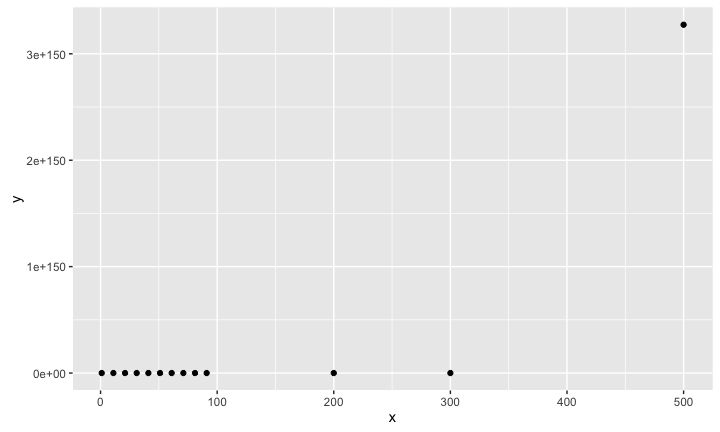
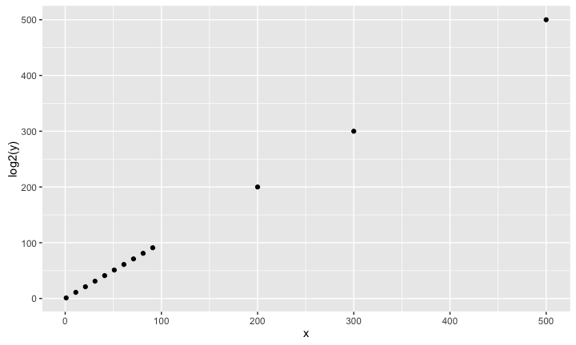
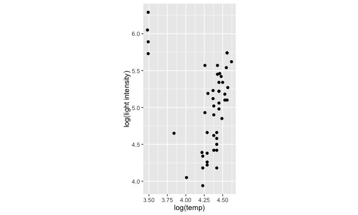
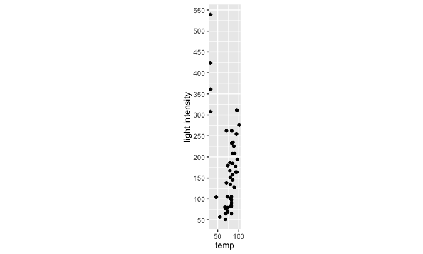
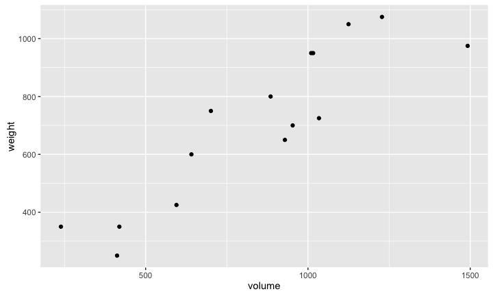
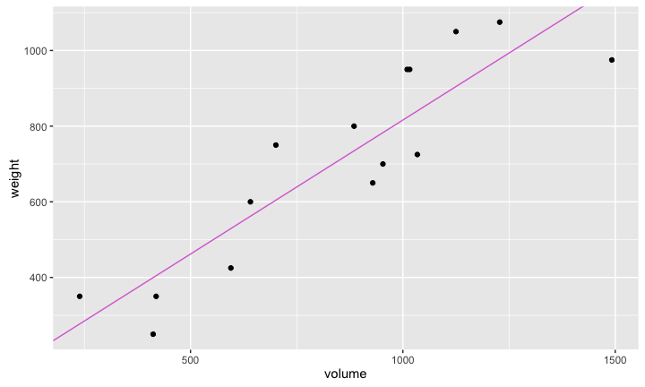
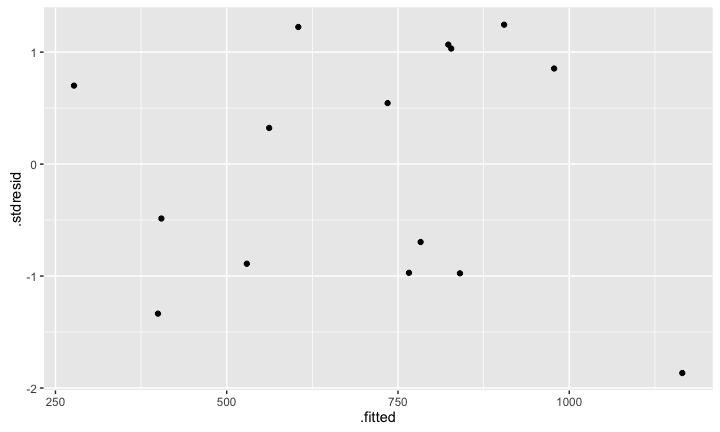
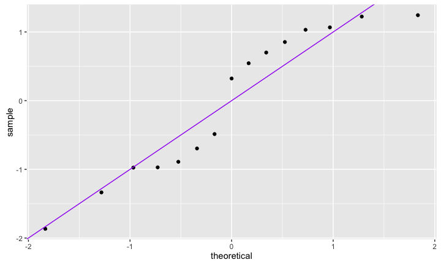
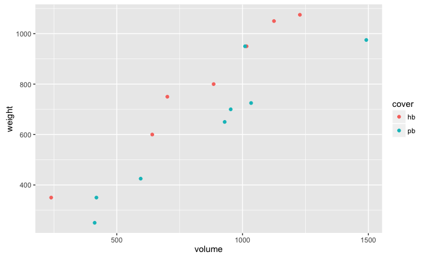

# MATH 141
Chester Ismay  


## Regular scales


```r
x <- c(seq(from = 1, to = 100, by = 10), 200, 300, 500); y <- 2^x; df <- data.frame(x, y)
qplot(x, y, data = df)
```



## Logarithmic scale for y


```r
qplot(x, log2(y), data = df)
```



## Surface temp and light intensity (log-log plot)



## Surface temp and light intensity (regular scales)



# Regression 

## Example: shipping books {.build}

<center>

</center>

When you buy a book from Amazon, you get a quote for how much it
costs to ship. This is largely based on the weight of the book. If you
didn't know the weight of a book, what other characteristics of it
could you measure to help predict weight?


## Example: shipping books


```r
qplot(x = volume, y = weight, data = books)
```




## Example: shipping books {.smaller}


```r
qplot(x = volume, y = weight, data = books) + 
  geom_abline(intercept = m1$coef[1], slope = m1$coef[2], col = "orchid")
```




## {.build .smaller} 


```r
m1 <- lm(weight ~ volume, data = books)
summary(m1)
```

```
## 
## Call:
## lm(formula = weight ~ volume, data = books)
## 
## Residuals:
##    Min     1Q Median     3Q    Max 
## -190.0 -109.9   38.1  109.7  145.6 
## 
## Coefficients:
##             Estimate Std. Error t value Pr(>|t|)    
## (Intercept) 107.6793    88.3776    1.22     0.24    
## volume        0.7086     0.0975    7.27  6.3e-06 ***
## ---
## Signif. codes:  0 '***' 0.001 '**' 0.01 '*' 0.05 '.' 0.1 ' ' 1
## 
## Residual standard error: 124 on 13 degrees of freedom
## Multiple R-squared:  0.803,	Adjusted R-squared:  0.787 
## F-statistic: 52.9 on 1 and 13 DF,  p-value: 6.26e-06
```

Q1: What is the equation for the line?

$$ \hat{y} = 107.7 + 0.708 x $$
$$ \widehat{weight} = 107.7 + 0.708 volume $$


## {.build .smaller}

Q2: Is volume a significant predictor?


```r
summary(m1)
```

```
## 
## Call:
## lm(formula = weight ~ volume, data = books)
## 
## Residuals:
##    Min     1Q Median     3Q    Max 
## -190.0 -109.9   38.1  109.7  145.6 
## 
## Coefficients:
##             Estimate Std. Error t value Pr(>|t|)    
## (Intercept) 107.6793    88.3776    1.22     0.24    
## volume        0.7086     0.0975    7.27  6.3e-06 ***
## ---
## Signif. codes:  0 '***' 0.001 '**' 0.01 '*' 0.05 '.' 0.1 ' ' 1
## 
## Residual standard error: 124 on 13 degrees of freedom
## Multiple R-squared:  0.803,	Adjusted R-squared:  0.787 
## F-statistic: 52.9 on 1 and 13 DF,  p-value: 6.26e-06
```

Q3: How much of the variation in weight is explained by the model containing volume?


## {.build}

Q4: Does this appear to be a reasonable setting to apply linear regression?

We need to check:

1. **L** inear trend
2. **I** ndependent observations/errors
3. **N** ormal residuals
4. **E** qual variance


## Residual Plot


```r
qplot(x = .fitted, y = .stdresid, data = m1)
```




## QQ plot


```r
qplot(sample = .stdresid, data = m1) + geom_abline(col = "purple")
```



# Multiple Regression

## Multiple Regression {.build}

Allows us to create a model to explain one $numerical$ variable, the response, as a linear function of many explanatory variables that can be both $numerical$ and
$categorical$.

We posit the true model:

$$ Y = \beta_0 + \beta_1 X_1 + \beta_2 X_2 + \ldots + \beta_p X_p + \epsilon; \quad \epsilon \sim N(0, \sigma^2) $$

We use the data to estimate our fitted model:

$$ \hat{y} = b_0 + b_1 x_1 + b_2 x_2 + \ldots + b_p x_p $$


## Estimating $\beta_0, \beta_1$, etc. {.build}

In least-squares regression, we're still finding the estimates that minimize
the sum of squared residuals.

$$ \sum_{i = 1}^n {e_i}^2 = \sum_{i = 1}^n \left(y_i - \hat{y}_i\right)^2$$

<!--
**Mathy note:** They have a closed-form solution.

$$ \mathbf{b} = (\mathbf{X}^T\mathbf{X})^{-1}\mathbf{X}^T\mathbf{y} $$ where $\mathbf{b} = (b_0, b_1, \ldots, b_p)$, $\mathbf{b} = (b_0, b_1, \ldots, b_p)$, \mathbf{X} = ()

-->

In R:


```r
lm(y ~ x1 + x2 + ... + xp, data = mydata)
```


## Example: shipping books {.build}


```r
qplot(x = volume, y = weight, color = cover, data = books)
```




## {.build .smaller}


```r
m2 <- lm(weight ~ volume + cover, data = books)
summary(m2)
```

```
## 
## Call:
## lm(formula = weight ~ volume + cover, data = books)
## 
## Residuals:
##    Min     1Q Median     3Q    Max 
## -110.1  -32.3  -16.1   28.9  210.9 
## 
## Coefficients:
##              Estimate Std. Error t value Pr(>|t|)    
## (Intercept)  197.9628    59.1927    3.34  0.00584 ** 
## volume         0.7180     0.0615   11.67  6.6e-08 ***
## coverpb     -184.0473    40.4942   -4.55  0.00067 ***
## ---
## Signif. codes:  0 '***' 0.001 '**' 0.01 '*' 0.05 '.' 0.1 ' ' 1
## 
## Residual standard error: 78.2 on 12 degrees of freedom
## Multiple R-squared:  0.927,	Adjusted R-squared:  0.915 
## F-statistic: 76.7 on 2 and 12 DF,  p-value: 1.45e-07
```

<center>
### How do we interpret these estimates?
</center>

#


## Example: shipping books {.build .smaller}


## MLR slope interpretation {.build}

The slope corresponding to the dummy variable tell us:

- How much vertical separation there is between our lines
- How much `weight` is expected to increase if `cover` goes
from 0 to 1 and `volume` is left unchanged.

Each $b_i$ tells you how much you expect the $y$ to change when you change the
$x_i$ **by one unit**, while **holding all other variables constant**.


## {.smaller .build}


```r
summary(m2)
```

```
## 
## Call:
## lm(formula = weight ~ volume + cover, data = books)
## 
## Residuals:
##    Min     1Q Median     3Q    Max 
## -110.1  -32.3  -16.1   28.9  210.9 
## 
## Coefficients:
##              Estimate Std. Error t value Pr(>|t|)    
## (Intercept)  197.9628    59.1927    3.34  0.00584 ** 
## volume         0.7180     0.0615   11.67  6.6e-08 ***
## coverpb     -184.0473    40.4942   -4.55  0.00067 ***
## ---
## Signif. codes:  0 '***' 0.001 '**' 0.01 '*' 0.05 '.' 0.1 ' ' 1
## 
## Residual standard error: 78.2 on 12 degrees of freedom
## Multiple R-squared:  0.927,	Adjusted R-squared:  0.915 
## F-statistic: 76.7 on 2 and 12 DF,  p-value: 1.45e-07
```

- Is the difference between cover types significant?
- How much of the variation in weight is explained by a model containing both
volume and cover?

<!--
##


```r
m2 <- lm(weight ~ volume + cover, data = books)
summary(m2)$coef
```

```
##             Estimate Std. Error t value Pr(>|t|)
## (Intercept)  197.963    59.1927    3.34 5.84e-03
## volume         0.718     0.0615   11.67 6.60e-08
## coverpb     -184.047    40.4942   -4.55 6.72e-04
```

```r
qt(.025, df = nrow(books) - 3)
```

```
## [1] -2.18
```

Which of the following represents the appropriate 95% CI for `coverpb`?

- A. $197 \pm 1.96 \times 59.19$
- B. $-184 \pm 2.18 \times 40.5$
- C. $-184 \pm -4.55 \times 40.5$
-->
