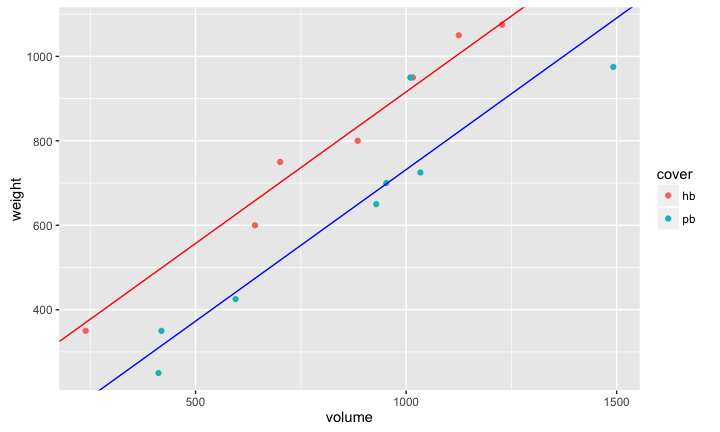
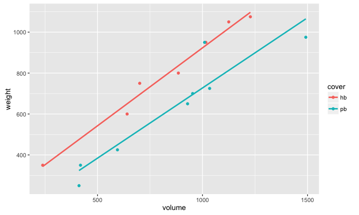
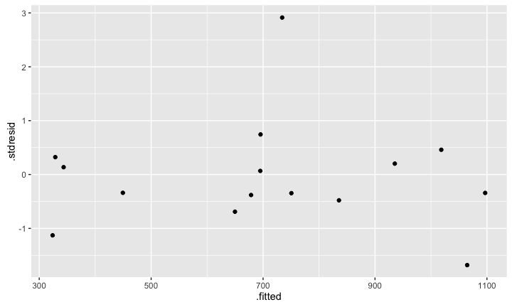
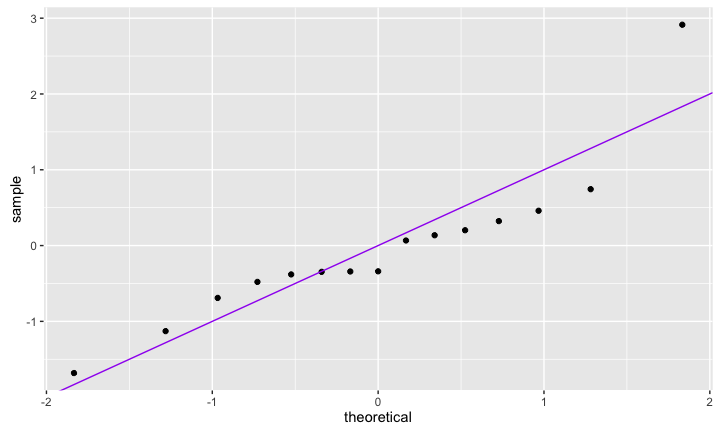

# MATH 141
Chester Ismay  


## Extending the model



The two cover types have different intercepts. Do they share the same slope?


## Extending the model




## {.smaller .build}


```r
m3 <- lm(weight ~ volume + cover + volume:cover, data = books)
summary(m3)
```

```
## 
## Call:
## lm(formula = weight ~ volume + cover + volume:cover, data = books)
## 
## Residuals:
##    Min     1Q Median     3Q    Max 
##  -89.7  -32.1  -21.8   17.9  215.9 
## 
## Coefficients:
##                 Estimate Std. Error t value Pr(>|t|)    
## (Intercept)     161.5865    86.5192    1.87    0.089 .  
## volume            0.7616     0.0972    7.84  7.9e-06 ***
## coverpb        -120.2141   115.6590   -1.04    0.321    
## volume:coverpb   -0.0757     0.1280   -0.59    0.566    
## ---
## Signif. codes:  0 '***' 0.001 '**' 0.01 '*' 0.05 '.' 0.1 ' ' 1
## 
## Residual standard error: 80.4 on 11 degrees of freedom
## Multiple R-squared:  0.93,	Adjusted R-squared:  0.911 
## F-statistic: 48.5 on 3 and 11 DF,  p-value: 1.24e-06
```

Do we have evidence that two types of books have different relationships
between volume and weight?


## Take home messages {.build}

- There is a statistically significant relationship between volume and weight.
- There is a statistically significant difference in weight between paperback
and hardcover books, when controlling for volume.
- There is not strong evidence that the relationship between volume and weight
differs between paperbacks and hardbacks.

This is **inference**, which required **valid models**. We'll now check diagnostics.

##


```r
qplot(x = .fitted, y = .stdresid, data = m3)
```




##


```r
qplot(sample = .stdresid, data = m3) + geom_abline(col = "purple")
```




<!--
## {.smaller}


```r
qnorm(.025)
```

```
## [1] -1.96
```

```r
qt(.025, df = 13)
```

```
## [1] -2.16
```

```r
qt(.025, df = 14)
```

```
## [1] -2.14
```

```r
qt(.05, df = 13)
```

```
## [1] -1.77
```

```r
qt(.05, df = 14)
```

```
## [1] -1.76
```

-->

# Geometry of MLR


## Ex: Restaurants in NYC


## Ex: Restaurants in NYC {.build}


```r
head(nyc, 3)
```

```
##   Case          Restaurant Price Food Decor Service East
## 1    1 Daniella Ristorante    43   22    18      20    0
## 2    2  Tello's Ristorante    32   20    19      19    0
## 3    3          Biricchino    34   21    13      18    0
```

```r
dim(nyc)
```

```
## [1] 168   7
```

What is the unit of observation?

*A restaurant*


## What determines the price of a meal?

Let's look at the relationship between price, food rating, and decor rating.

<script>CanvasMatrix4=function(m){if(typeof m=='object'){if("length"in m&&m.length>=16){this.load(m[0],m[1],m[2],m[3],m[4],m[5],m[6],m[7],m[8],m[9],m[10],m[11],m[12],m[13],m[14],m[15]);return}else if(m instanceof CanvasMatrix4){this.load(m);return}}this.makeIdentity()};CanvasMatrix4.prototype.load=function(){if(arguments.length==1&&typeof arguments[0]=='object'){var matrix=arguments[0];if("length"in matrix&&matrix.length==16){this.m11=matrix[0];this.m12=matrix[1];this.m13=matrix[2];this.m14=matrix[3];this.m21=matrix[4];this.m22=matrix[5];this.m23=matrix[6];this.m24=matrix[7];this.m31=matrix[8];this.m32=matrix[9];this.m33=matrix[10];this.m34=matrix[11];this.m41=matrix[12];this.m42=matrix[13];this.m43=matrix[14];this.m44=matrix[15];return}if(arguments[0]instanceof CanvasMatrix4){this.m11=matrix.m11;this.m12=matrix.m12;this.m13=matrix.m13;this.m14=matrix.m14;this.m21=matrix.m21;this.m22=matrix.m22;this.m23=matrix.m23;this.m24=matrix.m24;this.m31=matrix.m31;this.m32=matrix.m32;this.m33=matrix.m33;this.m34=matrix.m34;this.m41=matrix.m41;this.m42=matrix.m42;this.m43=matrix.m43;this.m44=matrix.m44;return}}this.makeIdentity()};CanvasMatrix4.prototype.getAsArray=function(){return[this.m11,this.m12,this.m13,this.m14,this.m21,this.m22,this.m23,this.m24,this.m31,this.m32,this.m33,this.m34,this.m41,this.m42,this.m43,this.m44]};CanvasMatrix4.prototype.getAsWebGLFloatArray=function(){return new WebGLFloatArray(this.getAsArray())};CanvasMatrix4.prototype.makeIdentity=function(){this.m11=1;this.m12=0;this.m13=0;this.m14=0;this.m21=0;this.m22=1;this.m23=0;this.m24=0;this.m31=0;this.m32=0;this.m33=1;this.m34=0;this.m41=0;this.m42=0;this.m43=0;this.m44=1};CanvasMatrix4.prototype.transpose=function(){var tmp=this.m12;this.m12=this.m21;this.m21=tmp;tmp=this.m13;this.m13=this.m31;this.m31=tmp;tmp=this.m14;this.m14=this.m41;this.m41=tmp;tmp=this.m23;this.m23=this.m32;this.m32=tmp;tmp=this.m24;this.m24=this.m42;this.m42=tmp;tmp=this.m34;this.m34=this.m43;this.m43=tmp};CanvasMatrix4.prototype.invert=function(){var det=this._determinant4x4();if(Math.abs(det)<1e-8)return null;this._makeAdjoint();this.m11/=det;this.m12/=det;this.m13/=det;this.m14/=det;this.m21/=det;this.m22/=det;this.m23/=det;this.m24/=det;this.m31/=det;this.m32/=det;this.m33/=det;this.m34/=det;this.m41/=det;this.m42/=det;this.m43/=det;this.m44/=det};CanvasMatrix4.prototype.translate=function(x,y,z){if(x==undefined)x=0;if(y==undefined)y=0;if(z==undefined)z=0;var matrix=new CanvasMatrix4();matrix.m41=x;matrix.m42=y;matrix.m43=z;this.multRight(matrix)};CanvasMatrix4.prototype.scale=function(x,y,z){if(x==undefined)x=1;if(z==undefined){if(y==undefined){y=x;z=x}else z=1}else if(y==undefined)y=x;var matrix=new CanvasMatrix4();matrix.m11=x;matrix.m22=y;matrix.m33=z;this.multRight(matrix)};CanvasMatrix4.prototype.rotate=function(angle,x,y,z){angle=angle/180*Math.PI;angle/=2;var sinA=Math.sin(angle);var cosA=Math.cos(angle);var sinA2=sinA*sinA;var length=Math.sqrt(x*x+y*y+z*z);if(length==0){x=0;y=0;z=1}else if(length!=1){x/=length;y/=length;z/=length}var mat=new CanvasMatrix4();if(x==1&&y==0&&z==0){mat.m11=1;mat.m12=0;mat.m13=0;mat.m21=0;mat.m22=1-2*sinA2;mat.m23=2*sinA*cosA;mat.m31=0;mat.m32=-2*sinA*cosA;mat.m33=1-2*sinA2;mat.m14=mat.m24=mat.m34=0;mat.m41=mat.m42=mat.m43=0;mat.m44=1}else if(x==0&&y==1&&z==0){mat.m11=1-2*sinA2;mat.m12=0;mat.m13=-2*sinA*cosA;mat.m21=0;mat.m22=1;mat.m23=0;mat.m31=2*sinA*cosA;mat.m32=0;mat.m33=1-2*sinA2;mat.m14=mat.m24=mat.m34=0;mat.m41=mat.m42=mat.m43=0;mat.m44=1}else if(x==0&&y==0&&z==1){mat.m11=1-2*sinA2;mat.m12=2*sinA*cosA;mat.m13=0;mat.m21=-2*sinA*cosA;mat.m22=1-2*sinA2;mat.m23=0;mat.m31=0;mat.m32=0;mat.m33=1;mat.m14=mat.m24=mat.m34=0;mat.m41=mat.m42=mat.m43=0;mat.m44=1}else{var x2=x*x;var y2=y*y;var z2=z*z;mat.m11=1-2*(y2+z2)*sinA2;mat.m12=2*(x*y*sinA2+z*sinA*cosA);mat.m13=2*(x*z*sinA2-y*sinA*cosA);mat.m21=2*(y*x*sinA2-z*sinA*cosA);mat.m22=1-2*(z2+x2)*sinA2;mat.m23=2*(y*z*sinA2+x*sinA*cosA);mat.m31=2*(z*x*sinA2+y*sinA*cosA);mat.m32=2*(z*y*sinA2-x*sinA*cosA);mat.m33=1-2*(x2+y2)*sinA2;mat.m14=mat.m24=mat.m34=0;mat.m41=mat.m42=mat.m43=0;mat.m44=1}this.multRight(mat)};CanvasMatrix4.prototype.multRight=function(mat){var m11=(this.m11*mat.m11+this.m12*mat.m21+this.m13*mat.m31+this.m14*mat.m41);var m12=(this.m11*mat.m12+this.m12*mat.m22+this.m13*mat.m32+this.m14*mat.m42);var m13=(this.m11*mat.m13+this.m12*mat.m23+this.m13*mat.m33+this.m14*mat.m43);var m14=(this.m11*mat.m14+this.m12*mat.m24+this.m13*mat.m34+this.m14*mat.m44);var m21=(this.m21*mat.m11+this.m22*mat.m21+this.m23*mat.m31+this.m24*mat.m41);var m22=(this.m21*mat.m12+this.m22*mat.m22+this.m23*mat.m32+this.m24*mat.m42);var m23=(this.m21*mat.m13+this.m22*mat.m23+this.m23*mat.m33+this.m24*mat.m43);var m24=(this.m21*mat.m14+this.m22*mat.m24+this.m23*mat.m34+this.m24*mat.m44);var m31=(this.m31*mat.m11+this.m32*mat.m21+this.m33*mat.m31+this.m34*mat.m41);var m32=(this.m31*mat.m12+this.m32*mat.m22+this.m33*mat.m32+this.m34*mat.m42);var m33=(this.m31*mat.m13+this.m32*mat.m23+this.m33*mat.m33+this.m34*mat.m43);var m34=(this.m31*mat.m14+this.m32*mat.m24+this.m33*mat.m34+this.m34*mat.m44);var m41=(this.m41*mat.m11+this.m42*mat.m21+this.m43*mat.m31+this.m44*mat.m41);var m42=(this.m41*mat.m12+this.m42*mat.m22+this.m43*mat.m32+this.m44*mat.m42);var m43=(this.m41*mat.m13+this.m42*mat.m23+this.m43*mat.m33+this.m44*mat.m43);var m44=(this.m41*mat.m14+this.m42*mat.m24+this.m43*mat.m34+this.m44*mat.m44);this.m11=m11;this.m12=m12;this.m13=m13;this.m14=m14;this.m21=m21;this.m22=m22;this.m23=m23;this.m24=m24;this.m31=m31;this.m32=m32;this.m33=m33;this.m34=m34;this.m41=m41;this.m42=m42;this.m43=m43;this.m44=m44};CanvasMatrix4.prototype.multLeft=function(mat){var m11=(mat.m11*this.m11+mat.m12*this.m21+mat.m13*this.m31+mat.m14*this.m41);var m12=(mat.m11*this.m12+mat.m12*this.m22+mat.m13*this.m32+mat.m14*this.m42);var m13=(mat.m11*this.m13+mat.m12*this.m23+mat.m13*this.m33+mat.m14*this.m43);var m14=(mat.m11*this.m14+mat.m12*this.m24+mat.m13*this.m34+mat.m14*this.m44);var m21=(mat.m21*this.m11+mat.m22*this.m21+mat.m23*this.m31+mat.m24*this.m41);var m22=(mat.m21*this.m12+mat.m22*this.m22+mat.m23*this.m32+mat.m24*this.m42);var m23=(mat.m21*this.m13+mat.m22*this.m23+mat.m23*this.m33+mat.m24*this.m43);var m24=(mat.m21*this.m14+mat.m22*this.m24+mat.m23*this.m34+mat.m24*this.m44);var m31=(mat.m31*this.m11+mat.m32*this.m21+mat.m33*this.m31+mat.m34*this.m41);var m32=(mat.m31*this.m12+mat.m32*this.m22+mat.m33*this.m32+mat.m34*this.m42);var m33=(mat.m31*this.m13+mat.m32*this.m23+mat.m33*this.m33+mat.m34*this.m43);var m34=(mat.m31*this.m14+mat.m32*this.m24+mat.m33*this.m34+mat.m34*this.m44);var m41=(mat.m41*this.m11+mat.m42*this.m21+mat.m43*this.m31+mat.m44*this.m41);var m42=(mat.m41*this.m12+mat.m42*this.m22+mat.m43*this.m32+mat.m44*this.m42);var m43=(mat.m41*this.m13+mat.m42*this.m23+mat.m43*this.m33+mat.m44*this.m43);var m44=(mat.m41*this.m14+mat.m42*this.m24+mat.m43*this.m34+mat.m44*this.m44);this.m11=m11;this.m12=m12;this.m13=m13;this.m14=m14;this.m21=m21;this.m22=m22;this.m23=m23;this.m24=m24;this.m31=m31;this.m32=m32;this.m33=m33;this.m34=m34;this.m41=m41;this.m42=m42;this.m43=m43;this.m44=m44};CanvasMatrix4.prototype.ortho=function(left,right,bottom,top,near,far){var tx=(left+right)/(left-right);var ty=(top+bottom)/(top-bottom);var tz=(far+near)/(far-near);var matrix=new CanvasMatrix4();matrix.m11=2/(left-right);matrix.m12=0;matrix.m13=0;matrix.m14=0;matrix.m21=0;matrix.m22=2/(top-bottom);matrix.m23=0;matrix.m24=0;matrix.m31=0;matrix.m32=0;matrix.m33=-2/(far-near);matrix.m34=0;matrix.m41=tx;matrix.m42=ty;matrix.m43=tz;matrix.m44=1;this.multRight(matrix)};CanvasMatrix4.prototype.frustum=function(left,right,bottom,top,near,far){var matrix=new CanvasMatrix4();var A=(right+left)/(right-left);var B=(top+bottom)/(top-bottom);var C=-(far+near)/(far-near);var D=-(2*far*near)/(far-near);matrix.m11=(2*near)/(right-left);matrix.m12=0;matrix.m13=0;matrix.m14=0;matrix.m21=0;matrix.m22=2*near/(top-bottom);matrix.m23=0;matrix.m24=0;matrix.m31=A;matrix.m32=B;matrix.m33=C;matrix.m34=-1;matrix.m41=0;matrix.m42=0;matrix.m43=D;matrix.m44=0;this.multRight(matrix)};CanvasMatrix4.prototype.perspective=function(fovy,aspect,zNear,zFar){var top=Math.tan(fovy*Math.PI/360)*zNear;var bottom=-top;var left=aspect*bottom;var right=aspect*top;this.frustum(left,right,bottom,top,zNear,zFar)};CanvasMatrix4.prototype.lookat=function(eyex,eyey,eyez,centerx,centery,centerz,upx,upy,upz){var matrix=new CanvasMatrix4();var zx=eyex-centerx;var zy=eyey-centery;var zz=eyez-centerz;var mag=Math.sqrt(zx*zx+zy*zy+zz*zz);if(mag){zx/=mag;zy/=mag;zz/=mag}var yx=upx;var yy=upy;var yz=upz;xx=yy*zz-yz*zy;xy=-yx*zz+yz*zx;xz=yx*zy-yy*zx;yx=zy*xz-zz*xy;yy=-zx*xz+zz*xx;yx=zx*xy-zy*xx;mag=Math.sqrt(xx*xx+xy*xy+xz*xz);if(mag){xx/=mag;xy/=mag;xz/=mag}mag=Math.sqrt(yx*yx+yy*yy+yz*yz);if(mag){yx/=mag;yy/=mag;yz/=mag}matrix.m11=xx;matrix.m12=xy;matrix.m13=xz;matrix.m14=0;matrix.m21=yx;matrix.m22=yy;matrix.m23=yz;matrix.m24=0;matrix.m31=zx;matrix.m32=zy;matrix.m33=zz;matrix.m34=0;matrix.m41=0;matrix.m42=0;matrix.m43=0;matrix.m44=1;matrix.translate(-eyex,-eyey,-eyez);this.multRight(matrix)};CanvasMatrix4.prototype._determinant2x2=function(a,b,c,d){return a*d-b*c};CanvasMatrix4.prototype._determinant3x3=function(a1,a2,a3,b1,b2,b3,c1,c2,c3){return a1*this._determinant2x2(b2,b3,c2,c3)-b1*this._determinant2x2(a2,a3,c2,c3)+c1*this._determinant2x2(a2,a3,b2,b3)};CanvasMatrix4.prototype._determinant4x4=function(){var a1=this.m11;var b1=this.m12;var c1=this.m13;var d1=this.m14;var a2=this.m21;var b2=this.m22;var c2=this.m23;var d2=this.m24;var a3=this.m31;var b3=this.m32;var c3=this.m33;var d3=this.m34;var a4=this.m41;var b4=this.m42;var c4=this.m43;var d4=this.m44;return a1*this._determinant3x3(b2,b3,b4,c2,c3,c4,d2,d3,d4)-b1*this._determinant3x3(a2,a3,a4,c2,c3,c4,d2,d3,d4)+c1*this._determinant3x3(a2,a3,a4,b2,b3,b4,d2,d3,d4)-d1*this._determinant3x3(a2,a3,a4,b2,b3,b4,c2,c3,c4)};CanvasMatrix4.prototype._makeAdjoint=function(){var a1=this.m11;var b1=this.m12;var c1=this.m13;var d1=this.m14;var a2=this.m21;var b2=this.m22;var c2=this.m23;var d2=this.m24;var a3=this.m31;var b3=this.m32;var c3=this.m33;var d3=this.m34;var a4=this.m41;var b4=this.m42;var c4=this.m43;var d4=this.m44;this.m11=this._determinant3x3(b2,b3,b4,c2,c3,c4,d2,d3,d4);this.m21=-this._determinant3x3(a2,a3,a4,c2,c3,c4,d2,d3,d4);this.m31=this._determinant3x3(a2,a3,a4,b2,b3,b4,d2,d3,d4);this.m41=-this._determinant3x3(a2,a3,a4,b2,b3,b4,c2,c3,c4);this.m12=-this._determinant3x3(b1,b3,b4,c1,c3,c4,d1,d3,d4);this.m22=this._determinant3x3(a1,a3,a4,c1,c3,c4,d1,d3,d4);this.m32=-this._determinant3x3(a1,a3,a4,b1,b3,b4,d1,d3,d4);this.m42=this._determinant3x3(a1,a3,a4,b1,b3,b4,c1,c3,c4);this.m13=this._determinant3x3(b1,b2,b4,c1,c2,c4,d1,d2,d4);this.m23=-this._determinant3x3(a1,a2,a4,c1,c2,c4,d1,d2,d4);this.m33=this._determinant3x3(a1,a2,a4,b1,b2,b4,d1,d2,d4);this.m43=-this._determinant3x3(a1,a2,a4,b1,b2,b4,c1,c2,c4);this.m14=-this._determinant3x3(b1,b2,b3,c1,c2,c3,d1,d2,d3);this.m24=this._determinant3x3(a1,a2,a3,c1,c2,c3,d1,d2,d3);this.m34=-this._determinant3x3(a1,a2,a3,b1,b2,b3,d1,d2,d3);this.m44=this._determinant3x3(a1,a2,a3,b1,b2,b3,c1,c2,c3)}</script>
<script>
rglwidgetClass = function() {
this.canvas = null;
this.userMatrix = new CanvasMatrix4();
this.types = [];
this.prMatrix = new CanvasMatrix4();
this.mvMatrix = new CanvasMatrix4();
this.vp = null;
this.prmvMatrix = null;
this.origs = null;
this.gl = null;
this.scene = null;
};
(function() {
this.multMV = function(M, v) {
return [ M.m11 * v[0] + M.m12 * v[1] + M.m13 * v[2] + M.m14 * v[3],
M.m21 * v[0] + M.m22 * v[1] + M.m23 * v[2] + M.m24 * v[3],
M.m31 * v[0] + M.m32 * v[1] + M.m33 * v[2] + M.m34 * v[3],
M.m41 * v[0] + M.m42 * v[1] + M.m43 * v[2] + M.m44 * v[3]
];
};
this.vlen = function(v) {
return Math.sqrt(this.dotprod(v, v));
};
this.dotprod = function(a, b) {
return a[0]*b[0] + a[1]*b[1] + a[2]*b[2];
}
this.xprod = function(a, b) {
return [a[1]*b[2] - a[2]*b[1],
a[2]*b[0] - a[0]*b[2],
a[0]*b[1] - a[1]*b[0]];
};
this.cbind = function(a, b) {
return a.map(function(currentValue, index, array) {
return currentValue.concat(b[index]);
});
};
this.swap = function(a, i, j) {
var temp = a[i];
a[i] = a[j];
a[j] = temp;
};
this.flatten = function(a) {
return [].concat.apply([], a);
};
/* set element of 1d or 2d array as if it was flattened.  Column major, zero based! */
this.setElement = function(a, i, value) {
if (Array.isArray(a[0])) {
var dim = a.length,
col = Math.floor(i/dim),
row = i % dim;
a[row][col] = value;
} else {
a[i] = value;
}
};
this.transpose = function(a) {
var newArray = [],
n = a.length,
m = a[0].length,
i;
for(i = 0; i < m; i++){
newArray.push([]);
}
for(i = 0; i < n; i++){
for(var j = 0; j < m; j++){
newArray[j].push(a[i][j]);
}
}
return newArray;
};
this.sumsq = function(x) {
var result = 0, i;
for (i=0; i < x.length; i++)
result += x[i]*x[i];
return result;
};
this.toCanvasMatrix4 = function(mat) {
if (mat instanceof CanvasMatrix4)
return mat;
var result = new CanvasMatrix4();
mat = this.flatten(this.transpose(mat));
result.load(mat);
return result;
};
this.stringToRgb = function(s) {
s = s.replace("#", "");
var bigint = parseInt(s, 16);
return [((bigint >> 16) & 255)/255,
((bigint >> 8) & 255)/255,
(bigint & 255)/255];
};
this.componentProduct = function(x, y) {
if (typeof y === "undefined") {
this.alertOnce("Bad arg to componentProduct");
}
var result = new Float32Array(3), i;
for (i = 0; i<3; i++)
result[i] = x[i]*y[i];
return result;
};
this.getPowerOfTwo = function(value) {
var pow = 1;
while(pow<value) {
pow *= 2;
}
return pow;
};
this.unique = function(arr) {
arr = [].concat(arr);
return arr.filter(function(value, index, self) {
return self.indexOf(value) === index;
});
};
this.repeatToLen = function(arr, len) {
arr = [].concat(arr);
while (arr.length < len/2)
arr = arr.concat(arr);
return arr.concat(arr.slice(0, len - arr.length));
};
this.alertOnce = function(msg) {
if (typeof this.alerted !== "undefined")
return;
this.alerted = true;
alert(msg);
};
this.f_is_lit = 1;
this.f_is_smooth = 2;
this.f_has_texture = 4;
this.f_is_indexed = 8;
this.f_depth_sort = 16;
this.f_fixed_quads = 32;
this.f_is_transparent = 64;
this.f_is_lines = 128;
this.f_sprites_3d = 256;
this.f_sprite_3d = 512;
this.f_is_subscene = 1024;
this.f_is_clipplanes = 2048;
this.whichList = function(id) {
var obj = this.getObj(id),
flags = obj.flags;
if (obj.type === "light")
return "lights";
if (flags & this.f_is_subscene)
return "subscenes";
if (flags & this.f_is_clipplanes)
return "clipplanes";
if (flags & this.f_is_transparent)
return "transparent";
return "opaque";
};
this.getObj = function(id) {
if (typeof id !== "number") {
this.alertOnce("getObj id is "+typeof id);
}
return this.scene.objects[id];
};
this.getIdsByType = function(type, subscene) {
var
result = [], i, self = this;
if (typeof subscene === "undefined") {
Object.keys(this.scene.objects).forEach(
function(key) {
key = parseInt(key, 10);
if (self.getObj(key).type === type)
result.push(key);
});
} else {
ids = this.getObj(subscene).objects;
for (i=0; i < ids.length; i++) {
if (this.getObj(ids[i]).type === type) {
result.push(ids[i]);
}
}
}
return result;
};
this.getMaterial = function(id, property) {
var obj = this.getObj(id),
mat = obj.material[property];
if (typeof mat === "undefined")
mat = this.scene.material[property];
return mat;
};
this.inSubscene = function(id, subscene) {
return this.getObj(subscene).objects.indexOf(id) > -1;
};
this.addToSubscene = function(id, subscene) {
var thelist,
thesub = this.getObj(subscene),
ids = [id],
obj = this.getObj(id), i;
if (typeof obj.newIds !== "undefined") {
ids = ids.concat(obj.newIds);
}
for (i = 0; i < ids.length; i++) {
id = ids[i];
if (thesub.objects.indexOf(id) == -1) {
thelist = this.whichList(id);
thesub.objects.push(id);
thesub[thelist].push(id);
}
}
};
this.delFromSubscene = function(id, subscene) {
var thelist,
thesub = this.getObj(subscene),
obj = this.getObj(id),
ids = [id], i, newIds;
if (typeof obj.newIds !== "undefined")
ids = ids.concat(obj.newIds);
for (j=0; j<ids.length;j++) {
id = ids[j];
i = thesub.objects.indexOf(id);
if (i > -1) {
thesub.objects.splice(i, 1);
thelist = this.whichList(id);
i = thesub[thelist].indexOf(id);
thesub[thelist].splice(i, 1);
}
}
};
this.setSubsceneEntries = function(ids, subsceneid) {
var sub = this.getObj(subsceneid);
sub.objects = ids;
this.initSubscene(subsceneid);
};
this.getSubsceneEntries = function(subscene) {
return this.getObj(subscene).objects;
};
this.getChildSubscenes = function(subscene) {
return this.getObj(subscene).subscenes;
};
this.getVertexShader = function(id) {
var obj = this.getObj(id),
flags = obj.flags,
type = obj.type,
is_lit = flags & this.f_is_lit,
has_texture = flags & this.f_has_texture,
fixed_quads = flags & this.f_fixed_quads,
sprites_3d = flags & this.f_sprites_3d,
sprite_3d = flags & this.f_sprite_3d,
nclipplanes = this.countClipplanes(),
result;
if (type === "clipplanes" || sprites_3d) return;
result = "	/* ****** "+type+" object "+id+" vertex shader ****** */\n"+
"	attribute vec3 aPos;\n"+
"	attribute vec4 aCol;\n"+
" uniform mat4 mvMatrix;\n"+
" uniform mat4 prMatrix;\n"+
" varying vec4 vCol;\n"+
" varying vec4 vPosition;\n";
if (is_lit && !fixed_quads)
result = result + "	attribute vec3 aNorm;\n"+
" uniform mat4 normMatrix;\n"+
" varying vec3 vNormal;\n";
if (has_texture || type === "text")
result = result + " attribute vec2 aTexcoord;\n"+
" varying vec2 vTexcoord;\n";
if (type === "text")
result = result + "	uniform vec2 textScale;\n";
if (fixed_quads)
result = result + "	attribute vec2 aOfs;\n";
else if (sprite_3d)
result = result + "	uniform vec3 uOrig;\n"+
" uniform float uSize;\n"+
" uniform mat4 usermat;\n";
result = result + "	void main(void) {\n";
if (nclipplanes || (!fixed_quads && !sprite_3d))
result = result + "	  vPosition = mvMatrix * vec4(aPos, 1.);\n";
if (!fixed_quads && !sprite_3d)
result = result + "	  gl_Position = prMatrix * vPosition;\n";
if (type == "points") {
var size = this.getMaterial(id, "size");
result = result + "	  gl_PointSize = "+size.toFixed(1)+";\n";
}
result = result + "	  vCol = aCol;\n";
if (is_lit && !fixed_quads && !sprite_3d)
result = result + "	  vNormal = normalize((normMatrix * vec4(aNorm, 1.)).xyz);\n";
if (has_texture || type === "text")
result = result + "	  vTexcoord = aTexcoord;\n";
if (type == "text")
result = result + "	  vec4 pos = prMatrix * mvMatrix * vec4(aPos, 1.);\n"+
"   pos = pos/pos.w;\n"+
"   gl_Position = pos + vec4(aOfs*textScale, 0.,0.);\n";
if (type == "sprites")
result = result + "	  vec4 pos = mvMatrix * vec4(aPos, 1.);\n"+
"   pos = pos/pos.w + vec4(aOfs, 0., 0.);\n"+
"   gl_Position = prMatrix*pos;\n";
if (sprite_3d)
result = result + "	  vNormal = normalize((normMatrix * vec4(aNorm, 1.)).xyz);\n"+
"   vec4 pos = mvMatrix * vec4(uOrig, 1.);\n"+
"   vPosition = pos/pos.w + vec4(uSize*(vec4(aPos, 1.)*usermat).xyz,0.);\n"+
"   gl_Position = prMatrix * vPosition;\n";
result = result + "	}\n";
return result;
};
this.getFragmentShader = function(id) {
var obj = this.getObj(id),
flags = obj.flags,
type = obj.type,
is_lit = flags & this.f_is_lit,
has_texture = flags & this.f_has_texture,
fixed_quads = flags & this.f_fixed_quads,
sprites_3d = flags & this.f_sprites_3d,
nclipplanes = this.countClipplanes(), i,
texture_format, nlights,
result;
if (type === "clipplanes" || sprites_3d) return;
if (has_texture)
texture_format = this.getMaterial(id, "textype");
result = "/* ****** "+type+" object "+id+" fragment shader ****** */\n"+
"#ifdef GL_ES\n"+
"  precision highp float;\n"+
"#endif\n"+
"  varying vec4 vCol; // carries alpha\n"+
"  varying vec4 vPosition;\n";
if (has_texture || type === "text")
result = result + "	varying vec2 vTexcoord;\n"+
" uniform sampler2D uSampler;\n";
if (is_lit && !fixed_quads)
result = result + "	varying vec3 vNormal;\n";
for (i = 0; i < nclipplanes; i++)
result = result + "	uniform vec4 vClipplane"+i+";\n";
if (is_lit) {
nlights = this.countLights();
if (nlights)
result = result + "	uniform mat4 mvMatrix;\n";
else
is_lit = false;
}
if (is_lit) {
result = result + "	  uniform vec3 emission;\n"+
"   uniform float shininess;\n";
for (i=0; i < nlights; i++) {
result = result + "	  uniform vec3 ambient" + i + ";\n"+
"   uniform vec3 specular" + i +"; // light*material\n"+
"   uniform vec3 diffuse" + i + ";\n"+
"   uniform vec3 lightDir" + i + ";\n"+
"   uniform bool viewpoint" + i + ";\n"+
"   uniform bool finite" + i + ";\n";
}
}
result = result + "	void main(void) {\n";
for (i=0; i < nclipplanes;i++)
result = result + "	  if (dot(vPosition, vClipplane"+i+") < 0.0) discard;\n";
if (is_lit) {
result = result + "	  vec3 eye = normalize(-vPosition.xyz);\n"+
"   vec3 lightdir;\n"+
"   vec4 colDiff;\n"+
"   vec3 halfVec;\n"+
"   vec4 lighteffect = vec4(emission, 0.);\n"+
"   vec3 col;\n"+
"   float nDotL;\n";
if (fixed_quads) {
result = result +   "	  vec3 n = vec3(0., 0., 1.);\n";
}
else {
result = result +   "	  vec3 n = normalize(vNormal);\n"+
"   n = -faceforward(n, n, eye);\n";
}
for (i=0; i < nlights; i++) {
result = result + "   colDiff = vec4(vCol.rgb * diffuse" + i + ", vCol.a);\n"+
"   lightdir = lightDir" + i + ";\n"+
"   if (!viewpoint" + i +")\n"+
"     lightdir = (mvMatrix * vec4(lightdir, 1.)).xyz;\n"+
"   if (!finite" + i + ") {\n"+
"     halfVec = normalize(lightdir + eye);\n"+
"   } else {\n"+
"     lightdir = normalize(lightdir - vPosition.xyz);\n"+
"     halfVec = normalize(lightdir + eye);\n"+
"   }\n"+
"	  col = ambient" + i + ";\n"+
"   nDotL = dot(n, lightdir);\n"+
"   col = col + max(nDotL, 0.) * colDiff.rgb;\n"+
"   col = col + pow(max(dot(halfVec, n), 0.), shininess) * specular" + i + ";\n"+
"   lighteffect = lighteffect + vec4(col, colDiff.a);\n";
}
} else {
result = result +   "   vec4 colDiff = vCol;\n"+
"	  vec4 lighteffect = colDiff;\n";
}
if ((has_texture && texture_format === "rgba") || type === "text")
result = result +   "	  vec4 textureColor = lighteffect*texture2D(uSampler, vTexcoord);\n";
if (has_texture) {
result = result + {
rgb:            "   vec4 textureColor = lighteffect*vec4(texture2D(uSampler, vTexcoord).rgb, 1.);\n",
alpha:          "   vec4 textureColor = texture2D(uSampler, vTexcoord);\n"+
"   float luminance = dot(vec3(1.,1.,1.), textureColor.rgb)/3.;\n"+
"   textureColor =  vec4(lighteffect.rgb, lighteffect.a*luminance);\n",
luminance:      "   vec4 textureColor = vec4(lighteffect.rgb*dot(texture2D(uSampler, vTexcoord).rgb, vec3(1.,1.,1.))/3., lighteffect.a);\n",
"luminance.alpha":"	  vec4 textureColor = texture2D(uSampler, vTexcoord);\n"+
"   float luminance = dot(vec3(1.,1.,1.),textureColor.rgb)/3.;\n"+
"   textureColor = vec4(lighteffect.rgb*luminance, lighteffect.a*textureColor.a);\n"
}[texture_format]+
"   gl_FragColor = textureColor;\n";
} else if (type === "text") {
result = result +   "	  if (textureColor.a < 0.1)\n"+
"     discard;\n"+
"   else\n"+
"     gl_FragColor = textureColor;\n";
} else
result = result +   "   gl_FragColor = lighteffect;\n";
result = result + "	}\n";
return result;
};
this.getShader = function(shaderType, code) {
var gl = this.gl, shader;
shader = gl.createShader(shaderType);
gl.shaderSource(shader, code);
gl.compileShader(shader);
if (gl.getShaderParameter(shader, gl.COMPILE_STATUS) === 0)
alert(gl.getShaderInfoLog(shader));
return shader;
};
this.handleLoadedTexture = function(texture, textureCanvas) {
var gl = this.gl;
gl.pixelStorei(gl.UNPACK_FLIP_Y_WEBGL, true);
gl.bindTexture(gl.TEXTURE_2D, texture);
gl.texImage2D(gl.TEXTURE_2D, 0, gl.RGBA, gl.RGBA, gl.UNSIGNED_BYTE, textureCanvas);
gl.texParameteri(gl.TEXTURE_2D, gl.TEXTURE_MAG_FILTER, gl.LINEAR);
gl.texParameteri(gl.TEXTURE_2D, gl.TEXTURE_MIN_FILTER, gl.LINEAR_MIPMAP_NEAREST);
gl.generateMipmap(gl.TEXTURE_2D);
gl.bindTexture(gl.TEXTURE_2D, null);
};
this.loadImageToTexture = function(uri, texture) {
var canvas = this.textureCanvas,
ctx = canvas.getContext("2d"),
image = new Image(),
self = this;
image.onload = function() {
var w = image.width,
h = image.height,
canvasX = self.getPowerOfTwo(w),
canvasY = self.getPowerOfTwo(h),
gl = self.gl,
maxTexSize = gl.getParameter(gl.MAX_TEXTURE_SIZE);
if (maxTexSize > 4096) maxTexSize = 4096;
while (canvasX > 1 && canvasY > 1 && (canvasX > maxTexSize || canvasY > maxTexSize)) {
canvasX /= 2;
canvasY /= 2;
}
canvas.width = canvasX;
canvas.height = canvasY;
ctx.imageSmoothingEnabled = true;
ctx.drawImage(image, 0, 0, canvasX, canvasY);
self.handleLoadedTexture(texture, canvas);
self.drawScene();
};
image.src = uri;
};
this.drawTextToCanvas = function(text, cex, family, font) {
var canvasX, canvasY,
textY,
scaling = 20,
textColour = "white",
backgroundColour = "rgba(0,0,0,0)",
canvas = this.textureCanvas,
ctx = canvas.getContext("2d"),
i, textHeights = [], widths = [], offset = 0, offsets = [],
fontStrings = [],
getFontString = function(i) {
textHeights[i] = scaling*cex[i];
var fontString = textHeights[i] + "px",
family0 = family[i],
font0 = font[i];
if (family0 === "sans")
family0 = "sans-serif";
else if (family0 === "mono")
family0 = "monospace";
fontString = fontString + " " + family0;
if (font0 === 2 || font0 === 4)
fontString = "bold " + fontString;
if (font0 === 3 || font0 === 4)
fontString = "italic " + fontString;
return fontString;
};
cex = this.repeatToLen(cex, text.length);
family = this.repeatToLen(family, text.length);
font = this.repeatToLen(font, text.length);
canvasX = 1;
for (i = 0; i < text.length; i++)  {
ctx.font = fontStrings[i] = getFontString(i);
widths[i] = ctx.measureText(text[i]).width;
offset = offsets[i] = offset + 2*textHeights[i];
canvasX = (widths[i] > canvasX) ? widths[i] : canvasX;
}
canvasX = this.getPowerOfTwo(canvasX);
canvasY = this.getPowerOfTwo(offset);
canvas.width = canvasX;
canvas.height = canvasY;
ctx.fillStyle = backgroundColour;
ctx.fillRect(0, 0, ctx.canvas.width, ctx.canvas.height);
ctx.textBaseline = "alphabetic";
for(i = 0; i < text.length; i++) {
textY = offsets[i];
ctx.font = fontStrings[i];
ctx.fillStyle = textColour;
ctx.textAlign = "left";
ctx.fillText(text[i], 0,  textY);
}
return {canvasX:canvasX, canvasY:canvasY,
widths:widths, textHeights:textHeights,
offsets:offsets};
};
this.setViewport = function(id) {
var gl = this.gl,
vp = this.getObj(id).par3d.viewport,
x = vp.x*this.canvas.width,
y = vp.y*this.canvas.height,
width = vp.width*this.canvas.width,
height = vp.height*this.canvas.height;
this.vp = {x:x, y:y, width:width, height:height};
gl.viewport(x, y, width, height);
gl.scissor(x, y, width, height);
};
this.setprMatrix = function(id) {
var subscene = this.getObj(id),
embedding = subscene.embeddings.projection;
if (embedding === "replace")
this.prMatrix.makeIdentity();
else
this.setprMatrix(subscene.parent);
if (embedding === "inherit")
return;
// This is based on the Frustum::enclose code from geom.cpp
var bbox = subscene.par3d.bbox,
scale = subscene.par3d.scale,
ranges = [(bbox[1]-bbox[0])*scale[0]/2,
(bbox[3]-bbox[2])*scale[1]/2,
(bbox[5]-bbox[4])*scale[2]/2],
radius = Math.sqrt(this.sumsq(ranges))*1.1; // A bit bigger to handle labels
if (radius <= 0) radius = 1;
var observer = subscene.par3d.observer,
distance = observer[2],
t = Math.tan(subscene.par3d.FOV*Math.PI/360),
near = distance - radius,
far = distance + radius,
hlen = t*near,
aspect = this.vp.width/this.vp.height,
z = subscene.par3d.zoom;
if (aspect > 1)
this.prMatrix.frustum(-hlen*aspect*z, hlen*aspect*z,
-hlen*z, hlen*z, near, far);
else
this.prMatrix.frustum(-hlen*z, hlen*z,
-hlen*z/aspect, hlen*z/aspect,
near, far);
};
this.setmvMatrix = function(id) {
var observer = this.getObj(id).par3d.observer;
this.mvMatrix.makeIdentity();
this.setmodelMatrix(id);
this.mvMatrix.translate(-observer[0], -observer[1], -observer[2]);
};
this.setmodelMatrix = function(id) {
var subscene = this.getObj(id),
embedding = subscene.embeddings.model;
if (embedding !== "inherit") {
var scale = subscene.par3d.scale,
bbox = subscene.par3d.bbox,
center = [(bbox[0]+bbox[1])/2,
(bbox[2]+bbox[3])/2,
(bbox[4]+bbox[5])/2];
this.mvMatrix.translate(-center[0], -center[1], -center[2]);
this.mvMatrix.scale(scale[0], scale[1], scale[2]);
this.mvMatrix.multRight( subscene.par3d.userMatrix );
}
if (embedding !== "replace")
this.setmodelMatrix(subscene.parent);
};
this.setnormMatrix = function(subsceneid) {
var self = this,
recurse = function(id) {
var sub = self.getObj(id),
embedding = sub.embeddings.model;
if (embedding !== "inherit") {
var scale = sub.par3d.scale;
self.normMatrix.scale(1/scale[0], 1/scale[1], 1/scale[2]);
self.normMatrix.multRight(sub.par3d.userMatrix);
}
if (embedding !== "replace")
recurse(sub.parent);
};
self.normMatrix.makeIdentity();
recurse(subsceneid);
};
this.setprmvMatrix = function() {
this.prmvMatrix = new CanvasMatrix4( this.mvMatrix );
this.prmvMatrix.multRight( this.prMatrix );
};
this.countClipplanes = function() {
return this.countObjs("clipplanes");
};
this.countLights = function() {
return this.countObjs("light");
};
this.countObjs = function(type) {
var self = this,
bound = 0;
Object.keys(this.scene.objects).forEach(
function(key) {
if (self.getObj(parseInt(key, 10)).type === type)
bound = bound + 1;
});
return bound;
};
this.initSubscene = function(id) {
var sub = this.getObj(id),
i, obj;
if (sub.type !== "subscene")
return;
sub.par3d.userMatrix = this.toCanvasMatrix4(sub.par3d.userMatrix);
sub.par3d.listeners = [].concat(sub.par3d.listeners);
sub.backgroundId = undefined;
sub.subscenes = [];
sub.clipplanes = [];
sub.transparent = [];
sub.opaque = [];
sub.lights = [];
for (i=0; i < sub.objects.length; i++) {
obj = this.getObj(sub.objects[i]);
if (typeof obj === "undefined") {
sub.objects.splice(i, 1);
i--;
} else if (obj.type === "background")
sub.backgroundId = obj.id;
else
sub[this.whichList(obj.id)].push(obj.id);
}
};
this.copyObj = function(id, reuse) {
var obj = this.getObj(id),
prev = document.getElementById(reuse).rglinstance,
prevobj = prev.getObj(id),
fields = ["flags", "type",
"colors", "vertices", "centers",
"normals", "offsets",
"texts", "cex", "family", "font", "adj",
"material",
"radii",
"texcoords",
"userMatrix", "ids",
"dim",
"par3d", "userMatrix",
"viewpoint", "finite"],
i;
for (i = 0; i < fields.length; i++) {
if (typeof prevobj[fields[i]] !== "undefined")
obj[fields[i]] = prevobj[fields[i]];
}
};
this.planeUpdateTriangles = function(id, bbox) {
var perms = [[0,0,1], [1,2,2], [2,1,0]],
x, xrow, elem, A, d, nhits, i, j, k, u, v, w, intersect, which, v0, v2, vx, reverse,
face1 = [], face2 = [], normals = [],
obj = this.getObj(id),
nPlanes = obj.normals.length;
obj.bbox = bbox;
obj.vertices = [];
obj.initialized = false;
for (elem = 0; elem < nPlanes; elem++) {
//    Vertex Av = normal.getRecycled(elem);
x = [];
A = obj.normals[elem];
d = obj.offsets[elem][0];
nhits = 0;
for (i=0; i<3; i++)
for (j=0; j<2; j++)
for (k=0; k<2; k++) {
u = perms[0][i];
v = perms[1][i];
w = perms[2][i];
if (A[w] != 0.0) {
intersect = -(d + A[u]*bbox[j+2*u] + A[v]*bbox[k+2*v])/A[w];
if (bbox[2*w] < intersect && intersect < bbox[1+2*w]) {
xrow = [];
xrow[u] = bbox[j+2*u];
xrow[v] = bbox[k+2*v];
xrow[w] = intersect;
x.push(xrow);
face1[nhits] = j + 2*u;
face2[nhits] = k + 2*v;
nhits++;
}
}
}
if (nhits > 3) {
/* Re-order the intersections so the triangles work */
for (i=0; i<nhits-2; i++) {
which = 0; /* initialize to suppress warning */
for (j=i+1; j<nhits; j++) {
if (face1[i] == face1[j] || face1[i] == face2[j]
|| face2[i] == face1[j] || face2[i] == face2[j] ) {
which = j;
break;
}
}
if (which > i+1) {
this.swap(x, i+1, which);
this.swap(face1, i+1, which);
this.swap(face2, i+1, which);
}
}
}
if (nhits >= 3) {
/* Put in order so that the normal points out the FRONT of the faces */
v0 = [x[0][0] - x[1][0] , x[0][1] - x[1][1], x[0][2] - x[1][2]];
v2 = [x[2][0] - x[1][0] , x[2][1] - x[1][1], x[2][2] - x[1][2]];
/* cross-product */
vx = this.xprod(v0, v2);
reverse = this.dotprod(vx, A) > 0;
for (i=0; i<nhits-2; i++) {
obj.vertices.push(x[0]);
normals.push(A);
for (j=1; j<3; j++) {
obj.vertices.push(x[i + (reverse ? 3-j : j)]);
normals.push(A);
}
}
}
}
obj.pnormals = normals;
};
this.initObj = function(id) {
var obj = this.getObj(id),
flags = obj.flags,
type = obj.type,
is_indexed = flags & this.f_is_indexed,
is_lit = flags & this.f_is_lit,
has_texture = flags & this.f_has_texture,
fixed_quads = flags & this.f_fixed_quads,
depth_sort = flags & this.f_depth_sort,
sprites_3d = flags & this.f_sprites_3d,
sprite_3d = flags & this.f_sprite_3d,
gl = this.gl,
texinfo, drawtype, nclipplanes, f, frowsize, nrows,
i,j,v, mat, uri, matobj;
if (typeof id !== "number") {
this.alertOnce("initObj id is "+typeof id);
}
obj.initialized = true;
if (type === "background" || type === "bboxdeco" || type === "subscene")
return;
if (type === "light") {
obj.ambient = new Float32Array(obj.colors[0].slice(0,3));
obj.diffuse = new Float32Array(obj.colors[1].slice(0,3));
obj.specular = new Float32Array(obj.colors[2].slice(0,3));
obj.lightDir = new Float32Array(obj.vertices[0]);
return;
}
if (type === "clipplanes") {
obj.vClipplane = this.flatten(this.cbind(obj.normals, obj.offsets));
return;
}
if (!sprites_3d) {
obj.prog = gl.createProgram();
gl.attachShader(obj.prog, this.getShader( gl.VERTEX_SHADER,
this.getVertexShader(id) ));
gl.attachShader(obj.prog, this.getShader( gl.FRAGMENT_SHADER,
this.getFragmentShader(id) ));
//  Force aPos to location 0, aCol to location 1
gl.bindAttribLocation(obj.prog, 0, "aPos");
gl.bindAttribLocation(obj.prog, 1, "aCol");
gl.linkProgram(obj.prog);
var linked = gl.getProgramParameter(obj.prog, gl.LINK_STATUS);
if (!linked) {
// An error occurred while linking
var lastError = gl.getProgramInfoLog(program);
console.warn("Error in program linking:" + lastError);
gl.deleteProgram(program);
}
}
if (type === "text") {
texinfo = this.drawTextToCanvas(obj.texts,
this.flatten(obj.cex),
this.flatten(obj.family),
this.flatten(obj.family));
}
if (fixed_quads && !sprites_3d) {
obj.ofsLoc = gl.getAttribLocation(obj.prog, "aOfs");
}
if (sprite_3d) {
obj.origLoc = gl.getUniformLocation(obj.prog, "uOrig");
obj.sizeLoc = gl.getUniformLocation(obj.prog, "uSize");
obj.usermatLoc = gl.getUniformLocation(obj.prog, "usermat");
}
if (has_texture || type == "text") {
obj.texture = gl.createTexture();
obj.texLoc = gl.getAttribLocation(obj.prog, "aTexcoord");
obj.sampler = gl.getUniformLocation(obj.prog, "uSampler");
}
if (has_texture) {
mat = obj.material;
if (typeof mat.uri !== "undefined")
uri = mat.uri;
else if (typeof mat.uriElementId === "undefined") {
matobj = this.getObj(mat.uriId);
if (typeof matobj !== "undefined") {
uri = matobj.material.uri;
} else {
uri = "";
}
} else
uri = document.getElementById(mat.uriElementId).rglinstance.getObj(mat.uriId).material.uri;
this.loadImageToTexture(uri, obj.texture);
}
if (type === "text") {
this.handleLoadedTexture(obj.texture, this.textureCanvas);
}
v = obj.vertices;
obj.vertexCount = v.length;
if (!obj.vertexCount) return;
var stride = 3, nc, cofs, nofs, radofs, oofs, tofs, vnew, v1;
nc = obj.colorCount = obj.colors.length;
if (nc > 1) {
cofs = stride;
stride = stride + 4;
v = this.cbind(v, obj.colors);
} else {
cofs = -1;
obj.onecolor = this.flatten(obj.colors);
}
if (typeof obj.normals !== "undefined") {
nofs = stride;
stride = stride + 3;
v = this.cbind(v, typeof obj.pnormals !== "undefined" ? obj.pnormals : obj.normals);
} else
nofs = -1;
if (typeof obj.radii !== "undefined") {
radofs = stride;
stride = stride + 1;
if (obj.radii.length === v.length) {
v = this.cbind(v, obj.radii);
} else if (obj.radii.length === 1) {
v = v.map(function(row, i, arr) { return row.concat(obj.radii[0]);});
}
} else
radofs = -1;
if (type == "sprites" && !sprites_3d) {
tofs = stride;
stride += 2;
oofs = stride;
stride += 2;
vnew = new Array(4*v.length);
var size = obj.radii, s = size[0]/2;
for (i=0; i < v.length; i++) {
if (size.length > 1)
s = size[i]/2;
vnew[4*i]  = v[i].concat([0,0,-s,-s]);
vnew[4*i+1]= v[i].concat([1,0, s,-s]);
vnew[4*i+2]= v[i].concat([1,1, s, s]);
vnew[4*i+3]= v[i].concat([0,1,-s, s]);
}
v = vnew;
obj.vertexCount = v.length;
} else if (type === "text") {
tofs = stride;
stride += 2;
oofs = stride;
stride += 2;
vnew = new Array(4*v.length);
for (i=0; i < v.length; i++) {
vnew[4*i]  = v[i].concat([0,-0.5]).concat(obj.adj[0]);
vnew[4*i+1]= v[i].concat([1,-0.5]).concat(obj.adj[0]);
vnew[4*i+2]= v[i].concat([1, 1.5]).concat(obj.adj[0]);
vnew[4*i+3]= v[i].concat([0, 1.5]).concat(obj.adj[0]);
for (j=0; j < 4; j++) {
v1 = vnew[4*i+j];
v1[tofs+2] = 2*(v1[tofs]-v1[tofs+2])*texinfo.widths[i];
v1[tofs+3] = 2*(v1[tofs+1]-v1[tofs+3])*texinfo.textHeights[i];
v1[tofs] *= texinfo.widths[i]/texinfo.canvasX;
v1[tofs+1] = 1.0-(texinfo.offsets[i] -
v1[tofs+1]*texinfo.textHeights[i])/texinfo.canvasY;
vnew[4*i+j] = v1;
}
}
v = vnew;
obj.vertexCount = v.length;
} else if (typeof obj.texcoords !== "undefined") {
tofs = stride;
stride += 2;
oofs = -1;
v = this.cbind(v, obj.texcoords);
} else {
tofs = -1;
oofs = -1;
}
if (stride !== v[0].length) {
this.alertOnce("problem in stride calculation");
}
obj.vOffsets = {vofs:0, cofs:cofs, nofs:nofs, radofs:radofs, oofs:oofs, tofs:tofs, stride:stride};
obj.values = new Float32Array(this.flatten(v));
if (sprites_3d) {
obj.userMatrix = new CanvasMatrix4(obj.userMatrix);
obj.objects = this.flatten([].concat(obj.ids));
is_lit = false;
}
if (is_lit && !fixed_quads) {
obj.normLoc = gl.getAttribLocation(obj.prog, "aNorm");
}
nclipplanes = this.countClipplanes();
if (nclipplanes && !sprites_3d) {
obj.clipLoc = [];
for (i=0; i < nclipplanes; i++)
obj.clipLoc[i] = gl.getUniformLocation(obj.prog,"vClipplane" + i);
}
if (is_lit) {
obj.emissionLoc = gl.getUniformLocation(obj.prog, "emission");
obj.emission = new Float32Array(this.stringToRgb(this.getMaterial(id, "emission")));
obj.shininessLoc = gl.getUniformLocation(obj.prog, "shininess");
obj.shininess = this.getMaterial(id, "shininess");
obj.nlights = this.countLights();
obj.ambientLoc = [];
obj.ambient = new Float32Array(this.stringToRgb(this.getMaterial(id, "ambient")));
obj.specularLoc = [];
obj.specular = new Float32Array(this.stringToRgb(this.getMaterial(id, "specular")));
obj.diffuseLoc = [];
obj.lightDirLoc = [];
obj.viewpointLoc = [];
obj.finiteLoc = [];
for (i=0; i < obj.nlights; i++) {
obj.ambientLoc[i] = gl.getUniformLocation(obj.prog, "ambient" + i);
obj.specularLoc[i] = gl.getUniformLocation(obj.prog, "specular" + i);
obj.diffuseLoc[i] = gl.getUniformLocation(obj.prog, "diffuse" + i);
obj.lightDirLoc[i] = gl.getUniformLocation(obj.prog, "lightDir" + i);
obj.viewpointLoc[i] = gl.getUniformLocation(obj.prog, "viewpoint" + i);
obj.finiteLoc[i] = gl.getUniformLocation(obj.prog, "finite" + i);
}
}
if (is_indexed) {
if ((type === "quads" || type === "text" ||
type === "sprites") && !sprites_3d) {
nrows = Math.floor(obj.vertexCount/4);
f = Array(6*nrows);
for (i=0; i < nrows; i++) {
f[6*i] = 4*i;
f[6*i+1] = 4*i + 1;
f[6*i+2] = 4*i + 2;
f[6*i+3] = 4*i;
f[6*i+4] = 4*i + 2;
f[6*i+5] = 4*i + 3;
}
frowsize = 6;
} else if (type === "triangles") {
nrows = Math.floor(obj.vertexCount/3);
f = Array(3*nrows);
for (i=0; i < f.length; i++) {
f[i] = i;
}
frowsize = 3;
} else if (type === "spheres") {
nrows = obj.vertexCount;
f = Array(nrows);
for (i=0; i < f.length; i++) {
f[i] = i;
}
frowsize = 1;
} else if (type === "surface") {
var dim = obj.dim[0],
nx = dim[0],
nz = dim[1];
f = [];
for (j=0; j<nx-1; j++) {
for (i=0; i<nz-1; i++) {
f.push(j + nx*i,
j + nx*(i+1),
j + 1 + nx*(i+1),
j + nx*i,
j + 1 + nx*(i+1),
j + 1 + nx*i);
}
}
frowsize = 6;
}
obj.f = new Uint16Array(f);
if (depth_sort) {
drawtype = "DYNAMIC_DRAW";
} else {
drawtype = "STATIC_DRAW";
}
}
if (type !== "spheres" && !sprites_3d) {
obj.buf = gl.createBuffer();
gl.bindBuffer(gl.ARRAY_BUFFER, obj.buf);
gl.bufferData(gl.ARRAY_BUFFER, obj.values, gl.STATIC_DRAW); //
}
if (is_indexed && type !== "spheres" && !sprites_3d) {
obj.ibuf = gl.createBuffer();
gl.bindBuffer(gl.ELEMENT_ARRAY_BUFFER, obj.ibuf);
gl.bufferData(gl.ELEMENT_ARRAY_BUFFER, obj.f, gl[drawtype]);
}
if (!sprites_3d) {
obj.mvMatLoc = gl.getUniformLocation(obj.prog, "mvMatrix");
obj.prMatLoc = gl.getUniformLocation(obj.prog, "prMatrix");
}
if (type === "text") {
obj.textScaleLoc = gl.getUniformLocation(obj.prog, "textScale");
}
if (is_lit && !sprites_3d) {
obj.normMatLoc = gl.getUniformLocation(obj.prog, "normMatrix");
}
};
this.setDepthTest = function(id) {
var gl = this.gl,
tests = {never: gl.NEVER,
less:  gl.LESS,
equal: gl.EQUAL,
lequal:gl.LEQUAL,
greater: gl.GREATER,
notequal: gl.NOTEQUAL,
gequal: gl.GEQUAL,
always: gl.ALWAYS},
test = tests[this.getMaterial(id, "depth_test")];
gl.depthFunc(test);
};
this.mode4type = {points : "POINTS",
linestrip : "LINE_STRIP",
abclines : "LINES",
lines : "LINES",
sprites : "TRIANGLES",
planes : "TRIANGLES",
text : "TRIANGLES",
quads : "TRIANGLES",
surface : "TRIANGLES",
triangles : "TRIANGLES"};
this.drawObj = function(id, subsceneid) {
var obj = this.getObj(id),
subscene = this.getObj(subsceneid),
flags = obj.flags,
type = obj.type,
is_indexed = flags & this.f_is_indexed,
is_lit = flags & this.f_is_lit,
has_texture = flags & this.f_has_texture,
fixed_quads = flags & this.f_fixed_quads,
depth_sort = flags & this.f_depth_sort,
sprites_3d = flags & this.f_sprites_3d,
sprite_3d = flags & this.f_sprite_3d,
is_lines = flags & this.f_is_lines,
gl = this.gl,
sphereMV, baseofs, ofs, sscale, i, count, light,
faces;
if (typeof id !== "number") {
this.alertOnce("drawObj id is "+typeof id);
}
if (type === "planes") {
if (obj.bbox !== subscene.par3d.bbox || !obj.initialized) {
this.planeUpdateTriangles(id, subscene.par3d.bbox);
}
}
if (!obj.initialized)
this.initObj(id);
if (type === "light" || type === "bboxdeco")
return;
if (type === "clipplanes") {
count = obj.offsets.length;
var IMVClip = [];
for (i=0; i < count; i++) {
IMVClip[i] = this.multMV(this.invMatrix, obj.vClipplane.slice(4*i, 4*(i+1)));
}
obj.IMVClip = IMVClip;
return;
}
this.setDepthTest(id);
if (sprites_3d) {
var norigs = obj.vertices.length,
savenorm = new CanvasMatrix4(this.normMatrix);
this.origs = obj.vertices;
this.usermat = new Float32Array(obj.userMatrix.getAsArray());
this.radii = obj.radii;
this.normMatrix = subscene.spriteNormmat;
for (this.iOrig=0; this.iOrig < norigs; this.iOrig++) {
for (i=0; i < obj.objects.length; i++) {
this.drawObj(obj.objects[i], subsceneid);
}
}
this.normMatrix = savenorm;
return;
} else {
gl.useProgram(obj.prog);
}
if (sprite_3d) {
gl.uniform3fv(obj.origLoc, new Float32Array(this.origs[this.iOrig]));
if (this.radii.length > 1) {
gl.uniform1f(obj.sizeLoc, this.radii[this.iOrig][0]);
} else {
gl.uniform1f(obj.sizeLoc, this.radii[0][0]);
}
gl.uniformMatrix4fv(obj.usermatLoc, false, this.usermat);
}
if (type === "spheres") {
gl.bindBuffer(gl.ARRAY_BUFFER, this.sphere.buf);
} else {
gl.bindBuffer(gl.ARRAY_BUFFER, obj.buf);
}
if (is_indexed && type !== "spheres") {
gl.bindBuffer(gl.ELEMENT_ARRAY_BUFFER, obj.ibuf);
} else if (type === "spheres") {
gl.bindBuffer(gl.ELEMENT_ARRAY_BUFFER, this.sphere.ibuf);
}
gl.uniformMatrix4fv( obj.prMatLoc, false, new Float32Array(this.prMatrix.getAsArray()) );
gl.uniformMatrix4fv( obj.mvMatLoc, false, new Float32Array(this.mvMatrix.getAsArray()) );
var clipcheck = 0,
clipplaneids = subscene.clipplanes,
clip, j;
for (i=0; i < clipplaneids.length; i++) {
clip = this.getObj(clipplaneids[i]);
for (j=0; j < clip.offsets.length; j++) {
gl.uniform4fv(obj.clipLoc[clipcheck + j], clip.IMVClip[j]);
}
clipcheck += clip.offsets.length;
}
if (typeof obj.clipLoc !== "undefined")
for (i=clipcheck; i < obj.clipLoc.length; i++)
gl.uniform4f(obj.clipLoc[i], 0,0,0,0);
if (is_lit) {
gl.uniformMatrix4fv( obj.normMatLoc, false, new Float32Array(this.normMatrix.getAsArray()) );
gl.uniform3fv( obj.emissionLoc, obj.emission);
gl.uniform1f( obj.shininessLoc, obj.shininess);
for (i=0; i < subscene.lights.length; i++) {
light = this.getObj(subscene.lights[i]);
gl.uniform3fv( obj.ambientLoc[i], this.componentProduct(light.ambient, obj.ambient));
gl.uniform3fv( obj.specularLoc[i], this.componentProduct(light.specular, obj.specular));
gl.uniform3fv( obj.diffuseLoc[i], light.diffuse);
gl.uniform3fv( obj.lightDirLoc[i], light.lightDir);
gl.uniform1i( obj.viewpointLoc[i], light.viewpoint);
gl.uniform1i( obj.finiteLoc[i], light.finite);
}
for (i=subscene.lights.length; i < obj.nlights; i++) {
gl.uniform3f( obj.ambientLoc[i], 0,0,0);
gl.uniform3f( obj.specularLoc[i], 0,0,0);
gl.uniform3f( obj.diffuseLoc[i], 0,0,0);
}
}
if (type === "text") {
gl.uniform2f( obj.textScaleLoc, 0.75/this.vp.width, 0.75/this.vp.height);
}
gl.enableVertexAttribArray( this.posLoc );
var nc = obj.colorCount;
count = obj.vertexCount;
if (depth_sort) {
var nfaces = obj.centers.length,
frowsize, z, w;
if (sprites_3d) frowsize = 1;
else if (type === "triangles") frowsize = 3;
else frowsize = 6;
var depths = new Float32Array(nfaces);
faces = new Array(nfaces);
for(i=0; i<nfaces; i++) {
z = this.prmvMatrix.m13*obj.centers[3*i] +
this.prmvMatrix.m23*obj.centers[3*i+1] +
this.prmvMatrix.m33*obj.centers[3*i+2] +
this.prmvMatrix.m43;
w = this.prmvMatrix.m14*obj.centers[3*i] +
this.prmvMatrix.m24*obj.centers[3*i+1] +
this.prmvMatrix.m34*obj.centers[3*i+2] +
this.prmvMatrix.m44;
depths[i] = z/w;
faces[i] = i;
}
var depthsort = function(i,j) { return depths[j] - depths[i]; };
faces.sort(depthsort);
if (type !== "spheres") {
var f = new Uint16Array(obj.f.length);
for (i=0; i<nfaces; i++) {
for (j=0; j<frowsize; j++) {
f[frowsize*i + j] = obj.f[frowsize*faces[i] + j];
}
}
gl.bufferData(gl.ELEMENT_ARRAY_BUFFER, f, gl.DYNAMIC_DRAW);
}
}
if (type === "spheres") {
subscene = this.getObj(subsceneid);
var scale = subscene.par3d.scale,
scount = count;
gl.vertexAttribPointer(this.posLoc,  3, gl.FLOAT, false, this.sphere.sphereStride,  0);
gl.enableVertexAttribArray(obj.normLoc );
gl.vertexAttribPointer(obj.normLoc,  3, gl.FLOAT, false, this.sphere.sphereStride,  0);
gl.disableVertexAttribArray( this.colLoc );
var sphereNorm = new CanvasMatrix4();
sphereNorm.scale(scale[0], scale[1], scale[2]);
sphereNorm.multRight(this.normMatrix);
gl.uniformMatrix4fv( obj.normMatLoc, false, new Float32Array(sphereNorm.getAsArray()) );
if (nc == 1) {
gl.vertexAttrib4fv( this.colLoc, new Float32Array(obj.onecolor));
}
for (i = 0; i < scount; i++) {
sphereMV = new CanvasMatrix4();
if (depth_sort) {
baseofs = faces[i]*obj.vOffsets.stride;
} else {
baseofs = i*obj.vOffsets.stride;
}
ofs = baseofs + obj.vOffsets.radofs;
sscale = obj.values[ofs];
sphereMV.scale(sscale/scale[0], sscale/scale[1], sscale/scale[2]);
sphereMV.translate(obj.values[baseofs],
obj.values[baseofs+1],
obj.values[baseofs+2]);
sphereMV.multRight(this.mvMatrix);
gl.uniformMatrix4fv( obj.mvMatLoc, false, new Float32Array(sphereMV.getAsArray()) );
if (nc > 1) {
ofs = baseofs + obj.vOffsets.cofs;
gl.vertexAttrib4f( this.colLoc, obj.values[ofs],
obj.values[ofs+1],
obj.values[ofs+2],
obj.values[ofs+3] );
}
gl.drawElements(gl.TRIANGLES, this.sphere.sphereCount, gl.UNSIGNED_SHORT, 0);
}
return;
} else {
if (obj.colorCount === 1) {
gl.disableVertexAttribArray( this.colLoc );
gl.vertexAttrib4fv( this.colLoc, new Float32Array(obj.onecolor));
} else {
gl.enableVertexAttribArray( this.colLoc );
gl.vertexAttribPointer(this.colLoc, 4, gl.FLOAT, false, 4*obj.vOffsets.stride, 4*obj.vOffsets.cofs);
}
}
if (is_lit && obj.vOffsets.nofs > 0) {
gl.enableVertexAttribArray( obj.normLoc );
gl.vertexAttribPointer(obj.normLoc, 3, gl.FLOAT, false, 4*obj.vOffsets.stride, 4*obj.vOffsets.nofs);
}
if (has_texture || type === "text") {
gl.enableVertexAttribArray( obj.texLoc );
gl.vertexAttribPointer(obj.texLoc, 2, gl.FLOAT, false, 4*obj.vOffsets.stride, 4*obj.vOffsets.tofs);
gl.activeTexture(gl.TEXTURE0);
gl.bindTexture(gl.TEXTURE_2D, obj.texture);
gl.uniform1i( obj.sampler, 0);
}
if (fixed_quads) {
gl.enableVertexAttribArray( obj.ofsLoc );
gl.vertexAttribPointer(obj.ofsLoc, 2, gl.FLOAT, false, 4*obj.vOffsets.stride, 4*obj.vOffsets.oofs);
}
var mode = this.mode4type[type];
if (type === "sprites" || type === "text" || type === "quads") {
count = count * 6/4;
} else if (type === "surface") {
count = obj.f.length;
}
if (is_lines) {
gl.lineWidth( this.getMaterial(id, "lwd") );
}
gl.vertexAttribPointer(this.posLoc,  3, gl.FLOAT, false, 4*obj.vOffsets.stride,  4*obj.vOffsets.vofs);
if (is_indexed) {
gl.drawElements(gl[mode], count, gl.UNSIGNED_SHORT, 0);
} else {
gl.drawArrays(gl[mode], 0, count);
}
};
this.drawSubscene = function(subsceneid) {
var gl = this.gl,
obj = this.getObj(subsceneid),
objects = this.scene.objects,
subids = obj.objects,
subscene_has_faces = false,
subscene_needs_sorting = false,
flags, i;
if (obj.par3d.skipRedraw)
return;
for (i=0; i < subids.length; i++) {
flags = objects[subids[i]].flags;
if (typeof flags !== "undefined") {
subscene_has_faces |= (flags & this.f_is_lit)
& !(flags & this.f_fixed_quads);
subscene_needs_sorting |= (flags & this.f_depth_sort);
}
}
var bgid = obj.backgroundId,
bg;
this.setViewport(subsceneid);
if (typeof bgid !== "undefined" && objects[bgid].colors.length) {
bg = objects[bgid].colors[0];
gl.clearColor(bg[0], bg[1], bg[2], bg[3]);
gl.clear(gl.COLOR_BUFFER_BIT | gl.DEPTH_BUFFER_BIT);
}
if (subids.length) {
this.setprMatrix(subsceneid);
this.setmvMatrix(subsceneid);
if (subscene_has_faces) {
this.setnormMatrix(subsceneid);
if ((obj.flags & this.f_sprites_3d) &&
typeof obj.spriteNormmat === "undefined") {
obj.spriteNormmat = new CanvasMatrix4(this.normMatrix);
}
}
if (subscene_needs_sorting)
this.setprmvMatrix();
var clipids = obj.clipplanes;
if (clipids.length > 0) {
this.invMatrix = new CanvasMatrix4(this.mvMatrix);
this.invMatrix.invert();
for (i = 0; i < clipids.length; i++)
this.drawObj(clipids[i], subsceneid);
}
subids = obj.opaque;
if (subids.length > 0) {
gl.depthMask(true);
gl.disable(gl.BLEND);
for (i = 0; subids && i < subids.length; i++) {
this.drawObj(subids[i], subsceneid);
}
}
subids = obj.transparent;
if (subids.length > 0) {
gl.depthMask(false);
gl.blendFuncSeparate(gl.SRC_ALPHA, gl.ONE_MINUS_SRC_ALPHA,
gl.ONE, gl.ONE);
gl.enable(gl.BLEND);
for (i = 0; i < subids.length; i++) {
this.drawObj(subids[i], subsceneid);
}
}
subids = obj.subscenes;
for (i = 0; i < subids.length; i++) {
this.drawSubscene(subids[i]);
}
}
};
this.relMouseCoords = function(event) {
var totalOffsetX = 0,
totalOffsetY = 0,
currentElement = this.canvas;
do {
totalOffsetX += currentElement.offsetLeft;
totalOffsetY += currentElement.offsetTop;
currentElement = currentElement.offsetParent;
}
while(currentElement);
var canvasX = event.pageX - totalOffsetX,
canvasY = event.pageY - totalOffsetY;
return {x:canvasX, y:canvasY};
};
this.setMouseHandlers = function() {
var self = this, activeSubscene, handler,
handlers = {}, drag = 0;
handlers.rotBase = 0;
this.screenToVector = function(x, y) {
var viewport = this.getObj(activeSubscene).par3d.viewport,
width = viewport.width*this.canvas.width,
height = viewport.height*this.canvas.height,
radius = Math.max(width, height)/2.0,
cx = width/2.0,
cy = height/2.0,
px = (x-cx)/radius,
py = (y-cy)/radius,
plen = Math.sqrt(px*px+py*py);
if (plen > 1.e-6) {
px = px/plen;
py = py/plen;
}
var angle = (Math.SQRT2 - plen)/Math.SQRT2*Math.PI/2,
z = Math.sin(angle),
zlen = Math.sqrt(1.0 - z*z);
px = px * zlen;
py = py * zlen;
return [px, py, z];
};
handlers.trackballdown = function(x,y) {
var activeSub = this.getObj(activeSubscene),
activeModel = this.getObj(this.useid(activeSub.id, "model")),
i, l = activeModel.par3d.listeners;
handlers.rotBase = this.screenToVector(x, y);
this.saveMat = [];
for (i = 0; i < l.length; i++) {
activeSub = this.getObj(l[i]);
activeSub.saveMat = new CanvasMatrix4(activeSub.par3d.userMatrix);
}
};
handlers.trackballmove = function(x,y) {
var rotCurrent = this.screenToVector(x,y),
rotBase = handlers.rotBase,
dot = rotBase[0]*rotCurrent[0] +
rotBase[1]*rotCurrent[1] +
rotBase[2]*rotCurrent[2],
angle = Math.acos( dot/this.vlen(rotBase)/this.vlen(rotCurrent) )*180.0/Math.PI,
axis = this.xprod(rotBase, rotCurrent),
objects = this.scene.objects,
activeSub = this.getObj(activeSubscene),
activeModel = this.getObj(this.useid(activeSub.id, "model")),
l = activeModel.par3d.listeners,
i;
for (i = 0; i < l.length; i++) {
activeSub = this.getObj(l[i]);
activeSub.par3d.userMatrix.load(objects[l[i]].saveMat);
activeSub.par3d.userMatrix.rotate(angle, axis[0], axis[1], axis[2]);
}
this.drawScene();
};
handlers.trackballend = 0;
handlers.axisdown = function(x,y) {
handlers.rotBase = this.screenToVector(x, this.canvas.height/2);
var activeSub = this.getObj(activeSubscene),
activeModel = this.getObj(this.useid(activeSub.id, "model")),
i, l = activeModel.par3d.listeners;
for (i = 0; i < l.length; i++) {
activeSub = this.getObj(l[i]);
activeSub.saveMat = new CanvasMatrix4(activeSub.par3d.userMatrix);
}
};
handlers.axismove = function(x,y) {
var rotCurrent = this.screenToVector(x, this.canvas.height/2),
rotBase = handlers.rotBase,
angle = (rotCurrent[0] - rotBase[0])*180/Math.PI,
rotMat = new CanvasMatrix4();
rotMat.rotate(angle, handlers.axis[0], handlers.axis[1], handlers.axis[2]);
var activeSub = this.getObj(activeSubscene),
activeModel = this.getObj(this.useid(activeSub.id, "model")),
i, l = activeModel.par3d.listeners;
for (i = 0; i < l.length; i++) {
activeSub = this.getObj(l[i]);
activeSub.par3d.userMatrix.load(activeSub.saveMat);
activeSub.par3d.userMatrix.multLeft(rotMat);
}
this.drawScene();
};
handlers.axisend = 0;
handlers.y0zoom = 0;
handlers.zoom0 = 0;
handlers.zoomdown = function(x, y) {
var activeSub = this.getObj(activeSubscene),
activeProjection = this.getObj(this.useid(activeSub.id, "projection")),
i, l = activeProjection.par3d.listeners;
handlers.y0zoom = y;
for (i = 0; i < l.length; i++) {
activeSub = this.getObj(l[i]);
activeSub.zoom0 = Math.log(activeSub.par3d.zoom);
}
};
handlers.zoommove = function(x, y) {
var activeSub = this.getObj(activeSubscene),
activeProjection = this.getObj(this.useid(activeSub.id, "projection")),
i, l = activeProjection.par3d.listeners;
for (i = 0; i < l.length; i++) {
activeSub = this.getObj(l[i]);
activeSub.par3d.zoom = Math.exp(activeSub.zoom0 + (y-handlers.y0zoom)/this.canvas.height);
}
this.drawScene();
};
handlers.zoomend = 0;
handlers.y0fov = 0;
handlers.fovdown = function(x, y) {
handlers.y0fov = y;
var activeSub = this.getObj(activeSubscene),
activeProjection = this.getObj(this.useid(activeSub.id, "projection")),
i, l = activeProjection.par3d.listeners;
for (i = 0; i < l.length; i++) {
activeSub = this.getObj(l[i]);
activeSub.fov0 = activeSub.par3d.FOV;
}
};
handlers.fovmove = function(x, y) {
var activeSub = this.getObj(activeSubscene),
activeProjection = this.getObj(this.useid(activeSub.id, "projection")),
i, l = activeProjection.par3d.listeners;
for (i = 0; i < l.length; i++) {
activeSub = this.getObj(l[i]);
activeSub.par3d.FOV = Math.max(1, Math.min(179, activeSub.fov0 +
180*(y-handlers.y0fov)/this.canvas.height));
}
this.drawScene();
};
handlers.fovend = 0;
this.canvas.onmousedown = function ( ev ){
if (!ev.which) // Use w3c defns in preference to MS
switch (ev.button) {
case 0: ev.which = 1; break;
case 1:
case 4: ev.which = 2; break;
case 2: ev.which = 3;
}
drag = ["left", "middle", "right"][ev.which-1];
var coords = self.relMouseCoords(ev);
coords.y = self.canvas.height-coords.y;
activeSubscene = self.whichSubscene(coords);
var sub = self.getObj(activeSubscene), f;
handler = sub.par3d.mouseMode[drag];
switch (handler) {
case "xAxis":
handler = "axis";
handlers.axis = [1.0, 0.0, 0.0];
break;
case "yAxis":
handler = "axis";
handlers.axis = [0.0, 1.0, 0.0];
break;
case "zAxis":
handler = "axis";
handlers.axis = [0.0, 0.0, 1.0];
break;
}
f = handlers[handler + "down"];
if (f) {
coords = self.translateCoords(activeSubscene, coords);
f.call(self, coords.x, coords.y);
ev.preventDefault();
}
};
this.canvas.onmouseup = function ( ev ){
if ( drag === 0 ) return;
var f = handlers[handler + "up"];
if (f)
f();
drag = 0;
};
this.canvas.onmouseout = this.canvas.onmouseup;
this.canvas.onmousemove = function ( ev ) {
if ( drag === 0 ) return;
var f = handlers[handler + "move"];
if (f) {
var coords = self.relMouseCoords(ev);
coords.y = self.canvas.height - coords.y;
coords = self.translateCoords(activeSubscene, coords);
f.call(self, coords.x, coords.y);
}
};
handlers.wheelHandler = function(ev) {
var del = 1.02, i;
if (ev.shiftKey) del = 1.002;
var ds = ((ev.detail || ev.wheelDelta) > 0) ? del : (1 / del);
if (typeof activeSubscene === "undefined")
activeSubscene = self.scene.rootSubscene;
var activeSub = self.getObj(activeSubscene),
activeProjection = self.getObj(self.useid(activeSub.id, "projection")),
l = activeProjection.par3d.listeners;
for (i = 0; i < l.length; i++) {
activeSub = self.getObj(l[i]);
activeSub.par3d.zoom *= ds;
}
self.drawScene();
ev.preventDefault();
};
this.canvas.addEventListener("DOMMouseScroll", handlers.wheelHandler, false);
this.canvas.addEventListener("mousewheel", handlers.wheelHandler, false);
};
this.useid = function(subsceneid, type) {
var sub = this.getObj(subsceneid);
if (sub.embeddings[type] === "inherit")
return(this.useid(sub.parent, type));
else
return subsceneid;
};
this.inViewport = function(coords, subsceneid) {
var viewport = this.getObj(subsceneid).par3d.viewport,
x0 = coords.x - viewport.x*this.canvas.width,
y0 = coords.y - viewport.y*this.canvas.height;
return 0 <= x0 && x0 <= viewport.width*this.canvas.width &&
0 <= y0 && y0 <= viewport.height*this.canvas.height;
};
this.whichSubscene = function(coords) {
var self = this,
recurse = function(subsceneid) {
var subscenes = self.getChildSubscenes(subsceneid), i, id;
for (i=0; i < subscenes.length; i++) {
id = recurse(subscenes[i]);
if (typeof(id) !== "undefined")
return(id);
}
if (self.inViewport(coords, subsceneid))
return(subsceneid);
else
return undefined;
},
rootid = this.scene.rootSubscene,
result = recurse(rootid);
if (typeof(result) === "undefined")
result = rootid;
return result;
};
this.translateCoords = function(subsceneid, coords) {
var viewport = this.getObj(subsceneid).par3d.viewport;
return {x: coords.x - viewport.x*this.canvas.width,
y: coords.y - viewport.y*this.canvas.height};
};
this.initSphere = function(verts) {
var gl = this.gl, reuse = verts.reuse, result;
if (typeof reuse !== "undefined") {
var prev = document.getElementById(reuse).rglinstance.sphere;
result = {vb: prev.vb, it: prev.it};
} else {
result = {vb: new Float32Array(this.flatten(this.transpose(verts.vb))),
it: new Uint16Array(this.flatten(this.transpose(verts.it)))};
}
result.sphereStride = 12;
result.sphereCount = result.it.length;
result.buf = gl.createBuffer();
gl.bindBuffer(gl.ARRAY_BUFFER, result.buf);
gl.bufferData(gl.ARRAY_BUFFER, result.vb, gl.STATIC_DRAW);
result.ibuf = gl.createBuffer();
gl.bindBuffer(gl.ELEMENT_ARRAY_BUFFER, result.ibuf);
gl.bufferData(gl.ELEMENT_ARRAY_BUFFER, result.it, gl.STATIC_DRAW);
return result;
};
this.initialize = function(el, x) {
this.textureCanvas = document.createElement("canvas");
this.textureCanvas.style.display = "block";
this.scene = x;
this.normMatrix = new CanvasMatrix4();
this.saveMat = {};
this.distance = null;
this.posLoc = 0;
this.colLoc = 1;
if (el) {
el.rglinstance = this;
this.initCanvas(el);
}
};
this.initCanvas = function(el) {
this.canvas = document.createElement("canvas");
this.resize(el);
while (el.firstChild) {
el.removeChild(el.firstChild);
}
el.appendChild(this.canvas);
this.initGL0();
if (!this.gl)
return;
var objs = this.scene.objects,
self = this;
this.sphere = this.initSphere(this.scene.sphereVerts);
Object.keys(objs).forEach(function(key){
var id = parseInt(key, 10),
obj = self.getObj(id);
if (typeof obj.reuse !== "undefined")
self.copyObj(id, obj.reuse);
});
Object.keys(objs).forEach(function(key){
self.initSubscene(parseInt(key, 10));
});
Object.keys(objs).forEach(function(key){
self.initObj(parseInt(key, 10));
});
this.setMouseHandlers();
};
/* this is only used by .writeWebGL; rglwidget has
no debug element and does the drawing in rglwidget.js */
this.start = function() {
if (typeof this.prefix !== "undefined") {
this.debugelement = document.getElementById(this.prefix + "debug");
this.debug("");
}
this.drag = 0;
this.drawScene();
};
this.debug = function(msg, img) {
if (typeof this.debugelement !== "undefined") {
this.debugelement.innerHTML = msg;
if (typeof img !== "undefined") {
this.debugelement.insertBefore(img, this.debugelement.firstChild);
}
} else
alert(msg);
};
this.getSnapshot = function() {
var img;
if (typeof this.scene.snapshot !== "undefined") {
img = document.createElement("img");
img.src = this.scene.snapshot;
img.alt = "Snapshot";
}
return img;
};
this.initGL0 = function() {
if (!window.WebGLRenderingContext){
this.debug("Your browser does not support WebGL. See <a href=\"http://get.webgl.org\">http://get.webgl.org</a>", this.getSnapshot());
return;
}
try {
this.initGL();
}
catch(e) {}
if ( !this.gl ) {
this.debug("Your browser appears to support WebGL, but did not create a WebGL context.  See <a href=\"http://get.webgl.org\">http://get.webgl.org</a>",
this.getSnapshot());
return;
}
};
this.initGL = function() {
this.gl = this.canvas.getContext("webgl") ||
this.canvas.getContext("experimental-webgl");
};
this.resize = function(el) {
this.canvas.width = el.width;
this.canvas.height = el.height;
};
this.drawScene = function() {
var gl = this.gl;
if (!gl)
this.alertOnce("No WebGL context.");
gl.enable(gl.DEPTH_TEST);
gl.depthFunc(gl.LEQUAL);
gl.clearDepth(1.0);
gl.clearColor(1,1,1,1);
gl.clear(gl.COLOR_BUFFER_BIT | gl.DEPTH_BUFFER_BIT);
this.drawSubscene(this.scene.rootSubscene);
this.drawing = false;
};
this.subsetSetter = function(el, control) {
if (typeof control.subscenes === "undefined" ||
control.subscenes === null)
control.subscenes = this.scene.rootSubscene;
var value = Math.round(control.value),
subscenes = [].concat(control.subscenes),
i, j, entries, subsceneid,
ismissing = function(x) {
return control.fullset.indexOf(x) < 0;
},
tointeger = function(x) {
return parseInt(x, 10);
};
for (i=0; i < subscenes.length; i++) {
subsceneid = subscenes[i];
if (typeof this.getObj(subsceneid) === "undefined")
this.alertOnce("typeof object is undefined");
entries = this.getObj(subsceneid).objects;
entries = entries.filter(ismissing);
if (control.accumulate) {
for (j=0; j<=value; j++)
entries = entries.concat(control.subsets[j]);
} else {
entries = entries.concat(control.subsets[value]);
}
entries = entries.map(tointeger);
this.setSubsceneEntries(this.unique(entries), subsceneid);
}
};
this.propertySetter = function(el, control)  {
var value = control.value,
values = [].concat(control.values),
svals = [].concat(control.param),
direct = values[0] === null,
entries = [].concat(control.entries),
ncol = entries.length,
nrow = values.length/ncol,
properties = this.repeatToLen(control.properties, ncol),
objids = this.repeatToLen(control.objids, ncol),
property = properties[0], objid = objids[0],
obj = this.getObj(objid),
propvals, i, v1, v2, p, entry, gl, needsBinding,
newprop, newid,
getPropvals = function() {
if (property === "userMatrix")
return obj.userMatrix.getAsArray();
else
return obj[property];
};
if (direct && typeof value === "undefined")
return;
if (control.interp) {
values = values.slice(0, ncol).concat(values).
concat(values.slice(ncol*(nrow-1), ncol*nrow));
svals = [-Infinity].concat(svals).concat(Infinity);
for (i = 1; i < svals.length; i++) {
if (value <= svals[i]) {
if (svals[i] === Infinity)
p = 1;
else
p = (svals[i] - value)/(svals[i] - svals[i-1]);
break;
}
}
} else if (!direct) {
value = Math.round(value);
}
propvals = getPropvals();
for (j=0; j<entries.length; j++) {
entry = entries[j];
newprop = properties[j];
newid = objids[j];
if (newprop != property || newid != objid) {
property = newprop;
objid = newid;
obj = this.getObj(objid);
propvals = getPropvals();
}
if (control.interp) {
v1 = values[ncol*(i-1) + j];
v2 = values[ncol*i + j];
this.setElement(propvals, entry, p*v1 + (1-p)*v2);
} else if (!direct) {
this.setElement(propvals, entry, values[ncol*value + j]);
} else {
this.setElement(propvals, entry, value[j]);
}
}
needsBinding = [];
for (j=0; j < entries.length; j++) {
if (properties[j] === "values" &&
needsBinding.indexOf(objids[j]) === -1) {
needsBinding.push(objids[j]);
}
}
for (j=0; j < needsBinding.length; j++) {
gl = this.gl;
obj = this.getObj(needsBinding[j]);
gl.bindBuffer(gl.ARRAY_BUFFER, obj.buf);
gl.bufferData(gl.ARRAY_BUFFER, obj.values, gl.STATIC_DRAW);
}
};
this.vertexSetter = function(el, control)  {
var svals = [].concat(control.param),
j, k, p, propvals, stride, ofs, obj,
attrib,
ofss    = {x:"vofs", y:"vofs", z:"vofs",
red:"cofs", green:"cofs", blue:"cofs",
alpha:"cofs", radii:"radofs",
nx:"nofs", ny:"nofs", nz:"nofs",
ox:"oofs", oy:"oofs", oz:"oofs",
ts:"tofs", tt:"tofs"},
pos     = {x:0, y:1, z:2,
red:0, green:1, blue:2,
alpha:3,radii:0,
nx:0, ny:1, nz:2,
ox:0, oy:1, oz:2,
ts:0, tt:1},
values = control.values,
direct = values === null,
ncol,
interp = control.interp,
vertices = [].concat(control.vertices),
attributes = [].concat(control.attributes),
value = control.value;
ncol = Math.max(vertices.length, attributes.length);
if (!ncol)
return;
vertices = this.repeatToLen(vertices, ncol);
attributes = this.repeatToLen(attributes, ncol);
if (direct)
interp = false;
/* JSON doesn't pass Infinity */
svals[0] = -Infinity;
svals[svals.length - 1] = Infinity;
for (j = 1; j < svals.length; j++) {
if (value <= svals[j]) {
if (interp) {
if (svals[j] === Infinity)
p = 1;
else
p = (svals[j] - value)/(svals[j] - svals[j-1]);
} else {
if (svals[j] - value > value - svals[j-1])
j = j - 1;
}
break;
}
}
obj = this.getObj(control.objid);
propvals = obj.values;
for (k=0; k<ncol; k++) {
attrib = attributes[k];
vertex = vertices[k];
ofs = obj.vOffsets[ofss[attrib]];
if (ofs < 0)
this.alertOnce("Attribute '"+attrib+"' not found in object "+control.objid);
else {
stride = obj.vOffsets.stride;
ofs = vertex*stride + ofs + pos[attrib];
if (direct) {
propvals[ofs] = value;
} else if (interp) {
propvals[ofs] = p*values[j-1][k] + (1-p)*values[j][k];
} else {
propvals[ofs] = values[j][k];
}
}
}
if (typeof obj.buf !== "undefined") {
var gl = this.gl;
gl.bindBuffer(gl.ARRAY_BUFFER, obj.buf);
gl.bufferData(gl.ARRAY_BUFFER, propvals, gl.STATIC_DRAW);
}
};
this.ageSetter = function(el, control) {
var objids = [].concat(control.objids),
nobjs = objids.length,
time = control.value,
births = [].concat(control.births),
ages = [].concat(control.ages),
steps = births.length,
j = Array(steps),
p = Array(steps),
i, k, age, j0, propvals, stride, ofs, objid, obj,
attrib, dim,
attribs = ["colors", "alpha", "radii", "vertices",
"normals", "origins", "texcoords",
"x", "y", "z",
"red", "green", "blue"],
ofss    = ["cofs", "cofs", "radofs", "vofs",
"nofs", "oofs", "tofs",
"vofs", "vofs", "vofs",
"cofs", "cofs", "cofs"],
dims    = [3,1,1,3,
3,2,2,
1,1,1,
1,1,1],
pos     = [0,3,0,0,
0,0,0,
0,1,2,
0,1,2];
/* Infinity doesn't make it through JSON */
ages[0] = -Infinity;
ages[ages.length-1] = Infinity;
for (i = 0; i < steps; i++) {
if (births[i] !== null) {  // NA in R becomes null
age = time - births[i];
for (j0 = 1; age > ages[j0]; j0++);
if (ages[j0] == Infinity)
p[i] = 1;
else if (ages[j0] > ages[j0-1])
p[i] = (ages[j0] - age)/(ages[j0] - ages[j0-1]);
else
p[i] = 0;
j[i] = j0;
}
}
for (l = 0; l < nobjs; l++) {
objid = objids[l];
obj = this.getObj(objid);
propvals = obj.values;
stride = obj.vOffsets.stride;
for (k = 0; k < attribs.length; k++) {
attrib = control[attribs[k]];
if (typeof attrib !== "undefined") {
ofs = obj.vOffsets[ofss[k]];
if (ofs >= 0) {
dim = dims[k];
ofs = ofs + pos[k];
for (i = 0; i < steps; i++) {
if (births[i] !== null) {
for (d=0; d < dim; d++) {
propvals[i*stride + ofs + d] = p[i]*attrib[dim*(j[i]-1) + d] + (1-p[i])*attrib[dim*j[i] + d];
}
}
}
} else
this.alertOnce("\'"+attribs[k]+"\' property not found in object "+objid);
}
}
obj.values = propvals;
if (typeof obj.buf !== "undefined") {
gl = this.gl;
gl.bindBuffer(gl.ARRAY_BUFFER, obj.buf);
gl.bufferData(gl.ARRAY_BUFFER, obj.values, gl.STATIC_DRAW);
}
}
};
this.oldBridge = function(el, control) {
var attrname, global = window[control.prefix + "rgl"];
if (typeof global !== "undefined")
for (attrname in global)
this[attrname] = global[attrname];
window[control.prefix + "rgl"] = this;
};
this.Player = function(el, control) {
var
self = this,
components = [].concat(control.components),
Tick = function() { /* "this" will be a timer */
var i,
nominal = this.value,
slider = this.Slider,
labels = this.outputLabels,
output = this.Output,
step;
if (typeof slider !== "undefined" && nominal != slider.value)
slider.value = nominal;
if (typeof output !== "undefined") {
step = Math.round((nominal - output.sliderMin)/output.sliderStep);
if (labels !== null) {
output.innerHTML = labels[step];
} else {
step = step*output.sliderStep + output.sliderMin;
output.innerHTML = step.toPrecision(output.outputPrecision);
}
}
for (i=0; i < this.actions.length; i++) {
this.actions[i].value = nominal;
}
self.applyControls(el, this.actions, false);
self.drawScene();
},
OnSliderInput = function() { /* "this" will be the slider */
this.rgltimer.value = Number(this.value);
this.rgltimer.Tick();
},
addSlider = function(min, max, step, value) {
var slider = document.createElement("input");
slider.type = "range";
slider.min = min;
slider.max = max;
slider.step = step;
slider.value = value;
slider.oninput = OnSliderInput;
slider.sliderActions = control.actions;
slider.sliderScene = this;
slider.className = "rgl-slider";
slider.id = el.id + "-slider";
el.rgltimer.Slider = slider;
slider.rgltimer = el.rgltimer;
el.appendChild(slider);
},
addLabel = function(labels, min, step, precision) {
var output = document.createElement("output");
output.sliderMin = min;
output.sliderStep = step;
output.outputPrecision = precision;
output.className = "rgl-label";
output.id = el.id + "-label";
el.rgltimer.Output = output;
el.rgltimer.outputLabels = labels;
el.appendChild(output);
},
addButton = function(label) {
var button = document.createElement("input"),
onclicks = {Reverse: function() { this.rgltimer.reverse();},
Play: function() { this.rgltimer.play();
this.value = this.rgltimer.enabled ? "Pause" : "Play"; },
Slower: function() { this.rgltimer.slower(); },
Faster: function() { this.rgltimer.faster(); },
Reset: function() { this.rgltimer.reset(); }};
button.rgltimer = el.rgltimer;
button.type = "button";
button.value = label;
if (label === "Play")
button.rgltimer.PlayButton = button;
button.onclick = onclicks[label];
button.className = "rgl-button";
button.id = el.id + "-" + label;
el.appendChild(button);
};
if (typeof control.reinit !== "null") {
control.actions.reinit = control.reinit;
}
el.rgltimer = new rgltimerClass(Tick, control.start, control.interval, control.stop, control.value, control.rate, control.loop, control.actions);
for (var i=0; i < components.length; i++) {
switch(components[i]) {
case "Slider": addSlider(control.start, control.stop,
control.step, control.value);
break;
case "Label": addLabel(control.labels, control.start,
control.step, control.precision);
break;
default:
addButton(components[i]);
}
}
el.rgltimer.Tick();
};
this.applyControls = function(el, x, draw) {
var self = this, reinit = x.reinit, i, obj, control, type;
for (i = 0; i < x.length; i++) {
control = x[i];
type = control.type;
self[type](el, control);
};
if (typeof reinit !== "undefined" && reinit !== null) {
reinit = [].concat(reinit);
for (i = 0; i < reinit.length; i++)
self.getObj(reinit[i]).initialized = false;
}
if (typeof draw === "undefined" || draw)
self.drawScene();
};
this.sceneChangeHandler = function(message) {
var self = document.getElementById(message.elementId).rglinstance,
objs = message.objects, mat = message.material,
root = message.rootSubscene,
initSubs = message.initSubscenes,
redraw = message.redrawScene,
skipRedraw = message.skipRedraw,
deletes, subs, allsubs = [], obj, i,j;
if (typeof message.delete !== "undefined") {
deletes = [].concat(message.delete);
if (typeof message.delfromSubscenes !== "undefined")
subs = [].concat(message.delfromSubscenes);
else
subs = [];
for (i = 0; i < deletes.length; i++) {
for (j = 0; j < subs.length; j++) {
self.delFromSubscene(deletes[i], subs[j]);
}
delete self.scene.objects[deletes[i]];
}
}
if (typeof objs !== "undefined") {
Object.keys(objs).forEach(function(key){
key = parseInt(key, 10);
self.scene.objects[key] = objs[key];
self.initObj(key);
var obj = self.getObj(key),
subs = [].concat(obj.inSubscenes), k;
allsubs = allsubs.concat(subs);
for (k = 0; k < subs.length; k++)
self.addToSubscene(key, subs[k]);
});
}
if (typeof mat !== "undefined") {
self.scene.material = mat;
}
if (typeof root !== "undefined") {
self.scene.rootSubscene = root;
}
if (typeof initSubs !== "undefined")
allsubs = allsubs.concat(initSubs);
allsubs = self.unique(allsubs);
for (i = 0; i < allsubs.length; i++) {
self.initSubscene(allsubs[i]);
}
if (typeof skipRedraw !== "undefined") {
root = self.getObj(self.scene.rootSubscene);
root.par3d.skipRedraw = skipRedraw;
}
if (redraw)
self.drawScene();
};
}).call(rglwidgetClass.prototype);
rgltimerClass = function(Tick, startTime, interval, stopTime, value, rate, loop, actions) {
this.enabled = false;
this.timerId = 0;
this.startTime = startTime;         /* nominal start time in seconds */
this.value = value;                 /* current nominal time */
this.interval = interval;           /* seconds between updates */
this.stopTime = stopTime;           /* nominal stop time */
this.rate = rate;                   /* nominal units per second */
this.loop = loop;                   /* "none", "cycle", or "oscillate" */
this.realStart = undefined;         /* real world start time */
this.multiplier = 1;                /* multiplier for fast-forward
or reverse */
this.actions = actions;
this.Tick = Tick;
};
(function() {
this.play = function() {
if (this.enabled) {
this.enabled = false;
window.clearInterval(this.timerId);
this.timerId = 0;
return;
}
var tick = function(self) {
var now = new Date();
self.value = self.multiplier*self.rate*(now - self.realStart)/1000 + self.startTime;
if (self.value > self.stopTime || self.value < self.startTime) {
if (!self.loop) {
self.reset();
} else {
var cycle = self.stopTime - self.startTime,
newval = (self.value - self.startTime) % cycle + self.startTime;
if (newval < self.startTime) {
newval += cycle;
}
self.realStart += (self.value - newval)*1000/self.multiplier/self.rate;
self.value = newval;
}
}
if (typeof self.Tick !== "undefined") {
self.Tick(self.value);
}
};
this.realStart = new Date() - 1000*(this.value - this.startTime)/this.rate/this.multiplier;
this.timerId = window.setInterval(tick, 1000*this.interval, this);
this.enabled = true;
};
this.reset = function() {
this.value = this.startTime;
this.newmultiplier(1);
if (typeof this.Tick !== "undefined") {
this.Tick(this.value);
}
if (this.enabled)
this.play();  /* really pause... */
if (typeof this.PlayButton !== "undefined")
this.PlayButton.value = "Play";
};
this.faster = function() {
this.newmultiplier(Math.SQRT2*this.multiplier);
};
this.slower = function() {
this.newmultiplier(this.multiplier/Math.SQRT2);
};
this.reverse = function() {
this.newmultiplier(-this.multiplier);
};
this.newmultiplier = function(newmult) {
if (newmult != this.multiplier) {
this.realStart += 1000*(this.value - this.startTime)/this.rate*(1/this.multiplier - 1/newmult);
this.multiplier = newmult;
}
};
}).call(rgltimerClass.prototype);</script>
<div id="unnamed_chunk_9div" class="rglWebGL"></div>
<script type="text/javascript">
var unnamed_chunk_9div = document.getElementById("unnamed_chunk_9div"),
unnamed_chunk_9rgl = new rglwidgetClass();
unnamed_chunk_9div.width = 721;
unnamed_chunk_9div.height = 433;
unnamed_chunk_9rgl.initialize(unnamed_chunk_9div,
{"material":{"color":"#000000","alpha":1,"lit":true,"ambient":"#000000","specular":"#FFFFFF","emission":"#000000","shininess":50,"smooth":true,"front":"filled","back":"filled","size":3,"lwd":1,"fog":false,"point_antialias":false,"line_antialias":false,"texture":null,"textype":"rgb","texmipmap":false,"texminfilter":"linear","texmagfilter":"linear","texenvmap":false,"depth_mask":true,"depth_test":"less"},"rootSubscene":1,"objects":{"9":{"id":9,"type":"points","material":{"lit":false},"vertices":[[22,18,43],[20,19,32],[21,13,34],[20,20,41],[24,19,54],[22,22,52],[22,16,34],[20,18,34],[22,19,39],[21,17,44],[19,17,45],[21,19,47],[21,19,52],[19,17,35],[20,18,47],[21,19,37],[22,18,45],[24,21,57],[19,17,38],[22,20,51],[23,20,54],[23,17,51],[20,18,38],[22,21,49],[22,20,45],[19,17,37],[22,19,50],[20,16,43],[22,19,49],[21,20,65],[20,16,34],[21,20,51],[20,19,49],[23,22,51],[25,22,62],[23,21,50],[21,18,51],[22,19,52],[24,20,57],[21,20,49],[19,17,33],[19,17,43],[21,17,41],[24,21,58],[22,17,56],[22,17,44],[20,15,37],[21,17,56],[24,18,58],[16,16,44],[20,18,46],[20,20,40],[19,18,39],[17,14,36],[18,15,34],[18,16,54],[23,17,51],[20,14,41],[22,17,40],[18,13,24],[24,20,53],[19,16,31],[18,16,35],[20,19,49],[19,15,38],[21,16,48],[20,19,43],[17,14,29],[17,18,37],[22,21,55],[22,18,37],[23,20,55],[24,20,49],[19,14,33],[23,20,52],[22,16,47],[21,16,43],[18,17,33],[18,16,38],[21,18,48],[21,18,50],[23,19,46],[23,19,38],[20,16,33],[23,19,46],[19,15,37],[23,18,50],[25,24,54],[21,19,41],[21,15,37],[22,18,50],[24,22,60],[23,16,36],[23,19,54],[19,18,39],[20,16,35],[19,13,30],[19,17,41],[19,14,30],[18,15,25],[19,18,43],[20,15,45],[23,16,57],[18,15,32],[24,21,51],[23,20,48],[18,16,36],[20,17,37],[20,19,31],[23,19,47],[19,16,40],[18,16,37],[23,20,43],[23,22,51],[18,9,19],[17,14,28],[21,6,22],[19,17,41],[19,15,33],[19,15,29],[19,17,33],[19,16,45],[17,16,38],[20,23,52],[20,17,38],[18,18,47],[22,18,46],[20,17,40],[20,15,32],[19,23,65],[19,21,47],[23,22,65],[20,17,45],[22,22,46],[20,19,44],[19,19,40],[19,18,46],[19,15,32],[20,14,23],[18,21,42],[21,18,29],[21,18,49],[22,24,53],[22,19,45],[22,25,63],[23,23,52],[19,20,40],[22,21,45],[21,17,38],[18,17,38],[21,16,42],[23,19,57],[21,19,39],[20,18,43],[17,14,29],[20,16,42],[22,19,50],[18,16,34],[16,15,31],[20,17,31],[21,19,46],[21,15,42],[19,16,31],[17,15,31],[20,16,26],[18,16,31],[22,17,38],[24,10,34]],"colors":[[0.2745098,0.509804,0.7058824,1]],"centers":[[22,18,43],[20,19,32],[21,13,34],[20,20,41],[24,19,54],[22,22,52],[22,16,34],[20,18,34],[22,19,39],[21,17,44],[19,17,45],[21,19,47],[21,19,52],[19,17,35],[20,18,47],[21,19,37],[22,18,45],[24,21,57],[19,17,38],[22,20,51],[23,20,54],[23,17,51],[20,18,38],[22,21,49],[22,20,45],[19,17,37],[22,19,50],[20,16,43],[22,19,49],[21,20,65],[20,16,34],[21,20,51],[20,19,49],[23,22,51],[25,22,62],[23,21,50],[21,18,51],[22,19,52],[24,20,57],[21,20,49],[19,17,33],[19,17,43],[21,17,41],[24,21,58],[22,17,56],[22,17,44],[20,15,37],[21,17,56],[24,18,58],[16,16,44],[20,18,46],[20,20,40],[19,18,39],[17,14,36],[18,15,34],[18,16,54],[23,17,51],[20,14,41],[22,17,40],[18,13,24],[24,20,53],[19,16,31],[18,16,35],[20,19,49],[19,15,38],[21,16,48],[20,19,43],[17,14,29],[17,18,37],[22,21,55],[22,18,37],[23,20,55],[24,20,49],[19,14,33],[23,20,52],[22,16,47],[21,16,43],[18,17,33],[18,16,38],[21,18,48],[21,18,50],[23,19,46],[23,19,38],[20,16,33],[23,19,46],[19,15,37],[23,18,50],[25,24,54],[21,19,41],[21,15,37],[22,18,50],[24,22,60],[23,16,36],[23,19,54],[19,18,39],[20,16,35],[19,13,30],[19,17,41],[19,14,30],[18,15,25],[19,18,43],[20,15,45],[23,16,57],[18,15,32],[24,21,51],[23,20,48],[18,16,36],[20,17,37],[20,19,31],[23,19,47],[19,16,40],[18,16,37],[23,20,43],[23,22,51],[18,9,19],[17,14,28],[21,6,22],[19,17,41],[19,15,33],[19,15,29],[19,17,33],[19,16,45],[17,16,38],[20,23,52],[20,17,38],[18,18,47],[22,18,46],[20,17,40],[20,15,32],[19,23,65],[19,21,47],[23,22,65],[20,17,45],[22,22,46],[20,19,44],[19,19,40],[19,18,46],[19,15,32],[20,14,23],[18,21,42],[21,18,29],[21,18,49],[22,24,53],[22,19,45],[22,25,63],[23,23,52],[19,20,40],[22,21,45],[21,17,38],[18,17,38],[21,16,42],[23,19,57],[21,19,39],[20,18,43],[17,14,29],[20,16,42],[22,19,50],[18,16,34],[16,15,31],[20,17,31],[21,19,46],[21,15,42],[19,16,31],[17,15,31],[20,16,26],[18,16,31],[22,17,38],[24,10,34]],"ignoreExtent":false,"flags":0},"11":{"id":11,"type":"text","material":{"lit":false},"vertices":[[20.5,2.7795,11.203]],"colors":[[0,0,0,1]],"texts":[["Food rating"]],"cex":[[1]],"adj":[[0.5,0.5]],"centers":[[20.5,2.7795,11.203]],"family":[["sans"]],"font":[[1]],"ignoreExtent":true,"flags":40},"12":{"id":12,"type":"text","material":{"lit":false},"vertices":[[14.4745,15.5,11.203]],"colors":[[0,0,0,1]],"texts":[["Decor Rating"]],"cex":[[1]],"adj":[[0.5,0.5]],"centers":[[14.4745,15.5,11.203]],"family":[["sans"]],"font":[[1]],"ignoreExtent":true,"flags":40},"13":{"id":13,"type":"text","material":{"lit":false},"vertices":[[14.4745,2.7795,42]],"colors":[[0,0,0,1]],"texts":[["Price"]],"cex":[[1]],"adj":[[0.5,0.5]],"centers":[[14.4745,2.7795,42]],"family":[["sans"]],"font":[[1]],"ignoreExtent":true,"flags":40},"5":{"id":5,"type":"light","vertices":[[0,0,1]],"colors":[[1,1,1,1],[1,1,1,1],[1,1,1,1]],"viewpoint":true,"finite":false},"4":{"id":4,"type":"background","colors":[[0.2980392,0.2980392,0.2980392,1]],"centers":[[0,0,0]],"sphere":false,"fogtype":"none"},"6":{"id":6,"type":"background","colors":[[1,1,1,1]],"centers":[[0,0,0]],"sphere":false,"fogtype":"none"},"10":{"id":10,"type":"bboxdeco","material":{"front":"lines","back":"lines"},"vertices":[[16,null,null],[18,null,null],[20,null,null],[22,null,null],[24,null,null],[null,10,null],[null,15,null],[null,20,null],[null,25,null],[null,null,20],[null,null,30],[null,null,40],[null,null,50],[null,null,60]],"colors":[[0,0,0,1]],"draw_front":true,"newIds":[21,22,23,24,25,26,27]},"1":{"id":1,"type":"subscene","par3d":{"antialias":8,"FOV":60,"ignoreExtent":false,"listeners":1,"mouseMode":{"left":"trackball","right":"zoom","middle":"fov","wheel":"pull"},"observer":[0,0,64.06379],"modelMatrix":[[3.244495,0,0,-66.51215],[0,1.484499,-0.1642964,-16.10928],[0,0.3977702,0.6131625,-95.98206],[0,0,0,1]],"projMatrix":[[1.484615,0,0,0],[0,2.474359,0,0],[0,0,-2,-96.09567],[0,0,-1,0]],"skipRedraw":false,"userMatrix":[[1,0,0,0],[0,0.9659258,-0.258819,0],[0,0.258819,0.9659258,0],[0,0,0,1]],"scale":[3.244495,1.536866,0.6347925],"viewport":{"x":0,"y":0,"width":1,"height":1},"zoom":0.7,"bbox":[16,25,6,25,19,65],"windowRect":[1200,45,1920,477],"family":"sans","font":1,"cex":1,"useFreeType":true,"fontname":"/Library/Frameworks/R.framework/Versions/3.2/Resources/library/rgl/fonts/FreeSans.ttf","maxClipPlanes":6},"embeddings":{"viewport":"replace","projection":"replace","model":"replace"},"objects":[6,10,9,11,12,13,5,21,22,23,24,25,26,27],"subscenes":[],"flags":1192},"21":{"id":21,"type":"lines","material":{"lit":false,"front":"lines","back":"lines"},"vertices":[[16,5.715,18.31],[24,5.715,18.31],[16,5.715,18.31],[16,5.22575,17.1255],[18,5.715,18.31],[18,5.22575,17.1255],[20,5.715,18.31],[20,5.22575,17.1255],[22,5.715,18.31],[22,5.22575,17.1255],[24,5.715,18.31],[24,5.22575,17.1255]],"colors":[[0,0,0,1]],"centers":[[20,5.715,18.31],[16,5.470375,17.71775],[18,5.470375,17.71775],[20,5.470375,17.71775],[22,5.470375,17.71775],[24,5.470375,17.71775]],"ignoreExtent":true,"origId":10,"flags":128},"22":{"id":22,"type":"text","material":{"lit":false,"front":"lines","back":"lines"},"vertices":[[16,4.24725,14.7565],[18,4.24725,14.7565],[20,4.24725,14.7565],[22,4.24725,14.7565],[24,4.24725,14.7565]],"colors":[[0,0,0,1]],"texts":[["16"],["18"],["20"],["22"],["24"]],"cex":[[1]],"adj":[[0.5,0.5]],"centers":[[16,4.24725,14.7565],[18,4.24725,14.7565],[20,4.24725,14.7565],[22,4.24725,14.7565],[24,4.24725,14.7565]],"family":[["sans"]],"font":[[1]],"ignoreExtent":true,"origId":10,"flags":40},"23":{"id":23,"type":"lines","material":{"lit":false,"front":"lines","back":"lines"},"vertices":[[15.865,10,18.31],[15.865,25,18.31],[15.865,10,18.31],[15.63325,10,17.1255],[15.865,15,18.31],[15.63325,15,17.1255],[15.865,20,18.31],[15.63325,20,17.1255],[15.865,25,18.31],[15.63325,25,17.1255]],"colors":[[0,0,0,1]],"centers":[[15.865,17.5,18.31],[15.74912,10,17.71775],[15.74912,15,17.71775],[15.74912,20,17.71775],[15.74912,25,17.71775]],"ignoreExtent":true,"origId":10,"flags":128},"24":{"id":24,"type":"text","material":{"lit":false,"front":"lines","back":"lines"},"vertices":[[15.16975,10,14.7565],[15.16975,15,14.7565],[15.16975,20,14.7565],[15.16975,25,14.7565]],"colors":[[0,0,0,1]],"texts":[["10"],["15"],["20"],["25"]],"cex":[[1]],"adj":[[0.5,0.5]],"centers":[[15.16975,10,14.7565],[15.16975,15,14.7565],[15.16975,20,14.7565],[15.16975,25,14.7565]],"family":[["sans"]],"font":[[1]],"ignoreExtent":true,"origId":10,"flags":40},"25":{"id":25,"type":"lines","material":{"lit":false,"front":"lines","back":"lines"},"vertices":[[15.865,5.715,20],[15.865,5.715,60],[15.865,5.715,20],[15.63325,5.22575,20],[15.865,5.715,30],[15.63325,5.22575,30],[15.865,5.715,40],[15.63325,5.22575,40],[15.865,5.715,50],[15.63325,5.22575,50],[15.865,5.715,60],[15.63325,5.22575,60]],"colors":[[0,0,0,1]],"centers":[[15.865,5.715,40],[15.74912,5.470375,20],[15.74912,5.470375,30],[15.74912,5.470375,40],[15.74912,5.470375,50],[15.74912,5.470375,60]],"ignoreExtent":true,"origId":10,"flags":128},"26":{"id":26,"type":"text","material":{"lit":false,"front":"lines","back":"lines"},"vertices":[[15.16975,4.24725,20],[15.16975,4.24725,30],[15.16975,4.24725,40],[15.16975,4.24725,50],[15.16975,4.24725,60]],"colors":[[0,0,0,1]],"texts":[["20"],["30"],["40"],["50"],["60"]],"cex":[[1]],"adj":[[0.5,0.5]],"centers":[[15.16975,4.24725,20],[15.16975,4.24725,30],[15.16975,4.24725,40],[15.16975,4.24725,50],[15.16975,4.24725,60]],"family":[["sans"]],"font":[[1]],"ignoreExtent":true,"origId":10,"flags":40},"27":{"id":27,"type":"lines","material":{"lit":false,"front":"lines","back":"lines"},"vertices":[[15.865,5.715,18.31],[15.865,25.285,18.31],[15.865,5.715,65.69],[15.865,25.285,65.69],[15.865,5.715,18.31],[15.865,5.715,65.69],[15.865,25.285,18.31],[15.865,25.285,65.69],[15.865,5.715,18.31],[25.135,5.715,18.31],[15.865,5.715,65.69],[25.135,5.715,65.69],[15.865,25.285,18.31],[25.135,25.285,18.31],[15.865,25.285,65.69],[25.135,25.285,65.69],[25.135,5.715,18.31],[25.135,25.285,18.31],[25.135,5.715,65.69],[25.135,25.285,65.69],[25.135,5.715,18.31],[25.135,5.715,65.69],[25.135,25.285,18.31],[25.135,25.285,65.69]],"colors":[[0,0,0,1]],"centers":[[15.865,15.5,18.31],[15.865,15.5,65.69],[15.865,5.715,42],[15.865,25.285,42],[20.5,5.715,18.31],[20.5,5.715,65.69],[20.5,25.285,18.31],[20.5,25.285,65.69],[25.135,15.5,18.31],[25.135,15.5,65.69],[25.135,5.715,42],[25.135,25.285,42]],"ignoreExtent":true,"origId":10,"flags":128}},"snapshot":"data:image/png;base64,iVBORw0KGgoAAAANSUhEUgAAAtAAAAGwCAIAAAAPKcUMAAAAHXRFWHRTb2Z0d2FyZQBSL1JHTCBwYWNrYWdlL2xpYnBuZ7GveO8AACAASURBVHic7d0JeBTFuj/+TCAsiYR4IAQFN/BEQAQXEC54JIIQQFaXK7ILgnGBCMEAHoVEFkG8wvGvR69wAyIkIQLKpoRFIiiBIEuECBh2OBDU4AECqEDm/96pa//aSTLMdFd1ddd8P4+Pz6Qn6X4Tqqu/U91dHeIGAAAAECxEdgEAAACgPgQOAAAAEA6BAwAAAIRD4AAAAADhEDgAAABAOAQOAAAAEA6BAwAAAIRD4AAAAADhEDgAAABAOAQOAAAAEA6BAwAAAIRD4AAAAADhEDgAAABAOAQOAAAAEA6BAwAAAIRD4AAAAADhEDgAAABAOAQOAAAAEA6BAwAAAIRD4AAAAADhEDgAAABAOAQOAAAAEA6BAwAAAIRD4AAAAADhEDgAAABAOAQOAAAAEA6BAwAAAIRD4AAAAADhEDgAAABAOAQOAAAAEA6BAwAAAIRD4AAAAADhEDgAAABAOAQOAAAAEA6BAwAAAIRD4AAAAADhEDgAAABAOAQOAAAAEA6BAwAAAIRD4AAAAADhEDgAAABAOAQOAAAAEA6BAwAAAIRD4AAAAADhEDgAAABAOAQOAAAAEA6BAwAAAIRD4AAAAADhEDgAAABAOAQOAAAAEA6BAwAAAIRD4AAAAADhEDgAAABAOAQOAAAAEA6BAwAAAIRD4AAAAADhEDgAAABAOAQOAAAAEA6BAwAAAIRD4AAAAADhEDgAAABAOAQOAAAAEA6BAwAAAIRD4AAAAADhEDgAAABAOAQOAAAAEA6BAwAAAIRD4AAAAADhEDgAAABAOAQOAAAAEA6BAwAAAIRD4AAAAADhEDgAAABAOAQOAAAAEA6BAwAAAIRD4AAAAADhEDgAAABAOAQOAAAAEA6BAwAAAIRD4AAAAADhEDgAAABAOAQOsNTVq1e3bt26dOnSzZs3X758mS08ffp0xp/l5eXJrRMAAPhC4ADrHDx4sEmTJiEhIVFRUS6XKzY2dt++fbR84cKFIX82dOhQEQUc9tixY8dBAKmoEW7YsIFao4h2DmBPCBxgnbi4uAYNGhQUFNDrwsJCet28eXN6nZqaSkHkvM6vv/5qeCvUiVNXPnfu3BSPwYMH03ZvvfVWyjG3enTr1u1DAKn69etHzZLFa2qT9Hqwx1wPZBFQEgIHWOTMmTPUt6alpWlL5syZQ0uOHTs2YMCAnj17+r8qNlChTxVxHlr3TajvZm+V7b7Hjx/P8fcCMEBrhPrGTFjs8IrILI5ojZlIrR3AIAQOsMjJkyefffbZwsJCbcmCBQuoSy0qKmrTps2oUaPWrl07a9asRYsWnT9/3u3HQIXWC5OAeuFx48aJ+AUB/OdnI9RnER97AYZGwBEQOECO4uLi2NjYFi1aUBcZGRkZFhZWvXr1iIgIl8ulH6ig/rSigQov2gjHNfXt2/fMmTMW/q4A3syn3rJDI2ycTx9HWBbB0AjYBAIHiKV1i/qBiujoaHbsr1+/Pn0ZFRXVtm3b1157jbrFzMzMW265pU2bNuJKmjZtGgIHSETNjxqh0E34eZoGQyNgJQQO4MD/0x8jR468++67w8LCRo8ezU6dlMWu7SgqKhJULfX1Bw8eFLRygGuyIHD44HUJlDY0gitYQTQEDvCLn52U79MfW7ZsqVmzZpcuXY4cOeJjW+vXr6d17t69W9Dv8sEHHyBwgETU/KgRyq6iHMauYEUcAT8hcMC1paen9wAAqAB9SJDdS4EDIHDAtaV7mFzJli1b6EPS+PHjZ//ZxYsXa9So0bt373PnztG37dmz5+abb+7fvz+Pwsv3/vvvHzhwQNz6AXzbtm3bokWLZFfBDZf+AYIBAgdcG/Ums2bNMrmSuXPnlnvPyKlTp5YvXx4VFVWlSpWYmBiXy9WrV6+KLu/ggvp66vHFrR/soOiXi7JLqJBigYM6B4xwgD8QOODadu/e/corrwjdxLlz51atWpWVlbVnzx6hGyKZmZnZ2dmitwISrdl1vNPrKwe8s55eyK6lHBQ4qBHKroIbBA7wEwIHXJsFgcNK2R6yqwCBKG2w/yhzyK6lHIq1QOocxF3iDSpB4IBrO336tKCnqUmhWHcPXop+uagFjhnLdskupxyKtUDqHKiLkF0FOAACB1ybeoEjIyNDdhUg0Jpdx8d8lDvgnfX5R36WXUs5qPnl5eXJroIbBA7wEwIH+KV79+6yS+CG+noEDpBIscChUucAQiFwgF9U+hBz4MCB9957T3YVELwQOCA4IXCAXyhwfPfdd7Kr4KOwsPDdd9+VXQUEL2p++scmO5pi51tBKAQO8Mv48eMROAC4UClwULdAnYPsKsAZEDjAL9SnrFu3TnYVfBQXF7/++uuyq4DgRc2PGqHsKvigbmHmzJmyqwBnQOAAv1CfsnDhQtlV8IHAAXIhcEBwQuAAvyz0kF0FH9TXp6amyq4Cghc1P2UCh0o9A4iGwAF+oT7l7bffll0FN4mJibJLgOClUvOjbmHt2rWyqwBnQOAAv3z33Xfjxo2TXQU3I0eOlF0C8GTnR7WVpVLzQ+AA/yFwgF8UCxwpKSnKjGkHufwjP7NZzOfn7Jddi1+o4UkJHPT3mbFsF/e/EnULyty/BqIhcIBfioqKnn76adlVcDNx4kQEDjXQQVR7coo9JzL3Qg2Pmp/FG6WcoT3Nju9fiboF6hw4rhAUhsABflEscPzjH//44YcfZFcBHIz5KFcLHI44sUINz/rAoY9la3Yd57hmBA7wHwIH+Ktr166yS+AGgUMZFDLYc9r4HkfFoYZHzc/ijWonnugPxXfNKnULIBoCB/hLpY8yCBwgi5TA4fYkMxGnnBA4wH8IHOAvChzKXB02a9as3Nxc2VVAMKKGN3/+fNlV8KHYmVYQDYED/DV27FhlAgf1+AgcIIVKgYM6BOoWZFcBjoHAAf6inkWZG+6px1+5cqXsKiAYqRQ4qENQaT5AEA2BA/z1X//1XwsWLJBdBR8rPWRXAcFIpbZHgYO6BdlVgGMgcIC/FnjIroIPlTp9cBaV2p5KfQJYAIED/EU9izKfZnJzcz/66CPZVUAwooanzPVD1CEoc5oVLIDAAf7Kz89PTk6WXQUfmzdvRuAAKajhUfOTXQUfCBwQEAQO8JdKgWP//v242A2kUClwUIdA3YLsKsAxEDjAX0VFRYMGDZJdBR8UOJQ5PQTOQg2Pmp/sKvigDkGZyQDBAggc4C8EDlUJmoNSDfSX4fvHQeCAoIXAAQHo3Lmz7BL4+Pnnn8ePHy+7ClsQ95QNBWhPhuP4VHdqeNT8eK1NLmU6BLAGAgcEgPoXNT7QIHBo9E9bxTiHF+0vwzGNIXBA0ELggAAMHDhQjWvEqMcfN26c7CpsQf/gckc83t1KlDPYX4b+SrzWOWzYMDUCB332oA5BdhXgJAgcEICXX35ZjcDh9vT7skuwBQoZ83P20wEVwxtl0R+H/jIcz6e4FWp41BVQhyC7CnASBA4IgEqB45lnnpFdAgQjZRremjVr3nrrLdlVgJMgcEAAqH+hXkZ2FXyMHTtWjZFtcBBqcso8XhWBAwKFwAEBmO8huwo+kpOTf/rpJ9lVQHChJqfM7Hkq9QZgDQQOCAD1LzNmzJBdBR9vvvnmvn37ZFcBwYWaHDU82VXwQV2BMuOdYA0EDggA9S9jxoyRXQUf06dPt1vgyD/yM/dLFMFWqMlRw5NdBR8IHBAoBA4IQH5+PgKHINoEXPTfml3HZZcDQnz99dfKBA7qCpS5hBysgcABASgqKhowYIDsKviYM2cO9f6yq/h/9IGD46wPqqJM5sRYRk2OGp7sKvigrkCNaQDBMggcEADqX/r37y+7Cj7sFjiKfrmoTTOFKTF80yYrG/NRruxaAqNS4KCuAIEDAoLAAYHp2LGj7BL4+NRDdhV/QpmDPrVjus9r0pIZ/Se7lsBQk1MmcCjTFYBlEDggMNTLqPGxxoaBA/ykPf/FcSMcKrU6BA4IFAIHBKZ///67dqlwhYFKXX+wYUNB7HYeei3oDBSLNXwfojt79mw1Wp1KZ1fBMggcEJikpCRegePq1atbt25dunTp5s2bL1++rH8rLy9vyZIle/fu5bKhcm3atIl6f3HrBwtoF3Nwv8yWAo121objjcrU5Kjh8VqbRNQJUFcguwpwGAQOCAyvwHHw4MEmTZqEhIRERUW5XK7Y2Fh2k2pJSUmHDh1oSWRkJL2bkJBQWlpqfnNlUb//4YcfilgzWEbE4+MZfeDgeDsMNTk1Akd2drYyM5iBZRA4IDDUy1BfY349cXFxDRo0KCgooNeFhYX0unnz5m7PjOMUNbZv306vMzIyKHOkp6eb31xZe/funTp1qog1g2XEXczBHqLLfc3U5BA4IGghcEBgPvIwuZIzZ85QkkhLS9OWzJkzh5YcO3asdu3a+qdbPexhcnPl+v7776dMmSJizWAZ7fHxTrm1h5ocNTzZVXDApR+AYIPAAYGhXsb8J5uTJ08+++yzhYWF2pIFCxZQ4CgqKqL/r169Wls+adKkyMjIgFZ+2D9ffPEFAgdYbNSoUWoEDl4jnRBUEDggMJQGRo8ezXedxcXFTZs2bdu2Lb2mwMHOszDz5s2jJWfPnvV/bSkpKbf64c477xw2bBjfXwTAt5deekmNZxRPnz5d/8EAwB8IHBCYXbt28Q0cGRkZ9erVa9CgwZEjR9yewHHo0CHt3czMTFpy8uRJjltkqN+n3p/7ar2wSwGcOAk3iBBQ4JixbNeAd9bb82F+1AmocXs8WAmBAwJz6tSpvn37clnVgQMH4uLiqlatSp3X+fPn2UKKF/q7YdPS0mhJSUkJly3q/fjjj4mJidxX60W7qhGPRwHSr18/P79Tu+PX4qnu/bwahjoB6gpEFwOKQeCAwPAKHFu2bKlZs2aXLl3YwIaG4sW6deu0LydPnhwREWF+c+Xyv/c3TNx9m8FM3GRfotk8cGhznV0zdiBwgAEIHBCw9u3bm1xDaWlp48aNqfMtO8dGdHR0amqq9mV8fHynTp1Mbq4ivIZqfMAIB3faY3WdmOH8b3Law/wsm749oLnOzHcCEIQQOCBg1NeY/HCzZcuWkJCQ8ePHz/6zixcvJiUlxcTEHD/+vxc9ZGdnu1yurKwsToV7S0xM/PHHHwWtnNFPwm0eHWvp8GPPk/qWkXWuwTd/KrHmLJ5hWpLzZ64zBA4wAIEDAkaf0kxeLzZ37tyQ8lCOuXDhQlxcXHh4eGxsbGho6IgRI3iVXdbIkSNFBw6+tONBMI+X6D+I22T6DW3ExXc91NioyVlWVaDYBc7+XKbK8UIuCCoIHBCwUaNGCb1AvbS0NDc3NyMjIz8/X9xWyOuvv66/Bdfm9B9AgzlwaMdF7g868dqKn8MnbEJSf4qhxkZNjlOBMtHuT52A7CrAeRA4IGCiA4dlnBU43LqzCfY5lSCLFjhEjHNogyj+BDv/z0RogYOdaHPuP+Lq1aunT58uuwpwHgQOCNi0adPUmPPHcYGDfey2yXkEubSrcUUEDn2a8ef75+fs9+fampycnPfff1+/fodO0EK7P3UCsqsA50HggIDN85BdBQf//Oc/6RgguwowgkIGHePpyC3imK1PMxxXS42NmpwCp8aU6QHAYggcEDDqa9T4fIPAAeVil4lQ7OB71oMFDlq5/3ef2pMyY5xgMQQOCBj1NRZMCm6BLA/ZVYBZfp7RkE5rb9pDbmVXZBACBxiDwAEB27lzJwKHXGxYnuODNrQzFI47CmoX0lLxNr8M07ntzQvt/tQJyK4CnAeBAwJ26tSpPn36yK6CA+ceALSrDnnNtmnP2bT8IfTqUb7ee+89H+2NDXs4IvPR7o95zcEABA4ImDKBY8OGDXQMkF2FEdyvatSv0Fm3TmjXYJqZApzdpyo6r1BjoyZX0bv6oRqbZw4EDjAGgQOMiIuLk10CB9T7T5w4UXYVRtDRkQ5LHE8iOGicoCyTz3LTZt3w56FlZrz77rs+Aof+n8DmsU+N3R+sh8ABRlCPo8BHnD179jg0cHCnjefb+TjHsFtIqFpe4cCy00nU2KjJVfSu/nZZm9/AgsABxiBwgBFPPvmkAleNUe8/YcIE2VXYCJsy3OaTQ2gjAbyuX7Hs4SzU2HwEDrfuCbGix1rMoE8atPvLrgIcCYEDjEhMTFQjcCQkJMiuwi70x107j3PohwF4rZM90Vf0MZ4a2+nTp31/D9Vg26jB0I5v52fegp0hcIARagQO6v0RODT6Mwt2Dhzaw9JEjMRo9xuL+Av4Ezjs74svvnjjjTdkVwGOhMABRlCPQ/2O7CrMot7/2WeflV2FXehHOHhdyiDo+C1uGID7/cZ6T0/8wOanS/yBwAGGIXCAEWkesqswiwJH7969ZVdhF9pj3zlerqglGBHHbxFEnK9h9NeE2vmC0GtSY98HKRA4wAjqcaZOnSq7Cg569eoluwQ1salLxR2/3X8MyfCdYFQb5uF+u4oCz2xjaMdXYHQTpEDgACOoxxk5cqTsKjigwKHAaXUb0l8RwvEQrj8Zoa3Z2JRfLA9VdIJDxFzvjzz3ugKnVBA4wDAEDjBi586dagSOYcOGOTRwmJztSjSv4Q3zd5xqIwTs7Iz+masGBgz0F6yUGym4T85BzYwam/algyYy90I7vgIXjIMUCBxgxI4dO5544gnZVXBAx4Ddu3fLriJgXkdfG9LuJeF11ULZBMA2YeyUyjWvqNAHJnptfkzCK3A49+E1tOMrMOkfSIHAAUZQj6NG4HjllVecGDjsf7jiPquHPsGYP/yzK2R9nI7R5uDiNes5NTNqbNqXzp1LHoEDDEPgACOox/nb3/4muwoOHBo4+B59GY7naGg9+qM1l2sktZtorJwjRD9IY+bhcO4ygUMLNCZXaz01dnyQAoEDDKJ+R4EPOuPHj//uu+9kVxEwdvSlYxWvo682ZMIlHHhdMercmzL0wc5kMli3bt2sWbN8fIM1T6w1D4EDDEPgAIPUGFmlYwAdCWRXIR/f+1f15wtEXBSZf+Rny04kaeHJ5BZ9Bw79RTl2zhzKnEsFKRA4wKARI0bs2LFDdhVmzZw5E4HDzTtwaOcLKG1wTwba7azcz61UdFKJFpoPAdTMqLFV9K79L8phaJenHV92FeBUCBxgkBqBY6GH7Cok018gyeWODEbErTT6u0v4Xv2gHfIF3afqu6VZ9sRakz7//PMpU6bIrgKcCoEDDKJ+h3of2VWYhcDB6DMHr3wg4mlwJqff8EF/Q4qIMYZrtjRrnlhrEgIHmIHAAQb9j4fsKsyiY8Dbb78tuwpb0F94weWIq7/ikuOwAZsyi/s4hNfEG3xXTqiZrV27lvtqLabGXg+yIHCAQWp0PXQM8B046MBGhzebf+40SX+eguMIh3615kc42D+EloS0KzlMl/l/xI2dMGoEjsmTJ69atUp2FeBUCBwQsLS0tCeffLJbt27t27fv06dPQkICJY+SkhIpxSxatOhJHVYPVfjrr7/68+Pffffd2LFj2eshQ4Z4HRK0kwK2ndCTC68Zrjiumd27a340QhssYec7rjkxuTG0Wi7VlguBAwCBAwL2wgsvVKtW7bHHHuvQoUPfvn3btGnjcrliY2OPHDlifTF///vfQ0ND+/3hqaeeat26dUhIyIMPPnj16lXfPztz5kxKG8nJyezLmjVrvv/++/pvsPN0kGwqDi5HR6/nnthw2gyvmzj0YydOyYLUzPLz82VXYdaLL76owKXiIAsCBwSMAkdMTAz1O5Q52JI9e/bUrVv3/vvvLy0ttbgYChxVq1b1Wjhp0iTKHOvXX+NQRAGle/fuWuC4cuWKV/3aJ2kbHtW0lGD+ggOvR8nzDRwsFZm8KKTsk9v0ozJ2y4LlUiNw0C5/8uRJ2VWAUyFwQMBY4KB+RwscJCsri47xGzduZF+ePn16+vTpCQkJU6ZMOXHihP7Hv//++9dee43e+uCDDy5duqQt379//8SJE2n5W2+99eOPP2rL09PTDx48mJubS2/plzPlBg7q2amYOXPmsC9zcnKoux8+fDitn7IRW7hs2bLWrVvfd999jz766G+//UZLPv74471799KLzMzMAwcO0ErGjBkz7MXRU+Ys1a/822+/HTdu3EsvvbRt2zb6/iVLlgT8F+SB70d8febgeI+GPrGZnEaTTcRZds1OmR180KBBRUVFsqswC4EDzEDggIBpgaNNmzbaQjpm04F/woQJ9JrCQWRk5J133tm3b99bb72VXtOxmX0bpYfKlSs/8MADffr0qVmzZsuWLX///XdaToftsLCwe++9t1+/fvXr169bt+4PP/zAfqRevXqJiYnVqlWLjY09ftz72sNyA8dnn31GgWPTpk30+p133mFnWKjHp5Lomykx0PKkpCRa80033RQfH88uQKlVqxY7pXLLLbcMHTq0YcOGzz33HP0g/bg2RySFmEqVKrVr165nz55RUVGdO3emdXL++/pHywe8BiRETK3tNcc530su+E5WVhFef5CBAweWDRyOGJvR0+/yAIFC4ICAscDh9vQ++o87N99885AhQ0pLSykZ0PH4ypUrtPDSpUutWrVq0aIFvf7ll18ofGinMAoKCkJDQ7Oysi5evEgHe+qR2fKzZ882atSI1sC+pFhAP7V9+/Zyi6HAQUkl4w8LFy6cMmVKdHS09ijw22+/ffjw4ew1lUQBSHuGFoWbHj16aNvVBw5agzaa0r59+7Zt29KLn376KTw8/NVXX2XLd+3aVaVKFSmBg13AQfmA42iE9nwWvpdhegUOk+Mx+lSkXUkq6KIT7b4VLmNIZQOHdqONnacW9YLAAWYgcEDAtMDhNb56xx130CF8x44dISEh2pCG23OGgpYUFxcvWrTI5XLRYVt7Ky0tbevWrdnZ2fQN+/bt05a/++67VatWZWc6KHBo6aEsChz0s1V16Msbb7yR0gD7htOnT1OgYa/PnDlDYSIpKYl9SdVSrOnUqRP7Uh84nn/+eW0TlJDuu+8+evHRRx9VqlTp3//+t/ZW165drQ8cImbw1M+ZwXGeLvcfEUEbjzFZs/5eFbZmcQ+P5TvduNbMGHFTporjdRYVIFAIHBAwLXDQC/0l69dff/1LL720ePFiOuQ3atTozj/cdttttOT777+fNm1a7dq1y65w9uzZoaGh+ptK1q5dSz9y9OhRtydw0A9WVEzZUyqnTp164IEH6tevz64ApZAxY8aMxx9/vFmzZlWqVAkLC/MncEydOlVb4dixY1ngSElJodXqt5WYmGggcLCxBMPTe3gdCNmqTB539ddgihgzYNeI0H9mjtz68RILbqXRb4574BA97YcItLPTLi+7CnAwBA4ImBY4nn/+ee1MB72giJCenr5ixQp6sWzZsg1/dv78+bfffptCSdkVzp8/n36EXczBfPHFF7SEXW1KgYMSQ0XFlHsNx6JFi+jH//Wvf128eLGhx1tvvZWTk1NcXNyqVSuvwNG/f3821q0PHG+88Ya2Nn3gYL+4/k9hIHCYnN7D67jLZUJurztj7TnIrz9IW3DfEMuFtCE247jJv0nHjh29lrATWE5JG2TVqlWTJk2SXQU4GAIHBEwLHNT7sFmArl69Sh/goqOjz507V1hY6HVL6saNGykWuD0PYqC3Dh48qL3Vvn37KVOm5OXladd4MhMmTKhZs+bly5fdhgLHmjVraIUFBQVlT9ZQPjAcOFiOYeMuDC03EDjMTO9Bhz1tNIJe85qPXAsu3K8b5UvQdOm+aQnPcDigBkbNjG9V1kPgAJMQOCBgFDiioqI+/fTTMWPG0MH7H//4xz333FOpUqXPPvuMfUNcXFzz5s3Z+MThw4cbNmz4xBNP0GsKEOyukLNnz7r/GNhYvXq125MDWrRowQ783377La1fG7w1EDhycnJozV9++SWFGG0TlIpoPfTliy++yL6NAkfnzp3p/+yCj2sGjpKSkjp16nTt2vX8+fPuP84ENW3atNzCWBoo96CoHcAMnLzXP2KN1/xX+pEDy47ixuhHdyybHEV/vsnYGqhhUzPjW5X15njIrgIcDIEDAkZRIMSjvgc7Bufl5WnfQCGjcePGlStXpncpiNx///3a9fm5ubnR0dHVq1ePiYlxuVzaYIPbMw/Hzp07KV7QcrfnYs+MP9NvQlNu4KDN0Uoee+yxK1eudOzYkWJBkyZNrr/++h49evTs2ZO2zm5zHT9+PL314IMPbt682e1H4CAbNmyg9YSHh9Nvfe+99w4aNKhly5bl/pV8n6E3PESvH9LgdU2D15wWHAc5tLtpuKzNbflZFcb8Fa+UaPVN3aG0EU0AYxA4wLiVK1fq7+bQoyN9Tk7OwoUL6VjuNX3nhQsXqNvKzMwsLCzUL3/kkUeoU6blFDvcnue4hvzZ0KFDDRR59epVqiQ9PX337t305blz5xYtWkThxu2ZO2TZsmUDBw6s6J7bsr/U+fPni4uLFy9eTL/C5cuX+/Tp06tXr7LfqR970EcBr9mrDNDCgf7WD5PnU7xuUeF1LNeHA/MXhWg3xLJqrbyb1ORFvm5P4Bg9ejTfqqxHgYN2edlVgIMhcIBxdJyuKHD4r6SkZNOmTYmJiRQp9J8CU1NTmzRpcl7Hz+exBYqOBOycyzWdOHHC5XJ98skn7MujR49GRkZqc4LplTtxJ9/bWTl+1veaKZxLRPAKMSYvjdT/6dgNsWbWZj1qYNOnT5ddhVn6i8QBDEDgAOOo9+ndu7fJlWRkZNTyCA0N1QeOAQMGaHN/CUVHAj8DBxk1alSlSpXi4+N79OgRFRX18MMPX7hwodzvLHvShNeABMP3HlF9fOESibwSjMmpJspeK6qNc3APH+z6Wb7na9QIHLSzY15zMAOBA4yj3sd84NA0bNhQHzjatGlDR/e1a9fOmjVr0aJF7DpNEehIMG/ePP+/f+vWrVTSzJkzc3JyrvlAWj19RAi8TG/6szZcTljow4H5o7jXpOYmj99ep6i8qjVZqp6g7dU4jAAAIABJREFUB98jcAC4ETjADOp9WrVqxWttXoGjTp064eHhf/nLX5o1axYWFlavXr2CgoKAVpiSknKrH+rWrRtQ4DBMe6C8djg3c3ZAO6JzmSWC+4HW6zSN+QED/fiQfsCD7zwW+mTD8VrXeR681iYLx50dghMCB5hCfRCvDz36wHHp0qWmTZsmJyez2cCOHDlC7wb6HIfD/vnggw/mzp3L5VcIiP6ihEB/1usUg/nP+twPtGWfomJyhV6Tlwi6dFRbM9+BE2pgCBwACBxgSq9evUQEjrLmzJkTEhIi4gHfX3zxhY+p0wUxOaJQ9r4S7UhsuCQ2qyavA61X4OBylQnVxh5zz6VCK1EDo2YmuwpTaDcv94YsAP8hcIApzz33HK8L130HjvXr11PgYLe28kVHAv2sG9YwM6LgdQWD/moJk1Vpzy81uR5WpFYY3+s66U9nz5nXfaAG5vTAQbs57eyyqwBnQ+AAUxISEkQEDooXrVu3PnXqlPbuhx9+WLlyZTZFKV87d+5MTEzkvlof9Dd5Ghje8Lo/RZslwm6XcWgnQUyujRXGzp5okchZ4xwKBI6VK1empqbKrgKcDYEDTKE+iNdcQPrAUVxcXKNGjd69e587d46+3LNnz8033yzoaRQUOEaOHClizRXxupQy0Hml+D42nfE6A8LlcM7ritFyTx455ZHuDDUwNp2dcyFwgHkIHGDKhx5cVuV1SmX58uVRUVFVqlRhk6D36tVL0J2xFgcOr0O7WzcS4OdBVMRB1+twziVwaL+XmQs4vM4fcbkoxOS0oQYoEDg47ukQtBA4wBSh3dC5c+dWrVqVlZW1Z88eQZsgp06dYs+Ws0bZ43pAIwH6AzDHO0I5XnyqYZdxmD87o78hxfw6tfEhyx7FQqiB6c8POhHHsUwIWggcYAr1QQkJCbKrMMV34DA/xYWe190lXgv9PI6KuCPU6/ltvFZrQ16311qzUQQOADcCB5j07bffPvvss7KrMIWOBI8//ni5b2nDCbym0NbPhaU/bWH++SBcgpHjnlFigBatrMxVDzzwgO/Awa6HFTFTOy+0m9POLrsKcDYEDjCF+qAePXrIrsIsOh6Uu7zsIzzM0I8i8B3P104T8J12U1V8R638UVED02hJ1MoTPQGh3RzzmoNJCBxgCvVBCgSOtm3blrtc3PNKzF+Vya5mYM89EZRjgJeKGpim7Ik2u0HgAPMQOMAU6oNatmwpu4prY9GhonkvHnvssYo6U/p+Oqjrf8rM00QpZ3itzTDtWgQ2PWgwXH7hUNS0rhk4tLE0284v4ojdHGwOgQPMatGihf0/+vgesvYROLxwnB2LTSVueCVej0bTJgEzXA/9LMtDHG8Zte0VCT7QH4H+nhwvp6CmRQ3smt9m878V7eaySwDHQ+AAs7p3727/wKG/N6Hsu88//7yf86XyesiZPrgYO1lT9nEqZs6n6M/L8LoFRpsV1OaHUi/c79ahpvXoo49yWZUstIPTbi67CnA8BA4wyxGXr/t+9Jf/gYPX00T1ccFwcGEHci6n//Wzl3K5/pT7ROnWEDHNCTUtamBcViWLAjejgR0gcIBZEgMHfQqng5n5z+L+Bw4u9MMkJi/z1K/KzAGybOAweTEBr8Ksx32ak5UrVzo9cKxYsSIlJUV2FeB4CBxgFvVEy5cvt367+kegmTw2TJo0ycpJjcw/DEU7SUEvtIs5zPwR9KecuFzW6tzA4eZ9OQU1LWpgHFdoPdrBETjAPAQOMOu/PazfLpezEszrr79uZeDQn24wcGzzuuOGXexpft4wFlw43uciYkZUJ6KmRQ1MdhWmyNrHQTEIHGCWrM5I/xna5OF2tkegP0UHVMNHevpBwyeD9HfccHkwPRPoQ2v9XJv5VTkdNS2nB46UlBQEDjAPgQPMkjjcyuXDvdvQI+ikPAOM0Z/+4HhTCd/fSEtFLA/xPUlBK9R+X+unDQ2UAs9ZlXXaFBSDwAFmffvtt8OGDZNdhSmBHhL0gyvmx1cCpd1xo5+Kw/xVF/q1mT9BUzYS8ZrSSrvbllaov46Hy8pFUCBw0A6OwAHmIXCAWRQ4unXrJrsKU1asWJGamur/9+uv+pQ4uSffg7p2TQyX36jsMAyX1eqjHpujjNd1POJQ06IGJrsKU2gH/9e//iW7CnA8BA4wi3oiBQJHQGeFzE/bxUW551bMrJB+F16HbfaoF44Te2ir1a/QJv8QvlHTQuAAcCNwgHnUE917772yqzDFwLxGHK/WNIxdmKm/W8dWF2kKKoxFGe0OHfawG9sOb7iVCBxO38HBJhA4gIN77rlHdgmmUOAYPny4xAJM3iFizxtQtVtt7XyBhQWoadl/Kl7fnL6Dg00gcAAHjzzyiKNHXKUHDv2jXw3/rN1mEGdPp7PVoIsU3bp1c3TgoF2bdnDZVYAKEDiAg2eeeWbbtm2yqzBO+mUo+msdDP+srQYSHHF1hTWcfgEE7dq0g8uuAlSAwAEcIHCYpF3uYGA8QBvhsNVYAsd5YJ3O6YFj+fLlEyZMkF0FqACBAzig/mjZsmWyqzDOn0Fj0RNMGV6//iJK+8AFHBqnXwBBuzYCB3CBwAEcvO8huwpTfB8VHDHBlEkc74llKHNYPCWaPTk9cCiwd4NNIHAABwp0SXfffbePd/UzXvg4iLKp1gVUJ5zEmdqV57tp2d+ECROcvneDTSBwAAcKDLp27drVx4l2/RxWFX2P3FEQk8MJHOc1Bz1qVNS0ZFdhitNPmIJ9IHAABwpcx96lSxcfgUObJ8PHZRb6UGLxfRla1jF8JQdGOAShRkVNS3YVptCujcABXCBwAAcUOJzeqw4ZMsTkjTb6G0EtHiTQP7De2BrYySC7XXmqAGpU1LRkV2GK7ywO4D8EDuBAgY9x5gOHNtG49dNO6C8xsXjT4BsCB4AGgQM4oP6oefPmsqsw5emnn87Ly5NdhUHaA+tNZh1cvVGWyYtjPvvss1dffZVjPdZz+q4N9oHAAXw4vVeiowIdG2RXIRMbJrHbA1nkMn8hMAIHgAaBA/jo3Lmzo8dd//73vwdz4NCOrPQfJQ/zK2TX2Dr9ohDzFwJTo6Kmxb0wy9BOTbu27CpAEQgcwIf5ayDkes9DdhXSFP1ykeOj5JV5kIp+gnZjJ1ac3q4UuAYF7AOBA/hA4HA69nBXLsMb+oEBh86ExrALgenPYvi3cHq7WrZsmdNPCYF9IHAAH9QrOfpmfToqvPvuu7KrUIQ2XoJZPV555RUEDgAGgQP4+KeH7CqM+/TTT+nYILsKdYh+1p1TUKOipiW7CuOcvl+DrSBwAB9O75joqDB+/HjZVYBqqFE5OnC8+uqrjt6vwVYQOIAPp9/+t3Xr1oEDB8quAlRDjcrpgSOY794CvhA4gI+8vLynn36ay6r279+/c+fOsutfsmTJ3r17uWyiLAQOEIEaFTUt2VUYRzs1AgfwgsABfFAg6NSpE5dVPfLII0lJSdqXJSUlHTp0cLlckZGRISEhCQkJpaWlXDakR0cF2gr31UKQo0Z14sQJ2VUYRzu1o+fXAVtB4AA+qFcyGTgoWGzatCkxMZFShT5wJCcnU9TYvn07vc7IyKB309PTzZZbBh0V2rdvz321EOSoUSFwADAIHMAH9UpNmzY1swYKE7U8QkNDtcBx5cqV2rVrjx07Vvu2hz1M1VoeBA4QwemBw+RODaCHwAHc8OqbGjZsqAWOffv2hYSErF69Wnt30qRJkZGRAa3w8OHDG65lwYIFsbGxXOoH0Di9USFwAEcIHMBNx44duXyY0weOtWvXUuAoKCjQ3p03bx4tOXv2rP8rHDx4cJwf6tevb754AL2//vWvskswjnZn2qllVwHqQOAAbui4zuUJ7/rAsXz5cooXhw4d0t7NzMykJSdPnjS/IS90bHD06DfYkKMDB+3OtFPLrgLUgcAB3IgIHGvWrKF4ob8bNi0tjZaUlJSY35CXdu3aIXAAR9ScqFHJrsI4TL8LfCFwADe8ZnHWB46CggKKF+vWrdPenTx5ckREhPmtlIXAAXwhcADoIXAAN+96mF+PPnBcvXo1Ojo6NTVVezc+Pp7XhB9e+vbtu2XLFhFrhuBEzYkalewqjOO1RwMwCBzAjYjAQeh1TEzM8eP/+3zw7Oxsl8uVlZVlfitlIXAAX04PHK+88goCB3CEwAHc8BqA9QocFy5ciIuLCw8Pj42NDQ0NHTFihPlNlOupp55C4ACOFi9e/PLLL8uuwjinP+oW7AaBA7jJy8sbNGiQiDWXlpbm5uZmZGTk5+eLWD8zZswYOkKIWz8EG2pO1KhkV2Ec7c4IHMARAgdws3XrVhFzgFrGPoGj6JeLsksADpweOGh3xmXUwBECB3BDfZOjA8dMD7k15B/5udPrK+m/Ae+sl1sJmGeHFmUGAgfwhcAB3FDf1LhxY9lVGGeHw8OMZbtY4KD/KHzILQZMskOLMsPRuzPYEAIH8OToHoqODfqLVaWYn7NfCxw4seJ01Jw++eQT2VUY5+jdGWwIgQN46tChg3PHYOnYID1wUMigzDHgnfVrdh2XWwmY5+jAQTsy7c6yqwClIHAATwMHDty6davsKgyiY8N//ud/yq4C1DF69GjnBg7akWl3ll0FKAWBA3hydODYvHnzE088IbsKUAc1J2pUsqswaOnSpePHj5ddBSgFgQN4oh6K+inZVRiEwAF8IXAA6CFwAE//n4fsKgw6fvx469atZVcB6qDmxKbkdyLakceNGye7ClAKAgfwhMABoHF04KC04dx9GewJgQN4Wrp0qXM/FR07dqxVq1ayqwB1UHOiRiW7CoNoR3bu6VGwJwQO4Gnr1q0DBgyQXYVx9erVk10CqMPRzYl2ZAQO4AuBA3iiwNG/f3/ZVRh34403yi4B1OHo5vTQQw85944zsCcEDuDpxIkT1E/JrsK4+++/37lj4GCN+Tn76T9/5oG94YYbLKhHENqRnTuJH9gTAgfwhMABaluz67j2dD3fmYMaEjUnywrjLjY2VnYJoBoEDuDM0f1Uy5Ytv/nmG9lVgH35/3Q9ChzUnCwrjDtH78hgTwgcwFlcXJxzR2IfffRRBA7wQT/C4fs7qSFRc7KmKu5oF6YdWXYVoBoEDuCsX79+W7ZskV2FQb1790bgAN/yj/zsz6P1qCFRc7KgHhFoF6YdWXYVoBoEDuDM6YEjMzNTdhWgAmpII0eOlF2FQUuWLBk7dqzsKkA1CBzAGfVT1FvJrsKgESNGIHAAF9SQqDnJrsIgBA4QAYEDOPuHh+wqDKIjxJtvvim7ClBBRkaGcwMH7cLJycmyqwDVIHAAZ44OHG96yK4CVODotkRpw7l7MdgWAgdwtmTJEud+NpruIbsKUIGj2xLtws49MQq2hcABnDn6+vaMjIwXX3xRdhWgAmpI1JxkV2EQ7cIIHMAdAgdwRoGjb9++sqswKD09/YUXXpBdBaiAGhI1J9lVGPTggw86914zsC0EDuDs+PHj1FvJrsKgr7/+unv37rKrABU4PXDQjiy7ClANAgdwhsABQKghUXOSXYVBDRs2lF0CKAiBA/hzbm+1adOmbt26ya4CVEANiZqT7CoMcu4uDHaGwAH8OXc89ujRo82bN5ddBaiAGhI1J9lVGOHoQUqwMwQO4O+pp55y6BVndIRo1qyZ7CpABdSQHBo4aOelXVh2FaAgBA7gz9GB46677pJdBaiAGpKgwHH16tWtW7cuXbp08+bNly9f1r+Vl5e3ZMmSvXv3mln/4sWLX375ZXM1ApQDgQP4o96K+izZVRhUs2ZN2SWACgQ1pIMHDzZp0iQkJCQqKsrlcsXGxu7bt4+Wl5SUdOjQgZZERkbSuwkJCaWlpcY2gcABgiBwAH+zPGRXYdB1112XAGAaNSQR7TMuLq5BgwYFBQX0urCwkF6zq46Sk5Mpamzfvt3tmb+OMofhm3Jp5x0zZgzHmgEYBA7gz7mBY+7cuQ899NBCANMoGWzYsIFv+zxz5gwlibS0NG3JnDlzaMmxY8dq166tf77rwx7GtkJpw6H7L9gcAgfwt3jxYod+QqKDBGUO2VU4W/6Rn8d8lEv/Ff1yUXYtMlFDoubEd50nT5589tlnCwsLtSULFiygwFFUVET/X716tbZ80qRJkZGRxrZCO69zT4mCnSFwAH+5ubl9+vSRXUXA6PMo9dqyq3C8Tq+vZP9R5pBdi0yHDx++1W/GNlFcXNy0adO2bdvSa2q67DwLM2/ePFpy9uxZA6ulnReBA0RA9wr8OTRwDB48GMMbJhX9clELHDOW7ZJdjmTUnChMHL4WYyvPyMioV69egwYNjhw54vYEjkOHDmnvZmZm0pKTJ08aWPMDDzxAu7CxqgB8QOAA/o4fP059luwqAkP9PoY3uJifs58FjvwjP8uuRTI2yMH9So4DBw7ExcVVrVp19OjR58+fZwup9ervhk1LS6MlJSUlBtZPO69DJ+4Dm0MPC/w5MXAM9pBdhSKC/OoNvZSUFL7tasuWLTVr1uzSpQsb2NBQvFi3bp325eTJkyMiIoxtwvApHgDfEDhAiFtuuUV2CYGh/trw4DZARdggB6+1lZaWNm7cuF+/fmXn2IiOjk5NTdW+jI+P79Spk7GtOG7nBadA4AAh2rZt66BRWe4fQwE0HAfPtmzZQsl4/Pjxs//s4sWLSUlJMTExbKfLzs52uVxZWVkGNkFrYFehAnCHwAFCPPnkkw667oxd2Se7ClATx0GOuXPnhpTn1KlTFy5ciIuLCw8Pj42NDQ0NHTFihLFN0G5LOy+XagG8IHCAEA4KHNSJO3p446OPPnqyPLt37+ay/rVr1w4bNozLqpghQ4bQOjmu0P6smd+ltLSUdrqMjIz8/HzDK/nkk0+SkpI4VgWgQeAAIUaPHk09l+wq/CLiPgIrJSYmVq1atV8Ze/bs4bL+999/v1atWiZXMnPmzKlTp7LXNWvWpHWarstJqIE55UpM2m1p55VdBagJgQOEeNtDdhXXJmI6SItR4DAfCHzgEjgoAPXs2ZO9vnLliuHnijmXiJnORaDdFoEDBEHgACGcEjicchjwwXfg2L9//8SJExMSEt56660ff/zRz7c2btz48ssvjxgxYs2aNRUFjvT09IMHD+bm5tIatB/PyclJTk4ePnw4rVkbYlm2bFnr1q3vvvvu2bNn//bbbx9//LE2Y0RmZuaBAwfy8/PHjBnz3HPPeY2Kffvtt+PGjXvppZe2bdtGP7JkyZLA/zx24ZRBDkobjthzwYkQOEAIRwzMOuUY4JuPwEFH6LCwsHvvvbdfv37169evW7fuDz/8cM23Jk2aFBISQhHhscceq1Gjxj333FPu+uvVq0ebrlatWmxsLLs54p133qEffPDBBwcNGnTnnXdWrVqVEgMtT0pKom+OiYl55JFHSkpKaG3aKZVbbrll6NChDRs2pLRBP0g/rj02bM6cOZUqVWrXrl3Pnj2joqI6d+5M6+T6l7PU4cOHHZFuHXQyFBwHgQOE2Lx58xNPPCG7imtQ41Ft7BqOQX/26aef0lt0aB84cCD7trNnzzZq1Iid17h48WJFbxUWFtJhXnvu6P79+6+77rqKAof2PHTm9ttvHz58OHt95coVCnOvvPIK+1J/SsUrcERHR2sDJO3bt2f3ZP7000/h4eGvvvoqW75r164qVao4OnC4HXL+jnZbY/fTAlwTAgcIYf/Aocyj2ihw0MG4559lZGS4PbOZ7du3T/vOd999l6LJb7/9lp2dXdFbb7/9dmhoaHFxsfYWZYiKAofX3SunT5+mKMNenzlzhsKEdr+Dj8Dx/PPPa2tITk6+77773J5bbyj3/Pvf/9be6tq1q9MDh6CZzr38+uuvX3311dKlS8veq5KXl7dkyRL9DOhl/cd//AftvCILhOClQocLNnT8+HHquWRX4cvgwYNTUlJkV8GBj1MqFB2uXr2qfbl27VrKGUePHp09e3ZFb40ePbpRo0b6lcycObOiwDFt2jT9EgoZM2bMePzxx5s1a0YZKCwszJ/Aod29QsaOHcsCB/3T1K9f3+vXdHrgcIu/B5uyQt26dV0uV82aNekf9KGHHrpw4QItLykp6dChAy2PjIyk5QkJCRVdt0u7rYOm7ANnQeAAIewfONQY3nD7DBz0O/7+++/al1988QUtOXHixPz58yt667XXXmvYsKF+JdOnT68ocFC80L68ePFiQ4+33norJyenuLi4VatW/gSON954Q1uJPnDExMToN/fCCy8oEDjYIIegWeYoQcbGxrZr1+7nn//3sXmbNm2qWrXqxIkT3Z6hI+38V0ZGBv1bp6enl7uSm266CYEDBFGkzwUb8vqEaisqParNd+Cgo4725YQJE+iD7+XLl/Py8ip6i45G9DmYkof2Vvfu3f0JHGVP01A+MBw4Fi1axEZctLdouQKBwy2y7R04cID+aF9++aW2pEOHDh07dqQXtWvX1q7LIQ97lLsSO++24HQIHCBK69atbftRSaVHtfkIHHSEbtGiRVFRkdtzi2lUVNQLL7zg+y12F0l8fPyZM2fcnttWQ0ND/QkcFF/or7p69Wq356M2vUVfvvjii+xdChydO3dmr/0JHFRGnTp1unbtyh6/zs4BNW3a1PifyTbYIMdcv/m/5uLi4k8//fTcuXPaEvqL0V/e7Wnw7J+GmTRpUmRkZNk10A5Lu63x3w3AJwQOEOWJJ56w59VnTp/L3IuPwPHdd9/dfPPNYWFhFA5cLleXLl3Y8dv3W9nZ2XQ0qlKlCn0spiAyceJEfwLHlStX6MM0xYImTZpcf/31PXr06NmzZ/Xq1dltruPHj2eJgQ6H/gQOt+eqXlpPeHg4JY9777130KBBLVu2NPvHsoe4uDjKHIP9Y2D927dvnzp16sMPP3zjjTcWFBS4PYGDvWDmzZtHS86ePev1g/a/1hscDYEDRLFt4HD6XOYB+e2339auXZuZmblz507/3/rll18+++yzTz75hI1z+Onq1as5OTnp6ensMS6ULRYtWrR//362rWXLli1duvTy5cv+rIriCwUg+si+ePHiVatW0U/16dOnV69e/hdjZ3yfWV8W5YnmzZtHRES0a9fu0KFDbk/gYC8Y+kenJSdPnvT6waysLAQOEAeBA0R56aWX6Hgjuwpvig1vqOrEiRMul0ubgero0aORkZHanGAKsGAOGAqLrVq1ouTh9gQO/d2waWlptKSkpMTrR2iHpd1WaFUQzBA4QJT/8pBdhbegGt5wtFGjRlWqVCk+Pr5Hjx5RUVEPP/wwu8NTDSJmuT1w4ID+Qg3ywQcfULA4d+4c/X/dunXa8smTJ0dERJRdA+2wCBwgDgIHiGLDwOGIqR5Bs3Xr1lmzZs2cOTMnJ0c/a4gauM90/vHHH1Ow+Omnn7Qlb775Zmho6K+//hodHZ2amqotpxjXqVOnsmuw4T4LKkHgAFFsODyrxlzmoAbu8be4uLh69eoDBw5kQ0H79++/5ZZbunXr5vY8ziYmJobdNZadne1yucqdv9yep0FBGQgcIMrmzZsfe+wx2VX8P8rMZQ5qEPE4t08++SQyMrJatWpsvtE2bdqwK0MpgtC2wsPDY2NjQ0NDR4wYUe6PI3CAUOh/QRS7BQ4Mb4DdiDjHd+bMmdWrV1Nu2LFjh355aWlpbm5uRkZG2WesaFq1amXPO8tADQgcIMqxY8eo/5Jdxf+hT5MY3gC7Yc3SPlcx0w5Lu63sKkBZ6IJBFOq57r//ftlV/B9lHtUGiqFmaZ/7tG+44QYEDhAHgQMEov5Ldgn/R6W5zEElQh/nFij77LCgJAQOEOj++++3wwcmW32IBPBik0cJ2mpIEpSEwAECPfroo998843sKjC8AbYmeqZzP9GuSjus7CpAZQgcIJAdAgfmMgf7s8MtVJmZmQgcIBQCBwiUmJhIvZjcGjCXOdifiJnOA0W7Ku2wcmsAtSFwgEAzPCQWgLnMwSmkDHLk5+fn5uay17SrUuDIy8tbsmSJ/klvALwgcIBA0gMH95kcAQSxfpDj1KlT0dHR/fr1Y19OnTr1rrvucrlckZGRISEhCQkJpaWlVtYDykPgAIEyMzNHjhwpa+sY3gBnsTIfU5jo2LEjBQstcLRt2/b666/fvn07vc7IyKC30tPTrSkGggQCBwj0zTff9O7dW9bW7XAhHoD/rIzIM2bMaNCgQbNmzbTAUadOHf2zCB72sKYYCBIIHCCQxMCBR7WB47D7Yy0Y5Ni+fXt4eHhubm7btm21wFG7du1Zs2Zp3zNp0qTIyEjRlUBQQY8MAh07duy+++6TsunBgwdjeAMchxrtrYEwcMt3SUlJbGws5Qm35zSKFjhq1aq1fv167dvmzZtHkf3s2bO8fjUABA4QSFbgwKPawKFY06XYcdg/BjYxZMiQv/3tb1euXHH/OXDUqVNHP2tOZmYmVcKebg/ABTplEIt6Mes3apO5ogEMEDoT/9KlS6Oioo4ePcq+9Aoc+rth09LSKHCUlJQIqgSCEAIHiHXfffdZ/zgVzGUOziV0pvOkpCSXy1XpD7SnsC8pXtSqVWvdunXad06ePDkiIkJQGRCcEDhArJ49e3799ddWbhGPagOnEzdEt2/fvi907rzzzvbt29OLlStXRkdHp6amat8ZHx/fqVMnETVA0ELgALGsDxz2edg3gDGWPc5NO6WSkZHRtGnTmJiY48eP05fZ2dkulysrK8uCGiB4IHCAWCNGjKC+zLLN4VFtoAZrZpHRB47nnnuONhoeHh4bGxsaGkp7ruitQ7BB4ACx3vSwbHN4VBuoweKZzmknpYRRWlqam5tL4SM/P9+yTUPwQOAAsaZ7WLMtzGUOKrFypnMr91MIWggcIBZ9WnrxxRet2RYe1QYqsXKQg3ZSK099QnBC4ACxvv766549e1qwIesftgkg1OHDhy3L0AgcYAEEDhDLssCBR7WBeiw7S3jPPfdYfDcZBCEEDhDr6NGjd9/zfObfAAAOOUlEQVR9t+it4FFtoCTLHudGO6k2/SiAIOijQSxrAsfgwYNTUlJEbwXAetbc6V2rVi0EDhANgQOEo75M9CYwvAGqYoMcoueys2AnBUA3DcKJHq3Fo9pAbaJbuDXDkAAIHCBc9+7dhV6Phke1gdpEz3ROuyftpOLWD8AgcIBwQgMH5jKHYBAXFyfuKqX09HQEDrAAAgcI98ILL1CPJmjlmMscgoHQQQ7aPWknFbRyAA0CBwg3zUPEmjG8AcFD3EwztHs+//zzItYMoIfAAcKJCxwY3oDgIW4u3Yr20NOnT2f8WV5envYuvV6yZMnevXtFlARKQuAA4dLT00V8fsKj2iDYCJrpnHbPck96Lly4MOTPhg4dSstLSko6dOjgcrkiIyNpYUJCQmlpKfeqQD0IHCDcpk2bunXrxn21mMscgo2gkF1R4EhNTW3SpMl5nV9//ZWWJycnU9TYvn272/N0Rsoc4i7SApUgcIBwIgIH5jKHICTocW60e9JOWnb5gAEDyn0QUu3atceOHat9+bAH35JASeiyQbijR482a9aM7zoxvAHBiQ1ybAiQ74lqaPcsd2q+Nm3ajBo1au3atbNmzVq0aNH58+fZcsr6q1ev1r5t0qRJkZGRXH9LUBMCBwjHPXBQ74nhDQhOrPHfeuutcYHwnc6joqLKDRx16tQJDw//y1/+QvtvWFhYvXr1CgoK3J7AwV4w8+bNoyVnz57l/buCatBrgxVq1qzJcW14VBsEM2r8fO8GL3f3vHTpUtOmTZOTk3///Xf68siRIw0bNmzTpo3bEzgOHTqkfWdmZiYtOXnyJMeSQEkIHGCFu+66i+PjVDCXOQQzvo9zox3Tz88Dc+bMoV2vqKiI/q+/GzYtLY2WlJSUcKkHFIbAAVZ45JFHyr0qzQDuH+8AHIfj49xox6TPA/585/r16ylY7N69m/6/bt06bfnkyZMjIiK4FANqQ+AAK3AMHBjeAOA40/nChQtp9yy7nOJF69atT506pS358MMPK1eufPbs2ejo6NTUVG15fHx8p06duBQDakPgACskJCRQv2Z+PZjLHIDhdaMW7Zi0e5ZdXlxcXKNGjd69e587d46+3LNnz80339y/f396nZSUFBMTc/z4cXqdnZ3tcrmysrLMVwLKQ+AAK0z1ML8ezGUOwPCa6byiwEGWL18eFRVVpUoViheUKnr16sXujL1w4QLFnfDw8NjY2NDQ0BEjRpgvA4IBAgeYsmDBgid1Bg4c+Prrr5e9PlQLHEOGDFm7dq2xbWEucwA9LoMcvj8MnDt3btWqVVlZWXv27NEvLy0tzc3NzcjIyM/PN1kABA8EDjAlKSkpLCys3x+6desWERFRs2bN3bt367+Ncgn7FEVvvf/++8a2JehBEgAOxWWQg3ZM2j251APgGwIHmEKBw+ueusOHD9eoUePxxx/XL9y4cWOXLl3oxZUrV4w954k+yQl6VCaAc5lP4QgcYBkEDjClbOAgnTp1uuOOO9ye58QePHgwNze3d+/e7GkLH3/8sXYH//fff//aa69Rf/fBBx9cunRJ+/HTp09Pnz6dlk+ZMuXEiRNsIeYyByjL/HlG+iRAnwd41QPgAwIHmFI2cFy9erVhw4atWrWi1/Xq1UtMTKxWrRotadSoES2pVasWO6VCWaRy5coPPPBAnz59aA0tW7ZkExpSOomMjLzzzjv79u1766230utt27bhUW0A5WL3x5oZ5KB9jeOkfAA+oBMHUyhwREREaM+IWrFixeOPP07h4J///KfbEzjYY6ypR2vSpIn7j8Dxyy+/0PLk5GS2koKCgtDQ0KysrNLS0tjY2J49e165csXtmVyZgkuLFi0GDx6M4Q2Acpkc5LjuuusQOMAaCBxgCgWOkD+rW7fuzJkz2bsUOIYNG8ZeU7/m/iNwLFq0yOVy/fTTT9p60tLStm7dumPHDlrDtm3btOXsMQ0Y3gCoiMlBDrZjAlgA/TiYQoEjMjLylz9oD7BmKHBMmzaNvW7SpAl9kGKBgxbWrl277NoWL15M2aJRo0Z3/uG2226jJb169bLilwFwJsMzndMuicABlkHgAFPKvWhUQ4FjxowZ7DW7No0Fjrfffvv6668v+/0rVqygeLFs2bINOl7PwgYAL4ZnOqddkp3rBLAAAgeY4n/g6Ny5sxY4Pv/8c4oRBw8e1L6zffv2U6ZMKSwspOXr16/Xlj/99NPNmjUTVz+AGgYPHpySkhLoT3388ce0Y4qoB6AsBA4wxf/AMXz4cOrdWOC4fPnyTTfdFB8ff/bsWXpr/vz5lDNWr17t9tz+2rx5c3Y3LH1uq1y5cteuXS35VQAczNggB+2StGOKqAegLAQOMMX/wDHFQ7stNjc3Nzo6unr16uwxDbQe9m3UbzZu3JhyRv369UNDQ2vXrl1UVGTBLwLgdAbmqkHgACshcIBFJnvol1y4cGHVqlWZmZmFhYX65VeuXMnJyVm4cOENN9zw5ZdfWlsmgFMZmOm87F4JIA4CB1gk0M9SeFQbQKACnemcnegUVg7AnyBwgEU2btwYHx/v//djLnOAQFHaCCimI3CAlRA4wCIBBQ4uj8EECDaHDx8OaJCDdkk8SAUsg8ABFjly5Ah7nIo/MLwBYExA5yJpl6QdU2g9ABoEDrCI/4EDj2oDMCygmc6rV6+OwAGWQbcO1qHezZ9vMzaFEQAwc+fO9XOmcz93SQMoxyxdunTjxo3sQYyavLy8JUuW7N27V9B2wc4QOMA6d9xxhz8fp0JCQuhTmvhyANTEBjmuuRPRzlitWjURBYwePTo0NPS6666j/991110//vgjLSwpKenQoYPL5YqMjKR9PCEhobS0VMTWwbYQOMA6nTp1+uqrr3x/j+HHUAGAxp/9iHZG+gzAfdNz5swJCwtbuXIlvS4sLKxXr96gQYPodXJyMkWN7du30+uMjAzKHOnp6dy3DnaGwAHW8SdwYHgDwDx/ZjqfP38+7ZLcN924ceOEhATty8WLF48ZM4Ze1K5de+zYsdryhz24bx3sDIEDrDNs2DDq43x8g//nngHAt7i4ONqb5lZs6NChHTt2LPctwxs9efIkfWZgwxuXLl3SnzTRnpfETJo0KTIy0sTvB86DwAHWmeTh4xv8v7oeAHw7fPgwHeMHV6x9+/a33357uW8Z3uhXX31FG/2f//mfu+66i15EREQkJCRQ8nB7AkdBQYH2nfPmzaMl7PGNECQQOMA6vgMH5jIH4Mv3fDbX/ABgwIoVKyhG1KhRY+bMmVu2bHnvvfcocwwbNsztCRyHDh3SvjMzM5OWnDx5km8BYGcIHGCd+fPnP/PMMxW9i+ENAL58z9hLO6PvU5wGfP755xQjpk2bpi2h15UrVz537hwt198Nm5aWRktKSkr4FgB2hsAB1vnqq68qukwMwxsAIviY6Xzo0KHcA8eOHTsoRuinS1+3bh0t2b17N/2fXmvLJ0+eHBERwXfrYHMIHGAdH4EDc5kDiOAjytPOeM27xgJ16dKl6tWr//d//7e2ZPbs2S6X6/Tp09HR0ampqdry+Ph4EffIgJ0hcIB1jhw58te//rXscsxlDiCIj8e50c4oYl7zIUOG1KlTZ8+ePfT6wIEDt912W+fOnel1UlJSTEzM8ePH6XV2djalkKysLO5bBztDLw/WqShwYHgDQJyKBjmqVKkiInCcOXOmZcuWlCcoXoSGhrZr147NNHrhwgUqIzw8PDY2lpaPGDGC+6bB5hA4wFJhYWFeS9jNe1KKAQgGFT3OrezOyMvVq1c3bdqUkZGxbds2/fLS0tLc3Fxanp+fL2jTYGfo6MFSt99+u9eHKjyqDUA02sW8Zteg3VBc4AAoFwIHWKpDhw45OTn6JZjLHEC0so9zo92Q0r+8iiAYIXCApbwCR9kPXgAggtcUorQb0s4osR4IQggcYCnq4z766CPtSwxvAFjD63FutBsOGTJEYj0QhBA4wFLUx2n34uNRbQBW0t8OhsAB1kPgAEulerDXmMscwEr6mc71eyKANRA4wFLz5s17+umn3ZjLHEAGbRIw2g1pZ5RdDgQXBA6wVE5OTvv27d0+H/EAAIJogxwIHGA9BA6wFAscc+fO9fEQSwAQh2V92g29blAHEA2BAyx1+PDhBg0aYC5zAFnY2UzaDXGDGFgMgQMsxQIH5jIHkIXdHxsaGorAARZDvw9Wo54uJSUlBwAkGTx4MO2GsnsCCDoIHGC1efPmPfQHl8t12223PeRkt3nIrsIU/Ap2YPGvgCtGwXoIHCDNhg0bFDi3osBkqQrcMaTAVUGY5h+U5/juHpxLgefE0kFOgczk9VgvJ0rxkF2FKV5TjwOox/F9JTiXAmMDaszOrkDg2LBhgwLzyCkw1ATgAwIHyKHGADL9Ck4fyXcrkfz0k3Y7lxo7BUBFEDhADgU+VbuVOFS7Pb+F7BLMUuN8hBq/BUBFHN/RgBOpcSZCjQs43EoEDrcqERZnVUBhKnQ04DhqPCdWjdhEB2k1Aocah2o81BAUpkJHA86iTJeqxgUcygzjK3DTk1uhfw6AshA4wGoKTJnAqHEBhxqXW7qVuDOWUWOoBqAsBA6wlBqTfbkVuoBDjRtK3Qr9IsoMAQJ4UaHHBAdRY9zbrcoFHG6FjtPKnIxQ5hcB8ILAAZaitKHAaQi35zitxrg3/XOocYaLfhE1sqzbk8vV2E0A9BA4AAAAQDgEDgAAABAOgQMAAACEQ+AAAAAA4RA4AAAAQDgEDgAAABAOgQMAAACEQ+AAAAAA4RA4AAAAQDgEDgAAABAOgQMAAACEQ+AAAAAA4RA4AAAAQDgEDgAAABAOgQMAAACEQ+AAAAAA4RA4AAAAQDgEDgAAABAOgQMAAACE+/8B6lZ2HQLW+yYAAAAASUVORK5CYII=","width":721,"height":433,"sphereVerts":{"material":[],"it":[[0,6,7,19,4,8,6,22,2,7,8,25,7,6,8,26,0,7,9,27,2,10,7,24,5,9,10,32,9,7,10,33,0,11,6,18,3,12,11,37,4,6,12,39,6,11,12,40,0,9,11,34,5,13,9,31,3,11,13,44,11,9,13,45,1,14,15,47,2,8,14,49,4,15,8,21,15,14,8,52,1,16,14,46,5,10,16,55,2,14,10,29,14,16,10,57,1,15,17,58,4,12,15,51,3,17,12,36,17,15,12,62,1,17,16,53,3,13,17,61,5,16,13,42,16,17,13,65],[18,20,19,18,21,23,22,21,24,26,25,24,20,23,26,20,19,28,27,19,29,30,24,29,31,33,32,31,28,30,33,28,34,35,18,34,36,38,37,36,22,40,39,22,35,38,40,35,27,41,34,27,42,43,31,42,37,45,44,37,41,43,45,41,46,48,47,46,25,50,49,25,51,52,21,51,48,50,52,48,53,54,46,53,32,56,55,32,49,57,29,49,54,56,57,54,47,59,58,47,39,60,51,39,61,62,36,61,59,60,62,59,58,63,53,58,44,64,61,44,55,65,42,55,63,64,65,63],[19,18,20,20,22,21,23,23,25,24,26,26,26,20,23,23,27,19,28,28,24,29,30,30,32,31,33,33,33,28,30,30,18,34,35,35,37,36,38,38,39,22,40,40,40,35,38,38,34,27,41,41,31,42,43,43,44,37,45,45,45,41,43,43,47,46,48,48,49,25,50,50,21,51,52,52,52,48,50,50,46,53,54,54,55,32,56,56,29,49,57,57,57,54,56,56,58,47,59,59,51,39,60,60,36,61,62,62,62,59,60,60,53,58,63,63,61,44,64,64,42,55,65,65,65,63,64,64]],"vb":[[-1,1,0,0,0,0,-0.7071068,-0.7071068,0,-0.7071068,0,-0.7071068,0,0,0.7071068,0.7071068,0.7071068,0.7071068,-0.9349975,-0.9349975,-0.77044,0,-0.3546542,-0.4507894,-0.3546542,0,-0.4507894,-0.9349975,-0.77044,0,-0.4507894,-0.3546542,0,-0.4507894,-0.9349975,-0.77044,0,-0.3546542,-0.4507894,0,-0.4507894,-0.77044,0,-0.4507894,0,-0.4507894,0.9349975,0.9349975,0.77044,0.3546542,0.4507894,0.3546542,0.4507894,0.9349975,0.77044,0.3546542,0.4507894,0.4507894,0.9349975,0.77044,0.4507894,0.3546542,0.4507894,0.77044,0.4507894,0.4507894],[0,0,-1,1,0,0,0,-0.7071068,-0.7071068,0,-0.7071068,0.7071068,0.7071068,0.7071068,-0.7071068,0,0,0.7071068,0,-0.3546542,-0.4507894,-0.3546542,0,-0.4507894,-0.9349975,-0.9349975,-0.77044,0,-0.4507894,-0.9349975,-0.77044,0,-0.3546542,-0.4507894,0.3546542,0.4507894,0.9349975,0.9349975,0.77044,0.3546542,0.4507894,0.4507894,0.3546542,0.4507894,0.9349975,0.77044,-0.3546542,0,-0.4507894,-0.9349975,-0.77044,0,-0.4507894,0,-0.4507894,0,-0.4507894,-0.77044,0.3546542,0.4507894,0.4507894,0.9349975,0.77044,0.4507894,0.77044,0.4507894],[0,0,0,0,-1,1,-0.7071068,0,-0.7071068,0.7071068,0.7071068,0,-0.7071068,0.7071068,0,-0.7071068,0.7071068,0,-0.3546542,0,-0.4507894,-0.9349975,-0.9349975,-0.77044,0,-0.3546542,-0.4507894,0.3546542,0.4507894,0.3546542,0.4507894,0.9349975,0.9349975,0.77044,0,-0.4507894,-0.3546542,0,-0.4507894,-0.9349975,-0.77044,0.4507894,0.9349975,0.77044,0.3546542,0.4507894,0,-0.3546542,-0.4507894,0,-0.4507894,-0.9349975,-0.77044,0.3546542,0.4507894,0.9349975,0.77044,0.4507894,0,-0.4507894,-0.77044,0,-0.4507894,0.4507894,0.4507894,0.77044]],"primitivetype":"triangle"}});
unnamed_chunk_9rgl.prefix = "unnamed_chunk_9";
</script>
<p id="unnamed_chunk_9debug">
You must enable Javascript to view this page properly.</p>
<script>unnamed_chunk_9rgl.start();</script>

## With fitted plane

<div id="unnamed_chunk_10div" class="rglWebGL"></div>
<script type="text/javascript">
var unnamed_chunk_10div = document.getElementById("unnamed_chunk_10div"),
unnamed_chunk_10rgl = new rglwidgetClass();
unnamed_chunk_10div.width = 721;
unnamed_chunk_10div.height = 433;
unnamed_chunk_10rgl.initialize(unnamed_chunk_10div,
{"material":{"color":"#000000","alpha":1,"lit":true,"ambient":"#000000","specular":"#FFFFFF","emission":"#000000","shininess":50,"smooth":true,"front":"filled","back":"filled","size":3,"lwd":1,"fog":false,"point_antialias":false,"line_antialias":false,"texture":null,"textype":"rgb","texmipmap":false,"texminfilter":"linear","texmagfilter":"linear","texenvmap":false,"depth_mask":true,"depth_test":"less"},"rootSubscene":1,"objects":{"9":{"id":9,"reuse":"unnamed_chunk_9div"},"11":{"id":11,"reuse":"unnamed_chunk_9div"},"12":{"id":12,"reuse":"unnamed_chunk_9div"},"13":{"id":13,"reuse":"unnamed_chunk_9div"},"30":{"id":30,"type":"planes","material":{"alpha":0.4},"vertices":[[16,25,48.88861],[25,25,63.70396],[25,6,27.94567],[16,25,48.88861],[25,6,27.94567],[19.5657,6,19],[16,25,48.88861],[19.5657,6,19],[16,9.118824,19],[null,null,null],[null,null,null],[null,null,null]],"normals":[[1.646149,1.882015,-1]],"colors":[[0.827451,0.827451,0.827451,0.4]],"offsets":[[-24.50016]],"centers":[[22,18.66667,46.84608],[20.18857,12.33333,31.94476],[17.18857,13.37294,28.96287],[null,null,null]],"ignoreExtent":true,"flags":67},"5":{"id":5,"reuse":"unnamed_chunk_9div"},"4":{"id":4,"reuse":"unnamed_chunk_9div"},"6":{"id":6,"reuse":"unnamed_chunk_9div"},"10":{"id":10,"type":"bboxdeco","material":{"front":"lines","back":"lines"},"vertices":[[16,null,null],[18,null,null],[20,null,null],[22,null,null],[24,null,null],[null,10,null],[null,15,null],[null,20,null],[null,25,null],[null,null,20],[null,null,30],[null,null,40],[null,null,50],[null,null,60]],"colors":[[0,0,0,1]],"draw_front":true,"newIds":[38,39,40,41,42,43,44]},"1":{"id":1,"type":"subscene","par3d":{"antialias":8,"FOV":60,"ignoreExtent":false,"listeners":1,"mouseMode":{"left":"trackball","right":"zoom","middle":"fov","wheel":"pull"},"observer":[0,0,64.06379],"modelMatrix":[[3.244495,0,0,-66.51215],[0,1.484499,-0.1642964,-16.10928],[0,0.3977702,0.6131625,-95.98206],[0,0,0,1]],"projMatrix":[[1.484615,0,0,0],[0,2.474359,0,0],[0,0,-2,-96.09567],[0,0,-1,0]],"skipRedraw":false,"userMatrix":[[1,0,0,0],[0,0.9659258,-0.258819,0],[0,0.258819,0.9659258,0],[0,0,0,1]],"scale":[3.244495,1.536866,0.6347925],"viewport":{"x":0,"y":0,"width":1,"height":1},"zoom":0.7,"bbox":[16,25,6,25,19,65],"windowRect":[1200,45,1920,477],"family":"sans","font":1,"cex":1,"useFreeType":true,"fontname":"/Library/Frameworks/R.framework/Versions/3.2/Resources/library/rgl/fonts/FreeSans.ttf","maxClipPlanes":6},"embeddings":{"viewport":"replace","projection":"replace","model":"replace"},"objects":[6,10,9,11,12,13,30,5,38,39,40,41,42,43,44],"subscenes":[],"flags":1259},"38":{"id":38,"type":"lines","material":{"lit":false,"front":"lines","back":"lines"},"vertices":[[16,5.715,18.31],[24,5.715,18.31],[16,5.715,18.31],[16,5.22575,17.1255],[18,5.715,18.31],[18,5.22575,17.1255],[20,5.715,18.31],[20,5.22575,17.1255],[22,5.715,18.31],[22,5.22575,17.1255],[24,5.715,18.31],[24,5.22575,17.1255]],"colors":[[0,0,0,1]],"centers":[[20,5.715,18.31],[16,5.470375,17.71775],[18,5.470375,17.71775],[20,5.470375,17.71775],[22,5.470375,17.71775],[24,5.470375,17.71775]],"ignoreExtent":true,"origId":10,"flags":128},"39":{"id":39,"type":"text","material":{"lit":false,"front":"lines","back":"lines"},"vertices":[[16,4.24725,14.7565],[18,4.24725,14.7565],[20,4.24725,14.7565],[22,4.24725,14.7565],[24,4.24725,14.7565]],"colors":[[0,0,0,1]],"texts":[["16"],["18"],["20"],["22"],["24"]],"cex":[[1]],"adj":[[0.5,0.5]],"centers":[[16,4.24725,14.7565],[18,4.24725,14.7565],[20,4.24725,14.7565],[22,4.24725,14.7565],[24,4.24725,14.7565]],"family":[["sans"]],"font":[[1]],"ignoreExtent":true,"origId":10,"flags":40},"40":{"id":40,"type":"lines","material":{"lit":false,"front":"lines","back":"lines"},"vertices":[[15.865,10,18.31],[15.865,25,18.31],[15.865,10,18.31],[15.63325,10,17.1255],[15.865,15,18.31],[15.63325,15,17.1255],[15.865,20,18.31],[15.63325,20,17.1255],[15.865,25,18.31],[15.63325,25,17.1255]],"colors":[[0,0,0,1]],"centers":[[15.865,17.5,18.31],[15.74912,10,17.71775],[15.74912,15,17.71775],[15.74912,20,17.71775],[15.74912,25,17.71775]],"ignoreExtent":true,"origId":10,"flags":128},"41":{"id":41,"type":"text","material":{"lit":false,"front":"lines","back":"lines"},"vertices":[[15.16975,10,14.7565],[15.16975,15,14.7565],[15.16975,20,14.7565],[15.16975,25,14.7565]],"colors":[[0,0,0,1]],"texts":[["10"],["15"],["20"],["25"]],"cex":[[1]],"adj":[[0.5,0.5]],"centers":[[15.16975,10,14.7565],[15.16975,15,14.7565],[15.16975,20,14.7565],[15.16975,25,14.7565]],"family":[["sans"]],"font":[[1]],"ignoreExtent":true,"origId":10,"flags":40},"42":{"id":42,"type":"lines","material":{"lit":false,"front":"lines","back":"lines"},"vertices":[[15.865,5.715,20],[15.865,5.715,60],[15.865,5.715,20],[15.63325,5.22575,20],[15.865,5.715,30],[15.63325,5.22575,30],[15.865,5.715,40],[15.63325,5.22575,40],[15.865,5.715,50],[15.63325,5.22575,50],[15.865,5.715,60],[15.63325,5.22575,60]],"colors":[[0,0,0,1]],"centers":[[15.865,5.715,40],[15.74912,5.470375,20],[15.74912,5.470375,30],[15.74912,5.470375,40],[15.74912,5.470375,50],[15.74912,5.470375,60]],"ignoreExtent":true,"origId":10,"flags":128},"43":{"id":43,"type":"text","material":{"lit":false,"front":"lines","back":"lines"},"vertices":[[15.16975,4.24725,20],[15.16975,4.24725,30],[15.16975,4.24725,40],[15.16975,4.24725,50],[15.16975,4.24725,60]],"colors":[[0,0,0,1]],"texts":[["20"],["30"],["40"],["50"],["60"]],"cex":[[1]],"adj":[[0.5,0.5]],"centers":[[15.16975,4.24725,20],[15.16975,4.24725,30],[15.16975,4.24725,40],[15.16975,4.24725,50],[15.16975,4.24725,60]],"family":[["sans"]],"font":[[1]],"ignoreExtent":true,"origId":10,"flags":40},"44":{"id":44,"type":"lines","material":{"lit":false,"front":"lines","back":"lines"},"vertices":[[15.865,5.715,18.31],[15.865,25.285,18.31],[15.865,5.715,65.69],[15.865,25.285,65.69],[15.865,5.715,18.31],[15.865,5.715,65.69],[15.865,25.285,18.31],[15.865,25.285,65.69],[15.865,5.715,18.31],[25.135,5.715,18.31],[15.865,5.715,65.69],[25.135,5.715,65.69],[15.865,25.285,18.31],[25.135,25.285,18.31],[15.865,25.285,65.69],[25.135,25.285,65.69],[25.135,5.715,18.31],[25.135,25.285,18.31],[25.135,5.715,65.69],[25.135,25.285,65.69],[25.135,5.715,18.31],[25.135,5.715,65.69],[25.135,25.285,18.31],[25.135,25.285,65.69]],"colors":[[0,0,0,1]],"centers":[[15.865,15.5,18.31],[15.865,15.5,65.69],[15.865,5.715,42],[15.865,25.285,42],[20.5,5.715,18.31],[20.5,5.715,65.69],[20.5,25.285,18.31],[20.5,25.285,65.69],[25.135,15.5,18.31],[25.135,15.5,65.69],[25.135,5.715,42],[25.135,25.285,42]],"ignoreExtent":true,"origId":10,"flags":128}},"snapshot":"data:image/png;base64,iVBORw0KGgoAAAANSUhEUgAAAtAAAAGwCAIAAAAPKcUMAAAAHXRFWHRTb2Z0d2FyZQBSL1JHTCBwYWNrYWdlL2xpYnBuZ7GveO8AACAASURBVHic7d0JfI1X/j/wJLUUbaRD6IxOq8xkWlWmRXXoVGpX+6hSa1AVWrVEkzKjEksb9GebtrSIlMhGQiyVECWoEKXNoGVUrUOMoSNi6SD3/517xvN/3NzcPMs5z5bP++XV181z733uSfqc83zuOec5j58LAAAAQDA/swsAAAAAzofAAQAAAMIhcAAAAIBwCBwAAAAgHAIHAAAACIfAAQAAAMIhcAAAAIBwCBwAAAAgHAIHAAAACIfAAQAAAMIhcAAAAIBwCBwAAAAgHAIHAAAACIfAAQAAAMIhcAAAAIBwCBwAAAAgHAIHAAAACIfAAQAAAMIhcAAAAIBwCBwAAAAgHAIHAAAACIfAAQAAAMIhcAAAAIBwCBwAAAAgHAIHAAAACIfAAQAAAMIhcAAAAIBwCBwAAAAgHAIHAAAACIfAAQAAAMIhcAAAAIBwCBwAAAAgHAIHAAAACIfAAQAAAMIhcAAAAIBwCBwAAAAgHAIHAAAACIfAAQAAAMIhcAAAAIBwCBwAAAAgHAIHAAAACIfAAQAAAMIhcAAAAIBwCBwAAAAgHAIHAAAACIfAAQAAAMIhcAAAAIBwCBwAAAAgHAIHAAAACIfAAQAAAMIhcAAAAIBwCBwAAAAgHAIHAAAACIfAAQAAAMIhcAAAAIBwCBwAAAAgHAIHAAAACIfAAQAAAMIhcAAAAIBwCBwAAAAgHAIHAAAACIfAAQAAAMIhcAAAAIBwCBwAAAAgHAIHAAAACIfAAQAAAMIhcAAAAIBwCBwAAAAgHAIHAAAACIfAAQAAAMIhcAAAAIBwCBwAAAAgHAIHAAAACIfAAQAAAMIhcAAAAIBwCBwAAAAgHAIHAAAACIfAAQAAAMIhcAAAAIBwCBwAAAAgHAIHAAAACIfAAYa6c+fO3r1709PTd+/efevWLbbxwoULSffKy8szt5wAAMAXAgcY5/jx4w0aNPDz8wsKCvL39w8JCTly5AhtX7lypd+9hg0bJqIAJ9wOHDhwHMBUdBBu27aNjkYRxzmANSFwgHFCQ0Pr1at3+PBhenzs2DF63LhxY3ocExNDQeSqzM2bNzV/CjXi1JQvW7Ys2i0sLIw+t27dupRj6rp16dLlMwBT9e/fnw5LFq/pmKTHYW7L3JBFwJEQOMAgly9fprY1Li5O2rJkyRLacvr06YEDB3bv3l35rlhHhTxVhLpJzTehtps9VbL5njhxIsffC0AD6SCUH8yExQ6PiMziiHQwE1PLDqARAgcY5Ny5cyNGjDh27Ji0JSEhgZrUgoKCFi1ajBs3bsuWLfPmzUtJSbl69apLQUeF1AoTVa3wu+++K+IXBFBO4UEozyI+agG6RsAWEDjAHJcuXQoJCWnatCk1kYGBgRUrVqxSpUq1atX8/f3lHRXUnpbWUeFB6uEoU79+/S5fvmzg7wrgSX/qLdk1wvr55HGEZRF0jYBFIHCAWFKzKO+oCA4OZuf+Rx55hH4MCgpq2bLl5MmTqVlMTk5+7LHHWrRoIa5IsbGxCBxgIjr86CAU+hEKh2nQNQJGQuAADpQPf7z99tu///3vK1asOH78eDZ0UhKb21FQUCCotNTWHz9+XNDOAcpkQODwwWMKlNQ1ghmsIBoCByiisJHyPfyxZ8+e6tWrd+rU6eTJkz4+a+vWrbTPgwcPCvpdFi1ahMABJqLDjw5Cs0vhhbYZrIgjoBACB5QtMTGxGwBAKehLgtmtFNgAAgeULdFN50727NlDX5ImTpy4+F7Xr19/8MEHe/bsWVhYSC87dOjQo48++vrrr//ozdnSXSxL4V3z58//7rvvCu910ycef0WA/9m3b19KSorZpeCGS/sA5QECB5SNWpN58+bp3MmyZcu8XjNy/vz5devWBQUFVapUqXbt2v7+/j169Pjmm2/yhFm4cOGqVas47jDfp+998pqruGcsr5ydsQp+um52EUrlsMBBjQN6OEAJBA4o28GDBydNmiT0I+j8t3HjxtTU1EOHDtGPdCbmGAg8fPLJJ/Hx8eL273i+A5aJGUvKUuv3/tB+6oaBC7bSA4UZS+jh7YECR3JyspGfKBQCByiEwAFlMyBweKBzg7jzZbybuP2D6ShtsH+vzt7EZYd8M1ZiYmJaWpqSgKU8Y2nox+JVW6lxEDfFG5wEgQPKduHCBUF3UysNtYZczhNeIXA4W1ZOrhQ4opZmm10cL2xxBHokKh+1lRoHaiIMaxzAvhA4oGzGBw6XyFEVaus//vhjQTsHK1i0ZseIj7Jenb0pJXOX2WXxgg6/1NRUs0uhwo8//uijqiJwgEIIHKBI165dDf7Es2fPCmo9qa1H4AAT2S5wXLx40UdVNb5xAJtC4ABFjP8SI24ax8aNG2fPni1o5wBlsl3g8F1VEThAIQQOUIQCx9/+9jcjP1HcNA4KHLNmzRK0c4Ay0eFHB6HZpVDK93iKKeOtYFMIHKDIxIkTDQ4cLmHTOBA4wFz2Chy+x1OoWaDGwbA2AWwNgQMUoTYlOzvb4A8VNI2D3bpWxJ4BlKDDjw5Cs0uhlO8LaKlZmDt3rmFtAtgaAgcoQm3KypUrDf5QQdM4EDjAXDYKHL7HU1wIHKAGAgcostLN4A8VNI2D2vopU6aI2DOAEnT42SVw+B5PcZnUMoBNIXCAItSmzJkzx/jPFTSNY8KECSJ2C6CEjQ6/MhckpWZhy5YtxrQGYHcIHKDI3/72t3fffdf4zxU0jSMiIkLEbsEs2TlWXOCrNHY5/Cjul1lDEThAOQQOUMSswCFoVOW9996zS582+Ja+aVv/KUvp34KE9WaXRRE68EwJHPT3mbE4XdVfqcwJHISaBeOvXwObQuAARQoKCoYMGWLKR4tofBE4HINOoixw0D8KH2YXp2x04NHhZ/CHUs5gf6KRsSuU/5WU3OCNmgVqHAxoB8ABEDhAERMDh4hpHDNnztywYQP33YLxohYkS4HDFgMrdOAZHzjksSw+PUvhu5RUTwQOUA6BA5R6+eWXTfncixcvcm9/Y2NjETicgUIGZQ764q78PGouOvDo8DP4Q6WBJ/pDKXyLkvEUl3nNAtgRAgcoZdZXGRHTOBA4wCymBI48dzJTNeRUWFiopHoicIByCBygFAUOs2aHcR9VoRY/JSWF7z4BlKAD769//avZpSibkopp4kgr2BECBygVFRXlmMBBLT4CB5jCFoFD4XgKNQjULIiu/uAYCBygFLUsZl1wz32N8wULFixdupTvPgGUoMBBh5/ZpShDmQuMMtQgmLIeINgUAgco9X//938JCQmmfDT3aRxL3fjuE0AJWxx7CismBQ5qFoTWfXASBA5QKsHNrE/nO6pii0YfHMn6x57C8RSX2W0C2A4CByhFLYuJ32b4rnGenJxs/W5tcCQ68OjwM7sUvigcT3G5ez2xrjkoh8ABSuXn50dGRpr16XyncSBwgFmsHziU10oEDlAFgQOUMjdw8J3GsX79+vfff5/jDgEUsnjgUD6eQqhBoGZBXK0Hh0HgAKUKCgoGDx5sYgE4TuNA4ACz0IFHh5/ZpSiV8vEUQg0C1jUH5RA4QCnTAwfHaRwIHHJZObm2uO2ZKegvw/ePY/HAoeSGbRIEDlAFgQNU6Nixo4mfznEax7Zt2yZNmsRrb7aWkrmr/dQNnaZmDJiVYXZZLEe6M5yqu7r7RgeeZe9UrGo8xWV2gwC2g8ABKlD7YuIXGo7TOBA4JCM+yqLAwf5R+DC7ONYi3WFV+T3PymTlwKFqPMWFwAEqIXCACoMGDTJ3jhivaRxffvnlxIkTuezK7qKWZkuBIysn1+ziWAvlDBY4ZixO57XPt99+mw4/XnvjS9V4Cn33oAZBXGUH50HgABXeeecdcwMHx2kc1O7z2pWtUciITdxGsQPdGyVl5+yiqMFxPCXPwgcepXlVlZGaAmoQBNV0cCQEDlDB9MDBcVRl9OjRvHYFoJxlDzy14ymbN2/+8MMPBdV0cCQEDlCB2hdqZcwtA6/mdeLEiZbt2QansvJYnqrxFBcCB6iHwAEqLHcztwy8pnEgcIDxrBw41NZEK7QGYC8IHKACtS+zZ882twwXL17k0rxOnz7dysshgCPRIUcHntml8ELtBbGEmgLT+zvBXhA4QAVqXyZMmGBuGXhN45g2bdq6deu47IqXlMxdUUuzYxMtes0k6EeHHB14ZpfCi8LCQrU1EYED1ELgABXy8/NNDxwuTqMqVgscbAEu9m/Rmh1mFweESEpKsmbg0FANqSnAjVRAFQQOUKGgoGDgwIFml4JP4Jg7dy61/vr3w4s8cEQtzTa7OFYXn55F/8wuhWp0yNGBZ3YpPGkYTyHUFGBdc1AFgQNUoPZlwIABZpeCzxrnVgscWTm5r87ehBU/lZixOJ2txxW1wLq3XfXKmoFDw3gKoaYAgQNUQeAAddq1a2d2EfhM4/jMTf9+OKLMsWjNDiz3WSZpAVD6Z3ZZ1KFDzoKBQ1s1tEJTAPaCwAHqUCtjha81+kdVLBg4QCHpnmq26+Gw4FGnbTzFhcAB6iFwgDoDBgz49ttvzS4FhzXOLdj0g0LZObvi07PYiuP0mO/t4yUs1nC8bRuZM2eO1Y46tQuMMhYZXQV7QeAAdSIiIngFjjt37uzduzc9PX337t23bt2SP0XtYFpamo+bO+ifxpGYmEitP48WG0wjTebgeHM1hgKNNGrD8V4qdMjRgcdrb1xoq7zUCFBToO29UG4hcIA6vALH8ePHGzRo4OfnFxQU5O/vHxIScuTIEdpeVFTUpk0b2hIYGEjPhoeHFxcXl3y7/mkcCBwOIOL28Yw8cHC8HMZqgUPzeEpWVtasWbN0NQFQ/iBwgDrUylBbo38/oaGh9erVO3z4MD0+duwYPW7cuDE9joyMpKixf/9+epyUlESZgxpor3vQOY1j3bp1U6dO5dVwgynETebIztm1IGE99z3TIWepwKFtPMWFwAGaIHCAOp+76dzJ5cuXKUnExcVJW5YsWUJbTp8+XbNmzaioKGl7WzevO9E5jYMCR0xMDK+GG0wh3T6eHphdFkXokLPUcnNqb9gm4dIOQHmDwAHqUCuj/5vNuXPnRowYcezYMWlLQkICBY6CggL6b2ZmprR92rRpgYGBXndS2jSOTcosW7YMgQMM9s4771gncGgeT3Hx6+mEcgWBA9ShNDB+/Hi++7x06VLDhg1btmxJjylwsHEWJj4+nrZcuXKl5LtKm8YxefLktgp07tz57bffNriJh3KOAod17lGseTyFzJw5U/7FAEAJBA5Q59tvv+UbOJKSkurUqVOvXr2TJ0+63IFD/sUrOTmZtpw7d87re/VM46B2n1p/js23V2wqgB0X4QYRVAWOqKXZr87eJO5mfprHUwg1Ala4PB7sBYED1Dl//ny/fv247OqHH34IDQ2tXLkyNV5Xr15lGyleyK+GjYuLoy1FRUVe96BnGge1+xMmTODYfHslzWrkft0m2FF4eLjCV1LakO6tI2Kp+9LGUwp+uq6k8lIjQE2ByhoP5R0CB6jDK3Ds2bOnevXqnTp1Yh0bEooX2dnZ0o/Tp0+vVq1aaTvReXGs8tZfM3HXbZZn4hb7Es06gcPreMqEz3Pp4wYu2Fpm7EDgAA0QOEC11q1b69xDcXHxk08+2b9//5JrbAQHB8fExEg/dujQoX379j52pafNHTFiBK/muzTo4eCOooZ9M5zyQ066md+Ij4SMx5UcT9n87Rkp4izfftR3FdbfCEA5hMABqlFbo/PLzZ49e/z8/CZOnLj4XtevX4+IiKhdu/aZM2dc7mv9/f39U1NTfexKzzQO+izRM/jki3DrR9906fQjblDfFqTVRemfdfo5lHRC0MFGh5wBhVGiZFXKP/kvKXBQ+CizEdDTAkD5hMABqvXr10/nfLFly5b5eUM55tq1a6GhoVWrVg0JCQkICBg9erTvXV28eFFzm2tA4OBLOh9ELc02uyymka8BapHlN9j/lFdnb/J9p1/rBA6vEzgKfrq+fPvRgQu2ltm9wXEiF5QrCByg2rhx44ROUC8uLs7NzU1KSsrPzy/zxXqmcURHR2dkZHBsx4Wi79AIHHl3L/yR7lDP8UYnHp+isPskNnGb9P/Fd+cTHWx0yHEqoC56rk9xuS9Vo0ZAzx6gfELgANVEBw61NI+qTJkyxUaBI082kVDELEJ7kQKHiH4OqRNFycwbeRBctGaHj1fSwUaHXN7dgTYTx4N01rjMzMyZM2dyqbxQriBwgGqxsbGWWvPnxx9/1Nbs2i5wZOXk0unNd799OSHNxhUROORpRsnrYxO3KZlbk5CQMHv2bPn+TVmgRc8CowxVf2oEuFReKFcQOEC1eDezS/H/ab5VPbX+dA7g25qDMShkUOagM7eIc7Y8zXDcLQsc0lU2Zl27RPVFZ42zWgsAdoHAAapRW2Op7zeap3EgcIBXbJoIxQ6+ox4scNDOpcAhaAKKb/prnNX6OMEuEDhANWprxo4da3Yp7qFtGsdCN+4NOhhM4YiG6aTjTbrJrfFl0D+e4kLgAK0QOEC1b775xmqBQ9sa5/YNHKxbfmTsCl4nLWmEwpSzoB7SRNpXZ2+y+FxaKxxvem7YJqHqT42A/v1AeYPAAaqdP3++b9++ZpfiHtqmcVjhBKCNNOuQ12qb1lxNS4kRH2VJF4lYfDrtrFmzfBxvVHjRd2vL4zGeQqj6Y11z0ACBA1SzYODQNo0jISGBzgG8m3QjcJ/VKN+hve5tK12VqmcJcHadquhlxOhg8zFnSN5VIyhzcBlPcSFwgFYIHKBFaGio2UXwpGEaB7X+kydPFtGyi0Znx5GxK+gfr94IoVeZisauFtb8dmnVDfp7Cv3dfQcOeVdNmUt6aMNlPMVlyeoPtoDAAVpQi2O1rzgapnGsXbvWpoGDOzaNUdBVpnyxS0iotLzCgWHDSXSw0SFX2rPyBcTKXLRUG50LjEoQOEAbBA7Qok+fPlabNaZhGgcChwe2ZLjFb2wrdcbwmr9i2M1ZfAeOPNkdYsu8LYsGvMZT6JsGVX8uu4LyBoEDtBgzZozVAoeGaRzU+o8dO5Zvs25f8vOulfs5pEJyXJWL3dFX9FgSHWxbt271/RrKGYKmvvIaT6GKT9Wfy66gvEHgAC0sGDhc6qdxUOuPwCGRjyxYOXBQMhC3TKd0vbGIv4CSwCEOr/GUTZs2ffDBB1x2BeUNAgdoQS0OtTtml8KT2mkc1PpTchLUvtuOvIeD11QGNi/h1dmb+E6BzM7ZJag3gvv1xnJvTv7QgKmpXvEaT3EhcIAOCBygRZyb2aXwpHZUhQLH0KFDBTXxtiPd9p3j2l/SFEjKHLz2KZSI8RpGfgsV41dX4zWe4rJq3QdbQOAALajFef/9980uhRdqG+IhQ4aIaN+BLV0qv+yC+0csWrOD+wKjUjcP98tVzL1nG6/xFEIV34K9m2ALCBygBbU4b7/9ttml8ELtNA4KHCYOqzsYmxHSLWaVFDi4xAL5YIS0Z21LfrGrXUob4MjKyaXd8l2Da9DYKaYMqeTn53OsYggcoBkCB2jxzTffWDNwXLx4UVVbTL+FTQMHnbSsvAY5O513jknnte641EPAZlfQ3qQ9Ry3NVrs3+YQVrwMc0rqfvKISHWZ0sEk/GrOQOcNxAgeh38KCE8bBFhA4QIsDBw707t3b7FJ4oXYaB7WevpdGsCaPs68FsWtJ+k6JZ5lD/2m15PJctE/NQyplzqiQr/tJj/VfquoROLgHGh84jqcQqvhWW/QP7AKBA7SgFseagcOlclRl0qRJa9asEdfWC2L9e61xX9VDuhqWy/JcbIYs7SpqQbLXF0hrcEmTXnVmDjrM6GCTfjTynnN86xcCB2iGwAFaUIvzxz/+0exSeKfq4libBg6+Z1+G4xgN7Ue6vpTXHEnpIhoj1wiRT3rVc3O4vBKBQwo0OndbJr7jKcSyFR+sD4EDNKJ2x5pfdFStcW7TwMHOvvTtnNfZV+oy4RIO5B0wplyUwQsbteESOJYvXx4bG+vjBRRBFq3Zwb23g6oD3/qFwAGaIXCARpbtWVU1jYPOAXQm4NvE2xHf9Sfk954VseZE+qZthg0kSZMtdM608B04pDu3cb+LCt/KZeWxVLA+BA7QaPTo0QcOHDC7FN4pn8bxwQcfIHDk8Q4c2Tm72JAKpQ3uyUC6nJX72Eppg0qUBvSHADrM6GAr7VlBc0i5j6dQlaeKz3efUH4gcIBGVg4cyqdxfOTGq323KTqbvjZ7Q4/o5FejV9DpnNekEDpxsn1yvJRGfnVJafM9tZGGgQQtA+r7SGOLmHGfQ8pxgVHmiy++mDFjBt99QvmBwAEaUbtDrY/ZpfBO+TQOBA6GTnIDZmVQPuB4qa30rb3T1IzFa/j0c1AYEjQ1RNot/foixmvKPNIoc8QmbrPyeIoLgQP0QeAAjZa6mV0K75RP46BzwPvvv8+xibcv+cQLLmdc+YxLjstbUeagqMG9H0L+6/PtO2HoMPv888+579YH7uMpLmvXerA+BA7QyOJNj8JpHHQO8B046MRGpzfjb+9pJDZjsdNUzj0c0kRI+qf/brHsf4SUhNg6FhzvCSeu74QxPnBwH08h06dP37hxI/fdQjmBwAGqxcXF9enTp0uXLq1bt+7bt294eDglj6KiIlMKk5KS0keGlYdKeOLECSWN8po1ayZOnMgev/XWWx4TSKVxfcsu6MmFtMIVZY43Zq7kuOfYxG2UDPR3b0jrjrDxDvmMB459J/HpWVELkgXN4TA+cIiobggcoAcCB6j25ptv3n///b169WrTpk2/fv1atGjh7+8fEhJy8uRJ4wvz5z//OSAgoP9dr7322vPPP+/n59e2bdu9e/f6bpE/+OADShvvvvsu+5F+kQ8//FD+Ank3u9U6OdhSHFzOjvJVL/tOibfgshkeK6vK+07scuN7OsyMXPFFxHgKoVBu2aniYH0IHKAaBY7atWtTu0OZg205dOjQww8//NxzzxUXFxtcGAoclStX9tg4bdq0SpUqrVhRRrdEeHh4WFiYFDhKBhRpfW4L9nBIYUj/hAN2Z9ROUzN6RSdyH1CITdxG/3Re6lnyzm3ydcdFLw3OhcGBQ8R4CqEqf+7cORF7hvIAgQNUY4GD2h0pcJDU1FQ/P78dO3awHy9cuDBz5kw6o8+YMePs2bPyt3/33XeTJ0+mpxYtWnTjxg1p+9GjR6dMmULbP/zww3/+85/S9sTExOPHj+fm5tJT8u2M18CRn59PhVmwYAFrfFeuXEnN/ZgxY957772MjAy2ccmSJVT+Hj16DBs2jHZOW/7617+uW7eOHnzyyScbN26k00NUVNTo8ZHvzb1naYrVq1dPnDjxnXfeWbVqFb3+008/NewsIie/qkL/3rJzdkkJhuM1GtLYB+UDnctoUgnlC2/IR1VErw7OBdWa7GzVd7XVjO8N2yQIHKAHAgeoJgWOFi1aSBt//vlnOvHTGZ0e0/k7MDDwqaee6tevX926denxvn372MsoPVSoUOGFF17o27dv9erVmzVr9p///Ie2p6WlVaxY8dlnn+3fv/8jjzzy8MMP//3vf2dvqVOnDmWF+++/PyQk5MyZMx6F8Ro41q5dS4Fjw4YN1PJS7nnmmWf69OkzatSozp07P/fcc5QYaHtkZGTr1q3btGkzYMCAXbv++/37j3/8IxtSadu27ejRo9u3bz927Fh6I71dWiNy7ty5TZo0oY1Dhgxp2bLlwIEDaZ+GnUXkpHzAq0OCndH5jhzJ17PiPuVCvlte+yyJV/cJHX4lA4egvhlB4ylEXuUB1ELgANVY4HC5Wx/5151HH3106NChxcXFlAy6d+9++/Zt2njjxo3mzZs3bdqUHv/0008UPuhMz15/+PDhgICA1NTU69ev16hRY9CgQWz7lStXnnjiCdoD+5ECB71r//79XgtDgYOSStJdK1eunDFjRnBw8PDhw9nFsR06dKC8whrivXv3tmvXjt7CfmRDKnQmYD/KA8eLL7745Zdfsu2vvfZa79696QFtod/lL3/5C9uenp5OgcmUwEEnqtmJ2ZQPOPZGsH3ynTUp74fgMuVCnoqky24p1nAq7z3oD8JxmkjJwCFdaMP99vSCxlNcCBygDwIHqCYFDo/+1d/97nf9+/c/cOCAn5+f1KVBkpOTaculS5dSUlL8/f3lrWFcXByFgKysLHrBkSNHpO0fffRR5cqVf/75Z5c7cFB6KK0wlB7ovZVl6Mdf/epX3377rcs9trJ169avvvqKNcTbt2+nMEGJh/1IgWPIkCFUZvajPHCMGzdOar7ffffdHj160IMFCxY0adIkJydHeopCkvGBQ37fDV77lE7enWPSed1QnmH3JJPmpeoss/xaFbZn/RfclobvcuPSYcbI571yHxISNJ7iMYoKoBYCB6gmBQ56IJ+y/tBDD40dO3b16tV0yn/iiSeeuuvxxx+nLd99911sbGzNmjVL7nDx4sUBAQF37tyRtmzZsoXecurUKZc7cNAbSytMySGV8+fPv/DCC4888khxcfH3339PIWPGjBmvv/56165dmzVr1rRpUyWBY+rUqVLzPXHiRBY43nvvvdatW8tb9gkTJmgIHOwCE83Le3icCNmudEYE+RxMEReqsHmp9E/PmVuaw2vMHWjl3TPcA4fUfcK9h4aOef113Cuq7FTlBe0cygMEDlBNChyjRo2SRjroAUWExMTE9evX04OMjIxt97p69eqcOXMolJTc4fLly+ktbDIHs2nTJtrCZptS4Jg9e3ZphfE6hyMlJYXe/o9//IP20N6NMsfKlSspfPzpT3/yCBwjR45kfd1KAkerVq3kjfv48eM1BA6dy3vIT4RTF2dwWZBb6oHoNDWD77xRjuRrcxlw3RBlgtjEbRTF2IrjOjOHR+DIu7tICffxIHHjKRs3bpw2bZqgnUN5gMABqkmBg1oftgrQnTt36KQeHBxcWFh47NgxOtlv3bpVev2OHTson7Ww8AAAIABJREFUFrjcN2Kgp44fPy491bp1a4oC1ErS9p07d0rb6dRevXr1W7duuTQFjs2bN9MODx8+TJ/4zDPPUAaSmmPKB5oDx8KFC2lvmZmZ0lO0XUPg0LO8B532pN4IesxrPXKp12Txmm1WW3FEbkHC+lejV1Aqon/zVn5hzIdKCU9zOKADjA4zvqUqjaDxFBcCB+iGwAGqUeAICgpas2bNhAkTIiIi5s+fT6fh++67b+3atewFoaGhjRs3Zv0TJ06cqF+/fu/evekxBYhf//rXHTp0uHLliutuxwadv+nxU0891bRp04KCAnr89ddf0/6lzlsNgWP79u205y+//JJCzG9/+9v4+Pg894xRCjdU1PHjx7OmmQLHwIED6b/p6f/tny8zcOzatatVq1aDBg2i3dKPc+bMadKkSZcuXby2+5QGSltkUxoa0LCEhpQ26IH81ql6vvHLu/c5XkUiAv3pjF/ySz7epG0PFDjoMONbqtLwr/B3LXETt39wPAQOUI2igJ/bI261atV6+eWX5S0dhYwnn3yyQoUK9CwFkeeee44lCZf7itng4OAqVarUrl3b39+f8or0rqNHj37zzTcUL2i7y72SR9K9vDamXgMHfRztpFevXrdv36asQLGgc+fOL7zwQlhY2JAhQ5o3b84uc500aRI99eqrr6akpOQpCBwkISGB9kN7oOTRvXv3UaNG9ezZ02u773uEPjtnl7YOCfmqoLzmNMjHaEZ9tInjxbFsVILjvE55NjIscOif8UqJVupXE0rcBbEuWY8mgDYIHKDdhg0b6Izr9Sk602/fvn3lypW7d+/2WH702rVr1GwlJycfO3ZMvp0yAeUP2k6xg36k9/rda9iwYRoK+e9//5t29fHHH69du5Za5J07dy5cuJAt0UHph76x0a/AVuYo0969e+nt9Ht9+umncXFxe/bseeONNyjBlHyl/BoEeeBgF1boOaNI4YAe8BpPkd/WleP92+ThQP+kS+mCWFZaEVeTlobFJvr/qHnZDMMCR2FhoYY6ohAFDqo44vYPjofAAdrt37+/tMChXFFREZ3Fx4wZQ5FC3uERExPToEGDqzLaBqfLvFU9nQnYmEuZNm/e/Oyzzy5atIj9mJmZ2aJFC2lNMDl2UYbHuZbv5awcZ1BKK4V3mprRd0o8l/VGFySs7xWdyOtCDPnS5uyCWD17Mx4dYNOnTzfgg3RWRt/kk8QBNEDgAO2o9enZs6fOnSQlJdVwCwgIkAeOgQMHSmt/6eT7VvX0vU1h4CDvvPNOkyZNBgwYEBYW1rJly379+rFVSksqeV2DfDRE/7dzvteI/jdzRK/geA0I7YF2yGupCelusfSPrUsm9XNwDx9s/izf8Ro6wOgw47hDr4SOpxCq7FjXHPRA4ADtqPXRHzgk9evXlweOFi1ajBs3bsuWLfPmzUtJSbl69armPZ89e9ZHM01ngvnz5ytv1lNTU2NjYz/44IOVK1eWeUNaOflUCeXvKo18xqj+q1jl/SVRC5L1z+GgDNR3Sjyv+RbyX5b2LB+s4btqlqgb3xsSOISOp7gQOEA3BA7Qjlqf5s2b89qbR+CoVatW1apVf/GLXzRq1KhixYp16tQ5fPiwqh1GR0fXdXvsscfali40NFRV4NCMTQVgizqwLXQe1Xxqpy/inaZm9Ij+70rkmqegSuT9JVyWNqcivTFzJccJnvIJK/+3MovXYI0H+eQbjnNd57vx2ltpeNXE0nCs7FA+IXCALtQG8frSIw8cN27caNiwYWRkJFsN7OTJk/Ss2vs4nLjrH//4x6bSffjhh8YEDg96FuyST/Oks6/++9TLuxC4rGvOEgxFIl6dOh6LlwiaOspCIfeOEwMCh+jxFBcCB+iGwAG69OjRQ0TgKGnJkiV+fn7S5bVq+ZjGsWzZMgO6uz3o7FGQB45e0YmalxGTo2JQ+tGTWuTYL9gjOplXPwT9alQ2KiHH+7wYhg4wOsyEfoS4BUYZquZU2YV+BDgeAgfoMnLkSF4T130Hjq1bt1LgOHjwoLad+5jGQWcC+aobxtDTo+Axg0FaKJ3+6SwV60Xgck0s5QM2jYPyEN95nfSns+bK6z7QASY6cGitdkpRNafKLvpTwNkQOECX8PBwEYGD4sXzzz9//vx56dnPPvusQoUKbIlSDQoLC0trqdPS0iZMmCD0ZOBBfpGnhu4N+cTGqKXZ0q3grDaNQ7oqR+fsS1YwNvZE++w0NWPArIzFa+yUOUQHDgPGUzZs2BATEyP6U8DZEDhAF2qDeK0FJA8cly5devDBB3v27Mkm3h86dOjRRx8dMGCA5p37WI3D+MDhcfWp2pvH8r1tOsNCDJ3L2QANl2ELXjNGpT8Xx+tsDUYHGB1m4vYvejzFhcABPCBwgC6fuXHZlceQyrp164KCgipVqsQWQe/Ro4eeK2NdpU/jMDhwxKVn94hOZgt6skEQaTqkwvkTIk660j7Z3WK5BA6ph0PPBA759boTFqzicnGKqnjHhejAIe6GbRKONR3KLQQO0EVoM1RYWLhx48bU1NRDhw7p31tp0zi2bNny+uuvizsZeJBOmd1iVrHzuqrltuQTODheESrts3NMus7JpxIqKpVQ/2oWbNUvaY1RnfuUprwYcIN7CR1gdJgJ2rkB4ykurn2ZUG4hcIAu1AaFh4ebXQpFShtV8R04Si4Yqof86hI6tbON0jKaCmdOiLgiVBpSeTWa24Uq1uRxea0xHyo0cBgwnuJC4AAeEDhAl6+//nrEiBFml0Kp/Pz8ku21j8AhdSfwWkJbfqNz+bpSelYAY/Sv/cV2onMP1ifNjTUyV/Xu3dt34KDsOOKjLG2HmQHjKYSqOVV2Az4IHAyBA3ShNqhbt25ml0Kp0qZx0PnA63Z5h4T+oQH51SV8b9UhDRPov6lKecAlnKlS2gEmkZKo2gPDmPEUQtUc65qDTggcoAu1QTYKHKVdHFva+UC+0LX+8Qv59Av9y2az2Qz0tZgecLzpGohQZuCQDgy1S7IaM57iQuAAHhA4QBdqg5o1a2Z2KcqWf/Jf7Ouj144KH0Ps9Ho6qcvfxboTtJ3aKWd47E0z6RoQ+qXUXucCRqJDq8zAIfWlqU2ixoynEFtUc7A4BA7Qq2nTptb/6jNwwVYfXdbDhg1TOKeP4+pYbClxzTuRTweh/bDxFD2TMLJycuPSsymycLxklPu94w1Ap3z623K88T0dWnSAlfkybR9nWA2iam7YZ4FTIXCAXl27drV+4Jjwea6PLutx48atXr1aSfvO6yZn8uCibT6B9J1YWtJDz3iKNNzD1uHQdks5D6wPhuOZ2xjclzmhQ0tJ4NDAsAkcVMGpmhvzWeBgCBygly2mrxf8dJ0yx8AFW1fv/K5kw608cLBVQfUPXsxb+UWv6MS+U+L1BBd2IpeCi557qchXL2WLjeqcfyqfIctlCMkYIpY5oUOLDjAuu/Jg2HiKvS5GA8tC4AC9TAwc+Sf/tXz7Ufqv8rd4XY1DeeDgQpqL2mlqhs5pnvIeFz0RoWTg0LnYqHy+LccFygzAfZmTpUuXCgoc4mqWh/Xr10dHRxv2ceBUCBygF7VE69atM/5z2TxQ+jdwwVZVmaPkxbH0K9BZQcQpwSv9N0ORBimyc3axCRyah2YYaQoq/ZuwYJX+m7fZN3Dk8Z56QocWHWAcd8gYNp7ict9nAIED9EPgAL0+dTP+c5dvPyqd0jZ/e0b5G0uucT5lyhQjA4d8uEHDuY2dy6UrbihzxKdn6ZzmScVgs1A53p9FxIqodkSHFh1g3HfL7mtoDLPqODgMAgfoZVZjJPVw0L+Cn64rf2PJ1TjmuKlt8RckrNd8pqfMQedjbWdi+SJRtJOopdlczuiUOWhvU5Zs4HKJCpvsMnVxhv5d2R0dWiICh7iaVVJ0dDQCB+iHwAF6mdjdSjlj87dnVKUNl7dpHBoChyn3AGPkwx9S8tCfOaSBHi6roEoDPfSHorLxHaSgHUq/L9+b3YigLc76ZuR4isu8YVNwGAQO0Ovrr78ePny42aVQx2Mah9pTgnyqppH3AGPoFMvuuyFfimN2ot55EvK96cwH8nvKd45JZyFG/+KqjHS1Le1QminCd6l4vkQEDsMWGGWogiNwgH4IHKAXBY4uXbqYXQp1PKZxLF269L333lPe3EvdG+Yu7inv5GB9LXouLZEW9uAyjYMtftotZhXfZS3kc1Fph/Lpt7wCDXd0aHGfIWRwfaEK/o9//MPgDwXnQeAAvaglsl3g8JjGoTZw6F+2iwtpbKVzDJ/xHTqd8zptZ+fsmrzkC3kk4nKtisc6GfLpt5YdWOEeOAweT3EhcAAnCBygF7VEzz77rNmlUMdjGsfq1avHjBmjqtFfkLB+xuJ0E9NG3t1pnvSPLSBmtbvFyu+1y/HKWHbXOnaFDvsLUPCybPdGnoDAYfB4CrFdBQdrQuAADp555hmzi6CafBrHqlWr3n77bY6nBLXYNR2ab2LCFj/lsh45R9KltlaeYGEAOrToAOO4Q8MWGJXYsYKDBSFwAAedO3e2XY+rfBqH6YFDut2rhjER6b36V+viKzZx23/vZGu3Vb+4Gzx4MMfAYfx4ClVtquAGfyg4EgIHcPD666/v27fP7FKoIx9V2bJly6BBg3idEjTQcz+UV6NXmHWBrg+2mF1hDDq0FN6LWAnjx1OoalMFN/hDwZEQOIADOwYOkp+fzxpx0wMHGxPRNgljxEdZnaZm9IhOttQqW/IJHFaeYGEAvoHD+PGUdevWvffeewZ/KDgSAgdwQO1RRkaG2aVQTZrGoSRwiF5gKjtnl7YZGPJJlNaBCRyS7t2789qV8eMphKo2AgdwgcABHCx0M7sUqskvjvV9VrDFAlM6cbwmlqHMwXeBUZviGDiMH09x2bZ2gwUhcAAHNm2S5NM4unXr5qOhl68m7uMkSk/ZdPiA77rmIOf70FLF+PEUl7v/0o61GywIgQM4sG+nqzSqMnDgwM2bN5fW0MtXtCztNeb2gmTn7NKzwjrHdc1Bjg4qOrS47Co/P9+UOmLTAVOwIAQO4MC+89ili2N9Bw62wJTv+7LKQ4nB12VI93bRfGUsejgE4Rg4TJnA4XJPCUfgAC4QOIADChydOnUyuxRaSNM43nrrLZ2LJcgvBDW4k0C6NavmK2PZYJDVZp46AB1UdGhx2ZUp4ymEqrbtVtkBa0LgAA6oPbJp4JCmcegPHNJC48YvOyGt/aVhGQ8QimPgMKuOIHAALwgcwAG1R40bNza7FBqxaRxvvvlmamoqlxOD8bJzdlHm0L+0OWZvlKTzWpvFixf/+c9/1l8Ms8ZTiH2rNlgNAgfwYd9WiU3joLMCnRv0nxjsi12J8+rsTeV8YVA5/ROBeQWOwsJCsyqIfas2WA0CB/DRsWNHm/a7smkc5TxwSGdW+kfJQ/8O2b3orHZ7F7X0TwTmFTjMqh1Uqalqm/Xp4DAIHMDH0KFD7bi6uevuNI7ZbvpPDDaVlZPL8Vby8elZ0pwSS93AVi35Au3aBla4HFcmjqdQpaaqbdang8MgcAAf9g0cLvc0jlluOk8MtsZu7sqle2PG4nQpcFD40L9Ds7CJwPRn0byeG5fjypQFRpmMjIy//OUvZn06OAwCB/BBrZJ9L9Y/e/YsAgdH2Tm7LHgDW1P8+c9/1n9cmVg1EDiAIwQO4OMTN7NLoVFhYeFnn33GZawdGM33onMYOqjo0NKzBxPHU1w2r9dgNQgcwIetG6abN2/SWWHSpEm8TjMADB1UOgOHieMpLnfPpX3rNVgNAgfwsXbtWlt3vW7atGnUqFGczjIA/0MHlc7AYW69oEpNVdvcMoBjIHAAH9QyDhkyhMuujh49+s0335Tcf1pa2vfff8/lI0ratWvXyJEj+ZxkAO6ig0rPgnLmjqcQqtQIHMALAgfwQY1j+/btueyqc+fOERER0o9FRUVt2rTx9/cPDAz08/MLDw8vLi7m8kFy+/fvf+2117idZwDc6KDycVPAMpk7nkKoUtt0fR2wIAQO4INaJZ2Bg4LFzp07x4wZQ6lCHjgiIyMpalAgoMdJSUn0bGJiot7ilnD27NnevXtzPNMA5OkOHGbdsE2CwAEcIXAAH9QqNWzYUM8eKEzUcAsICJACx+3bt2vWrBkVFSW9rK2brrJ6Q4GjZ8+eHM80AHn6Aofp4ylEZ6UGkEPgAG54tU3169eXAseRI0f8/PwyMzOlZ6dNmxYYGKhqhydOnNhWloSEhEaNGvE92QB07NhR83tNH09xIXAAVwgcwE27du3Onj2rfz/ywLFlyxYKHIcPH5aejY+Ppy1XrlxRvsOwsLBQBerWrcvxTAOQpy9wmD6eQtWZKrW5ZQAnQeAAbui8nsfjKj554Fi3bh3FC3nfcnJyMm05d+6c/g/y8Nvf/jY7W+9tRADkNAcOcRdkKUfFoEptdinAORA4gBsRgWPz5s0UL+SNb1xcHG0pKirS/0EeWrVqtXfvXp5nGyjf6Ojt06ePtvdy6SzUac2aNZMmTTK7FOAcCBzADbVN1ELp3488cBw+fJjiRXZ2tvTs9OnTq1Wrpv9TSqLA8d133/E95UB5pidwmD6e4kLgAN4QOICbj9z070ceOO7cuRMcHBwTEyM926FDB14Lfnjo169fTk4O31MOlGcpKSkjRozQ9l4RR7havGo0AIPAAdyICByEHteuXfvMmTP0OCsry9/fPzU1Vf+nlESBY8+ePd9//z3fsw6UW5oDhxUuiHW5+ywROIAjBA7ghlcHrEfguHbtWmhoaNWqVUNCQgICAkaPHq3/I7x67bXXKHCcPXuW+4kHyqdFixZFRUVpeGNhYaGgg1wVXoOkAAwCB3BDDeXgwYNF7Lm4uDg3NzcpKSk/P1/E/pkJEyasXr2a2nre5x0opzQHDnEHuSpUnRE4gCMEDuBm7969ItYANQwLHDdv3uR+4lErO2eX2UUADrQFDouMp7jcq/pa4WIZcAwEDuCG2iZbB465bvSAWnwRpx8l0jdt6z9lKf0bGbvCrDIALx+4qX2XRcZTXAgcwBsCB3BDbdOTTz5pdim0kwIHuXnzpimTOWYsTmeBg/5R+DC+AMCRtsBhbi2Qs3V1BgtC4ACebN1CUdqQT1Z1uWPHxYsXjezwWJCwXgocGFixu8jIyEWLFql6i3XGU1w2r85gQQgcwFObNm3s2we7atUqj8AhYR0eBlwxSyGDMsfI2BXx6VmiPwtE0xA4rHDDNoYOeKrOZpcCHAWBA3gaNGjQ3r17zS6FRhQ4Xn31Vd+voeRh4gwPsBcKHAsXLlT1FmMOdSWoIlN1NrsU4CgIHMCTrQPH7t27e/fureSVbKgFS4SBb8OHD09OTlb+ekuNp6Snp0+cONHsUoCjIHAAT9RCUTtldik0Uh44JGbNLQVbUBs4rDOe4kLgAAEQOICnv7qZXQqNzpw58/zzz2t4Izo8wKtevXplZamYi2OFG7ZJqCK/++67ZpcCHAWBA3gqn4FDwjo88vPzxZ3DwEZUBQ5LjacQShv2rctgTQgcwFN6erp9vxWdPn26efPmXHaFuaWQpzJwWGo8xeUOHPYdHgVrQuAAnvbu3Ttw4ECzS6FdnTp1OO4NQy3lXOvWrZW/2FLjKYQqMgIH8IXAATxR4BgwYIDZpdDuV7/6lYjdYm5p+fTSSy8pfCWlUhEHnh5UePtecQbWhMABPNFpldops0uh3XPPPXf69GlBO0eHhzMsSFhP/5SsAxsaGqpwn1YbT3G5A4d9F/EDa0LgAJ4QOJTA3FL7WrxmW7eYVb2iE0fGrvCdObKysnr27Klwt1YbTyEhISFmFwGcBoEDOLN1O9WsWbOvvvrKsI8rLCzE3FJ7iVqa3X7qBvrXaWpGSia3wGHYIaecrSsyWBMCB3AWGhpq357YP/3pT0YGDgZDLTayaM0OFjhenb3J9yuTkpKGDh2qZJ9WuyDW5e6qpIpsdinAaRA4gLP+/fvv2bPH7FJoRF9JjQ8cEswttYWUzF0UO8p8mfLAUVhYaNYhVxqqwlSRzS4FOA0CB3Bm98CRnJxsbhnQ4eEMn3zySUREhJJXmnu8eZWWlhYVFWV2KcBpEDiAM2qnqLUyuxQajR492vTAIcHcUltTGDgsOJ7iQuAAMRA4gLP5bmaXQiMKHLNmzTK7FJ4wt9SOPv744/Hjx5f5MguOp7jctTgyMtLsUoDTIHAAZ7YOHLPczC6FdxhqsZfpbmW+zOzDyjtKG/atxWBZCBzAWVpamn2/G810M7sUZcDcUluY5ub7NdYcT3G5A4d9B0bBshA4gDNbz29PSkp66623zC6FIujwsLjx48d//PHHvl9jwQVGGarCCBzAHQIHcEaBo1+/fmaXQqPExMQ333zT7FKog7ml1qQkcJh97JTqxRdftO+1ZmBZCBzA2ZkzZ6i1MrsUGu3atatr165ml0IjzC21lHHjxvkOHJYdT3G5AwdVZLNLAU6DwAGcIXCYC0MtFjF48ODExEQfL7DseAqpX7++2UUAB0LgAP7s21rt3LmzS5cuZpeCD8wtNVeZgcOCN2yT2LcKg5UhcAB/9u2PPXXqVOPGjc0uBU/o8DBLt27dMjMzS3vWyuMptu6kBCtD4AD+XnvtNZvOOKPA0ahRI7NLIQTmlhqsa9euPgKHlcdTqPJSFTa7FOBACBzAn60Dx9NPP212KQSi2IG5pcbo0qWLj8ChZzzlzp07e/fuTU9P3717961bt+RP0Z7T0tK+//57PQfJ6tWr33nnHT17APAKgQP4o9aK2iyzS6FR9erVzS6CEdhQy9mzZyl80PkJPR/ctWjRorSn9IynHD9+vEGDBn5+fkFBQf7+/iEhIUeOHKHtRUVFbdq0oS2BgYH0bHh4eHFxsbaPQOAAQRA4gL95bmaXQqMHHnggvLwaOnRo//79X3EbPHjw8OHDR40aNRY0+cMf/lBa4NAznhIaGlqvXr3Dhw/T42PHjtFjNusoMjKSosb+/ftd7vXrKHMkJiZq+wiqvBMmTNBcQoDSIHAAf/YNHMuWLXvppZdWwr1SU1PXrl270S05Oflzt4/Apz59+iQkJHgNHJrHUy5fvkxJIi4uTtqyZMkS2nL69OmaNWvK7+/a1k3bp1DasGn9BYtD4AD+Vq9ebdNvSPT1kTKH2aWwDTYj5KIbG5ohKZm7RnyURf+ycnI5jEzY1vz58ylzeH1K8x/83LlzI0aMOHbsmLSFMg0FjoKCAvpvZmamtH3atGmBgYHaPoUqr32HRMHKEDiAv9zc3L59+5pdCtW2bdtGrbbZpbC99lM3sH9vL94uDyIGn+9Nt2nTprbevPjii3VL0PanvnTpUsOGDVu2bEmP6dBl4yxMfHw8bbly5YqG3VLlReAAEdC8An82DRxhYWHo3tCp4KfrUuCYnfGtx7M33Tx6RMwOBgLNnz+fEsamex05cuTEvbT9qZOSkurUqVOvXr2TJ0+63IFDPhc1OTmZtpw7d07Dnl944QWqwtpKBeADAgfwd+bMGWqzzC6FOtTuo3uDi+Xbj7LAkX/yXwrf4hFEWBYxOy1wwDo5PGZy6P8L//DDD6GhoZUrVx4/fvzVq1fZRjp65VfDxsXF0ZaioiIN+6fKa9OF+8Di0MICf3YMHGFuZpfCIQp+us5lPw4IIpMnTx41apT0o/4FRvfs2VO9evVOnTqxjg0JxYvs7Gzpx+nTp1erVk3bR2ge4gHwDYEDhHjsscfMLoI61F5r7twGg7EgwuarWjyIsE4O6Ucqs55fvLi4+Mknn+zfv3/JNTaCg4NjYmKkHzt06NC+fXttn2K7ygt2gcABQrRs2dJGvbLR0dHo3nAAawaRUW7ssc5fcM+ePZSMJ06cuPhe169fj4iIqF27Nqt0WVlZ/v7+qampGj6C9sBmoQJwh8ABQvTp08dG887q1q2L7g0H8xpEDFtcVerk0D+esmzZMj9vzp8/f+3atdDQ0KpVq4aEhAQEBIwePVrbR1C1pcqrs5wAXiFwgBA2ChzUiNu6e+Pzzz/v483Bgwe57H/Lli3Dhw/nsitm6NChtE+OO9TMsCBC/zvmz58v+oZtxcXFVOmSkpLoV9C8k1WrVkVERHAsFYAEgQOEGD9+PLVcZpdCkbp1627bts3sUmg3ZsyYypUr9y/h0KFDXPa/cOHCGjVq6NzJ3Llz33//ffa4evXqtE/d5RJIHkS43G4mISFB87qfBqNqS5XX7FKAMyFwgBBz3MwuRdmWLVsWGhpqdil0ocChPxD4wCVwUADq3r07e3z79m3N9xUzl54g0q5dO1vkWqq2CBwgCAIHCGGXwEFpwxanAR98B46jR49OmTIlPDz8ww8//Oc//6nwqR07drzzzjujR4/evHlzaYEjMTHx+PHjubm5tAfp7du3b4+MjHzjjTdoz1IXS0ZGxvPPP//73/9+8eLFP//884oVK6QVI5KTk3/44Qc6Z0+YMGHkyJEevWJff/31u+++O3bs2H379tFb0tLS1P95DFJmEKFfzRaXm1LasEXNBTtC4AAhbNExS1HDFucA33wEDjpDV6xY8dlnn+3fv/8jjzzy8MMP//3vfy/zqWnTpvn5+VFE6NWr14MPPvjMM8943X+dOnXoo++///6QkBB2ccSCBQvojS+++OLgwYOfeuqpypUrU2Kg7REREfTi2rVrd+7cuaioiPYmDak89thjw4YNq1+/PqUNeiO9Xbpt2JIlS+67775WrVp17949KCioY8eOtE+ufzkjSEHkxIkTtki3NhoMBdtB4AAhdu/e3bt3b7NLUQZn3KqNzeEYfK81a9bQU3RqHzRoEHvZlStXnnjiCTaucf369dKeOnbsGJ3mpfuOHj169IEHHigtcEj3Q2d+85vfvPHGG+zx7du3KcxNmjSJ/SgfUvEIHMHBwVIHSevWrdk1mXSGrlq16l/+8he2/dtvv61UqZIdA4ecLcbvqNpqu54WoEwIHCCE9QOHY26Kn/HfAAAXzElEQVTVRoGDTsbd75WUlORyr2Z25MgR6ZUfffQRRZOff/45KyurtKfmzJkTEBBw6dIl6SnKEKUFDo+rVy5cuEBRhj2+fPkyhQnpegcfgWPUqFHSHiIjI5s0aeJyX3pDueff//639NTLL79s98Bx4sQJA2Yo37x5MycnJz09veS1Knl5eWlpafIV0Ev6wx/+QJVXZAGh/HJCgwsWdObMGWq5zC6FL2FhYdHR0WaXggMfQyoUHe7cuSP9uGXLFsoZp06dWrx4cWlPjR8//oknnpDvZO7cuaUFjtjYWPkWChmzZ89+5ZVXGjVqRBmoYsWKSgKHdPUKiYqKYoGD/tc88sgjHr+m3QOHS/w12JQVHn74YX9//+rVq9P/0JdeeunatWu0vaioqE2bNrQ9MDCQtoeHh5c2b5eqrY2W7AN7QeAAIawfOJzRveHyGTjod/zPf/4j/bhp0ybacvbs2eXLl5f21OTJk+vXry/fycyZM0sLHBQvpB+vX79e3+3DDz/cvn37pUuXmjdvriRwfPDBB9JO5IGjdu3a8o978803HRA4WCeHoFXmKEGGhIS0atXqX//6723zdu7cWbly5SlTprjcXUfS+FdSUhL9v05MTPS6k1//+tcIHCCIQ9pcsCCPb6iW4qRbtfkOHHTWkX5877336IvvrVu38vLySnuKzkb0PZiSh/RU165dlQSOksM0lA80B46UlBTW4yI9RdsdEDhcIo+9H374gf5oX375pbSlTZs27dq1owc1a9aU5uWQtm5ed2Llagt2h8ABojz//POW/arkpFu1+QgcdIZu2rRpQUGBy32JaVBQ0Jtvvun7KXYVSYcOHS5fvuxyX7YaEBCgJHBQfKG/amZmpsv9VZueoh/feust9iwFjo4dO7LHSgIHFaNWrVovv/wyu/06GwNq2LCh9j+TZbBOjmWKKd/zpUuX1qxZI78/HP3F6C/vch/w7H8NM23atMDAwJJ7oApL1Vb77wbgEwIHiNK7d29rzj6z+1rmHnwEjr/97W+PPvpoxYoVKRz4+/t36tSJnb99P5WVlUVno0qVKtHXYgoiU6ZMURI4bt++TV+mKRY0aNDgoYce6tatW/fu3atUqcIuc504cSJLDHQ6VBI4XO5ZvbSfqlWrUvJ49tlnBw8e3KxZM71/LGsIDQ2lzBGmjIb979+///3332/btu2vfvWrw4cPu9yBgz1g4uPjacuVK1c83mj9ud5gawgcIIplA4fd1zJX5eeff96yZUtycvI333yj/Kmffvpp7dq1q1atYv0cCt25c2f79u2JiYnsNi6ULVJSUo4ePco+KyMjIz09/datW0p2RfGFAhB9ZV+9evXGjRvpXX379u3Ro4fywlgZ6+QQt3/KE40bN65WrVqrVq3YHeMoXshvHUf/02nLuXPnPN6YmpqKwAHiIHCAKGPHjqXzjdml8OSw7g2nOnv2rL+/v7QC1alTpwIDA6U1wRzAgDVgKCw2b96ckofLHTjkV8PGxcXRlqKiIo+3UIWlaiu0VFCeIXCAKP/nZnYpPJWr7g1bGzdu3H333dehQ4du3boFBQW1bduWXeHpDCJWuf3hhx/kEzXIokWLKFgUFhbSf7Ozs6Xt06dPr1atWsk9UIVF4ABxEDhAFAsGDlss9QiSvXv3zps3b+7cudu3b5evGuIM3Fc6X7FiBQWLixcvSltmzZoVEBBw8+bN4ODgmJgYaTvFuPbt25fcgwXrLDgJAgeIYsHuWWesZQ7OwD3+Xrp0qUqVKoMGDWJdQUePHn3ssce6dOnict/Opnbt2uyqsaysLH9/f6/rl1tzGBQcA4EDRNm9e3evXr3MLsX/55i1zMEZRNzObdWqVYGBgffffz9bb7RFixZsZihFEPqsqlWrhoSEBAQEjB492uvbEThAKLS/IIrVAge6N8BqRIzxXb58OTMzk3LDgQMH5NuLi4tzc3OTkpJK3mNF0rx5c2teWQbOgMABopw+fZraL7NL8T/0bRLdG2A17LC0zixmqrBUbc0uBTgWmmAQhVqu5557zuxS/I9jbtUGDkOHpXWu0/7lL3+JwAHiIHCAQNR+mV2E/3HSWubgJEJv56aWdSosOBICBwj03HPPWeELk6W+RAJ4sMitBC3VJQmOhMABAv3pT3/66quvzC4FujfA0kSvdK4QVVWqsGaXApwMgQMEskLgwFrmYH1WuIQqOTkZgQOEQuAAgcaMGUOtmLllwFrmYH0iVjpXi6oqVVhzywDOhsABAs12M7EAWMsc7MKUTo78/Pzc3Fz2mKoqBY68vLy0tDT5nd4AeEHgAIFMDxzcV3IEEMT4To7z588HBwf379+f/fj+++8//fTT/v7+gYGBfn5+4eHhxcXFRpYHHA+BAwRKTk5+++23zfp0dG+AvRiZjylMtGvXjoKFFDhatmz50EMP7d+/nx4nJSXRU4mJicYUBsoJBA4Q6KuvvurZs6dZn26FiXgAyhkZkWfPnl2vXr1GjRpJgaNWrVryexG0dTOmMFBOIHCAQCYGDtyqDWyHXR9rQCfH/v37q1atmpub27JlSylw1KxZc968edJrpk2bFhgYKLokUK6gRQaBTp8+3aRJE1M+OiwsDN0bYDt00NZVQ8Ml30VFRSEhIZQnXO5hFClw1KhRY+vWrdLL4uPjKbJfuXKF168GgMABApkVOHCrNrApduhS7DihjIaPGDp06B//+Mfbt2+77g0ctWrVkq+ak5ycTCVhd7cH4AKNMohFrZjxH2qRtaIBNBC6En96enpQUNCpU6fYjx6BQ341bFxcHAWOoqIiQSWBcgiBA8Rq0qSJ8bdTwVrmYF9CVzqPiIjw9/e/7y6qKexHihc1atTIzs6WXjl9+vRq1aoJKgaUTwgcIFb37t137dpl5CfiVm1gd+K66I4cObJJ5qmnnmrdujU92LBhQ3BwcExMjPTKDh06tG/fXkQZoNxC4ACxjA8c1rnZN4A2ht3OTRpSSUpKatiwYe3atc+cOUM/ZmVl+fv7p6amGlAGKD8QOECs0aNHU1tm2MfhVm3gDMasIiMPHCNHjqQPrVq1akhISEBAANVc0Z8O5Q0CB4g1y82wj8Ot2sAZDF7pnCopJYzi4uLc3FwKH/n5+YZ9NJQfCBwg1kw3Yz4La5mDkxi50rmR9RTKLQQOEIu+Lb311lvGfBZu1QZOYmQnB1VSI4c+oXxC4ACxdu3a1b17dwM+yPibbQIIdeLECcMyNAIHGACBA8QyLHDgVm3gPIaNEj7zzDMGX00G5RACB4h16tSp3//+96I/BbdqA0cy7HZuVEml5UcBBEEbDWIZEzjCwsKio6NFfwqA8Yy50rtGjRoIHCAaAgcIR22Z6I9A9wY4FevkEL2WnQGVFADNNAgnurcWt2oDZxN9hBvTDQmAwAHCde3aVeh8NNyqDZxN9ErnVD2pkorbPwCDwAHCCQ0cWMscyoPQ0FBxs5QSExMROMAACBwg3JtvvkktmqCdYy1zKA+EdnJQ9aRKKmjnABIEDhAu1k3EntG9AeWHuJVmqHqOGjVKxJ4B5BA4QDhxgQPdG1B+iFtLt7QaeuHChaR75eXlSc/S47S0tO+//15EkcCREDhAuMTERBHfn3CrNihvBK10TtXT66DnypUr/e41bNgw2l5UVNSmTRt/f//AwEDaGB4eXlxczL1U4DwIHCDczp07u3Tpwn23WMscyhtBIbu0wBETE9OgQYOrMjdv3qTtkZGRFDX279/vct+dkTKHuEla4CQIHCCciMCBtcyhHBJ0OzeqnlRJS24fOHCg1xsh1axZMyoqSvqxrRvfIoEjockG4U6dOtWoUSO++0T3BpRPrJNjm0q+F6qh6ul1ab4WLVqMGzduy5Yt8+bNS0lJuXr1KttOWT8zM1N62bRp0wIDA7n+luBMCBwgHPfAQa0nujegfGIHf926dUPV8J3Og4KCvAaOWrVqVa1a9Re/+AXV34oVK9apU+fw4cMud+BgD5j4+HjacuXKFd6/KzgNWm0wQvXq1TnuDbdqg/KMDn6+V4N7rZ43btxo2LBhZGTkf/7zH/rx5MmT9evXb9GihcsdOH788UfplcnJybTl3LlzHIsEjoTAAUZ4+umnOd5OBWuZQ3nG93ZuVDEVfh9YsmQJVb2CggL6r/xq2Li4ONpSVFTEpTzgYAgcYITOnTt7nZWmAfevdwC2w/F2blQx6fuAkldu3bqVgsXBgwfpv9nZ2dL26dOnV6tWjUthwNkQOMAIHAMHujcAOK50vnLlSqqeJbdTvHj++efPnz8vbfnss88qVKhw5cqV4ODgmJgYaXuHDh3at2/PpTDgbAgcYITw8HBq1/TvB2uZAzC8LtSiiknVs+T2S5cuPfjggz179iwsLKQfDx069Oijjw4YMIAeR0RE1K5d+8yZM/Q4KyvL398/NTVVf0nA8RA4wAjvu+nfD9YyB2B4rXReWuAg69atCwoKqlSpEsULShU9evRgV8Zeu3aN4k7VqlVDQkICAgJGjx6tvxhQHiBwgC4JCQl9ZAYNGjR16tSS80OlwDF06NAtW7Zo+yysZQ4gx6WTw/eXgcLCwo0bN6amph46dEi+vbi4ODc3NykpKT8/X2cBoPxA4ABdIiIiKlas2P+uLl26VKtWrXr16gcPHpS/jHIJ+xZFTy1cuFDbZwm6kQSATXHp5KCKSdWTS3kAfEPgAF0ocHhcU3fixIkHH3zwlVdekW/csWNHp06d6MHt27e13eeJvskJulUmgH3pT+EIHGAYBA7QpWTgIO3bt//d737nct8n9vjx47m5uT179mR3W1ixYoV0Bf933303efJkau8WLVp048YN6e0XLlyYOXMmbZ8xY8bZs2fZRqxlDlCS/nFG+iZA3wd4lQfABwQO0KVk4Lhz5079+vWbN29Oj+vUqTNmzJj777+ftjzxxBO0pUaNGmxIhbJIhQoVXnjhhb59+9IemjVrxhY0pHQSGBj41FNP9evXr27duvR43759uFUbgFfs+lg9nRxU1zguygfgAxpx0IUCR7Vq1aR7RK1fv/6VV16hcPDJJ5+43IGD3caaWrQGDRq47gaOn376ibZHRkaynRw+fDggICA1NbW4uDgkJKR79+63b992uRdXpuDStGnTsLAwdG8AeKWzk+OBBx5A4ABjIHCALhQ4/O718MMPz507lz1LgWP48OHsMbVrrruBIyUlxd/f/+LFi9J+4uLi9u7de+DAAdrDvn37pO3sNg3o3gAojc5ODlYxAQyAdhx0ocARGBj4013SDawZChyxsbHscYMGDeiLFAsctLFmzZol97Z69WrKFk888cRTdz3++OO0pUePHkb8MgD2pHmlc6qSCBxgGAQO0MXrpFEJBY7Zs2ezx2xuGgscc+bMeeihh0q+fv369RQvMjIytsl43AsbADxoXumcqiQb6wQwAAIH6KI8cHTs2FEKHF988QXFiOPHj0uvbN269YwZM44dO0bbt27dKm0fMmRIo0aNxJUfwBnCwsKio6PVvmvFihVUMUWUB6AkBA7QRXngeOONN6h1Y4Hj1q1bv/71rzt06HDlyhV6avny5ZQzMjMzXe7LXxs3bsyuhqXvbRUqVHj55ZcN+VUAbExbJwdVSaqYIsoDUBICB+iiPHDMcJMui83NzQ0ODq5SpQq7TQPth72M2s0nn3yScsYjjzwSEBBQs2bNgoICA34RALvTsFYNAgcYCYEDDDLdTb7l2rVrGzduTE5OPnbsmHz77du3t2/fvnLlyl/+8pdffvmlscUEsCsNK52XrJUA4iBwgEHUfpfCrdoA1FK70jkb6BRWHIB7IHCAQXbs2NGhQwflr8da5gBqUdpQFdMROMBICBxgEFWBg8ttMAHKmxMnTqjq5KAqiRupgGEQOMAgJ0+eZLdTUQLdGwDaqBqLpCpJFVNoeQAkCBxgEOWBA7dqA9BM1UrnVapUQeAAw6BZB+NQ66bkZdqWMAIAZtmyZQpXOldYJTWgHJOenr5jxw52I0ZJXl5eWlra999/L+hzwcoQOMA4v/vd75R8nfLz86NvaeKLA+BMrJOjzEpElfH+++8XUYDx48cHBAQ88MAD9N+nn376n//8J20sKipq06aNv79/YGAg1fHw8PDi4mIRnw6WhcABxmnfvn1OTo7v12i+DRUASJTUI6qM9B2A+0cvWbKkYsWKGzZsoMfHjh2rU6fO4MGD6XFkZCRFjf3799PjpKQkyhyJiYncPx2sDIEDjKMkcKB7A0A/JSudL1++nKok949+8sknw8PDpR9Xr149YcIEelCzZs2oqChpe1s37p8OVobAAcYZPnw4tXE+XqB87BkAfAsNDaXatKx0w4YNa9eundenNH/ouXPn6DsD6964ceOGfNBEul8SM23atMDAQB2/H9gPAgcYZ5qbjxcon10PAL6dOHGCzvFhpWvduvVvfvMbr09p/tCcnBz60KVLlz799NP0oFq1auHh4ZQ8XO7AcfjwYemV8fHxtIXdvhHKCQQOMI7vwIG1zAH48r2eTZlfADRYv349xYgHH3xw7ty5e/bs+fjjjylzDB8+3OUOHD/++KP0yuTkZNpy7tw5vgUAK0PgAOMsX7789ddfL+1ZdG8A8OV7xV6qjL6HODX44osvKEbExsZKW+hxhQoVCgsLabv8ati4uDjaUlRUxLcAYGUIHGCcnJyc0qaJoXsDQAQfK50PGzaMe+A4cOAAxQj5cunZ2dm05eDBg/Rfeixtnz59erVq1fh+OlgcAgcYx0fgwFrmACL4iPJUGcu8akytGzduVKlS5dNPP5W2LF682N/f/8KFC8HBwTExMdL2Dh06iLhGBqwMgQOMc/Lkyd/+9rclt2MtcwBBfNzOjSqjiHXNhw4dWqtWrUOHDtHjH3744fHHH+/YsSM9joiIqF279pkzZ+hxVlYWpZDU1FTunw5WhlYejFNa4ED3BoA4pXVyVKpUSUTguHz5crNmzShPULwICAho1aoVW2n02rVrVIyqVauGhITQ9tGjR3P/aLA4BA4wVMWKFT22sIv3TCkMQHlQ2u3cSlZGXu7cubNz586kpKR9+/bJtxcXF+fm5tL2/Px8QR8NVoaGHgz1m9/8xuNLFW7VBiAaVTGP1TWoGooLHABeIXCAodq0abN9+3b5FqxlDiBaydu5UTWk9G9eiaA8QuAAQ3kEjpJfvABABI8lRKkaUmU0sTxQDiFwgKGojfv888+lH9G9AWAMj9u5UTUcOnSoieWBcgiBAwxFbZx0LT5u1QZgJPnlYAgcYDwEDjBUjBt7jLXMAYwkX+lcXhMBjIHAAYaKj48fMmSIC2uZA5hBWgSMqiFVRrOLA+ULAgcYavv27a1bt3b5vMUDAAgidXIgcIDxEDjAUCxwLFu2zMdNLAFAHJb1qRp6XKAOIBoCBxjqxIkT9erVw1rmAGZho5lUDXGBGBgMgQMMxQIH1jIHMAu7PjYgIACBAwyGdh+MRi1ddHT0dgAwSVhYGFVDs1sCKHcQOMBo8fHxL93l7+//+OOPv2Rnj7uZXQpd8CtYgcG/AmaMgvEQOMA027Ztc8DYigMWS3XAFUMOmBWEZf7B8Wzf3IN9OeA+sXSSc0Bm8ritlx1Fu5ldCl08lh4HcB7bt5VgXw7oG3DG6uwOCBzbtm1zwDpyDuhqAvABgQPM4YwOZPoV7N6T73JE8pMv2m1fzqgUAKVB4ABzOOBbtcsRp2qX+7cwuwh6OWM8whm/BUBpbN/QgB05YyTCGRM4XI4IHC6nRFiMqoCDOaGhAdtxxn1inRGb6CTtjMDhjFM1bmoIDuaEhgbsxTFNqjMmcDimG98BFz25HPS/A6AkBA4wmgOWTGCcMYHDGdMtXY64MpZxRlcNQEkIHGAoZyz25XLQBA5nXFDqctAv4pguQAAPTmgxwUac0e/tcsoEDpeDztOOGYxwzC8C4AGBAwxFacMBwxAu93naGf3e9L/DGSNc9Is4I8u63LncGdUEQA6BAwAAAIRD4AAAAADhEDgAAABAOAQOAAAAEA6BAwAAAIRD4AAAAADhEDgAAABAOAQOAAAAEA6BAwAAAIRD4AAAAADhEDgAAABAOAQOAAAAEA6BAwAAAIRD4AAAAADhEDgAAABAOAQOAAAAEA6BAwAAAIRD4AAAAADhEDgAAABAuP8HZzXhoQ5fWAkAAAAASUVORK5CYII=","width":721,"height":433,"sphereVerts":{"reuse":"unnamed_chunk_9div"}});
unnamed_chunk_10rgl.prefix = "unnamed_chunk_10";
</script>
<p id="unnamed_chunk_10debug">
You must enable Javascript to view this page properly.</p>
<script>unnamed_chunk_10rgl.start();</script>


## What determines the price of a meal?

\[ Price \sim Food + Decor \]


```r
head(nyc, 3)
```

```
##   Case          Restaurant Price Food Decor Service East
## 1    1 Daniella Ristorante    43   22    18      20    0
## 2    2  Tello's Ristorante    32   20    19      19    0
## 3    3          Biricchino    34   21    13      18    0
```

```r
m1 <- lm(Price ~ Food + Decor, data = nyc)
```

## Model 1: Food + Decor {.smaller}


```r
summary(m1)
```

```
## 
## Call:
## lm(formula = Price ~ Food + Decor, data = nyc)
## 
## Residuals:
##     Min      1Q  Median      3Q     Max 
## -14.945  -3.766  -0.153   3.701  18.757 
## 
## Coefficients:
##             Estimate Std. Error t value Pr(>|t|)    
## (Intercept)  -24.500      4.723   -5.19  6.2e-07 ***
## Food           1.646      0.262    6.29  2.7e-09 ***
## Decor          1.882      0.192    9.81  < 2e-16 ***
## ---
## Signif. codes:  0 '***' 0.001 '**' 0.01 '*' 0.05 '.' 0.1 ' ' 1
## 
## Residual standard error: 5.79 on 165 degrees of freedom
## Multiple R-squared:  0.617,	Adjusted R-squared:  0.612 
## F-statistic:  133 on 2 and 165 DF,  p-value: <2e-16
```


## The geometry of regression models {.build}

The function for $\hat{y}$ is . . .

- A *line* when you have one continuous $x$.
- *Parallel lines* when you have one continuous $x_1$ and one categorical $x_2$.
- *Unrelated lines* when you have one continuous $x_1$, one categorical $x_2$, 
and an interaction term $x_1 : x_2$.

When you have two continuous predictors $x_1$, $x_2$, then your mean function
is . . .

*a plane*


## 3D plot

<div id="unnamed_chunk_13div" class="rglWebGL"></div>
<script type="text/javascript">
var unnamed_chunk_13div = document.getElementById("unnamed_chunk_13div"),
unnamed_chunk_13rgl = new rglwidgetClass();
unnamed_chunk_13div.width = 721;
unnamed_chunk_13div.height = 433;
unnamed_chunk_13rgl.initialize(unnamed_chunk_13div,
{"material":{"color":"#000000","alpha":1,"lit":true,"ambient":"#000000","specular":"#FFFFFF","emission":"#000000","shininess":50,"smooth":true,"front":"filled","back":"filled","size":3,"lwd":1,"fog":false,"point_antialias":false,"line_antialias":false,"texture":null,"textype":"rgb","texmipmap":false,"texminfilter":"linear","texmagfilter":"linear","texenvmap":false,"depth_mask":true,"depth_test":"less"},"rootSubscene":1,"objects":{"9":{"id":9,"reuse":"unnamed_chunk_9div"},"11":{"id":11,"reuse":"unnamed_chunk_9div"},"12":{"id":12,"reuse":"unnamed_chunk_9div"},"13":{"id":13,"reuse":"unnamed_chunk_9div"},"30":{"id":30,"reuse":"unnamed_chunk_10div"},"47":{"id":47,"type":"planes","material":{"alpha":0.4},"vertices":[[16,25,48.88861],[25,25,63.70396],[25,6,27.94567],[16,25,48.88861],[25,6,27.94567],[19.5657,6,19],[16,25,48.88861],[19.5657,6,19],[16,9.118824,19],[null,null,null],[null,null,null],[null,null,null]],"normals":[[1.646149,1.882015,-1]],"colors":[[0.827451,0.827451,0.827451,0.4]],"offsets":[[-24.50016]],"centers":[[22,18.66667,46.84608],[20.18857,12.33333,31.94476],[17.18857,13.37294,28.96287],[null,null,null]],"ignoreExtent":true,"flags":67},"5":{"id":5,"reuse":"unnamed_chunk_9div"},"4":{"id":4,"reuse":"unnamed_chunk_9div"},"6":{"id":6,"reuse":"unnamed_chunk_9div"},"10":{"id":10,"type":"bboxdeco","material":{"front":"lines","back":"lines"},"vertices":[[16,null,null],[18,null,null],[20,null,null],[22,null,null],[24,null,null],[null,10,null],[null,15,null],[null,20,null],[null,25,null],[null,null,20],[null,null,30],[null,null,40],[null,null,50],[null,null,60]],"colors":[[0,0,0,1]],"draw_front":true,"newIds":[55,56,57,58,59,60,61]},"1":{"id":1,"type":"subscene","par3d":{"antialias":8,"FOV":60,"ignoreExtent":false,"listeners":1,"mouseMode":{"left":"trackball","right":"zoom","middle":"fov","wheel":"pull"},"observer":[0,0,64.06379],"modelMatrix":[[3.244495,0,0,-66.51215],[0,1.484499,-0.1642964,-16.10928],[0,0.3977702,0.6131625,-95.98206],[0,0,0,1]],"projMatrix":[[1.484615,0,0,0],[0,2.474359,0,0],[0,0,-2,-96.09567],[0,0,-1,0]],"skipRedraw":false,"userMatrix":[[1,0,0,0],[0,0.9659258,-0.258819,0],[0,0.258819,0.9659258,0],[0,0,0,1]],"scale":[3.244495,1.536866,0.6347925],"viewport":{"x":0,"y":0,"width":1,"height":1},"zoom":0.7,"bbox":[16,25,6,25,19,65],"windowRect":[1200,45,1920,477],"family":"sans","font":1,"cex":1,"useFreeType":true,"fontname":"/Library/Frameworks/R.framework/Versions/3.2/Resources/library/rgl/fonts/FreeSans.ttf","maxClipPlanes":6},"embeddings":{"viewport":"replace","projection":"replace","model":"replace"},"objects":[6,10,9,11,12,13,30,47,5,55,56,57,58,59,60,61],"subscenes":[],"flags":1259},"55":{"id":55,"type":"lines","material":{"lit":false,"front":"lines","back":"lines"},"vertices":[[16,5.715,18.31],[24,5.715,18.31],[16,5.715,18.31],[16,5.22575,17.1255],[18,5.715,18.31],[18,5.22575,17.1255],[20,5.715,18.31],[20,5.22575,17.1255],[22,5.715,18.31],[22,5.22575,17.1255],[24,5.715,18.31],[24,5.22575,17.1255]],"colors":[[0,0,0,1]],"centers":[[20,5.715,18.31],[16,5.470375,17.71775],[18,5.470375,17.71775],[20,5.470375,17.71775],[22,5.470375,17.71775],[24,5.470375,17.71775]],"ignoreExtent":true,"origId":10,"flags":128},"56":{"id":56,"type":"text","material":{"lit":false,"front":"lines","back":"lines"},"vertices":[[16,4.24725,14.7565],[18,4.24725,14.7565],[20,4.24725,14.7565],[22,4.24725,14.7565],[24,4.24725,14.7565]],"colors":[[0,0,0,1]],"texts":[["16"],["18"],["20"],["22"],["24"]],"cex":[[1]],"adj":[[0.5,0.5]],"centers":[[16,4.24725,14.7565],[18,4.24725,14.7565],[20,4.24725,14.7565],[22,4.24725,14.7565],[24,4.24725,14.7565]],"family":[["sans"]],"font":[[1]],"ignoreExtent":true,"origId":10,"flags":40},"57":{"id":57,"type":"lines","material":{"lit":false,"front":"lines","back":"lines"},"vertices":[[15.865,10,18.31],[15.865,25,18.31],[15.865,10,18.31],[15.63325,10,17.1255],[15.865,15,18.31],[15.63325,15,17.1255],[15.865,20,18.31],[15.63325,20,17.1255],[15.865,25,18.31],[15.63325,25,17.1255]],"colors":[[0,0,0,1]],"centers":[[15.865,17.5,18.31],[15.74912,10,17.71775],[15.74912,15,17.71775],[15.74912,20,17.71775],[15.74912,25,17.71775]],"ignoreExtent":true,"origId":10,"flags":128},"58":{"id":58,"type":"text","material":{"lit":false,"front":"lines","back":"lines"},"vertices":[[15.16975,10,14.7565],[15.16975,15,14.7565],[15.16975,20,14.7565],[15.16975,25,14.7565]],"colors":[[0,0,0,1]],"texts":[["10"],["15"],["20"],["25"]],"cex":[[1]],"adj":[[0.5,0.5]],"centers":[[15.16975,10,14.7565],[15.16975,15,14.7565],[15.16975,20,14.7565],[15.16975,25,14.7565]],"family":[["sans"]],"font":[[1]],"ignoreExtent":true,"origId":10,"flags":40},"59":{"id":59,"type":"lines","material":{"lit":false,"front":"lines","back":"lines"},"vertices":[[15.865,5.715,20],[15.865,5.715,60],[15.865,5.715,20],[15.63325,5.22575,20],[15.865,5.715,30],[15.63325,5.22575,30],[15.865,5.715,40],[15.63325,5.22575,40],[15.865,5.715,50],[15.63325,5.22575,50],[15.865,5.715,60],[15.63325,5.22575,60]],"colors":[[0,0,0,1]],"centers":[[15.865,5.715,40],[15.74912,5.470375,20],[15.74912,5.470375,30],[15.74912,5.470375,40],[15.74912,5.470375,50],[15.74912,5.470375,60]],"ignoreExtent":true,"origId":10,"flags":128},"60":{"id":60,"type":"text","material":{"lit":false,"front":"lines","back":"lines"},"vertices":[[15.16975,4.24725,20],[15.16975,4.24725,30],[15.16975,4.24725,40],[15.16975,4.24725,50],[15.16975,4.24725,60]],"colors":[[0,0,0,1]],"texts":[["20"],["30"],["40"],["50"],["60"]],"cex":[[1]],"adj":[[0.5,0.5]],"centers":[[15.16975,4.24725,20],[15.16975,4.24725,30],[15.16975,4.24725,40],[15.16975,4.24725,50],[15.16975,4.24725,60]],"family":[["sans"]],"font":[[1]],"ignoreExtent":true,"origId":10,"flags":40},"61":{"id":61,"type":"lines","material":{"lit":false,"front":"lines","back":"lines"},"vertices":[[15.865,5.715,18.31],[15.865,25.285,18.31],[15.865,5.715,65.69],[15.865,25.285,65.69],[15.865,5.715,18.31],[15.865,5.715,65.69],[15.865,25.285,18.31],[15.865,25.285,65.69],[15.865,5.715,18.31],[25.135,5.715,18.31],[15.865,5.715,65.69],[25.135,5.715,65.69],[15.865,25.285,18.31],[25.135,25.285,18.31],[15.865,25.285,65.69],[25.135,25.285,65.69],[25.135,5.715,18.31],[25.135,25.285,18.31],[25.135,5.715,65.69],[25.135,25.285,65.69],[25.135,5.715,18.31],[25.135,5.715,65.69],[25.135,25.285,18.31],[25.135,25.285,65.69]],"colors":[[0,0,0,1]],"centers":[[15.865,15.5,18.31],[15.865,15.5,65.69],[15.865,5.715,42],[15.865,25.285,42],[20.5,5.715,18.31],[20.5,5.715,65.69],[20.5,25.285,18.31],[20.5,25.285,65.69],[25.135,15.5,18.31],[25.135,15.5,65.69],[25.135,5.715,42],[25.135,25.285,42]],"ignoreExtent":true,"origId":10,"flags":128}},"snapshot":"data:image/png;base64,iVBORw0KGgoAAAANSUhEUgAAAtAAAAGwCAIAAAAPKcUMAAAAHXRFWHRTb2Z0d2FyZQBSL1JHTCBwYWNrYWdlL2xpYnBuZ7GveO8AACAASURBVHic7d0JfI1X/j/wJLUUbaRD6IxOq8xkWlWmRXXoVGpX+6hSa1AVWrVEkzKjEksb9GebtrSIlMhGQiyVECWoEKXNoGVUrUOMoSNi6SD3/517xvN/3NzcPMs5z5bP++XV181z733uSfqc83zuOec5j58LAAAAQDA/swsAAAAAzofAAQAAAMIhcAAAAIBwCBwAAAAgHAIHAAAACIfAAQAAAMIhcAAAAIBwCBwAAAAgHAIHAAAACIfAAQAAAMIhcAAAAIBwCBwAAAAgHAIHAAAACIfAAQAAAMIhcAAAAIBwCBwAAAAgHAIHAAAACIfAAQAAAMIhcAAAAIBwCBwAAAAgHAIHAAAACIfAAQAAAMIhcAAAAIBwCBwAAAAgHAIHAAAACIfAAQAAAMIhcAAAAIBwCBwAAAAgHAIHAAAACIfAAQAAAMIhcAAAAIBwCBwAAAAgHAIHAAAACIfAAQAAAMIhcAAAAIBwCBwAAAAgHAIHAAAACIfAAQAAAMIhcAAAAIBwCBwAAAAgHAIHAAAACIfAAQAAAMIhcAAAAIBwCBwAAAAgHAIHAAAACIfAAQAAAMIhcAAAAIBwCBwAAAAgHAIHAAAACIfAAQAAAMIhcAAAAIBwCBwAAAAgHAIHAAAACIfAAQAAAMIhcAAAAIBwCBwAAAAgHAIHAAAACIfAAQAAAMIhcAAAAIBwCBwAAAAgHAIHAAAACIfAAQAAAMIhcAAAAIBwCBwAAAAgHAIHAAAACIfAAQAAAMIhcAAAAIBwCBwAAAAgHAIHAAAACIfAAQAAAMIhcAAAAIBwCBwAAAAgHAIHAAAACIfAAQAAAMIhcAAAAIBwCBwAAAAgHAIHAAAACIfAAQAAAMIhcAAAAIBwCBwAAAAgHAIHAAAACIfAAYa6c+fO3r1709PTd+/efevWLbbxwoULSffKy8szt5wAAMAXAgcY5/jx4w0aNPDz8wsKCvL39w8JCTly5AhtX7lypd+9hg0bJqIAJ9wOHDhwHMBUdBBu27aNjkYRxzmANSFwgHFCQ0Pr1at3+PBhenzs2DF63LhxY3ocExNDQeSqzM2bNzV/CjXi1JQvW7Ys2i0sLIw+t27dupRj6rp16dLlMwBT9e/fnw5LFq/pmKTHYW7L3JBFwJEQOMAgly9fprY1Li5O2rJkyRLacvr06YEDB3bv3l35rlhHhTxVhLpJzTehtps9VbL5njhxIsffC0AD6SCUH8yExQ6PiMziiHQwE1PLDqARAgcY5Ny5cyNGjDh27Ji0JSEhgZrUgoKCFi1ajBs3bsuWLfPmzUtJSbl69apLQUeF1AoTVa3wu+++K+IXBFBO4UEozyI+agG6RsAWEDjAHJcuXQoJCWnatCk1kYGBgRUrVqxSpUq1atX8/f3lHRXUnpbWUeFB6uEoU79+/S5fvmzg7wrgSX/qLdk1wvr55HGEZRF0jYBFIHCAWFKzKO+oCA4OZuf+Rx55hH4MCgpq2bLl5MmTqVlMTk5+7LHHWrRoIa5IsbGxCBxgIjr86CAU+hEKh2nQNQJGQuAADpQPf7z99tu///3vK1asOH78eDZ0UhKb21FQUCCotNTWHz9+XNDOAcpkQODwwWMKlNQ1ghmsIBoCByiisJHyPfyxZ8+e6tWrd+rU6eTJkz4+a+vWrbTPgwcPCvpdFi1ahMABJqLDjw5Cs0vhhbYZrIgjoBACB5QtMTGxGwBAKehLgtmtFNgAAgeULdFN50727NlDX5ImTpy4+F7Xr19/8MEHe/bsWVhYSC87dOjQo48++vrrr//ozdnSXSxL4V3z58//7rvvCu910ycef0WA/9m3b19KSorZpeCGS/sA5QECB5SNWpN58+bp3MmyZcu8XjNy/vz5devWBQUFVapUqXbt2v7+/j169Pjmm2/yhFm4cOGqVas47jDfp+998pqruGcsr5ydsQp+um52EUrlsMBBjQN6OEAJBA4o28GDBydNmiT0I+j8t3HjxtTU1EOHDtGPdCbmGAg8fPLJJ/Hx8eL273i+A5aJGUvKUuv3/tB+6oaBC7bSA4UZS+jh7YECR3JyspGfKBQCByiEwAFlMyBweKBzg7jzZbybuP2D6ShtsH+vzt7EZYd8M1ZiYmJaWpqSgKU8Y2nox+JVW6lxEDfFG5wEgQPKduHCBUF3UysNtYZczhNeIXA4W1ZOrhQ4opZmm10cL2xxBHokKh+1lRoHaiIMaxzAvhA4oGzGBw6XyFEVaus//vhjQTsHK1i0ZseIj7Jenb0pJXOX2WXxgg6/1NRUs0uhwo8//uijqiJwgEIIHKBI165dDf7Es2fPCmo9qa1H4AAT2S5wXLx40UdVNb5xAJtC4ABFjP8SI24ax8aNG2fPni1o5wBlsl3g8F1VEThAIQQOUIQCx9/+9jcjP1HcNA4KHLNmzRK0c4Ay0eFHB6HZpVDK93iKKeOtYFMIHKDIxIkTDQ4cLmHTOBA4wFz2Chy+x1OoWaDGwbA2AWwNgQMUoTYlOzvb4A8VNI2D3bpWxJ4BlKDDjw5Cs0uhlO8LaKlZmDt3rmFtAtgaAgcoQm3KypUrDf5QQdM4EDjAXDYKHL7HU1wIHKAGAgcostLN4A8VNI2D2vopU6aI2DOAEnT42SVw+B5PcZnUMoBNIXCAItSmzJkzx/jPFTSNY8KECSJ2C6CEjQ6/MhckpWZhy5YtxrQGYHcIHKDI3/72t3fffdf4zxU0jSMiIkLEbsEs2TlWXOCrNHY5/Cjul1lDEThAOQQOUMSswCFoVOW9996zS582+Ja+aVv/KUvp34KE9WaXRRE68EwJHPT3mbE4XdVfqcwJHISaBeOvXwObQuAARQoKCoYMGWLKR4tofBE4HINOoixw0D8KH2YXp2x04NHhZ/CHUs5gf6KRsSuU/5WU3OCNmgVqHAxoB8ABEDhAERMDh4hpHDNnztywYQP33YLxohYkS4HDFgMrdOAZHzjksSw+PUvhu5RUTwQOUA6BA5R6+eWXTfncixcvcm9/Y2NjETicgUIGZQ764q78PGouOvDo8DP4Q6WBJ/pDKXyLkvEUl3nNAtgRAgcoZdZXGRHTOBA4wCymBI48dzJTNeRUWFiopHoicIByCBygFAUOs2aHcR9VoRY/JSWF7z4BlKAD769//avZpSibkopp4kgr2BECBygVFRXlmMBBLT4CB5jCFoFD4XgKNQjULIiu/uAYCBygFLUsZl1wz32N8wULFixdupTvPgGUoMBBh5/ZpShDmQuMMtQgmLIeINgUAgco9X//938JCQmmfDT3aRxL3fjuE0AJWxx7CismBQ5qFoTWfXASBA5QKsHNrE/nO6pii0YfHMn6x57C8RSX2W0C2A4CByhFLYuJ32b4rnGenJxs/W5tcCQ68OjwM7sUvigcT3G5ez2xrjkoh8ABSuXn50dGRpr16XyncSBwgFmsHziU10oEDlAFgQOUMjdw8J3GsX79+vfff5/jDgEUsnjgUD6eQqhBoGZBXK0Hh0HgAKUKCgoGDx5sYgE4TuNA4ACz0IFHh5/ZpSiV8vEUQg0C1jUH5RA4QCnTAwfHaRwIHHJZObm2uO2ZKegvw/ePY/HAoeSGbRIEDlAFgQNU6Nixo4mfznEax7Zt2yZNmsRrb7aWkrmr/dQNnaZmDJiVYXZZLEe6M5yqu7r7RgeeZe9UrGo8xWV2gwC2g8ABKlD7YuIXGo7TOBA4JCM+yqLAwf5R+DC7ONYi3WFV+T3PymTlwKFqPMWFwAEqIXCACoMGDTJ3jhivaRxffvnlxIkTuezK7qKWZkuBIysn1+ziWAvlDBY4ZixO57XPt99+mw4/XnvjS9V4Cn33oAZBXGUH50HgABXeeecdcwMHx2kc1O7z2pWtUciITdxGsQPdGyVl5+yiqMFxPCXPwgcepXlVlZGaAmoQBNV0cCQEDlDB9MDBcVRl9OjRvHYFoJxlDzy14ymbN2/+8MMPBdV0cCQEDlCB2hdqZcwtA6/mdeLEiZbt2QansvJYnqrxFBcCB6iHwAEqLHcztwy8pnEgcIDxrBw41NZEK7QGYC8IHKACtS+zZ882twwXL17k0rxOnz7dysshgCPRIUcHntml8ELtBbGEmgLT+zvBXhA4QAVqXyZMmGBuGXhN45g2bdq6deu47IqXlMxdUUuzYxMtes0k6EeHHB14ZpfCi8LCQrU1EYED1ELgABXy8/NNDxwuTqMqVgscbAEu9m/Rmh1mFweESEpKsmbg0FANqSnAjVRAFQQOUKGgoGDgwIFml4JP4Jg7dy61/vr3w4s8cEQtzTa7OFYXn55F/8wuhWp0yNGBZ3YpPGkYTyHUFGBdc1AFgQNUoPZlwIABZpeCzxrnVgscWTm5r87ehBU/lZixOJ2txxW1wLq3XfXKmoFDw3gKoaYAgQNUQeAAddq1a2d2EfhM4/jMTf9+OKLMsWjNDiz3WSZpAVD6Z3ZZ1KFDzoKBQ1s1tEJTAPaCwAHqUCtjha81+kdVLBg4QCHpnmq26+Gw4FGnbTzFhcAB6iFwgDoDBgz49ttvzS4FhzXOLdj0g0LZObvi07PYiuP0mO/t4yUs1nC8bRuZM2eO1Y46tQuMMhYZXQV7QeAAdSIiIngFjjt37uzduzc9PX337t23bt2SP0XtYFpamo+bO+ifxpGYmEitP48WG0wjTebgeHM1hgKNNGrD8V4qdMjRgcdrb1xoq7zUCFBToO29UG4hcIA6vALH8ePHGzRo4OfnFxQU5O/vHxIScuTIEdpeVFTUpk0b2hIYGEjPhoeHFxcXl3y7/mkcCBwOIOL28Yw8cHC8HMZqgUPzeEpWVtasWbN0NQFQ/iBwgDrUylBbo38/oaGh9erVO3z4MD0+duwYPW7cuDE9joyMpKixf/9+epyUlESZgxpor3vQOY1j3bp1U6dO5dVwgynETebIztm1IGE99z3TIWepwKFtPMWFwAGaIHCAOp+76dzJ5cuXKUnExcVJW5YsWUJbTp8+XbNmzaioKGl7WzevO9E5jYMCR0xMDK+GG0wh3T6eHphdFkXokLPUcnNqb9gm4dIOQHmDwAHqUCuj/5vNuXPnRowYcezYMWlLQkICBY6CggL6b2ZmprR92rRpgYGBXndS2jSOTcosW7YMgQMM9s4771gncGgeT3Hx6+mEcgWBA9ShNDB+/Hi++7x06VLDhg1btmxJjylwsHEWJj4+nrZcuXKl5LtKm8YxefLktgp07tz57bffNriJh3KOAod17lGseTyFzJw5U/7FAEAJBA5Q59tvv+UbOJKSkurUqVOvXr2TJ0+63IFD/sUrOTmZtpw7d87re/VM46B2n1p/js23V2wqgB0X4QYRVAWOqKXZr87eJO5mfprHUwg1Ala4PB7sBYED1Dl//ny/fv247OqHH34IDQ2tXLkyNV5Xr15lGyleyK+GjYuLoy1FRUVe96BnGge1+xMmTODYfHslzWrkft0m2FF4eLjCV1LakO6tI2Kp+9LGUwp+uq6k8lIjQE2ByhoP5R0CB6jDK3Ds2bOnevXqnTp1Yh0bEooX2dnZ0o/Tp0+vVq1aaTvReXGs8tZfM3HXbZZn4hb7Es06gcPreMqEz3Pp4wYu2Fpm7EDgAA0QOEC11q1b69xDcXHxk08+2b9//5JrbAQHB8fExEg/dujQoX379j52pafNHTFiBK/muzTo4eCOooZ9M5zyQ066md+Ij4SMx5UcT9n87Rkp4izfftR3FdbfCEA5hMABqlFbo/PLzZ49e/z8/CZOnLj4XtevX4+IiKhdu/aZM2dc7mv9/f39U1NTfexKzzQO+izRM/jki3DrR9906fQjblDfFqTVRemfdfo5lHRC0MFGh5wBhVGiZFXKP/kvKXBQ+CizEdDTAkD5hMABqvXr10/nfLFly5b5eUM55tq1a6GhoVWrVg0JCQkICBg9erTvXV28eFFzm2tA4OBLOh9ELc02uyymka8BapHlN9j/lFdnb/J9p1/rBA6vEzgKfrq+fPvRgQu2ltm9wXEiF5QrCByg2rhx44ROUC8uLs7NzU1KSsrPzy/zxXqmcURHR2dkZHBsx4Wi79AIHHl3L/yR7lDP8UYnHp+isPskNnGb9P/Fd+cTHWx0yHEqoC56rk9xuS9Vo0ZAzx6gfELgANVEBw61NI+qTJkyxUaBI082kVDELEJ7kQKHiH4OqRNFycwbeRBctGaHj1fSwUaHXN7dgTYTx4N01rjMzMyZM2dyqbxQriBwgGqxsbGWWvPnxx9/1Nbs2i5wZOXk0unNd799OSHNxhUROORpRsnrYxO3KZlbk5CQMHv2bPn+TVmgRc8CowxVf2oEuFReKFcQOEC1eDezS/H/ab5VPbX+dA7g25qDMShkUOagM7eIc7Y8zXDcLQsc0lU2Zl27RPVFZ42zWgsAdoHAAapRW2Op7zeap3EgcIBXbJoIxQ6+ox4scNDOpcAhaAKKb/prnNX6OMEuEDhANWprxo4da3Yp7qFtGsdCN+4NOhhM4YiG6aTjTbrJrfFl0D+e4kLgAK0QOEC1b775xmqBQ9sa5/YNHKxbfmTsCl4nLWmEwpSzoB7SRNpXZ2+y+FxaKxxvem7YJqHqT42A/v1AeYPAAaqdP3++b9++ZpfiHtqmcVjhBKCNNOuQ12qb1lxNS4kRH2VJF4lYfDrtrFmzfBxvVHjRd2vL4zGeQqj6Y11z0ACBA1SzYODQNo0jISGBzgG8m3QjcJ/VKN+hve5tK12VqmcJcHadquhlxOhg8zFnSN5VIyhzcBlPcSFwgFYIHKBFaGio2UXwpGEaB7X+kydPFtGyi0Znx5GxK+gfr94IoVeZisauFtb8dmnVDfp7Cv3dfQcOeVdNmUt6aMNlPMVlyeoPtoDAAVpQi2O1rzgapnGsXbvWpoGDOzaNUdBVpnyxS0iotLzCgWHDSXSw0SFX2rPyBcTKXLRUG50LjEoQOEAbBA7Qok+fPlabNaZhGgcChwe2ZLjFb2wrdcbwmr9i2M1ZfAeOPNkdYsu8LYsGvMZT6JsGVX8uu4LyBoEDtBgzZozVAoeGaRzU+o8dO5Zvs25f8vOulfs5pEJyXJWL3dFX9FgSHWxbt271/RrKGYKmvvIaT6GKT9Wfy66gvEHgAC0sGDhc6qdxUOuPwCGRjyxYOXBQMhC3TKd0vbGIv4CSwCEOr/GUTZs2ffDBB1x2BeUNAgdoQS0OtTtml8KT2mkc1PpTchLUvtuOvIeD11QGNi/h1dmb+E6BzM7ZJag3gvv1xnJvTv7QgKmpXvEaT3EhcIAOCBygRZyb2aXwpHZUhQLH0KFDBTXxtiPd9p3j2l/SFEjKHLz2KZSI8RpGfgsV41dX4zWe4rJq3QdbQOAALajFef/9980uhRdqG+IhQ4aIaN+BLV0qv+yC+0csWrOD+wKjUjcP98tVzL1nG6/xFEIV34K9m2ALCBygBbU4b7/9ttml8ELtNA4KHCYOqzsYmxHSLWaVFDi4xAL5YIS0Z21LfrGrXUob4MjKyaXd8l2Da9DYKaYMqeTn53OsYggcoBkCB2jxzTffWDNwXLx4UVVbTL+FTQMHnbSsvAY5O513jknnte641EPAZlfQ3qQ9Ry3NVrs3+YQVrwMc0rqfvKISHWZ0sEk/GrOQOcNxAgeh38KCE8bBFhA4QIsDBw707t3b7FJ4oXYaB7WevpdGsCaPs68FsWtJ+k6JZ5lD/2m15PJctE/NQyplzqiQr/tJj/VfquoROLgHGh84jqcQqvhWW/QP7AKBA7SgFseagcOlclRl0qRJa9asEdfWC2L9e61xX9VDuhqWy/JcbIYs7SpqQbLXF0hrcEmTXnVmDjrM6GCTfjTynnN86xcCB2iGwAFaUIvzxz/+0exSeKfq4libBg6+Z1+G4xgN7Ue6vpTXHEnpIhoj1wiRT3rVc3O4vBKBQwo0OndbJr7jKcSyFR+sD4EDNKJ2x5pfdFStcW7TwMHOvvTtnNfZV+oy4RIO5B0wplyUwQsbteESOJYvXx4bG+vjBRRBFq3Zwb23g6oD3/qFwAGaIXCARpbtWVU1jYPOAXQm4NvE2xHf9Sfk954VseZE+qZthg0kSZMtdM608B04pDu3cb+LCt/KZeWxVLA+BA7QaPTo0QcOHDC7FN4pn8bxwQcfIHDk8Q4c2Tm72JAKpQ3uyUC6nJX72Eppg0qUBvSHADrM6GAr7VlBc0i5j6dQlaeKz3efUH4gcIBGVg4cyqdxfOTGq323KTqbvjZ7Q4/o5FejV9DpnNekEDpxsn1yvJRGfnVJafM9tZGGgQQtA+r7SGOLmHGfQ8pxgVHmiy++mDFjBt99QvmBwAEaUbtDrY/ZpfBO+TQOBA6GTnIDZmVQPuB4qa30rb3T1IzFa/j0c1AYEjQ1RNot/foixmvKPNIoc8QmbrPyeIoLgQP0QeAAjZa6mV0K75RP46BzwPvvv8+xibcv+cQLLmdc+YxLjstbUeagqMG9H0L+6/PtO2HoMPv888+579YH7uMpLmvXerA+BA7QyOJNj8JpHHQO8B046MRGpzfjb+9pJDZjsdNUzj0c0kRI+qf/brHsf4SUhNg6FhzvCSeu74QxPnBwH08h06dP37hxI/fdQjmBwAGqxcXF9enTp0uXLq1bt+7bt294eDglj6KiIlMKk5KS0keGlYdKeOLECSWN8po1ayZOnMgev/XWWx4TSKVxfcsu6MmFtMIVZY43Zq7kuOfYxG2UDPR3b0jrjrDxDvmMB459J/HpWVELkgXN4TA+cIiobggcoAcCB6j25ptv3n///b169WrTpk2/fv1atGjh7+8fEhJy8uRJ4wvz5z//OSAgoP9dr7322vPPP+/n59e2bdu9e/f6bpE/+OADShvvvvsu+5F+kQ8//FD+Ank3u9U6OdhSHFzOjvJVL/tOibfgshkeK6vK+07scuN7OsyMXPFFxHgKoVBu2aniYH0IHKAaBY7atWtTu0OZg205dOjQww8//NxzzxUXFxtcGAoclStX9tg4bdq0SpUqrVhRRrdEeHh4WFiYFDhKBhRpfW4L9nBIYUj/hAN2Z9ROUzN6RSdyH1CITdxG/3Re6lnyzm3ydcdFLw3OhcGBQ8R4CqEqf+7cORF7hvIAgQNUY4GD2h0pcJDU1FQ/P78dO3awHy9cuDBz5kw6o8+YMePs2bPyt3/33XeTJ0+mpxYtWnTjxg1p+9GjR6dMmULbP/zww3/+85/S9sTExOPHj+fm5tJT8u2M18CRn59PhVmwYAFrfFeuXEnN/ZgxY957772MjAy2ccmSJVT+Hj16DBs2jHZOW/7617+uW7eOHnzyyScbN26k00NUVNTo8ZHvzb1naYrVq1dPnDjxnXfeWbVqFb3+008/NewsIie/qkL/3rJzdkkJhuM1GtLYB+UDnctoUgnlC2/IR1VErw7OBdWa7GzVd7XVjO8N2yQIHKAHAgeoJgWOFi1aSBt//vlnOvHTGZ0e0/k7MDDwqaee6tevX926denxvn372MsoPVSoUOGFF17o27dv9erVmzVr9p///Ie2p6WlVaxY8dlnn+3fv/8jjzzy8MMP//3vf2dvqVOnDmWF+++/PyQk5MyZMx6F8Ro41q5dS4Fjw4YN1PJS7nnmmWf69OkzatSozp07P/fcc5QYaHtkZGTr1q3btGkzYMCAXbv++/37j3/8IxtSadu27ejRo9u3bz927Fh6I71dWiNy7ty5TZo0oY1Dhgxp2bLlwIEDaZ+GnUXkpHzAq0OCndH5jhzJ17PiPuVCvlte+yyJV/cJHX4lA4egvhlB4ylEXuUB1ELgANVY4HC5Wx/5151HH3106NChxcXFlAy6d+9++/Zt2njjxo3mzZs3bdqUHv/0008UPuhMz15/+PDhgICA1NTU69ev16hRY9CgQWz7lStXnnjiCdoD+5ECB71r//79XgtDgYOSStJdK1eunDFjRnBw8PDhw9nFsR06dKC8whrivXv3tmvXjt7CfmRDKnQmYD/KA8eLL7745Zdfsu2vvfZa79696QFtod/lL3/5C9uenp5OgcmUwEEnqtmJ2ZQPOPZGsH3ynTUp74fgMuVCnoqky24p1nAq7z3oD8JxmkjJwCFdaMP99vSCxlNcCBygDwIHqCYFDo/+1d/97nf9+/c/cOCAn5+f1KVBkpOTaculS5dSUlL8/f3lrWFcXByFgKysLHrBkSNHpO0fffRR5cqVf/75Z5c7cFB6KK0wlB7ovZVl6Mdf/epX3377rcs9trJ169avvvqKNcTbt2+nMEGJh/1IgWPIkCFUZvajPHCMGzdOar7ffffdHj160IMFCxY0adIkJydHeopCkvGBQ37fDV77lE7enWPSed1QnmH3JJPmpeoss/xaFbZn/RfclobvcuPSYcbI571yHxISNJ7iMYoKoBYCB6gmBQ56IJ+y/tBDD40dO3b16tV0yn/iiSeeuuvxxx+nLd99911sbGzNmjVL7nDx4sUBAQF37tyRtmzZsoXecurUKZc7cNAbSytMySGV8+fPv/DCC4888khxcfH3339PIWPGjBmvv/56165dmzVr1rRpUyWBY+rUqVLzPXHiRBY43nvvvdatW8tb9gkTJmgIHOwCE83Le3icCNmudEYE+RxMEReqsHmp9E/PmVuaw2vMHWjl3TPcA4fUfcK9h4aOef113Cuq7FTlBe0cygMEDlBNChyjRo2SRjroAUWExMTE9evX04OMjIxt97p69eqcOXMolJTc4fLly+ktbDIHs2nTJtrCZptS4Jg9e3ZphfE6hyMlJYXe/o9//IP20N6NMsfKlSspfPzpT3/yCBwjR45kfd1KAkerVq3kjfv48eM1BA6dy3vIT4RTF2dwWZBb6oHoNDWD77xRjuRrcxlw3RBlgtjEbRTF2IrjOjOHR+DIu7tICffxIHHjKRs3bpw2bZqgnUN5gMABqkmBg1oftgrQnTt36KQeHBxcWFh47NgxOtlv3bpVev2OHTson7Ww8AAAIABJREFUFrjcN2Kgp44fPy491bp1a4oC1ErS9p07d0rb6dRevXr1W7duuTQFjs2bN9MODx8+TJ/4zDPPUAaSmmPKB5oDx8KFC2lvmZmZ0lO0XUPg0LO8B532pN4IesxrPXKp12Txmm1WW3FEbkHC+lejV1Aqon/zVn5hzIdKCU9zOKADjA4zvqUqjaDxFBcCB+iGwAGqUeAICgpas2bNhAkTIiIi5s+fT6fh++67b+3atewFoaGhjRs3Zv0TJ06cqF+/fu/evekxBYhf//rXHTp0uHLliutuxwadv+nxU0891bRp04KCAnr89ddf0/6lzlsNgWP79u205y+//JJCzG9/+9v4+Pg894xRCjdU1PHjx7OmmQLHwIED6b/p6f/tny8zcOzatatVq1aDBg2i3dKPc+bMadKkSZcuXby2+5QGSltkUxoa0LCEhpQ26IH81ql6vvHLu/c5XkUiAv3pjF/ySz7epG0PFDjoMONbqtLwr/B3LXETt39wPAQOUI2igJ/bI261atV6+eWX5S0dhYwnn3yyQoUK9CwFkeeee44lCZf7itng4OAqVarUrl3b39+f8or0rqNHj37zzTcUL2i7y72SR9K9vDamXgMHfRztpFevXrdv36asQLGgc+fOL7zwQlhY2JAhQ5o3b84uc500aRI99eqrr6akpOQpCBwkISGB9kN7oOTRvXv3UaNG9ezZ02u773uEPjtnl7YOCfmqoLzmNMjHaEZ9tInjxbFsVILjvE55NjIscOif8UqJVupXE0rcBbEuWY8mgDYIHKDdhg0b6Izr9Sk602/fvn3lypW7d+/2WH702rVr1GwlJycfO3ZMvp0yAeUP2k6xg36k9/rda9iwYRoK+e9//5t29fHHH69du5Za5J07dy5cuJAt0UHph76x0a/AVuYo0969e+nt9Ht9+umncXFxe/bseeONNyjBlHyl/BoEeeBgF1boOaNI4YAe8BpPkd/WleP92+ThQP+kS+mCWFZaEVeTlobFJvr/qHnZDMMCR2FhoYY6ohAFDqo44vYPjofAAdrt37+/tMChXFFREZ3Fx4wZQ5FC3uERExPToEGDqzLaBqfLvFU9nQnYmEuZNm/e/Oyzzy5atIj9mJmZ2aJFC2lNMDl2UYbHuZbv5awcZ1BKK4V3mprRd0o8l/VGFySs7xWdyOtCDPnS5uyCWD17Mx4dYNOnTzfgg3RWRt/kk8QBNEDgAO2o9enZs6fOnSQlJdVwCwgIkAeOgQMHSmt/6eT7VvX0vU1h4CDvvPNOkyZNBgwYEBYW1rJly379+rFVSksqeV2DfDRE/7dzvteI/jdzRK/geA0I7YF2yGupCelusfSPrUsm9XNwDx9s/izf8Ro6wOgw47hDr4SOpxCq7FjXHPRA4ADtqPXRHzgk9evXlweOFi1ajBs3bsuWLfPmzUtJSbl69armPZ89e9ZHM01ngvnz5ytv1lNTU2NjYz/44IOVK1eWeUNaOflUCeXvKo18xqj+q1jl/SVRC5L1z+GgDNR3Sjyv+RbyX5b2LB+s4btqlqgb3xsSOISOp7gQOEA3BA7Qjlqf5s2b89qbR+CoVatW1apVf/GLXzRq1KhixYp16tQ5fPiwqh1GR0fXdXvsscfali40NFRV4NCMTQVgizqwLXQe1Xxqpy/inaZm9Ij+70rkmqegSuT9JVyWNqcivTFzJccJnvIJK/+3MovXYI0H+eQbjnNd57vx2ltpeNXE0nCs7FA+IXCALtQG8frSIw8cN27caNiwYWRkJFsN7OTJk/Ss2vs4nLjrH//4x6bSffjhh8YEDg96FuyST/Oks6/++9TLuxC4rGvOEgxFIl6dOh6LlwiaOspCIfeOEwMCh+jxFBcCB+iGwAG69OjRQ0TgKGnJkiV+fn7S5bVq+ZjGsWzZMgO6uz3o7FGQB45e0YmalxGTo2JQ+tGTWuTYL9gjOplXPwT9alQ2KiHH+7wYhg4wOsyEfoS4BUYZquZU2YV+BDgeAgfoMnLkSF4T130Hjq1bt1LgOHjwoLad+5jGQWcC+aobxtDTo+Axg0FaKJ3+6SwV60Xgck0s5QM2jYPyEN95nfSns+bK6z7QASY6cGitdkpRNafKLvpTwNkQOECX8PBwEYGD4sXzzz9//vx56dnPPvusQoUKbIlSDQoLC0trqdPS0iZMmCD0ZOBBfpGnhu4N+cTGqKXZ0q3grDaNQ7oqR+fsS1YwNvZE++w0NWPArIzFa+yUOUQHDgPGUzZs2BATEyP6U8DZEDhAF2qDeK0FJA8cly5devDBB3v27Mkm3h86dOjRRx8dMGCA5p37WI3D+MDhcfWp2pvH8r1tOsNCDJ3L2QANl2ELXjNGpT8Xx+tsDUYHGB1m4vYvejzFhcABPCBwgC6fuXHZlceQyrp164KCgipVqsQWQe/Ro4eeK2NdpU/jMDhwxKVn94hOZgt6skEQaTqkwvkTIk660j7Z3WK5BA6ph0PPBA759boTFqzicnGKqnjHhejAIe6GbRKONR3KLQQO0EVoM1RYWLhx48bU1NRDhw7p31tp0zi2bNny+uuvizsZeJBOmd1iVrHzuqrltuQTODheESrts3NMus7JpxIqKpVQ/2oWbNUvaY1RnfuUprwYcIN7CR1gdJgJ2rkB4ykurn2ZUG4hcIAu1AaFh4ebXQpFShtV8R04Si4Yqof86hI6tbON0jKaCmdOiLgiVBpSeTWa24Uq1uRxea0xHyo0cBgwnuJC4AAeEDhAl6+//nrEiBFml0Kp/Pz8ku21j8AhdSfwWkJbfqNz+bpSelYAY/Sv/cV2onMP1ifNjTUyV/Xu3dt34KDsOOKjLG2HmQHjKYSqOVV2Az4IHAyBA3ShNqhbt25ml0Kp0qZx0PnA63Z5h4T+oQH51SV8b9UhDRPov6lKecAlnKlS2gEmkZKo2gPDmPEUQtUc65qDTggcoAu1QTYKHKVdHFva+UC+0LX+8Qv59Av9y2az2Qz0tZgecLzpGohQZuCQDgy1S7IaM57iQuAAHhA4QBdqg5o1a2Z2KcqWf/Jf7Ouj144KH0Ps9Ho6qcvfxboTtJ3aKWd47E0z6RoQ+qXUXucCRqJDq8zAIfWlqU2ixoynEFtUc7A4BA7Qq2nTptb/6jNwwVYfXdbDhg1TOKeP4+pYbClxzTuRTweh/bDxFD2TMLJycuPSsymycLxklPu94w1Ap3z623K88T0dWnSAlfkybR9nWA2iam7YZ4FTIXCAXl27drV+4Jjwea6PLutx48atXr1aSfvO6yZn8uCibT6B9J1YWtJDz3iKNNzD1uHQdks5D6wPhuOZ2xjclzmhQ0tJ4NDAsAkcVMGpmhvzWeBgCBygly2mrxf8dJ0yx8AFW1fv/K5kw608cLBVQfUPXsxb+UWv6MS+U+L1BBd2IpeCi557qchXL2WLjeqcfyqfIctlCMkYIpY5oUOLDjAuu/Jg2HiKvS5GA8tC4AC9TAwc+Sf/tXz7Ufqv8rd4XY1DeeDgQpqL2mlqhs5pnvIeFz0RoWTg0LnYqHy+LccFygzAfZmTpUuXCgoc4mqWh/Xr10dHRxv2ceBUCBygF7VE69atM/5z2TxQ+jdwwVZVmaPkxbH0K9BZQcQpwSv9N0ORBimyc3axCRyah2YYaQoq/ZuwYJX+m7fZN3Dk8Z56QocWHWAcd8gYNp7ict9nAIED9EPgAL0+dTP+c5dvPyqd0jZ/e0b5G0uucT5lyhQjA4d8uEHDuY2dy6UrbihzxKdn6ZzmScVgs1A53p9FxIqodkSHFh1g3HfL7mtoDLPqODgMAgfoZVZjJPVw0L+Cn64rf2PJ1TjmuKlt8RckrNd8pqfMQedjbWdi+SJRtJOopdlczuiUOWhvU5Zs4HKJCpvsMnVxhv5d2R0dWiICh7iaVVJ0dDQCB+iHwAF6mdjdSjlj87dnVKUNl7dpHBoChyn3AGPkwx9S8tCfOaSBHi6roEoDPfSHorLxHaSgHUq/L9+b3YigLc76ZuR4isu8YVNwGAQO0Ovrr78ePny42aVQx2Mah9pTgnyqppH3AGPoFMvuuyFfimN2ot55EvK96cwH8nvKd45JZyFG/+KqjHS1Le1QminCd6l4vkQEDsMWGGWogiNwgH4IHKAXBY4uXbqYXQp1PKZxLF269L333lPe3EvdG+Yu7inv5GB9LXouLZEW9uAyjYMtftotZhXfZS3kc1Fph/Lpt7wCDXd0aHGfIWRwfaEK/o9//MPgDwXnQeAAvaglsl3g8JjGoTZw6F+2iwtpbKVzDJ/xHTqd8zptZ+fsmrzkC3kk4nKtisc6GfLpt5YdWOEeOAweT3EhcAAnCBygF7VEzz77rNmlUMdjGsfq1avHjBmjqtFfkLB+xuJ0E9NG3t1pnvSPLSBmtbvFyu+1y/HKWHbXOnaFDvsLUPCybPdGnoDAYfB4CrFdBQdrQuAADp555hmzi6CafBrHqlWr3n77bY6nBLXYNR2ab2LCFj/lsh45R9KltlaeYGEAOrToAOO4Q8MWGJXYsYKDBSFwAAedO3e2XY+rfBqH6YFDut2rhjER6b36V+viKzZx23/vZGu3Vb+4Gzx4MMfAYfx4ClVtquAGfyg4EgIHcPD666/v27fP7FKoIx9V2bJly6BBg3idEjTQcz+UV6NXmHWBrg+2mF1hDDq0FN6LWAnjx1OoalMFN/hDwZEQOIADOwYOkp+fzxpx0wMHGxPRNgljxEdZnaZm9IhOttQqW/IJHFaeYGEAvoHD+PGUdevWvffeewZ/KDgSAgdwQO1RRkaG2aVQTZrGoSRwiF5gKjtnl7YZGPJJlNaBCRyS7t2789qV8eMphKo2AgdwgcABHCx0M7sUqskvjvV9VrDFAlM6cbwmlqHMwXeBUZviGDiMH09x2bZ2gwUhcAAHNm2S5NM4unXr5qOhl68m7uMkSk/ZdPiA77rmIOf70FLF+PEUl7v/0o61GywIgQM4sG+nqzSqMnDgwM2bN5fW0MtXtCztNeb2gmTn7NKzwjrHdc1Bjg4qOrS47Co/P9+UOmLTAVOwIAQO4MC+89ili2N9Bw62wJTv+7LKQ4nB12VI93bRfGUsejgE4Rg4TJnA4XJPCUfgAC4QOIADChydOnUyuxRaSNM43nrrLZ2LJcgvBDW4k0C6NavmK2PZYJDVZp46AB1UdGhx2ZUp4ymEqrbtVtkBa0LgAA6oPbJp4JCmcegPHNJC48YvOyGt/aVhGQ8QimPgMKuOIHAALwgcwAG1R40bNza7FBqxaRxvvvlmamoqlxOD8bJzdlHm0L+0OWZvlKTzWpvFixf/+c9/1l8Ms8ZTiH2rNlgNAgfwYd9WiU3joLMCnRv0nxjsi12J8+rsTeV8YVA5/ROBeQWOwsJCsyqIfas2WA0CB/DRsWNHm/a7smkc5TxwSGdW+kfJQ/8O2b3orHZ7F7X0TwTmFTjMqh1Uqalqm/Xp4DAIHMDH0KFD7bi6uevuNI7ZbvpPDDaVlZPL8Vby8elZ0pwSS93AVi35Au3aBla4HFcmjqdQpaaqbdang8MgcAAf9g0cLvc0jlluOk8MtsZu7sqle2PG4nQpcFD40L9Ds7CJwPRn0byeG5fjypQFRpmMjIy//OUvZn06OAwCB/BBrZJ9L9Y/e/YsAgdH2Tm7LHgDW1P8+c9/1n9cmVg1EDiAIwQO4OMTN7NLoVFhYeFnn33GZawdGM33onMYOqjo0NKzBxPHU1w2r9dgNQgcwIetG6abN2/SWWHSpEm8TjMADB1UOgOHieMpLnfPpX3rNVgNAgfwsXbtWlt3vW7atGnUqFGczjIA/0MHlc7AYW69oEpNVdvcMoBjIHAAH9QyDhkyhMuujh49+s0335Tcf1pa2vfff8/lI0ratWvXyJEj+ZxkAO6ig0rPgnLmjqcQqtQIHMALAgfwQY1j+/btueyqc+fOERER0o9FRUVt2rTx9/cPDAz08/MLDw8vLi7m8kFy+/fvf+2117idZwDc6KDycVPAMpk7nkKoUtt0fR2wIAQO4INaJZ2Bg4LFzp07x4wZQ6lCHjgiIyMpalAgoMdJSUn0bGJiot7ilnD27NnevXtzPNMA5OkOHGbdsE2CwAEcIXAAH9QqNWzYUM8eKEzUcAsICJACx+3bt2vWrBkVFSW9rK2brrJ6Q4GjZ8+eHM80AHn6Aofp4ylEZ6UGkEPgAG54tU3169eXAseRI0f8/PwyMzOlZ6dNmxYYGKhqhydOnNhWloSEhEaNGvE92QB07NhR83tNH09xIXAAVwgcwE27du3Onj2rfz/ywLFlyxYKHIcPH5aejY+Ppy1XrlxRvsOwsLBQBerWrcvxTAOQpy9wmD6eQtWZKrW5ZQAnQeAAbui8nsfjKj554Fi3bh3FC3nfcnJyMm05d+6c/g/y8Nvf/jY7W+9tRADkNAcOcRdkKUfFoEptdinAORA4gBsRgWPz5s0UL+SNb1xcHG0pKirS/0EeWrVqtXfvXp5nGyjf6Ojt06ePtvdy6SzUac2aNZMmTTK7FOAcCBzADbVN1ELp3488cBw+fJjiRXZ2tvTs9OnTq1Wrpv9TSqLA8d133/E95UB5pidwmD6e4kLgAN4QOICbj9z070ceOO7cuRMcHBwTEyM926FDB14Lfnjo169fTk4O31MOlGcpKSkjRozQ9l4RR7havGo0AIPAAdyICByEHteuXfvMmTP0OCsry9/fPzU1Vf+nlESBY8+ePd9//z3fsw6UW5oDhxUuiHW5+ywROIAjBA7ghlcHrEfguHbtWmhoaNWqVUNCQgICAkaPHq3/I7x67bXXKHCcPXuW+4kHyqdFixZFRUVpeGNhYaGgg1wVXoOkAAwCB3BDDeXgwYNF7Lm4uDg3NzcpKSk/P1/E/pkJEyasXr2a2nre5x0opzQHDnEHuSpUnRE4gCMEDuBm7969ItYANQwLHDdv3uR+4lErO2eX2UUADrQFDouMp7jcq/pa4WIZcAwEDuCG2iZbB465bvSAWnwRpx8l0jdt6z9lKf0bGbvCrDIALx+4qX2XRcZTXAgcwBsCB3BDbdOTTz5pdim0kwIHuXnzpimTOWYsTmeBg/5R+DC+AMCRtsBhbi2Qs3V1BgtC4ACebN1CUdqQT1Z1uWPHxYsXjezwWJCwXgocGFixu8jIyEWLFql6i3XGU1w2r85gQQgcwFObNm3s2we7atUqj8AhYR0eBlwxSyGDMsfI2BXx6VmiPwtE0xA4rHDDNoYOeKrOZpcCHAWBA3gaNGjQ3r17zS6FRhQ4Xn31Vd+voeRh4gwPsBcKHAsXLlT1FmMOdSWoIlN1NrsU4CgIHMCTrQPH7t27e/fureSVbKgFS4SBb8OHD09OTlb+ekuNp6Snp0+cONHsUoCjIHAAT9RCUTtldik0Uh44JGbNLQVbUBs4rDOe4kLgAAEQOICnv7qZXQqNzpw58/zzz2t4Izo8wKtevXplZamYi2OFG7ZJqCK/++67ZpcCHAWBA3gqn4FDwjo88vPzxZ3DwEZUBQ5LjacQShv2rctgTQgcwFN6erp9vxWdPn26efPmXHaFuaWQpzJwWGo8xeUOHPYdHgVrQuAAnvbu3Ttw4ECzS6FdnTp1OO4NQy3lXOvWrZW/2FLjKYQqMgIH8IXAATxR4BgwYIDZpdDuV7/6lYjdYm5p+fTSSy8pfCWlUhEHnh5UePtecQbWhMABPNFpldops0uh3XPPPXf69GlBO0eHhzMsSFhP/5SsAxsaGqpwn1YbT3G5A4d9F/EDa0LgAJ4QOJTA3FL7WrxmW7eYVb2iE0fGrvCdObKysnr27Klwt1YbTyEhISFmFwGcBoEDOLN1O9WsWbOvvvrKsI8rLCzE3FJ7iVqa3X7qBvrXaWpGSia3wGHYIaecrSsyWBMCB3AWGhpq357YP/3pT0YGDgZDLTayaM0OFjhenb3J9yuTkpKGDh2qZJ9WuyDW5e6qpIpsdinAaRA4gLP+/fvv2bPH7FJoRF9JjQ8cEswttYWUzF0UO8p8mfLAUVhYaNYhVxqqwlSRzS4FOA0CB3Bm98CRnJxsbhnQ4eEMn3zySUREhJJXmnu8eZWWlhYVFWV2KcBpEDiAM2qnqLUyuxQajR492vTAIcHcUltTGDgsOJ7iQuAAMRA4gLP5bmaXQiMKHLNmzTK7FJ4wt9SOPv744/Hjx5f5MguOp7jctTgyMtLsUoDTIHAAZ7YOHLPczC6FdxhqsZfpbmW+zOzDyjtKG/atxWBZCBzAWVpamn2/G810M7sUZcDcUluY5ub7NdYcT3G5A4d9B0bBshA4gDNbz29PSkp66623zC6FIujwsLjx48d//PHHvl9jwQVGGarCCBzAHQIHcEaBo1+/fmaXQqPExMQ333zT7FKog7ml1qQkcJh97JTqxRdftO+1ZmBZCBzA2ZkzZ6i1MrsUGu3atatr165ml0IjzC21lHHjxvkOHJYdT3G5AwdVZLNLAU6DwAGcIXCYC0MtFjF48ODExEQfL7DseAqpX7++2UUAB0LgAP7s21rt3LmzS5cuZpeCD8wtNVeZgcOCN2yT2LcKg5UhcAB/9u2PPXXqVOPGjc0uBU/o8DBLt27dMjMzS3vWyuMptu6kBCtD4AD+XnvtNZvOOKPA0ahRI7NLIQTmlhqsa9euPgKHlcdTqPJSFTa7FOBACBzAn60Dx9NPP212KQSi2IG5pcbo0qWLj8ChZzzlzp07e/fuTU9P3717961bt+RP0Z7T0tK+//57PQfJ6tWr33nnHT17APAKgQP4o9aK2iyzS6FR9erVzS6CEdhQy9mzZyl80PkJPR/ctWjRorSn9IynHD9+vEGDBn5+fkFBQf7+/iEhIUeOHKHtRUVFbdq0oS2BgYH0bHh4eHFxsbaPQOAAQRA4gL95bmaXQqMHHnggvLwaOnRo//79X3EbPHjw8OHDR40aNRY0+cMf/lBa4NAznhIaGlqvXr3Dhw/T42PHjtFjNusoMjKSosb+/ftd7vXrKHMkJiZq+wiqvBMmTNBcQoDSIHAAf/YNHMuWLXvppZdWwr1SU1PXrl270S05Oflzt4/Apz59+iQkJHgNHJrHUy5fvkxJIi4uTtqyZMkS2nL69OmaNWvK7+/a1k3bp1DasGn9BYtD4AD+Vq9ebdNvSPT1kTKH2aWwDTYj5KIbG5ohKZm7RnyURf+ycnI5jEzY1vz58ylzeH1K8x/83LlzI0aMOHbsmLSFMg0FjoKCAvpvZmamtH3atGmBgYHaPoUqr32HRMHKEDiAv9zc3L59+5pdCtW2bdtGrbbZpbC99lM3sH9vL94uDyIGn+9Nt2nTprbevPjii3VL0PanvnTpUsOGDVu2bEmP6dBl4yxMfHw8bbly5YqG3VLlReAAEdC8An82DRxhYWHo3tCp4KfrUuCYnfGtx7M33Tx6RMwOBgLNnz+fEsamex05cuTEvbT9qZOSkurUqVOvXr2TJ0+63IFDPhc1OTmZtpw7d07Dnl944QWqwtpKBeADAgfwd+bMGWqzzC6FOtTuo3uDi+Xbj7LAkX/yXwrf4hFEWBYxOy1wwDo5PGZy6P8L//DDD6GhoZUrVx4/fvzVq1fZRjp65VfDxsXF0ZaioiIN+6fKa9OF+8Di0MICf3YMHGFuZpfCIQp+us5lPw4IIpMnTx41apT0o/4FRvfs2VO9evVOnTqxjg0JxYvs7Gzpx+nTp1erVk3bR2ge4gHwDYEDhHjsscfMLoI61F5r7twGg7EgwuarWjyIsE4O6Ucqs55fvLi4+Mknn+zfv3/JNTaCg4NjYmKkHzt06NC+fXttn2K7ygt2gcABQrRs2dJGvbLR0dHo3nAAawaRUW7ssc5fcM+ePZSMJ06cuPhe169fj4iIqF27Nqt0WVlZ/v7+qampGj6C9sBmoQJwh8ABQvTp08dG887q1q2L7g0H8xpEDFtcVerk0D+esmzZMj9vzp8/f+3atdDQ0KpVq4aEhAQEBIwePVrbR1C1pcqrs5wAXiFwgBA2ChzUiNu6e+Pzzz/v483Bgwe57H/Lli3Dhw/nsitm6NChtE+OO9TMsCBC/zvmz58v+oZtxcXFVOmSkpLoV9C8k1WrVkVERHAsFYAEgQOEGD9+PLVcZpdCkbp1627bts3sUmg3ZsyYypUr9y/h0KFDXPa/cOHCGjVq6NzJ3Llz33//ffa4evXqtE/d5RJIHkS43G4mISFB87qfBqNqS5XX7FKAMyFwgBBz3MwuRdmWLVsWGhpqdil0ocChPxD4wCVwUADq3r07e3z79m3N9xUzl54g0q5dO1vkWqq2CBwgCAIHCGGXwEFpwxanAR98B46jR49OmTIlPDz8ww8//Oc//6nwqR07drzzzjujR4/evHlzaYEjMTHx+PHjubm5tAfp7du3b4+MjHzjjTdoz1IXS0ZGxvPPP//73/9+8eLFP//884oVK6QVI5KTk3/44Qc6Z0+YMGHkyJEevWJff/31u+++O3bs2H379tFb0tLS1P95DFJmEKFfzRaXm1LasEXNBTtC4AAhbNExS1HDFucA33wEDjpDV6xY8dlnn+3fv/8jjzzy8MMP//3vfy/zqWnTpvn5+VFE6NWr14MPPvjMM8943X+dOnXoo++///6QkBB2ccSCBQvojS+++OLgwYOfeuqpypUrU2Kg7REREfTi2rVrd+7cuaioiPYmDak89thjw4YNq1+/PqUNeiO9Xbpt2JIlS+67775WrVp17949KCioY8eOtE+ufzkjSEHkxIkTtki3NhoMBdtB4AAhdu/e3bt3b7NLUQZn3KqNzeEYfK81a9bQU3RqHzRoEHvZlStXnnjiCTaucf369dKeOnbsGJ3mpfuOHj169IEHHigtcEj3Q2d+85vfvPHGG+zx7du3KcxNmjSJ/SgfUvEIHMHBwVIHSevWrdk1mXSGrlq16l/+8he2/dtvv61UqZIdA4ecLcbvqNpqu54WoEwIHCCE9QOHY26Kn/HfAAAXzElEQVTVRoGDTsbd75WUlORyr2Z25MgR6ZUfffQRRZOff/45KyurtKfmzJkTEBBw6dIl6SnKEKUFDo+rVy5cuEBRhj2+fPkyhQnpegcfgWPUqFHSHiIjI5s0aeJyX3pDueff//639NTLL79s98Bx4sQJA2Yo37x5MycnJz09veS1Knl5eWlpafIV0Ev6wx/+QJVXZAGh/HJCgwsWdObMGWq5zC6FL2FhYdHR0WaXggMfQyoUHe7cuSP9uGXLFsoZp06dWrx4cWlPjR8//oknnpDvZO7cuaUFjtjYWPkWChmzZ89+5ZVXGjVqRBmoYsWKSgKHdPUKiYqKYoGD/tc88sgjHr+m3QOHS/w12JQVHn74YX9//+rVq9P/0JdeeunatWu0vaioqE2bNrQ9MDCQtoeHh5c2b5eqrY2W7AN7QeAAIawfOJzRveHyGTjod/zPf/4j/bhp0ybacvbs2eXLl5f21OTJk+vXry/fycyZM0sLHBQvpB+vX79e3+3DDz/cvn37pUuXmjdvriRwfPDBB9JO5IGjdu3a8o978803HRA4WCeHoFXmKEGGhIS0atXqX//6723zdu7cWbly5SlTprjcXUfS+FdSUhL9v05MTPS6k1//+tcIHCCIQ9pcsCCPb6iW4qRbtfkOHHTWkX5877336IvvrVu38vLySnuKzkb0PZiSh/RU165dlQSOksM0lA80B46UlBTW4yI9RdsdEDhcIo+9H374gf5oX375pbSlTZs27dq1owc1a9aU5uWQtm5ed2Llagt2h8ABojz//POW/arkpFu1+QgcdIZu2rRpQUGBy32JaVBQ0Jtvvun7KXYVSYcOHS5fvuxyX7YaEBCgJHBQfKG/amZmpsv9VZueoh/feust9iwFjo4dO7LHSgIHFaNWrVovv/wyu/06GwNq2LCh9j+TZbBOjmWKKd/zpUuX1qxZI78/HP3F6C/vch/w7H8NM23atMDAwJJ7oApL1Vb77wbgEwIHiNK7d29rzj6z+1rmHnwEjr/97W+PPvpoxYoVKRz4+/t36tSJnb99P5WVlUVno0qVKtHXYgoiU6ZMURI4bt++TV+mKRY0aNDgoYce6tatW/fu3atUqcIuc504cSJLDHQ6VBI4XO5ZvbSfqlWrUvJ49tlnBw8e3KxZM71/LGsIDQ2lzBGmjIb979+///3332/btu2vfvWrw4cPu9yBgz1g4uPjacuVK1c83mj9ud5gawgcIIplA4fd1zJX5eeff96yZUtycvI333yj/Kmffvpp7dq1q1atYv0cCt25c2f79u2JiYnsNi6ULVJSUo4ePco+KyMjIz09/datW0p2RfGFAhB9ZV+9evXGjRvpXX379u3Ro4fywlgZ6+QQt3/KE40bN65WrVqrVq3YHeMoXshvHUf/02nLuXPnPN6YmpqKwAHiIHCAKGPHjqXzjdml8OSw7g2nOnv2rL+/v7QC1alTpwIDA6U1wRzAgDVgKCw2b96ckofLHTjkV8PGxcXRlqKiIo+3UIWlaiu0VFCeIXCAKP/nZnYpPJWr7g1bGzdu3H333dehQ4du3boFBQW1bduWXeHpDCJWuf3hhx/kEzXIokWLKFgUFhbSf7Ozs6Xt06dPr1atWsk9UIVF4ABxEDhAFAsGDlss9QiSvXv3zps3b+7cudu3b5evGuIM3Fc6X7FiBQWLixcvSltmzZoVEBBw8+bN4ODgmJgYaTvFuPbt25fcgwXrLDgJAgeIYsHuWWesZQ7OwD3+Xrp0qUqVKoMGDWJdQUePHn3ssce6dOnict/Opnbt2uyqsaysLH9/f6/rl1tzGBQcA4EDRNm9e3evXr3MLsX/55i1zMEZRNzObdWqVYGBgffffz9bb7RFixZsZihFEPqsqlWrhoSEBAQEjB492uvbEThAKLS/IIrVAge6N8BqRIzxXb58OTMzk3LDgQMH5NuLi4tzc3OTkpJK3mNF0rx5c2teWQbOgMABopw+fZraL7NL8T/0bRLdG2A17LC0zixmqrBUbc0uBTgWmmAQhVqu5557zuxS/I9jbtUGDkOHpXWu0/7lL3+JwAHiIHCAQNR+mV2E/3HSWubgJEJv56aWdSosOBICBwj03HPPWeELk6W+RAJ4sMitBC3VJQmOhMABAv3pT3/66quvzC4FujfA0kSvdK4QVVWqsGaXApwMgQMEskLgwFrmYH1WuIQqOTkZgQOEQuAAgcaMGUOtmLllwFrmYH0iVjpXi6oqVVhzywDOhsABAs12M7EAWMsc7MKUTo78/Pzc3Fz2mKoqBY68vLy0tDT5nd4AeEHgAIFMDxzcV3IEEMT4To7z588HBwf379+f/fj+++8//fTT/v7+gYGBfn5+4eHhxcXFRpYHHA+BAwRKTk5+++23zfp0dG+AvRiZjylMtGvXjoKFFDhatmz50EMP7d+/nx4nJSXRU4mJicYUBsoJBA4Q6KuvvurZs6dZn26FiXgAyhkZkWfPnl2vXr1GjRpJgaNWrVryexG0dTOmMFBOIHCAQCYGDtyqDWyHXR9rQCfH/v37q1atmpub27JlSylw1KxZc968edJrpk2bFhgYKLokUK6gRQaBTp8+3aRJE1M+OiwsDN0bYDt00NZVQ8Ml30VFRSEhIZQnXO5hFClw1KhRY+vWrdLL4uPjKbJfuXKF168GgMABApkVOHCrNrApduhS7DihjIaPGDp06B//+Mfbt2+77g0ctWrVkq+ak5ycTCVhd7cH4AKNMohFrZjxH2qRtaIBNBC6En96enpQUNCpU6fYjx6BQ341bFxcHAWOoqIiQSWBcgiBA8Rq0qSJ8bdTwVrmYF9CVzqPiIjw9/e/7y6qKexHihc1atTIzs6WXjl9+vRq1aoJKgaUTwgcIFb37t137dpl5CfiVm1gd+K66I4cObJJ5qmnnmrdujU92LBhQ3BwcExMjPTKDh06tG/fXkQZoNxC4ACxjA8c1rnZN4A2ht3OTRpSSUpKatiwYe3atc+cOUM/ZmVl+fv7p6amGlAGKD8QOECs0aNHU1tm2MfhVm3gDMasIiMPHCNHjqQPrVq1akhISEBAANVc0Z8O5Q0CB4g1y82wj8Ot2sAZDF7pnCopJYzi4uLc3FwKH/n5+YZ9NJQfCBwg1kw3Yz4La5mDkxi50rmR9RTKLQQOEIu+Lb311lvGfBZu1QZOYmQnB1VSI4c+oXxC4ACxdu3a1b17dwM+yPibbQIIdeLECcMyNAIHGACBA8QyLHDgVm3gPIaNEj7zzDMGX00G5RACB4h16tSp3//+96I/BbdqA0cy7HZuVEml5UcBBEEbDWIZEzjCwsKio6NFfwqA8Yy50rtGjRoIHCAaAgcIR22Z6I9A9wY4FevkEL2WnQGVFADNNAgnurcWt2oDZxN9hBvTDQmAwAHCde3aVeh8NNyqDZxN9ErnVD2pkorbPwCDwAHCCQ0cWMscyoPQ0FBxs5QSExMROMAACBwg3JtvvkktmqCdYy1zKA+EdnJQ9aRKKmjnABIEDhAu1k3EntG9AeWHuJVmqHqOGjVKxJ4B5BA4QDhxgQPdG1B+iFtLt7QaeuHChaR75eXlSc/S47S0tO+//15EkcCREDhAuMTERBHfn3CrNihvBK10TtXT66DnypUr/e41bNgw2l5UVNSmTRt/f//AwEDaGB4eXlxczL1U4DwIHCDczp07u3Tpwn23WMscyhtBIbu0wBETE9OgQYOrMjdv3qTtkZGRFDX279/vct+dkTKHuEla4CQIHCCciMCBtcyhHBJ0OzeqnlRJS24fOHCg1xsh1axZMyoqSvqxrRvfIoEjockG4U6dOtWoUSO++0T3BpRPrJNjm0q+F6qh6ul1ab4WLVqMGzduy5Yt8+bNS0lJuXr1KttOWT8zM1N62bRp0wIDA7n+luBMCBwgHPfAQa0nujegfGIHf926dUPV8J3Og4KCvAaOWrVqVa1a9Re/+AXV34oVK9apU+fw4cMud+BgD5j4+HjacuXKFd6/KzgNWm0wQvXq1TnuDbdqg/KMDn6+V4N7rZ43btxo2LBhZGTkf/7zH/rx5MmT9evXb9GihcsdOH788UfplcnJybTl3LlzHIsEjoTAAUZ4+umnOd5OBWuZQ3nG93ZuVDEVfh9YsmQJVb2CggL6r/xq2Li4ONpSVFTEpTzgYAgcYITOnTt7nZWmAfevdwC2w/F2blQx6fuAkldu3bqVgsXBgwfpv9nZ2dL26dOnV6tWjUthwNkQOMAIHAMHujcAOK50vnLlSqqeJbdTvHj++efPnz8vbfnss88qVKhw5cqV4ODgmJgYaXuHDh3at2/PpTDgbAgcYITw8HBq1/TvB2uZAzC8LtSiiknVs+T2S5cuPfjggz179iwsLKQfDx069Oijjw4YMIAeR0RE1K5d+8yZM/Q4KyvL398/NTVVf0nA8RA4wAjvu+nfD9YyB2B4rXReWuAg69atCwoKqlSpEsULShU9evRgV8Zeu3aN4k7VqlVDQkICAgJGjx6tvxhQHiBwgC4JCQl9ZAYNGjR16tSS80OlwDF06NAtW7Zo+yysZQ4gx6WTw/eXgcLCwo0bN6amph46dEi+vbi4ODc3NykpKT8/X2cBoPxA4ABdIiIiKlas2P+uLl26VKtWrXr16gcPHpS/jHIJ+xZFTy1cuFDbZwm6kQSATXHp5KCKSdWTS3kAfEPgAF0ocHhcU3fixIkHH3zwlVdekW/csWNHp06d6MHt27e13eeJvskJulUmgH3pT+EIHGAYBA7QpWTgIO3bt//d737nct8n9vjx47m5uT179mR3W1ixYoV0Bf933303efJkau8WLVp048YN6e0XLlyYOXMmbZ8xY8bZs2fZRqxlDlCS/nFG+iZA3wd4lQfABwQO0KVk4Lhz5079+vWbN29Oj+vUqTNmzJj777+ftjzxxBO0pUaNGmxIhbJIhQoVXnjhhb59+9IemjVrxhY0pHQSGBj41FNP9evXr27duvR43759uFUbgFfs+lg9nRxU1zguygfgAxpx0IUCR7Vq1aR7RK1fv/6VV16hcPDJJ5+43IGD3caaWrQGDRq47gaOn376ibZHRkaynRw+fDggICA1NbW4uDgkJKR79+63b992uRdXpuDStGnTsLAwdG8AeKWzk+OBBx5A4ABjIHCALhQ4/O718MMPz507lz1LgWP48OHsMbVrrruBIyUlxd/f/+LFi9J+4uLi9u7de+DAAdrDvn37pO3sNg3o3gAojc5ODlYxAQyAdhx0ocARGBj4013SDawZChyxsbHscYMGDeiLFAsctLFmzZol97Z69WrKFk888cRTdz3++OO0pUePHkb8MgD2pHmlc6qSCBxgGAQO0MXrpFEJBY7Zs2ezx2xuGgscc+bMeeihh0q+fv369RQvMjIytsl43AsbADxoXumcqiQb6wQwAAIH6KI8cHTs2FEKHF988QXFiOPHj0uvbN269YwZM44dO0bbt27dKm0fMmRIo0aNxJUfwBnCwsKio6PVvmvFihVUMUWUB6AkBA7QRXngeOONN6h1Y4Hj1q1bv/71rzt06HDlyhV6avny5ZQzMjMzXe7LXxs3bsyuhqXvbRUqVHj55ZcN+VUAbExbJwdVSaqYIsoDUBICB+iiPHDMcJMui83NzQ0ODq5SpQq7TQPth72M2s0nn3yScsYjjzwSEBBQs2bNgoICA34RALvTsFYNAgcYCYEDDDLdTb7l2rVrGzduTE5OPnbsmHz77du3t2/fvnLlyl/+8pdffvmlscUEsCsNK52XrJUA4iBwgEHUfpfCrdoA1FK70jkb6BRWHIB7IHCAQXbs2NGhQwflr8da5gBqUdpQFdMROMBICBxgEFWBg8ttMAHKmxMnTqjq5KAqiRupgGEQOMAgJ0+eZLdTUQLdGwDaqBqLpCpJFVNoeQAkCBxgEOWBA7dqA9BM1UrnVapUQeAAw6BZB+NQ66bkZdqWMAIAZtmyZQpXOldYJTWgHJOenr5jxw52I0ZJXl5eWlra999/L+hzwcoQOMA4v/vd75R8nfLz86NvaeKLA+BMrJOjzEpElfH+++8XUYDx48cHBAQ88MAD9N+nn376n//8J20sKipq06aNv79/YGAg1fHw8PDi4mIRnw6WhcABxmnfvn1OTo7v12i+DRUASJTUI6qM9B2A+0cvWbKkYsWKGzZsoMfHjh2rU6fO4MGD6XFkZCRFjf3799PjpKQkyhyJiYncPx2sDIEDjKMkcKB7A0A/JSudL1++nKok949+8sknw8PDpR9Xr149YcIEelCzZs2oqChpe1s37p8OVobAAcYZPnw4tXE+XqB87BkAfAsNDaXatKx0w4YNa9eundenNH/ouXPn6DsD6964ceOGfNBEul8SM23atMDAQB2/H9gPAgcYZ5qbjxcon10PAL6dOHGCzvFhpWvduvVvfvMbr09p/tCcnBz60KVLlz799NP0oFq1auHh4ZQ8XO7AcfjwYemV8fHxtIXdvhHKCQQOMI7vwIG1zAH48r2eTZlfADRYv349xYgHH3xw7ty5e/bs+fjjjylzDB8+3OUOHD/++KP0yuTkZNpy7tw5vgUAK0PgAOMsX7789ddfL+1ZdG8A8OV7xV6qjL6HODX44osvKEbExsZKW+hxhQoVCgsLabv8ati4uDjaUlRUxLcAYGUIHGCcnJyc0qaJoXsDQAQfK50PGzaMe+A4cOAAxQj5cunZ2dm05eDBg/Rfeixtnz59erVq1fh+OlgcAgcYx0fgwFrmACL4iPJUGcu8akytGzduVKlS5dNPP5W2LF682N/f/8KFC8HBwTExMdL2Dh06iLhGBqwMgQOMc/Lkyd/+9rclt2MtcwBBfNzOjSqjiHXNhw4dWqtWrUOHDtHjH3744fHHH+/YsSM9joiIqF279pkzZ+hxVlYWpZDU1FTunw5WhlYejFNa4ED3BoA4pXVyVKpUSUTguHz5crNmzShPULwICAho1aoVW2n02rVrVIyqVauGhITQ9tGjR3P/aLA4BA4wVMWKFT22sIv3TCkMQHlQ2u3cSlZGXu7cubNz586kpKR9+/bJtxcXF+fm5tL2/Px8QR8NVoaGHgz1m9/8xuNLFW7VBiAaVTGP1TWoGooLHABeIXCAodq0abN9+3b5FqxlDiBaydu5UTWk9G9eiaA8QuAAQ3kEjpJfvABABI8lRKkaUmU0sTxQDiFwgKGojfv888+lH9G9AWAMj9u5UTUcOnSoieWBcgiBAwxFbZx0LT5u1QZgJPnlYAgcYDwEDjBUjBt7jLXMAYwkX+lcXhMBjIHAAYaKj48fMmSIC2uZA5hBWgSMqiFVRrOLA+ULAgcYavv27a1bt3b5vMUDAAgidXIgcIDxEDjAUCxwLFu2zMdNLAFAHJb1qRp6XKAOIBoCBxjqxIkT9erVw1rmAGZho5lUDXGBGBgMgQMMxQIH1jIHMAu7PjYgIACBAwyGdh+MRi1ddHT0dgAwSVhYGFVDs1sCKHcQOMBo8fHxL93l7+//+OOPv2Rnj7uZXQpd8CtYgcG/AmaMgvEQOMA027Ztc8DYigMWS3XAFUMOmBWEZf7B8Wzf3IN9OeA+sXSSc0Bm8ritlx1Fu5ldCl08lh4HcB7bt5VgXw7oG3DG6uwOCBzbtm1zwDpyDuhqAvABgQPM4YwOZPoV7N6T73JE8pMv2m1fzqgUAKVB4ABzOOBbtcsRp2qX+7cwuwh6OWM8whm/BUBpbN/QgB05YyTCGRM4XI4IHC6nRFiMqoCDOaGhAdtxxn1inRGb6CTtjMDhjFM1bmoIDuaEhgbsxTFNqjMmcDimG98BFz25HPS/A6AkBA4wmgOWTGCcMYHDGdMtXY64MpZxRlcNQEkIHGAoZyz25XLQBA5nXFDqctAv4pguQAAPTmgxwUac0e/tcsoEDpeDztOOGYxwzC8C4AGBAwxFacMBwxAu93naGf3e9L/DGSNc9Is4I8u63LncGdUEQA6BAwAAAIRD4AAAAADhEDgAAABAOAQOAAAAEA6BAwAAAIRD4AAAAADhEDgAAABAOAQOAAAAEA6BAwAAAIRD4AAAAADhEDgAAABAOAQOAAAAEA6BAwAAAIRD4AAAAADhEDgAAABAOAQOAAAAEA6BAwAAAIRD4AAAAADhEDgAAABAuP8HZzXhoQ5fWAkAAAAASUVORK5CYII=","width":721,"height":433,"sphereVerts":{"reuse":"unnamed_chunk_9div"}});
unnamed_chunk_13rgl.prefix = "unnamed_chunk_13";
</script>
<p id="unnamed_chunk_13debug">
You must enable Javascript to view this page properly.</p>
<script>unnamed_chunk_13rgl.start();</script>


## Location, location, location

Does the price depend on where the restaurant is located in Manhattan?

\[ Price \sim Food + Decor + East \]


```r
head(nyc, 3)
```

```
##   Case          Restaurant Price Food Decor Service East
## 1    1 Daniella Ristorante    43   22    18      20    0
## 2    2  Tello's Ristorante    32   20    19      19    0
## 3    3          Biricchino    34   21    13      18    0
```


## Model 2: Food + Decor + East {.smaller}


```r
m2 <- lm(Price ~ Food + Decor + East, data = nyc)
summary(m2)
```

```
## 
## Call:
## lm(formula = Price ~ Food + Decor + East, data = nyc)
## 
## Residuals:
##     Min      1Q  Median      3Q     Max 
## -14.045  -3.881   0.039   3.392  17.756 
## 
## Coefficients:
##             Estimate Std. Error t value Pr(>|t|)    
## (Intercept)  -24.027      4.673   -5.14  7.7e-07 ***
## Food           1.536      0.263    5.84  2.8e-08 ***
## Decor          1.909      0.190   10.05  < 2e-16 ***
## East           2.067      0.932    2.22    0.028 *  
## ---
## Signif. codes:  0 '***' 0.001 '**' 0.01 '*' 0.05 '.' 0.1 ' ' 1
## 
## Residual standard error: 5.72 on 164 degrees of freedom
## Multiple R-squared:  0.628,	Adjusted R-squared:  0.621 
## F-statistic: 92.2 on 3 and 164 DF,  p-value: <2e-16
```


## The geometry of regression models {.build}

- When you have two continuous predictors $x_1$, $x_2$, then your mean function
is *a plane*.
- When you have two continuous predictors $x_1$, $x_2$, and a categorical 
predictor $x_3$, then your mean function represents *parallel planes*.


## 3D Plot

<div id="unnamed_chunk_16div" class="rglWebGL"></div>
<script type="text/javascript">
var unnamed_chunk_16div = document.getElementById("unnamed_chunk_16div"),
unnamed_chunk_16rgl = new rglwidgetClass();
unnamed_chunk_16div.width = 721;
unnamed_chunk_16div.height = 433;
unnamed_chunk_16rgl.initialize(unnamed_chunk_16div,
{"material":{"color":"#000000","alpha":1,"lit":true,"ambient":"#000000","specular":"#FFFFFF","emission":"#000000","shininess":50,"smooth":true,"front":"filled","back":"filled","size":3,"lwd":1,"fog":false,"point_antialias":false,"line_antialias":false,"texture":null,"textype":"rgb","texmipmap":false,"texminfilter":"linear","texmagfilter":"linear","texenvmap":false,"depth_mask":true,"depth_test":"less"},"rootSubscene":1,"objects":{"9":{"id":9,"reuse":"unnamed_chunk_9div"},"11":{"id":11,"reuse":"unnamed_chunk_9div"},"12":{"id":12,"reuse":"unnamed_chunk_9div"},"13":{"id":13,"reuse":"unnamed_chunk_9div"},"30":{"id":30,"reuse":"unnamed_chunk_10div"},"47":{"id":47,"reuse":"unnamed_chunk_13div"},"64":{"id":64,"type":"planes","material":{"alpha":0.4},"vertices":[[16,25,48.28897],[25,25,62.11609],[25,6,25.838],[16,25,48.28897],[25,6,25.838],[20.54918,6,19],[16,25,48.28897],[20.54918,6,19],[16,9.660422,19],[null,null,null],[null,null,null],[null,null,null]],"normals":[[1.536346,1.909373,-1]],"colors":[[0.2745098,0.509804,0.7058824,0.4]],"offsets":[[-24.02688]],"centers":[[22,18.66667,45.41435],[20.51639,12.33333,31.04233],[17.51639,13.55347,28.76299],[null,null,null]],"ignoreExtent":true,"flags":67},"65":{"id":65,"type":"planes","material":{"alpha":0.4},"vertices":[[16,25,50.35599],[25,25,64.1831],[25,6,27.90501],[16,25,50.35599],[25,6,27.90501],[19.20377,6,19],[16,25,50.35599],[19.20377,6,19],[16,8.577861,19],[null,null,null],[null,null,null],[null,null,null]],"normals":[[1.536346,1.909373,-1]],"colors":[[1,0.6470588,0,0.4]],"offsets":[[-21.95987]],"centers":[[22,18.66667,47.48137],[20.06792,12.33333,32.42033],[17.06792,13.19262,29.452],[null,null,null]],"ignoreExtent":true,"flags":67},"5":{"id":5,"reuse":"unnamed_chunk_9div"},"4":{"id":4,"reuse":"unnamed_chunk_9div"},"6":{"id":6,"reuse":"unnamed_chunk_9div"},"10":{"id":10,"type":"bboxdeco","material":{"front":"lines","back":"lines"},"vertices":[[16,null,null],[18,null,null],[20,null,null],[22,null,null],[24,null,null],[null,10,null],[null,15,null],[null,20,null],[null,25,null],[null,null,20],[null,null,30],[null,null,40],[null,null,50],[null,null,60]],"colors":[[0,0,0,1]],"draw_front":true,"newIds":[73,74,75,76,77,78,79]},"1":{"id":1,"type":"subscene","par3d":{"antialias":8,"FOV":60,"ignoreExtent":false,"listeners":1,"mouseMode":{"left":"trackball","right":"zoom","middle":"fov","wheel":"pull"},"observer":[0,0,64.06379],"modelMatrix":[[3.244495,0,0,-66.51215],[0,1.484499,-0.1642964,-16.10928],[0,0.3977702,0.6131625,-95.98206],[0,0,0,1]],"projMatrix":[[1.484615,0,0,0],[0,2.474359,0,0],[0,0,-2,-96.09567],[0,0,-1,0]],"skipRedraw":false,"userMatrix":[[1,0,0,0],[0,0.9659258,-0.258819,0],[0,0.258819,0.9659258,0],[0,0,0,1]],"scale":[3.244495,1.536866,0.6347925],"viewport":{"x":0,"y":0,"width":1,"height":1},"zoom":0.7,"bbox":[16,25,6,25,19,65],"windowRect":[1200,45,1920,477],"family":"sans","font":1,"cex":1,"useFreeType":true,"fontname":"/Library/Frameworks/R.framework/Versions/3.2/Resources/library/rgl/fonts/FreeSans.ttf","maxClipPlanes":6},"embeddings":{"viewport":"replace","projection":"replace","model":"replace"},"objects":[6,10,9,11,12,13,30,47,64,65,5,73,74,75,76,77,78,79],"subscenes":[],"flags":1259},"73":{"id":73,"type":"lines","material":{"lit":false,"front":"lines","back":"lines"},"vertices":[[16,5.715,18.31],[24,5.715,18.31],[16,5.715,18.31],[16,5.22575,17.1255],[18,5.715,18.31],[18,5.22575,17.1255],[20,5.715,18.31],[20,5.22575,17.1255],[22,5.715,18.31],[22,5.22575,17.1255],[24,5.715,18.31],[24,5.22575,17.1255]],"colors":[[0,0,0,1]],"centers":[[20,5.715,18.31],[16,5.470375,17.71775],[18,5.470375,17.71775],[20,5.470375,17.71775],[22,5.470375,17.71775],[24,5.470375,17.71775]],"ignoreExtent":true,"origId":10,"flags":128},"74":{"id":74,"type":"text","material":{"lit":false,"front":"lines","back":"lines"},"vertices":[[16,4.24725,14.7565],[18,4.24725,14.7565],[20,4.24725,14.7565],[22,4.24725,14.7565],[24,4.24725,14.7565]],"colors":[[0,0,0,1]],"texts":[["16"],["18"],["20"],["22"],["24"]],"cex":[[1]],"adj":[[0.5,0.5]],"centers":[[16,4.24725,14.7565],[18,4.24725,14.7565],[20,4.24725,14.7565],[22,4.24725,14.7565],[24,4.24725,14.7565]],"family":[["sans"]],"font":[[1]],"ignoreExtent":true,"origId":10,"flags":40},"75":{"id":75,"type":"lines","material":{"lit":false,"front":"lines","back":"lines"},"vertices":[[15.865,10,18.31],[15.865,25,18.31],[15.865,10,18.31],[15.63325,10,17.1255],[15.865,15,18.31],[15.63325,15,17.1255],[15.865,20,18.31],[15.63325,20,17.1255],[15.865,25,18.31],[15.63325,25,17.1255]],"colors":[[0,0,0,1]],"centers":[[15.865,17.5,18.31],[15.74912,10,17.71775],[15.74912,15,17.71775],[15.74912,20,17.71775],[15.74912,25,17.71775]],"ignoreExtent":true,"origId":10,"flags":128},"76":{"id":76,"type":"text","material":{"lit":false,"front":"lines","back":"lines"},"vertices":[[15.16975,10,14.7565],[15.16975,15,14.7565],[15.16975,20,14.7565],[15.16975,25,14.7565]],"colors":[[0,0,0,1]],"texts":[["10"],["15"],["20"],["25"]],"cex":[[1]],"adj":[[0.5,0.5]],"centers":[[15.16975,10,14.7565],[15.16975,15,14.7565],[15.16975,20,14.7565],[15.16975,25,14.7565]],"family":[["sans"]],"font":[[1]],"ignoreExtent":true,"origId":10,"flags":40},"77":{"id":77,"type":"lines","material":{"lit":false,"front":"lines","back":"lines"},"vertices":[[15.865,5.715,20],[15.865,5.715,60],[15.865,5.715,20],[15.63325,5.22575,20],[15.865,5.715,30],[15.63325,5.22575,30],[15.865,5.715,40],[15.63325,5.22575,40],[15.865,5.715,50],[15.63325,5.22575,50],[15.865,5.715,60],[15.63325,5.22575,60]],"colors":[[0,0,0,1]],"centers":[[15.865,5.715,40],[15.74912,5.470375,20],[15.74912,5.470375,30],[15.74912,5.470375,40],[15.74912,5.470375,50],[15.74912,5.470375,60]],"ignoreExtent":true,"origId":10,"flags":128},"78":{"id":78,"type":"text","material":{"lit":false,"front":"lines","back":"lines"},"vertices":[[15.16975,4.24725,20],[15.16975,4.24725,30],[15.16975,4.24725,40],[15.16975,4.24725,50],[15.16975,4.24725,60]],"colors":[[0,0,0,1]],"texts":[["20"],["30"],["40"],["50"],["60"]],"cex":[[1]],"adj":[[0.5,0.5]],"centers":[[15.16975,4.24725,20],[15.16975,4.24725,30],[15.16975,4.24725,40],[15.16975,4.24725,50],[15.16975,4.24725,60]],"family":[["sans"]],"font":[[1]],"ignoreExtent":true,"origId":10,"flags":40},"79":{"id":79,"type":"lines","material":{"lit":false,"front":"lines","back":"lines"},"vertices":[[15.865,5.715,18.31],[15.865,25.285,18.31],[15.865,5.715,65.69],[15.865,25.285,65.69],[15.865,5.715,18.31],[15.865,5.715,65.69],[15.865,25.285,18.31],[15.865,25.285,65.69],[15.865,5.715,18.31],[25.135,5.715,18.31],[15.865,5.715,65.69],[25.135,5.715,65.69],[15.865,25.285,18.31],[25.135,25.285,18.31],[15.865,25.285,65.69],[25.135,25.285,65.69],[25.135,5.715,18.31],[25.135,25.285,18.31],[25.135,5.715,65.69],[25.135,25.285,65.69],[25.135,5.715,18.31],[25.135,5.715,65.69],[25.135,25.285,18.31],[25.135,25.285,65.69]],"colors":[[0,0,0,1]],"centers":[[15.865,15.5,18.31],[15.865,15.5,65.69],[15.865,5.715,42],[15.865,25.285,42],[20.5,5.715,18.31],[20.5,5.715,65.69],[20.5,25.285,18.31],[20.5,25.285,65.69],[25.135,15.5,18.31],[25.135,15.5,65.69],[25.135,5.715,42],[25.135,25.285,42]],"ignoreExtent":true,"origId":10,"flags":128}},"snapshot":"data:image/png;base64,iVBORw0KGgoAAAANSUhEUgAAAtAAAAGwCAIAAAAPKcUMAAAAHXRFWHRTb2Z0d2FyZQBSL1JHTCBwYWNrYWdlL2xpYnBuZ7GveO8AACAASURBVHic7J0LeE1X+v+TTFVLGzqlOqPTmpp/ptWWXrQMvaTU/d66B4kQIle5J4gkkiCSiCgpqqFKboSiKYpBqRC3GrQMijIu08GPBr2Q/N+e3e5u5yQn++y91r6cfD/P+3hO9jln75U4a+3PWetda7lUAgAAAABwxkXvAgAAAADA+YFwAAAAAIA7EA4AAAAAcAfCAQAAAADuQDgAAAAAwB0IBwAAAAC4A+EAAAAAAHcgHAAAAADgDoQDAAAAANyBcAAAAACAOxAOAAAAAHAHwgEAAAAA7kA4AAAAAMAdCAcAAAAAuAPhAAAAAAB3IBwAAAAA4A6EAwAAAADcgXAAAAAAgDsQDgAAAABwB8IBAAAAAO5AOAAAAADAHQgHAAAAALgD4QAAAAAAdyAcAAAAAOAOhAMAAAAA3IFwAAAAAIA7EA4AAAAAcAfCAQAAAADuQDgAAAAAwB0IBwAAAAC4A+EAAAAAAHcgHAAAAADgDoQDAAAAANyBcAAAAACAOxAOAAAAAHAHwgEAAAAA7kA4AAAAAMAdCAcAAAAAuAPhAAAAAAB3IBwAAAAA4A6EAwAAAADcgXAAAAAAgDsQDgAAAABwB8IBAAAAAO5AOAAAAADAHQgHAAAAALgD4QAAAAAAdyAcAAAAAOAOhAMAAAAA3IFwAAAAAIA7EA4AAAAAcAfCAQAAAADuQDgAAAAAwB0IBwAAAAC4A+EAAAAAAHcgHAAAAADgDoQDAAAAANyBcAAAAACAOxAOAAAAAHAHwgEAAAAA7kA4AAAAAMAdCAcAAAAAuAPhAAAAAAB3IBwAAAAA4A6EAwAAAADcgXAAAAAAgDsQDgAAAABwB8IBAAAAAO5AOAAAAADAHQgHAAAAALgD4QAAAAAAdyAcAAAAAOAOhAMAAAAA3IFwAAAAAIA7EA4AAAAAcAfCAQAAAADuQDgAAAAAwB0IBwAAAAC4A+EAAAAAAHcgHAAAAADgDoQDAAAAANyBcABNuXPnzu7du1euXLlz586ff/5ZOHjp0qX8uykrK9O3nAAAANgC4QDacfLkyRYtWri4uDRs2NDV1dXDw+Po0aN0fNmyZS53M2rUKB4FOGVh//79JwHQFfoQbtmyhT6NPD7nABgTCAfQDk9PzyeffPLIkSP0+Pjx4/S4VatW9DgpKYlE5HsJP/zwg+KrUCNOTfmiRYsSLfj4+NB1mzVrRh7TzELPnj0XAKArXl5e9LEU9Jo+k/TYx8IiC3AR4JRAOIBGXLlyhdrW3Nxc8cjChQvpyLfffjt8+PA+ffrIP5XQUSG1Ck8LYvNNUNstPGXbfMfFxTH8vQBQgPghlH6YCUE7rBRZ0BHxw0zoWnYAFALhABpx/vz5sWPHHj9+XDyydOlSalIvXrzYrl27sLCwjRs3zpo1q7Cw8Pvvv6+U0VEhtsKEQ61wbGwsj18QAPnI/BBKXcROLUDXCDAFEA6gD5cvX/bw8GjdujU1ke7u7nXq1Ln//vvr16/v6uoq7aig9rS6jgorxB6OGhk6dOiVK1c0/F0BsEa99dp2jQj9fFIdEVwEXSPAIEA4AF/EZlHaUdG4cWPh3v/YY4/Rjw0bNmzfvn18fDw1iwUFBU888US7du34FWn69OkQDqAj9PGjDyHXS8gcpkHXCNASCAdggPzhj5CQkOeff75OnTrh4eHC0IktQm7HxYsXOZWW2vqTJ09yOjkANaKBcNjBKgVK7BpBBivgDYQDyEJmI2V/+GPXrl0NGjTo1q3b6dOn7Vxr8+bNdM5Dhw5x+l3mzZsH4QA6Qh8/+hDqXYoqUJbBCh0BMoFwgJrJy8vrDQAA1UBfEvRupYAJgHCAmsmzoPIku3btoi9JcXFx79/NzZs3H3zwwX79+l2/fv2nW9f3bP/k+af+NNZ3aFnplv1ln1tF2a5thw/upvj6q0NWcejwv8Q4/e052zhx+qwQmVnZe/YduHDpv9I4e/6SGFeuXrOKS5f/TxrlN2/ZDyZ/duCs7Nmzp7CwUO9SMINJ+wBqAxAOUDPUmsyaNUvlSRYtWlTlnJELFy6sWbOmYcOG9957b/PHG7/6d9fAgc+vWzJpQdrYZe+GlCyOYx45SUOXzQ5bvyzZTnxWlGknNn/8njQ2FOdYxca1H4qx7uPFVvFZSdEX/1wtxNZNH9vG9m0bpY5lG3v37bFyLKv46tgJqWNVGVLHso1T5y5aaZZtGFm8Ll69qePV7eNkwkGNA3o4gBwgHKBmDh06NGHCBK6XuH79eklJSWHehxvzEg5vmb+5ICk3Yxwn5yDhWDjNh4fKmCXsy1aNvvVpQYatY0mjZHmOrWaJsXblok/XFlJUKVsUmz77eMuWz4SwMq2dO7cKsWtPmRBSzTpw8KAQBVuPdJ7yyfDZm+mB1LGOnvzWKqSCVV2oFC/bTzsJR0FBAdcKpSUQDiATCAeoGQ2EQ+TUgTUkHHvXZRfmhOVMHU3B3DnINmq5cDh9kG0I0X9qcZUvcFS5yLGkUaVjScPWsaQxa2bKnNnTBeuiIMGyCtG3KDZu3kAhmpaVb+3Y9UuIpiXGwa+PC7Hv8L+FsJWtw8fPiFGdacmps9Q48EvxBs4EhAPUzKVLlzjtpmbL1QvHSDi+3Dh39QfRgnBQ5GaMY3g3en+qD4XuN0UEp8hfmCgKx/jMXN3LYxu6fwLl+BZ51bbVc8SgbwI/3bpeZZ2lxoGaCG3aB2BqIBygZrQUDmrUSDjEURXRORakjSUFYdXcz00cqvtdB8Ev0udm+aYt6z+1eP686boXxjbo47ckc4zuxZAf21aknvt6S3V1FsIBZALhALLo1auXZtcSRlV2rEqTCgdD56C2HsKB0DFMJxy71mZevXDMCI0DMDUQDiALLb/E0HcpIY2jeH6kVDgE51Cf0lHwblDWhHd0b8QRtTZMJxxUH6sbT6mEcADZQDiALEg4/vWvf2lzrfKr/7FN45CGSueAcCD0Dfr40YdQ92LIDPvjKVqOtwKzA+EAsoiLi9NMOKpL42DlHBAOhL5hLuGwP55CzQI1Dtq0DMDsQDiALKhN2bRpk2aXE9M4SCyqFA41KR2rFkRMj+ipezuOqLVBHz/6EOpeDJnx5ca5dsZTqFnIysrSrGUApgbCAWRBbcqyZcs0u9ylU3urS+NQ7xwQDoS+YSLh2LYilezfTlWFcAD5QDiALJZZ0OxyNaZxSJ2jMCfMoTZ05fyIaeEQDoRuQR8/+hDqXgw5sWttJtm/cVoGYGogHEAW1KbMnDlTs8vJSeNQM3UlKaiz7k05otaGiT5+9sdTCGoWNm7cqFnLAEwNhAPI4l//+ldsbKyWV5STxqE4jTQxsJPuTTmCYRQvYLMonDZhlo8f6T7VQfv1FMIB5APhALLQXjiENA76gmU/jUMaS2bJzfyfFt5j5fxw3Rt0hPpYOjc8PGIExbtpgboXRk7QB08X4aC/T3qKv0N/JfsTYgWoWdBs/howOxAOIIuLFy+OHDlSyyuKoyo1pnEoSCOFcDhN0E1UEA4Kkg/dy1Nj0AePPn4aX5Q8Q/gTTYgbKf+vVON4CkHNAjUO2rQJwOxAOIAstBcO4lhpnsw0DkedIzP2bRMthICwE8mT/UThMMXACn3wtBcOqZYtzAqV+a4ax1MqIRzAESAcQC7du3fX+IpCGseutZky0zjkp5FmxvaDcDhHkGSQc9AXd/n3UX2DPnj08dP4ouLAE/2hZL5FznhKpR7NAjAvEA4gF+2/ysifHOuoc0A4EHqFLsJRYjEzh4ac9q7LpgpYYyWFcAD5QDiAXEg4NM4Ok06OJYFw1DnsTF2hFv/DDD/d7z2IWhj0wZuTMFj3YtQYcsZTdBlpBeYFwgHkEhMTo306ujCq4mgah1VXh21jSi0+hAOhS5hCOGSOp1CDQM0C/2YAOAkQDiAXalm0n3AvrnFemBOmTDiqTCN9d/LgBakjdG/WEbUwSDjo46d7MezHrrWZcsZTqEHQcj1AYHYgHEAumZmZS5cu1fiiatI4rJyjeH6k2J6SbUA4ELqEKT57csZTKi3CQc0C70YAOA0QDiCXpRY0vqhDa5zLTyM1RaOPcMow/mdP5nhKpU5tAjAvEA4gF2pZdPk24+ga53LSSC3d2oN0b9kRtTDog2fw/KFdazOvXjgmp25Sg4B1zYF8IBxALgcPHoyOjtb+ujK3qpcfS2YFQTgQeoXxhUPmeEolhAM4CIQDyEUv4RBGVdSncUgja/Kw9Ji+urfsiFoYBhcO+eMpBDUI1CzwrP3AqYBwALlcvHjR29tbl0uzSuMQY+bkYUnje8vZdQWBYBsZMX3zZxt3nzn54ykENQhY1xzIB8IB5KKjcLBN4xCEIz64R40roNeSWL4gxhTbnukS9Jdh+8cxuHB8uXGu/IoJ4QAOAeEADtC1a1ddritMjmWYxjF7ik/cuC45MnZdcfr4cG60X2TQ2MiA8LgA3QtjtBB3hnNoV3f7kTq+u2F3KnZoPKVSvwYBmBQIB3AAal90+ULDPI1DFA4harNzxCWEknAIQfKhe3kMFeIOq/L3PKsxjCwcDo2nVEI4gINAOIADjBgxQq8cMfVrnNsRDgo6re7NvS6RnBImCsfyBTG6l8dQQZ4hCEd6ij+rc8b7dzCscJDTk9zLrJL03YMaBK61HjgZEA7gAFFRUXoJhzA5lmEaR5RfR6sjtiug14YgycicEU7age4N2yheEE2qwXA8pcQiHLr/XlUG2bxD4ynUFFCDwK3GAycEwgEcQEfhENc4Z5XGETnaWjhqrXMgtIx4/zd1L0OV4eh4ymeffZaRkcGvygPnA8IBHIDaF2pldLm0uMY5qzSOWP8us6f4VOkctTmlA8E1Vs4PTwntqnsxqgyHxlMqIRzAcSAcwAGWWNDr6mzTOGL9O1cpHELAORA8wsjC4dB4SqXerQEwIxAO4ADUvqSnp+t1dSGNY9faTDVb1YsxKah7ZryXnRfAORDMI392YHp0H92LYRvbVqQ6NJ5CUFOgV38nMCkQDuAA1L5ERkbqdXVWW9XLFA7tUzrmz5s+PjM3PjtH99sPglOQcMyIMqJw7F2X7dB4SiWEAzgOhAM4wMGDB3UUjkqma5zLEQ4tnYNso/OUT4RIn5ul+x0IwSMWp482pnCcOrDG0cpITQE2UgEOAeEADnDx4sXhw4frWACGaRxJYb3T4gbJeSU5R2FOGO8WXyoc4zNzdb8DGTwWZoVS6F4MR4OEI3vSQN2LYRUKxlMIagqwrjlwCAgHcABqX4YNG6ZjAahZZLXGuXzhyNFk6kr+wsT+U4sF4SD50P0mZORIT/EX1uNKnmzcbVerDGMKh4LxFIKaAggHcAgIB3CMTp066Xh1hmucp0a9TeHQWzRwjvS5WfSv7ncgg4e4ACiF7oVxKOYlD8ueNED3YljFsdI8BZVR36YAmBEIB3AMamX0/VrDalRFgXBQLJkVpPvtASHuqWa6Hg4SDgrdiyENRzdsE4FwAEeBcADHGDZs2JdffqljAVitcZ4S9XaK48KRg9VIDRDFC6IXZoUKK47TY7bbx4shaA3DbdsosicNMJpw7FqbqWA8RffRVWBGIBzAMSIiIlgJx507d3bv3r1y5cqdO3f+/PPP0qfKysqKi4u//vpr23ex2qo+LW5QYlhvZe+FcxgkxGQOhpurCUFCI47aMNxLhYRj0YzRuv/dpEG1SUHlpUaAmgKFNR/UViAcwDFYCcfJkydbtGjh4uLSsGFDV1dXDw+Po0eP0vHy8vKOHTvSEXd3d3rW39+/oqJC+kZWaRxqhCMHK6AbI3hsHy+EVDgYTocxmnAoHk/ZsGHDjBkz1LcDoFYB4QCOQa0MtTXqz+Pp6fnkk08eOXKEHh8/fpwet2rVih5HR0eTauzbt48e5+fnk3Pk5VlntDFJ48iM95oU1F2NssA5dA9+yRzFC6LfTQtkfua0yN6GEo5dazPLr/5HQf2FcAAFQDiAY3xoQeVJrly5QiaRm5srHlm4cCEd+fbbbxs1ahQTEyMef8uC1duZpHGoFw4h4Bw6hrh9PD3QvTByIi2yV152gO7FEOPLjXOVVWEm7QCobUA4gGNQK6P+m8358+fHjh17/Phx8cjSpUtJOC5evEj/rl+/XjyenJzs7u5u9Xb7aRxZCcPlxNTo/kyEQ+jq0P3OgTBFJAV1No5wKB5PqWTX0wlqFRAO4BhkA+Hh4WzPefny5WeffbZ9+/b0mIRDGGcRWLx4MR25du2a9PX20zgmBHQdM7B1jeE/+JWo0R2ZCEcO0kgR8oKEY+V8LnNqFITi8RQiLS1N+sUAADlAOIBjfPnll2yFIz8/v2nTpk8++eTp06crLcLxzTffiM8WFBTQkfPnz1u9S30ax+wkn5gxnVgJh+AcxfMjrdp0IRXAjItwI3iEQ8IxPjO3/9Rifpv5KR5PIagR0Hd6PDAjEA7gGBcuXBg6dCiTU504ccLT07Nu3brUeH3//ffCQdIL6WzY3NxcOlJeXm71XmGNczVpHMyFI6eqNFIxq5H5vE2EGWOC3+syX0m2Ie6tw2Op++rGUy5evSmn8lIjQE2BwpoPaisQDuAYrIRj165dDRo06Natm9CxIUJ6sWnTJvHHlJSU+vXr276dyeTYCN832QqHEFLn4DdvszYHv8W+eIdxhKPK8ZTID0vpcsNnb65ROyAcQAEQDuAwHTp0UHmGioqKp59+2svLy2qNDaJx48ZJSUnij126dOncuXOVJxFGVajpVGwG4b6ePIQjR7ICOno4mAephnkdLm60XOEQN/PzTVvGoyS24ymffXlWVJwlW2vYPFZ9IwBqIRAO4DDU1qj8crNr1y4XF5e4uLj37+bmzZsRERFNmjQ5e/ZspWWuv6ura1FRUZUnOff1FpVpHNFj3spO8ubkHEIaqXQRbvXx4dzouITQzBmm/HLPKsTVRSmM088hpxOieF54YmAn3YsqhO14ysHT/xOFg+SjxkZATQsAaicQDuAwQ4cOVZkvtmjRIpeqII+5ceOGp6dnvXr1PDw83NzcgoODqzuJMDl219rMwpwwAwpHDoepK36RQUIkp4TpfsfSK6RrgBpk+Q3hJt1/arH9nX6NIxzbVqRevWDdh3Hx6s0lW48Nn725xu4NholcoFYB4QAOExYWxjVBvaKiorS0ND8//+DBg3Zepj6NY2Jgt8x4L37CkcN0NdIP50ZDOEp+m/gj7lDPcKMTq6vI7D6Jz84ROwbszyjJyw6YHtFL9z9gibr5KZWWqWrUCKg5A6idQDiAw/AWDvmonByrgXCwdQ7yDEE4SD50v2npG6Jw8OjnEDtR5GTezJ83XRSO9LlZdl5pEY6eJb/tdqvjeJDi9b4E1q9fn5aWxqgSg1oEhAM4zPTp0w2y5o+wxvm2FanKJsdqIxxCMHGO/IWJH7yXsHxBjF43KuOEmI3LQzikNiPn9fHZOb5py2pcMCM3zTdrwjvS8+uyQEuV4ykOQdWfGgFWtRjUHiAcwGEWW9C7FL+gcqv6hNBe02MHaiMcFLkZ43S8QztZkGSQc9Cdm8c9W2ozDE8rCIc4y0avuUtUX1TWO+O0AMBcQDiAw1BbY5DvNyrTODQWjhysgG6SENJESDvYjnoIwkEnF4WDUwKK/VA5nlJppD5OYC4gHMBhqK0ZP3683qX4FTVpHMmRb1NoKRxwDh4hc0RD98hJ8qIokWxyq30Z1I+nVEI4gFIgHMBhDhw4YBzhULNVvS7CkcMijVTolp8QN5LVTUscodDlLqgmxBU5+08t5rEiJ8MQhUPH2LU286db11VWOqr+1Agwqb+gVgHhAA5z4cKFwYMH612KXxFGVZSlcSRH9KPQXjiEUOMcYtYhq9U2jbmalpzwTVsmThKxvwyG7jEz7p2cpKHVPUuF571bWwmL8RSCqj/WNQcKgHAAhzGUcBDHSvOUpXFMjx2YENpLL+FQ4xzMsxqlJzTX3rbirFQ1S4AL81R5LyNGwpGb5lvds9KuGk7OwWQ8pRLCAZQC4QBK8PT01LsIv6M4jYOEY0JAVx2FI0dpSgfdHSfEjaRg1RvBdZYp78hfmKhmMEVcdYP+nlx/d/vCIe2qqXFJD2XBZDyl0mDVH5gICAdQArU4xvmKI0yOVZDGkRnvpbtwKHYOtiGkMXKaZcq8qO+mBVJpWcmBZsNJU8N6LJsVUN2z0gXEaly0VFmcPrSRSY2DcABlQDiAEgYNGmScrDHFaRwGEQ7BOQpz9F+tXFgy3OAb24qdMazyVzTbnGVqWPdls+ytxSLuEFvjtiwKgtV4Cn3ToOqv/jygFgLhAEoIDQ01jnBUWkZVFKRxkHBEjemou22IzsFqBXT1910j93OIhWS4Kpewoy/vsaSEgI7F82rQSvIMTqmvrMZTqOJT9Vd/HlALgXAAJRhNOITJsY6mcWQneRtHOITQ0TmkIwtGFg4yA37LdIrzjXn8BeQIB784vmclk7q2bt26adOmMTkVqG1AOIASqMWhdkfvUvyOmMbh0Fb1BhQOiiWzgnS5IUl7OFilMgh5Cf2nFrNNgSxeEM2pN4L5fGNpTArvr0FqapXBajylEsIBVADhAErItaB3KX5H2RrnJBzjR76uu2HYhi5ppOK27wzX/hJTIMk5NP51lAWP8RohpFuoaL+6GqvxlErj1X1gIiAcQAnU4kydOlXvUtyFMDmW2la6W8u/tY/3MaJw6OUcDENYulQ67YL5JdLnZjFfYFTs5mE+XUXfPdvIxVlVNKr4hurdBCYCwgGUQC1OSEiI3qW4C2VpHCQc2UneuutFdc6hbxqpmhAyQgZOmiMKBxMtkA5GiGdWtuSXMNulugGO/IWJdFq2a3BFBvTUZUhlw9J4JguMCkA4gGIgHEAJBw4cMJpwCKMqu9ZmOjQ5Nsqvo2GFw75z0E3LyGuQC7fzfpNzWa07LvYQCNkVdDbxzOMzcx09mzRhpcoBDnHdT2aqNC9s8rgO4o/LF8Qkp4SFxoVkzuD+n7htRSqr8RSCKr6hEsaBiYBwACXs379/wIABepfCGgVrnJNwZEwaqrtY2A9b57C6+xowhLkkQVHjBOdQ309guzwXnVPxkEqNGRXSdT/psfqpqlbCQbbhFxkkxIdz+XZ4MBxPIajiG2fRP2AuIBxACdTiGFA4FKxxHjeui/GFI8fS1WH/7mu0YL6qhzgblsnyXEKGLJ0qebJflS8Q1+ASk15VOseyWeNSx3cXfxwzfeHb8fOHx0wm4Vi+IIbr/wXD8ZRKCAdQAYQDKIFanNdee03vUlijYI1zswhHzt1ppGzvvuI9mJW70HnE+aWsciTFSTRarhEiTXpVszlciY1wiEJD5sH1V9i2IpXqBcNaZsCKD8wChAMohNodo33RUbDGuYmEQ3AO+tXEuy99O2d19xW7TJjIgbQDRpdJGaxCGLVhIhwfTB+ZGfu2nReQgqTPzWK+zChVB7a1DMIBFAPhAAoxZs+qo2ucTw7pOT1mgO4m4ZBz8Ji6wnb9CeneszzWnFg6N1yzgSQxe1Rl6qh94RB3bmO+iwrb8RRjjqUCswDhAAoJDg7ev3+/3qWwxtHJsaYTDiGYOwdb4SheEC0MqZBtMDcDcTor87GV6gaVyAbUSwAJR0ZMv+qeZT4pRgjm4ylU5aniMzwhqFVAOIBCjCkcjqZxJIf3pdBdIBQEwxXQly+ICYsLCozwC40YSbdzVkkhH86NpnMGRgUwnEojnV1SXb6nshCHgTgtAzoncQhFtVe3LGLGZP6wNHatzWRbvz799NPU1FS25wS1BwgHUAi1O9T66F0KaxxN45gS3neKOYUjh+lqpOQc4XEB5AcMp9omp4R1T1xOd9AeiYVzsycyOSfJEKfUEPG09OvzGK+ZkziYws4LyDnis3OMPJ5SCeEA6oBwAIV8YEHvUlSBQ2kcZBuTQ3rqrg5GcA5p4gWTO25SVqb4rZ3hep3kHKQazPshpL8+274TITJi+n4wXdNFUxhu2CZi2FoPTAGEAyjEsE2PQ2kc02IG2BeOlEkjEyf4ZKeM0t0t7DiHypQOIWOxR2LhsAlpDHs4xERICvW7xZJhkGeIJiQszMVwTzh+fSdCaC8czMdTiJSUlJKSEuanBbUECAdwmNzc3EGDBvXs2bNDhw6DBw/29/cn8ygvL9elMIWFhYMkUHmCxg5fkOq9bcVUOWkcGZOGxo3rIjyOHN1h2t0JpKQawh0oOsq4y5+rdw5xhStyjqgJzFJDSizTSskM1HdviOuOCOMd0owHhn0nC7NCkyf7ccrh0F44mI+nVEI4gDogHMBhAgMD77vvvnfeeadjx45Dhw5t166dq6urh4fH6dOntS/MxIkT3dzcvH5jyJAhbdu2be/h4tf36Y8X1jCqMjmkZ+y4LrG/CYfv288nju8lfcHEWG/xW6/ROjmyk32nxHpRiEcUO4d0Ge+gqHEGXDbDamVVad+JWTa+Tw7pujRrnGaX4zGeQgQFBRkwVRyYBQgHcBgSjiZNmlC7Q84hHDl8+PCjjz76yiuvVFRUaFwYEo66detaHZweO+yNFvd8MN3X/j07wvfNUJ/XReGYm2qtFNMTfA3bwxEbPigk8B0KeiAezM1QcksTdkbtkVg4Mm4y8wGF+OwcCpVTPW13bpOuO858sSweobFw8BhPIajKnz9/nseZQW0AwgEcRhAOandE4SCKiopcXFw+//xz4cdLly6lpaX5+/unpqaeO3dO+vavvvoqPj6enpo3b96tW7fE48eOHUtISKDjGRkZ//3vf8XjeXl5J0+eLC0tpaekxwWqFI5dW1e393B5d/JgIY0jLXZgnH/nKL+OEwK6Zsb/2iWQGvVOoNc/Aoa2He/z+tzUX9RkSnhf4dnkiH4zE4ZlTBoaS+8a23lS5GDpnT594pC4cV1ixnaiB/T6lMi3dREOwTYoIkLuGgZSlkZavCBazJpkOEdDHPsgP1C5jCaVULrwhnRUReUaoNrExDGexfPCNLvc6UMbmVR2IVChnQAAIABJREFUKyAcQA0QDuAwonC0a9dOPPjjjz/SjX/y5Mn0mOTA3d39mWeeGTp0aLNmzejxnj17hJeRPdxzzz2vvvrq4MGDGzRo8PLLL//00090vLi4uE6dOi+++KKXl9djjz326KOP/vvf/xbe0rRp09DQ0Pvuu8/Dw+Ps2bNWhalSOFatyCfhyJ8dVJgTlhDS07vPc0HD2kWMftN/8Cs+fVuSKNCNOca/s9+AF/0GvBQy4tU5KSPpyKh3XhCGVPwGto4c3WHswNbRfh3pjfR2MbE0MayPd9+WwcPakab4vv0CvZfOqW8PR3zUEKunFDsH3dFZLcIhhHQ9K+YpF9LT8rtzs+o+mTjmDVvh4NQ3w2k8hZBWeQAcBcIBHEYQjkpL6yP9uvP444/7+vpWVFSQGfTp0+f27dt08NatW23atGndujU9vnr1KslHdHS08PojR464ubkVFRXdvHnz4YcfHjFihHD82rVrTz31FJ1B+JGEg961b9++KgtDwkGmkv8by5YtS01Nbdy4ccSoLsLk2LGDXo7y6yjcieemjhozsLWYJRrh+yZ5Q8SoN4UfpcIx+p0XZk/5dRgleHh70g56QEdG9ms1IeDXt2dMGkr6ootwZKSGRCQlTps0IiPBp8oXKEgjXb4gJmtGGNusSWk/BJOUC6kViRudkNbwuG2TDTBME7EVDnGiDcOlRYXgNJ5SCeEA6oBwAIcRhcOqf/Xvf/+7l5fX/v37XVxcxC4NoqCggI5cvny5sLDQ1dX1u+++E5/Kzc3dvXv3hg0b6AVHjx4Vj8+ZM6du3bo//vhjpUU4/Pz8qisMCQe9t64E+vHPf/7zjg15h7fM37A0ft60UXNSfk3mmD3Fh2Qixr+zVDhCRrxqKxzRY94Sb95x/p0DhrbNsYy5ePdtOTt5pPhUqPdr2gvHlNRY4UbYd0qR/VfKd47MGeF+kUEU/pH+rDaUF2/bpB1iXqrKm7d0ropwZvUTbqsLtsuNhw9vI/1RmvfKfEiI03iK1SgqAI4C4QAOIwoHPZCmrD/00EPjx49fsWIF3fKfeuqpZ37jr3/9Kx356quvpk+f3qhRI9sTvv/++25ubnfu3BGPbNy4kd5y5syZSotw0BurK4ztkMqFCxdeffXVp5r/6fCWeZsLkj5IHxsf3D1s5BvjhrTx6duSQo5wTArq/rtwjPtVOCYEdvMb8JL0jh4ztpMC4RAmmMRHDaEHCoRjdPLvW5iSfAinmjZphBrnCJwYIwgHxfgIH+YTVYS8VAo1d27SIC13oJV2zzAXDrH7hHkPDX3mOY2nUGWnKs/jzKCWAOEADiMKR0BAgDjSQQ9IEfLy8tauXUsPVq9eveVuvv/++5kzZ5KU2J5wyZIl9BYhmUNg3bp1dETINiXhSE9Pr64wVeZwFBYW1q3j8sXHaTtWpfn1e3bswNbxwT3SYgfOnuIT6NXWSjgiRnlmJ3nLFI7R/V+U3s6jx7ylQDjID6rM95QZsSlTxHtVbKyfeCo7wys1pnSQCnRPXD5g4qxR0RFs80YZhnRtLob7s1QX5ATx2Tn9pxYLK46rdA4r4Sj5bZES5uNBu9Zm/nTruvpqbktJSUlycjKPM4NaAoQDOIwoHNT6CKsA3blzp3Pnzo0bN75+/frx48fJFTZv3iy+/vPPPyctqLRsxEBPnTx5UnyqQ4cOqampZWVldHz79u3i8cmTJzdo0ODnn3+uVCQcn332GZ1w25q5Be8GD+30xMz4YeLdl/xAsXAkR/bz7vNcVsLvfQl0XIFwiPmeFI52ckxJje07pUjs3pCeqjrhkOMc4vBB9rspbPNG2ca7aYGhESPHRgZQzJ4RrM1Fxa4OxXJQPC9sgt8b2pSW03hKJYQDqAbCARyGhKNhw4arVq2KjIyMiIjIzs5+4YUX/vCHP3z88cfCCzw9PVu1aiX0T5w6dap58+YDBgygxyQQf/nLX7p06XLt2rXK3zo21q9fT4+feeaZ1q1bX7x4kR7v3buXzi923ioQjq1bt9KZS5bP+/j9qH6vPpIx8Zd5rXOnjo4P7k7GIOZnkHCEjHiVhCNj0lA5wjEnZeTod14I9X5tjiWNI3F8bzqb/5CqhYNsYGjy4pCUDNunpk0aYbuEhswQbYMekGFUNzm2SucozKl6Wqa0e5/hLBIesTArVBz6CY1TtaC7/JCu+aHsDCveC4sb/bo2peU0nkIstMDp5KA2AOEADkMq4GLhMQuPPPJI9+7dy8rKxBeQZDz99NP33HMPPUsi8sorrwgmUWmZMdu4ceP777+/SZMmrq6u5Cviu44dO3bgwAHSCzpeaVnJI/9upJcQqVI46HJ0kiH9exz653uBA58f1t3Df/Arvm+/MN7ndYqR/VoJ01zjxnX5Zcbs8HYzJgySIxwU02MH0nnoDGQeAUPaRox+M8CrbZU3ePEWNTo5x/bZ7GRfOx0SdoIkRjyzKC5VTo6t0jmqTOmQJiuMnb6A4eRYYVSCYV7n8gUxw2Mmaywc6jNel2b5TwnuokFRt61I5TSeUinp0QRAGRAOoJxPPvkkICCgyqdu3769devWZcuW7dy502r50Rs3blCzVVBQcPz4cenxHj16kH/QcdIO+pHe63I3o0aNcqh4wlb1ez6dNT/VJzmiX4ZlUa85ySOTI/sJgyxzU31To96JGPWmsDJHjTE3dRS9ffYUn5TIt6dG96cfw309yWCq7N6oUjhmpfilJIxV4BliiAkc9CA2YkhoyKAax1OswtY5xPmlFAz3b5N2nKhPuhQnxFJpuycu906c/eFcjYZ+BG0an5mreNkMzYTjxIF1DlZiByDhoCrP7/zA6YFwAOXs27evOuGQT3l5+fbt20NDQ0kppB0eSUlJLVq0+F7CDz/84OjJ5WxVHzO2k9WebdXFrMQR3n2eE5cWzUoY4ft2qyo3m81IDRG7Ikg+hIMzksYIX80DowPVOIcQ2SmjhPTJsPDhkeMHO/TeJbPu2qFNXCm8R2JhUNQ4JuuNvpsWODJuMquJGNKlzYUJsRrcvBnG+1N9ZkT10eBC/MZTKu9OEgdAARAOoBxqffr166fyJPn5+Q9bcHNzkwrH8OHDxbW/FEPtb41b1U8K6i5TOAQ78e7bMmTEq7+tNNpeXOTD1jlE1RAieEKEmH9A8qFSOMR9XigS4hze6sUqjZRu4WNjIhjOAaEz0AlZLTUh7hZLIaxLJvTKkCcxlw8hf5btnnDvT/WeEdWbt21wHU8hqLJjXXOgBggHUA61PuqFQ6R58+ZS4WjXrl1YWNjGjRtnzZpVWFj4/fffKzinMKqyY1Wana3qSTiSwvrIv1WnTxg8OaQnRVrswLmO3ONjU6YIU0+Hx0xWaRsUmUm/Cwc9VnAGqXNIZ5wmT/ZTn8ORnuIfFDWO1QKjYg+HsAKHdLCG7apZnDa+10Y4vi4tYlUZqwTCAVQC4QDKodanTZs2rM5mJRyPPPJIvXr1/vjHP7Zs2bJOnTpNmzY9cuSIQydMTExs1qzZG88/3PsfD4/s/dSYga2rjNH9X3RIOBRHRmpISEoGBT349UiCj7K1v3Isy3/1SCwcNiEtZdJIxSmoYhqpdE0tJkubk7JETQhiuIm8uLccxfTMJE6rZkkXAGWY6zo7fhAFb+HgOp5CMKzsoHYC4QCqoDaI1ZceqXDcunXr2WefjY6OFlYDO336ND3r6D4Opywc3LHii4/TinJCsxKGVxmJ43trIxxWUeOCXfbem5Lx+9pfkyMVT7IVnUPahcBkXXPBYEiJWO2vJhUOIXWUx0YkQn4o844TDYSD93hKJYQDqAbCAVTRt29fHsJhy8KFC11cXMTptfIpv/of+2kc02L6SyfBahPSGa1TYr3UCId3ZIziZcTEIOd4Ny1wQtxIuq8zuf8JwjFsQhqrfgiSDCoblZDhPi+axYyo3u9P9eZ6CX4btglQNafKzvUSwOmBcABVjBs3jlXiun3h2Lx5MwnHoUOHHD1tjWkc06J1EA7pml3VbYNS7XtTQ0TbGJq8WFwonUJNkRakjRV6EZjMiSU/ENI4RsZNZpvXuXRuuDFXXrcTGgjHua+3qKp+NUHVnCo710sApwfCAVTh7+/PQzhIL9q2bXvhwgXx2QULFtxzzz3CEqWOcurAmr3rsqubHJsxcUiMZG9YLW0jImSAgu4N6V4qo5NzxK3glKVxiPFLp0tQ/7Dw4azSOMT1slRmXwqdJcKE2LiE0LGRAeFxAfOzzOQcvIVDg/GUTz75JCkpieslgNMD4QCqoDaI1VpAUuG4fPnygw8+2K9fv+vXf2lGDx8+/Pjjjw8bNkzZmS+d2vvlxrnULtOXeNsbbfrEIdHaCsf40MF0X6d/hfXIHd081mq3WCZFEiSmR0KBd1RcWJgXk2ELVhmjYupGaMRIcV4xmYfuGiE/koI6Lc3iuL0t7/GUSggHYAGEA6higQUmp7IaUlmzZk3Dhg3vvfdeYRH0vn37KpsZW1lTGofGwjEtYVRghB/FL3fQ4IE5kr3cZGZ9SsdTWJVKPCc5R0hQ/3enjVV/FxR7ONQkcEjn6yZNHiMKR3JK1fvCyIl30wLTU/y13KOOt3Dw27BNhGFNB7UWCAdQBddm6Pr16yUlJUVFRYcPH1ZzHjGNo3h+pO29NjvJO2zkG5oJx5C4aRQjo6MCIsdOT/ilS0P+Bmw5dydwVLlLi0rh6DtpoZB8WuWuKw5F/sJEUg31q1kIq36Ja4xGpM9Ny5io+GykGpptcC9G7KjXVrw3ntPJt61IJaVmVemqg2FfJqi1QDiAKqgN8vf317sUNWNnjXP7wmG7YKiaEGeXdE9c7h/pLxycEuvl0HQV4SR9pxQxLJg4pDI6LFDsaLFaAd05wmp6rTYX5SocGoynVEI4AAsgHEAVe/fuHTt2rN6lqJlLp/Ye3jJ/w9J421EVO8Ihdif8shd8arVrlcoPcXN5iknJcb9fSMUKYL/+FkrX/rI6idURqxXQnSDEJc5YTQCWEyFDXrIvHPPnTfdNW6ZspXYNxlMIquZU2TW4EHBiIBxAFdQG9e7dW+9S1IwwqrK5IKnKybFBw9rZ6UsQgh4z6UUQDUa9voghzoyVs0m9o+F8zlG8IFrjibUkHPZfIGyepyDBVpvxFIKqOdY1ByqBcABVUBtkCuEgjpXm7V2XXWUaR3XCId1lXv34hTT9guRD/dlGJ+cMTV78y4rpjmSBKHMO9SkdtTlqFA7xg+HokqzajKdUQjgACyAcQBXUBr388st6l6JmDp7+3/CYyaFxIWnTxtveUMNGvpGdVPWGqyEpGXRTl3ZvJMR5hwYPVHZrJ8+wOpvioPOInSWOznOBc2gZK94bX6NwCOupK9jARZvxFMIU1RwYHAgHUEvr1q2N/9Vn+OzNvScv8YsMIuewTeMY71OtcFiFuCl8WPjw5ImqciamxHopW/hLCGk6CJ1HGE9RkwjyS3psQgApi53zOOoczPeO1yDolt9/ajHDje9JOGJ823P6W/HesE2Eqrk2FwJODIQDqKVXr17GF47ID0u7Jy4XlnCwTeOIHvNW+kRZ2Q/STeGFSa3KQrqXirJkTzG/ZGh0svrxFHG455d1OOxuKUe6JvNeKKzDwfDOrU0w3/j+o5lj5QiHgti2IlWb6kMVnKq5NtcCTgyEA6jFFOnrF6/eJOcYlZLz0fuJtmkc8oUjO2VUyqSRZBsTY2X1iFQXSRO8A0OGBQcNVLCXitQSciTLeKjZS0W6eqmwG5yd/FM5aaTpc7PEE6pfikOzIDdivvE9CUdi4Fs8SqvZeIpZJqMBgwPhAGrRUTgOnv7fkq3H6F+ZrxfWOLddjUO+cDCJGUm/rpg5JmJcROhANaeSbgKnZoqKrXDY16AanWP+vOnM79zaBPON7xekjkgI4CIcmo2nrF27NjExUZtrAScGwgHUQi3RmjVrtL8ueYZwPxs+e7NM56hujfOJgd2mRvfXTDhiJo4Tl+gm+VDiGb8tCpKd7CskcCgemhFCTEH9JSMkapSczBL7aaTmFY4S1qknJBzTI3oxL6Rm4ymVln0GIBxAPRAOoJb5FrS/7pKtx8Rb2mdfnpXzluq2qp8Y2HVqtKq93R2KlISxonDMSvFz9O3CZN2+U4qE2S7kHNMmjVC5bhgZjJCF6uj+LHacg3lXgUnDIhw9mZ/2xIF1vKuYiF51HDgZEA6gFr0aI7GHg+Li1Zsy31XlVvWJ43tTOHzjj/VSfKeflBwXPiV5anKogveK81ME5xidnMNkjXNyjvh4/0kTfslTUe8cxQui300LnDo1Qvf7ve6RPWkAD+HQbDyl0tKLCeEA6oFwALXo2N1KnvHZl2fl20alZKt6lcIhLu7Jaa0tOyEd/hDNQ71ziAM9gdGBjr7XNqVjQtxIYS5Peor//HnT2Q5S0AnFXhM6s8F7UEg4KNiec9uK1J9uXedXs6zQa9gUOBkQDqCWvXv3+vn56V0KuYhrnEvTOBwVjswk39CQQaHBAwXnUDmc4WhkpIaQc5Bk3LUUR1KiytOSZ6gZ6JE6h3RP+X6Tc4WBFUeXtKouxNm2dEIxU8TRFcHNLhxH96zVstZQBYdwAPVAOIBaSDh69uypdykc4Fhp3o5VaYU5YeLNMjX6nQmBXeXfXBMn+IjLf8VFKVy5S31IOzmEvhbFM2wp4uP9BdsIiw1QdgZyDvqrCndEYVPWgZPmsF3WQpqLSiccn5kr/shKaJjHtPCeC1JHsD2nluMpBFXw//xHix1bgHMD4QBqoZbIXMJhm8bxi3AEOCAc4nqjFJlJmnZvSOP31c0nLWQyvjM1OTQlYayaM4hTV4oXRE9Mmy5VIiZzVazWyZCu9mHYgRXmwqHxeEolhAMwAsIB1EIt0Ysvvqh3KRyg/Op/hDQOcVQlfeKQKL+ODt1ZUyaNTJzgo6Nt5FjGVkJSMijGhXjz2y1WQQjOIe4PwnZmLDkHnU1YTIwe0wPftGWG7d7gIRwaj6cQ5qrgwLBAOAADXnjhBb2L4AC2aRwKhINtZCf7Ton1UrwZypS44cJ+cmqW4mAb9LclGxB2XTdygoUGEe/fYUnmWIYn/O7sEY2rjLkqODAsEA7AgB49epirx/XUgTU7VqWJa5zrLhzidq8KxkQmxnoLgzspk0bq7hnSCJ/2yy5oplv1i3lEev+DoXBoP55CVZsquJZXBM4KhAMwYPTo0Xv27NG7FA5gtcb5rMQRod6v6XhvVrMfSmjErxNQo6NUbe/CNmJTphg/u0Ir4Wi74r3xrM6m/XgKVW2q4BpfFDglEA7AANMJh7DG+Yal8cKoiu7CMSXWS3ESRlhswNjIgMAIv8kT9EwosQpxM1uKlJkzdL/rO41waD+esmbNmsmTJ2t8UeCUQDgAA6g9Wr16td6lcAAxjUNY41yOcGSkhjBZ0LO6yE72VZaBMSvFL2biuPh4f90lw+rPJSwTQv/m2F0B3ekjcGArVqfSfjyFoKoN4QBMgHAABrxnQe9SOIYwOVZM4wgY0sbO7VPYvkS8fTpl0O8YmzKFrXOIm8zVZudgKByHtudpX1PMWLuBMYFwAAaYsUmySuMYZ1c4pKuJS2+itrdYtvdszULcnp6rUS1IYzlZwywRMICZcJw+tFH7mjJ58mTT1W5gTCAcgAFm7HS12qo+1Pu1WYnVLtMp3o8pqnuNvr0g2cm+alZYl66SbseomDiH1a4rzh0r3hsfMaItk1NtWBqv/XhKpQkHTIFhgXAABpg0j126Vb194RCW2LK/L6tUSrhme1RRvAQfIed0SqzCdda16eEQnaN4fqTuKmA64di2IlWXakJVG8IBmADhAAwg4ejWrZvepXAYaRpH5OgO6RNVLdMpnQjKtZPANqLCvUJDBoUE9Ve8tLkwGERSpU2BxRXQnT6WZI6J93+Tyal0GU8hqGqba5UdYFggHIAB1B6ZUTiuXjgmpnGoFw5xoXGNuzdyJGt/hYUP1/jSaqI2OAdD4Si/qs9dH8IBWAHhAAyg9qhVq1Z6l8JhpGucR4zuMEOdcOgY2SmjyDmio7xV7u2icccMxZJZQbo7gf3IX5hIofjt85KHp47vrr4Yeo2nEGas2sCYQDgAG0zaKglrnNNX7biArqlRDq/y6UwhzMTpO6VI4x4aI6eRzp/364a3ireDYSUcJw6s06uOmLRqAwMC4QBs6Nq1qxn7XS+d2itsVR8X0KU2C4c4xYaCzEP9CYXddGVu72JY5xifmatygXZWwqHXeApVaqraulwaOB8QDsAGX19fc61uLiBuVZ8c0TchtJfuN369IiM1RLyzjk7OUXm26Qm+Qk4JhcxRHmOmkcZn/z7zSNnAStaEdyhUFkPH8RSq1FS19bo6cDIgHIANJhUOMY1jWtTbtVk4ciy7n/SdUsSkeyNxgo8oHCQfMt9lQOcgySDn6D+1OH1ulrIzzIx7h0JlMbTfsE1k9erVkyZN0uvqwMmAcAA2UKtk0sn6QhrHzIkDarlwMIzslFGKN7A1mnOojNTx3dQLh17jKZUQDsAUCAdgQ44FvUuhBCGNY17KiLhxXXS/VTtNkHMonjKTmzFOd1FgKBzzkoepOYOO4ymVZq7XwIBAOAAbzNswCWkcdFeI8++k+30aIYRh00i1Fw4dx1MqLT2XJq3XwIBAOAAbPv74Y5N2vQppHIVzQiJGvqr7jRYhhnM4x8Qxb6gUjqsXjulYO6hSU9XWsQDAmYBwADaUlZWNHDmSyamOHTt24MAB2/MXFxd//fXXTC5hxakDa1YvjI7wbqf7XRYhDQOmkToaE/ze+DBjjOK36zueQlClhnAAVkA4ABtICDp37szkVD169IiIiBB/LC8v79ixo6urq7u7u4uLi7+/f0VFBZMLidCXyE8/nBg8+CXdb7EI2zC1c4QNe2V5Tqjit+s7nkJQpTbj+jrAmEA4ABuoVVIpHCQW27dvDw0NJauQCkd0dDSpxr59++hxfn4+PZuXl6e2uHfz063rO1alhQx5SdiqHmG0MK9zqBSO784eYftRdxQIB2AIhAOwgVqlZ599Vs0ZSCYetuDm5iYKx+3btxs1ahQTEyO+7C0LqspaFQe2LAka9LywVT3CgGHSlA41wqH7eAqhslIDIAXCAZjBqm1q3ry5KBxHjx51cXFZv369+GxycrK7u7tDJzx16tSWmvhwzqRBHR4TtqpHGDPM6Bxj335G8Xt1H0+phHAApkA4ADM6dep07tw59eeRCsfGjRtJOI4c+b1jefHixXTk2rVr8k/o4+PjWRO9u3n2afewsFU9wrBBzlGYE6a7RmgjHLqPp1B1pkqtbxmAMwHhAMyg+3pZWZn680iFY82aNaQX33zzjfhsQUEBHTl//rz6C0n56db1t197ZMV7YUjjMHiYa+qKYuHYXJBEn0m2H3JHoepMlVrfMgBnAsIBmMFDOD777DPSC+ls2NzcXDpSXl6u/kJWjOz38ieL4pDGYYowhXMszwkd7/WysvceKV3F/BPuKKtWrZowYYLepQDOA4QDMIPaJmqh1J9HKhxHjhwhvdi0aZP4bEpKSv369dVfxZaBPdpuyk9CGodZwvgroKsRDt3HUyohHIA1EA7AjDkW1J9HKhx37txp3LhxUlKS+GyXLl1YLfhhhZ/PwFULIqmtXzIrSPe7KUJOGDyN9MMMv7jRryt7r+7jKZXsajQAAhAOwAwewkHQ4yZNmpw9e5Yeb9iwwdXVtaioSP1VbPEZPnhtbuzmgiRq7uk2VpgTBvMwfhjZORQLx8Edy3l8wh1lwoQJEA7AEAgHYAarDlgr4bhx44anp2e9evU8PDzc3NyCg4PVX6JKhgwZkj9v4o5VadKmXzAPZJIaOQybRvreFK/kkK4K3njh1EFOH3KHYDVICoAAhAMwo6yszNvbm8eZKyoqSktL8/PzDx7k2BBHRkbmZMTtXZdd5T2AzIPuajAPw4YBncMiHF0UvNEI4ykEVWcIB2AIhAMwY/fu3TzWANUMEo68pYu+3DjX/s1AMA/6Vs3v3pmd7Kv7/duMYTTnUCYcezbl6l0VfoWqM5OVdQAQgHAAZlDbZGrhyLJwrDRv24pUOTeG4vmRzJM8MhJ8QgLfoYgIGaD7/duMQSKou2eIkRnbj8LRdxlkPKUSwgFYA+EAzKC26emnn9a7FMoRhOPUgTWHt8z/cuNcq2SO6oJteml81BBBOChIPnS/f5sxjJNGqkw4DDKeQpi6OgMDAuEALDF1C0W2ERERUX71PyQcQpB27FqbKbPDg0l66ZRYL1E4MLCixjmK50fqLhxTgru8N8XLobcYYcM2EVNXZ2BAIByAJR07djRvH+zy5ctJOOj7pSgcUvPYsSpNmDErxzwUp5eSZJBzRIQMmDZphO63bVOHEaauKBAOI2zYJkAVmaqz3qUATgWEA7BkxIgRu3fv1rsUCiHhGDhwID0QRlWqDDIPmR0eJZqklyLsh77OMSW4s6PCYZzxFKrIVJ31LgVwKiAcgCWmFo6dO3cOGDCAHlw6tbc64ZAOtcjs8BDNQ/e7b+2MJbOC9BKO2FGvfpjhJ//1hhpPWblyZVxcnN6lAE4FhAOwhFooaqf0LoVCROGotGwee+7rLfa1w6Hc0hKsXqpf6JVG6qhwGGc8pRLCATgA4QAsedeC3qVQyNmzZ9u2bSs9Qtpx9cKxGs1DQYcHVi+tDc4RPPjF5Tmh8l//f9+d0evDbwtV5NjYWL1LAZwKCAdgiZMJh4hgHnZyO6QdHhuWxsM8DBjap5E6JByGGk8hyDbMW5eBMYFwAJasXLnSvN+Kvv322zZt2th/jXzzkJ9bWoJ1053UORwSDkONp1RahMO8w6PAmEA4AEt27949fPhwvUuhnKZNm8p8JZnHpVN77ZuHo0MtJUgv1SQ0c45RvZ+S/2JDjacQVJEhHIAtEA7AEhKOYcOG6V0K5fz5z3929C2CeRwrzWOVWypoB4910xFi5GaM00A4fHv9XeYryUp5fJ7V8Oabb5rk16EiAAAgAElEQVR3xhkwJhAOwJJz585RO6V3KZTzyiuvfPvtt8reW371P/bTS5V1eGBiC6dQnEb6blogRfGCmt/r28tD5jmNNp5SaREO8y7iB4wJhAOwpDYLh4CciS2O5paWIL3UMM4xPys8IHJscMSoCXEj7TvH8pzQoEHPyzztd2ePsPoMs8LDw0PvIgBnA8IBGGPqdurll1/+4osvmJxKTnrp3nXZDuWWliC9lINzOJTSEZE+t/fkJQMmzvKOmfThXGbCweQjxxZTV2RgTCAcgDGenp7m7Yl9++23WQmHSI3moWCopQTrpjMN+c6RPjer85RPKPpPLbb/ysXpo2N828s558Edy9l+5NRDVZgqst6lAM4GhAMwxsvLa9euXXqXQiH9+vVjLhwiNU5scTS3tATppXo4x/x500k7anwZCUf0SFnCceHUQU4fOcVQFaaKrHcpgLMB4QCMMbtwFBQU8L6K/Yktijs8kF6qMtiuRjo3cWhiYCc5r+T9eVNAcXFxTEyM3qUAzgaEAzCG2ilqrfQuhUKCg4M1EA4B0g77E1sU5JaWIL3UMM4hUzgMOJ5SCeEAfIBwAMZkW9C7FAoh4ZgxY4bGF61xYouC3NISpJeqcA4yNhbCMSQx8K0aX2bA8ZRKSy2Ojo7WuxTA2YBwAMaYWjhmWNDr6vbTS5UNtZQgvVSRc6hfjTQ9ug9FjS/T68NmH7IN89ZiYFggHIAxxcXF5v1ulGZB71LUkF6qILdUNA8kecgPlc4xI6oPhf3XGHM8pdIiHOYdGAWGBcIBGGPq/Pb8/PygoCC9S/E7dtJL1XR4IL1UZqhZAT0x8K25iUPsv+bs8X16f8SqhqowhAMwB8IBGEPCMXToUL1LoZC8vLzAwEC9S1EFgnkwzC0tQXqpvFCcRipHOOi/Ve9PVtW8/vrr5p1rBgwLhAMw5uzZs9Ra6V0KhezYsaNXr156l6Ja7KeXKssthXlwco6EgBqEw7DjKZUW4aCKrHcpgLMB4QCMgXBogB3zUDzUUoL0UrvO4WhKR6T3PxbNGG3G8RSiefPmehcBOCEQDsAe87ZW27dv79mzp96lcAA7E1sU55aK5qH7bd5o4ZBz1CgcN7+/ovfHp1rMW4WBkYFwAPaYtz/2zJkzrVq10rsUSqhuYovKDg+klyp2joABrYrmVvtiI4+nmLqTEhgZCAdgz5AhQ0yacUbC0bJlS71LoYrqJrYozi0tQZLH3bEgbaw84WhpRziMPJ5ClZeqsN6lAE4IhAOwx9TC8dxzz+ldCjaQedgmeZB2KM4thXlInaPGNNJx/e0Jh5rxlDt37uzevXvlypU7d+78+eefpU+VlZUVFxd//fXXaj45K1asiIqKUnMGAKoEwgHYQ60VtVl6l0IhDRo00LsILBGSPIQMU4pTB9YInR/CUMuOVWkkH5sLkpTt2LLs3ZAls4LIP2qhgtS4AvqIbs2re2rPplzF/6EnT55s0aKFi4tLw4YNXV1dPTw8jh49SsfLy8s7duxIR9zd3elZf3//iooKZZeAcABOQDgAe2ZZ0LsUCnnggQf8nZ1RPsMoRgzuM7hvB+/+b44Z8mbQcE+K6JHtwoe/EjLkRYoon3/Ejnp14hjPhICOMmPimDcpYka9HuHTPtL39V9ilGfU6Dej/Do6ZcSN65QU0q26v8bwrk/yGE/x9PR88sknjxw5Qo+PHz9Oj4Wso+joaFKNfft+OXN+fj45R15enrJLUOWNjIxUXEIAqgPCAdhjXuFYtGjRm2++uawWs7xwKcWa4o82rF6y8sM0isL5k/LnRCzNGlfwbjDF4nS/hdNGUsxJGCI/5iYOnTtlWE7ycIqZkwZTzIgbMDX6nSnhfc0eqeG9q/yVx3u1zk3zZTuecuXKFTKJ3NzfO0gWLlxIR7799ttGjRpJ93d9y4Kyq5BtmLT+AoMD4QDsWbFihUm/IdHXR3IOvUthUH66db386n+kAzTH96zcuy5719pMCmFohuKD9xLiEkIpli+IkTM0Q1E8P7IwJ0yYEWPGARoqtu2vNjt+IDlHlb+14v+C8+fPjx079vjx4+KRpUuXknBcvHiR/l2/fr14PDk52d3dXdlVqPKad0gUGBkIB2BPaWnp4MGD9S6Fw2zZsoVabb1LYT5IREQXuXRqb+cpn3RPXP52/Pyw6TOlIqIgQVV0EeMni9imkRbOCR7d5ynbGNT9xWY2KPvLX758+dlnn23fvj09po+uMM4isHjxYjpy7do1BaelygvhADxA8wrYY1Lh8PHxQfeGSi5evUnCIUT66i8FFxE7RU4f2nh8z8r9GxeoERErFyEREVxE9wVSbZ1jdvxAMgwyDzFWLIj96tD+U3ej7E+dn5/ftGnTJ5988vTp05UW4fjmm2/EZwsKCujI+fPnFZz51VdfpSqsrFQA2AHCAdhz9uxZarP0LoVjULuP7g0mLNl6TBCOg6f/V91rpJ0iFIKIHNqeJ4iI4CIKRERwEekAjcYuYrUCutDJIWZyfFaUWVZWpv4vfOLECU9Pz7p164aHh3///ffCQfr0SmfD5ubm0pHy8nIF56fKa9KF+4DBQQsL2GNG4fCxoHcpnISLV28qfq/URc4f30UuQiKyf+MC9SKiTbKIlXNMC+8xccwb9GBLyYdkG9JOCGXs2rWrQYMG3bp1Ezo2REgvNm3aJP6YkpJSv359ZZdQPMQDgH0gHIALTzzxhN5FcAxqrxV3bgNtEEXku7NHSEROHFhHLqJSRDgli4jOUTgn2LvXM19s+bTMwvXrqvajr6ioePrpp728vGzX2GjcuHFSUpL4Y5cuXTp37qzsKqarvMAsQDgAF9q3b2+iXtnExER0b5gXsVOEROT88V2CiOzZlKtSRFQmi9Ar6QybP34vwIIgHCp/0127dpEZx8XFvX83N2/ejIiIaNKkiVDpNmzY4OrqWlRUpOASdAYhCxUA5kA4ABcGDRpkoryzZs2aoXvDKRFchESEgkTk6J61JCI7P5mtYHFVBckiH+Qu2PHFF+vWrXvrrbeYjKcsWrTIpSouXLhw48YNT0/PevXqeXh4uLm5BQcHK7sEVVuqvCrLCUCVQDgAF0wkHNSIm7p748MPPxxUFYcOHWJy/o0bN/r5+TE5lYCvry+dk+EJlUEi8n/fnSERuXDqoCAiFExEhOLjRZPXrftk3WebPv5kPTkH/XdkZ2d/9913XH+jiooKqnT5+fkHDx5UfJLly5dHREQwLBUAIhAOwIXw8HBqufQuhSyaNWu2ZcsWvUuhnNDQ0Lp163rZcPjwYSbnf++99x5++GGVJ8nKypo6darwuEGDBnRO1eXiBYnIze+vkIuQiHxzaOuR0lUkIp9/PFO+iGz++L2yu1m6dKnidT81hqotVV69SwGcEwgH4MJMC3qXomYWLVrk6empdylUQcKhXgjswEQ4SID69OkjPL59+7bifcX0RRSRs8f3kYgc3LG8dP2Cf66YIarG+mXJYn6oFZ06dTKF11K1hXAATkA4ABfMIhxkG6a4DdjBvnAcO3YsISHB398/IyPjv//9r8ynPv/886ioqODg4M8++6w64cjLyzt58mRpaSmdQXz71q1bo6Ojx4wZQ2cWu1hWr17dtm3b559//v333//xxx8/+ugjccWIgoKCEydOHDx4MDIycty4cVa9Ynv37o2NjR0/fvyePXvoLcXFxY7/ebRA6BT534WTF8+fOXfu3DfffEOlpV9KKhz0q5liuinZhilqLjAjEA7ABVN0zJJqmOIeYB87wkF36Dp16rz44oteXl6PPfbYo48++u9//7vGp5KTk11cXEgR3nnnnQcffPCFF16o8vxNmzalS993330eHh7C5IjZs2fTG19//XVvb+9nnnmmbt26ZAx0PCIigl7cpEmTHj16lJeX09nEIZUnnnhi1KhRzZs3J9ugN9LbxW3DFi5c+Ic//OGNN97o06dPw4YNu3btSudk+pfTgh9++OH69evffffdqVOnTGG3JhoMBaYDwgG4sHPnzgEDBuhdihpwjq3ahBwO77tZtWoVPUW39hEjRggvu3bt2lNPPSWMa9y8ebO6p44fP063eXHf0WPHjj3wwAPVCYe4H7rA3/72tzFjxgiPb9++TTI3YcIE4UfpkIqVcDRu3FjsIOnQoYMwJ5Pu0PXq1Zs0aZJw/Msvv7z33nvNKBxSTDF+R9VW2XxaAGoEwgG4YHzhcJqt2kg46Gbc527y8/MrLauZHT16VHzlnDlzSE1+/PHHDRs2VPfUzJkz3dzcLl++LD5FDlGdcFjNXrl06RKpjPD4ypUrJBPifAc7whEQECCeITo6+qWXXqq0TL0h7/m///s/8anu3bubXThOnTqlQYbyDz/8sG3btpUrV9rOVSkrKysuLpaugG7LP/7xD6q8PAsIai/O0OACA3L27FlqufQuhT18fHwSExP1LgUD7AypkDrcuXNH/HHjxo3kGWfOnHn//fereyo8PPypp56SniQrK6s64Zg+fbr0CElGenp6//79W7ZsSQ5Up04dOcIhzl4hYmJiBOGg/5rHHnvM6tc0u3BU8p+DTa7w6KOPurq6NmjQgP5D33zzzRs3btDx8vLyjh070nF3d3c67u/vX13eLlVbEy3ZB8wFhANwwfjC4RzdG5V2hYN+x59++kn8cd26dXTk3LlzS5Ysqe6p+Pj45s2bS0+SlpZWnXCQXog/3rx5s7mFjIyMrVu3Xr58uU2bNnKEY9q0aeJJpMLRpEkT6eUCAwOdQDiETg5Oq8yRQXp4eLzxxhv/+98v2+Zt3769bt26CQkJlZauI3H8Kz8/n/6v8/LyqjzJX/7yFwgH4ISTtLnAgFh9QzUUzrRVm33hoLuO+OPkyZPpi+/PP/9cVlZW3VN0N6LvwWQe4lO9evWSIxy2wzTkB4qFo7CwUOhxEZ+i404gHJU8P3snTpygP9o///lP8UjHjh07depEDxo1aiTm5RBvWajyJEautsDsQDgAL9q2bWvYr0rOtFWbHeGgO3Tr1q0vXrxYaZli2rBhw8DAQPtPCbNIunTpcuXKlUrLtFU3Nzc5wkH6Qn/V9evXV1q+atNT9GNQUJDwLAlH165dhcdyhIOK8cgjj3Tv3l3Yfl0YA3r22WeV/5kMg9DJsUg28s98+fLlVatWSfeHo78Y/eUrLR944b9GIDk52d3d3fYMVGGp2ir/3QCwC4QD8GLAgAHGzD4z+1rmVtgRjn/961+PP/54nTp1SA5cXV27desm3L/tP7Vhwwa6G9177730tZhEJCEhQY5w3L59m75Mkxa0aNHioYce6t27d58+fe6//35hmmtcXJxgDHQ7lCMclZasXjpPvXr1yDxefPFFb2/vl19+We0fyxh4enqSc/jIQ8H59+3bN3Xq1LfeeuvPf/7zkSNHKi3CITwQWLx4MR25du2a1RuNn+sNTA2EA/DCsMJh9rXMHeLHH3/cuHFjQUHBgQMH5D919erVjz/+ePny5UI/h0zu3LmzdevWvLw8YRsXcovCwsJjx44J11q9evXKlSt//vlnOacifSEBoq/sK1asKCkpoXcNHjy4b9++8gtjZIRODn7nJ59o1apV/fr133jjDWHHONIL6dZx9J9OR86fP2/1xqKiIggH4AeEA/Bi/PjxdL/RuxTWOFn3hrNy7tw5V1dXcQWqM2fOuLu7i2uCOQEarAFDstimTRsyj0qLcEhnw+bm5tKR8vJyq7dQhaVqy7VUoDYD4QC8yLSgdymsqVXdG6YmLCzsD3/4Q5cuXXr37t2wYcO33npLmOHpHPBY5fbEiRPSRA1i3rx5JBbXr1+nfzdt2iQeT0lJqV+/vu0ZqMJCOAA/IByAFwYUDlMs9QhEdu/ePWvWrKysrK1bt0pXDXEOmK90/tFHH5FYfPfdd+KRGTNmuLm5/fDDD40bN05KShKPk8Z17tzZ9gwGrLPAmYBwAF4YsHvWOdYyB84Bc/29fPny/fffP2LECKEr6NixY0888UTPnj0rLdvZNGnSRJg1tmHDBldX1yrXLzfmMChwGiAcgBc7d+5855139C7F7zjNWubAOeCxndvy5cvd3d3vu+8+Yb3Rdu3aCZmhpCB0rXr16nl4eLi5uQUHB1f5dggH4AraX8ALowkHujeA0eAxxnflypX169eTN+zfv196vKKiorS0ND8/33aPFZE2bdoYc2YZcA4gHIAX3377LbVfepfiV+jbJLo3gNEQPpbGyWKmCkvVVu9SAKcFTTDgBbVcr7zyit6l+BWn2aoNOBn0sTTOPO0//elPEA7ADwgH4Ai1X3oX4VecaS1z4Exw3c7NUYxTYYFTAuEAHHnllVeM8IXJUF8iAbDCIFsJGqpLEjglEA7AkbfffvuLL77QuxTo3gCGhvdK5zKhqkoVVu9SAGcGwgE4YgThwFrmwPgYYQpVQUEBhANwBcIBOBIaGkqtmL5lwFrmwPjwWOncUaiqUoXVtwzAuYFwAI6kW9CxAFjLHJgFXTo5Dh48WFpaKjymqkrCUVZWVlxcLN3pDQBWQDgAR3QXDuYrOQLACe07OS5cuNC4cWMvLy/hx6lTpz733HOurq7u7u4uLi7+/v4VFRValgc4PRAOwJGCgoKQkBC9ro7uDWAutPRjkolOnTqRWIjC0b59+4ceemjfvn30OD8/n57Ky8vTpjCglgDhABz54osv+vXrp9fVjZCIB4B8tFTk9PT0J598smXLlqJwPPLII9K9CN6yoE1hQC0BwgE4oqNwYKs2YDqE+bEadHLs27evXr16paWl7du3F4WjUaNGs2bNEl+TnJzs7u7OuySgVoEWGXDk22+/femll3S5tI+PD7o3gOmgD20zR1Aw5bu8vNzDw4N8otIyjCIKx8MPP7x582bxZYsXLyZlv3btGqtfDQAIB+CIXsKBrdqASRE+uqQdp+Sh4BK+vr6vvfba7du3K+8WjkceeUS6ak5BQQGVRNjdHgAmoFEGfKFWTPuLGmStaAAUwHUl/pUrVzZs2PDMmTPCj1bCIZ0Nm5ubS8JRXl7OqSSgFgLhAHx56aWXtN9OBWuZA/PCdaXziIgIV1fXP/wG1RThR9KLhx9+eNOmTeIrU1JS6tevz6kYoHYC4QB86dOnz44dO7S8IrZqA2aHXxfd0aNH10l45plnOnToQA8++eSTxo0bJyUlia/s0qVL586deZQB1FogHIAv2guHcTb7BkAZmm3nJg6p5OfnP/vss02aNDl79iz9uGHDBldX16KiIg3KAGoPEA7Al+DgYGrLNLsctmoDzoE2q8hIhWPcuHF00Xr16nl4eLi5uVHN5X11UNuAcAC+zLCg2eWwVRtwDjRe6ZwqKRlGRUVFaWkpycfBgwc1uzSoPUA4AF/SLGhzLaxlDpwJLVc617KegloLhAPwhb4tBQUFaXMtbNUGnAktOzmokmo59AlqJxAOwJcdO3b06dNHgwtpv9kmAFw5deqUZg4N4QAaAOEAfNFMOLBVG3A+NBslfOGFFzSeTQZqIRAOwJczZ848//zzvK+CrdqAU6LZdm5UScXlRwHgBNpowBdthMPHxycxMZH3VQDQHm1mej/88MMQDsAbCAfgDrVlvC+B7g3grAidHLzXstOgkgKAZhpwh3dvLbZqA84N70+4Nt2QAEA4AHd69erFNR8NW7UB54b3SudUPamS8js/AAIQDsAdrsKBtcxBbcDT05NfllJeXh6EA2gAhANwJzAwkFo0TifHWuagNsC1k4OqJ1VSTicHQATCAbgz3QKPM6N7A9Qe+K00Q9UzICCAx5kBkALhANzhJxzo3gC1B35r6VZXQy9dupR/N2VlZeKz9Li4uPjrr7/mUSTglEA4AHfy8vJ4fH/CVm2gtsFppXOqnlUOei5btszlbkaNGkXHy8vLO3bs6Orq6u7uTgf9/f0rKiqYlwo4HxAOwJ3t27f37NmT+WmxljmobXCS7OqEIykpqUWLFt9L+OGHH+h4dHQ0qca+ffsqLbszknPwS9ICzgSEA3CHh3BgLXNQC+G0nRtVT6qktseHDx9e5UZIjRo1iomJEX98ywLbIgGnBE024M6ZM2datmzJ9pzo3gC1E6GTY4uD2F+ohqpnlUvztWvXLiwsbOPGjbNmzSosLPz++++F4+T669evF1+WnJzs7u7O9LcEzgmEA3CHuXBQ64nuDVA7ET78zZo183QE+3besGHDKoXjkUceqVev3h//+Eeqv3Xq1GnatOmRI0cqLcIhPBBYvHgxHbl27Rrr3xU4G2i1gRY0aNCA4dmwVRuozdCHn+1s8Cqr561bt5599tno6OiffvqJfjx9+nTz5s3btWtXaRGOb775RnxlQUEBHTl//jzDIgGnBMIBtOC5555juJ0K1jIHtRm227lRxZT5fWDhwoVU9S5evEj/SmfD5ubm0pHy8nIm5QFODIQDaEGPHj2qzEpTAPOvdwCYDobbuVHFpO8Dcl65efNmEotDhw7Rv5s2bRKPp6Sk1K9fn0lhgHMD4QBawFA40L0BAMOVzpctW0bV0/Y46UXbtm0vXLggHlmwYME999xz7dq1xo0bJyUlice7dOnSuXNnJoUBzg2EA2iBv78/tWvqz4O1zAEQYDVRiyomVU/b45cvX37wwQf79et3/fp1+vHw4cOPP/74sGHD6HFERESTJk3Onj1Ljzds2ODq6lpUVKS+JMDpgXAALZhqQf15sJY5AAKsVjqvTjiINWvWNGzY8N577yW9IKvo27evMDP2xo0bpDv16tXz8PBwc3MLDg5WXwxQG4BwAFUsXbp0kIQRI0ZMmTLFNj9UFA5fX9+NGzcquxbWMgdACpNODvtfBq5fv15SUlJUVHT48GHp8YqKitLS0vz8/IMHD6osAKg9QDiAKiIiIurUqeP1Gz179qxfv36DBg0OHTokfRl5ifAtip567733lF2L00YSAJgUJp0cVDGpejIpDwD2gXAAVZBwWM2pO3Xq1IMPPti/f3/pwc8//7xbt2704Pbt28r2eaJvcpy2ygTAvKi3cAgH0AwIB1CFrXAQnTt3/vvf/15p2Sf25MmTpaWl/fr1E3Zb+Oijj8QZ/F999VV8fDy1d/Pmzbt165b49kuXLqWlpdHx1NTUc+fOCQexljkAtqgfZ6RvAvR9gFV5ALADhAOowlY47ty507x58zZt2tDjpk2bhoaG3nfffXTkqaeeoiMPP/ywMKRCLnLPPfe8+uqrgwcPpjO8/PLLwoKGZCfu7u7PPPPM0KFDmzVrRo/37NmDrdoAqBJhfqyaTg6qawwX5QPADmjEgSpIOOrXry/uEbV27dr+/fuTHOTk5FRahEPYxppatBYtWlT+JhxXr16l49HR0cJJjhw54ubmVlRUVFFR4eHh0adPn9u3b1daFlcmcWndurWPjw+6NwCoEpWdHA888ACEA2gDhAOogoTD5W4effTRrKws4VkSDj8/P+ExtWuVvwlHYWGhq6vrd999J54nNzd39+7d+/fvpzPs2bNHPC5s04DuDQCqQ2Unh1AxAdAAtONAFSQc7u7uV39D3MBagIRj+vTpwuMWLVrQFylBOOhgo0aNbM+2YsUKcounnnrqmd/461//Skf69u2rxS8DgDlRvNI5VUkIB9AMCAdQRZVJoyIkHOnp6cJjITdNEI6ZM2c+9NBDtq9fu3Yt6cXq1au3SLDaCxsAYIXilc6pSgpjnQBoAIQDqEK+cHTt2lUUjk8//ZQ04uTJk+IrO3TokJqaevz4cTq+efNm8fjIkSNbtmzJr/wAOAc+Pj6JiYmOvuujjz6iismjPADYAuEAqpAvHGPGjKHWTRCOn3/++S9/+UuXLl2uXbtGTy1ZsoQ8Y/369ZWW6a+tWrUSZsPS97Z77rmne/fumvwqAJgYZZ0cVCWpYvIoDwC2QDiAKuQLR6oFcVpsaWlp48aN77//fmGbBjqP8DJqN59++mnyjMcee8zNza1Ro0YXL17U4BcBwOwoWKsGwgG0BMIBNCLFgvTIjRs3SkpKCgoKjh8/Lj1++/btrVu3Llu27E9/+tM///lPbYsJgFlRsNK5ba0EgB8QDqARjn6XwlZtADiKoyudCwOd3IoDwF1AOIBGfP755126dJH/eqxlDoCjkG04pOkQDqAlEA6gEQ4JB5NtMAGobZw6dcqhTg6qkthIBWgGhANoxOnTp4XtVOSA7g0AlOHQWCRVSaqYXMsDgAiEA2iEfOHAVm0AKMahlc7vv/9+CAfQDDTrQDuodZPzMmVLGAEABBYtWiRzpXOZVVIB5DErV678/PPPhY0YRcrKyoqLi7/++mtO1wVGBsIBtOPvf/+7nK9TLi4u9C2Nf3EAcE6ETo4aKxFVxvvuu49HAcLDw93c3B544AH697nnnvvvf/9LB8vLyzt27Ojq6uru7k513N/fv6KigsfVgWGBcADt6Ny587Zt2+y/RvE2VAAAETn1iCojfQdgfumFCxfWqVPnk08+ocfHjx9v2rSpt7c3PY6OjibV2LdvHz3Oz88n58jLy2N+dWBkIBxAO+QIB7o3AFCPnJXOlyxZQlWS+aWffvppf39/8ccVK1ZERkbSg0aNGsXExIjH37LA/OrAyEA4gHb4+flRG2fnBfLHngEA9vH09KTatKh6Ro0a1alTpyqfUnzR8+fP03cGoXvj1q1b0kETcb8kgeTkZHd3dxW/HzAfEA6gHckW7LxAfnY9AMA+p06donu8T/V06NDhb3/7W5VPKb7otm3b6KIffPDBc889Rw/q16/v7+9P5lFpEY4jR46Ir1y8eDEdEbZvBLUECAfQDvvCgbXMAWCL/fVsavwCoIC1a9eSRjz44INZWVm7du2aO3cuOYefn1+lRTi++eYb8ZUFBQV05Pz582wLAIwMhANox5IlS0aPHl3ds+jeAIAt9lfspcpof4hTAZ9++ilpxPTp08Uj9Piee+65fv06HZfOhs3NzaUj5eXlbAsAjAyEA2jHtm3bqksTQ/cGANDgx2sAAAQRSURBVDyws9L5qFGjmAvH/v37SSOky6Vv2rSJjhw6dIj+pcfi8ZSUlPr167O9OjA4EA6gHXaEA2uZA8ADOypPlbHGWWOOcuvWrfvvv3/+/Pnikffff9/V1fXSpUuNGzdOSkoSj3fp0oXHHBlgZCAcQDtOnz79//7f/7M9jrXMAeCEne3cqDLyWNfc19f3kUceOXz4MD0+ceLEX//6165du9LjiIiIJk2anD17lh5v2LCBLKSoqIj51YGRQSsPtKM64UD3BgD8qK6T49577+UhHFeuXHn55ZfJJ0gv3Nzc3njjDWGl0Rs3blAx6tWr5+HhQceDg4OZXxoYHAgH0JQ6depYHREm7+lSGABqA9Vt52ZbGVlx586d7du35+fn79mzR3q8oqKitLSUjh88eJDTpYGRQUMPNOVvf/ub1ZcqbNUGAG+oilmtrkHVkJ9wAFAlEA6gKR07dty6dav0CNYyB4A3ttu5UTUk+9evRKA2AuEAmmIlHLZfvAAAPLBaQpSqIVVGHcvz/9u7m9vEYjAKoAqdQCehEpJKmEoClUAnlOKxeBqEiMImsj2+nLNKds+KbN/45zMvSOCgqzrGHY/H26+WN6CPh+fcajf8/Pwc+D28IIGDruoYd7uL76k26On+OpjAQX8CB139uVp+VsscerqvdH7fE6EPgYOuDofDx8dHUcscRrgVAavdsHbG0Z/DaxE46Op8Pm+32/L0iQegkdsih8BBfwIHXS2B4+vr68kjlkA7S9av3fDhgjq0JnDQ1eVy2Ww2apnDKMtuZu2GLojRmcBBV0vgUMscRlnux65WK4GDzoz79FZHuv1+fwYG2e12tRuOHgl4OQIHvR0Oh/d/3t7e1uv1+8zWV6O/4lc04X/QuQlOjNKfwMEwp9MpYG8loFhqwI2hgFNByvwTb/rhnnkFvBNbJ7mAzPTwrNeM9lejv+JXHkqPQ57px0rmFbA2kFGdPSBwnE6ngDpyAUtN8ITAwRgZC8i1CbOv5JeI5HdftHteGZ0CfiJwMEbAf9UlYqou11aM/oTfytiPyGgF/GT6gYYZZexEZBzgKBGBo6REWLsqBEsYaJhOxjuxGbGpTtIZgSNjqvaoIcESBhrmEjOkZhzgiFnGD7j0VIL+HPCdwEFvASUTFhkHODKOW5aIm7GLjKUa+E7goKuMYl8l6ABHxoXSEtSQmCVAeJAwYjKRjHXvknKAowTN0zGbETENgQcCB13VtBGwDVGu83TGunf9c2TscNWGZGTZcs3lGd0E7gkcAEBzAgcA0JzAAQA0J3AAAM0JHABAcwIHANCcwAEANCdwAADNCRwAQHMCBwDQnMABADQncAAAzQkcAEBzAgcA0JzAAQA0J3AAAM0JHABAcwIHANCcwAEANPcXzopfbq9uPz8AAAAASUVORK5CYII=","width":721,"height":433,"sphereVerts":{"reuse":"unnamed_chunk_9div"}});
unnamed_chunk_16rgl.prefix = "unnamed_chunk_16";
</script>
<p id="unnamed_chunk_16debug">
You must enable Javascript to view this page properly.</p>
<script>unnamed_chunk_16rgl.start();</script>

## The geometry of regression models {.build}

- When you have two continuous predictors $x_1$, $x_2$, then your mean function
is *a plane*.
- When you have two continuous predictors $x_1$, $x_2$, and a categorical 
predictor $x_3$, then your mean function represents *parallel planes*.
- When you add in interaction effects, the planes become *tilted*.


## Model 3: Food + Decor + East + Decor:East {.smaller}


```r
m3 <- lm(Price ~ Food + Decor + East + Decor:East, data = nyc)
summary(m3)
```

```
## 
## Call:
## lm(formula = Price ~ Food + Decor + East + Decor:East, data = nyc)
## 
## Residuals:
##     Min      1Q  Median      3Q     Max 
## -13.785  -3.665   0.378   3.729  17.636 
## 
## Coefficients:
##             Estimate Std. Error t value Pr(>|t|)    
## (Intercept)  -29.397      6.377   -4.61  8.1e-06 ***
## Food           1.663      0.282    5.90  2.1e-08 ***
## Decor          2.070      0.230    9.01  5.4e-16 ***
## East           9.662      6.218    1.55     0.12    
## Decor:East    -0.435      0.352   -1.24     0.22    
## ---
## Signif. codes:  0 '***' 0.001 '**' 0.01 '*' 0.05 '.' 0.1 ' ' 1
## 
## Residual standard error: 5.71 on 163 degrees of freedom
## Multiple R-squared:  0.631,	Adjusted R-squared:  0.622 
## F-statistic: 69.8 on 4 and 163 DF,  p-value: <2e-16
```
