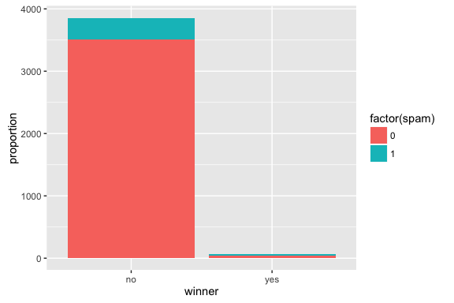
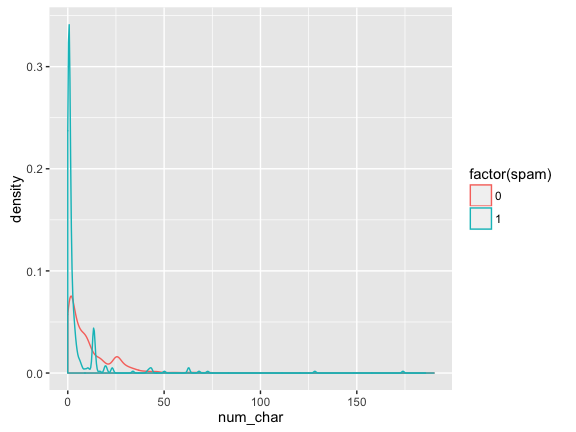
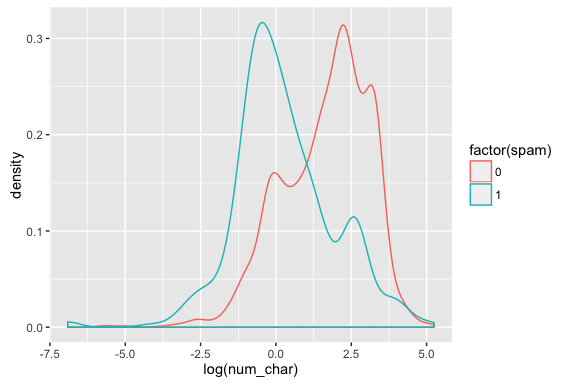

# MATH 141
Chester Ismay  


## Review:  The geometry of regression models {.build}

- When you have two continuous predictors $x_1$, $x_2$, then your mean function
is 

*a plane*.

- When you have two continuous predictors $x_1$, $x_2$, and a categorical 
predictor $x_3$, then your mean function represents 

*parallel planes*.

- When you add in interaction effects, the planes become 

*tilted*.

## Model 2: Food + Decor + East {.smaller}


```r
m2 <- lm(Price ~ Food + Decor + East, data = nyc)
summary(m2)
```

```
## 
## Call:
## lm(formula = Price ~ Food + Decor + East, data = nyc)
## 
## Residuals:
##     Min      1Q  Median      3Q     Max 
## -14.045  -3.881   0.039   3.392  17.756 
## 
## Coefficients:
##             Estimate Std. Error t value Pr(>|t|)    
## (Intercept)  -24.027      4.673   -5.14  7.7e-07 ***
## Food           1.536      0.263    5.84  2.8e-08 ***
## Decor          1.909      0.190   10.05  < 2e-16 ***
## East           2.067      0.932    2.22    0.028 *  
## ---
## Signif. codes:  0 '***' 0.001 '**' 0.01 '*' 0.05 '.' 0.1 ' ' 1
## 
## Residual standard error: 5.72 on 164 degrees of freedom
## Multiple R-squared:  0.628,	Adjusted R-squared:  0.621 
## F-statistic: 92.2 on 3 and 164 DF,  p-value: <2e-16
```


## Model 3: Food + Decor + East + Decor:East {.smaller}


```r
m3 <- lm(Price ~ Food + Decor + East + Decor:East, data = nyc)
summary(m3)
```

```
## 
## Call:
## lm(formula = Price ~ Food + Decor + East + Decor:East, data = nyc)
## 
## Residuals:
##     Min      1Q  Median      3Q     Max 
## -13.785  -3.665   0.378   3.729  17.636 
## 
## Coefficients:
##             Estimate Std. Error t value Pr(>|t|)    
## (Intercept)  -29.397      6.377   -4.61  8.1e-06 ***
## Food           1.663      0.282    5.90  2.1e-08 ***
## Decor          2.070      0.230    9.01  5.4e-16 ***
## East           9.662      6.218    1.55     0.12    
## Decor:East    -0.435      0.352   -1.24     0.22    
## ---
## Signif. codes:  0 '***' 0.001 '**' 0.01 '*' 0.05 '.' 0.1 ' ' 1
## 
## Residual standard error: 5.71 on 163 degrees of freedom
## Multiple R-squared:  0.631,	Adjusted R-squared:  0.622 
## F-statistic: 69.8 on 4 and 163 DF,  p-value: <2e-16
```


## 3D plot

<script>CanvasMatrix4=function(m){if(typeof m=='object'){if("length"in m&&m.length>=16){this.load(m[0],m[1],m[2],m[3],m[4],m[5],m[6],m[7],m[8],m[9],m[10],m[11],m[12],m[13],m[14],m[15]);return}else if(m instanceof CanvasMatrix4){this.load(m);return}}this.makeIdentity()};CanvasMatrix4.prototype.load=function(){if(arguments.length==1&&typeof arguments[0]=='object'){var matrix=arguments[0];if("length"in matrix&&matrix.length==16){this.m11=matrix[0];this.m12=matrix[1];this.m13=matrix[2];this.m14=matrix[3];this.m21=matrix[4];this.m22=matrix[5];this.m23=matrix[6];this.m24=matrix[7];this.m31=matrix[8];this.m32=matrix[9];this.m33=matrix[10];this.m34=matrix[11];this.m41=matrix[12];this.m42=matrix[13];this.m43=matrix[14];this.m44=matrix[15];return}if(arguments[0]instanceof CanvasMatrix4){this.m11=matrix.m11;this.m12=matrix.m12;this.m13=matrix.m13;this.m14=matrix.m14;this.m21=matrix.m21;this.m22=matrix.m22;this.m23=matrix.m23;this.m24=matrix.m24;this.m31=matrix.m31;this.m32=matrix.m32;this.m33=matrix.m33;this.m34=matrix.m34;this.m41=matrix.m41;this.m42=matrix.m42;this.m43=matrix.m43;this.m44=matrix.m44;return}}this.makeIdentity()};CanvasMatrix4.prototype.getAsArray=function(){return[this.m11,this.m12,this.m13,this.m14,this.m21,this.m22,this.m23,this.m24,this.m31,this.m32,this.m33,this.m34,this.m41,this.m42,this.m43,this.m44]};CanvasMatrix4.prototype.getAsWebGLFloatArray=function(){return new WebGLFloatArray(this.getAsArray())};CanvasMatrix4.prototype.makeIdentity=function(){this.m11=1;this.m12=0;this.m13=0;this.m14=0;this.m21=0;this.m22=1;this.m23=0;this.m24=0;this.m31=0;this.m32=0;this.m33=1;this.m34=0;this.m41=0;this.m42=0;this.m43=0;this.m44=1};CanvasMatrix4.prototype.transpose=function(){var tmp=this.m12;this.m12=this.m21;this.m21=tmp;tmp=this.m13;this.m13=this.m31;this.m31=tmp;tmp=this.m14;this.m14=this.m41;this.m41=tmp;tmp=this.m23;this.m23=this.m32;this.m32=tmp;tmp=this.m24;this.m24=this.m42;this.m42=tmp;tmp=this.m34;this.m34=this.m43;this.m43=tmp};CanvasMatrix4.prototype.invert=function(){var det=this._determinant4x4();if(Math.abs(det)<1e-8)return null;this._makeAdjoint();this.m11/=det;this.m12/=det;this.m13/=det;this.m14/=det;this.m21/=det;this.m22/=det;this.m23/=det;this.m24/=det;this.m31/=det;this.m32/=det;this.m33/=det;this.m34/=det;this.m41/=det;this.m42/=det;this.m43/=det;this.m44/=det};CanvasMatrix4.prototype.translate=function(x,y,z){if(x==undefined)x=0;if(y==undefined)y=0;if(z==undefined)z=0;var matrix=new CanvasMatrix4();matrix.m41=x;matrix.m42=y;matrix.m43=z;this.multRight(matrix)};CanvasMatrix4.prototype.scale=function(x,y,z){if(x==undefined)x=1;if(z==undefined){if(y==undefined){y=x;z=x}else z=1}else if(y==undefined)y=x;var matrix=new CanvasMatrix4();matrix.m11=x;matrix.m22=y;matrix.m33=z;this.multRight(matrix)};CanvasMatrix4.prototype.rotate=function(angle,x,y,z){angle=angle/180*Math.PI;angle/=2;var sinA=Math.sin(angle);var cosA=Math.cos(angle);var sinA2=sinA*sinA;var length=Math.sqrt(x*x+y*y+z*z);if(length==0){x=0;y=0;z=1}else if(length!=1){x/=length;y/=length;z/=length}var mat=new CanvasMatrix4();if(x==1&&y==0&&z==0){mat.m11=1;mat.m12=0;mat.m13=0;mat.m21=0;mat.m22=1-2*sinA2;mat.m23=2*sinA*cosA;mat.m31=0;mat.m32=-2*sinA*cosA;mat.m33=1-2*sinA2;mat.m14=mat.m24=mat.m34=0;mat.m41=mat.m42=mat.m43=0;mat.m44=1}else if(x==0&&y==1&&z==0){mat.m11=1-2*sinA2;mat.m12=0;mat.m13=-2*sinA*cosA;mat.m21=0;mat.m22=1;mat.m23=0;mat.m31=2*sinA*cosA;mat.m32=0;mat.m33=1-2*sinA2;mat.m14=mat.m24=mat.m34=0;mat.m41=mat.m42=mat.m43=0;mat.m44=1}else if(x==0&&y==0&&z==1){mat.m11=1-2*sinA2;mat.m12=2*sinA*cosA;mat.m13=0;mat.m21=-2*sinA*cosA;mat.m22=1-2*sinA2;mat.m23=0;mat.m31=0;mat.m32=0;mat.m33=1;mat.m14=mat.m24=mat.m34=0;mat.m41=mat.m42=mat.m43=0;mat.m44=1}else{var x2=x*x;var y2=y*y;var z2=z*z;mat.m11=1-2*(y2+z2)*sinA2;mat.m12=2*(x*y*sinA2+z*sinA*cosA);mat.m13=2*(x*z*sinA2-y*sinA*cosA);mat.m21=2*(y*x*sinA2-z*sinA*cosA);mat.m22=1-2*(z2+x2)*sinA2;mat.m23=2*(y*z*sinA2+x*sinA*cosA);mat.m31=2*(z*x*sinA2+y*sinA*cosA);mat.m32=2*(z*y*sinA2-x*sinA*cosA);mat.m33=1-2*(x2+y2)*sinA2;mat.m14=mat.m24=mat.m34=0;mat.m41=mat.m42=mat.m43=0;mat.m44=1}this.multRight(mat)};CanvasMatrix4.prototype.multRight=function(mat){var m11=(this.m11*mat.m11+this.m12*mat.m21+this.m13*mat.m31+this.m14*mat.m41);var m12=(this.m11*mat.m12+this.m12*mat.m22+this.m13*mat.m32+this.m14*mat.m42);var m13=(this.m11*mat.m13+this.m12*mat.m23+this.m13*mat.m33+this.m14*mat.m43);var m14=(this.m11*mat.m14+this.m12*mat.m24+this.m13*mat.m34+this.m14*mat.m44);var m21=(this.m21*mat.m11+this.m22*mat.m21+this.m23*mat.m31+this.m24*mat.m41);var m22=(this.m21*mat.m12+this.m22*mat.m22+this.m23*mat.m32+this.m24*mat.m42);var m23=(this.m21*mat.m13+this.m22*mat.m23+this.m23*mat.m33+this.m24*mat.m43);var m24=(this.m21*mat.m14+this.m22*mat.m24+this.m23*mat.m34+this.m24*mat.m44);var m31=(this.m31*mat.m11+this.m32*mat.m21+this.m33*mat.m31+this.m34*mat.m41);var m32=(this.m31*mat.m12+this.m32*mat.m22+this.m33*mat.m32+this.m34*mat.m42);var m33=(this.m31*mat.m13+this.m32*mat.m23+this.m33*mat.m33+this.m34*mat.m43);var m34=(this.m31*mat.m14+this.m32*mat.m24+this.m33*mat.m34+this.m34*mat.m44);var m41=(this.m41*mat.m11+this.m42*mat.m21+this.m43*mat.m31+this.m44*mat.m41);var m42=(this.m41*mat.m12+this.m42*mat.m22+this.m43*mat.m32+this.m44*mat.m42);var m43=(this.m41*mat.m13+this.m42*mat.m23+this.m43*mat.m33+this.m44*mat.m43);var m44=(this.m41*mat.m14+this.m42*mat.m24+this.m43*mat.m34+this.m44*mat.m44);this.m11=m11;this.m12=m12;this.m13=m13;this.m14=m14;this.m21=m21;this.m22=m22;this.m23=m23;this.m24=m24;this.m31=m31;this.m32=m32;this.m33=m33;this.m34=m34;this.m41=m41;this.m42=m42;this.m43=m43;this.m44=m44};CanvasMatrix4.prototype.multLeft=function(mat){var m11=(mat.m11*this.m11+mat.m12*this.m21+mat.m13*this.m31+mat.m14*this.m41);var m12=(mat.m11*this.m12+mat.m12*this.m22+mat.m13*this.m32+mat.m14*this.m42);var m13=(mat.m11*this.m13+mat.m12*this.m23+mat.m13*this.m33+mat.m14*this.m43);var m14=(mat.m11*this.m14+mat.m12*this.m24+mat.m13*this.m34+mat.m14*this.m44);var m21=(mat.m21*this.m11+mat.m22*this.m21+mat.m23*this.m31+mat.m24*this.m41);var m22=(mat.m21*this.m12+mat.m22*this.m22+mat.m23*this.m32+mat.m24*this.m42);var m23=(mat.m21*this.m13+mat.m22*this.m23+mat.m23*this.m33+mat.m24*this.m43);var m24=(mat.m21*this.m14+mat.m22*this.m24+mat.m23*this.m34+mat.m24*this.m44);var m31=(mat.m31*this.m11+mat.m32*this.m21+mat.m33*this.m31+mat.m34*this.m41);var m32=(mat.m31*this.m12+mat.m32*this.m22+mat.m33*this.m32+mat.m34*this.m42);var m33=(mat.m31*this.m13+mat.m32*this.m23+mat.m33*this.m33+mat.m34*this.m43);var m34=(mat.m31*this.m14+mat.m32*this.m24+mat.m33*this.m34+mat.m34*this.m44);var m41=(mat.m41*this.m11+mat.m42*this.m21+mat.m43*this.m31+mat.m44*this.m41);var m42=(mat.m41*this.m12+mat.m42*this.m22+mat.m43*this.m32+mat.m44*this.m42);var m43=(mat.m41*this.m13+mat.m42*this.m23+mat.m43*this.m33+mat.m44*this.m43);var m44=(mat.m41*this.m14+mat.m42*this.m24+mat.m43*this.m34+mat.m44*this.m44);this.m11=m11;this.m12=m12;this.m13=m13;this.m14=m14;this.m21=m21;this.m22=m22;this.m23=m23;this.m24=m24;this.m31=m31;this.m32=m32;this.m33=m33;this.m34=m34;this.m41=m41;this.m42=m42;this.m43=m43;this.m44=m44};CanvasMatrix4.prototype.ortho=function(left,right,bottom,top,near,far){var tx=(left+right)/(left-right);var ty=(top+bottom)/(top-bottom);var tz=(far+near)/(far-near);var matrix=new CanvasMatrix4();matrix.m11=2/(left-right);matrix.m12=0;matrix.m13=0;matrix.m14=0;matrix.m21=0;matrix.m22=2/(top-bottom);matrix.m23=0;matrix.m24=0;matrix.m31=0;matrix.m32=0;matrix.m33=-2/(far-near);matrix.m34=0;matrix.m41=tx;matrix.m42=ty;matrix.m43=tz;matrix.m44=1;this.multRight(matrix)};CanvasMatrix4.prototype.frustum=function(left,right,bottom,top,near,far){var matrix=new CanvasMatrix4();var A=(right+left)/(right-left);var B=(top+bottom)/(top-bottom);var C=-(far+near)/(far-near);var D=-(2*far*near)/(far-near);matrix.m11=(2*near)/(right-left);matrix.m12=0;matrix.m13=0;matrix.m14=0;matrix.m21=0;matrix.m22=2*near/(top-bottom);matrix.m23=0;matrix.m24=0;matrix.m31=A;matrix.m32=B;matrix.m33=C;matrix.m34=-1;matrix.m41=0;matrix.m42=0;matrix.m43=D;matrix.m44=0;this.multRight(matrix)};CanvasMatrix4.prototype.perspective=function(fovy,aspect,zNear,zFar){var top=Math.tan(fovy*Math.PI/360)*zNear;var bottom=-top;var left=aspect*bottom;var right=aspect*top;this.frustum(left,right,bottom,top,zNear,zFar)};CanvasMatrix4.prototype.lookat=function(eyex,eyey,eyez,centerx,centery,centerz,upx,upy,upz){var matrix=new CanvasMatrix4();var zx=eyex-centerx;var zy=eyey-centery;var zz=eyez-centerz;var mag=Math.sqrt(zx*zx+zy*zy+zz*zz);if(mag){zx/=mag;zy/=mag;zz/=mag}var yx=upx;var yy=upy;var yz=upz;xx=yy*zz-yz*zy;xy=-yx*zz+yz*zx;xz=yx*zy-yy*zx;yx=zy*xz-zz*xy;yy=-zx*xz+zz*xx;yx=zx*xy-zy*xx;mag=Math.sqrt(xx*xx+xy*xy+xz*xz);if(mag){xx/=mag;xy/=mag;xz/=mag}mag=Math.sqrt(yx*yx+yy*yy+yz*yz);if(mag){yx/=mag;yy/=mag;yz/=mag}matrix.m11=xx;matrix.m12=xy;matrix.m13=xz;matrix.m14=0;matrix.m21=yx;matrix.m22=yy;matrix.m23=yz;matrix.m24=0;matrix.m31=zx;matrix.m32=zy;matrix.m33=zz;matrix.m34=0;matrix.m41=0;matrix.m42=0;matrix.m43=0;matrix.m44=1;matrix.translate(-eyex,-eyey,-eyez);this.multRight(matrix)};CanvasMatrix4.prototype._determinant2x2=function(a,b,c,d){return a*d-b*c};CanvasMatrix4.prototype._determinant3x3=function(a1,a2,a3,b1,b2,b3,c1,c2,c3){return a1*this._determinant2x2(b2,b3,c2,c3)-b1*this._determinant2x2(a2,a3,c2,c3)+c1*this._determinant2x2(a2,a3,b2,b3)};CanvasMatrix4.prototype._determinant4x4=function(){var a1=this.m11;var b1=this.m12;var c1=this.m13;var d1=this.m14;var a2=this.m21;var b2=this.m22;var c2=this.m23;var d2=this.m24;var a3=this.m31;var b3=this.m32;var c3=this.m33;var d3=this.m34;var a4=this.m41;var b4=this.m42;var c4=this.m43;var d4=this.m44;return a1*this._determinant3x3(b2,b3,b4,c2,c3,c4,d2,d3,d4)-b1*this._determinant3x3(a2,a3,a4,c2,c3,c4,d2,d3,d4)+c1*this._determinant3x3(a2,a3,a4,b2,b3,b4,d2,d3,d4)-d1*this._determinant3x3(a2,a3,a4,b2,b3,b4,c2,c3,c4)};CanvasMatrix4.prototype._makeAdjoint=function(){var a1=this.m11;var b1=this.m12;var c1=this.m13;var d1=this.m14;var a2=this.m21;var b2=this.m22;var c2=this.m23;var d2=this.m24;var a3=this.m31;var b3=this.m32;var c3=this.m33;var d3=this.m34;var a4=this.m41;var b4=this.m42;var c4=this.m43;var d4=this.m44;this.m11=this._determinant3x3(b2,b3,b4,c2,c3,c4,d2,d3,d4);this.m21=-this._determinant3x3(a2,a3,a4,c2,c3,c4,d2,d3,d4);this.m31=this._determinant3x3(a2,a3,a4,b2,b3,b4,d2,d3,d4);this.m41=-this._determinant3x3(a2,a3,a4,b2,b3,b4,c2,c3,c4);this.m12=-this._determinant3x3(b1,b3,b4,c1,c3,c4,d1,d3,d4);this.m22=this._determinant3x3(a1,a3,a4,c1,c3,c4,d1,d3,d4);this.m32=-this._determinant3x3(a1,a3,a4,b1,b3,b4,d1,d3,d4);this.m42=this._determinant3x3(a1,a3,a4,b1,b3,b4,c1,c3,c4);this.m13=this._determinant3x3(b1,b2,b4,c1,c2,c4,d1,d2,d4);this.m23=-this._determinant3x3(a1,a2,a4,c1,c2,c4,d1,d2,d4);this.m33=this._determinant3x3(a1,a2,a4,b1,b2,b4,d1,d2,d4);this.m43=-this._determinant3x3(a1,a2,a4,b1,b2,b4,c1,c2,c4);this.m14=-this._determinant3x3(b1,b2,b3,c1,c2,c3,d1,d2,d3);this.m24=this._determinant3x3(a1,a2,a3,c1,c2,c3,d1,d2,d3);this.m34=-this._determinant3x3(a1,a2,a3,b1,b2,b3,d1,d2,d3);this.m44=this._determinant3x3(a1,a2,a3,b1,b2,b3,c1,c2,c3)}</script>
<script>
rglwidgetClass = function() {
this.canvas = null;
this.userMatrix = new CanvasMatrix4();
this.types = [];
this.prMatrix = new CanvasMatrix4();
this.mvMatrix = new CanvasMatrix4();
this.vp = null;
this.prmvMatrix = null;
this.origs = null;
this.gl = null;
this.scene = null;
};
(function() {
this.multMV = function(M, v) {
return [ M.m11 * v[0] + M.m12 * v[1] + M.m13 * v[2] + M.m14 * v[3],
M.m21 * v[0] + M.m22 * v[1] + M.m23 * v[2] + M.m24 * v[3],
M.m31 * v[0] + M.m32 * v[1] + M.m33 * v[2] + M.m34 * v[3],
M.m41 * v[0] + M.m42 * v[1] + M.m43 * v[2] + M.m44 * v[3]
];
};
this.vlen = function(v) {
return Math.sqrt(this.dotprod(v, v));
};
this.dotprod = function(a, b) {
return a[0]*b[0] + a[1]*b[1] + a[2]*b[2];
}
this.xprod = function(a, b) {
return [a[1]*b[2] - a[2]*b[1],
a[2]*b[0] - a[0]*b[2],
a[0]*b[1] - a[1]*b[0]];
};
this.cbind = function(a, b) {
return a.map(function(currentValue, index, array) {
return currentValue.concat(b[index]);
});
};
this.swap = function(a, i, j) {
var temp = a[i];
a[i] = a[j];
a[j] = temp;
};
this.flatten = function(a) {
return [].concat.apply([], a);
};
/* set element of 1d or 2d array as if it was flattened.  Column major, zero based! */
this.setElement = function(a, i, value) {
if (Array.isArray(a[0])) {
var dim = a.length,
col = Math.floor(i/dim),
row = i % dim;
a[row][col] = value;
} else {
a[i] = value;
}
};
this.transpose = function(a) {
var newArray = [],
n = a.length,
m = a[0].length,
i;
for(i = 0; i < m; i++){
newArray.push([]);
}
for(i = 0; i < n; i++){
for(var j = 0; j < m; j++){
newArray[j].push(a[i][j]);
}
}
return newArray;
};
this.sumsq = function(x) {
var result = 0, i;
for (i=0; i < x.length; i++)
result += x[i]*x[i];
return result;
};
this.toCanvasMatrix4 = function(mat) {
if (mat instanceof CanvasMatrix4)
return mat;
var result = new CanvasMatrix4();
mat = this.flatten(this.transpose(mat));
result.load(mat);
return result;
};
this.stringToRgb = function(s) {
s = s.replace("#", "");
var bigint = parseInt(s, 16);
return [((bigint >> 16) & 255)/255,
((bigint >> 8) & 255)/255,
(bigint & 255)/255];
};
this.componentProduct = function(x, y) {
if (typeof y === "undefined") {
this.alertOnce("Bad arg to componentProduct");
}
var result = new Float32Array(3), i;
for (i = 0; i<3; i++)
result[i] = x[i]*y[i];
return result;
};
this.getPowerOfTwo = function(value) {
var pow = 1;
while(pow<value) {
pow *= 2;
}
return pow;
};
this.unique = function(arr) {
arr = [].concat(arr);
return arr.filter(function(value, index, self) {
return self.indexOf(value) === index;
});
};
this.repeatToLen = function(arr, len) {
arr = [].concat(arr);
while (arr.length < len/2)
arr = arr.concat(arr);
return arr.concat(arr.slice(0, len - arr.length));
};
this.alertOnce = function(msg) {
if (typeof this.alerted !== "undefined")
return;
this.alerted = true;
alert(msg);
};
this.f_is_lit = 1;
this.f_is_smooth = 2;
this.f_has_texture = 4;
this.f_is_indexed = 8;
this.f_depth_sort = 16;
this.f_fixed_quads = 32;
this.f_is_transparent = 64;
this.f_is_lines = 128;
this.f_sprites_3d = 256;
this.f_sprite_3d = 512;
this.f_is_subscene = 1024;
this.f_is_clipplanes = 2048;
this.whichList = function(id) {
var obj = this.getObj(id),
flags = obj.flags;
if (obj.type === "light")
return "lights";
if (flags & this.f_is_subscene)
return "subscenes";
if (flags & this.f_is_clipplanes)
return "clipplanes";
if (flags & this.f_is_transparent)
return "transparent";
return "opaque";
};
this.getObj = function(id) {
if (typeof id !== "number") {
this.alertOnce("getObj id is "+typeof id);
}
return this.scene.objects[id];
};
this.getIdsByType = function(type, subscene) {
var
result = [], i, self = this;
if (typeof subscene === "undefined") {
Object.keys(this.scene.objects).forEach(
function(key) {
key = parseInt(key, 10);
if (self.getObj(key).type === type)
result.push(key);
});
} else {
ids = this.getObj(subscene).objects;
for (i=0; i < ids.length; i++) {
if (this.getObj(ids[i]).type === type) {
result.push(ids[i]);
}
}
}
return result;
};
this.getMaterial = function(id, property) {
var obj = this.getObj(id),
mat = obj.material[property];
if (typeof mat === "undefined")
mat = this.scene.material[property];
return mat;
};
this.inSubscene = function(id, subscene) {
return this.getObj(subscene).objects.indexOf(id) > -1;
};
this.addToSubscene = function(id, subscene) {
var thelist,
thesub = this.getObj(subscene),
ids = [id],
obj = this.getObj(id), i;
if (typeof obj.newIds !== "undefined") {
ids = ids.concat(obj.newIds);
}
for (i = 0; i < ids.length; i++) {
id = ids[i];
if (thesub.objects.indexOf(id) == -1) {
thelist = this.whichList(id);
thesub.objects.push(id);
thesub[thelist].push(id);
}
}
};
this.delFromSubscene = function(id, subscene) {
var thelist,
thesub = this.getObj(subscene),
obj = this.getObj(id),
ids = [id], i, newIds;
if (typeof obj.newIds !== "undefined")
ids = ids.concat(obj.newIds);
for (j=0; j<ids.length;j++) {
id = ids[j];
i = thesub.objects.indexOf(id);
if (i > -1) {
thesub.objects.splice(i, 1);
thelist = this.whichList(id);
i = thesub[thelist].indexOf(id);
thesub[thelist].splice(i, 1);
}
}
};
this.setSubsceneEntries = function(ids, subsceneid) {
var sub = this.getObj(subsceneid);
sub.objects = ids;
this.initSubscene(subsceneid);
};
this.getSubsceneEntries = function(subscene) {
return this.getObj(subscene).objects;
};
this.getChildSubscenes = function(subscene) {
return this.getObj(subscene).subscenes;
};
this.getVertexShader = function(id) {
var obj = this.getObj(id),
flags = obj.flags,
type = obj.type,
is_lit = flags & this.f_is_lit,
has_texture = flags & this.f_has_texture,
fixed_quads = flags & this.f_fixed_quads,
sprites_3d = flags & this.f_sprites_3d,
sprite_3d = flags & this.f_sprite_3d,
nclipplanes = this.countClipplanes(),
result;
if (type === "clipplanes" || sprites_3d) return;
result = "	/* ****** "+type+" object "+id+" vertex shader ****** */\n"+
"	attribute vec3 aPos;\n"+
"	attribute vec4 aCol;\n"+
" uniform mat4 mvMatrix;\n"+
" uniform mat4 prMatrix;\n"+
" varying vec4 vCol;\n"+
" varying vec4 vPosition;\n";
if (is_lit && !fixed_quads)
result = result + "	attribute vec3 aNorm;\n"+
" uniform mat4 normMatrix;\n"+
" varying vec3 vNormal;\n";
if (has_texture || type === "text")
result = result + " attribute vec2 aTexcoord;\n"+
" varying vec2 vTexcoord;\n";
if (type === "text")
result = result + "	uniform vec2 textScale;\n";
if (fixed_quads)
result = result + "	attribute vec2 aOfs;\n";
else if (sprite_3d)
result = result + "	uniform vec3 uOrig;\n"+
" uniform float uSize;\n"+
" uniform mat4 usermat;\n";
result = result + "	void main(void) {\n";
if (nclipplanes || (!fixed_quads && !sprite_3d))
result = result + "	  vPosition = mvMatrix * vec4(aPos, 1.);\n";
if (!fixed_quads && !sprite_3d)
result = result + "	  gl_Position = prMatrix * vPosition;\n";
if (type == "points") {
var size = this.getMaterial(id, "size");
result = result + "	  gl_PointSize = "+size.toFixed(1)+";\n";
}
result = result + "	  vCol = aCol;\n";
if (is_lit && !fixed_quads && !sprite_3d)
result = result + "	  vNormal = normalize((normMatrix * vec4(aNorm, 1.)).xyz);\n";
if (has_texture || type === "text")
result = result + "	  vTexcoord = aTexcoord;\n";
if (type == "text")
result = result + "	  vec4 pos = prMatrix * mvMatrix * vec4(aPos, 1.);\n"+
"   pos = pos/pos.w;\n"+
"   gl_Position = pos + vec4(aOfs*textScale, 0.,0.);\n";
if (type == "sprites")
result = result + "	  vec4 pos = mvMatrix * vec4(aPos, 1.);\n"+
"   pos = pos/pos.w + vec4(aOfs, 0., 0.);\n"+
"   gl_Position = prMatrix*pos;\n";
if (sprite_3d)
result = result + "	  vNormal = normalize((normMatrix * vec4(aNorm, 1.)).xyz);\n"+
"   vec4 pos = mvMatrix * vec4(uOrig, 1.);\n"+
"   vPosition = pos/pos.w + vec4(uSize*(vec4(aPos, 1.)*usermat).xyz,0.);\n"+
"   gl_Position = prMatrix * vPosition;\n";
result = result + "	}\n";
return result;
};
this.getFragmentShader = function(id) {
var obj = this.getObj(id),
flags = obj.flags,
type = obj.type,
is_lit = flags & this.f_is_lit,
has_texture = flags & this.f_has_texture,
fixed_quads = flags & this.f_fixed_quads,
sprites_3d = flags & this.f_sprites_3d,
nclipplanes = this.countClipplanes(), i,
texture_format, nlights,
result;
if (type === "clipplanes" || sprites_3d) return;
if (has_texture)
texture_format = this.getMaterial(id, "textype");
result = "/* ****** "+type+" object "+id+" fragment shader ****** */\n"+
"#ifdef GL_ES\n"+
"  precision highp float;\n"+
"#endif\n"+
"  varying vec4 vCol; // carries alpha\n"+
"  varying vec4 vPosition;\n";
if (has_texture || type === "text")
result = result + "	varying vec2 vTexcoord;\n"+
" uniform sampler2D uSampler;\n";
if (is_lit && !fixed_quads)
result = result + "	varying vec3 vNormal;\n";
for (i = 0; i < nclipplanes; i++)
result = result + "	uniform vec4 vClipplane"+i+";\n";
if (is_lit) {
nlights = this.countLights();
if (nlights)
result = result + "	uniform mat4 mvMatrix;\n";
else
is_lit = false;
}
if (is_lit) {
result = result + "	  uniform vec3 emission;\n"+
"   uniform float shininess;\n";
for (i=0; i < nlights; i++) {
result = result + "	  uniform vec3 ambient" + i + ";\n"+
"   uniform vec3 specular" + i +"; // light*material\n"+
"   uniform vec3 diffuse" + i + ";\n"+
"   uniform vec3 lightDir" + i + ";\n"+
"   uniform bool viewpoint" + i + ";\n"+
"   uniform bool finite" + i + ";\n";
}
}
result = result + "	void main(void) {\n";
for (i=0; i < nclipplanes;i++)
result = result + "	  if (dot(vPosition, vClipplane"+i+") < 0.0) discard;\n";
if (is_lit) {
result = result + "	  vec3 eye = normalize(-vPosition.xyz);\n"+
"   vec3 lightdir;\n"+
"   vec4 colDiff;\n"+
"   vec3 halfVec;\n"+
"   vec4 lighteffect = vec4(emission, 0.);\n"+
"   vec3 col;\n"+
"   float nDotL;\n";
if (fixed_quads) {
result = result +   "	  vec3 n = vec3(0., 0., 1.);\n";
}
else {
result = result +   "	  vec3 n = normalize(vNormal);\n"+
"   n = -faceforward(n, n, eye);\n";
}
for (i=0; i < nlights; i++) {
result = result + "   colDiff = vec4(vCol.rgb * diffuse" + i + ", vCol.a);\n"+
"   lightdir = lightDir" + i + ";\n"+
"   if (!viewpoint" + i +")\n"+
"     lightdir = (mvMatrix * vec4(lightdir, 1.)).xyz;\n"+
"   if (!finite" + i + ") {\n"+
"     halfVec = normalize(lightdir + eye);\n"+
"   } else {\n"+
"     lightdir = normalize(lightdir - vPosition.xyz);\n"+
"     halfVec = normalize(lightdir + eye);\n"+
"   }\n"+
"	  col = ambient" + i + ";\n"+
"   nDotL = dot(n, lightdir);\n"+
"   col = col + max(nDotL, 0.) * colDiff.rgb;\n"+
"   col = col + pow(max(dot(halfVec, n), 0.), shininess) * specular" + i + ";\n"+
"   lighteffect = lighteffect + vec4(col, colDiff.a);\n";
}
} else {
result = result +   "   vec4 colDiff = vCol;\n"+
"	  vec4 lighteffect = colDiff;\n";
}
if ((has_texture && texture_format === "rgba") || type === "text")
result = result +   "	  vec4 textureColor = lighteffect*texture2D(uSampler, vTexcoord);\n";
if (has_texture) {
result = result + {
rgb:            "   vec4 textureColor = lighteffect*vec4(texture2D(uSampler, vTexcoord).rgb, 1.);\n",
alpha:          "   vec4 textureColor = texture2D(uSampler, vTexcoord);\n"+
"   float luminance = dot(vec3(1.,1.,1.), textureColor.rgb)/3.;\n"+
"   textureColor =  vec4(lighteffect.rgb, lighteffect.a*luminance);\n",
luminance:      "   vec4 textureColor = vec4(lighteffect.rgb*dot(texture2D(uSampler, vTexcoord).rgb, vec3(1.,1.,1.))/3., lighteffect.a);\n",
"luminance.alpha":"	  vec4 textureColor = texture2D(uSampler, vTexcoord);\n"+
"   float luminance = dot(vec3(1.,1.,1.),textureColor.rgb)/3.;\n"+
"   textureColor = vec4(lighteffect.rgb*luminance, lighteffect.a*textureColor.a);\n"
}[texture_format]+
"   gl_FragColor = textureColor;\n";
} else if (type === "text") {
result = result +   "	  if (textureColor.a < 0.1)\n"+
"     discard;\n"+
"   else\n"+
"     gl_FragColor = textureColor;\n";
} else
result = result +   "   gl_FragColor = lighteffect;\n";
result = result + "	}\n";
return result;
};
this.getShader = function(shaderType, code) {
var gl = this.gl, shader;
shader = gl.createShader(shaderType);
gl.shaderSource(shader, code);
gl.compileShader(shader);
if (gl.getShaderParameter(shader, gl.COMPILE_STATUS) === 0)
alert(gl.getShaderInfoLog(shader));
return shader;
};
this.handleLoadedTexture = function(texture, textureCanvas) {
var gl = this.gl;
gl.pixelStorei(gl.UNPACK_FLIP_Y_WEBGL, true);
gl.bindTexture(gl.TEXTURE_2D, texture);
gl.texImage2D(gl.TEXTURE_2D, 0, gl.RGBA, gl.RGBA, gl.UNSIGNED_BYTE, textureCanvas);
gl.texParameteri(gl.TEXTURE_2D, gl.TEXTURE_MAG_FILTER, gl.LINEAR);
gl.texParameteri(gl.TEXTURE_2D, gl.TEXTURE_MIN_FILTER, gl.LINEAR_MIPMAP_NEAREST);
gl.generateMipmap(gl.TEXTURE_2D);
gl.bindTexture(gl.TEXTURE_2D, null);
};
this.loadImageToTexture = function(uri, texture) {
var canvas = this.textureCanvas,
ctx = canvas.getContext("2d"),
image = new Image(),
self = this;
image.onload = function() {
var w = image.width,
h = image.height,
canvasX = self.getPowerOfTwo(w),
canvasY = self.getPowerOfTwo(h),
gl = self.gl,
maxTexSize = gl.getParameter(gl.MAX_TEXTURE_SIZE);
if (maxTexSize > 4096) maxTexSize = 4096;
while (canvasX > 1 && canvasY > 1 && (canvasX > maxTexSize || canvasY > maxTexSize)) {
canvasX /= 2;
canvasY /= 2;
}
canvas.width = canvasX;
canvas.height = canvasY;
ctx.imageSmoothingEnabled = true;
ctx.drawImage(image, 0, 0, canvasX, canvasY);
self.handleLoadedTexture(texture, canvas);
self.drawScene();
};
image.src = uri;
};
this.drawTextToCanvas = function(text, cex, family, font) {
var canvasX, canvasY,
textY,
scaling = 20,
textColour = "white",
backgroundColour = "rgba(0,0,0,0)",
canvas = this.textureCanvas,
ctx = canvas.getContext("2d"),
i, textHeights = [], widths = [], offset = 0, offsets = [],
fontStrings = [],
getFontString = function(i) {
textHeights[i] = scaling*cex[i];
var fontString = textHeights[i] + "px",
family0 = family[i],
font0 = font[i];
if (family0 === "sans")
family0 = "sans-serif";
else if (family0 === "mono")
family0 = "monospace";
fontString = fontString + " " + family0;
if (font0 === 2 || font0 === 4)
fontString = "bold " + fontString;
if (font0 === 3 || font0 === 4)
fontString = "italic " + fontString;
return fontString;
};
cex = this.repeatToLen(cex, text.length);
family = this.repeatToLen(family, text.length);
font = this.repeatToLen(font, text.length);
canvasX = 1;
for (i = 0; i < text.length; i++)  {
ctx.font = fontStrings[i] = getFontString(i);
widths[i] = ctx.measureText(text[i]).width;
offset = offsets[i] = offset + 2*textHeights[i];
canvasX = (widths[i] > canvasX) ? widths[i] : canvasX;
}
canvasX = this.getPowerOfTwo(canvasX);
canvasY = this.getPowerOfTwo(offset);
canvas.width = canvasX;
canvas.height = canvasY;
ctx.fillStyle = backgroundColour;
ctx.fillRect(0, 0, ctx.canvas.width, ctx.canvas.height);
ctx.textBaseline = "alphabetic";
for(i = 0; i < text.length; i++) {
textY = offsets[i];
ctx.font = fontStrings[i];
ctx.fillStyle = textColour;
ctx.textAlign = "left";
ctx.fillText(text[i], 0,  textY);
}
return {canvasX:canvasX, canvasY:canvasY,
widths:widths, textHeights:textHeights,
offsets:offsets};
};
this.setViewport = function(id) {
var gl = this.gl,
vp = this.getObj(id).par3d.viewport,
x = vp.x*this.canvas.width,
y = vp.y*this.canvas.height,
width = vp.width*this.canvas.width,
height = vp.height*this.canvas.height;
this.vp = {x:x, y:y, width:width, height:height};
gl.viewport(x, y, width, height);
gl.scissor(x, y, width, height);
};
this.setprMatrix = function(id) {
var subscene = this.getObj(id),
embedding = subscene.embeddings.projection;
if (embedding === "replace")
this.prMatrix.makeIdentity();
else
this.setprMatrix(subscene.parent);
if (embedding === "inherit")
return;
// This is based on the Frustum::enclose code from geom.cpp
var bbox = subscene.par3d.bbox,
scale = subscene.par3d.scale,
ranges = [(bbox[1]-bbox[0])*scale[0]/2,
(bbox[3]-bbox[2])*scale[1]/2,
(bbox[5]-bbox[4])*scale[2]/2],
radius = Math.sqrt(this.sumsq(ranges))*1.1; // A bit bigger to handle labels
if (radius <= 0) radius = 1;
var observer = subscene.par3d.observer,
distance = observer[2],
t = Math.tan(subscene.par3d.FOV*Math.PI/360),
near = distance - radius,
far = distance + radius,
hlen = t*near,
aspect = this.vp.width/this.vp.height,
z = subscene.par3d.zoom;
if (aspect > 1)
this.prMatrix.frustum(-hlen*aspect*z, hlen*aspect*z,
-hlen*z, hlen*z, near, far);
else
this.prMatrix.frustum(-hlen*z, hlen*z,
-hlen*z/aspect, hlen*z/aspect,
near, far);
};
this.setmvMatrix = function(id) {
var observer = this.getObj(id).par3d.observer;
this.mvMatrix.makeIdentity();
this.setmodelMatrix(id);
this.mvMatrix.translate(-observer[0], -observer[1], -observer[2]);
};
this.setmodelMatrix = function(id) {
var subscene = this.getObj(id),
embedding = subscene.embeddings.model;
if (embedding !== "inherit") {
var scale = subscene.par3d.scale,
bbox = subscene.par3d.bbox,
center = [(bbox[0]+bbox[1])/2,
(bbox[2]+bbox[3])/2,
(bbox[4]+bbox[5])/2];
this.mvMatrix.translate(-center[0], -center[1], -center[2]);
this.mvMatrix.scale(scale[0], scale[1], scale[2]);
this.mvMatrix.multRight( subscene.par3d.userMatrix );
}
if (embedding !== "replace")
this.setmodelMatrix(subscene.parent);
};
this.setnormMatrix = function(subsceneid) {
var self = this,
recurse = function(id) {
var sub = self.getObj(id),
embedding = sub.embeddings.model;
if (embedding !== "inherit") {
var scale = sub.par3d.scale;
self.normMatrix.scale(1/scale[0], 1/scale[1], 1/scale[2]);
self.normMatrix.multRight(sub.par3d.userMatrix);
}
if (embedding !== "replace")
recurse(sub.parent);
};
self.normMatrix.makeIdentity();
recurse(subsceneid);
};
this.setprmvMatrix = function() {
this.prmvMatrix = new CanvasMatrix4( this.mvMatrix );
this.prmvMatrix.multRight( this.prMatrix );
};
this.countClipplanes = function() {
return this.countObjs("clipplanes");
};
this.countLights = function() {
return this.countObjs("light");
};
this.countObjs = function(type) {
var self = this,
bound = 0;
Object.keys(this.scene.objects).forEach(
function(key) {
if (self.getObj(parseInt(key, 10)).type === type)
bound = bound + 1;
});
return bound;
};
this.initSubscene = function(id) {
var sub = this.getObj(id),
i, obj;
if (sub.type !== "subscene")
return;
sub.par3d.userMatrix = this.toCanvasMatrix4(sub.par3d.userMatrix);
sub.par3d.listeners = [].concat(sub.par3d.listeners);
sub.backgroundId = undefined;
sub.subscenes = [];
sub.clipplanes = [];
sub.transparent = [];
sub.opaque = [];
sub.lights = [];
for (i=0; i < sub.objects.length; i++) {
obj = this.getObj(sub.objects[i]);
if (typeof obj === "undefined") {
sub.objects.splice(i, 1);
i--;
} else if (obj.type === "background")
sub.backgroundId = obj.id;
else
sub[this.whichList(obj.id)].push(obj.id);
}
};
this.copyObj = function(id, reuse) {
var obj = this.getObj(id),
prev = document.getElementById(reuse).rglinstance,
prevobj = prev.getObj(id),
fields = ["flags", "type",
"colors", "vertices", "centers",
"normals", "offsets",
"texts", "cex", "family", "font", "adj",
"material",
"radii",
"texcoords",
"userMatrix", "ids",
"dim",
"par3d", "userMatrix",
"viewpoint", "finite"],
i;
for (i = 0; i < fields.length; i++) {
if (typeof prevobj[fields[i]] !== "undefined")
obj[fields[i]] = prevobj[fields[i]];
}
};
this.planeUpdateTriangles = function(id, bbox) {
var perms = [[0,0,1], [1,2,2], [2,1,0]],
x, xrow, elem, A, d, nhits, i, j, k, u, v, w, intersect, which, v0, v2, vx, reverse,
face1 = [], face2 = [], normals = [],
obj = this.getObj(id),
nPlanes = obj.normals.length;
obj.bbox = bbox;
obj.vertices = [];
obj.initialized = false;
for (elem = 0; elem < nPlanes; elem++) {
//    Vertex Av = normal.getRecycled(elem);
x = [];
A = obj.normals[elem];
d = obj.offsets[elem][0];
nhits = 0;
for (i=0; i<3; i++)
for (j=0; j<2; j++)
for (k=0; k<2; k++) {
u = perms[0][i];
v = perms[1][i];
w = perms[2][i];
if (A[w] != 0.0) {
intersect = -(d + A[u]*bbox[j+2*u] + A[v]*bbox[k+2*v])/A[w];
if (bbox[2*w] < intersect && intersect < bbox[1+2*w]) {
xrow = [];
xrow[u] = bbox[j+2*u];
xrow[v] = bbox[k+2*v];
xrow[w] = intersect;
x.push(xrow);
face1[nhits] = j + 2*u;
face2[nhits] = k + 2*v;
nhits++;
}
}
}
if (nhits > 3) {
/* Re-order the intersections so the triangles work */
for (i=0; i<nhits-2; i++) {
which = 0; /* initialize to suppress warning */
for (j=i+1; j<nhits; j++) {
if (face1[i] == face1[j] || face1[i] == face2[j]
|| face2[i] == face1[j] || face2[i] == face2[j] ) {
which = j;
break;
}
}
if (which > i+1) {
this.swap(x, i+1, which);
this.swap(face1, i+1, which);
this.swap(face2, i+1, which);
}
}
}
if (nhits >= 3) {
/* Put in order so that the normal points out the FRONT of the faces */
v0 = [x[0][0] - x[1][0] , x[0][1] - x[1][1], x[0][2] - x[1][2]];
v2 = [x[2][0] - x[1][0] , x[2][1] - x[1][1], x[2][2] - x[1][2]];
/* cross-product */
vx = this.xprod(v0, v2);
reverse = this.dotprod(vx, A) > 0;
for (i=0; i<nhits-2; i++) {
obj.vertices.push(x[0]);
normals.push(A);
for (j=1; j<3; j++) {
obj.vertices.push(x[i + (reverse ? 3-j : j)]);
normals.push(A);
}
}
}
}
obj.pnormals = normals;
};
this.initObj = function(id) {
var obj = this.getObj(id),
flags = obj.flags,
type = obj.type,
is_indexed = flags & this.f_is_indexed,
is_lit = flags & this.f_is_lit,
has_texture = flags & this.f_has_texture,
fixed_quads = flags & this.f_fixed_quads,
depth_sort = flags & this.f_depth_sort,
sprites_3d = flags & this.f_sprites_3d,
sprite_3d = flags & this.f_sprite_3d,
gl = this.gl,
texinfo, drawtype, nclipplanes, f, frowsize, nrows,
i,j,v, mat, uri, matobj;
if (typeof id !== "number") {
this.alertOnce("initObj id is "+typeof id);
}
obj.initialized = true;
if (type === "background" || type === "bboxdeco" || type === "subscene")
return;
if (type === "light") {
obj.ambient = new Float32Array(obj.colors[0].slice(0,3));
obj.diffuse = new Float32Array(obj.colors[1].slice(0,3));
obj.specular = new Float32Array(obj.colors[2].slice(0,3));
obj.lightDir = new Float32Array(obj.vertices[0]);
return;
}
if (type === "clipplanes") {
obj.vClipplane = this.flatten(this.cbind(obj.normals, obj.offsets));
return;
}
if (!sprites_3d) {
obj.prog = gl.createProgram();
gl.attachShader(obj.prog, this.getShader( gl.VERTEX_SHADER,
this.getVertexShader(id) ));
gl.attachShader(obj.prog, this.getShader( gl.FRAGMENT_SHADER,
this.getFragmentShader(id) ));
//  Force aPos to location 0, aCol to location 1
gl.bindAttribLocation(obj.prog, 0, "aPos");
gl.bindAttribLocation(obj.prog, 1, "aCol");
gl.linkProgram(obj.prog);
var linked = gl.getProgramParameter(obj.prog, gl.LINK_STATUS);
if (!linked) {
// An error occurred while linking
var lastError = gl.getProgramInfoLog(program);
console.warn("Error in program linking:" + lastError);
gl.deleteProgram(program);
}
}
if (type === "text") {
texinfo = this.drawTextToCanvas(obj.texts,
this.flatten(obj.cex),
this.flatten(obj.family),
this.flatten(obj.family));
}
if (fixed_quads && !sprites_3d) {
obj.ofsLoc = gl.getAttribLocation(obj.prog, "aOfs");
}
if (sprite_3d) {
obj.origLoc = gl.getUniformLocation(obj.prog, "uOrig");
obj.sizeLoc = gl.getUniformLocation(obj.prog, "uSize");
obj.usermatLoc = gl.getUniformLocation(obj.prog, "usermat");
}
if (has_texture || type == "text") {
obj.texture = gl.createTexture();
obj.texLoc = gl.getAttribLocation(obj.prog, "aTexcoord");
obj.sampler = gl.getUniformLocation(obj.prog, "uSampler");
}
if (has_texture) {
mat = obj.material;
if (typeof mat.uri !== "undefined")
uri = mat.uri;
else if (typeof mat.uriElementId === "undefined") {
matobj = this.getObj(mat.uriId);
if (typeof matobj !== "undefined") {
uri = matobj.material.uri;
} else {
uri = "";
}
} else
uri = document.getElementById(mat.uriElementId).rglinstance.getObj(mat.uriId).material.uri;
this.loadImageToTexture(uri, obj.texture);
}
if (type === "text") {
this.handleLoadedTexture(obj.texture, this.textureCanvas);
}
v = obj.vertices;
obj.vertexCount = v.length;
if (!obj.vertexCount) return;
var stride = 3, nc, cofs, nofs, radofs, oofs, tofs, vnew, v1;
nc = obj.colorCount = obj.colors.length;
if (nc > 1) {
cofs = stride;
stride = stride + 4;
v = this.cbind(v, obj.colors);
} else {
cofs = -1;
obj.onecolor = this.flatten(obj.colors);
}
if (typeof obj.normals !== "undefined") {
nofs = stride;
stride = stride + 3;
v = this.cbind(v, typeof obj.pnormals !== "undefined" ? obj.pnormals : obj.normals);
} else
nofs = -1;
if (typeof obj.radii !== "undefined") {
radofs = stride;
stride = stride + 1;
if (obj.radii.length === v.length) {
v = this.cbind(v, obj.radii);
} else if (obj.radii.length === 1) {
v = v.map(function(row, i, arr) { return row.concat(obj.radii[0]);});
}
} else
radofs = -1;
if (type == "sprites" && !sprites_3d) {
tofs = stride;
stride += 2;
oofs = stride;
stride += 2;
vnew = new Array(4*v.length);
var size = obj.radii, s = size[0]/2;
for (i=0; i < v.length; i++) {
if (size.length > 1)
s = size[i]/2;
vnew[4*i]  = v[i].concat([0,0,-s,-s]);
vnew[4*i+1]= v[i].concat([1,0, s,-s]);
vnew[4*i+2]= v[i].concat([1,1, s, s]);
vnew[4*i+3]= v[i].concat([0,1,-s, s]);
}
v = vnew;
obj.vertexCount = v.length;
} else if (type === "text") {
tofs = stride;
stride += 2;
oofs = stride;
stride += 2;
vnew = new Array(4*v.length);
for (i=0; i < v.length; i++) {
vnew[4*i]  = v[i].concat([0,-0.5]).concat(obj.adj[0]);
vnew[4*i+1]= v[i].concat([1,-0.5]).concat(obj.adj[0]);
vnew[4*i+2]= v[i].concat([1, 1.5]).concat(obj.adj[0]);
vnew[4*i+3]= v[i].concat([0, 1.5]).concat(obj.adj[0]);
for (j=0; j < 4; j++) {
v1 = vnew[4*i+j];
v1[tofs+2] = 2*(v1[tofs]-v1[tofs+2])*texinfo.widths[i];
v1[tofs+3] = 2*(v1[tofs+1]-v1[tofs+3])*texinfo.textHeights[i];
v1[tofs] *= texinfo.widths[i]/texinfo.canvasX;
v1[tofs+1] = 1.0-(texinfo.offsets[i] -
v1[tofs+1]*texinfo.textHeights[i])/texinfo.canvasY;
vnew[4*i+j] = v1;
}
}
v = vnew;
obj.vertexCount = v.length;
} else if (typeof obj.texcoords !== "undefined") {
tofs = stride;
stride += 2;
oofs = -1;
v = this.cbind(v, obj.texcoords);
} else {
tofs = -1;
oofs = -1;
}
if (stride !== v[0].length) {
this.alertOnce("problem in stride calculation");
}
obj.vOffsets = {vofs:0, cofs:cofs, nofs:nofs, radofs:radofs, oofs:oofs, tofs:tofs, stride:stride};
obj.values = new Float32Array(this.flatten(v));
if (sprites_3d) {
obj.userMatrix = new CanvasMatrix4(obj.userMatrix);
obj.objects = this.flatten([].concat(obj.ids));
is_lit = false;
}
if (is_lit && !fixed_quads) {
obj.normLoc = gl.getAttribLocation(obj.prog, "aNorm");
}
nclipplanes = this.countClipplanes();
if (nclipplanes && !sprites_3d) {
obj.clipLoc = [];
for (i=0; i < nclipplanes; i++)
obj.clipLoc[i] = gl.getUniformLocation(obj.prog,"vClipplane" + i);
}
if (is_lit) {
obj.emissionLoc = gl.getUniformLocation(obj.prog, "emission");
obj.emission = new Float32Array(this.stringToRgb(this.getMaterial(id, "emission")));
obj.shininessLoc = gl.getUniformLocation(obj.prog, "shininess");
obj.shininess = this.getMaterial(id, "shininess");
obj.nlights = this.countLights();
obj.ambientLoc = [];
obj.ambient = new Float32Array(this.stringToRgb(this.getMaterial(id, "ambient")));
obj.specularLoc = [];
obj.specular = new Float32Array(this.stringToRgb(this.getMaterial(id, "specular")));
obj.diffuseLoc = [];
obj.lightDirLoc = [];
obj.viewpointLoc = [];
obj.finiteLoc = [];
for (i=0; i < obj.nlights; i++) {
obj.ambientLoc[i] = gl.getUniformLocation(obj.prog, "ambient" + i);
obj.specularLoc[i] = gl.getUniformLocation(obj.prog, "specular" + i);
obj.diffuseLoc[i] = gl.getUniformLocation(obj.prog, "diffuse" + i);
obj.lightDirLoc[i] = gl.getUniformLocation(obj.prog, "lightDir" + i);
obj.viewpointLoc[i] = gl.getUniformLocation(obj.prog, "viewpoint" + i);
obj.finiteLoc[i] = gl.getUniformLocation(obj.prog, "finite" + i);
}
}
if (is_indexed) {
if ((type === "quads" || type === "text" ||
type === "sprites") && !sprites_3d) {
nrows = Math.floor(obj.vertexCount/4);
f = Array(6*nrows);
for (i=0; i < nrows; i++) {
f[6*i] = 4*i;
f[6*i+1] = 4*i + 1;
f[6*i+2] = 4*i + 2;
f[6*i+3] = 4*i;
f[6*i+4] = 4*i + 2;
f[6*i+5] = 4*i + 3;
}
frowsize = 6;
} else if (type === "triangles") {
nrows = Math.floor(obj.vertexCount/3);
f = Array(3*nrows);
for (i=0; i < f.length; i++) {
f[i] = i;
}
frowsize = 3;
} else if (type === "spheres") {
nrows = obj.vertexCount;
f = Array(nrows);
for (i=0; i < f.length; i++) {
f[i] = i;
}
frowsize = 1;
} else if (type === "surface") {
var dim = obj.dim[0],
nx = dim[0],
nz = dim[1];
f = [];
for (j=0; j<nx-1; j++) {
for (i=0; i<nz-1; i++) {
f.push(j + nx*i,
j + nx*(i+1),
j + 1 + nx*(i+1),
j + nx*i,
j + 1 + nx*(i+1),
j + 1 + nx*i);
}
}
frowsize = 6;
}
obj.f = new Uint16Array(f);
if (depth_sort) {
drawtype = "DYNAMIC_DRAW";
} else {
drawtype = "STATIC_DRAW";
}
}
if (type !== "spheres" && !sprites_3d) {
obj.buf = gl.createBuffer();
gl.bindBuffer(gl.ARRAY_BUFFER, obj.buf);
gl.bufferData(gl.ARRAY_BUFFER, obj.values, gl.STATIC_DRAW); //
}
if (is_indexed && type !== "spheres" && !sprites_3d) {
obj.ibuf = gl.createBuffer();
gl.bindBuffer(gl.ELEMENT_ARRAY_BUFFER, obj.ibuf);
gl.bufferData(gl.ELEMENT_ARRAY_BUFFER, obj.f, gl[drawtype]);
}
if (!sprites_3d) {
obj.mvMatLoc = gl.getUniformLocation(obj.prog, "mvMatrix");
obj.prMatLoc = gl.getUniformLocation(obj.prog, "prMatrix");
}
if (type === "text") {
obj.textScaleLoc = gl.getUniformLocation(obj.prog, "textScale");
}
if (is_lit && !sprites_3d) {
obj.normMatLoc = gl.getUniformLocation(obj.prog, "normMatrix");
}
};
this.setDepthTest = function(id) {
var gl = this.gl,
tests = {never: gl.NEVER,
less:  gl.LESS,
equal: gl.EQUAL,
lequal:gl.LEQUAL,
greater: gl.GREATER,
notequal: gl.NOTEQUAL,
gequal: gl.GEQUAL,
always: gl.ALWAYS},
test = tests[this.getMaterial(id, "depth_test")];
gl.depthFunc(test);
};
this.mode4type = {points : "POINTS",
linestrip : "LINE_STRIP",
abclines : "LINES",
lines : "LINES",
sprites : "TRIANGLES",
planes : "TRIANGLES",
text : "TRIANGLES",
quads : "TRIANGLES",
surface : "TRIANGLES",
triangles : "TRIANGLES"};
this.drawObj = function(id, subsceneid) {
var obj = this.getObj(id),
subscene = this.getObj(subsceneid),
flags = obj.flags,
type = obj.type,
is_indexed = flags & this.f_is_indexed,
is_lit = flags & this.f_is_lit,
has_texture = flags & this.f_has_texture,
fixed_quads = flags & this.f_fixed_quads,
depth_sort = flags & this.f_depth_sort,
sprites_3d = flags & this.f_sprites_3d,
sprite_3d = flags & this.f_sprite_3d,
is_lines = flags & this.f_is_lines,
gl = this.gl,
sphereMV, baseofs, ofs, sscale, i, count, light,
faces;
if (typeof id !== "number") {
this.alertOnce("drawObj id is "+typeof id);
}
if (type === "planes") {
if (obj.bbox !== subscene.par3d.bbox || !obj.initialized) {
this.planeUpdateTriangles(id, subscene.par3d.bbox);
}
}
if (!obj.initialized)
this.initObj(id);
if (type === "light" || type === "bboxdeco")
return;
if (type === "clipplanes") {
count = obj.offsets.length;
var IMVClip = [];
for (i=0; i < count; i++) {
IMVClip[i] = this.multMV(this.invMatrix, obj.vClipplane.slice(4*i, 4*(i+1)));
}
obj.IMVClip = IMVClip;
return;
}
this.setDepthTest(id);
if (sprites_3d) {
var norigs = obj.vertices.length,
savenorm = new CanvasMatrix4(this.normMatrix);
this.origs = obj.vertices;
this.usermat = new Float32Array(obj.userMatrix.getAsArray());
this.radii = obj.radii;
this.normMatrix = subscene.spriteNormmat;
for (this.iOrig=0; this.iOrig < norigs; this.iOrig++) {
for (i=0; i < obj.objects.length; i++) {
this.drawObj(obj.objects[i], subsceneid);
}
}
this.normMatrix = savenorm;
return;
} else {
gl.useProgram(obj.prog);
}
if (sprite_3d) {
gl.uniform3fv(obj.origLoc, new Float32Array(this.origs[this.iOrig]));
if (this.radii.length > 1) {
gl.uniform1f(obj.sizeLoc, this.radii[this.iOrig][0]);
} else {
gl.uniform1f(obj.sizeLoc, this.radii[0][0]);
}
gl.uniformMatrix4fv(obj.usermatLoc, false, this.usermat);
}
if (type === "spheres") {
gl.bindBuffer(gl.ARRAY_BUFFER, this.sphere.buf);
} else {
gl.bindBuffer(gl.ARRAY_BUFFER, obj.buf);
}
if (is_indexed && type !== "spheres") {
gl.bindBuffer(gl.ELEMENT_ARRAY_BUFFER, obj.ibuf);
} else if (type === "spheres") {
gl.bindBuffer(gl.ELEMENT_ARRAY_BUFFER, this.sphere.ibuf);
}
gl.uniformMatrix4fv( obj.prMatLoc, false, new Float32Array(this.prMatrix.getAsArray()) );
gl.uniformMatrix4fv( obj.mvMatLoc, false, new Float32Array(this.mvMatrix.getAsArray()) );
var clipcheck = 0,
clipplaneids = subscene.clipplanes,
clip, j;
for (i=0; i < clipplaneids.length; i++) {
clip = this.getObj(clipplaneids[i]);
for (j=0; j < clip.offsets.length; j++) {
gl.uniform4fv(obj.clipLoc[clipcheck + j], clip.IMVClip[j]);
}
clipcheck += clip.offsets.length;
}
if (typeof obj.clipLoc !== "undefined")
for (i=clipcheck; i < obj.clipLoc.length; i++)
gl.uniform4f(obj.clipLoc[i], 0,0,0,0);
if (is_lit) {
gl.uniformMatrix4fv( obj.normMatLoc, false, new Float32Array(this.normMatrix.getAsArray()) );
gl.uniform3fv( obj.emissionLoc, obj.emission);
gl.uniform1f( obj.shininessLoc, obj.shininess);
for (i=0; i < subscene.lights.length; i++) {
light = this.getObj(subscene.lights[i]);
gl.uniform3fv( obj.ambientLoc[i], this.componentProduct(light.ambient, obj.ambient));
gl.uniform3fv( obj.specularLoc[i], this.componentProduct(light.specular, obj.specular));
gl.uniform3fv( obj.diffuseLoc[i], light.diffuse);
gl.uniform3fv( obj.lightDirLoc[i], light.lightDir);
gl.uniform1i( obj.viewpointLoc[i], light.viewpoint);
gl.uniform1i( obj.finiteLoc[i], light.finite);
}
for (i=subscene.lights.length; i < obj.nlights; i++) {
gl.uniform3f( obj.ambientLoc[i], 0,0,0);
gl.uniform3f( obj.specularLoc[i], 0,0,0);
gl.uniform3f( obj.diffuseLoc[i], 0,0,0);
}
}
if (type === "text") {
gl.uniform2f( obj.textScaleLoc, 0.75/this.vp.width, 0.75/this.vp.height);
}
gl.enableVertexAttribArray( this.posLoc );
var nc = obj.colorCount;
count = obj.vertexCount;
if (depth_sort) {
var nfaces = obj.centers.length,
frowsize, z, w;
if (sprites_3d) frowsize = 1;
else if (type === "triangles") frowsize = 3;
else frowsize = 6;
var depths = new Float32Array(nfaces);
faces = new Array(nfaces);
for(i=0; i<nfaces; i++) {
z = this.prmvMatrix.m13*obj.centers[3*i] +
this.prmvMatrix.m23*obj.centers[3*i+1] +
this.prmvMatrix.m33*obj.centers[3*i+2] +
this.prmvMatrix.m43;
w = this.prmvMatrix.m14*obj.centers[3*i] +
this.prmvMatrix.m24*obj.centers[3*i+1] +
this.prmvMatrix.m34*obj.centers[3*i+2] +
this.prmvMatrix.m44;
depths[i] = z/w;
faces[i] = i;
}
var depthsort = function(i,j) { return depths[j] - depths[i]; };
faces.sort(depthsort);
if (type !== "spheres") {
var f = new Uint16Array(obj.f.length);
for (i=0; i<nfaces; i++) {
for (j=0; j<frowsize; j++) {
f[frowsize*i + j] = obj.f[frowsize*faces[i] + j];
}
}
gl.bufferData(gl.ELEMENT_ARRAY_BUFFER, f, gl.DYNAMIC_DRAW);
}
}
if (type === "spheres") {
subscene = this.getObj(subsceneid);
var scale = subscene.par3d.scale,
scount = count;
gl.vertexAttribPointer(this.posLoc,  3, gl.FLOAT, false, this.sphere.sphereStride,  0);
gl.enableVertexAttribArray(obj.normLoc );
gl.vertexAttribPointer(obj.normLoc,  3, gl.FLOAT, false, this.sphere.sphereStride,  0);
gl.disableVertexAttribArray( this.colLoc );
var sphereNorm = new CanvasMatrix4();
sphereNorm.scale(scale[0], scale[1], scale[2]);
sphereNorm.multRight(this.normMatrix);
gl.uniformMatrix4fv( obj.normMatLoc, false, new Float32Array(sphereNorm.getAsArray()) );
if (nc == 1) {
gl.vertexAttrib4fv( this.colLoc, new Float32Array(obj.onecolor));
}
for (i = 0; i < scount; i++) {
sphereMV = new CanvasMatrix4();
if (depth_sort) {
baseofs = faces[i]*obj.vOffsets.stride;
} else {
baseofs = i*obj.vOffsets.stride;
}
ofs = baseofs + obj.vOffsets.radofs;
sscale = obj.values[ofs];
sphereMV.scale(sscale/scale[0], sscale/scale[1], sscale/scale[2]);
sphereMV.translate(obj.values[baseofs],
obj.values[baseofs+1],
obj.values[baseofs+2]);
sphereMV.multRight(this.mvMatrix);
gl.uniformMatrix4fv( obj.mvMatLoc, false, new Float32Array(sphereMV.getAsArray()) );
if (nc > 1) {
ofs = baseofs + obj.vOffsets.cofs;
gl.vertexAttrib4f( this.colLoc, obj.values[ofs],
obj.values[ofs+1],
obj.values[ofs+2],
obj.values[ofs+3] );
}
gl.drawElements(gl.TRIANGLES, this.sphere.sphereCount, gl.UNSIGNED_SHORT, 0);
}
return;
} else {
if (obj.colorCount === 1) {
gl.disableVertexAttribArray( this.colLoc );
gl.vertexAttrib4fv( this.colLoc, new Float32Array(obj.onecolor));
} else {
gl.enableVertexAttribArray( this.colLoc );
gl.vertexAttribPointer(this.colLoc, 4, gl.FLOAT, false, 4*obj.vOffsets.stride, 4*obj.vOffsets.cofs);
}
}
if (is_lit && obj.vOffsets.nofs > 0) {
gl.enableVertexAttribArray( obj.normLoc );
gl.vertexAttribPointer(obj.normLoc, 3, gl.FLOAT, false, 4*obj.vOffsets.stride, 4*obj.vOffsets.nofs);
}
if (has_texture || type === "text") {
gl.enableVertexAttribArray( obj.texLoc );
gl.vertexAttribPointer(obj.texLoc, 2, gl.FLOAT, false, 4*obj.vOffsets.stride, 4*obj.vOffsets.tofs);
gl.activeTexture(gl.TEXTURE0);
gl.bindTexture(gl.TEXTURE_2D, obj.texture);
gl.uniform1i( obj.sampler, 0);
}
if (fixed_quads) {
gl.enableVertexAttribArray( obj.ofsLoc );
gl.vertexAttribPointer(obj.ofsLoc, 2, gl.FLOAT, false, 4*obj.vOffsets.stride, 4*obj.vOffsets.oofs);
}
var mode = this.mode4type[type];
if (type === "sprites" || type === "text" || type === "quads") {
count = count * 6/4;
} else if (type === "surface") {
count = obj.f.length;
}
if (is_lines) {
gl.lineWidth( this.getMaterial(id, "lwd") );
}
gl.vertexAttribPointer(this.posLoc,  3, gl.FLOAT, false, 4*obj.vOffsets.stride,  4*obj.vOffsets.vofs);
if (is_indexed) {
gl.drawElements(gl[mode], count, gl.UNSIGNED_SHORT, 0);
} else {
gl.drawArrays(gl[mode], 0, count);
}
};
this.drawSubscene = function(subsceneid) {
var gl = this.gl,
obj = this.getObj(subsceneid),
objects = this.scene.objects,
subids = obj.objects,
subscene_has_faces = false,
subscene_needs_sorting = false,
flags, i;
if (obj.par3d.skipRedraw)
return;
for (i=0; i < subids.length; i++) {
flags = objects[subids[i]].flags;
if (typeof flags !== "undefined") {
subscene_has_faces |= (flags & this.f_is_lit)
& !(flags & this.f_fixed_quads);
subscene_needs_sorting |= (flags & this.f_depth_sort);
}
}
var bgid = obj.backgroundId,
bg;
this.setViewport(subsceneid);
if (typeof bgid !== "undefined" && objects[bgid].colors.length) {
bg = objects[bgid].colors[0];
gl.clearColor(bg[0], bg[1], bg[2], bg[3]);
gl.clear(gl.COLOR_BUFFER_BIT | gl.DEPTH_BUFFER_BIT);
}
if (subids.length) {
this.setprMatrix(subsceneid);
this.setmvMatrix(subsceneid);
if (subscene_has_faces) {
this.setnormMatrix(subsceneid);
if ((obj.flags & this.f_sprites_3d) &&
typeof obj.spriteNormmat === "undefined") {
obj.spriteNormmat = new CanvasMatrix4(this.normMatrix);
}
}
if (subscene_needs_sorting)
this.setprmvMatrix();
var clipids = obj.clipplanes;
if (clipids.length > 0) {
this.invMatrix = new CanvasMatrix4(this.mvMatrix);
this.invMatrix.invert();
for (i = 0; i < clipids.length; i++)
this.drawObj(clipids[i], subsceneid);
}
subids = obj.opaque;
if (subids.length > 0) {
gl.depthMask(true);
gl.disable(gl.BLEND);
for (i = 0; subids && i < subids.length; i++) {
this.drawObj(subids[i], subsceneid);
}
}
subids = obj.transparent;
if (subids.length > 0) {
gl.depthMask(false);
gl.blendFuncSeparate(gl.SRC_ALPHA, gl.ONE_MINUS_SRC_ALPHA,
gl.ONE, gl.ONE);
gl.enable(gl.BLEND);
for (i = 0; i < subids.length; i++) {
this.drawObj(subids[i], subsceneid);
}
}
subids = obj.subscenes;
for (i = 0; i < subids.length; i++) {
this.drawSubscene(subids[i]);
}
}
};
this.relMouseCoords = function(event) {
var totalOffsetX = 0,
totalOffsetY = 0,
currentElement = this.canvas;
do {
totalOffsetX += currentElement.offsetLeft;
totalOffsetY += currentElement.offsetTop;
currentElement = currentElement.offsetParent;
}
while(currentElement);
var canvasX = event.pageX - totalOffsetX,
canvasY = event.pageY - totalOffsetY;
return {x:canvasX, y:canvasY};
};
this.setMouseHandlers = function() {
var self = this, activeSubscene, handler,
handlers = {}, drag = 0;
handlers.rotBase = 0;
this.screenToVector = function(x, y) {
var viewport = this.getObj(activeSubscene).par3d.viewport,
width = viewport.width*this.canvas.width,
height = viewport.height*this.canvas.height,
radius = Math.max(width, height)/2.0,
cx = width/2.0,
cy = height/2.0,
px = (x-cx)/radius,
py = (y-cy)/radius,
plen = Math.sqrt(px*px+py*py);
if (plen > 1.e-6) {
px = px/plen;
py = py/plen;
}
var angle = (Math.SQRT2 - plen)/Math.SQRT2*Math.PI/2,
z = Math.sin(angle),
zlen = Math.sqrt(1.0 - z*z);
px = px * zlen;
py = py * zlen;
return [px, py, z];
};
handlers.trackballdown = function(x,y) {
var activeSub = this.getObj(activeSubscene),
activeModel = this.getObj(this.useid(activeSub.id, "model")),
i, l = activeModel.par3d.listeners;
handlers.rotBase = this.screenToVector(x, y);
this.saveMat = [];
for (i = 0; i < l.length; i++) {
activeSub = this.getObj(l[i]);
activeSub.saveMat = new CanvasMatrix4(activeSub.par3d.userMatrix);
}
};
handlers.trackballmove = function(x,y) {
var rotCurrent = this.screenToVector(x,y),
rotBase = handlers.rotBase,
dot = rotBase[0]*rotCurrent[0] +
rotBase[1]*rotCurrent[1] +
rotBase[2]*rotCurrent[2],
angle = Math.acos( dot/this.vlen(rotBase)/this.vlen(rotCurrent) )*180.0/Math.PI,
axis = this.xprod(rotBase, rotCurrent),
objects = this.scene.objects,
activeSub = this.getObj(activeSubscene),
activeModel = this.getObj(this.useid(activeSub.id, "model")),
l = activeModel.par3d.listeners,
i;
for (i = 0; i < l.length; i++) {
activeSub = this.getObj(l[i]);
activeSub.par3d.userMatrix.load(objects[l[i]].saveMat);
activeSub.par3d.userMatrix.rotate(angle, axis[0], axis[1], axis[2]);
}
this.drawScene();
};
handlers.trackballend = 0;
handlers.axisdown = function(x,y) {
handlers.rotBase = this.screenToVector(x, this.canvas.height/2);
var activeSub = this.getObj(activeSubscene),
activeModel = this.getObj(this.useid(activeSub.id, "model")),
i, l = activeModel.par3d.listeners;
for (i = 0; i < l.length; i++) {
activeSub = this.getObj(l[i]);
activeSub.saveMat = new CanvasMatrix4(activeSub.par3d.userMatrix);
}
};
handlers.axismove = function(x,y) {
var rotCurrent = this.screenToVector(x, this.canvas.height/2),
rotBase = handlers.rotBase,
angle = (rotCurrent[0] - rotBase[0])*180/Math.PI,
rotMat = new CanvasMatrix4();
rotMat.rotate(angle, handlers.axis[0], handlers.axis[1], handlers.axis[2]);
var activeSub = this.getObj(activeSubscene),
activeModel = this.getObj(this.useid(activeSub.id, "model")),
i, l = activeModel.par3d.listeners;
for (i = 0; i < l.length; i++) {
activeSub = this.getObj(l[i]);
activeSub.par3d.userMatrix.load(activeSub.saveMat);
activeSub.par3d.userMatrix.multLeft(rotMat);
}
this.drawScene();
};
handlers.axisend = 0;
handlers.y0zoom = 0;
handlers.zoom0 = 0;
handlers.zoomdown = function(x, y) {
var activeSub = this.getObj(activeSubscene),
activeProjection = this.getObj(this.useid(activeSub.id, "projection")),
i, l = activeProjection.par3d.listeners;
handlers.y0zoom = y;
for (i = 0; i < l.length; i++) {
activeSub = this.getObj(l[i]);
activeSub.zoom0 = Math.log(activeSub.par3d.zoom);
}
};
handlers.zoommove = function(x, y) {
var activeSub = this.getObj(activeSubscene),
activeProjection = this.getObj(this.useid(activeSub.id, "projection")),
i, l = activeProjection.par3d.listeners;
for (i = 0; i < l.length; i++) {
activeSub = this.getObj(l[i]);
activeSub.par3d.zoom = Math.exp(activeSub.zoom0 + (y-handlers.y0zoom)/this.canvas.height);
}
this.drawScene();
};
handlers.zoomend = 0;
handlers.y0fov = 0;
handlers.fovdown = function(x, y) {
handlers.y0fov = y;
var activeSub = this.getObj(activeSubscene),
activeProjection = this.getObj(this.useid(activeSub.id, "projection")),
i, l = activeProjection.par3d.listeners;
for (i = 0; i < l.length; i++) {
activeSub = this.getObj(l[i]);
activeSub.fov0 = activeSub.par3d.FOV;
}
};
handlers.fovmove = function(x, y) {
var activeSub = this.getObj(activeSubscene),
activeProjection = this.getObj(this.useid(activeSub.id, "projection")),
i, l = activeProjection.par3d.listeners;
for (i = 0; i < l.length; i++) {
activeSub = this.getObj(l[i]);
activeSub.par3d.FOV = Math.max(1, Math.min(179, activeSub.fov0 +
180*(y-handlers.y0fov)/this.canvas.height));
}
this.drawScene();
};
handlers.fovend = 0;
this.canvas.onmousedown = function ( ev ){
if (!ev.which) // Use w3c defns in preference to MS
switch (ev.button) {
case 0: ev.which = 1; break;
case 1:
case 4: ev.which = 2; break;
case 2: ev.which = 3;
}
drag = ["left", "middle", "right"][ev.which-1];
var coords = self.relMouseCoords(ev);
coords.y = self.canvas.height-coords.y;
activeSubscene = self.whichSubscene(coords);
var sub = self.getObj(activeSubscene), f;
handler = sub.par3d.mouseMode[drag];
switch (handler) {
case "xAxis":
handler = "axis";
handlers.axis = [1.0, 0.0, 0.0];
break;
case "yAxis":
handler = "axis";
handlers.axis = [0.0, 1.0, 0.0];
break;
case "zAxis":
handler = "axis";
handlers.axis = [0.0, 0.0, 1.0];
break;
}
f = handlers[handler + "down"];
if (f) {
coords = self.translateCoords(activeSubscene, coords);
f.call(self, coords.x, coords.y);
ev.preventDefault();
}
};
this.canvas.onmouseup = function ( ev ){
if ( drag === 0 ) return;
var f = handlers[handler + "up"];
if (f)
f();
drag = 0;
};
this.canvas.onmouseout = this.canvas.onmouseup;
this.canvas.onmousemove = function ( ev ) {
if ( drag === 0 ) return;
var f = handlers[handler + "move"];
if (f) {
var coords = self.relMouseCoords(ev);
coords.y = self.canvas.height - coords.y;
coords = self.translateCoords(activeSubscene, coords);
f.call(self, coords.x, coords.y);
}
};
handlers.wheelHandler = function(ev) {
var del = 1.02, i;
if (ev.shiftKey) del = 1.002;
var ds = ((ev.detail || ev.wheelDelta) > 0) ? del : (1 / del);
if (typeof activeSubscene === "undefined")
activeSubscene = self.scene.rootSubscene;
var activeSub = self.getObj(activeSubscene),
activeProjection = self.getObj(self.useid(activeSub.id, "projection")),
l = activeProjection.par3d.listeners;
for (i = 0; i < l.length; i++) {
activeSub = self.getObj(l[i]);
activeSub.par3d.zoom *= ds;
}
self.drawScene();
ev.preventDefault();
};
this.canvas.addEventListener("DOMMouseScroll", handlers.wheelHandler, false);
this.canvas.addEventListener("mousewheel", handlers.wheelHandler, false);
};
this.useid = function(subsceneid, type) {
var sub = this.getObj(subsceneid);
if (sub.embeddings[type] === "inherit")
return(this.useid(sub.parent, type));
else
return subsceneid;
};
this.inViewport = function(coords, subsceneid) {
var viewport = this.getObj(subsceneid).par3d.viewport,
x0 = coords.x - viewport.x*this.canvas.width,
y0 = coords.y - viewport.y*this.canvas.height;
return 0 <= x0 && x0 <= viewport.width*this.canvas.width &&
0 <= y0 && y0 <= viewport.height*this.canvas.height;
};
this.whichSubscene = function(coords) {
var self = this,
recurse = function(subsceneid) {
var subscenes = self.getChildSubscenes(subsceneid), i, id;
for (i=0; i < subscenes.length; i++) {
id = recurse(subscenes[i]);
if (typeof(id) !== "undefined")
return(id);
}
if (self.inViewport(coords, subsceneid))
return(subsceneid);
else
return undefined;
},
rootid = this.scene.rootSubscene,
result = recurse(rootid);
if (typeof(result) === "undefined")
result = rootid;
return result;
};
this.translateCoords = function(subsceneid, coords) {
var viewport = this.getObj(subsceneid).par3d.viewport;
return {x: coords.x - viewport.x*this.canvas.width,
y: coords.y - viewport.y*this.canvas.height};
};
this.initSphere = function(verts) {
var gl = this.gl, reuse = verts.reuse, result;
if (typeof reuse !== "undefined") {
var prev = document.getElementById(reuse).rglinstance.sphere;
result = {vb: prev.vb, it: prev.it};
} else {
result = {vb: new Float32Array(this.flatten(this.transpose(verts.vb))),
it: new Uint16Array(this.flatten(this.transpose(verts.it)))};
}
result.sphereStride = 12;
result.sphereCount = result.it.length;
result.buf = gl.createBuffer();
gl.bindBuffer(gl.ARRAY_BUFFER, result.buf);
gl.bufferData(gl.ARRAY_BUFFER, result.vb, gl.STATIC_DRAW);
result.ibuf = gl.createBuffer();
gl.bindBuffer(gl.ELEMENT_ARRAY_BUFFER, result.ibuf);
gl.bufferData(gl.ELEMENT_ARRAY_BUFFER, result.it, gl.STATIC_DRAW);
return result;
};
this.initialize = function(el, x) {
this.textureCanvas = document.createElement("canvas");
this.textureCanvas.style.display = "block";
this.scene = x;
this.normMatrix = new CanvasMatrix4();
this.saveMat = {};
this.distance = null;
this.posLoc = 0;
this.colLoc = 1;
if (el) {
el.rglinstance = this;
this.initCanvas(el);
}
};
this.initCanvas = function(el) {
this.canvas = document.createElement("canvas");
this.resize(el);
while (el.firstChild) {
el.removeChild(el.firstChild);
}
el.appendChild(this.canvas);
this.initGL0();
if (!this.gl)
return;
var objs = this.scene.objects,
self = this;
this.sphere = this.initSphere(this.scene.sphereVerts);
Object.keys(objs).forEach(function(key){
var id = parseInt(key, 10),
obj = self.getObj(id);
if (typeof obj.reuse !== "undefined")
self.copyObj(id, obj.reuse);
});
Object.keys(objs).forEach(function(key){
self.initSubscene(parseInt(key, 10));
});
Object.keys(objs).forEach(function(key){
self.initObj(parseInt(key, 10));
});
this.setMouseHandlers();
};
/* this is only used by .writeWebGL; rglwidget has
no debug element and does the drawing in rglwidget.js */
this.start = function() {
if (typeof this.prefix !== "undefined") {
this.debugelement = document.getElementById(this.prefix + "debug");
this.debug("");
}
this.drag = 0;
this.drawScene();
};
this.debug = function(msg, img) {
if (typeof this.debugelement !== "undefined") {
this.debugelement.innerHTML = msg;
if (typeof img !== "undefined") {
this.debugelement.insertBefore(img, this.debugelement.firstChild);
}
} else
alert(msg);
};
this.getSnapshot = function() {
var img;
if (typeof this.scene.snapshot !== "undefined") {
img = document.createElement("img");
img.src = this.scene.snapshot;
img.alt = "Snapshot";
}
return img;
};
this.initGL0 = function() {
if (!window.WebGLRenderingContext){
this.debug("Your browser does not support WebGL. See <a href=\"http://get.webgl.org\">http://get.webgl.org</a>", this.getSnapshot());
return;
}
try {
this.initGL();
}
catch(e) {}
if ( !this.gl ) {
this.debug("Your browser appears to support WebGL, but did not create a WebGL context.  See <a href=\"http://get.webgl.org\">http://get.webgl.org</a>",
this.getSnapshot());
return;
}
};
this.initGL = function() {
this.gl = this.canvas.getContext("webgl") ||
this.canvas.getContext("experimental-webgl");
};
this.resize = function(el) {
this.canvas.width = el.width;
this.canvas.height = el.height;
};
this.drawScene = function() {
var gl = this.gl;
if (!gl)
this.alertOnce("No WebGL context.");
gl.enable(gl.DEPTH_TEST);
gl.depthFunc(gl.LEQUAL);
gl.clearDepth(1.0);
gl.clearColor(1,1,1,1);
gl.clear(gl.COLOR_BUFFER_BIT | gl.DEPTH_BUFFER_BIT);
this.drawSubscene(this.scene.rootSubscene);
this.drawing = false;
};
this.subsetSetter = function(el, control) {
if (typeof control.subscenes === "undefined" ||
control.subscenes === null)
control.subscenes = this.scene.rootSubscene;
var value = Math.round(control.value),
subscenes = [].concat(control.subscenes),
i, j, entries, subsceneid,
ismissing = function(x) {
return control.fullset.indexOf(x) < 0;
},
tointeger = function(x) {
return parseInt(x, 10);
};
for (i=0; i < subscenes.length; i++) {
subsceneid = subscenes[i];
if (typeof this.getObj(subsceneid) === "undefined")
this.alertOnce("typeof object is undefined");
entries = this.getObj(subsceneid).objects;
entries = entries.filter(ismissing);
if (control.accumulate) {
for (j=0; j<=value; j++)
entries = entries.concat(control.subsets[j]);
} else {
entries = entries.concat(control.subsets[value]);
}
entries = entries.map(tointeger);
this.setSubsceneEntries(this.unique(entries), subsceneid);
}
};
this.propertySetter = function(el, control)  {
var value = control.value,
values = [].concat(control.values),
svals = [].concat(control.param),
direct = values[0] === null,
entries = [].concat(control.entries),
ncol = entries.length,
nrow = values.length/ncol,
properties = this.repeatToLen(control.properties, ncol),
objids = this.repeatToLen(control.objids, ncol),
property = properties[0], objid = objids[0],
obj = this.getObj(objid),
propvals, i, v1, v2, p, entry, gl, needsBinding,
newprop, newid,
getPropvals = function() {
if (property === "userMatrix")
return obj.userMatrix.getAsArray();
else
return obj[property];
};
if (direct && typeof value === "undefined")
return;
if (control.interp) {
values = values.slice(0, ncol).concat(values).
concat(values.slice(ncol*(nrow-1), ncol*nrow));
svals = [-Infinity].concat(svals).concat(Infinity);
for (i = 1; i < svals.length; i++) {
if (value <= svals[i]) {
if (svals[i] === Infinity)
p = 1;
else
p = (svals[i] - value)/(svals[i] - svals[i-1]);
break;
}
}
} else if (!direct) {
value = Math.round(value);
}
propvals = getPropvals();
for (j=0; j<entries.length; j++) {
entry = entries[j];
newprop = properties[j];
newid = objids[j];
if (newprop != property || newid != objid) {
property = newprop;
objid = newid;
obj = this.getObj(objid);
propvals = getPropvals();
}
if (control.interp) {
v1 = values[ncol*(i-1) + j];
v2 = values[ncol*i + j];
this.setElement(propvals, entry, p*v1 + (1-p)*v2);
} else if (!direct) {
this.setElement(propvals, entry, values[ncol*value + j]);
} else {
this.setElement(propvals, entry, value[j]);
}
}
needsBinding = [];
for (j=0; j < entries.length; j++) {
if (properties[j] === "values" &&
needsBinding.indexOf(objids[j]) === -1) {
needsBinding.push(objids[j]);
}
}
for (j=0; j < needsBinding.length; j++) {
gl = this.gl;
obj = this.getObj(needsBinding[j]);
gl.bindBuffer(gl.ARRAY_BUFFER, obj.buf);
gl.bufferData(gl.ARRAY_BUFFER, obj.values, gl.STATIC_DRAW);
}
};
this.vertexSetter = function(el, control)  {
var svals = [].concat(control.param),
j, k, p, propvals, stride, ofs, obj,
attrib,
ofss    = {x:"vofs", y:"vofs", z:"vofs",
red:"cofs", green:"cofs", blue:"cofs",
alpha:"cofs", radii:"radofs",
nx:"nofs", ny:"nofs", nz:"nofs",
ox:"oofs", oy:"oofs", oz:"oofs",
ts:"tofs", tt:"tofs"},
pos     = {x:0, y:1, z:2,
red:0, green:1, blue:2,
alpha:3,radii:0,
nx:0, ny:1, nz:2,
ox:0, oy:1, oz:2,
ts:0, tt:1},
values = control.values,
direct = values === null,
ncol,
interp = control.interp,
vertices = [].concat(control.vertices),
attributes = [].concat(control.attributes),
value = control.value;
ncol = Math.max(vertices.length, attributes.length);
if (!ncol)
return;
vertices = this.repeatToLen(vertices, ncol);
attributes = this.repeatToLen(attributes, ncol);
if (direct)
interp = false;
/* JSON doesn't pass Infinity */
svals[0] = -Infinity;
svals[svals.length - 1] = Infinity;
for (j = 1; j < svals.length; j++) {
if (value <= svals[j]) {
if (interp) {
if (svals[j] === Infinity)
p = 1;
else
p = (svals[j] - value)/(svals[j] - svals[j-1]);
} else {
if (svals[j] - value > value - svals[j-1])
j = j - 1;
}
break;
}
}
obj = this.getObj(control.objid);
propvals = obj.values;
for (k=0; k<ncol; k++) {
attrib = attributes[k];
vertex = vertices[k];
ofs = obj.vOffsets[ofss[attrib]];
if (ofs < 0)
this.alertOnce("Attribute '"+attrib+"' not found in object "+control.objid);
else {
stride = obj.vOffsets.stride;
ofs = vertex*stride + ofs + pos[attrib];
if (direct) {
propvals[ofs] = value;
} else if (interp) {
propvals[ofs] = p*values[j-1][k] + (1-p)*values[j][k];
} else {
propvals[ofs] = values[j][k];
}
}
}
if (typeof obj.buf !== "undefined") {
var gl = this.gl;
gl.bindBuffer(gl.ARRAY_BUFFER, obj.buf);
gl.bufferData(gl.ARRAY_BUFFER, propvals, gl.STATIC_DRAW);
}
};
this.ageSetter = function(el, control) {
var objids = [].concat(control.objids),
nobjs = objids.length,
time = control.value,
births = [].concat(control.births),
ages = [].concat(control.ages),
steps = births.length,
j = Array(steps),
p = Array(steps),
i, k, age, j0, propvals, stride, ofs, objid, obj,
attrib, dim,
attribs = ["colors", "alpha", "radii", "vertices",
"normals", "origins", "texcoords",
"x", "y", "z",
"red", "green", "blue"],
ofss    = ["cofs", "cofs", "radofs", "vofs",
"nofs", "oofs", "tofs",
"vofs", "vofs", "vofs",
"cofs", "cofs", "cofs"],
dims    = [3,1,1,3,
3,2,2,
1,1,1,
1,1,1],
pos     = [0,3,0,0,
0,0,0,
0,1,2,
0,1,2];
/* Infinity doesn't make it through JSON */
ages[0] = -Infinity;
ages[ages.length-1] = Infinity;
for (i = 0; i < steps; i++) {
if (births[i] !== null) {  // NA in R becomes null
age = time - births[i];
for (j0 = 1; age > ages[j0]; j0++);
if (ages[j0] == Infinity)
p[i] = 1;
else if (ages[j0] > ages[j0-1])
p[i] = (ages[j0] - age)/(ages[j0] - ages[j0-1]);
else
p[i] = 0;
j[i] = j0;
}
}
for (l = 0; l < nobjs; l++) {
objid = objids[l];
obj = this.getObj(objid);
propvals = obj.values;
stride = obj.vOffsets.stride;
for (k = 0; k < attribs.length; k++) {
attrib = control[attribs[k]];
if (typeof attrib !== "undefined") {
ofs = obj.vOffsets[ofss[k]];
if (ofs >= 0) {
dim = dims[k];
ofs = ofs + pos[k];
for (i = 0; i < steps; i++) {
if (births[i] !== null) {
for (d=0; d < dim; d++) {
propvals[i*stride + ofs + d] = p[i]*attrib[dim*(j[i]-1) + d] + (1-p[i])*attrib[dim*j[i] + d];
}
}
}
} else
this.alertOnce("\'"+attribs[k]+"\' property not found in object "+objid);
}
}
obj.values = propvals;
if (typeof obj.buf !== "undefined") {
gl = this.gl;
gl.bindBuffer(gl.ARRAY_BUFFER, obj.buf);
gl.bufferData(gl.ARRAY_BUFFER, obj.values, gl.STATIC_DRAW);
}
}
};
this.oldBridge = function(el, control) {
var attrname, global = window[control.prefix + "rgl"];
if (typeof global !== "undefined")
for (attrname in global)
this[attrname] = global[attrname];
window[control.prefix + "rgl"] = this;
};
this.Player = function(el, control) {
var
self = this,
components = [].concat(control.components),
Tick = function() { /* "this" will be a timer */
var i,
nominal = this.value,
slider = this.Slider,
labels = this.outputLabels,
output = this.Output,
step;
if (typeof slider !== "undefined" && nominal != slider.value)
slider.value = nominal;
if (typeof output !== "undefined") {
step = Math.round((nominal - output.sliderMin)/output.sliderStep);
if (labels !== null) {
output.innerHTML = labels[step];
} else {
step = step*output.sliderStep + output.sliderMin;
output.innerHTML = step.toPrecision(output.outputPrecision);
}
}
for (i=0; i < this.actions.length; i++) {
this.actions[i].value = nominal;
}
self.applyControls(el, this.actions, false);
self.drawScene();
},
OnSliderInput = function() { /* "this" will be the slider */
this.rgltimer.value = Number(this.value);
this.rgltimer.Tick();
},
addSlider = function(min, max, step, value) {
var slider = document.createElement("input");
slider.type = "range";
slider.min = min;
slider.max = max;
slider.step = step;
slider.value = value;
slider.oninput = OnSliderInput;
slider.sliderActions = control.actions;
slider.sliderScene = this;
slider.className = "rgl-slider";
slider.id = el.id + "-slider";
el.rgltimer.Slider = slider;
slider.rgltimer = el.rgltimer;
el.appendChild(slider);
},
addLabel = function(labels, min, step, precision) {
var output = document.createElement("output");
output.sliderMin = min;
output.sliderStep = step;
output.outputPrecision = precision;
output.className = "rgl-label";
output.id = el.id + "-label";
el.rgltimer.Output = output;
el.rgltimer.outputLabels = labels;
el.appendChild(output);
},
addButton = function(label) {
var button = document.createElement("input"),
onclicks = {Reverse: function() { this.rgltimer.reverse();},
Play: function() { this.rgltimer.play();
this.value = this.rgltimer.enabled ? "Pause" : "Play"; },
Slower: function() { this.rgltimer.slower(); },
Faster: function() { this.rgltimer.faster(); },
Reset: function() { this.rgltimer.reset(); }};
button.rgltimer = el.rgltimer;
button.type = "button";
button.value = label;
if (label === "Play")
button.rgltimer.PlayButton = button;
button.onclick = onclicks[label];
button.className = "rgl-button";
button.id = el.id + "-" + label;
el.appendChild(button);
};
if (typeof control.reinit !== "null") {
control.actions.reinit = control.reinit;
}
el.rgltimer = new rgltimerClass(Tick, control.start, control.interval, control.stop, control.value, control.rate, control.loop, control.actions);
for (var i=0; i < components.length; i++) {
switch(components[i]) {
case "Slider": addSlider(control.start, control.stop,
control.step, control.value);
break;
case "Label": addLabel(control.labels, control.start,
control.step, control.precision);
break;
default:
addButton(components[i]);
}
}
el.rgltimer.Tick();
};
this.applyControls = function(el, x, draw) {
var self = this, reinit = x.reinit, i, obj, control, type;
for (i = 0; i < x.length; i++) {
control = x[i];
type = control.type;
self[type](el, control);
};
if (typeof reinit !== "undefined" && reinit !== null) {
reinit = [].concat(reinit);
for (i = 0; i < reinit.length; i++)
self.getObj(reinit[i]).initialized = false;
}
if (typeof draw === "undefined" || draw)
self.drawScene();
};
this.sceneChangeHandler = function(message) {
var self = document.getElementById(message.elementId).rglinstance,
objs = message.objects, mat = message.material,
root = message.rootSubscene,
initSubs = message.initSubscenes,
redraw = message.redrawScene,
skipRedraw = message.skipRedraw,
deletes, subs, allsubs = [], obj, i,j;
if (typeof message.delete !== "undefined") {
deletes = [].concat(message.delete);
if (typeof message.delfromSubscenes !== "undefined")
subs = [].concat(message.delfromSubscenes);
else
subs = [];
for (i = 0; i < deletes.length; i++) {
for (j = 0; j < subs.length; j++) {
self.delFromSubscene(deletes[i], subs[j]);
}
delete self.scene.objects[deletes[i]];
}
}
if (typeof objs !== "undefined") {
Object.keys(objs).forEach(function(key){
key = parseInt(key, 10);
self.scene.objects[key] = objs[key];
self.initObj(key);
var obj = self.getObj(key),
subs = [].concat(obj.inSubscenes), k;
allsubs = allsubs.concat(subs);
for (k = 0; k < subs.length; k++)
self.addToSubscene(key, subs[k]);
});
}
if (typeof mat !== "undefined") {
self.scene.material = mat;
}
if (typeof root !== "undefined") {
self.scene.rootSubscene = root;
}
if (typeof initSubs !== "undefined")
allsubs = allsubs.concat(initSubs);
allsubs = self.unique(allsubs);
for (i = 0; i < allsubs.length; i++) {
self.initSubscene(allsubs[i]);
}
if (typeof skipRedraw !== "undefined") {
root = self.getObj(self.scene.rootSubscene);
root.par3d.skipRedraw = skipRedraw;
}
if (redraw)
self.drawScene();
};
}).call(rglwidgetClass.prototype);
rgltimerClass = function(Tick, startTime, interval, stopTime, value, rate, loop, actions) {
this.enabled = false;
this.timerId = 0;
this.startTime = startTime;         /* nominal start time in seconds */
this.value = value;                 /* current nominal time */
this.interval = interval;           /* seconds between updates */
this.stopTime = stopTime;           /* nominal stop time */
this.rate = rate;                   /* nominal units per second */
this.loop = loop;                   /* "none", "cycle", or "oscillate" */
this.realStart = undefined;         /* real world start time */
this.multiplier = 1;                /* multiplier for fast-forward
or reverse */
this.actions = actions;
this.Tick = Tick;
};
(function() {
this.play = function() {
if (this.enabled) {
this.enabled = false;
window.clearInterval(this.timerId);
this.timerId = 0;
return;
}
var tick = function(self) {
var now = new Date();
self.value = self.multiplier*self.rate*(now - self.realStart)/1000 + self.startTime;
if (self.value > self.stopTime || self.value < self.startTime) {
if (!self.loop) {
self.reset();
} else {
var cycle = self.stopTime - self.startTime,
newval = (self.value - self.startTime) % cycle + self.startTime;
if (newval < self.startTime) {
newval += cycle;
}
self.realStart += (self.value - newval)*1000/self.multiplier/self.rate;
self.value = newval;
}
}
if (typeof self.Tick !== "undefined") {
self.Tick(self.value);
}
};
this.realStart = new Date() - 1000*(this.value - this.startTime)/this.rate/this.multiplier;
this.timerId = window.setInterval(tick, 1000*this.interval, this);
this.enabled = true;
};
this.reset = function() {
this.value = this.startTime;
this.newmultiplier(1);
if (typeof this.Tick !== "undefined") {
this.Tick(this.value);
}
if (this.enabled)
this.play();  /* really pause... */
if (typeof this.PlayButton !== "undefined")
this.PlayButton.value = "Play";
};
this.faster = function() {
this.newmultiplier(Math.SQRT2*this.multiplier);
};
this.slower = function() {
this.newmultiplier(this.multiplier/Math.SQRT2);
};
this.reverse = function() {
this.newmultiplier(-this.multiplier);
};
this.newmultiplier = function(newmult) {
if (newmult != this.multiplier) {
this.realStart += 1000*(this.value - this.startTime)/this.rate*(1/this.multiplier - 1/newmult);
this.multiplier = newmult;
}
};
}).call(rgltimerClass.prototype);</script>
<div id="unnamed_chunk_3div" class="rglWebGL"></div>
<script type="text/javascript">
var unnamed_chunk_3div = document.getElementById("unnamed_chunk_3div"),
unnamed_chunk_3rgl = new rglwidgetClass();
unnamed_chunk_3div.width = 721;
unnamed_chunk_3div.height = 433;
unnamed_chunk_3rgl.initialize(unnamed_chunk_3div,
{"material":{"color":"#000000","alpha":1,"lit":true,"ambient":"#000000","specular":"#FFFFFF","emission":"#000000","shininess":50,"smooth":true,"front":"filled","back":"filled","size":3,"lwd":1,"fog":false,"point_antialias":false,"line_antialias":false,"texture":null,"textype":"rgb","texmipmap":false,"texminfilter":"linear","texmagfilter":"linear","texenvmap":false,"depth_mask":true,"depth_test":"less"},"rootSubscene":1,"objects":{"7":{"id":7,"type":"points","material":{"lit":false},"vertices":[[22,18,43],[20,19,32],[21,13,34],[20,20,41],[24,19,54],[22,22,52],[22,16,34],[20,18,34],[22,19,39],[21,17,44],[19,17,45],[21,19,47],[21,19,52],[19,17,35],[20,18,47],[21,19,37],[22,18,45],[24,21,57],[19,17,38],[22,20,51],[23,20,54],[23,17,51],[20,18,38],[22,21,49],[22,20,45],[19,17,37],[22,19,50],[20,16,43],[22,19,49],[21,20,65],[20,16,34],[21,20,51],[20,19,49],[23,22,51],[25,22,62],[23,21,50],[21,18,51],[22,19,52],[24,20,57],[21,20,49],[19,17,33],[19,17,43],[21,17,41],[24,21,58],[22,17,56],[22,17,44],[20,15,37],[21,17,56],[24,18,58],[16,16,44],[20,18,46],[20,20,40],[19,18,39],[17,14,36],[18,15,34],[18,16,54],[23,17,51],[20,14,41],[22,17,40],[18,13,24],[24,20,53],[19,16,31],[18,16,35],[20,19,49],[19,15,38],[21,16,48],[20,19,43],[17,14,29],[17,18,37],[22,21,55],[22,18,37],[23,20,55],[24,20,49],[19,14,33],[23,20,52],[22,16,47],[21,16,43],[18,17,33],[18,16,38],[21,18,48],[21,18,50],[23,19,46],[23,19,38],[20,16,33],[23,19,46],[19,15,37],[23,18,50],[25,24,54],[21,19,41],[21,15,37],[22,18,50],[24,22,60],[23,16,36],[23,19,54],[19,18,39],[20,16,35],[19,13,30],[19,17,41],[19,14,30],[18,15,25],[19,18,43],[20,15,45],[23,16,57],[18,15,32],[24,21,51],[23,20,48],[18,16,36],[20,17,37],[20,19,31],[23,19,47],[19,16,40],[18,16,37],[23,20,43],[23,22,51],[18,9,19],[17,14,28],[21,6,22],[19,17,41],[19,15,33],[19,15,29],[19,17,33],[19,16,45],[17,16,38],[20,23,52],[20,17,38],[18,18,47],[22,18,46],[20,17,40],[20,15,32],[19,23,65],[19,21,47],[23,22,65],[20,17,45],[22,22,46],[20,19,44],[19,19,40],[19,18,46],[19,15,32],[20,14,23],[18,21,42],[21,18,29],[21,18,49],[22,24,53],[22,19,45],[22,25,63],[23,23,52],[19,20,40],[22,21,45],[21,17,38],[18,17,38],[21,16,42],[23,19,57],[21,19,39],[20,18,43],[17,14,29],[20,16,42],[22,19,50],[18,16,34],[16,15,31],[20,17,31],[21,19,46],[21,15,42],[19,16,31],[17,15,31],[20,16,26],[18,16,31],[22,17,38],[24,10,34]],"colors":[[0.2745098,0.509804,0.7058824,1],[0.2745098,0.509804,0.7058824,1],[0.2745098,0.509804,0.7058824,1],[0.2745098,0.509804,0.7058824,1],[0.2745098,0.509804,0.7058824,1],[0.2745098,0.509804,0.7058824,1],[0.2745098,0.509804,0.7058824,1],[1,0.6470588,0,1],[1,0.6470588,0,1],[1,0.6470588,0,1],[1,0.6470588,0,1],[1,0.6470588,0,1],[1,0.6470588,0,1],[1,0.6470588,0,1],[1,0.6470588,0,1],[1,0.6470588,0,1],[1,0.6470588,0,1],[1,0.6470588,0,1],[1,0.6470588,0,1],[1,0.6470588,0,1],[1,0.6470588,0,1],[1,0.6470588,0,1],[1,0.6470588,0,1],[1,0.6470588,0,1],[1,0.6470588,0,1],[1,0.6470588,0,1],[1,0.6470588,0,1],[1,0.6470588,0,1],[1,0.6470588,0,1],[1,0.6470588,0,1],[1,0.6470588,0,1],[1,0.6470588,0,1],[1,0.6470588,0,1],[1,0.6470588,0,1],[1,0.6470588,0,1],[1,0.6470588,0,1],[1,0.6470588,0,1],[1,0.6470588,0,1],[1,0.6470588,0,1],[1,0.6470588,0,1],[1,0.6470588,0,1],[1,0.6470588,0,1],[1,0.6470588,0,1],[1,0.6470588,0,1],[1,0.6470588,0,1],[1,0.6470588,0,1],[1,0.6470588,0,1],[1,0.6470588,0,1],[1,0.6470588,0,1],[1,0.6470588,0,1],[1,0.6470588,0,1],[1,0.6470588,0,1],[1,0.6470588,0,1],[1,0.6470588,0,1],[1,0.6470588,0,1],[1,0.6470588,0,1],[1,0.6470588,0,1],[1,0.6470588,0,1],[1,0.6470588,0,1],[1,0.6470588,0,1],[1,0.6470588,0,1],[1,0.6470588,0,1],[1,0.6470588,0,1],[1,0.6470588,0,1],[1,0.6470588,0,1],[1,0.6470588,0,1],[1,0.6470588,0,1],[1,0.6470588,0,1],[1,0.6470588,0,1],[1,0.6470588,0,1],[1,0.6470588,0,1],[1,0.6470588,0,1],[1,0.6470588,0,1],[1,0.6470588,0,1],[1,0.6470588,0,1],[1,0.6470588,0,1],[1,0.6470588,0,1],[1,0.6470588,0,1],[1,0.6470588,0,1],[1,0.6470588,0,1],[1,0.6470588,0,1],[1,0.6470588,0,1],[1,0.6470588,0,1],[1,0.6470588,0,1],[1,0.6470588,0,1],[1,0.6470588,0,1],[1,0.6470588,0,1],[1,0.6470588,0,1],[1,0.6470588,0,1],[1,0.6470588,0,1],[1,0.6470588,0,1],[1,0.6470588,0,1],[1,0.6470588,0,1],[1,0.6470588,0,1],[1,0.6470588,0,1],[1,0.6470588,0,1],[1,0.6470588,0,1],[1,0.6470588,0,1],[1,0.6470588,0,1],[1,0.6470588,0,1],[1,0.6470588,0,1],[1,0.6470588,0,1],[1,0.6470588,0,1],[0.2745098,0.509804,0.7058824,1],[1,0.6470588,0,1],[1,0.6470588,0,1],[1,0.6470588,0,1],[0.2745098,0.509804,0.7058824,1],[1,0.6470588,0,1],[1,0.6470588,0,1],[1,0.6470588,0,1],[1,0.6470588,0,1],[1,0.6470588,0,1],[1,0.6470588,0,1],[1,0.6470588,0,1],[0.2745098,0.509804,0.7058824,1],[0.2745098,0.509804,0.7058824,1],[0.2745098,0.509804,0.7058824,1],[0.2745098,0.509804,0.7058824,1],[0.2745098,0.509804,0.7058824,1],[0.2745098,0.509804,0.7058824,1],[0.2745098,0.509804,0.7058824,1],[0.2745098,0.509804,0.7058824,1],[0.2745098,0.509804,0.7058824,1],[0.2745098,0.509804,0.7058824,1],[0.2745098,0.509804,0.7058824,1],[0.2745098,0.509804,0.7058824,1],[0.2745098,0.509804,0.7058824,1],[0.2745098,0.509804,0.7058824,1],[0.2745098,0.509804,0.7058824,1],[0.2745098,0.509804,0.7058824,1],[0.2745098,0.509804,0.7058824,1],[0.2745098,0.509804,0.7058824,1],[0.2745098,0.509804,0.7058824,1],[0.2745098,0.509804,0.7058824,1],[0.2745098,0.509804,0.7058824,1],[0.2745098,0.509804,0.7058824,1],[0.2745098,0.509804,0.7058824,1],[0.2745098,0.509804,0.7058824,1],[0.2745098,0.509804,0.7058824,1],[0.2745098,0.509804,0.7058824,1],[0.2745098,0.509804,0.7058824,1],[0.2745098,0.509804,0.7058824,1],[0.2745098,0.509804,0.7058824,1],[0.2745098,0.509804,0.7058824,1],[0.2745098,0.509804,0.7058824,1],[0.2745098,0.509804,0.7058824,1],[0.2745098,0.509804,0.7058824,1],[0.2745098,0.509804,0.7058824,1],[0.2745098,0.509804,0.7058824,1],[0.2745098,0.509804,0.7058824,1],[0.2745098,0.509804,0.7058824,1],[0.2745098,0.509804,0.7058824,1],[0.2745098,0.509804,0.7058824,1],[0.2745098,0.509804,0.7058824,1],[0.2745098,0.509804,0.7058824,1],[0.2745098,0.509804,0.7058824,1],[0.2745098,0.509804,0.7058824,1],[0.2745098,0.509804,0.7058824,1],[0.2745098,0.509804,0.7058824,1],[0.2745098,0.509804,0.7058824,1],[0.2745098,0.509804,0.7058824,1],[0.2745098,0.509804,0.7058824,1],[0.2745098,0.509804,0.7058824,1],[0.2745098,0.509804,0.7058824,1],[0.2745098,0.509804,0.7058824,1],[0.2745098,0.509804,0.7058824,1],[0.2745098,0.509804,0.7058824,1]],"centers":[[22,18,43],[20,19,32],[21,13,34],[20,20,41],[24,19,54],[22,22,52],[22,16,34],[20,18,34],[22,19,39],[21,17,44],[19,17,45],[21,19,47],[21,19,52],[19,17,35],[20,18,47],[21,19,37],[22,18,45],[24,21,57],[19,17,38],[22,20,51],[23,20,54],[23,17,51],[20,18,38],[22,21,49],[22,20,45],[19,17,37],[22,19,50],[20,16,43],[22,19,49],[21,20,65],[20,16,34],[21,20,51],[20,19,49],[23,22,51],[25,22,62],[23,21,50],[21,18,51],[22,19,52],[24,20,57],[21,20,49],[19,17,33],[19,17,43],[21,17,41],[24,21,58],[22,17,56],[22,17,44],[20,15,37],[21,17,56],[24,18,58],[16,16,44],[20,18,46],[20,20,40],[19,18,39],[17,14,36],[18,15,34],[18,16,54],[23,17,51],[20,14,41],[22,17,40],[18,13,24],[24,20,53],[19,16,31],[18,16,35],[20,19,49],[19,15,38],[21,16,48],[20,19,43],[17,14,29],[17,18,37],[22,21,55],[22,18,37],[23,20,55],[24,20,49],[19,14,33],[23,20,52],[22,16,47],[21,16,43],[18,17,33],[18,16,38],[21,18,48],[21,18,50],[23,19,46],[23,19,38],[20,16,33],[23,19,46],[19,15,37],[23,18,50],[25,24,54],[21,19,41],[21,15,37],[22,18,50],[24,22,60],[23,16,36],[23,19,54],[19,18,39],[20,16,35],[19,13,30],[19,17,41],[19,14,30],[18,15,25],[19,18,43],[20,15,45],[23,16,57],[18,15,32],[24,21,51],[23,20,48],[18,16,36],[20,17,37],[20,19,31],[23,19,47],[19,16,40],[18,16,37],[23,20,43],[23,22,51],[18,9,19],[17,14,28],[21,6,22],[19,17,41],[19,15,33],[19,15,29],[19,17,33],[19,16,45],[17,16,38],[20,23,52],[20,17,38],[18,18,47],[22,18,46],[20,17,40],[20,15,32],[19,23,65],[19,21,47],[23,22,65],[20,17,45],[22,22,46],[20,19,44],[19,19,40],[19,18,46],[19,15,32],[20,14,23],[18,21,42],[21,18,29],[21,18,49],[22,24,53],[22,19,45],[22,25,63],[23,23,52],[19,20,40],[22,21,45],[21,17,38],[18,17,38],[21,16,42],[23,19,57],[21,19,39],[20,18,43],[17,14,29],[20,16,42],[22,19,50],[18,16,34],[16,15,31],[20,17,31],[21,19,46],[21,15,42],[19,16,31],[17,15,31],[20,16,26],[18,16,31],[22,17,38],[24,10,34]],"ignoreExtent":false,"flags":0},"9":{"id":9,"type":"text","material":{"lit":false},"vertices":[[20.5,2.7795,11.203]],"colors":[[0,0,0,1]],"texts":[["Food rating"]],"cex":[[1]],"adj":[[0.5,0.5]],"centers":[[20.5,2.7795,11.203]],"family":[["sans"]],"font":[[1]],"ignoreExtent":true,"flags":40},"10":{"id":10,"type":"text","material":{"lit":false},"vertices":[[14.4745,15.5,11.203]],"colors":[[0,0,0,1]],"texts":[["Decor Rating"]],"cex":[[1]],"adj":[[0.5,0.5]],"centers":[[14.4745,15.5,11.203]],"family":[["sans"]],"font":[[1]],"ignoreExtent":true,"flags":40},"11":{"id":11,"type":"text","material":{"lit":false},"vertices":[[14.4745,2.7795,42]],"colors":[[0,0,0,1]],"texts":[["Price"]],"cex":[[1]],"adj":[[0.5,0.5]],"centers":[[14.4745,2.7795,42]],"family":[["sans"]],"font":[[1]],"ignoreExtent":true,"flags":40},"14":{"id":14,"type":"planes","material":{"alpha":0.4},"vertices":[[16,25,48.95532],[25,25,63.92573],[25,6,24.6046],[16,25,48.95532],[25,6,24.6046],[21.63059,6,19],[16,25,48.95532],[21.63059,6,19],[16,10.52557,19],[null,null,null],[null,null,null],[null,null,null]],"normals":[[1.663379,2.069533,-1]],"colors":[[0.2745098,0.509804,0.7058824,0.4]],"offsets":[[-29.39707]],"centers":[[22,18.66667,45.82855],[20.87687,12.33333,30.85331],[17.87687,13.84186,28.98511],[null,null,null]],"ignoreExtent":true,"flags":67},"15":{"id":15,"type":"planes","material":{"alpha":0.4},"vertices":[[16,25,47.75174],[25,25,62.72215],[25,6,31.65857],[16,25,47.75174],[25,6,31.65857],[17.38984,6,19],[16,25,47.75174],[17.38984,6,19],[16,7.414033,19],[null,null,null],[null,null,null],[null,null,null]],"normals":[[1.663379,1.634925,-1]],"colors":[[1,0.6470588,0,0.4]],"offsets":[[-19.73545]],"centers":[[22,18.66667,47.37748],[19.46328,12.33333,32.80344],[16.46328,12.80468,28.58391],[null,null,null]],"ignoreExtent":true,"flags":67},"5":{"id":5,"type":"light","vertices":[[0,0,1]],"colors":[[1,1,1,1],[1,1,1,1],[1,1,1,1]],"viewpoint":true,"finite":false},"4":{"id":4,"type":"background","colors":[[0.2980392,0.2980392,0.2980392,1]],"centers":[[0,0,0]],"sphere":false,"fogtype":"none"},"6":{"id":6,"type":"background","colors":[[1,1,1,1]],"centers":[[0,0,0]],"sphere":false,"fogtype":"none"},"8":{"id":8,"type":"bboxdeco","material":{"front":"lines","back":"lines"},"vertices":[[16,null,null],[18,null,null],[20,null,null],[22,null,null],[24,null,null],[null,10,null],[null,15,null],[null,20,null],[null,25,null],[null,null,20],[null,null,30],[null,null,40],[null,null,50],[null,null,60]],"colors":[[0,0,0,1]],"draw_front":true,"newIds":[23,24,25,26,27,28,29]},"1":{"id":1,"type":"subscene","par3d":{"antialias":8,"FOV":60,"ignoreExtent":false,"listeners":1,"mouseMode":{"left":"trackball","right":"zoom","middle":"fov","wheel":"pull"},"observer":[0,0,64.06379],"modelMatrix":[[3.244495,0,0,-66.51215],[0,1.484499,-0.1642964,-16.10928],[0,0.3977702,0.6131625,-95.98206],[0,0,0,1]],"projMatrix":[[1.484615,0,0,0],[0,2.474359,0,0],[0,0,-2,-96.09567],[0,0,-1,0]],"skipRedraw":false,"userMatrix":[[1,0,0,0],[0,0.9659258,-0.258819,0],[0,0.258819,0.9659258,0],[0,0,0,1]],"scale":[3.244495,1.536866,0.6347925],"viewport":{"x":0,"y":0,"width":1,"height":1},"zoom":0.7,"bbox":[16,25,6,25,19,65],"windowRect":[1200,45,1920,477],"family":"sans","font":1,"cex":1,"useFreeType":true,"fontname":"/Library/Frameworks/R.framework/Versions/3.2/Resources/library/rgl/fonts/FreeSans.ttf","maxClipPlanes":6},"embeddings":{"viewport":"replace","projection":"replace","model":"replace"},"objects":[6,8,7,9,10,11,14,15,5,23,24,25,26,27,28,29],"subscenes":[],"flags":1259},"23":{"id":23,"type":"lines","material":{"lit":false,"front":"lines","back":"lines"},"vertices":[[16,5.715,18.31],[24,5.715,18.31],[16,5.715,18.31],[16,5.22575,17.1255],[18,5.715,18.31],[18,5.22575,17.1255],[20,5.715,18.31],[20,5.22575,17.1255],[22,5.715,18.31],[22,5.22575,17.1255],[24,5.715,18.31],[24,5.22575,17.1255]],"colors":[[0,0,0,1]],"centers":[[20,5.715,18.31],[16,5.470375,17.71775],[18,5.470375,17.71775],[20,5.470375,17.71775],[22,5.470375,17.71775],[24,5.470375,17.71775]],"ignoreExtent":true,"origId":8,"flags":128},"24":{"id":24,"type":"text","material":{"lit":false,"front":"lines","back":"lines"},"vertices":[[16,4.24725,14.7565],[18,4.24725,14.7565],[20,4.24725,14.7565],[22,4.24725,14.7565],[24,4.24725,14.7565]],"colors":[[0,0,0,1]],"texts":[["16"],["18"],["20"],["22"],["24"]],"cex":[[1]],"adj":[[0.5,0.5]],"centers":[[16,4.24725,14.7565],[18,4.24725,14.7565],[20,4.24725,14.7565],[22,4.24725,14.7565],[24,4.24725,14.7565]],"family":[["sans"]],"font":[[1]],"ignoreExtent":true,"origId":8,"flags":40},"25":{"id":25,"type":"lines","material":{"lit":false,"front":"lines","back":"lines"},"vertices":[[15.865,10,18.31],[15.865,25,18.31],[15.865,10,18.31],[15.63325,10,17.1255],[15.865,15,18.31],[15.63325,15,17.1255],[15.865,20,18.31],[15.63325,20,17.1255],[15.865,25,18.31],[15.63325,25,17.1255]],"colors":[[0,0,0,1]],"centers":[[15.865,17.5,18.31],[15.74912,10,17.71775],[15.74912,15,17.71775],[15.74912,20,17.71775],[15.74912,25,17.71775]],"ignoreExtent":true,"origId":8,"flags":128},"26":{"id":26,"type":"text","material":{"lit":false,"front":"lines","back":"lines"},"vertices":[[15.16975,10,14.7565],[15.16975,15,14.7565],[15.16975,20,14.7565],[15.16975,25,14.7565]],"colors":[[0,0,0,1]],"texts":[["10"],["15"],["20"],["25"]],"cex":[[1]],"adj":[[0.5,0.5]],"centers":[[15.16975,10,14.7565],[15.16975,15,14.7565],[15.16975,20,14.7565],[15.16975,25,14.7565]],"family":[["sans"]],"font":[[1]],"ignoreExtent":true,"origId":8,"flags":40},"27":{"id":27,"type":"lines","material":{"lit":false,"front":"lines","back":"lines"},"vertices":[[15.865,5.715,20],[15.865,5.715,60],[15.865,5.715,20],[15.63325,5.22575,20],[15.865,5.715,30],[15.63325,5.22575,30],[15.865,5.715,40],[15.63325,5.22575,40],[15.865,5.715,50],[15.63325,5.22575,50],[15.865,5.715,60],[15.63325,5.22575,60]],"colors":[[0,0,0,1]],"centers":[[15.865,5.715,40],[15.74912,5.470375,20],[15.74912,5.470375,30],[15.74912,5.470375,40],[15.74912,5.470375,50],[15.74912,5.470375,60]],"ignoreExtent":true,"origId":8,"flags":128},"28":{"id":28,"type":"text","material":{"lit":false,"front":"lines","back":"lines"},"vertices":[[15.16975,4.24725,20],[15.16975,4.24725,30],[15.16975,4.24725,40],[15.16975,4.24725,50],[15.16975,4.24725,60]],"colors":[[0,0,0,1]],"texts":[["20"],["30"],["40"],["50"],["60"]],"cex":[[1]],"adj":[[0.5,0.5]],"centers":[[15.16975,4.24725,20],[15.16975,4.24725,30],[15.16975,4.24725,40],[15.16975,4.24725,50],[15.16975,4.24725,60]],"family":[["sans"]],"font":[[1]],"ignoreExtent":true,"origId":8,"flags":40},"29":{"id":29,"type":"lines","material":{"lit":false,"front":"lines","back":"lines"},"vertices":[[15.865,5.715,18.31],[15.865,25.285,18.31],[15.865,5.715,65.69],[15.865,25.285,65.69],[15.865,5.715,18.31],[15.865,5.715,65.69],[15.865,25.285,18.31],[15.865,25.285,65.69],[15.865,5.715,18.31],[25.135,5.715,18.31],[15.865,5.715,65.69],[25.135,5.715,65.69],[15.865,25.285,18.31],[25.135,25.285,18.31],[15.865,25.285,65.69],[25.135,25.285,65.69],[25.135,5.715,18.31],[25.135,25.285,18.31],[25.135,5.715,65.69],[25.135,25.285,65.69],[25.135,5.715,18.31],[25.135,5.715,65.69],[25.135,25.285,18.31],[25.135,25.285,65.69]],"colors":[[0,0,0,1]],"centers":[[15.865,15.5,18.31],[15.865,15.5,65.69],[15.865,5.715,42],[15.865,25.285,42],[20.5,5.715,18.31],[20.5,5.715,65.69],[20.5,25.285,18.31],[20.5,25.285,65.69],[25.135,15.5,18.31],[25.135,15.5,65.69],[25.135,5.715,42],[25.135,25.285,42]],"ignoreExtent":true,"origId":8,"flags":128}},"snapshot":"data:image/png;base64,iVBORw0KGgoAAAANSUhEUgAAAtAAAAGwCAIAAAAPKcUMAAAAHXRFWHRTb2Z0d2FyZQBSL1JHTCBwYWNrYWdlL2xpYnBuZ7GveO8AACAASURBVHic7J0JXBVV+8eBskUL7e/Wm1aW78tratlmGlaiJmruW5r7hqKIKCiKKwiCCwoqmgviyiKJKWVJaJr1imJWbuWSodmr+JaWhtqi3P/DHZvGuzF35pyZuff+vp/n4+cy995zDzjnzPee88w5XiYAAAAAAM546V0BAAAAALg/EA4AAAAAcAfCAQAAAADuQDgAAAAAwB0IBwAAAAC4A+EAAAAAAHcgHAAAAADgDoQDAAAAANyBcAAAAACAOxAOAAAAAHAHwgEAAAAA7kA4AAAAAMAdCAcAAAAAuAPhAAAAAAB3IBwAAAAA4A6EAwAAAADcgXAAAAAAgDsQDgAAAABwB8IBAAAAAO5AOAAAAADAHQgHAAAAALgD4QAAAAAAdyAcAAAAAOAOhAMAAAAA3IFwAAAAAIA7EA4AAAAAcAfCAQAAAADuQDgAAAAAwB0IBwAAAAC4A+EAAAAAAHcgHAAAAADgDoQDAAAAANyBcAAAAACAOxAOAAAAAHAHwgEAAAAA7kA4AAAAAMAdCAcAAAAAuAPhAAAAAAB3IBwAAAAA4A6EAwAAAADcgXAAAAAAgDsQDgAAAABwB8IBAAAAAO5AOAAAAADAHQgHAAAAALgD4QAAAAAAdyAcAAAAAOAOhAMAAAAA3IFwAAAAAIA7EA4AAAAAcAfCAQAAAADuQDgAAAAAwB0IBwAAAAC4A+EAAAAAAHcgHAAAAADgDoQDAAAAANyBcAAAAACAOxAOAAAAAHAHwgEAAAAA7kA4AAAAAMAdCAcAAAAAuAPhAAAAAAB3IBwAAAAA4A6EAwAAAADcgXAAAAAAgDsQDgAAAABwB8IBAAAAAO5AOAAAAADAHQgHAAAAALgD4QAAAAAAdyAcAAAAAOAOhAMAAAAA3IFwAAAAAIA7EA4AAAAAcAfCAQAAAADuQDgAAAAAwB0IBwAAAAC4A+EAAAAAAHcgHAAAAADgDoQDAAAAANyBcAAAAACAOxAOoCm3bt3av3//5s2b9+7d++effwoHL168mHknhYWF+tYTAAAAWyAcQDtOnz5dv359Ly+vKlWqeHt7+/n5HT9+nI6np6d73cnQoUN5VKDIzBdffHEaAF2hk3DXrl10NvI4zwEwJhAOoB0BAQFPPvnksWPH6PGpU6focaNGjehxTEwMicivEn777TfFn0KdOHXlq1evjjYzaNAg+tw6deqQx9Qx06FDhxUA6Erfvn3ptBT0ms5JejzIzGozcBHglkA4gEZcvnyZ+ta0tDTxSGpqKh35/vvv+/fv37lzZ/lFCQMVUqsIMCN23wT13cJT1t13VFQUw98LAAWIJ6H0ZCYE7bBQZEFHxJOZ0LXuACgEwgE04vz58yNGjDh16pR4ZMOGDdSlFhcX+/v7jxs3Lj8/Pzk5eePGjb/++qtJxkCF2AsTTvXCkyZN4vELAiAfmSeh1EUctAIMjQCXAMIB9OHSpUt+fn4vvvgidZG+vr4VKlS4//77K1Wq5O3tLR2ooP7U3kCFBeIIR7n06dPn8uXLGv6uAFii3nqth0aEcT6pjggugqERYBAgHIAvYrcoHaioXr26cO2vXbs2/VilSpVmzZpNmzaNusWsrKzHH3/c39+fX5Vmz54N4QA6QqcfnYRcP0LmNA2GRoCWQDgAA+RPf4wZM+bZZ5+tUKFCeHi4MHVijZDbUVxczKm21NefPn2aU+EAlIsGwuEAixQocWgEGayANxAOIAuZnZTj6Y99+/ZVrly5Xbt2Z86ccfBZO3fupDKPHDnC6XdZtmwZhAPoCJ1+dBLqXQsbKMtghY4AmUA4QPlkZGR0AgAAO9CXBL17KeACQDhA+WSYUVnIvn376EtSVFTUyju5fv36gw8+2LVr16tXr9LLjh49+lidJzr3GrD34Fc7P/5w155dYuz97COKwgN7reOrg58IcezYF9Zx6uv9Qpz57muK+fNiP9vzkfBYiPNFhyh+vPCddVwpPiHE9V/+6yD+uHHVQbD4TwDuw4EDBzZu3Kh3LZjBpH8AngCEA5QP9SbJyckqC1m9erXNe0YuXLiQm5tbpUqVe+65p2bNmt7e3p26dF27OS99a96SpfPo36wPPmEbE2bOn/P2OiZFbd6+w0G8n/ehg8jPzxVCKlXWgmXTsUTBsulYomCJjmVtV/YcSxQsV3es4p+v610Fu7iZcFDngBEOIAcIByifI0eOTJ48metHXL16ddu2bdnZ2UePHqUfP973FV3OSTgoVm1gIwdijI9JnJ74NnOP8YRgIlg2HUu0K5uOJRUsa8eSCpbgWO8WnAqc+X7/RTuzd30hFSxrx5IKlmaORcKRlZXFrTFpDYQDyATCAcpHA+Gw4Lsfiuny9vbKRWQbzJ2DbAPC4d5BtiFEt9kfKC7EsV05JVgWjpW0cEHqimR7jmVhV9aOZSFYFuNYDgTLwq5kOla5rZU6B34p3sCdgHCA8rl48SKn3dTsUXL9BvX45BnrcrbSv4sWxTJ0DgiHe0fqu7tE4QhZwn5KTn0Y8wy051Xv7dpPQd8B7LVW6hyoi9CyfwAuCoQDlI/2wmEyz6qQbaxYvYK6QiGfg5VzUF8fEZOoe/+O4Bex63YMSPqw2+wPkjZ+rHtlrINOv9lL1+peDaeCvgPYa6oQDiATCAeQRceOHTX+xCMnzwieIfR3wmPxRzVBfT2EA6FjuJxwkP07aKradw7ARYFwAFlo/yXm4qWfs8xpHOtytgq9HjmHkNKh8taVxWs3jYyM0b0TR3hsuJxwOJhPMUE4gGwgHEAWJByHDx/W8hPFNA5yDrHjY+Ici9e8EzwhWvdOHOGxQacfnYS6V0N+OJhP0WW+FbgoEA4gi6ioKI2Fw/RXGof1NIrgHGuyspX1nhAOhL7hWsKx/9BxB42UugXqHDTrE4BLA+EAsqA+ZceOHRp/6Hc/FKdvzVu0KNbaLdSkka5654MBIZG69+MIjw06/egk1L0aMsPxfAp1C0lJSZr1CcClgXAAWVCfkp6ervGHCrMqb69cJJ1VEUOxc0A4EPqGawmHg/kUE4QDOAOEA8gi3Yz2n/vxvq+EdTjE1FFpkHOsWL3CWeegvr7/qAm69+MIjw06/VxFOBzPp5j06xmAKwLhALKgPmXBggXaf+6Rk2dINUg4hAU5rENII7U5BOIgug0cpXtXjvDYcKHTz/F8CkHdQn5+vja9AXB1IBxAFocPH540aZL2n3vx0s9CGofjFTicvXWlq+v0+Ag5sSInX/c6yA8XOv0cz6eYIBzAGSAcQBZ6CYeYxmFvVkUM4X4Wmc7Rz3XGtBGOI3H9By+HpFCMTVZ415LGQSeePsKxcnxWyuCyf2W/pdz5FIK6Be3vXwMuCoQDyKK4uHjw4MG6fPTH+74ShKPceROyDelCYQ6i38jxEA73iKEJ6YJwUJB86F6fcoNOPDr9tP5c8ozoemWR0Cwra6XMd5U7n0JQt0Cdgwb9AHADIBxAFjoKB/V6Qt6onHXNZaaRjhg/Y5HrLISAcBA9p68WhcMlJlboxNNBOFIG3xYOinWzZb5LTvOEcAD5QDiAXN544w1dPrfk+g0hjcPmghzWIaSROnaO4RHTIRzuESQZ5Bxtxq+YvmKL7pWRE3Ti0emn9edmrfx7hEPeW+TMp5j06xaAKwLhAHLR8avMx/u+EoRD/t0ojp0DwoHQK/QRDop3N8ufTMmSN59ignAAZ4BwALmQcOiVHXbk5BkhjaPc1FFprMnKtnczLfX4CUvW6H7tQXhg0Ik3bvoc3atRbshpmDrOtAJXBMIB5DJx4kS9hOPipZ+FNA4HC3LYDCGN1PrWFerxIRwIXcIlhEPmfAp1CNQt8G7+wG2AcAC5UM+i1w33JddvCMt/yUwdlYZN5xg7fc6UOSm6d+sID4yElNVjDS8cMudTqEPQZT1A4KJAOIBc5s+fv2HDBr0+Pf+z/YJwODWrIgTZxpqsbOm7yDYgHAhdwiXOPbmtMj+fugWuDR+4ExAOIJcNZvT6dGkah7MLmQtBziGmkbpEp49wyzD+uSdzPsWkd58AXA4IB5AL9Sw6fpspuX5DTONwdlZFjHU5WwXniHeFYW2EWwadeHT66V4NByFzPsVkHvXEuuZAPhAOIJdDhw5FRkbqWIHtuz4RZ1XkLMhhM4TplTLhmCZ3+SMEgmHQiWdw4ZDfJCEcwCkgHEAuugvHoa+Pi8KhbFZFCHKO+PnzhoVP071nR3hgGFw45M+nENQhULfAr8kDNwPCAeRSXFw8cOBAHStw8dLPYhqHgtRRaSxenTksdIzunTvCA2PYuKkLVxt3nzlqZfKbJHUIWNccyAfCAeSiu3CUXL+xYvUKUTicWpDDIqjHHzx6/JqsbPk72rtxpL67K2njx7pXw5iRuP4DtnvCGVw4nGqSEA7gFBAO4ARt27bVtwLSNA7FqaMUq7K39Q4am2W+dcXDnYNUI3Dm+xTdZrvAVqsah7gz3NhkZopAJx6dfrr/ajbDqfkUkwE6BOBaQDiAE1D/ou8XGmkah5pZFVE4hFCcguoGMSDpQ0E4KDDOYRHiPrRtxisfTrMIIwuHU/MpJggHcBIIB3CCAQMG6JsjVnL9xpKl89SnjqZmb+slEY4sD3aOkCV5onCkvrtL9/oYKsgzBOEYmpDOqswObw1LNapwONUY6bsHdQicWjpwSyAcwAkmTJige1J6Ts46JrMq1O9Lf/TYiRWSjImpH5F2YHjDOlbk5JNqMJxPybI68YwTzs6nUFdAHQKnZg7cEggHcAIjCMfHu/KksyqKRybaW/X7HuscCC3D+sQzSDg7n/LRRx8lJiZyaubALYFwACeg/oV6GX3r8MMPZ6TCoXhWpVfQWJsj2x47t4LQIKzn8owTzrZECAdwFggHcIJ1ZvStw5UrP0uFQ3HqaK9hYQ6m0jHageARZcIxLEz3aliHs/MpJmP0BsC1gHAAJ6D+Zd68eXrXwvTBe+kb0mYLsXJZ/PqMVVm5Hzrbww4Jm7wwbaPuHT3Co4JOOTrxdK+GdZRcv+FsM6SuQPfxTuBaQDiAE1D/Mn78eL1rYfrp7OcnP10uxpGdKelvj/87Vk4XI2N1wu1Yv/DvyFhBMSZ0cMrbCzOzN9yOzZuFKHMXITTv9JM2fhyyJG9i6ke6X34QnCI5beNgQwqHgmYI4QDOAuEATnDo0CEjCMf1X/4rFQ6K3HXT7nAOGTFldLu35wyX+3p5EvO3vkgMRqbEiAtwUcSu26H7FQjBI2YtWmVA4VAwn0JQV6B7CjlwLSAcwAmKi4v79++vdy1Mf9y4aiEcB7cnOyscMyO6JM8c6Oy7mIWVwSxYukAUjlELMgSDUSkxbhzTV2yh0L0azgYJR+iUeN2rYREK5lMI6gqwrjlwCggHcALqX/r166d3Lco4dzjX0ayK8YXDKpanTO02a5MgHPMXxTGRGJvDMHdIjGsazNCEdGE9rp7Tjbvtqs0woHB8vO8rZW2QugIIB3AKCAdwjtatW+tdhTIs0jgo8jJnOnV5nj25F4XunmHhHDFJifSv7jVxZDCs55IUhLgAKIXuF2ynYlL8wtDJs3SvhjS++0GhNBikKwAuBIQDOAf1Mkb4WmOdxuHsrIoBhcMjQsEwjFVKb5/py1x0hIOEg0L3akhD2XyKCcIBnAfCAZyjX79+X32lcAyWIdZpHM6mjkI4XDdWLRyXGD8qLros53fVkslLkidySemd3ykrul5WQjOGV/fRk2cZSjgUz6cYZ3YVuBAQDuAcERERrITj1q1b+/fv37x58969e//880/pU4WFhTk5Od98842Dt1ukcVDszZ0n/6KVHDMgJqKL7tdOhJqYOmXo0FFvUdADliWTuyR2T5/0CEVGVO2MxG4KhmFsTiSRcMQtWqW7Z4iheD6FOgHqCpS9F3gsEA7gHKyE4/Tp0/Xr1/fy8qpSpYq3t7efn9/x42X35pWUlLRq1YqO+Pr60rPBwcGlpaU2S7AWDqdSRyEcbhCCbVCEjO3HuPB5XdMnPnw76LH6As0DMNPCeyTPCjZOSq/i+ZS8vLy5c+cqb//AI4FwAOegXob6GvXlBAQEPPnkk8eOHaPHp06doseNGjWix5GRkaQaBw8epMeZmZnkHBkZGTZLuFJ8Qs2sytuzgyaHtNX9kolQExETBgnCQQ8YF744OD0hsMw2ZjRiWCydcmS6bEorN6W3vDurlS2/IQDhAAqAcADnWGtGZSGXL18mk0hLSxOPpKam0pHvv/++WrVqEydOFI+/bsZmITbTOOSnji6dHRQF4XDxWLVw3NQpQ+Oih9MD3SsjJ+iUoxNP92oIcfr4AcVNmEk/ADwNCAdwDupl1H+zOX/+/IgRI06dOiUe2bBhAwlHcXEx/bt9+3bxeGxsrK+vr71yrIXjyM6UFfOC5cS8aX0gHAiNI3xogHGEo+TqZcVNmNVIJ/AoIBzAOcgGwsPD2ZZ56dKlhg0bNmvWjB6TcAjzLAJr1qyhI1euXLH5Rus0Doq48A49A+uWG2+1rzdm4Cu6d/oIjwoSjrTkUN2rQZGXOVNNm50zZ470iwEAcoBwAOf46quv2ApHZmZmrVq1nnzyyTNnzpjMwvHdd9+Jz2ZlZdGR8+fP23yv9fJf8mdVqN+n3p93t75q4bi46OGJ8aN0v8AgjBBOCcfpNQ1K1vseTvPnUZOj+7eqabbUCRjh9njgWkA4gHNcuHChT58+TIr69ttvAwIC7r33Xuq8fv31V+Eg6YX0bti0tDQ6UlJSYrME6+W/5KeOpiWPDh/anPcFRsxqZHzfJsI1I6RfU5mvJNswpXsJkb+C/YIx/zt31HazLCmS03ipE6CuwKn2DgCEAzgHK+HYt29f5cqV27VrJwxsiJBe7NixQ/wxLi6uUqVK9gqxmTcqf0EO+b2/4uB436YHx6qF41ISDTEx4WwYRDjyMmdS27HRovIDyj5xS51ytQPCARQA4QBO07JlS5UllJaWPvXUU3379rVeY6N69eoxMTHij23atAkMDHRQlM00DpkLcoziLxwY4WAepBqu63DyT7kty4NK1vvS5b947aPMq2F7PuX0alFxTIejHTdh9Z0A8EAgHMBpqK9R+eVm3759Xl5eUVFRK+/k+vXrERERNWvWPHfunMl8r7+3t3d2draDomymccicVRk3tHla8miuFxjpItzqY/6iuAEJGyYkpnCts8FDXF2UwjjjHHI2+KWTbRz/WTw5Qa3GRlsq3vW3cJB8OATCARQA4QBO06dPH5X5YqtXr/ayBXnMtWvXAgICKlas6Ofn5+PjExoa6rgoe2kcclJHxw1pnpbEVzjYhrB5PcWouam6V0avIIEThcMgy28I/yndZm1yvNMvnWx0yuleW7vzKSVFZQMbW+qUO7zBMJELeBQQDuA048aN45qgXlpaWlBQkJmZeejQoXJfbC+NQ86sStSoNsZZFKHcoO/QEI70v278mRrR4fa64wmBXD5ocXB6Un85r5yQmCL+vzgefCpba25UG93/gHtz56lsodT8qRNQWQjwQCAcwGl4C4ez2EzjoKBvco573kkjA11IOCjIM4QLm5wBfDePKXX/3uuE5IBt4eJGKrHl35IqFcGYpEQHr6STjU65ssdUYfoIeULDPIpP7FLZ4rZv3z5nzhwWbRd4FhAO4DSzZ8821Jo/9tI4yp1VcTnhWJ4ylS5vjsftPSVmNOIoHFKbkfH6CYkpcnJrFkT3jx7X6Y7ymWwL50yQhV8pPqGyxVHzp06ASeMFHgWEAzjNGjN61+Jv7KVxlJs6Sr0/XQM07vERbIIkg5yDrtw8rtlSm2FX7G3hSOr/d+EyRlDYxt7cebYTOJzBaD0AcBUgHMBpqK8x1Pcbe2kc5S7IAeFA2A5hq1jSDqazHreFgwoXhYNTAor9KCq0vfeyUxhtjBO4ChAO4DTU14wdO1bvWtwBdaMKUkcTJvWk0P/yhlAXh9P8i9c+ymkJcIbx9/lGzhHrr71t5GXOVJ/AYYJwAKVAOIDTfPnll0YTDnt5o45nVVxXOITFr0LG9mO1wgddAldNa7IqqqH2V0GVIa7IWbLel8cS4AxD9/Pt4Pbk67/8V31zo+ZPnYD6coCnAeEATnPhwoXevXvrXYs7sJc36jh1NH5Sz3jXFA5SDbarbaZEt7+9ImpYC73unlAWxWsfFZer2rLc0CnAM8Z1cnC+UeW57tZGQc2BSXOj5o91zYECIBzAaQwoHA7SOBzMqiyI7j9DuGvA1UJcMZ2CeYEps4fo/gvKj/wVvQTbULUEuHCfKvO7Xe6MGQ5zhqRDNTycg9V8ignCAZQC4QBKCAgI0LsKltgTDgcLclDvPzG4tZZXR1aRGD8qZGw/ClZre0uFwyDLd8qPLcuDVE2miKtuTKnL1TlmjO3oQDikQzUUBalt2X76we3J6m+IFTBg8wcuAYQDKIF6HKN9xXGQxmFvVmVpwjAXFQ7mQZIxdcpQMhhSGd0rU04It5DE+jOTAypKvG2E53QSnWx0ytl7VhyqEYL5IAc1BPU3xApAOIAyIBxACb169TJa1piDNA57qaMQDstICCzLG9V8cQjnQlwkY0pdNgWKIxw81hCThGPhSJfsEEv/ss1HycucySqBg75pUPNnUhTwNCAcQAlhYWFGEw4Hy3/ZW5CDev+xg1/V7kpp7Fg1p0/I6K5liaiju2q/AqYTIcoBw1W56PdNCOSdw0En26ryNgskz+CR+npwezKrBA5q+NT8mRQFPA0IB1CCAYXDQd6ovdRR6v0hHGLcse27kfNGyQz4LdMpLAPKZwFTOcLBKagJsErg+PDDDxMSEpgUBTwNCAdQAvU41O/oXQtLHKRx2JxVod4/bBCE43ZIt31nlYsq5CWUrPdlnAK5OJjXaIS4ywmr+RpJLAh7RoPUVOtgOJ9ignAAFUA4gBLSzOhdC0scp3FYp46ScIzo3VjLrt/IIWz7znIxsbfHiymQ5By6/4Kygsd8jRDSLVS0XV2N4XyKyahtH7gEEA6gBOpx4uPj9a6FJY7TOGzOqgyHcHAK8+Zq0tsumH9EQWpb9guMigmkzG9X0W/PNobzKQQ1fAOObgKXAMIBlEA9zpgxY/SuhSWO0zhsLshBwqHXtLqbh/le09Mp94vCwUYLJJMRYskKl/wS7naxM8GxZXkQFct2Da5ZI/y0n1IR5lNY3RBrgnAAFUA4gBK+/PJLAwqHqbw0DutZlTEDX3FR4Vi1cByrTAsu1ZvWJGR01+NLazBbd1wcITBnV1BpYsmn1zRwujTprbC2JjjEdT9ZqRKdZnSyiT9S/fcubHBkge+uRXxHO47sTGGYwEFQwzdawjhwFSAcQAlffPFFz5499a6FDRwLh3XqKF0DljhcGsGYIWzexnAvFeYRFz2cqpcw4bUzy3zZLGNltTwXlal8SqW8jArpup/0WP2tqhbCQULzxzqvK6le5xZ75aZw3HOOznmGCRwENXyjLfoHXAUIB1AC9TjGFA7HaRwUu3Lipd1x5IjXXVE47riF1ZDjHInxo1LG16PL+aoJdVbN6cOgTPFuWCbLcwnLlVJRMxrZfIG4BpeY9KrSOeg0o5NN/FGbPeeE+RSGCRwmCAdQAYQDKIF6nFdffVXvWtig3DQOi9RRFxUOYfyA8dYndA1mlClJDjQ1ogPjHElBEfiskGEvpEmvqjaHsxIOUWhUFus4hPkUhgkchDEbPnAJIBxAIdTvGPOLTlFhhvxZFRcVDuEW1ogJg5htfRLrv3Ti0xRM5KBsW5bRXfW6KYNhCLM2TIRj/ox+08M6OHgBKUhBaluGox10njOfTzFBOIAKIBxAIYYdWS03jUOaOkrXALoS6H5h0z2iJvUKmTSaYvbElupLE/aenRrWomxWhcOaEymJoZpNJInZoypTRx0Lh7hzG8NdVPbmzmM+n2LYuVTgEkA4gEJCQ0O/+OILvWthA8fLf1nMqkwb0x7CQSHYBkX4pMHqS1u1cFzI2H7kHLNmjlyaFM62qoLNcNnY1s6kEtmAegmg04xONnvPMr8pJp3PfAo1eWr4DAsEHgWEAyjEsMJRbt6odEGOWZHdKRhft1wt0hZHhE8NFYQjJnooq1UiSDWowGnTB1DhrKoq3p5DQebB8u8g3gXDZxlQx2easIgZwxxSYT6F7Q2xxAcffDBr1iy2ZQLPAcIBFEL9DvU+etfCBuXmjUpnVSAcQpBzxEztXTafwm4bkZi4sJ9WP0hXUPp33cKhTMpctXCcKBxTp7Ap83aIGSf06zNfZlTGmUbOcTjNn+18CvMEDggHUAOEAyhklRm9a2GbctM4xNRRugY4GOj2rBBW3mS3sPeuZW3Eb+0M1+sk5yDVYLjhi41f3869smpC48k7YT6FbQKHyditHhgfCAdQiJG7nnLTOMQFOebP6OtYOHYt8t+7sMGmpbxWSjBC3N7TdfVdhxc8wHCEQ0yEpGCwW2xCYNmsx18mJKxjwXJPuMXBXG+rMQtHX67/j2IIy28wT+Ag4uLitm3bxrZM4DlAOIDTpKWl9erVq0OHDi1btuzdu3dwcDCZR0lJiS6V2bhxYy8JQn3Sli84tmuJnNTRJQlDJwy/fV9G6IBm86ffcUkg1Tg534viyAIX2exUUYgrXJFzbImpw7Dkw2n+ZAYMhjfEVb/M8x3SjAeGYydlK3zMaMQph0NL4eA0n2KCcAB1QDiA04SEhNx3333du3dv1apVnz59/P39vb29/fz8zpw5o31lpkyZ4uPj0/cv3nrrraZNm95XwWt4538d37PMsXPEhncaH9SSQuimO7d4NHpcJ2nHfTDpUUE4KAw3yCEshMXi6njHqpfTqhtx2Yw71zWXjp24ysb3dJotiWeadGI/hPkUHsIxevRoY6aKA5cAwgGchoSjZs2a1O+QcwhHjh49+vDDD7/00kulpaUaV4aE495777U4GBsb+9zjXrkrxzkWjvEDmwS9+YIoHOlLI8pC0nHnLW5r3BEOMedAdcLB7Z1Ra9NnOAAAIABJREFUV99VMLsy8wmFw2n+FGpv9bTauU267ji/pcEZhmbCIc6nXP/lv8ybGzX58+fPMy8WeAgQDuA0gnBQvyMKB5Gdne3l5bVnzx7hx4sXL86ZMyc4OHjWrFk//PCD9O1ff/31tGnT6Klly5bduHFDPH7ixIkZM2bQ8cTExP/973/i8YyMjNOnTxcUFNBT0uMCNoXj0KFDdap7pSUMEHre91dFJIxrM33Eq/MjO+zeOEM4+E7KqMHt6/brWD/4rZc2LClbHTxuQre355RduuIn9lg+dwRdHsYHtZg6/KWM6MbSDn1x3OAJw1uFDw2gB/T62VFv6nMNk95Vob60xcF/Gwy7ezTEuQ/yA7XLaFINJYuaS2dVuK4OzipG9/fXZl9iYT6F+Q2xAhAOoAYIB3AaUTj8/f3Fg7///jtd+KdPn06PSQ58fX0bNGjQp0+fOnXq0OMDBw4ILyN7uPvuu1955ZXevXtXrly5cePGf/zxBx3PycmpUKHC888/37dv39q1az/88MMnT54U3lKrVq2wsLD77rvPz8/v3LlzFpWxKRxbtmypUtHrg9UTqNtdFtO7Rf2yGZbJQ1/u8/ojrZ+5O3/DZDoeH9a6q3+V7i1qDe3x3LrFY6mn7trycWFKpWdg3TEDm73Z9l9hg18b1PWZN5o9LK4ROTOiS/tX/kEHh/d6sUuLR4f1fP6tN/6tzzVM9ANWAxLCFZ3RIhxCSNezYp5yIS2W39+Z1fBJSL+XrYVjecpU5hXmN59CSJs8AM4C4QBOIwiHydz7SL/uPPbYY0OGDCktLSUz6Ny5882bN+ngjRs3mjRp8uKLL9Ljn3/+meQjMjJSeP2xY8d8fHyys7OvX79etWrVAQMGCMevXLlSr149KkH4kYSD3nXw4EGblSHhIFPJ/Iv09PRZs2ZVr149OGiQ8D3vzeY1po94VXh8/JO3e7xadW5EO+HHiYOahPZ+lq4EQk8tFQ56nPbX5WFI90YDuzxND9KSQzs2rz0x+PYWXEvih3R49RFdhKNs341lr5b5AbvRiLTFEQnxYyImDGJ4x6l0HIJJysWqheMS40cJ+9WJG52Q1nD6IzNME7EWjgEJGwJnvt9t1qb5i+JY1VmcT2F+Q6wAhAOoAcIBnEYUDovx1X//+999+/b94osvvLy8xCENIisri45cunRp48aN3t7eP/74o/hUWlra/v378/Ly6AXHjx8Xj6ekpNx7772///67ySwcQUFB9ipDwkHvvVcC/fjII4989dVXwmocn3+QeNT8nY/iy7yk7q9UjQ9rLQrH2LcaBfW4nQMhFY6xg18TO/HxQS37dayfbp5zaf/KP9YsGiM+FfSmDiMc0n03WJUZOydKWGl05PgRQ0e9xXDVcGFPMjEvVWWdhSW/Qsb2S0kMFUpmcMOtnWC73PjQHs9JfyTJINsQgsyDVZ3F+RTmN8QSFrOoADgLhAM4jSgc9ECasv7QQw+NHTt206ZNdMmvV69eg7944okn6MjXX389e/bsatWqWRe4cuVKHx+fW7duiUfy8/PpLWfPnjWZhYPeaK8y1lMqFy5ceOWVV2rXrv39oa2CZKRM6x7R7/l+rWu//vTdrz99l4VwjOjxtNBZS4Vjcsjfl7EJw1sJwjFpZGCP1k9K+/fwoQFKhEO4wSTWX9n8heWFUChK3abt9D27fcw7vaclD4+aMGx0X8aLeP6Vl0qh5spNGiQIR/iYTsxraB3S4RnmwrE8ZaooHKPmprKqs5gQrb6ZW0ONnZo8j5KBhwDhAE4jCseoUaPEmQ56QIqQkZHx3nvv0YOtW7fuupNff/11wYIFJCXWBa5bt47eIiRzCHz44Yd0RMg2JeGYN2+evcrYzOHYuHEjvf3U4T1Hd6a82bw6xZLpPd5fFfHl9gVD2j9hIRwTBzcVxrrvEI7R7cROXCoc3VrdsUzFuCGvKREO8SZPRfmed+y7MacJkwW5heF9ik7T19AVXbO9WJ0KYV3zHXE1tLlviCTpcJp/yXpf+pf8QOXEh4VwUExITKE/O0PbEOdTOCVwbNu2LTY2lkfJwEOAcACnEYWDeh9hFaBbt24FBgZWr1796tWrp06doov9zp07xdfv2bOHtMBk3oiBnjp9+rT4VMuWLWfNmlVYWEjHP/30U/H49OnTK1eu/Oeff5oUCcdHH31EBR7+qnDL8rAW9b32vDNT/ObX5/VHLIRj0uAmG1LC0mUIR8Kknm80e3hl4kjxKTquRDikq2g7OchBl72Rc5b0j1+1bnGfsq/djNYj37uyZfHaGhSpybczJIwZWxe0/nh2ragpAyhyk9po86ExSYkqhyLIaMVUIX4hzqfwuCHWBOEAqoFwAKch4ahSpcq77747fvz4iIiIhQsXPvfcc3fdddeWLVuEFwQEBDRq1EgYnygqKqpbt27Pnj3pMQnEo48+2qZNmytXrpj+GtjYvn07PW7QoMGLL75YXFxMjz///HMqXxy8VSAcu3fvppI//vjjD1ZPIOF4d9mYsozRPctSpnWnH2NCWojCMbpng4mDm2xJLeuvyxWOdYvHdmtVJ+jN59cuKhOUGPMdK33a17PZ+5MZ0PdX+hZr49l5XRUvodFt1ibh4kcP/l6dQt3NsWJ2JOOFOzlE3uK2Qq4JBcNNaGX+zSmUlbBqQciovk1515PrfAqRaoZT4cATgHAApyEV8DJT20yNGjXeeOONwsJC8QUkGU899dTdd99Nz5KIvPTSS4JJmMx3zFavXv3++++vWbOmt7c3+Yr4rhMnTnz55ZekF3TcZF7JI/NOpB8hYlM46OOokO7du5/9asuo7k+1bODdp9U/2r9YMeytRmPfahTYqMLb0W9SvzwnvB09FdT5X7mpZet9lSscFEnR/bq0eKxj89pkHnRwdH///p1s3yJRzgz94mBlAxLi3EfZxU8UF3U3x0rnaI6tqCfeBqI+hFkJhnmdaYsjtBcO8W9eJnmKSkiJHxoxrAXXSvKeTzFJRjQBUAaEAyjn/fffHzVqlM2nbt68uXv37vT09L1791osP3rt2jXqtrKysk6dOiU93r59e/IPOk7aQT/Se73uZOjQoc7W8Keznx/fs+z9VREb5g/blVW25Nfh/IUZSUGfbirrnb/eteSdlFFRQ5rmb5hC/XX53frSiLWLwlYnh86OenPe1Lc2LAkf2afJ8N6NrV8pvQdBKhx0vUyap+paLg7v04NNMxvmzai8aXJ1lfMp4v2lFFsTGgq3gai/BAoDJ4dSny5eW0N90qV4Q2zsnKj+UxPINpYmhbO9ZtuL5SlTJySm0P+j4mUzNBAOcT6F0w2xJrNwUJPnVDjwBCAcQDkHDx60JxzyKSkp+fTTT8PCwkgppAMeMTEx9evX/1XCb7/95mzh13/5b7nbxs4a8/qW5WEHtyeX26enzh/1RrOHEyb1FH5cmTiyc8Cj4ppgFpco8WuxmGxIF0iGX803LQ26vez63Ltyo1UttSmuFP5jWqXIcZ2EO0FU5o3GRQ9fFd10/LwE+gv0j1+1bHGYmtKoMtIbYnmsl8U1Eqf1mSIZM+MR4vnM44ZYAWmSOAAKgHAA5VDv07VrV5WFZGZmVjXj4+MjFY7+/fuLa38phjrfcoVj8dRu7y4Lowe566aV262HDw1o/8o/hvZ4TlhpdEj3Z4VVSq3D+r6GIfEre0xfTt/OyTnUfzsX93mh2LXgGZWlkXPMjWo1bHRf8bquskAqod/YsfOSxpqXHq+xPmWQmtJIX4SKUQjrkgmjMuRJzDdSEe46ZrsnHG/hEOdT+CVwENTYsa45UAOEAyiHeh/1wiFSt25dqXD4+/uPGzcuPz8/OTl548aNv/76q7JiheW/HAvH2rlly5LuyomX07kvih00PazDtDHtk6L7W2z25jjE2ZD2Me+ov8bkpvQShYMeqyxt1cJxI8ePIBMaFTlq/MQh6nM4pk4ZOjB0GKsFRlMSQyNC2wnZKqtiWkmzXNlupMJp43vewnFwezLvBA4ThAOoBsIBlEO9T5MmTViVZiEcNWrUqFix4v/93/8988wzFSpUqFWr1rFjx5wqMDo6uk6dOi/Wq9rjVUfR5eXKgnAc2ZnC75KQ/lcqAIU4I0DXUcWXdvoi/sc6r5+We+1a5K84BVWMpHnjxGTM2Qm2x2ycCvq9Ppr9L4abyK+a1kTMkM1fFCCWzHZdc+nG9wxzXWMndKVgWE+LEO2ZXwIHwbCxA88EwgFUQX0Qqy89UuG4ceNGw4YNIyMjhdXAzpw5Q886u49DkZlzpw8XbIl3EKmz+q6ZM1Dor+XMqrAKaVKCs++VpnnS1Vf9PvVifgmFyrRWIYQZH1IiZvur3bl4iTiloj4dVRrCbTXMB05ix3MUDm3mU0wQDqAaCAdQRZcuXXgIhzWpqaleXl7i7bXyKTeN491lYxZN6So8lpM6yiTEVbrFpASnQiocBbMrK15GTBqzE8aGTw2NiWazZLggHD8tZzcOQb8aOceUuioXcdclJo9uN29aH06FazOfQs2cGju/8oEnAOEAqhg5ciSrxHXHwrFz504SjiNHjigo2XEax+ZlYxb+JRy8Z1XEEG+7ULBTmmUGg7hQOoXKigmjCCrWEBNj09KgvQsbFCV7FS/1YpvXmZvSS33OisYxOaQtP+HQZj6Fmjk1dn7lA08AwgFUERwczEM4SC+aNm164cIF8dkVK1bcfffdwhKlzvLT2c8dCMfOjKmxoa3EH2UtyKEuliaFB0cEDQ8bFDK2n4LhDWliY9nIgbgVnMqt6qXLiFGBqn9NcYdYldmXwmiQMPd0MOlRYSOVvMW8NonlEfyEQzqfwu+GWJN50Z2YmBh+5QNPAMIBVEF9EKu1gKTCcenSpQcffLBr165Xr5b1oUePHn3sscf69eunrGTHq3GUCcfoluKPGsyqrJv50udzH6R/by/I4eTmsWy3TRdCuIOmW8yamCndyoSDxbQFq4xRcSgoJqKVeGMOmQfv/yaGMW5I85RZQ3iULM6n8E7ggHAA9UA4gCpWmGFSlMWUSm5ubpUqVe655x5hEfQuXboovjPWcRqHhXDwTh2Vrp+RMM18XRfTIeVlffK4I1RcF5Wcg5VwiCMcahI4hB1ihZg5uaf4p9u7UEVSiDN6xyT4CYd40nJN4DAxbenAY4FwAFVw7YauXr26bdu27Ozso0ePqiyqqDDDnnAceH/u+P4vSI/IXJBDWRQvLUtrKEouu2renhdwZgM2aQIHwztCReEYMGO+yuRTaVWphupXsxBW/RKmVITUkLI7gRUXKKa8sEhVkRkj+zRJXRDCvFjpfArXBA4T07FM4LFAOIAqqA8KDg7Wuxbl4yBv1Fo4pKmj1guGqgnx7pI/1pUJx+3j9IXbmcwJHneEilMq8yc3V3N7rQvEnbfXavOhnIRDOp/CNYHDBOEALIBwAFV8/vnnI0aM0LsW5eMgb9RaOMRZFbINcZtQJvt3CFuWCLFnuSTtMam/yovfqoXjVO5+UhYazjLoFmJurIZeNbDrM46Fg9yxeO2jzq7Urtl8CkHNnBo7708B7g2EA6iC+qBOnTrpXYvycZw3GtTpnxZHhNTRCYkp4lwDPVZ51ZHeXcJ2q46pU4YKWQ70QLOLqAuH6oVZnQ0SDscvEE1U/okhnU8hn+bdgqiZY11zoBIIB1AF9UEuIRyO80aHdaxrcUSYVZHuMq9+YkWafqF+2WwhQ4K+FtMDMa2SybbyCOYxsMvTjl8gnhjyl2SlU1Sz+RQThAOwAMIBVEF9UOPGjfWuRfkcOvPTkMnTo2LC162aaS0cEf2eP/D+XIuDwoIcExJTBiRskA5vxMSFKd5injyDFIHJrmDiPSD0nThiwiBBOOiB7hdXhEWkLggpVzjE5B75Jio9VzVoQS7RzIHBgXAAtbz44ovG/+rTf9HO3tOSSRTIOayFI9yWcNhckIPhJmf09rGTghPixyh7uzQdJGRsP2E+Rc0ur8tTps6ZM4GURWU5FmUyKUfLoEs+/W0ZbnxPwhH8VuNyX+bUx+3KidcygcNkbuYafApwbyAcQC0dO3Y0vnCMX1vQOXqdIArWwhEzKmBH+hTr49YLcrDa5EwqLlSmghLE78RbExqqn08R02PfmLFR8ZZyFjEgYQPDfFvNgvkyJ4tnDZEjHE6FdD6F9w2xJvNAJjVz3p8C3B4IB1CLS6SvF/98PWrNx1Ex4VsyZ8sXDusFOdIWR8xOGFs2UhKtcGRCiKVzhyyJbhU1ZYAacRG+E4sJHBSK6xOzYNZHy1oVr62xbnGf3hFT1OefxiQlUlFUIBU7f6F2e/CqDB7LnJBwjB3yGsNKkgdLz1INEjhc5WY0YHAgHEAtegpH8S7T4eiyf+VhbzWO6JG2hYPTXm65Kb2E5TI/n/ugslwQMaSbwKlRBOly6fFTOynYUs4iNiwN5bFAmQbBfJmTuVPfGjuYpXDszZ0nnqJFhRk8G9ht3nvvvejoaA0+CLg3EA6gFuqJcnNzdfhg8gzhkraljkznsLcaR9KkzjlLbUy12JxVYXDBWNhAXKJb2can4iRF2uKIcZNDgiOCgkIHqJkEEVNQKRKm9VSwpZxF0NXaRYUj3cl0inKDhCNqVBuGBUrnU7RJ4KAGDuEA6oFwALUsN6PDBx+O/vtmwtOr5bzD3mocSZM62RMOHnu5SbdT2bTU6WubcLNut1mbhHtnyDmS5o2jf1VeYoUsVIb7s/BYEdUVg4RjEjvhsJhPoVOaczMrQ7c2DtwLCAdQi26dkTjCQVFSJOcd9lbjSEvoT2HzKQezKnHRwxPjRym7oYOcY9cif2XDG6Qa4vqndFE/vaYBkys6OQdVae/CBgocyDqoECrts4XlLHjlCRET0YWhcEjnU7S5IdZkHsWEcAD1QDiAWvQcbiXPOL1apm0I2EzjWBXfj8KmcJz8a0EOi5gf2z95YtPwMZ20X2tLuPtDCHEpDvXOIU70HFnAYBVUKkTc1pXqxnaSggoUf18q2eAjKDHhnSlYlab9fIpJx2lT4F5AOIBaPv/886CgIL1rIRcFwmE9qyJmfR6YU2nixD4qpzOcjeUpU8k5us3a9J8Vzf5eunTZq2qvZH8pgrKJHmnQ28Wirq++rUTqF1cVQkg3EQoUM0XYLhXPNhgKh3Q5c21uiBWgBg7hAOqBcAC1kHB06NBB71rIhfpoa6XYtHT0gokd7QmHdeqoNOtz69ymel3J7lgPW9hvfV5XxaXtWuQv/EYHkxikcVAhVNSV1L9ryCQ7RJqLSgVKb65hJTTMY9LIwLlTld+xLA2L+RQNbogVoAb+3/9qkSwC3BsIB1AL9UQuJBw20zjKFQ6LBTmkWZ/K8jCYhHhrSfHye27vgErOoaJA+l3oV2NSt01Lg46uaCBVIib3qliskyHdD8+wEysMhUM6n6JZAocJwgEYAeEAaqGe6Pnnn9e7Fk5g7RP5GyZPH/GqA+GwTh0V8it1tA3h6ns4zZ9iy7Tqt4UjlsEuLaxCXAuV7Z2xwq51wn40wl+AxMuwwxvp7ITDYj5FswQOwrUaODAsEA7AgOeee07vKjiBdRpHucJhPavCOBYHpycElukCPXD+7Zvmtsqd+n9lwxva7rruOMRbbY2cYKFBjBn4yuK4werLsZhP0SyBw+RqDRwYFggHYED79u1daMTVevkvOcLBY0GOv2NGI8VzIkK2BMWuRQYa3kg3b7Q7cs6SmAWzdK+JvhH05gtMhEOv+RRq2tTANfs44MZAOAADhg0bduDAAb1rIRfr5b8OvD93TK+nHQsHp2XOb4dgG0I4+V4xm4TJ7aysIiYpUbx3d/6iON3ro2OQcKQuCFFZiI7zKdS0qYFr9nHAjYFwAAa4lnBY543KEY6TdhbkYBMJgYqTMMQRjr0LDbSC+ITEFFE4SD50r4+OwUQ4dJxPyc3NnT59umYfB9wYCAdgAPVHW7du1bsWTmCRxlH43pzQNxs6to2iXfFfbxnJ8cq0OFhZBsampUGkGkabT1meMlVYEZX+1b0y+ka/jk+pL8TibNTshliCmjaEAzABwgEY8LYZvWvhBNZpHAPaPOrANs7lRxh/gSmVkb+iF9t7Pcg5xE3mPDnUC4fFfIqWCRwmF2zdwLBAOAADXK5Lsk7j6O9QOK5v8hPv8HSwSjc9ZeT7Mx2EuIKWGxuVXtG3g1rhsJhP0TKBw2Qev3St1g0MC4QDMMDlBl2t0zhC32xY+N4ce8JxZcvLf6/paeeqoO8y25uWBqlZj1y4f7Vco0I4G6kLQob1fF5lIZZno4YJHCYXnDAFhgXCARjginnsFmkcjoWjaFf8T+93IO04lx9hb0EO6TLbGq96Ke7tojiTAyMcnEK9cOg7n2Iyp4RDOAATIByAASQc7dq107sWzmGRxjFlWLOP1k8u90aVk/YX5JAus63xIIG475riO2OFySBh+U4Ew1gUNzh0QDM1Jeg7n0JQ03ahVXaAkYFwAAZQf+RywmGRxiFfOOwtyCEuNK79ph7inbEUul9iEdJQLxz6zqeYIByAHRAOwADqjxo1aqR3LZzDIo1jyjD/j9ZHyRGOk1wX5FAUm5YGkXMcWeCrcm8XZG/Y/Juo+bPMmdwrcsTrit9uPZ+i5Q2xAi7XtIFhgXAANrhir1RUmCH24/PGv/FOyiiZwsF3mXOdQth7tmS9r2G3XdU+1CcCqxQOOtP0TeAwuWbTBsYEwgHY0LZtW5cbd5XmjZJwZC8eKVM4TvLey02/K2vZZvdrH1Vf4OyEsTFxYfSv7r+amlCfCKxSOCzOOu0TOKhRU9PW+EOBuwLhAGwYMmSIC61uLiDNG10R+xaFfOHYlROv++WQYWxZHsRwK/mkeeNCJo0WYmlSuO6/neI4nOavMhE4elwnCmWfbj2fon0CBzVqatoafyhwVyAcgA2uKBzSNA5nhYPvXm46XVxL1vsyGd6IiQsThYPkQ/dfTXEIicD0Z1G8ntuMsR0plL3Xej5F+wSOrVu3Tp06VeMPBe4KhAOwgXolV7xZX7FwuN+sCsNIWxwh2Eb41FDdK6NvTBjxumLh0H0+xQThAEyBcAA2LDWjdy2cRkzjyF48cm5EO6eEY2/uPN2vZ4YNcg6XnkxhFSQcsycrSf6wnk/RRThctF0DYwLhAGxw0Y5JTOMg4ZgT7pxwuN+sCoJ5TBjRSplwWM+nXP9Fh6TsqVOnumK7BsYEwgHYsGXLFlccehWX//pofVTUkJedEo6TxluQA2G0GN3/ZWXCYX2y6dJAqFFT09blo4H7AeEAbCgsLBw8eDCTok6cOPHll19al5+Tk/PNN98w+QgRMW/ULBxNnRUOt1yQA8EwQvq/vChukLPvMsh8CkGNGsIBWAHhAGwgIQgMDGRSVPv27SMiIsQfS0pKWrVq5e3t7evr6+XlFRwcXFpayuSDBIQ0DhKOkd3qOSscSB1FOI4hPZ5dOX+Us++ynk/R/oZYAWrULre+DjAsEA7ABuqVVAoHicWnn34aFhZGViEVjsjISFKNgwcP0uPMzEx6NiMjQ211JQhpHIXvzQnu+m8FwuFmC3Ig2MaQ7kqEw/o00/6GWAEIB2AIhAOwgXqlhg0bqimBZKKqGR8fH1E4bt68Wa1atYkTJ4ove92MqrreiZDGoVg4kDqKcBAKhMN6PkWvBA5CZaMGQAqEAzCDVd9Ut25dUTiOHz/u5eW1fft28dnY2FhfX1+nCiwqKtpln/ztue+vilifOKRXi5oKhAOzKggH0avtv5x9CymsQRI4TBAOwBQIB2BG69atf/jhB/XlSIUjPz+fhOPYsWPis2vWrKEjV65ckV/goEGDAhwyrNsLI7r4dfWvokw4sCAHwl4oEA7rE0yXG2IJas7UqHX5aOCWQDgAM+i6XlhYqL4cqXDk5uaSXnz33Xfis1lZWXTk/Pnz6j9IRMgb7RVQo/C9OZhVQTAMZ4WD5NU48ynUnKlR6/XpwP2AcABm8BCOjz76iPRCejdsWloaHSkpKVH/QSJCGsfwzn77c5UIhzDIgYkVhEWsnD9qcLdGTr3FUPMp77777uTJk/X6dOB+QDgAM6hvoh5KfTlS4Th27BjpxY4dO8Rn4+LiKlWqpP5TpAircagRDnGoY1dOPMwDIYSzwkFnjvVJpdcNsSYIB2ANhAMwI8WM+nKkwnHr1q3q1avHxMSIz7Zp04bVgh9SigozJg56KW/dJDXCYWEem1KjdL/mIXSMhbGDRvV7Wf7rbc6n6HVDrIldiwZAAMIBmMFDOAh6XLNmzXPnztHjvLw8b2/v7Oxs9Z9iwbnDuQyFQ9SOg9uTsfy5x4azwmE9n6JjAofJPGYJ4QAMgXAAZrAagLUQjmvXrgUEBFSsWNHPz8/Hxyc0NFT9R1jz09nPIwc2ZiscUvOgL68wD0+LhKg3xwe1lPlim8tv6JjAYWI3SQqAAIQDMKOwsHDgwIE8Si4tLS0oKMjMzDx06BCP8k3mvNH4sYFZC0fwEA4L80CSh4eEWThayHyxzfkUHRM4CGrOEA7AEAgHYMb+/fvZrgGqJX/cuKqBcEjNw1F66eJg3S+WCPXhlHAYbT7FZF7Vl8nKOgAIQDgAM6hvcl3hINYkhb0d/aY2wmFhHn+nlyb1T5/4cFlMqav79RKhMqaFtaeQ80oDzqeYIByANRAOwAzqm5566im9a6GcjWlztBcOUTtup5fG+t8WDgqSD70vmQg1IV84DDifQrh0cwYGBMIBWOLSPVTq0sT4sNa6CMff5pHe+WDCPbtmPpA79f8wseLqETGsRULUm3JeaXM+RccbYgVcujkDAwLhACxp1aqV647Bbn13o+7CcXJH/MmsDidTqh7Z2Bfppa4eMoXD5nzKSb0TOKghU3PWtw7AzYBwAJYMGDBg//79etdCIe+8886IN5voLBzWYx5YvdRlI1yecNicT9E9gYMaMjVnfesA3AwIB2CJSwvH3r173+r0su6G4dg8sHqpC0XwWy8tnDmw3JfZnE8srgMsAAAgAElEQVTRPYFj8+bNUVFR+tYBuBkQDsAS6qGon9K7Fgoh4egQ+IruYlGudmD1UlcJOcJhbz5F9wQOCAdgDoQDsGSxGb1roZBz5869+FxD3ZVCvnlg9VKDx4DODVfOH+X4NcacTzGZ2/KkSZP0rgVwKyAcgCWuLhxNmzY9dzhXd5lQYB5I8jBgyBEOm/+nP539XO/WYCLbcN22DIwJhAOwZPPmza77rej7779v0qSJywmH1DyQXmqoKFc4DDufYjILh+tOjwJjAuEALNm/f3///v31roVyatWqdaX4hO7qwMQ8kF6qe/Ro/aTjF9icTzmp9w2xAtSQIRyALRAOwBISjn79+uldC+U88sgj9OVSd2NgpR1IL9U3ur/+hOMX2PyPM0ICB9GiRQvXveMMGBMIB2DJDz/8QP2U3rVQzksvvfT999/r7grMzQPppQxjdsJYirTFEeW+0rFw2JtP0f2GWAFqyK67iB8wJhAOwBL3EA7XTeOQYx5I8lATSfPGhUwaTRE+NdSxc6ycP6p/pwYOXmBvPsUICRyEn5+f3lUA7gaEAzDGpfupxo0b/+c///np7Oe6ywFv80B6qbKIiQsThINiaVK4Q+EY2b9TfQcvsPlfU1SYoXcjuI1LN2RgTCAcgDEBAQGuOxLbrVs3Eo7rv/xXdyfQ0jyQXio/pCMcjl+ZPHPgiLca23vW3nyKQRI4qAlTQ9a7FsDdgHAAxvTt23ffvn1610IhXbt2JeFwm7xR+dqB9FL5sTQpnLSj3JeVCUdvu8JBf3Cb/xcku3o3gjKoCVND1rsWwN2AcADGuLpwZGVl0QNyDrefWLFpHkgvZRXxE3uMG9Lc3rP2/gv0bgG3ycnJmThxot61AO4GhAMwhvop6q30roVCQkNDBeEQ8EztOIn0Us7CYfD5FBOEA/ABwgEYs9CM3rVQCAnH3LlzLQ6SdlwpPuGut66Uax5IL1UWsyb2GGtHOOzNpxjkhliTuRVHRkbqXQvgbkA4AGNcWjjmmrH3rMdqx0mklzofU0a3o7D5lL0/skFuiCXINly3FQPDAuEAjMnJyXHd70ZzzDh+jcfOswiB9FKVwmFvPuWkYRI4TGbhcN2JUWBYIByAMS6d356ZmTl69Gg5rxS0o6gwQ3cD0CWQXlpujB3SfNbEHtbH7c2nGCeBw2RO/YZwAOZAOABjSDj69Omjdy0UkpGRERISIv/1npzeITUPJHnIFw57f0njJHAQr732muveawYMC4QDMObcuXPUW+ldC4V89tlnHTt2VPDG67/815O14yTSS62FY/Br1sLhEvMpJrNwUEPWuxbA3YBwAMZ4pnAIeHh6h9Q8kF4a9OYLyTEDLA7SH8fmH81Q8ylE3bp19a4CcEMgHIA9rttbffrppx06dFBZiIend4jh4emlNoXD3t/KUPMpJlduwsDIQDgAe1x3PPbs2bONGjViUhTSO4Tw2PTSvh2eWpE4UnrEwXyKcW6INbn4ICUwMhAOwJ633nrLRTPOSDieeeYZtmXStaT4xC7dL/y6h6ell/btUM9COOzNp5w0WAIHNV5qwnrXArghEA7AHpcWjqeffppHyUjvkJqHJ6SX9rlTODalRtn7gzibwHHr1q39+/dv3rx57969f/75p/SpwsLCnJycb775Rs25umnTpgkTJqgpAQCbQDgAe6i3oj5L71oopHLlyvwKF+ZZyDzoGnPucK6H53mIsy0U5B9ulmfaucWj0h/pN7X3d3AqgeP06dP169f38vKqUqWKt7e3n5/f8ePH6XhJSUmrVq3oiK+vLz0bHBxcWlqq7CyFcABOQDgAe5LN6F0LhTzwwAPBGjJscD+KgW917tOt5ci+LSjGDQyYEfyaZ0bUUH+K8P6NQ3o/O7rPC6F9XxrTv+mYgc3CBr/mctGpeW2pcLCaTwkICHjyySePHTtGj0+dOkWPhayjyMhIUo2DBw+azOvXkXNkZGQoawLUeMePH6/svQA4AMIB2OO6wrF69eoWLVqkG4BNGzdQ5Oeuo9i6fg5FTurUDfOHem4sCEpPDs5YNIpiecLgRTH9KWZFdjdsDO7WaEF0f8E2ctdNYzKfcvnyZTKJtLQ08Uhqaiod+f7776tVqybd3/V1M8paAdmGi7ZfYHAgHIA9mzZtctFvSPT1kZxD71o44o8bV4V5GQpjzst8vGVBwryJFJ9/tFibeZmD25P35s4TZmfo0m6Q7JDY8V3JOdjOp5w/f37EiBGnTp0Sj2zYsIGEo7i4mP7dvn27eDw2NtbX11fZOUaN13WnRIGRgXAA9hQUFPTu3VvvWjjNrl27qNfWuxYKIQu5/st/jZAgEjJptBDkHDp6D4mIkCMiTRPRUjhWzAvuGVj3djSv0ePVqjaj3r/qEMr+0y9dutSwYcNmzZrRYzp1hXkWgTVr1tCRK1euKCiWGi+EA/DAVbtXYGRcVDgGDRpk8OENZxGGQwQRIQsRRITrZf7zjxaLwrEkxe48gu4iIgyK8M5XjR3flWwjIyWsYEu8vSgqKlL2n5uZmVmrVq0nn3zyzJkzJrNwfPfdd+KzWVlZdOT8+fMKSn7llVeoCSurFQAOgHAA9pw7d476LL1r4RzU77vu8IazcBWRdatmCsLx8ZYFuuuFMhHZlRPPRESEQY53V9pdYFTZiubffvttQEDAvffeGx4e/uuvvwoH6eyV3g2blpZGR0pKShSUT43XRRfuAwbHU3pYoCWuKByDzOhdC52xThBRJiLaZG9o6SIWaSLyRWTiyMApQa/YK1nBiub79u2rXLlyu3bthIENEdKLHTt2iD/GxcVVqlRJ2WmgeIoHAMdAOAAXHn/8cb2r4BzUXyse3HZ7xOEQw2aqGkRErNNEMlLCerxa1V4Jzq5oXlpa+tRTT/Xt29d6jY3q1avHxMSIP7Zp0yYwMFDZf7fLNV7gKkA4ABeaNWvmQqOy0dHRGN5wFpvzMhCRk3fmq5KRTB76MoX1yxTMp+zbt4/MOCoqauWdXL9+PSIiombNmkKjy8vL8/b2zs7OVvDfSiUIWagAMAfCAbjQq1cvF8o7q1OnDoY3WKF9pqrBo2BLvM1BDgXCsXr1ai9bXLhw4dq1awEBARUrVvTz8/Px8QkNDVX230fNlhqvsvcC4BgIB+CCCwkHdeIuPbyxdu3aXrY4cuQIk/Lz8/ODgoLUlyMmiIQM7b4tI1FxgogrxogufmvnDrI4SE6m/q8qpbS0lBpdZmbmoUOHFBfyzjvvREREMKwVACIQDsCF8PBw6rn0roUs6tSps2vXLr1roZywsLB77723rxVHjx5lUv7bb79dtWpVlYUkJSXFx8cLjytXrkxlik95QoLI+6sirAc5VP5JOUHNlhqv3rUA7gmEA3BhgRm9a1E+q1evDggI0LsWqiDhUC8EDmAiHCRAnTt3Fh7fvHlTzr5ixlnKjEmM6OJH2iH+qOyGWA2gZgvhAJyAcAAuuIpwkG249PCGqTzhOHHixIwZM4KDgxMTE//3v//JfGrPnj0TJkwIDQ396KOP7AlHRkbG6dOnCwoKqATx7bt3746MjBw+fDiVLA6xbN26tWnTps8+++zKlSt///339evXiytGZGVlffvtt4cOHRo/fvzIkSMtRsU+//zzSZMmjR079sCBA/SWnJwc100QsRjkUHBDrDaQbbhEywWuCIQDcMElBmZJNdxgyQEHwkFX6AoVKjz//PN9+/atXbv2ww8/fPLkyXKfio2N9fLyIkXo3r37gw8++Nxzz9ksv1atWvTR9913n5+fn3BzxKJFi+iNr7322sCBAxs0aHDvvfeSMdDxiIgIenHNmjXbt29fUlJCpYlTKo8//vjQoUPr1q1LtkFvpLeL24alpqbeddddzZs379y5c5UqVdq2bUtl2vsjsFpBhF8UbImXDnI4e0OsZrjQZChwOSAcgAt79+7t2bOn3rUoB+Nv1SYHIYdj4J28++679BRd2gcMGCC87MqVK/Xq1RPmNa5fv27vqVOnTtFlXtx39MSJEw888IA94RD3Qxf45z//OXz4cOHxzZs3SeYmT54s/CidUrEQjurVq4sDJC1bthTuyfzxxx8rVqw4depU4fhXX311zz33OBAOexgqQWTt3EHkHMJjZ38RzaBmq+x+WgDKBcIBuGB84XDprdqkkHDQxbjznWRmZprMq5kdP35cfGVKSgqpye+//56Xl2fvqQULFvj4+Fy6dEl8ihzCnnBY3L1y8eJFUhnh8eXLl0kmxPsdHAjHqFGjxBIiIyNfeOEFk/nWG/KeX375RXzqjTfeUCAc9tAlQUS4P/b9VRFcEzh+++23Tz75ZPPmzdb3qhQWFubk5EhXQLfm5ZdfpsbLr3rAk3GHDhcYkHPnzlHPpXctHDFo0KDo6Gi9a8EAB1MqpA63bt0Sf8zPzyfPOHv27MqVK+09FR4eXq9ePWkhSUlJ9oRj9uzZ0iMkGfPmzevRo8czzzxDDlShQgU5wiHevUJMnDhREA76r6ldu7bFr8lQOGyiQYLI2rmDJg99mfkNsSLkCg8//LC3t3flypXpP7RFixbXrl2j4yUlJa1ataLjvr6+dDw4ONhe3i41Wxdasg+4FhAOwAXjC4d7DG+YHAoH/Y5//PGH+OOHH35IR3744Yd169bZe2ratGl169aVFjJnzhx7wkF6If54/fr1umYSExN379596dKlJk2ayBGOhIQEsRCpcNSsWVP6cSEhIbyFwx4ME0SEQQ5Oq8yRQfr5+TVv3vynn36iHz/99NN77713xowZJvPQkTj/lZmZSf/XGRkZNgt59NFHIRyAE27S5wIDYvEN1VC401ZtjoWDrjrij9OnT6cvvn/++WdhYaG9p+hqRN+DyTzEpzp27ChHOKynacgPFAvHxo0bhREX8Sk6rpdw2ENZgsiQHi9zOve+/fZb+qN9/PHH4pFWrVq1bt2aHlSrVk3MyyFeN2OzECM3W+DqQDgAL5o2bWrYr0rutFWbA+GgK/SLL75YXFxsMt9iWqVKlZCQEMdPCXeRtGnT5vLlyybzbas+Pj5yhIP0hf6q27dvN5m/atNT9OPo0aOFZ0k42rZtKzyWIxxUjRo1arzxxhvC9uvCHFDDhg2V/5k0xHGCyKH9eXXq1FktG/mfe+nSpXfffffq1b/vf6G/GP3lTeYTXvivEYiNjfX19bUugRosNVvlvzkADoFwAF707NnTmNlnrr6WuQUOhOPw4cOPPfZYhQoVSA68vb3btWsnXL8dP5WXl0dXo3vuuYe+FpOIzJgxQ45w3Lx5k75MkxbUr1//oYce6tSpU+fOne+//37hNteoqCjBGOhyKEc4TOasXiqnYsWKZB7PP//8wIEDGzdurPaPpR9igojJfHsUOccgeSj4rIMHD8bHx7/++uuPPPLIsWPHTGbhEB4IrFmzho5cuXLF4o3Gz/UGLg2EA/DCsMLh6muZO8Xvv/+en5+flZX15Zdfyn/q559/3rJlyzvvvCOMc8jk1q1bu3fvzsjIELZxIbfYuHHjiRMnhM/aunXr5s2b//zzTzlFkb6QANFX9k2bNm3bto3e1bt37y5dusivjJEpKiriugAM+USjRo0qVarUvHnz7777zmQWDuGBAP2n05Hz589bvDE7OxvCAfgB4QC8GDt2LF1v9K6FJW42vOGu/PDDD97e3uIKVGfPnvX19RXXBHMDNFgDhmSxSZMmZB4ms3BI74ZNS0ujIyUlJRZvoQZLzZZrrYAnA+EAvJhvRu9aWOJRwxsuzbhx4+666642bdp06tSpSpUqr7/+unCHp3vAY5Xbb7/9VpqoQSxbtozE4urVq/Tvjh07xONxcXGVKlWyLoEaLIQD8APCAXhhQOFwg63aPIr9+/cnJycnJSXt3r1bumqIe8B8H5/169eTWPz444/ikblz5/r4+Pz222/Vq1ePiYkRj5PGBQYGWpdgwDYL3AkIB+CFAYdn3WMtc+AeMNffS5cu3X///QMGDBCGgk6cOPH444936NDBZN7OpmbNmsJdY3l5ed7e3jbXLzfmNChwGyAcgBd79+7t3r273rX4G7dZyxy4B0VFRcwHOd555x1fX9/77rtPWG/U399fyAwlBaHPqlixop+fn4+PT2hoqM23QzgAV9D/Al4YTTgwvAGMBo85vsuXL2/fvp284YsvvpAeLy0tLSgoyMzMtN5jRaRJkybGvLMMuAcQDsCL77//nvovvWtxG/o2ieENYDSE09I4WczUYKnZ6l0L4LagCwa8oJ7rpZde0rsWt3GbrdqAm0GnpXHu0/7HP/4B4QD8gHAAjlD/pXcVbuNOa5kDd0JYBMwgJ6dxGixwSyAcgCMvvfSSEb4wGepLJAAWGGQrQUMNSQK3BMIBONKtW7f//Oc/etcCwxvA0PBe6Vwm1FSpwepdC+DOQDgAR4wgHFjLHBgfI9xClZWVBeEAXIFwAI6EhYVRL6ZvHbCWOTA+PFY6dxZqqtRg9a0DcG8gHIAj88zoWAGsZQ5cBV0GOQ4dOlRQUCA8pqZKwlFYWJiTkyPd6Q0AVkA4AEd0Fw7mKzkCwAntBzkuXLhQvXr1vn37Cj/Gx8c//fTT3t7evr6+Xl5ewcHBpaWlWtYHuD0QDsCRrKysMWPG6PXpGN4AroWWfkwy0bp1axILUTiaNWv20EMPHTx4kB5nZmbSUxkZGdpUBngIEA7Akf/85z9du3bV69ONkIgHgHy0VOR58+Y9+eSTzzzzjCgcNWrUkO5F8LoZbSoDPAQIB+CIjsKBrdqAyyHcH6vBIMfBgwcrVqxYUFDQrFkzUTiqVauWnJwsviY2NtbX15d3TYBHgR4ZcOT7779/4YUXdPnoQYMGYXgDuBx00tZxBgW3fJeUlPj5+ZFPmMzTKKJwVK1adefOneLL1qxZQ8p+5coVVr8aABAOwBG9hANbtQEXRTh1STuK5KHgI4YMGfLqq6/evHnTdKdw1KhRQ7pqTlZWFtVE2N0eACagUwZ8oV5M+w81yFrRACiA60r8mzdvrlKlytmzZ4UfLYRDejdsWloaCUdJSQmnmgAPBMIB+PLCCy9ov50K1jIHrgvXlc4jIiK8vb3v+gtqKcKPpBdVq1bdsWOH+Mq4uLhKlSpxqgbwTCAcgC+dO3f+7LPPtPxEbNUGXB1+Q3THjx//UEKDBg1atmxJD95///3q1avHxMSIr2zTpk1gYCCPOgCPBcIB+KK9cBhns28AlKHZdm7ilEpmZmbDhg1r1qx57tw5+jEvL8/b2zs7O1uDOgDPAcIB+BIaGkp9mWYfh63agHugzSoyUuEYOXIkfWjFihX9/Px8fHyo5fL+dOBpQDgAX+aa0ezjsFUbcA80XumcGikZRmlpaUFBAcnHoUOHNPto4DlAOABf5pjR5rOwljlwJ7Rc6VzLdgo8FggH4At9Wxo9erQ2n4Wt2oA7oeUgBzVSLac+gWcC4QB8+eyzzzp37qzBB2m/2SYAXCkqKtLMoSEcQAMgHIAvmgkHtmoD7odms4TPPfecxneTAQ8EwgH4cvbs2WeffZb3p2CrNuCWaLadGzVScflRADiBPhrwRRvhGDRoUHR0NO9PAUB7tLnTu2rVqhAOwBsIB+AO9WW8PwLDG8BdEQY5eK9lp0EjBQDdNOAO79FabNUG3BveZ7g2w5AAQDgAdzp27Mg1Hw1btQH3hvdK59Q8qZHyKx8AAQgH4A5X4cBa5sATCAgI4JellJGRAeEAGgDhANwJCQmhHo1T4VjLHHgCXAc5qHlSI+VUOAAiEA7AndlmeJSM4Q3gOfBbaYaa56hRo3iUDIAUCAfgDj/hwPAG8Bz4raVrr4VevHgx804KCwvFZ+lxTk7ON998w6NKwC2BcADuZGRk8Pj+hK3agKfBaaVzap42Jz3T09O97mTo0KF0vKSkpFWrVt7e3r6+vnQwODi4tLSUea2A+wHhANz59NNPO3TowLxYrGUOPA1Okm1POGJiYurXr/+rhN9++42OR0ZGkmocPHjQZN6dkZyDX5IWcCcgHIA7PIQDa5kDD4TTdm7UPKmRWh/v37+/zY2QqlWrNnHiRPHH182wrRJwS9BlA+6cPXv2mWeeYVsmhjeAZyIMcuxyEscL1VDztLk0n7+//7hx4/Lz85OTkzdu3Pjrr78Kx8n1t2/fLr4sNjbW19eX6W8J3BMIB+AOc+Gg3hPDG8AzEU7+OnXqBDiDYzuvUqWKTeGoUaNGxYoV/+///o/ab4UKFWrVqnXs2DGTWTiEBwJr1qyhI1euXGH9uwJ3A7020ILKlSszLA1btQFPhk5+tneD22yeN27caNiwYWRk5B9//EE/njlzpm7duv7+/iazcHz33XfiK7OysujI+fPnGVYJuCUQDqAFTz/9NMPtVLCWOfBk2G7nRg1T5veB1NRUanrFxcX0r/Ru2LS0NDpSUlLCpD7AjYFwAC1o3769zaw0BTD/egeAy8FwOzdqmPR9QM4rd+7cSWJx5MgR+nfHjh3i8bi4uEqVKjGpDHBvIBxACxgKB4Y3AGC40nl6ejo1T+vjpBdNmza9cOGCeGTFihV33333lStXqlevHhMTIx5v06ZNYGAgk8oA9wbCAbQgODiY+jX15WAtcwAEWN2oRQ2Tmqf18UuXLj344INdu3a9evUq/Xj06NHHHnusX79+9DgiIqJmzZrnzp2jx3l5ed7e3tnZ2eprAtweCAfQgngz6svBWuYACLBa6dyecBC5ublVqlS55557SC/IKrp06SLcGXvt2jXSnYoVK/r5+fn4+ISGhqqvBvAEIBxAFRs2bOglYcCAATNnzrTODxWFY8iQIfn5+co+C2uZAyCFySCH4y8DV69e3bZtW3Z29tGjR6XHS0tLCwoKMjMzDx06pLICwHOAcABVREREVKhQoe9fdOjQoVKlSpUrVz5y5Ij0ZeQlwrcoeurtt99W9lmcNpIAwEVhMshBDZOaJ5P6AOAYCAdQBQmHxT11RUVFDz74YI8ePaQH9+zZ065dO3pw8+ZNZfs80Tc5TltlAuC6qLdwCAfQDAgHUIW1cBCBgYH//ve/TeZ9Yk+fPl1QUNC1a1dht4X169eLd/B//fXX06ZNo/5u2bJlN27cEN9+8eLFOXPm0PFZs2b98MMPwkGsZQ6ANernGembAH0fYFUfABwA4QCqsBaOW7du1a1bt0mTJvS4Vq1aYWFh9913Hx2pV68eHalataowpUIucvfdd7/yyiu9e/emEho3biwsaEh24uvr26BBgz59+tSpU4ceHzhwAFu1AWAT4f5YNYMc1NYYLsoHgAPQiQNVkHBUqlRJ3CPqvffe69GjB8nB0qVLTWbhELaxph6tfv36pr+E4+eff6bjkZGRQiHHjh3z8fHJzs4uLS318/Pr3LnzzZs3TebFlUlcXnzxxUGDBmF4AwCbqBzkeOCBByAcQBsgHEAVJBxed/Lwww8nJSUJz5JwBAUFCY+pXzP9JRwbN2709vb+8ccfxXLS0tL279//xRdfUAkHDhwQjwvbNGB4AwB7qBzkEBomABqAfhyogoTD19f3578QN7AWIOGYPXu28Lh+/fr0RUoQDjpYrVo169I2bdpEblGvXr0Gf/HEE0/QkS5dumjxywDgmihe6ZyaJIQDaAaEA6jCZtKoCAnHvHnzhMdCbpogHAsWLHjooYesX//ee++RXmzdunWXBIu9sAEAFihe6ZyapDDXCYAGQDiAKuQLR9u2bUXh+OCDD0gjTp8+Lb6yZcuWs2bNOnXqFB3fuXOneHzw4MHPPPMMv/oD4B4MGjQoOjra2XetX7+eGiaP+gBgDYQDqEK+cAwfPpx6N0E4/vzzz0cffbRNmzZXrlyhp9atW0eesX37dpP59tdGjRoJd8PS97a77777jTfe0ORXAcCFUTbIQU2SGiaP+gBgDYQDqEK+cMwyI94WW1BQUL169fvvv1/YpoHKEV5G/eZTTz1FnlG7dm0fH59q1aoVFxdr8IsA4OooWKsGwgG0BMIBNCLOjPTItWvXtm3blpWVderUKenxmzdv7t69Oz09/R//+MfHH3+sbTUBcFUUrHRu3SoB4AeEA2iEs9+lsFUbAM7i7ErnwkQnt+oAcAcQDqARe/bsadOmjfzXYy1zAJyFbMMpTYdwAC2BcACNcEo4mGyDCYCnUVRU5NQgBzVJbKQCNAPCATTizJkzwnYqcsDwBgDKcGoukpokNUyu9QFABMIBNEK+cGCrNgAU49RK5/fffz+EA2gGunWgHdS7yXmZsiWMAAACq1evlrnSucwmqQDymM2bN+/Zs0fYiFGksLAwJyfnm2++4fS5wMhAOIB2/Pvf/5bzdcrLy4u+pfGvDgDuiTDIUW4josZ433338ahAeHi4j4/PAw88QP8+/fTT//vf/+hgSUlJq1atvL29fX19qY0HBweXlpby+HRgWCAcQDsCAwM/+eQTx69RvA0VAEBETjuixkjfAZh/dGpqaoUKFd5//316fOrUqVq1ag0cOJAeR0ZGkmocPHiQHmdmZpJzZGRkMP90YGQgHEA75AgHhjcAUI+clc7XrVtHTZL5Rz/11FPBwcHij5s2bRo/fjw9qFat2sSJE8Xjr5th/unAyEA4gHYEBQVRH+fgBfLnngEAjgkICKDWtNo+Q4cObd26tc2nFH/o+fPn6TuDMLxx48YN6aSJuF+SQGxsrK+vr4rfD7geEA6gHbFmHLxAfnY9AMAxRUVFdI0fZJ+WLVv+85//tPmU4g/95JNP6ENXrVr19NNP04NKlSoFBweTeZjMwnHs2DHxlWvWrKEjwvaNwEOAcADtcCwcWMscALY4Xs+m3C8ACnjvvfdIIx588MGkpKR9+/YtWbKEnCMoKMhkFo7vvvtOfGVWVhYdOX/+PNsKACMD4QDasW7dumHDhtl7FsMbALDF8Yq91BgdT3Eq4IMPPiCNmD17tniEHt99991Xr16l49K7YdPS0uhISUkJ2woAIwPhANrxySef2EsTw/AGAOmwFG4AAAQhSURBVDxwsNL50KFDmQvHF198QRohXS59x44ddOTIkSP0Lz0Wj8fFxVWqVIntpwODA+EA2uFAOLCWOQA8cKDy1BjLvWvMWW7cuHH//fcvX75cPLJy5Upvb++LFy9Wr149JiZGPN6mTRse98gAIwPhANpx5syZf/3rX9bHsZY5AJxwsJ0bNUYe65oPGTKkRo0aR48epcfffvvtE0880bZtW3ocERFRs2bNc+fO0eO8vDyykOzsbOafDowMenmgHfaEA8MbAPDD3iDHPffcw0M4Ll++3LhxY/IJ0gsfH5/mzZsLK41eu3aNqlGxYkU/Pz86HhoayvyjgcGBcABNqVChgsUR4eY9XSoDgCdgbzs368bIilu3bn366aeZmZkHDhyQHi8tLS0oKKDjhw4d4vTRwMigowea8s9//tPiSxW2agOAN9TELFbXoGbITzgAsAmEA2hKq1atdu/eLT2CtcwB4I31dm7UDMn+9asR8EQgHEBTLITD+osXAIAHFkuIUjOkxqhjfYAHAuEAmkJ93Nq1a8UfMbwBgDZYbOdGzXDIkCE61gd4IBAOoCnUx4n34mOrNgC0RHo7GIQDaA+EA2hKjBnhMdYyB0BLpCudS1siANoA4QCasmbNmsGDB5uwljkAeiAuAkbNkBqj3tUBngWEA2jK7t27W7ZsaXK4xQMAgBPiIAeEA2gPhANoiiAcq1evdrCJJQCAH4LrUzO0uEEdAN5AOICmFBUVPfnkk1jLHAC9EGYzqRniBjGgMRAOoCmCcGAtcwD0Qrg/1sfHB8IBNAb9PtAa6umio6N3/397d3TaMAxFARSP4lGySUbpKN7Eo6nCoRAc0p/wrOr2nAksgqWbJ+kZGOR+v/fXcPRMwL8jcHC1bdtuP5ZlWdf1NrP1MPopPmIIf8HFQ3BilOsJHAyz73vA3kpAs9SAG0MBp4K0+Sfe9NM98wr4Tmxf5AIy0+mzXjP6Oox+io+cWo9DnunnSuYVUBvI6M4eEDj2fQ/oIxdQaoJfCByMkVFA7kOYvZLfIpLfc9PueWW8FPCOwMEYAf+qW8RS3Y5RjH6ET2XsR2SMAt6ZfqJhRhk7ERkHOFpE4GgpEdauCsESJhqmk/Gd2IzY1BfpjMCRsVT7qCHBEiYa5hIzpWYc4Igp4wdcempBPwe8Eji4WkDLhIeMAxwZxy1bxM3Yh4xSDbwSOLhURrOvFnSAI+NCaQsaSEwJEE4SZkwmklH3bikHOFrQOh2zGREzEDgROLhUTxsB2xDtWKcz6t7958jY4eoDyciy7cjlGa8JPBM4AIByAgcAUE7gAADKCRwAQDmBAwAoJ3AAAOUEDgCgnMABAJQTOACAcgIHAFBO4AAAygkcAEA5gQMAKCdwAADlBA4AoJzAAQCUEzgAgHICBwBQTuAAAMp9Aytmc43In4HSAAAAAElFTkSuQmCC","width":721,"height":433,"sphereVerts":{"material":[],"it":[[0,6,7,19,4,8,6,22,2,7,8,25,7,6,8,26,0,7,9,27,2,10,7,24,5,9,10,32,9,7,10,33,0,11,6,18,3,12,11,37,4,6,12,39,6,11,12,40,0,9,11,34,5,13,9,31,3,11,13,44,11,9,13,45,1,14,15,47,2,8,14,49,4,15,8,21,15,14,8,52,1,16,14,46,5,10,16,55,2,14,10,29,14,16,10,57,1,15,17,58,4,12,15,51,3,17,12,36,17,15,12,62,1,17,16,53,3,13,17,61,5,16,13,42,16,17,13,65],[18,20,19,18,21,23,22,21,24,26,25,24,20,23,26,20,19,28,27,19,29,30,24,29,31,33,32,31,28,30,33,28,34,35,18,34,36,38,37,36,22,40,39,22,35,38,40,35,27,41,34,27,42,43,31,42,37,45,44,37,41,43,45,41,46,48,47,46,25,50,49,25,51,52,21,51,48,50,52,48,53,54,46,53,32,56,55,32,49,57,29,49,54,56,57,54,47,59,58,47,39,60,51,39,61,62,36,61,59,60,62,59,58,63,53,58,44,64,61,44,55,65,42,55,63,64,65,63],[19,18,20,20,22,21,23,23,25,24,26,26,26,20,23,23,27,19,28,28,24,29,30,30,32,31,33,33,33,28,30,30,18,34,35,35,37,36,38,38,39,22,40,40,40,35,38,38,34,27,41,41,31,42,43,43,44,37,45,45,45,41,43,43,47,46,48,48,49,25,50,50,21,51,52,52,52,48,50,50,46,53,54,54,55,32,56,56,29,49,57,57,57,54,56,56,58,47,59,59,51,39,60,60,36,61,62,62,62,59,60,60,53,58,63,63,61,44,64,64,42,55,65,65,65,63,64,64]],"vb":[[-1,1,0,0,0,0,-0.7071068,-0.7071068,0,-0.7071068,0,-0.7071068,0,0,0.7071068,0.7071068,0.7071068,0.7071068,-0.9349975,-0.9349975,-0.77044,0,-0.3546542,-0.4507894,-0.3546542,0,-0.4507894,-0.9349975,-0.77044,0,-0.4507894,-0.3546542,0,-0.4507894,-0.9349975,-0.77044,0,-0.3546542,-0.4507894,0,-0.4507894,-0.77044,0,-0.4507894,0,-0.4507894,0.9349975,0.9349975,0.77044,0.3546542,0.4507894,0.3546542,0.4507894,0.9349975,0.77044,0.3546542,0.4507894,0.4507894,0.9349975,0.77044,0.4507894,0.3546542,0.4507894,0.77044,0.4507894,0.4507894],[0,0,-1,1,0,0,0,-0.7071068,-0.7071068,0,-0.7071068,0.7071068,0.7071068,0.7071068,-0.7071068,0,0,0.7071068,0,-0.3546542,-0.4507894,-0.3546542,0,-0.4507894,-0.9349975,-0.9349975,-0.77044,0,-0.4507894,-0.9349975,-0.77044,0,-0.3546542,-0.4507894,0.3546542,0.4507894,0.9349975,0.9349975,0.77044,0.3546542,0.4507894,0.4507894,0.3546542,0.4507894,0.9349975,0.77044,-0.3546542,0,-0.4507894,-0.9349975,-0.77044,0,-0.4507894,0,-0.4507894,0,-0.4507894,-0.77044,0.3546542,0.4507894,0.4507894,0.9349975,0.77044,0.4507894,0.77044,0.4507894],[0,0,0,0,-1,1,-0.7071068,0,-0.7071068,0.7071068,0.7071068,0,-0.7071068,0.7071068,0,-0.7071068,0.7071068,0,-0.3546542,0,-0.4507894,-0.9349975,-0.9349975,-0.77044,0,-0.3546542,-0.4507894,0.3546542,0.4507894,0.3546542,0.4507894,0.9349975,0.9349975,0.77044,0,-0.4507894,-0.3546542,0,-0.4507894,-0.9349975,-0.77044,0.4507894,0.9349975,0.77044,0.3546542,0.4507894,0,-0.3546542,-0.4507894,0,-0.4507894,-0.9349975,-0.77044,0.3546542,0.4507894,0.9349975,0.77044,0.4507894,0,-0.4507894,-0.77044,0,-0.4507894,0.4507894,0.4507894,0.77044]],"primitivetype":"triangle"}});
unnamed_chunk_3rgl.prefix = "unnamed_chunk_3";
</script>
<p id="unnamed_chunk_3debug">
You must enable Javascript to view this page properly.</p>
<script>unnamed_chunk_3rgl.start();</script>


## Comparing Models

- The `East` term was significant in model 2, suggesting that there is a 
significant relationship between location and price.
- That term became non-significant when we allowed the slope of `Decor` to vary
with location, and that difference in slopes was also non-significant.
- Notice that the slope estimate for a given variable will almost *always* change 
depending on the other variables that are in the model.


# Logistic Regression

## Building a spam filter {.build .smaller}


```r
library(openintro)
head(email)
```

```
##   spam to_multiple from cc sent_email                time image attach dollar winner inherit viagra
## 1    0           0    1  0          0 2011-12-31 22:16:41     0      0      0     no       0      0
## 2    0           0    1  0          0 2011-12-31 23:03:59     0      0      0     no       0      0
## 3    0           0    1  0          0 2012-01-01 08:00:32     0      0      4     no       1      0
## 4    0           0    1  0          0 2012-01-01 01:09:49     0      0      0     no       0      0
## 5    0           0    1  0          0 2012-01-01 02:00:01     0      0      0     no       0      0
## 6    0           0    1  0          0 2012-01-01 02:04:46     0      0      0     no       0      0
##   password num_char line_breaks format re_subj exclaim_subj urgent_subj exclaim_mess number
## 1        0    11.37         202      1       0            0           0            0    big
## 2        0    10.50         202      1       0            0           0            1  small
## 3        0     7.77         192      1       0            0           0            6  small
## 4        0    13.26         255      1       0            0           0           48  small
## 5        2     1.23          29      0       0            0           0            1   none
## 6        2     1.09          25      0       0            0           0            1   none
```

```r
# where did this data come from / how was it collected?
```


## How was the data collected? {.flexbox .vcenter .build}


1. Choose a single email account
2. Save each email that comes in during a given time frame
3. Create dummy variables for each text component of interest
4. Visually classify each as spam or not


## Simple Filter A {.build}

Predicting spam or not using the presence of "winner"



If "winner" then "spam"?


## Simple Filter B {.build}

Predicting spam or not using number of characters (in thousands)




## Simple Filter B {.build}

Predicting spam or not using log number of characters (in thousands)



If `log(num_char)` < 1, then "spam"?


## Each simple filter can be thought of as a regression model. {.build .smaller}

Remember our convention for Modeling Variable Types:

- $K$: categorical variable with 2 groups
- $G$: categorical variable with 3+ groups
- $H$: continuous variable

### Filter A
$spam \sim winner; \quad K_1 \sim K_2$

### Filter B
$spam \sim log(num\_char); \quad K \sim H$


Each one by itself has poor predictive power, so how can we combine them into
a single stronger model?

## {.flexbox .vcenter .build}


