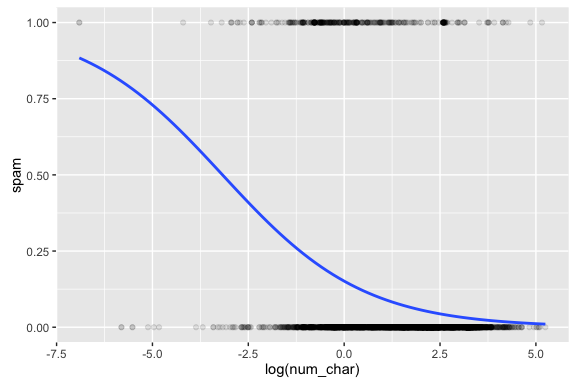
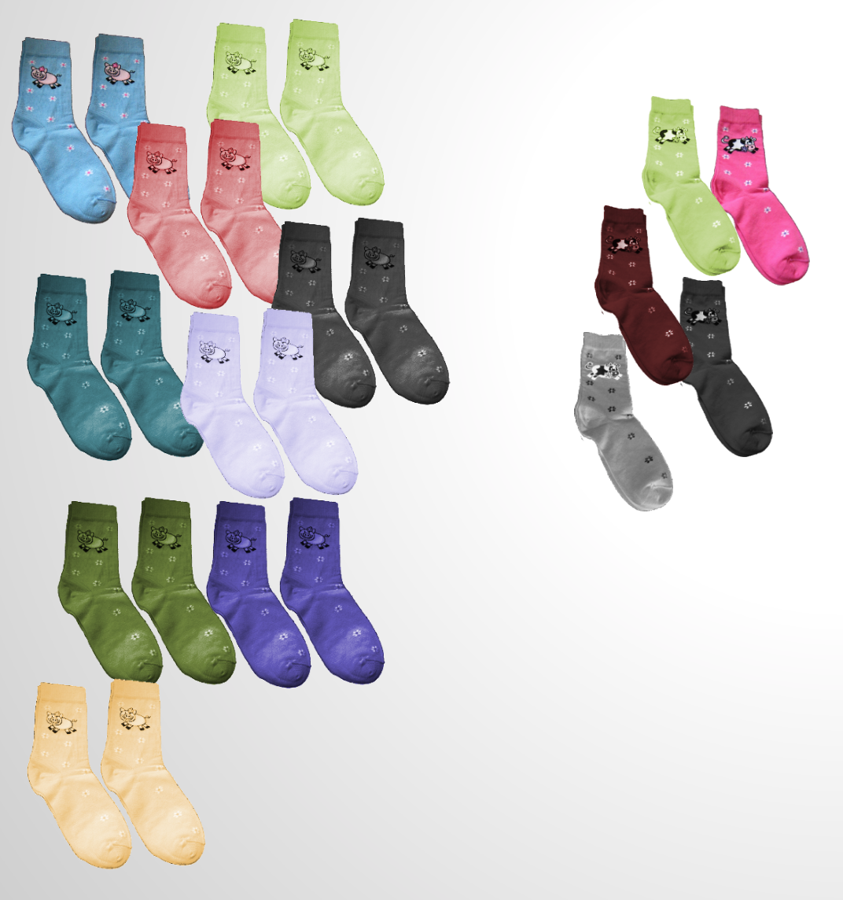
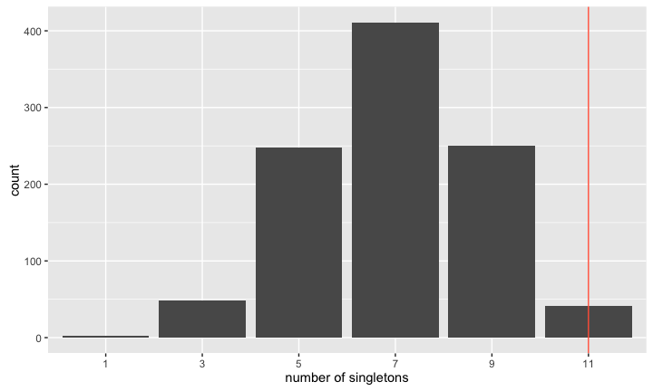
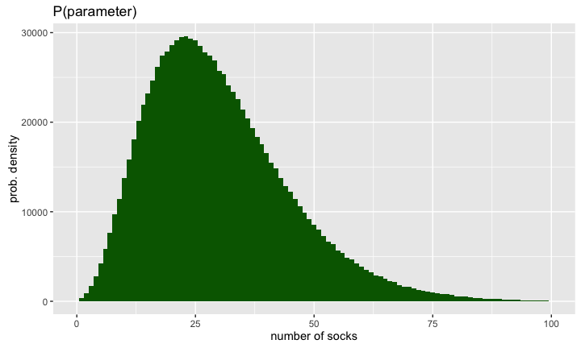
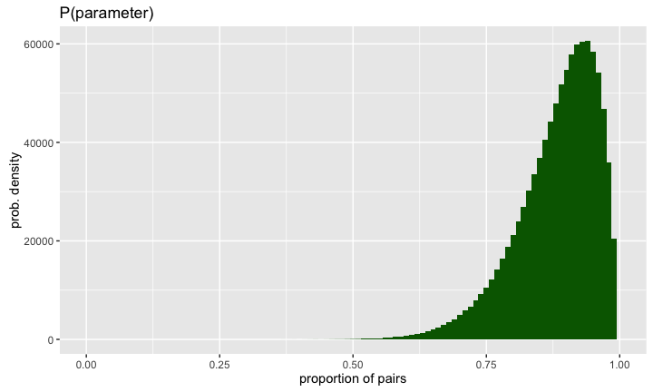
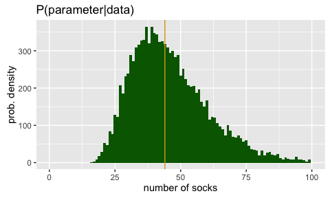

# MATH 141
Chester Ismay  

<style type="text/css">
    ol { list-style-type: upper-alpha; }
</style>


# Review of Logistic Regression

## Logistic Regression for B

$$spam \sim log(num\_char)$$




## {.smaller}

```r
m1 <- glm(spam ~ log(num_char), data = email, family = "binomial")
summary(m1)
```

```
## 
## Call:
## glm(formula = spam ~ log(num_char), family = "binomial", data = email)
## 
## Deviance Residuals: 
##    Min      1Q  Median      3Q     Max  
## -1.815  -0.467  -0.335  -0.255   3.013  
## 
## Coefficients:
##               Estimate Std. Error z value Pr(>|z|)    
## (Intercept)    -1.7244     0.0606   -28.4   <2e-16 ***
## log(num_char)  -0.5435     0.0365   -14.9   <2e-16 ***
## ---
## Signif. codes:  0 '***' 0.001 '**' 0.01 '*' 0.05 '.' 0.1 ' ' 1
## 
## (Dispersion parameter for binomial family taken to be 1)
## 
##     Null deviance: 2437.2  on 3920  degrees of freedom
## Residual deviance: 2190.3  on 3919  degrees of freedom
## AIC: 2194
## 
## Number of Fisher Scoring iterations: 5
```


## Interpreting Logistic Regression {.build}

1. Each row of the summary output is still a hypothesis test on that parameter being 0.
2. A positive slope estimate indicates that there is a positive association between that particular
explanatory variable and the response.
3. Each estimate is still conditional on the other variables held constant.

## Transforming from the logit (Simple case)

The logistic model approximates the $ln(odds)$ using a linear predictor $\beta_0 + \beta_1 X$. If we know
$ln(P/(1-P)) = \beta_0 + \beta_1 X$, what is the formula for $P$?

1. To go from $ln (odds)$ to $odds$, we use the exponential function $e^x$: $odds = e^{ln(odds)}$

2. You can check that if $odds = P / (1 - P)$, then solving for $P$ gives $P = odds/ (1 + odds)$.

- Putting 1 and 2 together gives \[ P = \dfrac{e^{log(odds)}}{1 + e^{log(odds)}}. \]

<center>
- The function $f(x) = e^x / (1 + e^x)$ is commonly known as the _logistic function_, thus, giving the name to logistic regression.
</center>

## A more sophisticated model {.build .smaller}


```r
m2 <- glm(spam ~ log(num_char) + to_multiple + attach + dollar + inherit + 
            viagra, data = email, family = "binomial")
summary(m2)
```

```
## 
## Call:
## glm(formula = spam ~ log(num_char) + to_multiple + attach + dollar + 
##     inherit + viagra, family = "binomial", data = email)
## 
## Deviance Residuals: 
##    Min      1Q  Median      3Q     Max  
## -1.931  -0.455  -0.328  -0.236   3.034  
## 
## Coefficients:
##               Estimate Std. Error z value Pr(>|z|)    
## (Intercept)   -1.59642    0.06443  -24.78  < 2e-16 ***
## log(num_char) -0.54869    0.03831  -14.32  < 2e-16 ***
## to_multiple   -1.92889    0.30493   -6.33  2.5e-10 ***
## attach         0.19970    0.06552    3.05   0.0023 ** 
## dollar        -0.00456    0.01898   -0.24   0.8102    
## inherit        0.40003    0.15166    2.64   0.0083 ** 
## viagra         1.73607   40.59296    0.04   0.9659    
## ---
## Signif. codes:  0 '***' 0.001 '**' 0.01 '*' 0.05 '.' 0.1 ' ' 1
## 
## (Dispersion parameter for binomial family taken to be 1)
## 
##     Null deviance: 2437.2  on 3920  degrees of freedom
## Residual deviance: 2106.3  on 3914  degrees of freedom
## AIC: 2120
## 
## Number of Fisher Scoring iterations: 11
```


## Extending the model {.build}

A GLM consists of three things:

1. A linear combination of predictor variables
2. A distribution of the response variable
3. A link function between the two

- MLR : Normal distribution, identity link function

- Logistic Regression : Binomial distribution, logit link function

- Poisson Regression : Poisson distribution, logarithm link function


# Bayesian Inference


## Karl Broman's Socks {.flexbox .vcenter .build}


## Classical Hypothesis Test {.build}

### Assert a model
$H_0$: I have $N_{pairs}$ pairs of socks and $N_{singles}$ singletons. The first 11 socks that 
I pull out of the machine are a random sample from this population.

### Decide on a test statistic
The number of singletons in the sample: 11.

### Construct the sampling distribution
Probability theory or simulation.

### See where your observed stat lies in that distribution
Find the $p$-value if you like.


## $H_0$ {.flexbox .vcenter .build}


$$N_{pairs} = 9$$


## $H_0$ {.flexbox .vcenter .build}



$$N_{pairs} = 9; \quad N_{singles} = 5$$


## Contructing the sampling dist. {.build}

We'll use simulation.

Create the population of socks:


```r
sock_pairs <- c("A", "B", "C", "D", "E", "F", "G", "H", "I", "J", "K")
sock_singles <- c("l", "m", "n", "o", "p")
socks <- c(rep(sock_pairs, each = 2), sock_singles)
socks
```

```
##  [1] "A" "A" "B" "B" "C" "C" "D" "D" "E" "E" "F" "F" "G" "G" "H" "H" "I" "I" "J"
## [20] "J" "K" "K" "l" "m" "n" "o" "p"
```


## One draw from the machine {.build}


```r
picked_socks <- sample(socks, size = 11, replace = FALSE); picked_socks
```

```
##  [1] "A" "p" "F" "B" "J" "o" "C" "E" "I" "D" "J"
```

```r
sock_counts <- table(picked_socks); sock_counts
```

```
## picked_socks
## A B C D E F I J o p 
## 1 1 1 1 1 1 1 2 1 1
```

```r
n_singles <- sum(sock_counts == 1); n_singles
```

```
## [1] 9
```


## Our simulator {.flexbox .vcenter .build}


## Constructing the sampling dist. {.build}


```r
pick_socks(N_pairs = 9, N_singles = 5, N_pick = 11)
```

```
## [1] 9
```

```r
pick_socks(9, 5, 11)
```

```
## [1] 7
```

```r
pick_socks(9, 5, 11)
```

```
## [1] 7
```

Repeat many, many times...


## The sampling distribution {.flexbox .vcenter}


## The sampling distribution {.flexbox .vcenter}




## The $p$-value {.build}

Quantifying how far into the tails our observed count was.


```r
table(sim_singles)
```

```
## sim_singles
##   1   3   5   7   9  11 
##   2  48 248 411 250  41
```

```r
table(sim_singles)[6]/1000
```

```
##    11 
## 0.041
```


Our two-tailed p-value is 0.082.


## Question

What is the best definition for our $p$-value in probability notation?

1. $\mathbb{P}$($H_0$ is true | data) = 0.041
2. $\mathbb{P}$($H_0$ is true) = 0.041
3. $\mathbb{P}$(data | $H_0$ is true) = 0.041
4. $\mathbb{P}$(data) = 0.041


## Question

What is the best definition for our p-value in probability notation?

1. $\mathbb{P}$($H_0$ is true | data) = 0.041
2. $\mathbb{P}$($H_0$ is true) = 0.041
3. **$\mathbb{P}$(data | $H_0$ is true) = 0.041**
4. $\mathbb{P}$(data) = 0.041


## The challenges with the classical method {.build}

The result of a hypothesis test is a probability of the form:

$$ \mathbb{P}(\textrm{ data or more extreme } | \ H_0 \textrm{ true }) $$

while most people *think* they're getting

$$ \mathbb{P}(\ H_0 \textrm{ true } | \textrm{ data }) $$

How can we go from the former to the latter?


## What we have {.flexbox .vcenter}


## What we want {.flexbox .vcenter}


# Bayesian Modeling
## Bayes Rule {.build}

$$\mathbb{P}(A \ | \ B) = \frac{\mathbb{P}(A \textrm{ and } B)}{\mathbb{P}(B)} $$

$$\mathbb{P}(A \ | \ B) = \frac{\mathbb{P}(B \ | \ A) \ \mathbb{P}(A)}{\mathbb{P}(B)} $$

$$\mathbb{P}(model \ | \ data) = \frac{\mathbb{P}(data \ | \ model) \ \mathbb{P}(model)}{\mathbb{P}(data)} $$

What does it mean to think about $\mathbb{P}(model)$?


## Prior distribution {.build .flexbox .vcenter}

A *prior distribution* is a probability distribution for a *parameter* that 
summarizes the information that you have before seeing the data.




## Prior on proportion pairs {.flexbox .vcenter .build}




## {.flexbox .vcenter}


## {.flexbox .vcenter}


## {.flexbox .vcenter}


## {.flexbox .vcenter}


## {.flexbox .vcenter}


## {.flexbox .vcenter}


## {.flexbox .vcenter}


## Full simulation {.build}


```r
head(sock_sim, 3)
```

```
##   unique pairs n_socks prop_pairs
## 1      3     4      16      0.970
## 2      7     2      33      0.914
## 3      9     1      51      0.929
```

```r
sock_sim %>%
  filter(unique == 11, pairs == 0) %>%
  head(3)
```

```
##   unique pairs n_socks prop_pairs
## 1     11     0      49      0.692
## 2     11     0      37      0.873
## 3     11     0      49      0.815
```


## Proportion of pairs


## Number of socks


## Karl Broman's Socks {.flexbox .vcenter .build}


## The posterior distribution {.build}


* Distribution of a parameter after conditioning on the data
* Synthesis of prior knowledge and observations (data)

### Question: What is your best guess for the number of socks that Karl has?


## Our best guess



- The posterior median is 44 socks.


## Karl Broman's Socks {.flexbox .vcenter .build}


$$ 21 \times 2 + 3 = 45 \textrm{ socks} $$


## Summary {.build}

Bayesian methods . . .

- Require the subjective specification of your prior knowledge
- Provide a posterior distribution on the parameters
- Have strong intuition
- Are computationally expensive


##  {.flexbox .vcenter .build}


