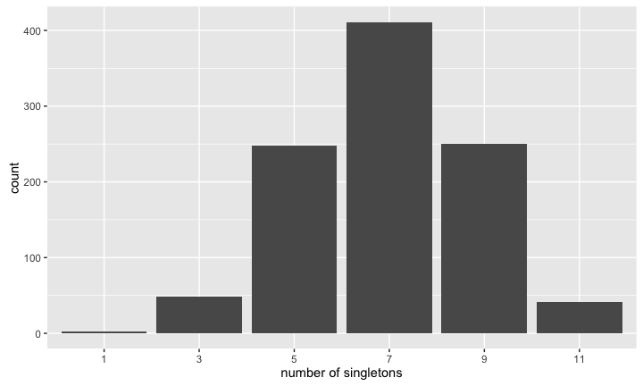
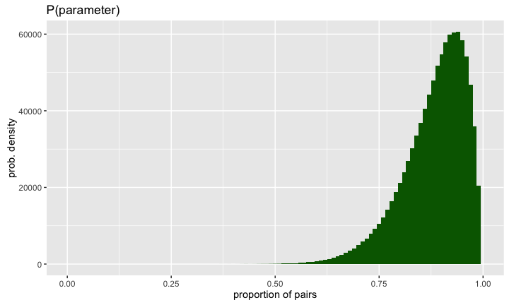
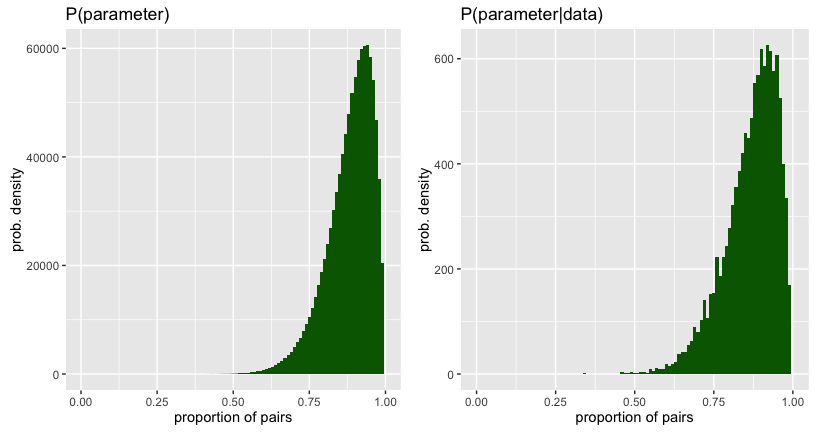
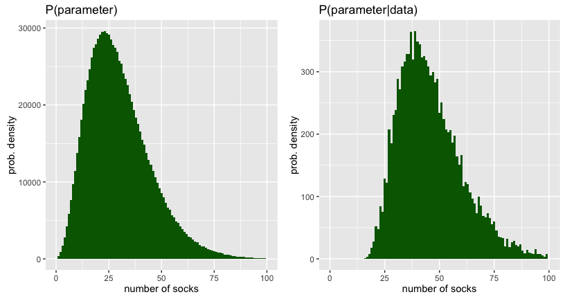

# MATH 141
Chester Ismay  

<style type="text/css">
    ol { list-style-type: upper-alpha; }
</style>


# Bayesian Inference

## Karl Broman's Socks {.flexbox .vcenter .build}


## Classical Hypothesis Test {.build}


Assert a model

- $H_0$: I have $N_{pairs}$ pairs of socks and $N_{singles}$ singletons leading to $N = 2 \cdot N_{pairs} + N_{singles}$. The first 11 socks that I pull out of the machine is a random sample from this population.

Decide on a test statistic

- The number of singletons in the sample: 11.

Construct the sampling distribution

- Probability theory or simulation.

See where your observed stat lies in that distribution

- Find the $p$-value if you like.


## $H_0$ {.flexbox .vcenter .build}


$$N_{pairs} = 9; \quad N_{singles} = 5$$


## Contructing the sampling dist. {.build}

We'll use simulation.

Create the population of socks:


```r
sock_pairs <- c("A", "B", "C", "D", "E", "F", "G", "H", "I", "J", "K")
sock_singles <- c("l", "m", "n", "o", "p")
socks <- c(rep(sock_pairs, each = 2), sock_singles)
socks
```

```
##  [1] "A" "A" "B" "B" "C" "C" "D" "D" "E" "E" "F" "F" "G" "G" "H" "H" "I" "I" "J"
## [20] "J" "K" "K" "l" "m" "n" "o" "p"
```


## One draw from the machine {.build}


```r
picked_socks <- sample(socks, size = 11, replace = FALSE); picked_socks
```

```
##  [1] "I" "F" "m" "K" "D" "A" "n" "C" "E" "G" "E"
```

```r
sock_counts <- table(picked_socks); sock_counts
```

```
## picked_socks
## A C D E F G I K m n 
## 1 1 1 2 1 1 1 1 1 1
```

```r
n_singles <- sum(sock_counts == 1); n_singles
```

```
## [1] 9
```


## Our simulator {.flexbox .vcenter .build}


## Constructing the sampling dist. {.build}


```r
pick_socks(N_pairs = 9, N_singles = 5, N_pick = 11)
```

```
## [1] 9
```

```r
pick_socks(9, 5, 11)
```

```
## [1] 7
```

```r
pick_socks(9, 5, 11)
```

```
## [1] 7
```

Repeat many, many times...


## The sampling distribution {.flexbox .vcenter}




## The sampling distribution {.flexbox .vcenter}


## The $p$-value {.build}

Quantifying how far into the tails our observed count was.


```r
table(sim_singles)
```

```
## sim_singles
##   1   3   5   7   9  11 
##   2  48 248 411 250  41
```

```r
table(sim_singles)[6]/1000
```

```
##    11 
## 0.041
```


Our two-tailed p-value is 0.082.

## The challenges with the classical method {.build}

The result of a hypothesis test is a probability of the form:

$$ \mathbb{P}(\textrm{ data or  more  extreme } | \ H_0 \textrm{ true }) $$

while most people *think* they're getting

$$ \mathbb{P}(\ H_0 \textrm{ true } | \textrm{ data  or  more  extreme}) $$

How can we go from the former to the latter?


## What we have {.flexbox .vcenter}


## What we want {.flexbox .vcenter}


# Bayesian Modeling
## Bayes Rule {.build}

$$\mathbb{P}(A \ | \ B) = \frac{\mathbb{P}(A \textrm{ and } B)}{\mathbb{P}(B)} $$

$$\mathbb{P}(A \ | \ B) = \frac{\mathbb{P}(B \ | \ A) \ \mathbb{P}(A)}{\mathbb{P}(B)} $$

$$\mathbb{P}(model \ | \ data \, or \, more \, extreme) = \frac{\mathbb{P}(data \, or \, more \, extreme\ | \ model) \ \mathbb{P}(model)}{\mathbb{P}(data \, or \, more \, extreme)} $$

What does it mean to think about $\mathbb{P}(model)$?

## Prior distribution {.build .flexbox .vcenter}

A *prior distribution* is a probability distribution for a *parameter* that 
summarizes the information that you have before seeing the data.


## Prior on proportion pairs {.flexbox .vcenter .build}




## {.flexbox .vcenter}


## {.flexbox .vcenter}


## {.flexbox .vcenter}


## {.flexbox .vcenter}


## {.flexbox .vcenter}


## {.flexbox .vcenter}


## {.flexbox .vcenter}


## Full simulation {.build}


```r
head(sock_sim, 3)
```

```
##   unique pairs n_socks prop_pairs
## 1      3     4      16      0.970
## 2      7     2      33      0.914
## 3      9     1      51      0.929
```

```r
sock_sim %>%
  filter(unique == 11, pairs == 0) %>%
  head(3)
```

```
##   unique pairs n_socks prop_pairs
## 1     11     0      49      0.692
## 2     11     0      37      0.873
## 3     11     0      49      0.815
```


## Proportion of pairs





## Number of socks




## Karl Broman's Socks {.flexbox .vcenter .build}


## The posterior distribution {.build}


* Distribution of a parameter after conditioning on the data
* Synthesis of prior knowledge and observations (data)

### Question: What is your best guess for the number of socks that Karl has?


## Our best guess


- The posterior median is 44 socks.


## Karl Broman's Socks {.flexbox .vcenter .build}


$$ 21 \times 2 + 3 = 45 \textrm{ socks} $$


## Summary {.build}

Bayesian methods . . .

- Require the subjective specification of your prior knowledge
- Provide a posterior distribution on the parameters
- Have strong intuition
- Are computationally expensive


##  {.flexbox .vcenter .build}


