# MATH 141
Chester Ismay  

<style type="text/css">
    ol { list-style-type: upper-alpha; }
</style>


## The challenges with the classical method {.build}

The result of a hypothesis test is a probability of the form:

$$ \mathbb{P}(\textrm{ data or  more  extreme } | \ H_0 \textrm{ true }) $$

while most people *think* they're getting

$$ \mathbb{P}(\ H_0 \textrm{ true } | \textrm{ data  or  more  extreme}) $$

How can we go from the former to the latter?


## What we have {.flexbox .vcenter}
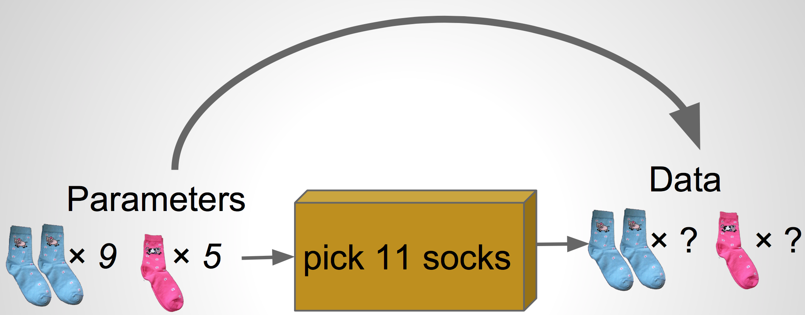


## What we want {.flexbox .vcenter}
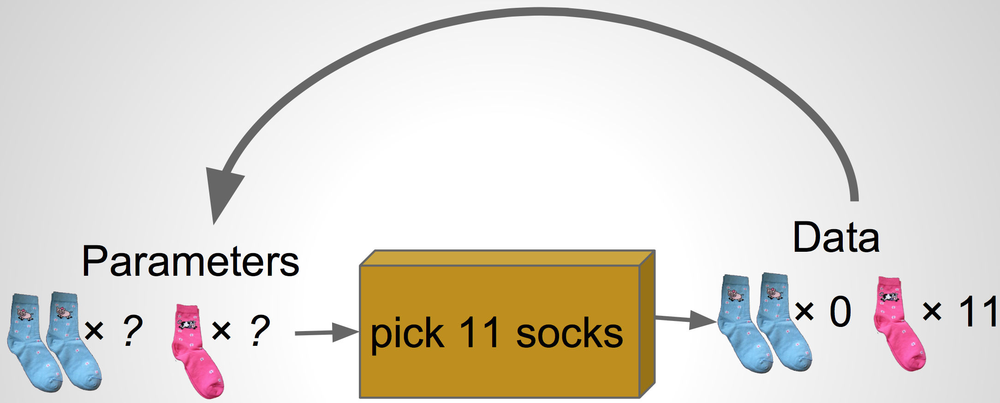


# Bayesian Modeling
## Bayes Rule {.build}

$$\mathbb{P}(A \ | \ B) = \frac{\mathbb{P}(A \textrm{ and } B)}{\mathbb{P}(B)} $$

$$\mathbb{P}(A \ | \ B) = \frac{\mathbb{P}(B \ | \ A) \ \mathbb{P}(A)}{\mathbb{P}(B)} $$

$$\mathbb{P}(model \ | \ data \, or \, more \, extreme) = \frac{\mathbb{P}(data \, or \, more \, extreme\ | \ model) \ \mathbb{P}(model)}{\mathbb{P}(data \, or \, more \, extreme)} $$

What does it mean to think about $\mathbb{P}(model)$?

## Prior distribution {.build .flexbox .vcenter}

A *prior distribution* is a probability distribution for a *parameter* that 
summarizes the information that you have before seeing the data.

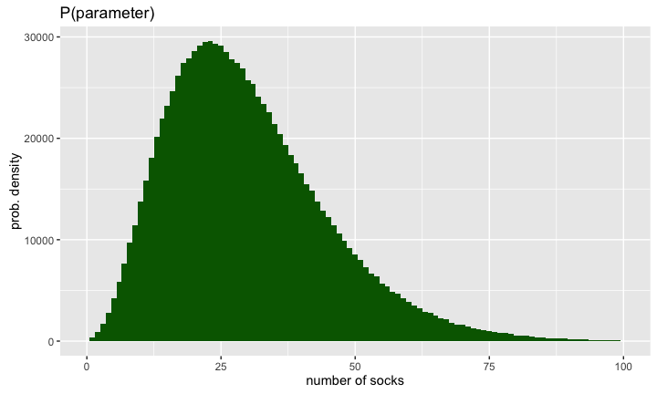


## Prior on proportion pairs {.flexbox .vcenter .build}


## {.flexbox .vcenter}
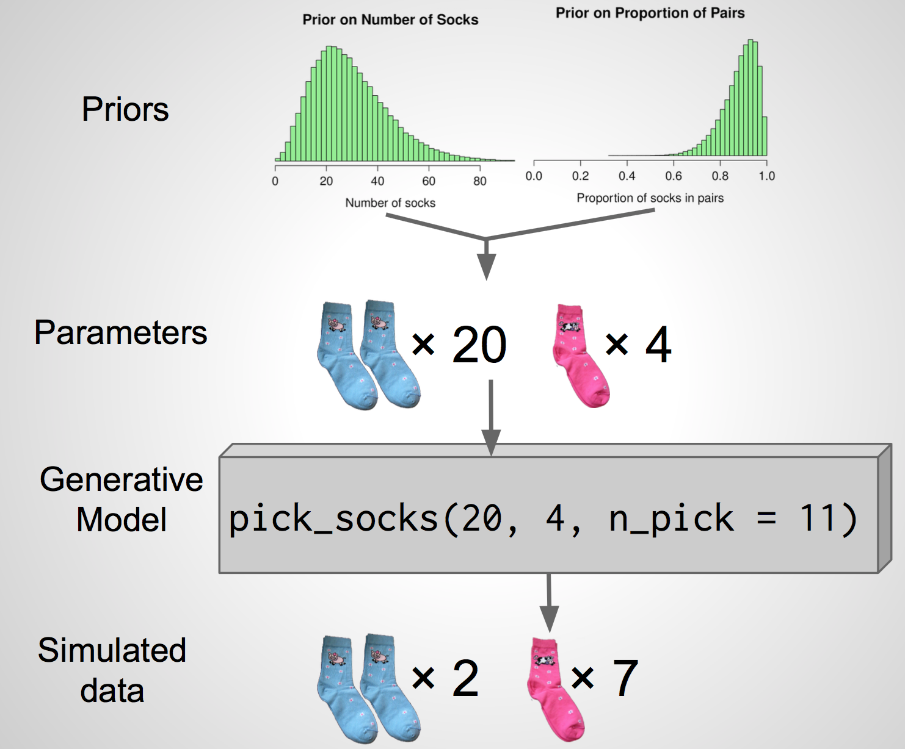


## {.flexbox .vcenter}
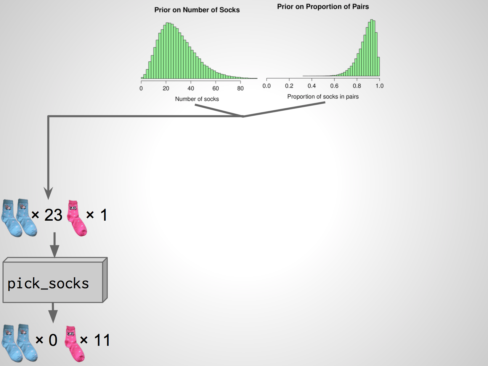


## {.flexbox .vcenter}
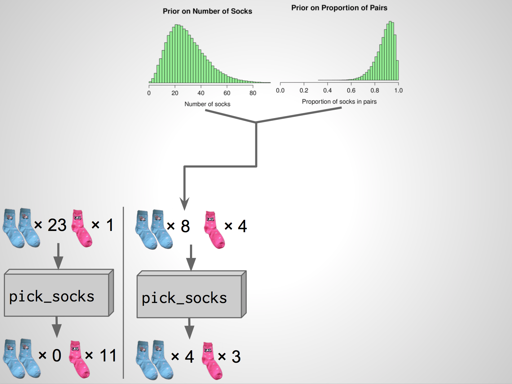


## {.flexbox .vcenter}
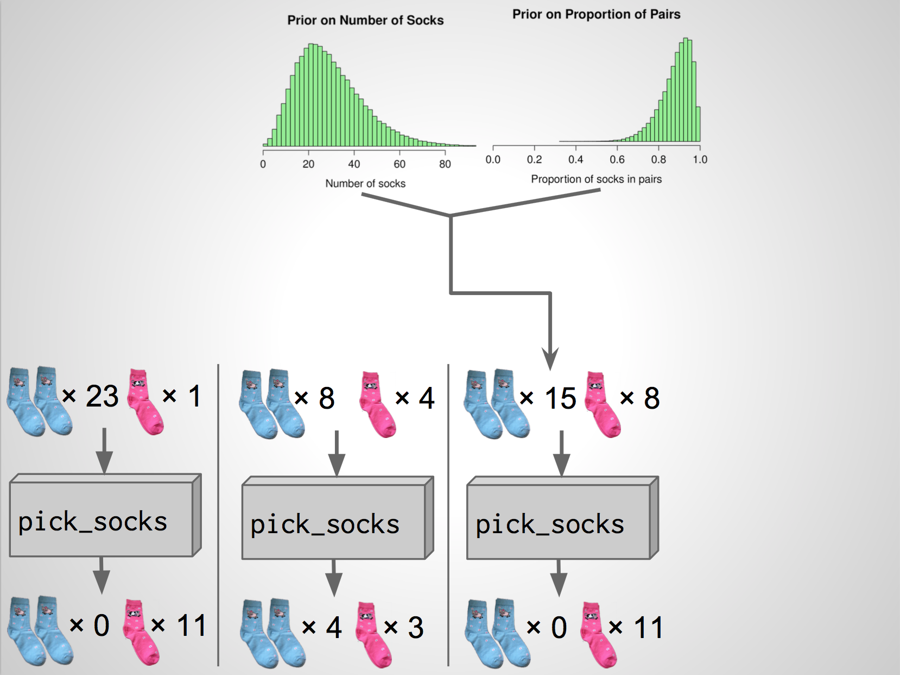


## {.flexbox .vcenter}
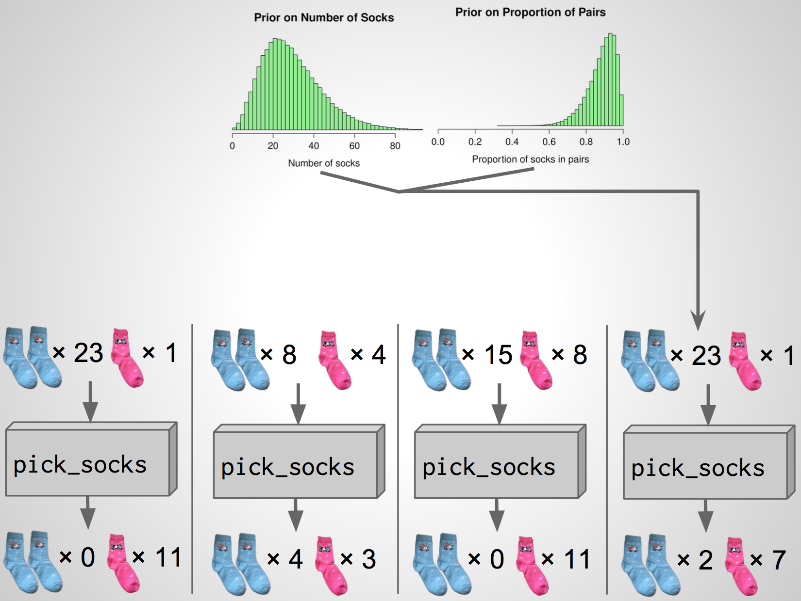


## {.flexbox .vcenter}
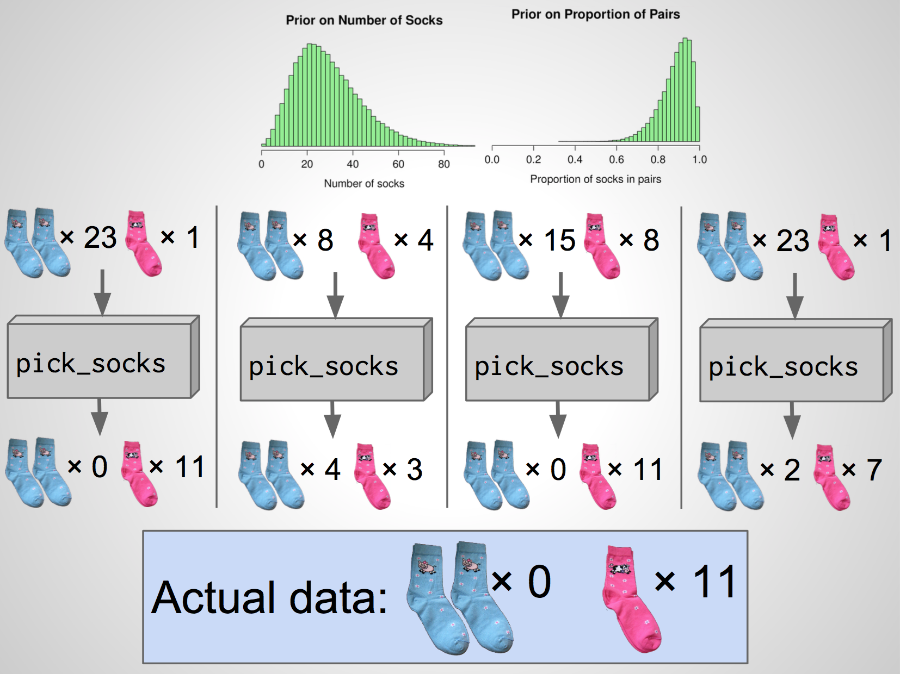


## {.flexbox .vcenter}
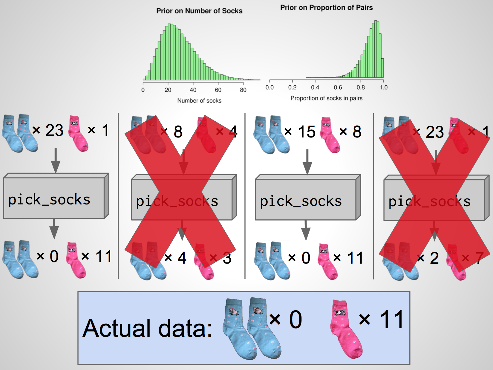


## Full simulation {.build}


```r
head(sock_sim, 3)
```

```
##   unique pairs n_socks prop_pairs
## 1      3     4      16      0.970
## 2      7     2      33      0.914
## 3      9     1      51      0.929
```

```r
sock_sim %>%
  filter(unique == 11, pairs == 0) %>%
  head(3)
```

```
##   unique pairs n_socks prop_pairs
## 1     11     0      49      0.692
## 2     11     0      37      0.873
## 3     11     0      49      0.815
```


## Proportion of pairs


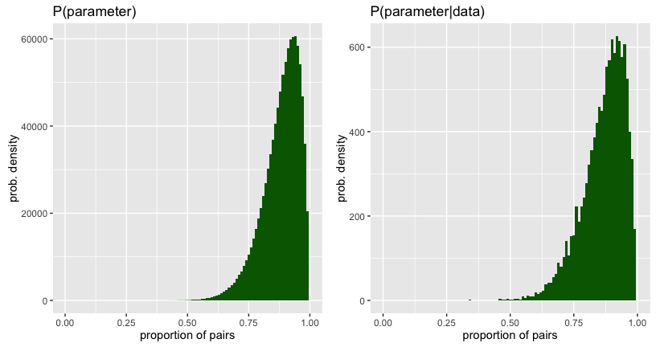


## Number of socks

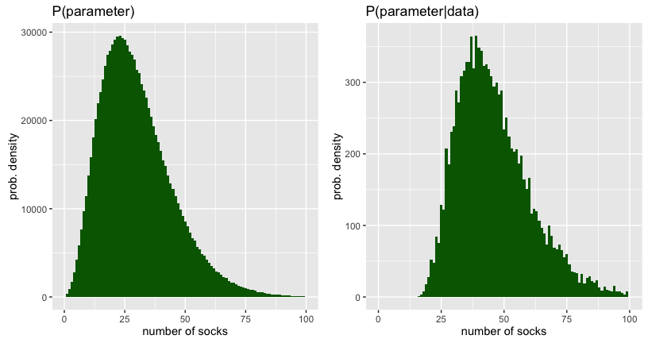


## Karl Broman's Socks {.flexbox .vcenter .build}

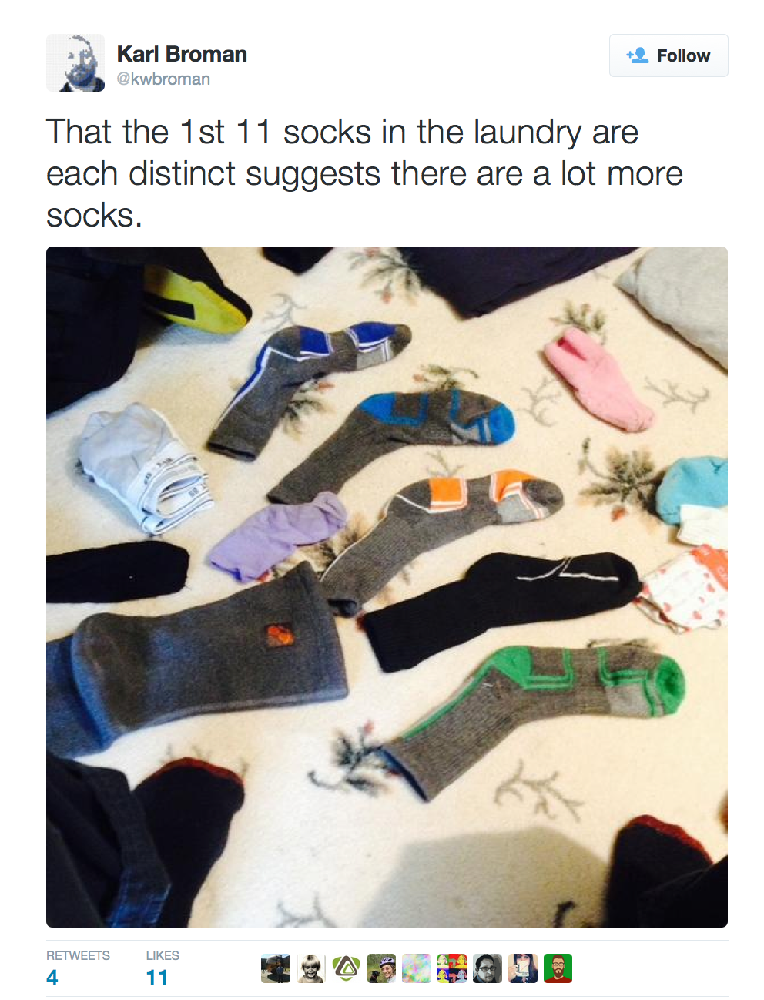


## The posterior distribution {.build}


* Distribution of a parameter after conditioning on the data
* Synthesis of prior knowledge and observations (data)

### Question: What is your best guess for the number of socks that Karl has?


## Our best guess

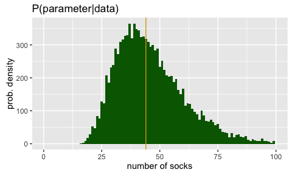

- The posterior median is 44 socks.


## Karl Broman's Socks {.flexbox .vcenter .build}

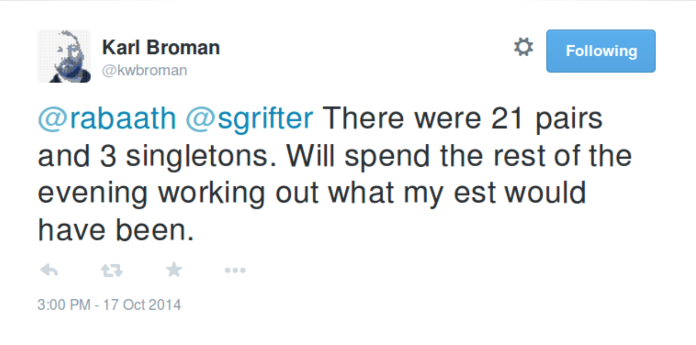

$$ 21 \times 2 + 3 = 45 \textrm{ socks} $$


## Summary {.build}

Bayesian methods . . .

- Require the subjective specification of your prior knowledge
- Provide a posterior distribution on the parameters
- Have strong intuition
- Are computationally expensive


##  {.flexbox .vcenter .build}


