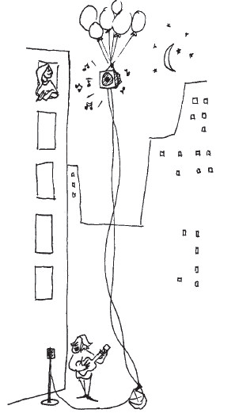

```{r setup, include=FALSE}
pkg <- c("tidyr", "dplyr", "ggplot2", 
  "knitr", "rmarkdown", "readr", 
  "DT","devtools", "broom")

new.pkg <- pkg[!(pkg %in% installed.packages())]

if (length(new.pkg)) {
  install.packages(new.pkg, repos = "http://cran.rstudio.com")
}

lapply(pkg, library, character.only = TRUE)

if(!require(oilabs))
  devtools::install_github("ismayc/oilabs")

options(digits = 3, scipen = 99)
```

# Problem Statement

Sometimes when reading esoteric prose we have a hard time comprehending what the author is trying to
convey. A student project group decided to partially replicate part of a seminal 1972 study by Bransford
and Johnson on memory encoding ("Contextual prerequisites for understanding: Some investigations of
comprehension and recall," _Journal of Verbal Learning and Verbal Behavior_, 11, pp. 717-726). The study
examined college students’ comprehension of following ambiguous prose passage.

> If the balloons popped, the sound wouldn’t be able to carry since everything would be too far away from
the correct floor. A closed window would also prevent the sound from carrying, since most buildings tend
to be well insulated. Since the whole operation depends on a steady flow of electricity, a break in the
middle of the wire would also cause problems. Of course, the fellow could shout, but the human voice is not
loud enough to carry that far. An additional problem is that a string could break on the instrument. Then
there could be no accompaniment to the message. It is clear that the best situation would involve less
distance. Then there would be fewer potential problems. With face to face contact, the least number of
things could go wrong. (p. 719)

Did you understand what the passage was describing? Would it help to have a picture? The picture that
goes along with the passage is shown below:



Before the college students were tested to see whether they understood the passage, they were randomly
assigned to one of three groups, and then each group was read the passage under one of the following cue
conditions:

- Students were shown the picture before they heard the passage.
- Students were shown the picture after they heard the passage.
- Students were not shown any picture before or after hearing the passage.

Is student comprehension of an ambiguous prose passage affected by
viewing a picture designed to aid them in their understanding either before or after or not at all? So our
research conjecture might be: The long-run mean comprehension score differs among the three
treatments.

Fifty-seven randomly selected students were randomly assigned to be in one of the three groups with
nineteen in each group. After hearing the passage under the assigned cue condition, they were given a test
and their comprehension of the passage was graded on a scale of 1 to 7 with 7 being the highest level of comprehension. 
Note that the data collected from this study design will not be paired, but will be
independent, with the outcomes in one treatment group not affecting the outcomes in the other treatment
groups. [Tweaked a bit from @isi2014 [Chapter 9]]

# Competing Hypotheses

## In words

- Null hypothesis: The long-run mean comprehension scores are the same under all three cue conditions (after, before, none).

- Alternative hypothesis:  At least one of the long-run mean comprehension scores is different.

## Another way with words

- Null hypothesis:  There is no association between when/whether a picture is shown and student comprehension of this passage in the population of interest.

- Alternative hypothesis:  There is an association between the variables in the population.

## In symbols (with annotations)

- $H_0: \mu_{after} = \mu_{before} = \mu_{none}$, where $\mu$ represents the long-run mean comprehension score.
- $H_A$: At least one of these parameter means is different from the others

## Set $\alpha$

It's important to set the significance level before starting the testing using the data. Let's set the significance level at 5\% here.

# Exploring the sample data

```{r read_data}
library(dplyr)
library(knitr)
library(ggplot2)
library(oilabs)
# download.file("http://www.math.hope.edu/isi/data/chap9/Comprehension.txt", destfile = "comprehension.txt")
comp <- read.table("comprehension.txt", header = TRUE, stringsAsFactors = FALSE)
```

```{r summarize}
comp_summ <- comp %>% group_by(Condition) %>%
  summarize(sample_size = n(),
    mean = mean(Comprehension),
    sd = sd(Comprehension),
    minimum = min(Comprehension),
    lower_quartile = quantile(Comprehension, 0.25),
    median = median(Comprehension),
    upper_quartile = quantile(Comprehension, 0.75),
    max = max(Comprehension))
kable(comp_summ)
```


The boxplot below also shows the mean for each group highlighted by the red dots.

```{r boxplot}
qplot(x = Condition, y = Comprehension, data = comp, geom = "boxplot") +
      stat_summary(fun.y = "mean", geom = "point", color = "red")
```


## Guess about statistical significance

We are looking to see if a difference exists in the mean comprehension of the three levels of the explanatory variable.  Based solely on the boxplot, we have reason to believe that a difference exists, but the overlap of the boxplots is a bit concerning.

# Check conditions

Remember that in order to use the short-cut (formula-based, theoretical) approach, we need to check that some conditions are met.

1. _Independent observations_:  The observations are independent both within and across groups.

    This condition is met since students were randomly assigned to be in one of the three groups and were initially randomly selected to be a part of the study.

2. _Approximately normal_:  The distribution of the response for each group should be normal or the sample sizes should be at least 30.

```{r hist}
qplot(x = Comprehension, data = comp, geom = "histogram", facets = ~ Condition, binwidth = 1, color = I("white"))
```

```{r qqplot}
qplot(sample = Comprehension, data = comp, facets = ~ Condition)
```

We have some reason to doubt the normality assumption here since both the histograms and the qqplots show some deviation from a normal model fitting the data well for each group.  


3. _Constant variance_:  The variance in the groups is about equal from one group to the next.

    This is met by observing the table above.  The `sd` values are all relatively close and the sample sizes are identical

# Test statistic

The test statistic is a random variable based on the sample data.  Here, we want to look at the ratio of variability **between** the groups over the variability **within** the groups.  This measure we will call $F$ and it represents a measure of the difference in means.  A big observed $F$ ratio corresponds to the variability between groups over-powering the variability within groups.  A small observed $F$ ratio means that the within group variability is much larger than the between group variability.

$F$ is the defined as the ratio

$$
F = \frac{MSG}{MSE}.
$$

Here, $MSG$ is the within group variability.  As a formula,

$$ MSG = \dfrac{\sum_{i = 1}^k n_i (\bar{X}_i - \bar{X})}{k - 1} $$ where $\bar{X}_i$ is the mean for each group $i$, and $\bar{X}$ is the overall mean.

Notice that this is very similar to the variance for looking at the group means compared to the overall mean.  In other words, this is the **between** group variability.

Also, note that $MSE$ can be thought of as a pooled variance estimate, which can be thought as a measure of the **within** group variability:

$$MSE = \dfrac{\sum_{i, j} (X_{ij} - \bar{X}_j)^2}{n_{total} - k} $$

where $n_{total} = n_1 + n_2 + \cdots + n_k$ with $n_i$ being the sample size of group $i$.

## Observed test statistic

While one could compute this observed test statistic by "hand", the focus here is on the set-up of the problem and in understanding which formula for the test statistic applies.  We can use the `inference` function in the `oilabs` package to perform this analysis for us.  Note that to obtain the `F value` given here, you divide the observed $MSG$ value of 17.53 by the observed $MSE$ value of 1.75.  (The use of the word `Residuals` will make more sense when we have covered regression.)

```{r}
inference(y = comp$Comprehension, 
  x = comp$Condition, 
  est = "mean", 
  type = "ht", 
  alternative = "greater", 
  method = "theoretical")
```

We see here that the $f_{obs}$ value is around 10 with $df_G = k - 1 = 3 - 1 = 2$ and $df_E = n_{total} - k   = 57 - 3 = 54$.

# Compute $p$-value

The $p$-value---the probability of observing an $F(df_G = 2, df_E = 54)$ value of 10.012 or more in our null distribution---is 0.0002.  This can also be calculated in R directly:

```{r}
1 - pf(10.012, df1 = 2, df2 = 54)
```


Note that we could also do this test directly without invoking the `inference` function using the `aov` and `anova` functions.  `aov` stands for analysis of variance and its form is similar to what is done using the `lm` function with linear regression.  It fits an analysis of variance model to the data in the same way that `lm` fits a linear regression model to the data.  `anova` displays the resulting ANOVA table for the model fit.

```{r}
comp_anova <- aov(formula = Comprehension ~ Condition, data = comp)
anova(comp_anova)
```


# State conclusion

We, therefore, have sufficient evidence to reject the null hypothesis.  Our initial guess that a statistically significant difference existed in the means was backed by this statistical analysis.  We have evidence to suggest that student comprehension of an ambiguous prose passage is affected by
viewing a picture designed to aid them in their understanding either before or after or not at all.

# Final note

With the conditions near being (or possibly) violated,  one should use randomization to compare our $p$-value there with the value here to see if the assumptions may have been violated.  One could also assess whether the sampling distribution of the $F$ statistic matches well with a Fisher's $F$ distribution using randomization as well.  If the conditions are reasonable, the next step would be to calculate pairwise analyses to better understand the reasons for the rejection of the null hypotheses in the ANOVA.

---

