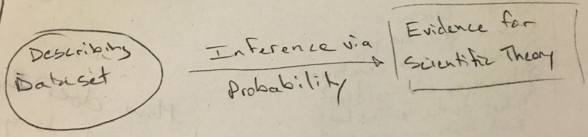

***

1. Load initial course slide

2. Hand out sheets of paper with group letters

  - Don't write anything on the cards yet
  - Meet with other people with cards with same letter as you
  - Three of you will be interviewing the fourth person who will be introducing themselves to you and then rotating
  - You will use both the front and the back of the cards to include information about the two other people in your group
  
3. Who travelled the furthest from Pacific over summer break?

  - Who has the most interesting fact?
  
4. Have them go around the room and introduce themselves 

 - Pronoun
 - Their own interesting fact (I'll try to know everyone's name by Wednesday)

5. Go over questions myself

  - Go to next slide with notebook photo
  - Talk about my background
  - Talk about living in Forest Grove and my positions
  
5. Give them chance to ask me three more questions about me

6. What have we just done?  We've collected lots of different types of data.

  - Draw DATA diagram on chalkboard

7. Identify what type each of the variables on your notecards is

8. Why is this classification useful?

  - The type of data will help us steer visualizations and modeling
  - Certain types of analysis only work when comparing continuous data grouped by a categorical variable, for example
  
9. Load up my website <http://ismayc.github.io>

  - Direct to Teaching, this course link

10. Go briefly over syllabus

  - Urge you to come to my office hours or schedule an appointment with me
  - I check my email frequently and will respond back to you as soon as I can
  - **In person conversations are the best way for us to discuss material**
  - If my hours don't work for you, let's schedule a time to chat
  - Encourage you to work with others on completing homework assignments and labs and discussing course content

10. Talk about labs

  - In the labs we will be using R to work with data and go over content more in depth with examples
  - Labs will be due at 3:00 PM on Tuesdays and then with revisions at 3:00 PM on Thursdays

11. Go back to the main course page

  - A breakdown of what we cover each class period will be available here
  - Read the first two chapters of [Getting used to R, RStudio, and RMarkdown](http://ismayc.github.io/rbasics-book) for Wednesday
  - Read the first two chapters of [A MODERN DIVE into Data with R](https://ismayc.github.io/moderndiver-book/)
    
14. Brief introduction into what we will be doing this semester

15. Continue to remaining slides