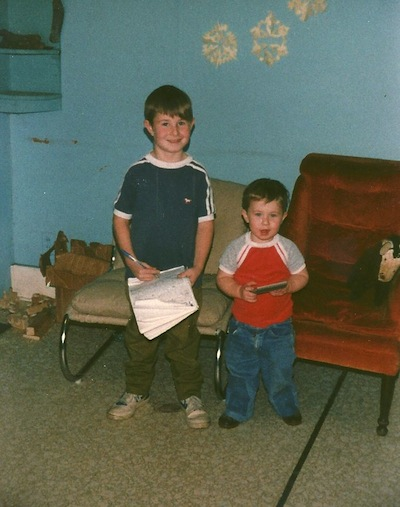

## For interviews in groups of four

1. Name
2. Email address
3. How do you think this course applies to your major?
5. What are your goals for this course?
3. What is your class standing (Freshman, Sophomore, etc.)?
3. What is your major?
4. What is your hometown?
6. What is the farthest from Pacific that you were over spring break (in miles)?
7. What is one interesting fact about you?
8. How old is Chester (in years)?

---

## Slides link

<http://ismayc.github.io/teaching/soc301-f2016/slides/week-01/01a.html>

## Interesting data sets

- Spend some time in your groups brainstorming about a data set that you'd be interested in analyzing.
- It doesn't have to exist.

## Let's begin

- Can eating a yogurt a day cause you to lose weight?
- Do males find females more attractive if they wear red?
- Does louder music cause people to drink more beer?
- Are lions more likely to attack after a full moon?

1. What are the variable(s) in each question?
2. Classify them as categorical or quantitative.

## Syllabus Review

- What are the five most important things to you as you review the syllabus in groups?

- What concerns do you have?

## RStudio Server

<http://beta.rstudio.org>

## Course Textbook

<http://ismayc.github.io/moderndiver-book>

## Supplementary Material

<http://ismayc.github.io/rbasics-book>

## Pre-test

Due by 3:00 PM tomorrow (Tuesday)

<https://www.surveymonkey.com/r/XSYDHJB>

## PS1

Due by 10:00 AM on Wednesday

<https://goo.gl/forms/kOCJIEMpS1i8lqgn1>

Bring your laptops on Wednesday!

## Wednesday plans

- Discuss PS1
- Log-in to RStudio Server
    - Share an RStudio Project with me
    - Install some R packages
- Walk through more of the Getting Used to R book together
- Introduce the use of Plickers