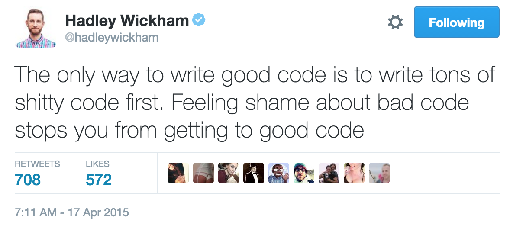

## Learning Quote of the Day {.flexbox .vcenter}

```{r echo=FALSE}

```

## Go over Quiz 1

## A non-Moodle Grade Viewer

<https://ismay.shinyapps.io/soc301_grades/>

## Inefficient email to me

> "I'm confused on Question 4.  I've been working on this for the last three days but I don't get it.  I'd really appreciate it if you got back to me." 

- Student

## Much better email to me

> "Hi Chester.  I'm working on Exercise 4 of Lab 1 and I have a question.  I've tried using the code given in Section 3.2 of MODERN DIVE to solve this problem, but I'm not exactly sure what I need to change.    I've tried changing the code to use ... instead of ..., but I'm receiving an error on line 46 when I try to knit the file.  Here is a link to my RStudio Project:

> https://beta.rstudio.org/s/dec02ea90bcd7e97be111/  

> Thanks so much for your time!"

- Student

## Tidy Data

```{r echo=FALSE}
knitr::include_graphics("tidy-1.png")
```

## Beginning steps

Frequently the first thing you should do when given a dataset is to

- identify the observation unit,
- specify the variables, and
- give the types of variables you are presented with.

This will help you with 

- choosing the appropriate plot, 
- summarizing the data, and 
- understanding which inferences can be applied.

## Next class (Wednesday) plans

- Review Chapter 3 and content in "Getting Used to R" (hereforth denoted as **GUR**)
    - Plicker questions over Chapter 3 going over RQs and material similar to Quiz 1
- Provide time for you to ask questions about Lab 1 and any other questions about working with R

## Assignment for Wednesday

- Read Chapter 3 of MODERN DIVE textbook again
    - Quiz yourself as you read over LC3.1 - LC3.6 again before you continue reading
- Complete RQ3.1 - RQ3.7 and other questions in [PS3](https://goo.gl/forms/2TNQcoCtj7WyfJm92) by 10 AM on Wednesday
- Finish Lab 1
    - Lab 1 draft due on Tuesday at 3 PM
    - Make sure to Knit to HTML for full credit
    - You must attempt all exercises in the lab for credit.  "I don't know how to do this." or "I'm not sure." are not valid reasons.  I'm here to help, but you have to take the initiative to reach out to me!
- Look over comments denoted with **CHESTER: ** in your Rmd file.  I will let you know when comments are available.

## Minute Papers

- What did you struggle with most in studying for the quiz?

- What are you going to do to push through those struggles?

- Have you been reading the textbook and taking notes outside of class?  If not, why not?

- Have you been quizzing yourself on the content you struggle with?  If not, why not?

I am considering a notes check to ensure that you are doing the required readings to prepare for in class.  If you struggle on quizzes, I'm also going to ask that you show me your notecards and how you are preparing.  I want you to succeed and I don't want you to fall behind!


