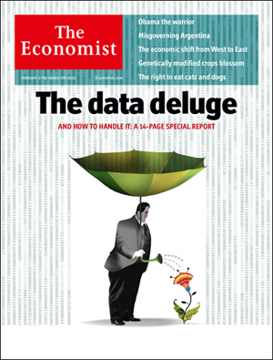
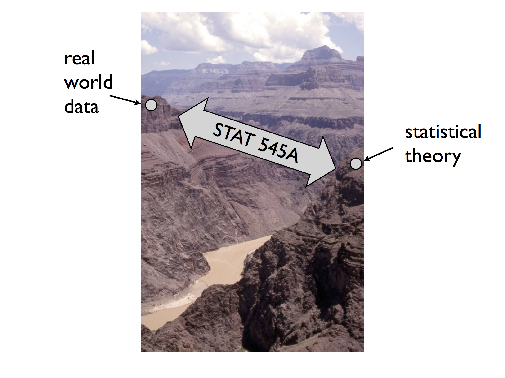

```{r setup, include=FALSE}
knitr::opts_chunk$set(fig.align = 'center')
```


## Learning Quote of the Day {.flexbox .vcenter}

> "Tell me and I forget. Teach me and I remember. Involve me and I learn."

― Benjamin Franklin


## Switching Gears

With the internet, we are in a new age of data:




## Bridging the Gap

> * Meet Jenny Bryan at UBC: <a target="_blank" class="page-link" href="https://github.com/jennybc">GitHub</a> profile
> * She teaches a graduate level class <a target="_blank" class="page-link" href="http://stat545.com/">STAT 545</a> on **Data wrangling, exploration, and analysis with R**. Note the ordering.
> * 


## Classroom vs Real Data

Jenny Bryan said: *"Classroom data are like teddy bears and real data are like a grizzly bear with salmon blood dripping out its mouth."*

Traditional Classroom Data            |  Real Data
:-------------------------:|:-------------------------:
  |  


## Real Data

Some attributes of real data:

> * Often not in a format ready for analysis
> * Messy and needs cleaning
> * Typos, weird outliers
> * Missing values
> * Inconsistent formatting


## Real Data

Inconsistent formatting is a real pain:

> * Dates: "2016/10/12" vs "2016-10-12" vs "10/12/16" vs "10/12/2016" vs "Oct 12, 2016"
> * "DC" vs "D.C." vs "District of Columbia"
> * "Beyonce" vs "Beyoncé"


## `dplyr` Package

To take this, we now officially introduce the `dplyr` package: a grammar of data manipulation

<p align="center">

</p>


## Pedogical Note

Were it not for this package, I probably wouldn't be taking a data-centric view to this course.   

**Why do I have a `dplyr` sticker on my laptop? Why is `dplyr` so good IMO?**

> * The **verb** describing the action you want to perform on your data **IS** the name of the `function()` you use.
> * So you don't need extensive programming experience (indexing, for loops, etc) to be able to manipulate data.


## FMV

Say hello to the FMV: the **five main verbs**

> 1. `select()` columns by variable name
> 1. `filter()` rows matching criteria
> 1. `mutate()` existing variables to create new ones
> 1. `arrange()` rows
> 1. `summarise()` numerical variables that are `group_by()` categorical variables

> - Also, later `_join()` two separate data frames `by` corresponding variables


## Work on Lab 4 together

Keep looking back and forth between book and [cheatsheet](https://www.rstudio.com/wp-content/uploads/2015/02/data-wrangling-cheatsheet.pdf)!


<!--
## Important Concept: Piping

Piping allows you to take the output of one function and **pipe** it as the input of
the next function. You can string along several pipes to form a single **chain**.

* R Command: `%>%`
* Described as: "_then_". 


## Important Concept: Piping

Ex:  say you want to apply functions `h()` and `g()` and then `f()` on data `x`.  You can do

* `f(g(h(x)))` OR
* `x %>% h() %>% g() %>% f()`

This

> * saves you from confusing nested parentheses
> * emphasizes the **sequential** breaking down of tasks, making it more readable
> * i.e. Do this _then_ do this _then_ do this _then_ ...


## Important Concept: Piping

Pipes are always directed to the first argument of any function. The following three bits of R code
do the same thing, extract all january flights:

```{r,eval=FALSE, echo=TRUE}
library(nycflights13)
data(flights)

# Bit 1: No piping
filter(flights, month == 1)

# Bit 2: Piping. Note no comma
flights %>% filter(month == 1)

# Bit 3: Piping across multiple lines (preferred for legibility)
flights %>% 
  filter(month==1)
```
-->


# Finish Lab 4

## To do for next time

- Re-read Chapter 5 and create five of your own problems (in partners if you like) using the `gap` data frame you downloaded for Exam 1.  Save this file as `ps9.Rmd` in your `LastnameFirstname` folder.  You may work on this in partners if you like.  Please email me with whose file you will be sharing and who you are working with.  

- We will work through many of these problems in class on Monday.

## Plan for next time

- Keep working through Chapter 5
- No lab for next week (I'll give you a little break, but you should still be spending 15 minutes a day quizzing yourself.)
- Quiz #3 is Monday, October 24 over Chapters 3, 4, and 5 of [A MODERN DIVE into Data with R](https://ismayc.github.io/moderndiver-book/3-tidy.html).


    