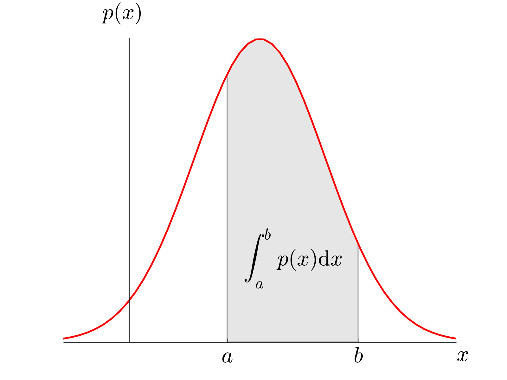
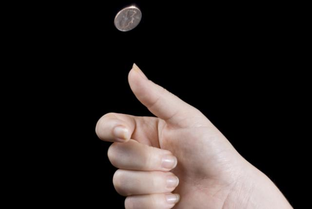
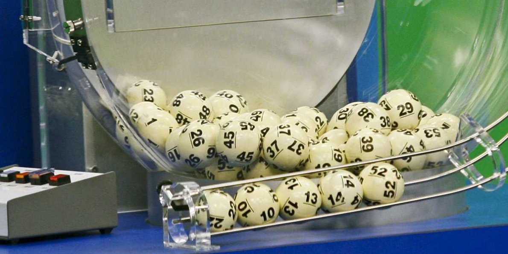

```{r setup, include=FALSE}
knitr::opts_chunk$set(echo = FALSE)
```

```{r, echo=FALSE, message=FALSE, warning=FALSE}
library(tidyverse)
library(knitr)
```

## Learning Quote of the Day {.flexbox .vcenter}

> "For me, I am driven by two main philosophies: know more today about the world than I knew yesterday and lessen the suffering of others. You'd be surprised how far that gets you."

― Neil deGrasse Tyson

## Retrieval practice (5 minutes)

- Write down your name at the top of the page
- Write down as many of the key terms as you can think of from Chapter 5
- On the back of the piece of paper, write down as many of the key terms as you can think of from Sections 6.1 and 6.2 (your reading assignment for today). Here is a hint to get you going: "sample."

## Today: Switching Gears

* We've covered "Tidy", "Transform", and "Visualize"
* Start with "Model"


## Key Definitions

Let's ask our favorite search engine:

* Define inference
* Define **statistical** inference

## Key Definitions

> - The *population* is the (usually) large pool of observational units that we are interested in.

> - A *sample* is a smaller collection of observational units that is selected from the population.

> - *Sampling* refers to the process of selecting observations from a population.  There are both random and non-random ways this can be done.

> - A sample is said be a *representative sample* if the characteristics of observational units selected are a good approximation of the characteristics from the original population.

> - *Bias* corresponds to a favoring of one group in a population over another group.

## Key Definitions

> - *Generalizability* refers to the largest group in which it makes sense to make inferences about from the sample collected.  This is directly related to how the sample was selected.

> - A *parameter* is a calculation based on one or more variables measured in the population.  Parameters are almost always denoted symbolically using Greek letters such as $\mu$, $\pi$, $\sigma$, $\rho$, and $\beta$.

> - A *statistic* is a calculated based on one or more variables measured in the sample.  Parameters are usually denoted by lower case Arabic letters with other symbols added sometimes.  These include $\bar{x}$, $\hat{p}$, $s$, $r$, and $b$. 


## The Paradigm for the Rest of the Class {.flexbox .vcenter}


## 

For each of the following 3 scenarios, 

- Identify the **population** of interest and the **population parameter**
- Identify the **sample** used and the **statistic**
- Comment on the **representativeness/generalizability** of the results of the sample to the population.

1. You want to know the average income of Pacific University graduates in the last 10 years.  So you get the records of 10 randomly chosen Pacific graduates.  They all answer and you take the average.
1. Imagine it's 1993 i.e. almost all households have landlines.  You want to know the average number of people in each household in Forest Grove.  You randomly pick out 500 numbers from the phone book & conduct a phone survey.
1. You want to know the prevalence of illegal downloading of TV shows among Pacific University students.  You get the emails of 100 randomly chosen Pacific University students and ask them "How many times did you download a pirated TV show last week?"


## Recall

* **Random** sampling: where we select the sample from the population in an unbiased fashion
* Bias: A sample is biased if some observational units have a higher **probability** of being
included in the sample. 

> * Keywords: **random** and **probability**


## Probability

* In short: Probability is the study of randomness.
* Its roots lie in one [historical constant](https://www.google.com/search?q=probability&newwindow=1&source=lnms&tbm=isch&sa=X&ved=0ahUKEwjnvJG7_oTQAhVIQiYKHSQ7CnoQ_AUICSgC&biw=2559&bih=1316&dpr=2#newwindow=1&tbm=isch&q=history+of+gambling).


## Probability in History

In 79 AD a volcanic eruption in the Roman city of Pompeii covered the entire city
in hot ash, perfectly preserving many items...


## Probability in History

... including a Pompeii exhibit in Montreal:


## Two Approaches to Probability

There are two approaches to studying probability:

Mathematically             |  Simulations
:-------------------------:|:-------------------------:
  |  

> * **Note**: The "random simulation" in question is not limited to coin flips.


## Two Approaches to Probability

> * The mathematical approach to studying probability requires more mathematical background: set theory, discrete math, calculus, and later on measure theory.
> * The simulation approach does not.
> * Instead we require a computer's **random number generator** to generate simulations. Why?


## Simulations via Computer

Doing this repeatedly by hand is tiring:


## Analogy for Random Simulation

> * Analogy for rest of course: POWERBALL
> * 
> * We can model **any** random simulation by tinkering with the following **attributes** of Powerball:


## Attributes of Powerball

* Atrributes of the Lottery Machine:
    * How many balls do you have?
    * What are written on the balls?
    * Do the balls have equal probability of being picked?
* Attributes of the Drawing:
    * How are you drawing the balls?
    * How many balls do you draw?
    * What are you recording about each drawn ball?
    * What do you do with drawn balls?
* Number of Lotteries:
    * How many times do you repeat the lottery?


## Tools

All hail the `mosaic` package, which you will need to install on the RStudio Beta Server via `install.packages("mosaic")`. Load as usual: `library(mosaic)`

The following 4 functions will give us (most of) the random simulation tools we need:

> 1. `rflip()`: Flip a coin
> 1. `shuffle()`: Shuffle a set of values (akin to cards)
> 1. `do()`: Do the same thing many, many, many times
> 1. `resample()`: the swiss army knife of functions

## R Example

```{r, message=FALSE, echo=TRUE}
# Load packages, including mosaic package
library(dplyr); library(ggplot2); library(mosaic)

# Flip a coin once. Try this multiple times:
rflip()
```

## R Example
```{r echo=TRUE}
# Flip a coin 10 times. Try this multiple times:
rflip(10)
```

## R Example

```{r echo=TRUE}
# Flip a coin 10 times, but do this 5 times. Try this multiple times
do(5) * rflip(10)
```

## R Example

```{r echo=TRUE}
# Flip a coin 10 times, but do this 500 times
do(500) * rflip(10)
```

## R Example

```{r echo=TRUE}
# Gah! There are too many rows!
simulations <- do(500) * rflip(10)

# We could also View() it
View(simulations)
```

## R Example {.flexbox .vcenter}

```{r echo=TRUE, fig.height=4}
# Plot our resulting proportions
simulations %>% ggplot(aes(x = prop)) +
  geom_histogram(binwidth = 0.1, color = "white")
```


## R Example {.flexbox .vcenter}

```{r echo=TRUE, fig.height=4}
# Plot our resulting proportions
simulations %>% ggplot(aes(x = factor(prop))) +
  geom_bar()
```

## For next time

- Read all of Chapter 6 of MODERN DIVE
- Bring treats for the class as payment for my willingness to wear this while teaching a course
- Carefully review the content of Chapter 6 and take notes on important concepts
    - I will be doing a "notes check" at the beginning of class on Wednesday
    - "I don't take notes" is not an acceptable response.  You have to show me you are working on learning the material outside of class.
- We'll be discussing "bootstrapping" on Wednesday.  Remember that this chapter is VITAL to your understanding for the rest of the course.

# Questions about Lab 6

## Reflection exercise

- Write down your name at the top of the page
- Write down as many of the key terms as you can think of from Chapter 5
- On the back of the piece of paper, write down as many of the key terms as you can think of from lecture today.

