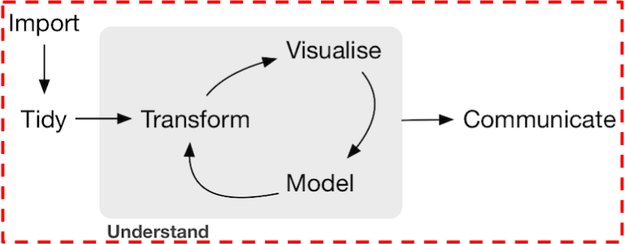

```{r setup, include=FALSE}
knitr::opts_chunk$set(echo = TRUE)
set.seed(79)
library(tidyverse)
library(lubridate)
library(knitr)
```

## Learning Goals

**Only one**: *Have students engage in the
data/science research pipeline in as faithful a manner as possible while
maintaining a level suitable for novices*:




#### Format

* Your final project will center around writing a "data journalism" style 
newspaper article suitable for publication in <a href =
"http://www.pacindex.com/" target = "_blank">The Pacific Index
newspaper</a>. In other words, your target audience is the Pacific University community and your focus should be on sociology-related data.
Examples of such types of journalism can be found on:
    + <a href = "http://fivethirtyeight.com/" target = "_blank">FiveThirtyEight</a>
    + The New York Times' <a href = "http://www.nytimes.com/section/upshot" target = "_blank">The Upshot</a>
* You must flex your "statistical and data science" muscles you've
built this semester. In particular:
    + Data visualization and manipulation
    + Statistical Inference: hypothesis testing, confidence intervals, and (possibly) regression

## Administrative Notes

* **Submission Format**: Each group must create a single RStudio Server shared 
project that is shared amongst the group members and with me (please email the
URL to me). All your work will be centrally located here; do not email me any
files.
* **Project Proposal**: Submitted latest by Monday, November 21 by 2 PM
    + In class: Printed copy of project proposal
    + In the RStudio Server group shared folder:
        + Electronic copy of project proposal
        + All data files and if possible an `.Rmd` file that loads them into R so that you can `View()` them.
* **Feedback Session**: Held latest by Wednesday, November 30
    + To make sure your project idea is feasible, after you've submitted your
    proposal and I've read it, your group must schedule to speak to me during
    office hours so that I can give feedback. Please note the earlier you complete this, the more breathing room
    this will give you.
* **Electronic-Only Final Project Submission**: Due Monday, December 5
    + In the RStudio Server group shared folder:
        + A `final_project.Rmd` file that completely reproduces your analysis i.e. I should have to press Knit only once to recreate the entire HTML page.
        + All necessary data files.
        + Publish your final project to Rpubs.com.  (Send me an email with a link to your Rpubs submission final result.)
    + Individually: A Google Forms survey, which I will email on Friday, December 2 by 5pm.
    + Your project won't be considered submitted until I give you email confirmation that everything looks good.
* **Office Hours**: Scheduled by appointment
* **Honor Code**: This is the equivalent of an academic term paper; all honor code rules about plagarism and citations apply.


## Project Proposal

#### Write-Up

Your group proposal (to be submitted in print and electronically in a RStudio
Server shared project) should contain the following:

1. **Title**: The title of your project.
1. **Group Members**: List of all group members.
1. **Purpose**: Describe the general topic/phenomenon you want to explore:
    + Why should a Pacific student be interested in your work? 
    + What do you hope people will learn from your project?
1. **Scientific Question**: Journalism, just like academic writing, has the goal
of answering questions, but with a slightly more informal tone. What is the 
scientific question you want to answer using data?
1. **Data Sources**: Describe where you will find/access your
data. Be as specific as you can, listing URLs and file formats if possible.
1. **Data Format**: Describe what your
tidy format data set looks like:
    * How many tables will you have? What are the observational units of each table?
    * How many rows does each table have?
    * How many columns does each table have and what are their names i.e. the
    variables? What are their units?


#### Data Sets

* Your **immediate goal** should be to get some data loaded into RStudio. This 
may take a few rounds of back-and-forth discussion with me as finding the right
data sets will be among the bigger challenges of this project, as it needs to
balance:
    + Being complex enough to use the statistical and data sciences toolbox developed this semester.
    + Being rich enough to be able to answer meaningful scientific questions with them.
    + Not being so complex and rich that you are overwhelmed, as you are only novices.
* Having two or more different data sets to join is not an explicit requirement
for this project; your scientific question will dictate this need.
* If you're having trouble finding specific data that you have in mind, make an
appointment with the Pacific University librarians.


## Electronic-Only Final Project Submission

Roughly speaking, your final project submission will have two major components:

* The actual journalism article. As to knowing the guidelines (length, format,
tone), just ask yourself: "What does a newspaper/online news story sound like?"
* A supplementary materials section that goes more in depth about the
nitty-gritty details, that one might want to spare casual readers from, but
include for people wanting to learn more.
* A `final_project.Rmd` template file is available [here](http://ismayc.github.io/teaching/soc301-f2016/slides/week-12/Final_Project.Rmd).  Please download this file to your computer and then Upload it to [the RStudio Server](http://beta.rstudio.org).


