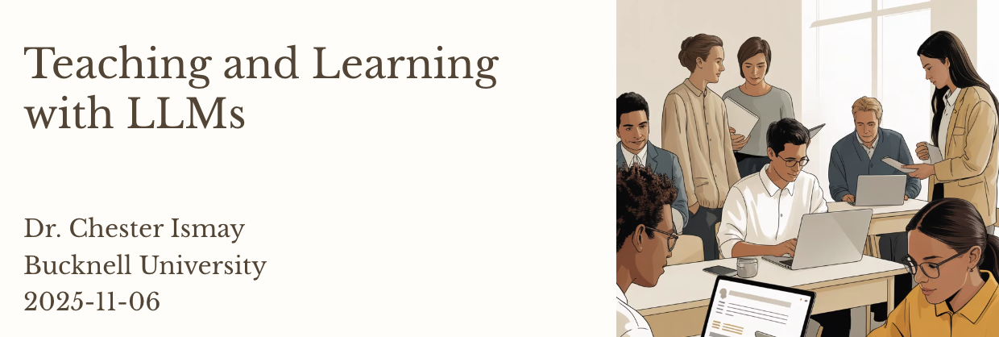
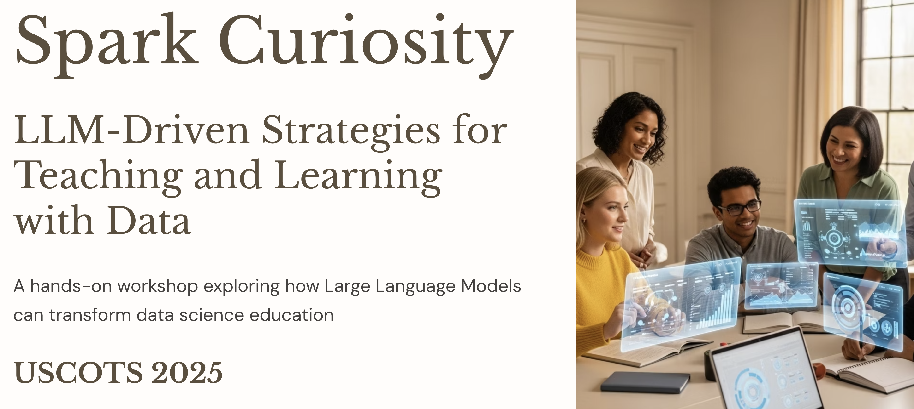
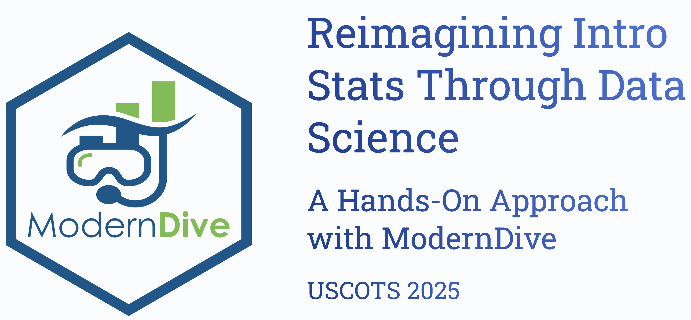
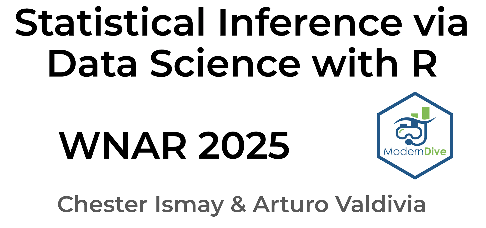

## In-person

  

  
  
  <a href="https://datascience.scholar.bucknell.edu/workshop/">Bucknell University 2025</a>
    

 
 

Each of the following were co-led with [Arturo Valdivia](https://stat.indiana.edu/about/core-faculty/core-faculty/valdivia-arturo.html).

  

  

<a href="https://www.causeweb.org/cause/uscots/uscots25/program/workshops/w16">USCOTS 2025</a>

  

  

  
  
  <a href="https://www.causeweb.org/cause/uscots/uscots25/program/workshops/w11">USCOTS 2025</a>

  

  

  
  
  <a href="https://whova.com/embedded/session/hRqar%40ceM1oCRxx8SaTASu%40-ruGH1z6nVU55djYhzR8%3D/4627684/?widget=primary">WNAR 2025</a>

  

  

  
  
  <a href="https://whova.com/embedded/session/hRqar%40ceM1oCRxx8SaTASu%40-ruGH1z6nVU55djYhzR8%3D/4627679/?widget=primary">WNAR 2025</a>

  

---

## Virtual Synchronous

### [O'Reilly Learning](https://www.oreilly.com/search/?q=author%3A%22Chester%20Ismay%22&rows=100)

  - [Deep Learning Made Simple](https://github.com/ismayc/oreilly-deep-learning-made-simple)
  - [GenAI-Powered Data Analysis with Python](https://github.com/ismayc/oreilly-genai-powered-data-analysis-with-python)
  - [Machine Learning for Data Analytics with Python](https://github.com/ismayc/oreilly-ml-for-data-analytics-with-python)
  - [Fundamentals of Statistics with Python](https://github.com/ismayc/oreilly-fundamentals-of-statistics-with-python)
  - [Statistical Inference and Modeling with Python](https://github.com/ismayc/oreilly-statistical-modeling-and-inference-with-python)
  - [Data Analysis with Python](https://github.com/ismayc/oreilly-data-analysis-with-python)

### Instats

  - [Statistics in R with the Tidyverse](https://instats.org/seminar/statistics-in-r-with-tidyverse3)
  - [Exploratory Data Analysis in R with the Tidyverse](https://instats.org/seminar/exploratory-data-analysis-in-r-with-tidy3)

### Portland State University

  - [Fundamentals of Data Analysis](https://www.pdx.edu/professional-education/da401-fundamentals-of-data-analytics)
  - [Data Warehousing](https://www.pdx.edu/professional-education/da402-data-warehousing)
  - [Data Mining](https://www.pdx.edu/professional-education/da403-data-mining)

---

## Virtual Asynchronous

### Udacity

- [Data Warehouses on AWS](https://www.udacity.com/course/data-engineering-with-aws--nd027) (Course 2 of the Data Engineering with AWS Nanodegree)

### DataCamp

- [Programming with `dplyr`](https://www.datacamp.com/courses/programming-with-dplyr)
